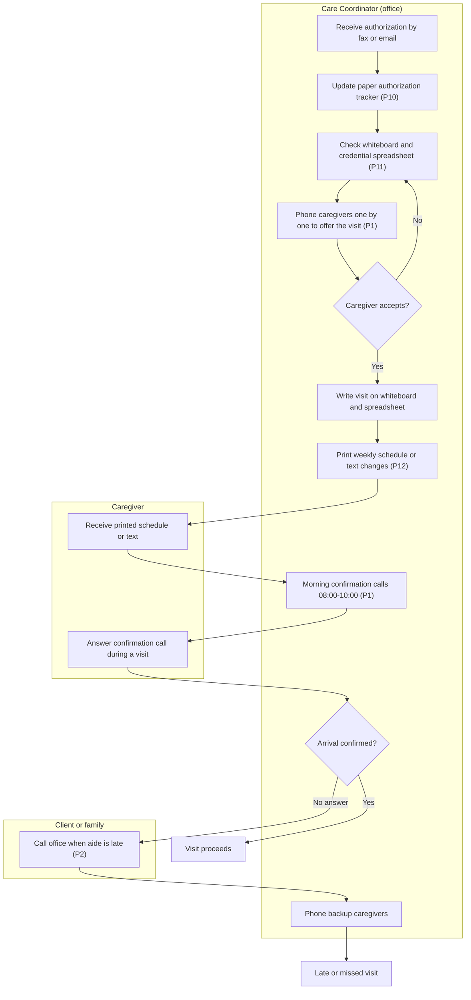
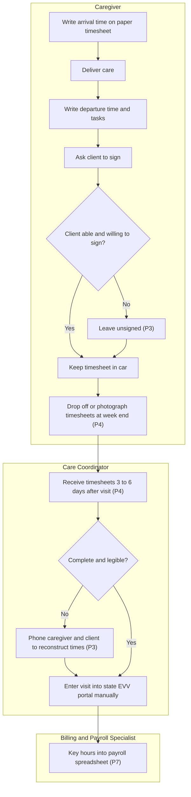
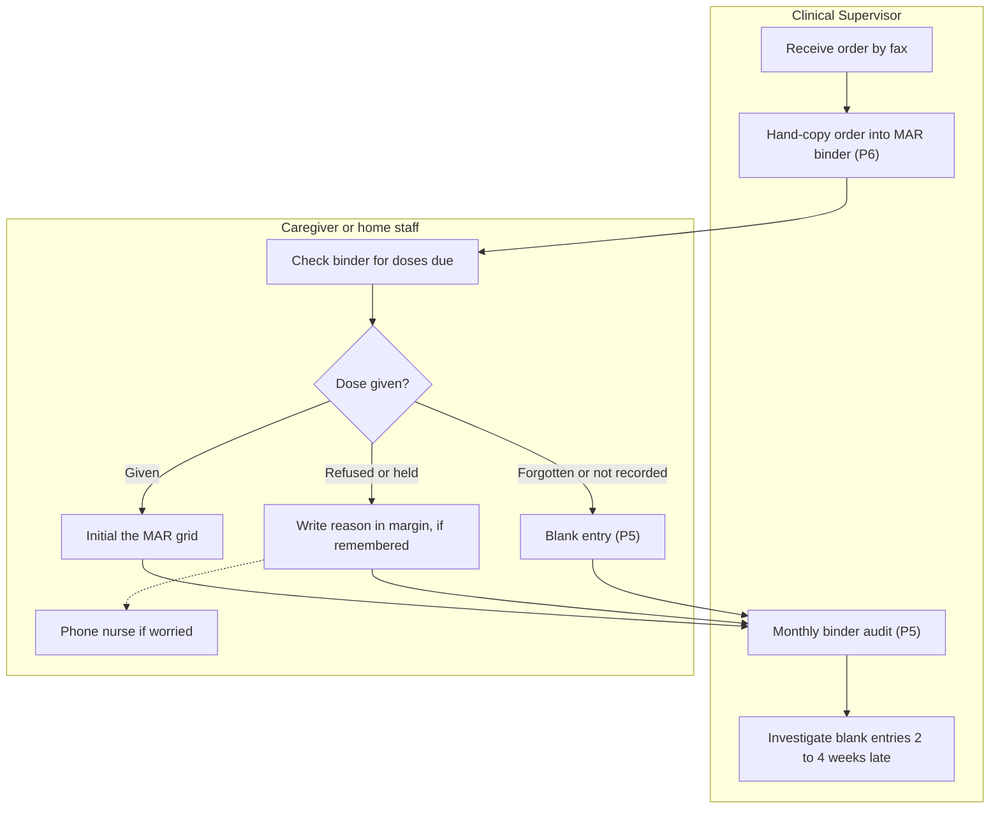
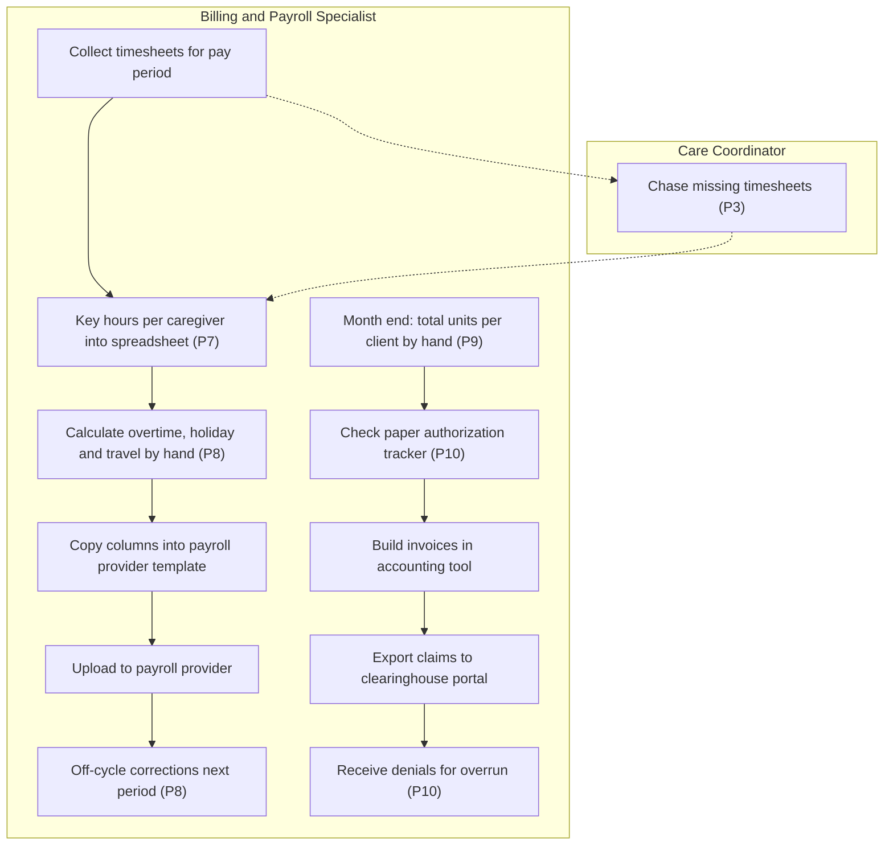
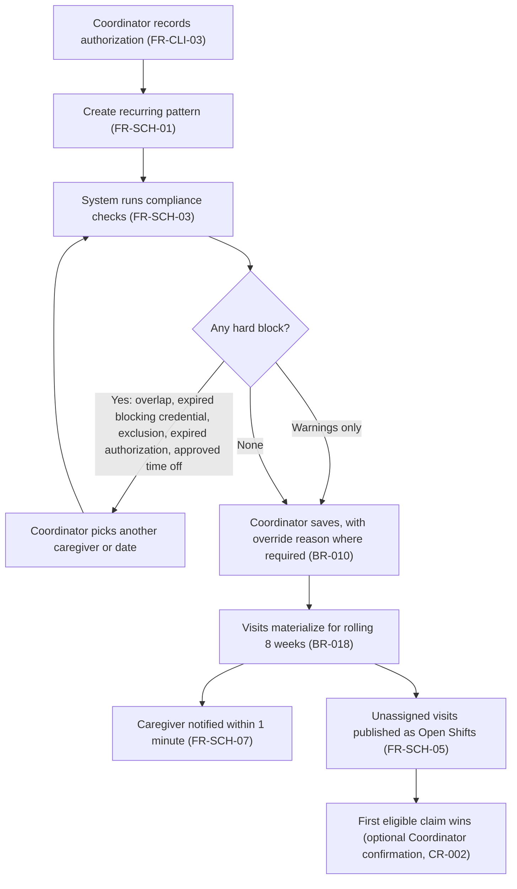
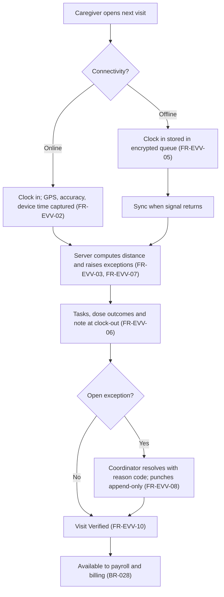
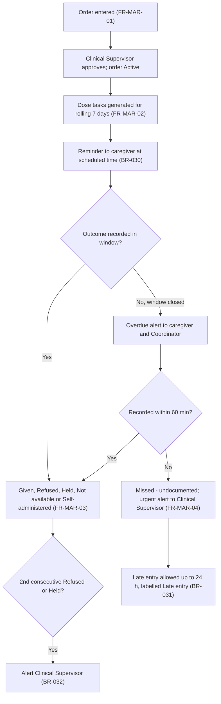

# Current vs Future State Analysis

## Document control

| Field | Value |
|---|---|
| Document ID | TW-DIS-04 |
| Version | 1.1 |
| Status | Approved |
| Owner | Business Analyst |
| Last updated | 2026-03-20 |
| Reviewers | Product Owner, Engineering Lead, Clinical SME (RN advisor), UX Designer, pilot agency administrators (TEN-001, TEN-002, TEN-003) |

| Version | Date | Change |
|---|---|---|
| 1.0 | 2026-02-26 | AS-IS maps, pain points and gap analysis from discovery |
| 1.1 | 2026-03-20 | TO-BE flows aligned with SRS v1.0; gap table traced to FR IDs |

### Purpose and scope

This document shows how the pilot agencies work today, where that process fails, and how Tendwell R1 changes it. It covers four AS-IS processes: scheduling and visit confirmation, visit verification by paper timesheet, medication administration with MAR binders, and spreadsheet payroll and billing. The Business Analyst mapped each AS-IS process from job shadowing (6 home visits), observation of office staff, and document analysis (2 pay periods of timesheets, 3 months of MAR binders, 6 months of billing denials). Pilot agency staff validated the maps in the discovery workshops. Each pain point is quantified and traced to the requirement that closes it, so the business case and the requirements share one evidence base.

Detailed TO-BE behavior is specified in the [SRS](../02-requirements/SRS.md) and [process flows](../03-design/diagrams/process-flows.md); the TO-BE views here are business-level.

## 1. AS-IS process maps

Nodes marked `P#` show where a pain point (section 2) occurs.

### 1.1 Scheduling and visit confirmation by phone

### 1.2 Visit verification by paper timesheet

### 1.3 Medication administration with MAR binders

### 1.4 Spreadsheet payroll and billing

## 2. Pain points

| ID | Pain point | Quantification (baseline) | Evidence source | Personas | Objective |
|---|---|---|---|---|---|
| P1 | Visit confirmation and offers run on phone calls | 2.4 h per coordinator per day; 31 confirmation calls observed in one morning | Observation at TEN-001 (2026-01-22); coordinator interviews | PER-02, PER-01 | OBJ-01 |
| P2 | Late and missed visits are discovered by families | 2.8% of visits missed; average detection 47 min after scheduled start | Complaint log (6 months), TEN-001 | PER-02 | OBJ-01 |
| P3 | Paper timesheets are incomplete or illegible | 19% of visits lack complete EVV data (81% complete); 21 of 118 timesheets in one period needed follow-up | Document analysis of 2 pay periods | PER-01, PER-02, PER-04 | OBJ-01 |
| P4 | Timesheets arrive late and are re-keyed | Arrive 3 to 6 days after the visit; 1.5 min keying per visit; 9% keying error rate in a sample of 200 | Document analysis; time-and-motion | PER-04 | OBJ-02 |
| P5 | Medication gaps found weeks later | 4.6% of scheduled doses undocumented; found on average 18 days after the dose | Audit of 3 months of MAR binders at TEN-003 and TEN-001 | PER-03 | OBJ-03 |
| P6 | Orders are hand-transcribed into binders | 7 of 40 audited MAR pages had a transcription discrepancy | MAR binder audit with Clinical SME | PER-03 | OBJ-03 |
| P7 | Payroll is built in spreadsheets; travel time paid inconsistently | 14 h per pay period per agency; travel between clients paid by some coordinators only | Time-and-motion (2026-02-10); payroll interviews | PER-04, PER-01 | OBJ-02 |
| P8 | Overtime and holiday pay calculated by hand | 3.2 pay corrections per period on average | Payroll correction log, TEN-001 | PER-04 | OBJ-02 |
| P9 | Invoicing is slow and manual | 9 days from period end to invoices issued | Billing calendar and invoice dates, 6 months | PER-04, PER-05 | OBJ-04 |
| P10 | Remaining authorized units are invisible at scheduling time | 6.1% of billed dollars denied for authorization overrun | Remittance and denial reports, 6 months | PER-02, PER-04 | OBJ-06 |
| P11 | Credentials tracked in a spreadsheet reviewed monthly | 23 visits per quarter worked with an expired blocking credential | Credential spreadsheet vs timesheets, Q4 2025 | PER-02, PER-05 | OBJ-05 |
| P12 | PHI travels through informal channels; no audit trail; paper incident reports | Client names and addresses found in staff text messages at all 3 agencies; 1 missed 24-hour abuse-or-neglect report deadline in 2025 | Interviews; incident log review | PER-05, PER-03, PER-01 | NFR-PRIV-01, BR-036 |

## 3. TO-BE processes

### 3.1 Scheduling with compliance checks and push notification

### 3.2 Visit verification (EVV), online or offline

### 3.3 Medication administration (eMAR)

### 3.4 Payroll export and billing run

```mermaid
flowchart TD
    subgraph PAY["Payroll (per pay period)"]
        P1["Verified visits and approved time only (BR-028)"] --> P2["Calculate regular, OT, holiday, travel, PTO, mileage (FR-PAY-02)"]
        P2 --> P3["Pre-export review of open exceptions (FR-PAY-04)"]
        P3 --> P4["Export CSV with agency column mapping; period locks (FR-PAY-05)"]
        P4 --> P5["Agency imports into its payroll provider"]
        P6["Later change to locked period"] --> P7["Adjustment line in next period (FR-PAY-06)"]
    end
    subgraph BIL["Billing (per billing period)"]
        B1["Run billing, idempotent per tenant, client, payer, period (FR-BIL-01)"] --> B2["Price by billing model and rounding (FR-BIL-02)"]
        B2 --> B3["Cap at remaining authorized units (FR-BIL-03)"]
        B3 --> B4["Review and approve drafts"]
        B4 --> B5["Issue; private pay with payment link (FR-BIL-05)"]
        B4 --> B6["Export claim batch CSV for clearinghouse (FR-BIL-06)"]
    end
```

## 4. Gap analysis

| Capability | AS-IS | TO-BE | Gap | Closed by |
|---|---|---|---|---|
| Agency setup and subscription | Agencies buy desktop software with on-site setup | Self-service sign-up with trial, seat billing, setup checklist | No self-service tenant model | EP-01: FR-ONB-01 to FR-ONB-08 |
| Access control | Shared logins on office PCs; no audit of who viewed what | Role templates, overrides, MFA, time-boxed support access, audit | No role model, no MFA, no access audit | EP-02: FR-IAM-01 to FR-IAM-08 |
| Authorization tracking | Paper tracker updated after the fact | Remaining units visible while scheduling; alerts at 90% or 14 days to expiry | No real-time remaining units | EP-03: FR-CLI-03, FR-CLI-04 |
| Care plans | Paper plan in the home; changes posted on fridges | Versioned plans active only after RN approval | No version control or approval trail | EP-03: FR-CLI-05 |
| Credential compliance | Spreadsheet reviewed monthly | Daily status recompute; blocking credentials stop scheduling | No preventive control | EP-04: FR-WRK-02 to FR-WRK-04 |
| Scheduling | Whiteboard and phone | Recurring patterns, compliance checks, open shifts, push notifications | No rule checks; no self-service fill | EP-05: FR-SCH-01 to FR-SCH-07 |
| Visit verification | Paper timesheet, client signature | GPS, device time, offline capture, exception queue | No electronic capture; no offline proof | EP-06: FR-EVV-01 to FR-EVV-10 |
| Medication administration | MAR binder, hand-transcribed orders | Approved orders, dose tasks, missed-dose escalation | No real-time visibility of undocumented doses | EP-07: FR-MAR-01 to FR-MAR-09 |
| Documentation and incidents | Paper notes and incident forms | Locked visit notes with addenda; incident workflow with deadlines | No immutability or deadline tracking | EP-08: FR-DOC-01 to FR-DOC-06 |
| Time off | Paper request slips | Requests with affected-visit impact; balances | No link from time off to schedule | EP-09: FR-TOF-01 to FR-TOF-05 |
| Payroll preparation | Spreadsheet, hand calculations | Rule-based pay lines and CSV export to existing provider | No rules engine; no export | EP-10: FR-PAY-01 to FR-PAY-06 |
| Client billing | Manual unit math, 9-day cycle | Idempotent billing runs, authorization cap, payment links, claim CSV | No automated pricing or cap | EP-11: FR-BIL-01 to FR-BIL-08 |
| Notifications | Phone calls and personal texts containing PHI | Channel rules, quiet hours, escalation ladders, no PHI in message bodies | No controlled, PHI-safe channel | EP-12: FR-NTF-01 to FR-NTF-05 |
| Oversight and audit | Days of binder pulls for audits | Operations dashboard, standard reports, immutable audit log | No real-time view or audit trail | EP-13: FR-RPT-01 to FR-RPT-04 |
| Family visibility | Families call the office | Read-only family portal | Deferred | EP-14 (Release 2, CR-003) |

## 5. Capability map

The map groups Tendwell capabilities along the core value chain (authorization, schedule, EVV, verified visit, payroll and billing). Colors show the change each capability brings to the pilot agencies.

```mermaid
flowchart LR
    subgraph ENABLE["Enable the agency"]
        E1["Onboarding and subscription (EP-01)"]
        E2["Identity and access (EP-02)"]
    end
    subgraph PLAN["Plan care"]
        L1["Client records and authorizations (EP-03)"]
        L2["Care plans (EP-03)"]
        L3["Workforce and credentials (EP-04)"]
        L4["Scheduling and open shifts (EP-05)"]
        L5["Time off and holidays (EP-09)"]
    end
    subgraph DELIVER["Deliver and verify care"]
        D1["EVV clock-in and out, online and offline (EP-06)"]
        D2["eMAR and vitals (EP-07)"]
        D3["Visit notes and client incidents (EP-08)"]
    end
    subgraph SETTLE["Pay and bill"]
        S1["Payroll preparation and export (EP-10)"]
        S2["Billing, invoicing and claims (EP-11)"]
    end
    subgraph OVERSEE["Oversee"]
        O1["Notifications and escalations (EP-12)"]
        O2["Reporting and audit (EP-13)"]
        O3["Family portal (EP-14, R2)"]
    end
    ENABLE --> PLAN --> DELIVER --> SETTLE
    DELIVER --> OVERSEE
    SETTLE --> OVERSEE
    classDef newcap fill:#d9f2e3,stroke:#2e7d4f,color:#111
    classDef transformed fill:#dbe9f7,stroke:#2b5c8a,color:#111
    classDef later fill:#eeeeee,stroke:#888888,color:#555,stroke-dasharray:4 3
    class E1,E2,O1,O2 newcap
    class L1,L2,L3,L4,L5,D1,D2,D3,S1,S2 transformed
    class O3 later
```

| Legend | Meaning |
|---|---|
| Green | New capability the agencies did not have in any form |
| Blue | Existing manual capability transformed into a system-supported process |
| Grey, dashed | Planned for Release 2 |

## 6. Business-process KPIs

The six objective KPIs come from the [project charter](project-charter.md). The Business Analyst added process KPIs that act as leading indicators, so the team sees a problem before the monthly objective figure moves.

| KPI | Definition | Baseline | Target | Data source | Owner | Frequency |
|---|---|---|---|---|---|---|
| EVV completeness (OBJ-01) | Visits with all six EVV elements divided by completed visits | 81% | 97% or more | EVV compliance report | Product Owner | Monthly |
| Payroll preparation time (OBJ-02) | Working time from opening the pre-export review to export, per agency | 14 h | 3 h or less | System timestamps; time log for two periods | Customer Success Lead | Per pay period |
| Undocumented doses (OBJ-03) | Dose tasks still Missed - undocumented 24 h after scheduled time divided by scheduled dose tasks | 4.6% | 0.5% or less | MAR compliance report | Clinical SME | Monthly |
| Days to invoice (OBJ-04) | Median business days from billing period end to invoice issue | 9 | 2 or fewer | Invoice issue timestamps | Customer Success Lead | Each billing cycle |
| Credential lapses (OBJ-05) | Verified visits worked with an Expired Blocking credential | 23 per quarter | 0 | Credential and visit history | Compliance and Privacy Officer | Quarterly |
| Authorization-overrun denials (OBJ-06) | Denied dollars with an authorization-related reason divided by billed dollars | 6.1% | 1% or less | Agency remittance data | Product Owner | Monthly |
| Missed visit rate | Visits with no clock-in by scheduled end divided by scheduled visits | 2.8% | Below 1% | Visit history | Customer Success Lead | Weekly |
| Late start detection time | Minutes from scheduled start plus tolerance to Coordinator awareness | 47 min | 10 min or less | Exception timestamps | Customer Success Lead | Monthly |
| Exception resolution time | Median hours from exception raised to resolved | n/a | 24 h or less | Exception queue | Customer Success Lead | Weekly |
| App-captured punches | Punches with source Mobile or MobileOffline divided by all punches | n/a (paper) | 95% or more | `evv_punches.source` | Customer Success Lead | Weekly |
| Late offline sync rate | Offline punches synced more than 24 h after capture | n/a | Below 1% | Late offline sync exceptions | Engineering Lead | Weekly |
| Open shift fill time | Median minutes from publication to claim | n/a | 60 min or less | Open shift history | Customer Success Lead | Monthly |
| Pay corrections | Adjustment lines per pay period per agency | 3.2 | Below 0.5 | `payroll_lines` of type Adjustment | Customer Success Lead | Per pay period |
| Confirmation phone time | Coordinator hours per day on confirmation calls | 2.4 h | 0.5 h or less | Time study | Customer Success Lead | Pilot months 1 and 3 |

## Related documents

- [Project charter](project-charter.md)
- [Personas](personas.md)
- [Discovery workshop notes](discovery-workshop-notes.md)
- [Business requirements document](../02-requirements/BRD.md)
- [Software requirements specification](../02-requirements/SRS.md)
- [Business rules](../02-requirements/business-rules.md)
- [Process flows](../03-design/diagrams/process-flows.md)
- [Epics](../05-delivery/epics.md)
