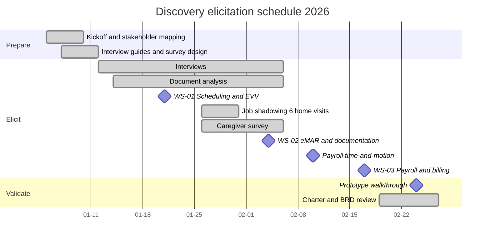

# Discovery Workshop Notes and Elicitation Record

## Document control

| Field | Value |
|---|---|
| Document ID | TW-DIS-05 |
| Version | 1.2 |
| Status | Approved |
| Owner | Business Analyst |
| Last updated | 2026-09-30 |
| Reviewers | Product Owner, UX Designer, Clinical SME (RN advisor), Compliance and Privacy Officer, Customer Success Lead |

| Version | Date | Change |
|---|---|---|
| 1.0 | 2026-02-20 | Elicitation plan, three workshop records, interview synthesis |
| 1.1 | 2026-02-26 | Prototype walkthrough results; open questions updated with resolutions |
| 1.2 | 2026-09-30 | Section 6 added: retrospective on what discovery missed, linked to pilot incidents |

### Purpose and scope

This document records how the Business Analyst elicited Tendwell R1 requirements during discovery (January and February 2026) and what was learned. It contains the elicitation plan, the records of the three discovery workshops, the interview synthesis, and the insights that changed scope. Workshop records were circulated to attendees within 2 business days and approved by reply. Quotes are paraphrased and fictional; participants are identified by role and agency only.

## 1. Elicitation plan

### 1.1 Techniques

| Technique | Why this technique | Participants | When | Output |
|---|---|---|---|---|
| Semi-structured interviews (26) | Each role has different goals and vocabulary; one-to-one sessions surface workarounds people do not mention in groups | 8 caregivers, 6 Care Coordinators (including 2 house leads at TEN-003), 3 Clinical Supervisors, 3 Billing and Payroll Specialists, 3 agency administrators, Clinical SME, Compliance and Privacy Officer, Customer Success Lead | 2026-01-12 to 2026-02-06 | Interview notes; affinity map (section 4) |
| Job shadowing on 6 home visits | Caregivers under-report friction they have normalized; observation shows real conditions (signal, gloves, lighting, client capacity to sign) | 4 visits with TEN-001 aides (2 in rural homes without signal), 2 with TEN-003 home-visit aides | 2026-01-26 to 2026-01-30 | Field notes, photos of paperwork (no client identifiers), timing data |
| Office observation and time-and-motion | Quantify coordinator phone time and payroll effort for the baseline | TEN-001 Care Coordinators (2026-01-22); TEN-001 payroll day (2026-02-10) | As listed | Baselines for P1, P7 and OBJ-02 |
| Document analysis | Produce defensible baselines from records rather than recollection | 236 paper timesheets (2 pay periods, TEN-001); 3 months of MAR binders (TEN-003 and TEN-001, 9,412 scheduled doses); 6 months of billing denials (3,118 claims); Q4 2025 credential spreadsheet vs timesheets | 2026-01-14 to 2026-02-06 | Baselines for OBJ-01, OBJ-03, OBJ-05, OBJ-06; pain points P3 to P11 |
| Facilitated workshops (3) | Resolve cross-role conflicts and make decisions with the people who own them | See section 2 | 2026-01-21, 2026-02-04, 2026-02-17 | Workshop records (section 2) |
| Caregiver survey | Reach caregivers who cannot leave the field; test interview findings at scale | 48 of 116 caregivers across the 3 agencies (41% response) | 2026-01-26 to 2026-02-06 | Survey results (section 3) |
| Prototype walkthrough | Validate the clock-in and dose flows before writing acceptance criteria | 8 caregivers (5 Android, 3 iPhone) | 2026-02-24 | Task success, tap counts, issues (section 3) |

All document analysis took place on agency premises. The Business Analyst recorded only counts and de-identified patterns; no PHI left the agencies, and photos were taken only of blank forms.

### 1.2 Schedule

## 2. Workshop records

### WS-01 Scheduling, visit confirmation and EVV

| Item | Detail |
|---|---|
| Date and place | 2026-01-21, 09:30-13:00, TEN-001 office, Lakemont, OH 43999 |
| Facilitator | Business Analyst; co-facilitator UX Designer |
| Attendees (by role) | Product Owner; Engineering Lead; Customer Success Lead; TEN-001 Agency Administrator; TEN-001 Care Coordinators (2); TEN-001 caregivers (2); TEN-003 house lead (Care Coordinator); TEN-002 program coordinator |
| Objective | Validate the AS-IS scheduling and verification process, and decide what counts as proof of a visit |

**Agenda**

1. Walk through the draft AS-IS scheduling map (15 min).
2. Pain point dot-voting (20 min).
3. What counts as proof of a visit: the six EVV data elements (40 min).
4. Exceptions: what should block a caregiver and what should only be flagged (45 min).
5. Filling call-outs: open shifts (30 min).
6. Wrap-up: decisions, open questions, actions (20 min).

**Findings**

- The AS-IS map was confirmed with two additions: caregivers text photos of timesheets to coordinators' personal phones, and coordinators re-enter visits into the state EVV portal by hand.
- Dot-voting ranked "confirmation calls" (P1), "illegible or unsigned timesheets" (P3) and "finding out about missed visits from families" (P2) highest.
- Both TEN-001 caregivers described clients with no signal indoors; one walks to the end of a driveway to send a text. The TEN-003 house lead reported the same for one rural home.
- Coordinators feared that GPS checks would block caregivers at the door and generate calls. Their preference: never stop the caregiver, flag the visit, and let the office decide.
- The Engineering Lead pointed out that a device can report false coordinates and that distance must be computed by the server.
- Client signatures are unreliable proof: clients with dementia or tremor cannot sign consistently.

**Decisions**

| Ref | Decision | Decided by | Traced to |
|---|---|---|---|
| WS1-D1 | Location problems never block a punch; they raise an exception for Coordinator review | Product Owner with agency attendees | FR-EVV-03, FR-EVV-07 |
| WS1-D2 | Offline clock-in and clock-out is a Must for R1, raised from Should | Product Owner | FR-EVV-05, US-027 |
| WS1-D3 | Distance to the service address is computed only on the server | Engineering Lead, Product Owner | BR-021; logged as DEC-05 |
| WS1-D4 | Default geofence radius 150 m, configurable 50 to 500 m per address | Agency attendees, Product Owner | BR-021; logged as DEC-05 |
| WS1-D5 | Late start and early end tolerance of 10 minutes; clock-in opens 15 minutes before start | Agency attendees | BR-023 |
| WS1-D6 | Client signature is not an EVV element in R1 | Product Owner | BR-020 |

**Open questions**

| Ref | Question | Owner | Due | Resolution |
|---|---|---|---|---|
| WS1-Q1 | Should a selfie identity check be mandatory? | Product Owner | 2026-02-26 | Optional per tenant behind a vendor adapter, Should priority (FR-EVV-04, DEC-07); valid 90 s, single use (BR-024) |
| WS1-Q2 | How long must the app work with no connectivity? | Engineering Lead | 2026-02-10 | 72 hours of punches (NFR-AVL-02); offline-first app (DEC-02, ADR-006) |
| WS1-Q3 | Which aggregator export format do agencies need? | Business Analyst with TEN-001 Agency Administrator | 2026-02-13 | Configurable aggregator CSV in R1; state-specific formats in R2 (NFR-CMP-02) |
| WS1-Q4 | Can a caregiver claim an open shift without Coordinator approval? | Product Owner | 2026-02-13 | First eligible claim wins (FR-SCH-05); optional Coordinator confirmation added later by CR-002 |

**Actions**

| Action | Owner | Due | Status |
|---|---|---|---|
| Arrange job shadowing at two rural homes without signal | Customer Success Lead | 2026-01-26 | Done |
| Draft exception catalog with block vs flag behavior | Business Analyst | 2026-01-28 | Done |
| Spike: offline encrypted storage options for React Native | Engineering Lead | 2026-02-04 | Done (fed ADR-006) |
| Collect the state EVV aggregator file specification | TEN-001 Agency Administrator | 2026-02-06 | Done |

### WS-02 Medication administration, care plans and clinical documentation

| Item | Detail |
|---|---|
| Date and place | 2026-02-04, 13:00-16:30, TEN-003 Northgate Supported Living, Maple House training room |
| Facilitator | Business Analyst; clinical content led by Clinical SME (RN advisor) |
| Attendees (by role) | Clinical SME; Product Owner; QA Lead; UX Designer; Compliance and Privacy Officer; TEN-003 Clinical Supervisor; TEN-001 Clinical Supervisor; TEN-003 medication-trained staff (2); TEN-003 Agency Administrator |
| Objective | Agree eMAR rules, care plan approval, incident deadlines and notification content |

**Agenda**

1. MAR binder audit results: 4.6% undocumented doses, 7 of 40 pages with transcription discrepancies (20 min).
2. Dose outcomes and required reasons (25 min).
3. Administration windows, missed doses and late entries (40 min).
4. PRN rules and vital sign ranges (25 min).
5. Care plan versions and approval (20 min).
6. Client incidents and reporting deadlines (25 min).
7. What may appear in a text, push or email (20 min).

**Findings**

- Both supervisors discover gaps at the monthly binder audit, on average 18 days after the dose.
- A proposal from the delivery team to "close out" undocumented doses at the end of the day to keep the MAR tidy was rejected strongly by both supervisors and the Clinical SME: an undocumented dose must stay visible as undocumented until a person explains it. Their reasoning was clinical (the resident may not have received the dose) and evidential (a surveyor must see the gap and its explanation).
- A fixed plus or minus 60 minute window suits most orders, but some time-critical medications need a tighter window.
- Two refusals in a row is the pattern supervisors want to know about immediately.
- Care plan changes reach caregivers by notes on the fridge; caregivers sometimes work from an old plan.
- One 24-hour abuse-or-neglect report deadline was missed in 2025 because the paper form sat in a car.
- Staff routinely text client names to each other. The Compliance and Privacy Officer explained lock-screen exposure on SMS and push.

**Decisions**

| Ref | Decision | Decided by | Traced to |
|---|---|---|---|
| WS2-D1 | Undocumented doses become Missed - undocumented 60 minutes after the window closes and escalate to the Clinical Supervisor; doses are never auto-cancelled or deleted | Clinical SME, Clinical Supervisors | BR-030, BR-031, FR-MAR-04 |
| WS2-D2 | Late entry allowed up to 24 hours after the scheduled time, labelled Late entry; afterwards only a Clinical Supervisor can annotate | Clinical SME | BR-031 |
| WS2-D3 | Administration window plus or minus 60 minutes, configurable per order from 15 to 120 minutes | Clinical SME | BR-029 |
| WS2-D4 | Medication orders and care plans become Active only after Clinical Supervisor approval; a visit uses the plan version active at clock-in | Clinical SME | FR-MAR-01, FR-CLI-05, BR-012 |
| WS2-D5 | Two consecutive Refused or Held outcomes alert the Clinical Supervisor | Clinical Supervisors | BR-032, FR-MAR-06 |
| WS2-D6 | Default reporting deadlines: suspected abuse or neglect 24 h, serious injury 24 h, medication error with harm 72 h; tenant-configurable | Clinical SME, Compliance and Privacy Officer | BR-036 |
| WS2-D7 | SMS and push carry no PHI. Staff email may carry the minimum identifiers needed to triage (client first name, last initial, incident category) | Compliance and Privacy Officer | BR-056 (v1.0 wording); reversed by CR-006 in SRS v1.3 |

**Open questions**

| Ref | Question | Owner | Due | Resolution |
|---|---|---|---|---|
| WS2-Q1 | Default vital sign alert ranges | Clinical SME | 2026-02-13 | Defined in BR-034, overridable per client |
| WS2-Q2 | Controlled substance counts in R1? | Product Owner | 2026-02-13 | Out of R1 scope; backlog item |
| WS2-Q3 | Is "self-administered with supervision" a valid outcome for home-visit aides? | Clinical SME | 2026-02-13 | Yes, as a distinct outcome (FR-MAR-03) |
| WS2-Q4 | Do agencies in other states need different reporting deadlines? | Compliance and Privacy Officer | 2026-02-20 | Tenant-configurable defaults (BR-036) |

**Actions**

| Action | Owner | Due | Status |
|---|---|---|---|
| Write the dose state model and escalation timeline for review | Business Analyst | 2026-02-11 | Done |
| Provide default vital ranges with clinical rationale | Clinical SME | 2026-02-13 | Done |
| Draft notification content rules per channel | Compliance and Privacy Officer with Business Analyst | 2026-02-13 | Done |
| Prepare MAR grid mock-up for supervisor review | UX Designer | 2026-02-18 | Done |

### WS-03 Payroll, billing and authorizations

| Item | Detail |
|---|---|
| Date and place | 2026-02-17, 09:30-13:30, TEN-001 office with video link for TEN-002 and TEN-003 |
| Facilitator | Business Analyst |
| Attendees (by role) | Product Owner; Engineering Lead; QA Lead; Customer Success Lead; Compliance and Privacy Officer (first hour); TEN-001 Billing and Payroll Specialist; TEN-001 Agency Administrator; TEN-001 Care Coordinator; TEN-002 Agency Administrator (also runs billing); TEN-003 Billing and Payroll Specialist |
| Objective | Agree pay and billing rules with worked examples, and decide whether Tendwell processes payroll |

**Agenda**

1. Validate AS-IS payroll and billing maps; time-and-motion results (14 h per pay period) (20 min).
2. Payroll scope: process payroll or export to the agency's provider (30 min).
3. Pay rules with worked examples: overtime, holiday, travel, mileage, PTO (60 min).
4. Billing models and unit rounding with worked examples (45 min).
5. Authorization caps and denials (30 min).
6. Private-pay collection and claims (25 min).

**Findings**

- All three payroll specialists want an export, not a new payroll system: each agency is under contract with a payroll provider that handles tax filings, and switching is out of the question. Each provider's import template differs.
- Travel time between clients is paid by some coordinators and not others. The Business Analyst presented the FLSA and DOL Home Care Rule position that travel between clients during the workday is hours worked; the agencies asked for one consistent, explainable rule.
- TEN-003 asked about daily overtime for staff working in states with daily overtime rules.
- Four billing models are in use across the pilots: hourly 15-minute units (for example T1019), per visit, daily rate for adult day (for example S5102), and fixed monthly for supported living.
- Agencies round units differently today; denials cluster around overrun of authorized units.
- Private-pay families ask to pay online.

**Decisions**

| Ref | Decision | Decided by | Traced to |
|---|---|---|---|
| WS3-D1 | Tendwell prepares payroll and exports a CSV with configurable column mapping; it does not process payroll | Product Owner with agency attendees | FR-PAY-05, ADR-005, DEC-04; later basis for rejecting CR-008 |
| WS3-D2 | Paid travel = min(actual gap, estimated drive time + 10 min), only when the gap is 2 hours or less | Product Owner, agency attendees | BR-043 |
| WS3-D3 | Holiday 1.5x; no stacking of overtime and holiday (pay the higher multiplier) | Agency attendees | BR-042 |
| WS3-D4 | 15-minute units; round up when the remainder is 8 minutes or more | Agency attendees | BR-047; confirmed as DEC-06 after review of denial data |
| WS3-D5 | Billed units capped at remaining authorized units; excess shown as not billable | Product Owner | BR-049, FR-BIL-03 |
| WS3-D6 | Only Verified visits count for pay and billing | Product Owner | BR-028 |
| WS3-D7 | A billing run is idempotent per tenant, client, payer and period | Product Owner, Engineering Lead | BR-050, FR-BIL-01 |

The worked examples agreed in this session became the canonical examples in the [business rules](../02-requirements/business-rules.md), including the US-045 hourly billing example (24 units = $174.00) and the payroll example later formalized as US-041.

**Open questions**

| Ref | Question | Owner | Due | Resolution |
|---|---|---|---|---|
| WS3-Q1 | Support daily overtime profiles? | Product Owner | 2026-03-27 | Approved as CR-001 in SRS v1.1 (BR-041, FR-PAY-02) |
| WS3-Q2 | EDI 837 claim submission in R1? | Product Owner | 2026-02-27 | No; claim batch CSV for the agency's clearinghouse (FR-BIL-06) |
| WS3-Q3 | Default PTO accrual | TEN-001 Billing and Payroll Specialist | 2026-02-25 | 1 h per 30 h worked, cap 80 h; PTO does not count toward overtime (BR-040) |
| WS3-Q4 | Mileage rate | Agency administrators | 2026-02-25 | Tenant-configured; sample tenants use $0.70 per mile (BR-044) |

**Actions**

| Action | Owner | Due | Status |
|---|---|---|---|
| Collect each pilot agency's payroll provider import template | Billing and Payroll Specialists | 2026-02-25 | Done |
| Turn agreed worked examples into acceptance criteria | Business Analyst with QA Lead | 2026-03-04 | Done |
| Validate a sample claim batch file with each clearinghouse | TEN-001 Billing and Payroll Specialist | 2026-06-12 | Done in UAT |
| Plan a payroll parallel run for each agency's first two pilot pay periods | Customer Success Lead | 2026-05-15 | Done (completed 2026-08-14) |

## 3. Survey and prototype results

### 3.1 Caregiver survey (48 respondents)

| Question | Result |
|---|---|
| Own a smartphone they would use for work | 45 of 48 (94%): 33 Android, 12 iPhone |
| At least one client home with no usable signal in a typical week | 19 of 48 (40%) |
| Unsure whether travel time between clients is paid | 29 of 48 (60%) |
| Would prefer the app in Spanish | 11 of 48 (23%) |
| Comfortable sharing location at clock-in and clock-out only | 38 of 48 (79%) |
| Concerned about continuous location tracking | 31 of 48 (65%) |
| Positive or very positive about clocking in by app | 30 of 48 (62.5%) |
| Average unpaid admin time per week (self-reported) | 2.1 hours |

### 3.2 Prototype walkthrough (2026-02-24, 8 caregivers)

| Measure | Result | Change made |
|---|---|---|
| Clock-in in 3 taps or fewer from app open | 7 of 8 | One participant opened the wrong visit; the next visit is now pinned at the top (NFR-USE-01) |
| Understood that a punch was saved while offline | 3 of 8 | Added a visible queue indicator and "Saved on this phone, will send when online" message (spec 001) |
| Completed dose outcome "Refused" with a reason | 8 of 8; median 14 s | Reason list shortened from 11 to 6 options |
| Found the visit note field | 6 of 8 | Note moved into the clock-out flow (FR-EVV-06) |

## 4. Interview synthesis

The Business Analyst coded the 26 interview notes into an affinity map with the UX Designer. A count is the number of interviews (of 26) in which the theme appeared at least once.

| Theme | Count | Roles most represented | Representative quote (fictional) | Led to |
|---|---|---|---|---|
| Proof of visit depends on paper and goodwill | 17 | CG, AG-COORD, AG-FIN | "Half my Friday is chasing signatures." | EP-06 |
| Phone tag runs the coordinator day | 14 | AG-COORD, CG | "I call to confirm, they call to confirm, nobody is caring for anyone." | FR-SCH-07, FR-EVV-07 |
| Getting paid right, including travel | 13 | CG, AG-FIN | "Travel is paid if you ask the right coordinator." | BR-043, EP-10 |
| No signal in rural homes | 11 | CG, AG-COORD | "Out past the county road the phone is a flashlight." | FR-EVV-05, NFR-AVL-02 |
| PHI in personal text messages | 10 | AG-COORD, CG, AG-ADM | "The address and the door code are in my texts from last year." | FR-NTF-05, NFR-PRIV-01 |
| Medication gaps surface weeks late | 9 | AG-SUPV, CG | "I find the blanks at month end, when nobody remembers." | FR-MAR-04 |
| Authorization surprises at billing time | 8 | AG-FIN, AG-COORD | "We find out we went over when the denial arrives." | FR-CLI-04, BR-049 |
| Credential tracking depends on one person | 7 | AG-ADM, AG-COORD | "If she is on vacation, nobody checks TB dates." | FR-WRK-02, BR-014 |
| Worry about location tracking | 7 | CG | "Check where I clock in, not where I shop." | FR-EVV-02 (clock-in and clock-out only) |
| Keep our payroll provider | 6 | AG-FIN, AG-ADM | "We are not changing payroll. Ever." | FR-PAY-05, ADR-005 |
| Gaps must stay visible in the MAR | 5 | AG-SUPV, Clinical SME | "A missed dose stays missed until someone explains it." | BR-031 |
| Language access | 5 | CG | "I read English fine, but notes in Spanish are faster." | NFR-I18N-01 (Spanish in R2) |
| Vendor access to our data | 4 | AG-ADM, Compliance and Privacy Officer | "Your support team looks when I say so." | FR-IAM-07, BR-008 |

## 5. Key insights that changed scope

| Insight | Evidence | Scope change | Traced to |
|---|---|---|---|
| Caregivers lose signal in rural homes | 11 interviews; 19 of 48 surveyed weekly; 2 of 6 shadowed visits had no signal indoors | Offline clock-in and clock-out became a Must for R1, with 72 hours of capacity and an offline-first app architecture | FR-EVV-05, BR-025, US-027, NFR-AVL-02, ADR-006, [spec 001](../08-ai-assisted-ba/specs/001-offline-evv-capture/spec.md) |
| Nurses insisted that missed doses must never disappear | WS-02; Clinical SME and both supervisors | Missed - undocumented status with escalation instead of auto-closing; doses never deleted. During UAT, TEN-003 raised CR-007 (auto-cancel undocumented doses at midnight); this decision grounded the CCB's rejection of it on 2026-06-17 | BR-030, BR-031, FR-MAR-04, CR-007 |
| Payroll staff wanted an export, not a new payroll system | WS-03; all 3 payroll specialists; provider contracts | Payroll preparation with configurable CSV export; no tax or pay stub processing. Later grounded the rejection of CR-008 | FR-PAY-05, ADR-005, CR-008 |
| Coordinators fear being flooded by exceptions | WS-01 | Punches are never blocked; exception queue with reason codes and append-only corrections | FR-EVV-03, FR-EVV-08, BR-026 |
| Travel time is paid inconsistently | 13 interviews; 60% of surveyed caregivers unsure | One documented travel rule aligned with the DOL Home Care Rule | BR-043 |
| Caregivers accept location at punch time but not tracking | Survey: 79% vs 65% | Location captured only at clock-in and clock-out; plain-language notice in the app | FR-EVV-02 |
| Owners want per-client pricing | Agency administrator interviews | Seat = active client with at least one scheduled visit in the cycle | BR-002 |
| Some states have daily overtime rules | WS-03 (TEN-003) | Left out of the v1.0 baseline; returned as CR-001 and approved in SRS v1.1 | CR-001, BR-041 |
| Families want visibility, but agencies want R1 focused on operations | Agency administrator interviews | Family Portal deferred to R2 | CR-003, EP-14 |

## 6. Retrospective: what discovery missed (added 2026-09-30)

The Business Analyst reviewed discovery decisions against the pilot incidents. Three gaps trace back to discovery, and each changed how the BA elicits requirements on later work.

| Discovery decision or assumption | What happened | Requirement change | What the BA now does differently |
|---|---|---|---|
| WS1-D4 and the device research assumed "GPS on" meant an accurate fix; the approximate-location setting on phones was never explored | INC-2026-011: iOS users with Precise Location off produced 1,180 false Location mismatch exceptions | CR-004: Low GPS accuracy separated from Location mismatch (BR-022, FR-EVV-07) | Device and OS privacy settings are an explicit elicitation topic for any field-capture feature, and are listed in the QA device matrix |
| WS2-D7 allowed client first name, last initial and incident category in staff email, on the assumption that recipients are always current staff | INC-2026-015: an escalation email reached a deactivated former coordinator's forwarded mailbox | CR-006: recipients resolved at send time; no PHI in any email body (BR-054, BR-056, FR-NTF-05) | Every notification rule states who may receive it, when the recipient list is resolved, and what happens when a user is deactivated |
| WS3-D7 stated billing idempotency as a business rule but not where it is enforced | INC-2026-007: 214 duplicate draft invoices after two scheduler workers both ran the billing job | CR-005: database-enforced idempotency and a pre-issue duplicate check (BR-050, FR-BIL-01) | For rules that protect money or PHI, the BA specifies the enforcement point and a detection signal (NFR-OBS-02) at the same time as the rule |

## Related documents

- [Project charter](project-charter.md)
- [Stakeholder register and RACI](stakeholder-register-raci.md)
- [Personas](personas.md)
- [Current vs future state](current-vs-future-state.md)
- [Business requirements document](../02-requirements/BRD.md)
- [Business rules](../02-requirements/business-rules.md)
- [Decision log](../05-delivery/decision-log.md)
- [Change request log](../05-delivery/change-request-log.md)
- [Incident management process](../07-operations/incident-management-process.md)
- [Spec 001: offline EVV capture](../08-ai-assisted-ba/specs/001-offline-evv-capture/spec.md)
