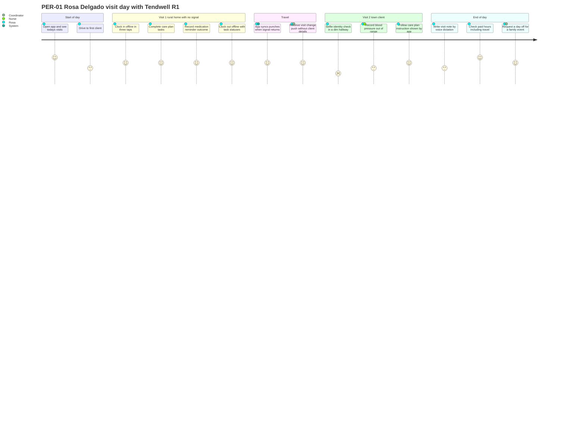

# Personas

## Document control

| Field | Value |
|---|---|
| Document ID | TW-DIS-03 |
| Version | 1.2 |
| Status | Approved |
| Owner | Business Analyst |
| Last updated | 2026-06-05 |
| Reviewers | UX Designer, Product Owner, Clinical SME (RN advisor), Customer Success Lead |

| Version | Date | Change |
|---|---|---|
| 1.0 | 2026-02-26 | Five personas from discovery interviews, job shadowing and the caregiver survey |
| 1.1 | 2026-03-20 | Story references aligned with the SRS v1.0 backlog |
| 1.2 | 2026-06-05 | Success metrics aligned with UAT measures; PER-01 journey updated after prototype walkthrough |

### Purpose and scope

These five personas summarize who Tendwell R1 serves and what "better" means to each of them. The Business Analyst and UX Designer built them from 26 discovery interviews, 6 job-shadowed home visits, a survey of 48 caregivers and document analysis at the three pilot agencies (see [discovery workshop notes](discovery-workshop-notes.md)). Each persona is a composite: no persona describes a real individual, and all names and quotes are fictional. Pain references (P1 to P12) point to the pain points in [current vs future state](current-vs-future-state.md).

The team uses the personas in three ways: to write and order user stories, to choose UAT participants, and to settle design debates ("would Rosa do this with gloves on, in a client's kitchen, with no signal?").

## Persona summary

| ID | Name | Role code | Role | Anchor site | Primary app | Top need |
|---|---|---|---|---|---|---|
| PER-01 | Rosa Delgado | CG | Home health aide, 7 years | TEN-001 Harborview Home Care | Caregiver Mobile App (Android) | Clock in and document fast, even with no signal, and be paid for every hour |
| PER-02 | Marcus Hale | AG-COORD | Care Coordinator, about 70 clients | TEN-001 Harborview Home Care | Agency Web App | Fill and confirm visits without phone calls |
| PER-03 | Priya Raman, RN | AG-SUPV | Clinical Supervisor | TEN-001 Harborview Home Care | Agency Web App and mobile browser | Know about any undocumented dose within the hour |
| PER-04 | Denise Carter | AG-FIN | Billing and Payroll Specialist | TEN-001 Harborview Home Care | Agency Web App | Clean payroll file and invoices without re-keying |
| PER-05 | Tom Brennan | AG-ADM | Agency owner and administrator | TEN-001 Harborview Home Care | Agency Web App | Compliance confidence and cash flow at a predictable cost |

---

## PER-01 Rosa Delgado, Home Health Aide (CG)

### Context

| Aspect | Detail |
|---|---|
| Work environment | Visits 5 to 6 clients a day across Lakemont and the rural townships to the north. Two of her regular clients live where there is no cellular signal inside the house. Spends 1.5 to 2 hours a day driving. |
| Devices | Personal mid-range Android phone (Android 12), 4 GB monthly data plan, often below 30% battery by mid-afternoon. No agency-issued device. |
| Tech comfort | Medium. Uses messaging, video calls, maps and a banking app daily. Avoids long forms and anything that needs typing with gloves on. |
| Language | Bilingual English and Spanish; prefers Spanish for long text, reads English UI comfortably. |
| Experience | 7 years as an aide; trusted with new clients; informal mentor to new hires. |

### Goals

1. Arrive on time and spend the visit on care, not paperwork.
2. Be paid correctly for every hour worked, including travel between clients.
3. Prove she was there without asking a tired client to sign a paper timesheet.
4. Get schedule changes early and in one place, not by voicemail.

### Frustrations

| Frustration | Baseline pain |
|---|---|
| Clients forget or refuse to sign the paper timesheet; the office then calls her to "fix" it | P3 |
| Timesheets reach the office days later, and her pay has been wrong twice this year | P4, P7 |
| Travel time between clients is paid by some coordinators and not others | P7 |
| The office calls during visits to confirm she arrived | P1 |
| The MAR binder at medication-reminder clients is a separate paper process with its own signatures | P5 |
| A text from the office included a client's full address and door code, which made her uneasy | P12 |

### Jobs to be done

- When I arrive at a client's home with no signal, I want to clock in and record what I did, so that I am paid and the agency has proof without calling the office.
- When a visit changes, I want to be told once, clearly, so that I do not drive to the wrong place.
- When a client refuses a medication, I want to record that and why in seconds, so that the nurse knows and I am not blamed.

### A day in the life (from job shadowing, 2026-01-27)

Rosa leaves home at 07:15. Her first client, in a farmhouse 22 minutes north of Lakemont, has no signal indoors. Today she writes times on a paper timesheet and asks the client to sign; the client's hands shake and the signature is barely legible. At 09:40 her phone buzzes in the car: the office wants to know whether she reached client two. At client three she reminds the client to take morning medications and initials the MAR binder, then notices yesterday's evening dose is blank. She mentions it to nobody because she does not know whom to tell. Between client four and five she has a 50-minute gap, and she is not sure whether it is paid. At 18:30 she photographs her paper timesheets and texts them to the office so payroll has them before Friday.

### Representative quotes (fictional)

> "Out at the farm there is no signal. If the app needs internet to clock me in, it does not work for me."

> "I do not mind being checked. I mind being called in the middle of a bath to say I am there."

> "I drive forty minutes between some clients. Is that my time or the agency's time? Nobody answers the same way twice."

### What success looks like

| Measure | Baseline | Target |
|---|---|---|
| Taps from app open to clock-in for the next visit | n/a (paper) | 3 or fewer (NFR-USE-01) |
| Office calls to confirm her arrival | About 4 per week | 0 |
| Visits with complete EVV data | 81% (agency) | 97% or more (OBJ-01) |
| Pay corrections affecting her per quarter | 2 | 0 |
| Travel between consecutive same-day visits paid under one rule | Inconsistent | 100% (BR-043) |
| Time to document tasks and note at clock-out | 6 to 8 min (paper) | 2 min or less |

### Top stories

US-025, US-027, US-028, US-032, US-036, US-023, US-039, US-049, US-026, US-037.

### Visit-day journey (future state)

The journey shows Rosa's day with Tendwell R1, scored 1 (painful) to 5 (effortless). The UX Designer and Business Analyst scored it from the prototype walkthrough on 2026-02-24 and re-scored it after UAT; lower scores mark the friction the team is still watching.

| Step | AS-IS score (job shadowing) | Why it improved | Remaining friction and owner |
|---|---|---|---|
| Clock in at a home with no signal | 1 | Offline capture (US-027, FR-EVV-05) | Caregivers want visible proof the punch is queued; addressed by the sync status indicator (spec 001) |
| Prove the visit happened | 1 | GPS and device time replace the client signature (US-025) | None |
| Selfie identity check | n/a | New control | Poor light causes retries; UX Designer added a lighting hint; monitored through the identity check failure rate |
| Out-of-range vitals | 2 | Instruction shown at the point of care and the nurse alerted (US-035) | Rosa still worries whether the nurse saw it; read receipts considered for R2 |
| Knowing whether travel is paid | 1 | One rule (BR-043), visible in hours summary | None |

---

## PER-02 Marcus Hale, Care Coordinator (AG-COORD)

### Context

| Aspect | Detail |
|---|---|
| Work environment | Office in Lakemont, shared with two other coordinators. Schedules about 70 clients and 25 caregivers. Phones ring from 06:00 when caregivers call out. |
| Devices | Desktop with two monitors, agency smartphone for after-hours on-call one week in three. |
| Tech comfort | High. Builds his own color-coded scheduling spreadsheet; fast keyboard user. |
| Tools today | Wall whiteboard, scheduling spreadsheet, phone, paper authorization tracker. |

### Goals

1. Every authorized visit is staffed with a qualified caregiver the client accepts.
2. Know about a late or missed visit before the client's family calls.
3. Stay within each client's authorized units.
4. Spend less of the day on the phone.

### Frustrations

| Frustration | Baseline pain |
|---|---|
| Two and a half hours a day of confirmation calls | P1 |
| Learns about missed visits from families, on average 47 minutes after the scheduled start | P2 |
| Cannot see remaining authorized units when scheduling; overruns surface as billing denials weeks later | P10 |
| Credential expiry lives in another spreadsheet; he once scheduled a caregiver whose TB screening had lapsed | P11 |
| Fixes illegible timesheets by phone at the end of each pay period | P3 |

### Jobs to be done

- When a caregiver calls out sick at 06:30, I want to see who is qualified, available, not excluded by the client and within travel distance, so I can fill the visit before the client is affected.
- When a visit is late, I want to be told within minutes, so I can act while there is still time.
- When I schedule a recurring visit, I want the system to stop me from breaking authorization, credential or overlap rules, so that problems do not reach billing.

### A day in the life (from observation, 2026-01-22)

At 06:35 Marcus takes a call-out for a 07:30 visit. He scans the whiteboard, calls three caregivers and reaches the third at 06:58. Between 08:00 and 10:00 he places 31 confirmation calls. At 11:15 a daughter calls: her mother's 09:00 aide never arrived. The aide had the wrong week on her printed schedule. In the afternoon Marcus reconciles 14 timesheets with missing times and leaves voicemails. Before leaving he checks the paper authorization tracker and finds two clients over their monthly units.

### Representative quotes (fictional)

> "My job is to make sure care happens. Right now my job is to make phone calls."

> "Do not show me a hundred exceptions. Show me the five I need to act on today."

> "If the system lets me book somebody with an expired TB test, it is not helping me."

### What success looks like

| Measure | Baseline | Target |
|---|---|---|
| Phone time per coordinator per day for confirmations | 2.4 h | 0.5 h or less |
| Missed visits (no clock-in by scheduled end) | 2.8% | Below 1% |
| Time to detect a late start | 47 min (family call) | 10 min (Late start exception, BR-023) |
| EVV exceptions resolved within 1 business day | n/a | 95% |
| New coordinators who schedule a recurring visit unaided after 30 min of training | n/a | 90% or more (NFR-USE-02) |
| Visits worked with an Expired Blocking credential | 23 per quarter | 0 (OBJ-05) |

### Top stories

US-020, US-021, US-022, US-024, US-029, US-040, US-012, US-013, US-018, US-023.

---

## PER-03 Priya Raman, RN, Clinical Supervisor (AG-SUPV)

### Context

| Aspect | Detail |
|---|---|
| Work environment | Supervises medication administration and care plans for about 60 Harborview clients on medication assistance across 2 locations. Makes supervisory home visits every 60 days per client; on call two evenings a week. |
| Devices | Agency laptop, agency smartphone, personal tablet at home for on-call. |
| Tech comfort | High, but time-poor; she uses the hospital-grade eMAR she knew in acute care as her yardstick. |
| Regulatory exposure | Prepares MAR and incident records for state surveys and complaint investigations. |

### Goals

1. No dose goes undocumented without her knowing the same day.
2. Medication orders and care plans in use always match what she approved.
3. Incidents are reported, investigated and closed within deadlines.
4. A surveyor can see a complete, honest MAR, including gaps and their explanations.

### Frustrations

| Frustration | Baseline pain |
|---|---|
| She finds blank MAR entries at the monthly binder audit, on average 18 days after the dose | P5 |
| Orders are hand-copied into binders; 7 of 40 audited MAR pages had a transcription discrepancy | P6 |
| Incident reports arrive on paper days later; one 24-hour abuse-or-neglect report deadline was missed in 2025 | P12 |
| Care plan changes take a week to reach every caregiver | P5, P6 |

### Jobs to be done

- When a dose has not been documented, I want to know within the hour, so that I can check on the client before harm occurs.
- When a new order arrives, I want to approve it once and know every caregiver sees exactly that order.
- When a serious incident happens, I want the clock to start automatically, so that no reporting deadline is missed.

### A day in the life (from interview and home visit, 2026-02-03)

Priya starts at the Lakemont North office at 07:30 with a stack of paper MAR sheets that caregivers dropped off last week. She finds two blank evening entries for one client from three days ago. The caregiver remembers giving the doses but cannot be sure. She writes a late-entry note and starts an internal review. At 10:00 she receives a faxed new order for a client and copies it onto the MAR sheet that lives in the client's home binder, which means a drive across town. At 14:00 a caregiver calls about a fall from the morning; the paper incident form is still in the caregiver's car. In the evening she reviews care plan changes and phones three caregivers to read them the new instructions.

### Representative quotes (fictional)

> "If a dose disappears from the record, I cannot tell a surveyor whether it was given. A missed dose stays missed until someone explains it."

> "I do not need more alerts. I need the right alert, once, to the right nurse."

> "Never let the system tidy up my MAR. Gaps are information."

The first and third quotes shaped BR-030 and BR-031 and later grounded the rejection of CR-007 (auto-cancel undocumented doses at midnight).

### What success looks like

| Measure | Baseline | Target |
|---|---|---|
| Undocumented doses | 4.6% | 0.5% or less (OBJ-03) |
| Time from undocumented dose to supervisor awareness | About 18 days | 60 minutes after the window closes (BR-030) |
| Order transcription discrepancies | 7 of 40 audited pages | 0 (orders active only after approval, FR-MAR-01) |
| Reportable incidents reported within deadline | 1 miss in 2025 | 100% (BR-036) |
| Care plan change reaching caregivers | Up to 7 days | Next clock-in after approval (BR-012) |

### Top stories

US-033, US-031, US-014, US-035, US-038, US-032, US-037, US-034.

---

## PER-04 Denise Carter, Billing and Payroll Specialist (AG-FIN)

### Context

| Aspect | Detail |
|---|---|
| Work environment | Back office at Harborview. Runs bi-weekly payroll for 62 caregivers and monthly billing for 180 clients across Medicaid, managed care, private pay and long-term care insurance. |
| Devices | Desktop with two monitors. |
| Tech comfort | Expert in spreadsheets, the payroll provider's portal and the clearinghouse portal. Skeptical of new systems after a failed software rollout in 2024. |
| Constraints | The agency is contractually tied to its payroll provider for two more years. |

### Goals

1. Payroll right first time, on time, without weekend work.
2. Invoices out within two business days of period end.
3. No claim denied for authorization overrun.
4. Keep the existing payroll provider.

### Frustrations

| Frustration | Baseline pain |
|---|---|
| 14 hours per pay period keying timesheets into a payroll spreadsheet | P4, P7 |
| Overtime and holiday pay calculated by hand; 3.2 corrections per period on average | P8 |
| Nine days to issue monthly invoices; unit rounding done by hand | P9 |
| 6.1% of billed dollars denied for exceeding authorization | P10 |
| No single list of "visits that are not clean yet" before the payroll deadline | P3, P4 |

### Jobs to be done

- When the pay period closes, I want a reviewed, correct file I can import into our payroll provider, so that I do not re-key 62 caregivers' hours.
- When I run billing, I want each visit priced by its authorization and capped at remaining units, so that we never bill what the payer will deny.
- When something changes after payroll is exported, I want it carried into the next period automatically, so that I never reopen a closed period.

### A day in the life (from time-and-motion observation, 2026-02-10)

Payroll Tuesday. Denise starts at 07:00 with 118 paper timesheets. By 11:00 she has keyed half and flagged 21 with missing or unclear times for coordinators. She calculates overtime for 9 caregivers by hand and checks two against last period's errors. After lunch she builds the import file for the payroll provider by copying columns into its template. At 16:30 a coordinator brings four late timesheets. She finishes at 19:10. Monthly billing next week will take most of three days.

### Representative quotes (fictional)

> "Do not give me a new payroll system. Give me a file my payroll provider accepts, and tell me which visits are not clean yet."

> "Every rounding rule we have, I can explain with an example. Make the system do the same example."

> "I will trust it after it matches my numbers for two pay periods."

The first quote led directly to the export-only decision (FR-PAY-05, ADR-005) and later to the rejection of CR-008. The third quote became the payroll parallel run for the first two pilot pay periods.

### What success looks like

| Measure | Baseline | Target |
|---|---|---|
| Payroll preparation time per pay period | 14 h | 3 h or less (OBJ-02) |
| Pay corrections per period | 3.2 | Below 0.5 |
| Days from period end to invoices issued | 9 | 2 business days or fewer (OBJ-04) |
| Authorization-overrun denials | 6.1% | 1% or less (OBJ-06) |
| Worked examples reproduced exactly by the system | n/a | 100% (for example US-041: total payable $958.59) |

### Top stories

US-041, US-042, US-043, US-044, US-045, US-046, US-047, US-048, US-019.

---

## PER-05 Tom Brennan, Agency Owner and Administrator (AG-ADM)

### Context

| Aspect | Detail |
|---|---|
| Work environment | Owns and runs Harborview Home Care (62 caregivers, 180 clients, 2 locations); also acts as its compliance lead. Splits time between the office, payers and the bank. |
| Devices | Laptop, tablet, phone. |
| Tech comfort | Medium. Comfortable with online banking and accounting software; delegates configuration when he can. |
| Constraints | Thin margins; a state audit in 2025 found gaps in attendance documentation. |

### Goals

1. Pass audits and payer reviews without a scramble.
2. Predictable software cost that scales with clients served.
3. See today's operations and money at a glance.
4. Control who sees client information, including vendor support staff.

### Frustrations

| Frustration | Baseline pain |
|---|---|
| Audit preparation means pulling paper sign-in sheets and binders for days | P3, P12 |
| Cash flow suffers from the 9-day invoicing delay | P9 |
| Staff share client details in personal text messages; he has no audit trail | P12 |
| Credential tracking depends on one person's spreadsheet | P11 |

### Jobs to be done

- When an auditor asks who saw a client's record and when, I want to produce that answer in minutes.
- When a vendor support agent needs to look at our data, I want to approve it, limit it and see what they did.
- When a new coordinator joins, I want to give them exactly the access their job needs.

### A day in the life (from interview, 2026-01-29)

Tom opens the office at 07:00 and checks the overnight voicemail for call-outs. At 10:00 he reviews last month's unpaid invoices with his bookkeeper. At 13:00 a payer asks for visit verification records for three clients for March 2025; he spends the afternoon pulling paper timesheets from storage. At 17:00 he approves an overdue CPR renewal reimbursement and wonders how many other credentials are about to expire.

### Representative quotes (fictional)

> "I want to sleep the night before an audit."

> "Your support people can look at our data when I say so, for as long as I say so, and I want to see what they did."

> "Charge me per client I serve, not per login. My aides should not cost me a seat."

### What success looks like

| Measure | Baseline | Target |
|---|---|---|
| Time to answer an auditor's access question | Days | Under 15 minutes (audit log, FR-RPT-03) |
| Support access without approval | Not controlled | 0; every grant at most 4 hours (BR-008) |
| Days to invoice | 9 | 2 business days or fewer (OBJ-04) |
| Expired blocking credentials on worked visits | 23 per quarter (agency average) | 0 (OBJ-05) |
| Quarterly access review completed | Never | Every quarter (NFR-SEC-04) |

### Top stories

US-001, US-003, US-004, US-009, US-011, US-050, US-051, US-052, US-006.

## Related documents

- [Project charter](project-charter.md)
- [Stakeholder register and RACI](stakeholder-register-raci.md)
- [Current vs future state](current-vs-future-state.md)
- [Discovery workshop notes](discovery-workshop-notes.md)
- [Story map](../05-delivery/story-map.md)
- [Epics](../05-delivery/epics.md)
- [UAT plan and scripts](../06-quality/uat-plan-and-scripts.md)
- [Wireframes](../03-design/wireframes/README.md)
