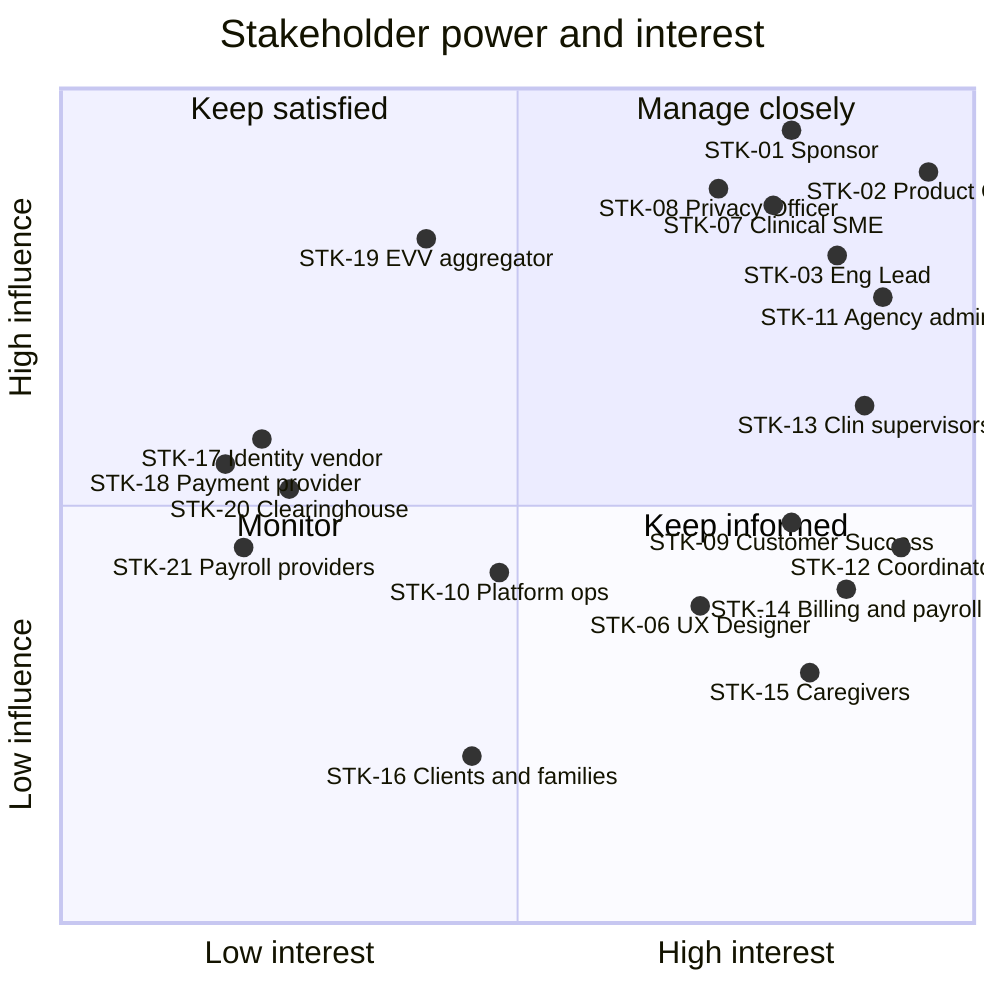

# Stakeholder Register and RACI

## Document control

| Field | Value |
|---|---|
| Document ID | TW-DIS-02 |
| Version | 1.3 |
| Status | Approved |
| Owner | Business Analyst |
| Last updated | 2026-09-02 |
| Reviewers | Product Owner, Customer Success Lead, Compliance and Privacy Officer |

| Version | Date | Change |
|---|---|---|
| 1.0 | 2026-01-16 | Initial register from kickoff and pilot agency intake calls |
| 1.1 | 2026-02-27 | Updated after discovery; attitudes revised from workshop evidence; RACI agreed at steering |
| 1.2 | 2026-06-01 | UAT roles added to RACI; pilot agency council added to communication plan |
| 1.3 | 2026-09-02 | Incident communication and privacy notification rows added after pilot incidents; GA cadence |

### Purpose and scope

This register identifies everyone who affects or is affected by Tendwell Release 1, records how much they care and how much they can influence it, and sets how the team engages them. The Business Analyst maintains the register and reviews it at every steering meeting; attitude changes are recorded with the evidence that caused them. Pilot agency stakeholders are listed by role, not by name.

## 1. Stakeholder register

Influence and interest use High, Medium and Low. Attitude uses Champion, Supportive, Neutral, Cautious and Skeptical. The Business Analyst is the author of this register and is not listed.

| ID | Stakeholder (role) | Organization | Interest in Tendwell R1 | Influence | Interest level | Attitude | Engagement strategy | Channel and frequency |
|---|---|---|---|---|---|---|---|---|
| STK-01 | Executive Sponsor | Tendwell Labs | Commercial viability, GA date, budget, reputation with first customers | High | High | Champion | Manage closely; decisions framed as options with cost and risk | Steering committee every 2 weeks; one-page status monthly |
| STK-02 | Product Owner | Tendwell Labs | Value delivered per sprint, backlog order, pilot outcomes | High | High | Champion | Daily collaboration; BA prepares refinement-ready stories and CR impact analyses | Daily stand-up; weekly refinement; weekly CCB (chair) |
| STK-03 | Engineering Lead | Tendwell Labs | Feasibility, architecture, NFRs, technical debt | High | High | Supportive | Involve early on rules with data or concurrency impact; joint ADR reviews | Refinement weekly; ADR reviews as needed; incident IC rotation |
| STK-04 | Development team (2 backend, 1 web, 1 mobile) | Tendwell Labs | Unambiguous acceptance criteria, stable scope within a sprint | Medium | High | Supportive | Three-amigos sessions per story; BA office hours twice a week | Sprint ceremonies; team chat |
| STK-05 | QA Lead and QA engineer | Tendwell Labs | Testable requirements, traceability, test data | Medium | High | Supportive | Co-own acceptance criteria and RTM; review every BR for testability | Three-amigos per story; RTM review per sprint |
| STK-06 | UX Designer | Tendwell Labs | Usability for caregivers and coordinators, accessibility | Medium | High | Supportive | Co-facilitate workshops and job shadowing; joint persona ownership | Weekly design review |
| STK-07 | Clinical SME (RN advisor) | Tendwell Labs (contracted) | Medication safety, care plan integrity, clinical documentation | High (veto on clinical rules) | High | Cautious, then Supportive | Formal sign-off on eMAR and care plan rules; review each clinical story before Ready | Clinical rule review per sprint with eMAR or care plan content |
| STK-08 | Compliance and Privacy Officer | Tendwell Labs | HIPAA Security Rule controls, BAAs, minimum necessary, breach response | High (veto on privacy) | High | Cautious | Privacy review gate per epic; early involvement in notifications, exports and support access | Privacy review per epic; monthly compliance check-in; on call for privacy incidents |
| STK-09 | Customer Success Lead (pilot) | Tendwell Labs | Adoption, training, pilot satisfaction, renewal | Medium | High | Supportive | Partner in UAT and training; channel for pilot feedback into backlog | Pilot agency council every 2 weeks; weekly pilot health review |
| STK-10 | Platform operations (PLT-ADM, PLT-SUP) | Tendwell Labs | Tenant lifecycle, support access grants, supportability | Medium | Medium | Neutral | Include in support access (FR-IAM-07) and console reviews; runbooks before go-live | Monthly ops review; incident channel |
| STK-11 | Agency owners and administrators (AG-ADM), see PER-05 | TEN-001, TEN-002, TEN-003 | Cost, compliance, cash flow, staff time | High (pilot sign-off and purchase) | High | Supportive; TEN-003 Cautious about cost | Show KPI evidence; involve in go/no-go; early sight of pricing and seat rules | Pilot agency council every 2 weeks; monthly KPI report |
| STK-12 | Care Coordinators (AG-COORD), see PER-02 | Pilot agencies | Less phone time, fewer missed visits, manageable exception queue | Medium | High | Supportive; anxious about exception workload | Co-design schedule board and exception queue; usability tests (NFR-USE-02) | Workshops; usability sessions per release; in-app feedback |
| STK-13 | Clinical Supervisors (AG-SUPV), see PER-03 | Pilot agencies | Dose safety, real-time missed-dose visibility, survey readiness | Medium-High (clinical acceptance at agency) | High | Cautious | Validate eMAR rules with Clinical SME present; walk through MAR grid early | WS-02 follow-ups; UAT clinical scenarios |
| STK-14 | Billing and Payroll Specialists (AG-FIN), see PER-04 | Pilot agencies | Accurate pay and invoices, keep existing payroll provider, fewer denials | Medium | High | Skeptical, then Supportive after export decision | Agree worked examples for every pay and billing rule; parallel run in the first two pilot pay periods | WS-03; parallel-run reviews per pay period in July and August 2026 |
| STK-15 | Caregivers (CG), see PER-01 | Pilot agencies | Fast clock-in, correct pay including travel, no tracking outside visits | Low individually, High collectively (adoption) | High | Mixed: 30 of 48 surveyed positive; GPS privacy concerns | Prototype walkthroughs; field champions; plain-language GPS notice | Survey (48 caregivers); prototype sessions; in-app release notes |
| STK-16 | Clients and family representatives | Pilot agencies' clients | Reliable visits, privacy, respectful use of photos and location | Low in R1 | Medium | Neutral | Represented through agency administrators and Clinical Supervisors; Family Portal in R2 (CR-003) | Agency communications; R2 discovery |
| STK-17 | Identity verification vendor | External | Contract volume, integration quality | Medium (dependency for FR-EVV-04) | Low | Neutral | Isolate behind an adapter (ADR-004); BAA; agreed latency and accuracy figures | Monthly vendor call; status page subscription |
| STK-18 | Payment provider | External | Standard integration, webhook correctness | Medium (dependency for FR-BIL-05) | Low | Neutral | Use standard hosted payment links; signature-verified webhooks | Developer documentation; support tickets |
| STK-19 | State EVV aggregator | External (state Medicaid program) | Complete, correctly formatted EVV submissions | High (sets format and compliance rules) | Medium | Neutral | Track format specifications; configurable aggregator CSV (NFR-CMP-02); agencies submit | Quarterly specification review; through agencies |
| STK-20 | Claims clearinghouse (agency-selected) | External | Claim batch file format and completeness | Medium | Low | Neutral | Validate sample claim batch files (FR-BIL-06) with each pilot agency's clearinghouse | Through AG-FIN; test file exchange before go-live |
| STK-21 | Agency payroll providers | External | Import file format | Medium | Low | Neutral | Configurable column mapping (FR-PAY-05) tested against each pilot agency's provider import | Through AG-FIN; mapping test per agency |

## 2. Power/interest grid

Coordinates are the Business Analyst's assessment after discovery (February 2026) and were reviewed at steering on 2026-02-27.

| Quadrant | Stakeholders | Strategy |
|---|---|---|
| Manage closely (high influence, high interest) | STK-01, STK-02, STK-03, STK-07, STK-08, STK-11, STK-13 | Involve in decisions; formal sign-off on scope, clinical and privacy rules |
| Keep satisfied (high influence, lower interest) | STK-19, and STK-17, STK-18, STK-20 as delivery dependencies | Meet their format and contract requirements early; no surprises |
| Keep informed (high interest, lower influence) | STK-04, STK-05, STK-06, STK-09, STK-12, STK-14, STK-15 | Co-design, prototype sessions, regular demos; their adoption decides OBJ-01 to OBJ-04 |
| Monitor | STK-10, STK-16, STK-21 | Periodic check; represent through agency roles |

Caregivers (STK-15) sit in "Keep informed" individually, but the team treats them as a "manage closely" group for usability decisions because OBJ-01 depends entirely on their adoption.

## 3. RACI matrix

R = Responsible (does the work), A = Accountable (one per row, final decision), C = Consulted (two-way), I = Informed (one-way). Pilot agency roles are represented by one nominated person per agency.

| Deliverable or decision | Exec Sponsor | Product Owner | Business Analyst | Eng Lead | QA Lead | UX Designer | Clinical SME | Privacy Officer | CS Lead | Pilot AG-ADM | Pilot AG-SUPV | Pilot AG-FIN |
|---|---|---|---|---|---|---|---|---|---|---|---|---|
| Project charter | A | C | R | C | I | I | C | C | I | I | | |
| BRD sign-off | I | A | R | C | C | C | C | C | C | C | C | C |
| SRS baseline sign-off (v1.0) and each revision | I | A | R | C | C | C | C | C | I | I | | |
| Care plan rules (BR-012, FR-CLI-05) | | C | R | C | I | C | A | I | | I | C | |
| eMAR rules (BR-029 to BR-034) | | C | R | C | C | C | A | I | | I | C | |
| Payroll rules (BR-041 to BR-046) | | A | R | C | C | | | | I | C | | C |
| Billing rules (BR-047 to BR-052) | | A | R | C | C | | | | I | C | | C |
| Notification content and PHI rules (BR-054, BR-056) | | C | R | C | I | C | C | A | I | I | | |
| Requirements traceability matrix | | I | A | C | R | | | | | | | |
| UAT plan and scripts | | C | R | I | A | C | C | I | C | C | C | C |
| UAT sign-off | I | A | R | C | C | | C | C | C | R | R | R |
| Go-live (go/no-go) | A | R | C | C | C | | C | C | C | C | | |
| CR approval (CCB) | I | A | R | C | C | I | C | C | C | I | | |
| Incident communications (customer-facing) | I | I | C | A | | | C | C | R | I | | |
| Privacy incident notification to the covered entity | I | I | C | C | | | | A | R | I | | |
| Post-incident review | I | C | R | A | C | | C | C | C | I | | |

Notes:

- The Business Analyst is Responsible for documenting every rule and Accountable only for the traceability matrix, which is the BA's own work product. Domain rules are owned by the domain authority: clinical rules by the Clinical SME, pay and billing rules by the Product Owner with agency finance input, and privacy rules by the Compliance and Privacy Officer.
- For incident communications the Engineering Lead appears as Accountable because that role is the default Incident Commander; whoever acts as Incident Commander holds the accountability (see the [incident management process](../07-operations/incident-management-process.md)).
- For privacy incidents the Compliance and Privacy Officer is Accountable for the business-associate notification. The Customer Success Lead delivers it to the agency contact named in the BAA.

## 4. Communication plan

| Communication | Purpose | Audience | Owner | Frequency | Channel | Artifact |
|---|---|---|---|---|---|---|
| Steering committee | Decide scope, budget and milestone issues | STK-01, STK-02, STK-03, STK-08, STK-09 | Product Owner (BA prepares pack) | Every 2 weeks; monthly in pilot | Video meeting | Status pack with RAID and KPI trend |
| CCB | Decide change requests | CCB members | Product Owner (chair), BA (secretary) | Weekly, or ad hoc | Video meeting | CR log entry with impact analysis |
| Sprint review and demo | Show working software, collect feedback | Delivery team, PO, CS Lead, pilot agency representatives (from S3) | Product Owner | Every 2 weeks | Video meeting with recording | Demo notes; feedback items added to backlog by BA |
| Requirements walkthrough | Confirm understanding before sign-off | Reviewers of each SRS version | Business Analyst | Per SRS version | Workshop | Review comments log; sign-off record |
| Clinical rule review | Validate eMAR and care plan rules | Clinical SME, pilot AG-SUPV | Business Analyst | Each sprint with clinical content | Workshop | Signed rule table |
| Pilot agency council | Pilot feedback, UAT and training planning | Pilot AG-ADM, CS Lead, BA, PO | Customer Success Lead | Every 2 weeks from June 2026 | Video meeting | Action log |
| Caregiver release notes | Explain app changes in plain language | Caregivers | UX Designer with BA | Each app release | In-app message and printable one-pager | Release note |
| Monthly KPI report | Track OBJ-01 to OBJ-06 | Sponsor, pilot AG-ADM | Business Analyst | Monthly from 2026-08 | Email with PDF | KPI report |
| Incident status updates | Inform affected tenants during an incident | Affected tenant administrators | Communications Lead (CS Lead) | Per severity cadence | Status page, email | Templates in the incident management process |
| Post-incident review summary | Share causes and corrective actions | Affected tenants, internal team | Business Analyst | Within 5 business days for SEV-1 and SEV-2 | Email and PIR document | PIR |

## Related documents

- [Project charter](project-charter.md)
- [Personas](personas.md)
- [Discovery workshop notes](discovery-workshop-notes.md)
- [Business requirements document](../02-requirements/BRD.md)
- [Change request log](../05-delivery/change-request-log.md)
- [Decision log](../05-delivery/decision-log.md)
- [UAT plan and scripts](../06-quality/uat-plan-and-scripts.md)
- [Incident management process](../07-operations/incident-management-process.md)
