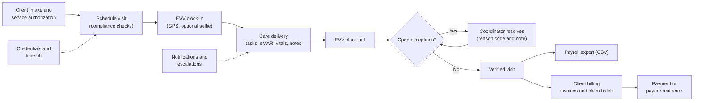

# Business Requirements Document (BRD): Tendwell Release 1

## Document control

| Field | Value |
|---|---|
| Document ID | TW-REQ-BRD |
| Version | 1.2 |
| Status | Approved |
| Owner | Business Analyst |
| Last updated | 2026-09-24 |
| Reviewers | Product Owner; Engineering Lead; Clinical SME (RN advisor); Compliance and Privacy Officer; QA Lead; Customer Success Lead (pilot) |
| Approval | See [section 13](#13-approval-and-sign-off) |

| Version | Date | Change |
|---|---|---|
| 1.0 | 2026-02-20 | Baseline at the end of discovery. |
| 1.1 | 2026-04-17 | Scope changes from CR-001 (daily overtime profile, BN-10), CR-002 (optional open-shift confirmation, BN-05) and CR-003 (Family Portal moved to Release 2, BN-14). |
| 1.2 | 2026-09-24 | Post-pilot update. Needs sharpened by CR-004, CR-005 and CR-006 after INC-2026-011, INC-2026-007 and INC-2026-015. KPI baselines reconfirmed with the pilot agencies. |

**Purpose.** This document states why Tendwell Release 1 (R1) exists, which business outcomes it must achieve, and which business needs the solution must meet. In ISO/IEC/IEEE 29148:2018 terms it is the business requirements specification. It deliberately says little about *how*; the [SRS](SRS.md) specifies the system behavior that satisfies each need.

**Scope of this document.** The R1 product for the three pilot agencies and general availability, plus the boundary to Release 2 (R2). Audience: Product Owner, delivery team, pilot agency leadership, Compliance and Privacy Officer.

## 1. Executive summary

Home and community-based care agencies run their core value chain across disconnected tools: authorizations in spreadsheets, schedules in a whiteboard-style scheduler, visit verification in a state-supplied EVV app, medication records on paper in the client's home, payroll keyed by hand from timesheets, and invoices built in a spreadsheet. Every hand-off re-enters the same visit, and every re-entry leaks money or compliance.

Discovery at three fictional pilot agencies (TEN-001 Harborview Home Care, TEN-002 Cedar Lane Adult Day Center, TEN-003 Northgate Supported Living) quantified the cost:

| Pain point | Baseline (discovery) |
|---|---|
| Visits with complete EVV data | 81% |
| Payroll preparation time per pay period per agency | 14 h |
| Undocumented medication doses | 4.6% |
| Days to issue monthly invoices | 9 |
| Caregivers working with an expired blocking credential | 23 instances per quarter |
| Billing denials caused by authorization overrun | 6.1% |

Tendwell R1 connects the chain in one tenant-isolated platform: **Authorization -> Schedule -> EVV clock-in/out (with tasks, eMAR, vitals and notes) -> Verified visit -> Payroll export and client billing.** A visit is captured once, at the point of care, and reused downstream. Only Verified visits reach pay and invoices.

R1 went live with the pilot agencies on 2026-07-06 and reached general availability on 2026-09-01. The Family Portal moved to R2 (CR-003). For a reference agency the size of Harborview, the illustrative model in [section 11](#11-benefits-and-costbenefit-view) shows about $83,000 a year in recurring benefits against about $30,000 in subscription cost. Most of the benefit depends on preventing authorization overruns before the visit happens, not on capping them at billing time.

Three scope decisions shape the solution:
- Export payroll rather than process it (CR-008 rejected; [ADR-005](../03-design/architecture/adr/ADR-005-payroll-export-not-processing.md)).
- Export claim batches as CSV for the agency's clearinghouse rather than build EDI 837P in R1.
- Never auto-cancel undocumented medication doses (CR-007 rejected on clinical-safety and audit grounds).

## 2. Business context

Tendwell Labs (fictional) sells Tendwell as a multi-tenant SaaS product to US agencies that deliver three service lines:
- `HOME_VISIT`: in-home personal care visits.
- `ADULT_DAY`: adult day programs.
- `SUPPORTED_LIVING`: 24-hour supported living homes.

Agencies are paid by Medicaid (fee-for-service and managed care), long-term care insurance, the VA and private payers. Three external pressures make the current way of working unsustainable:
- **EVV is mandatory.** The 21st Century Cures Act section 12006 requires electronic visit verification of six data elements for Medicaid personal care and home health services. Payers deny or recoup visits without valid EVV.
- **Labor rules apply to home care.** Under the DOL Home Care Rule, agency-employed caregivers are owed overtime, and travel time between clients during the workday is hours worked. Manual payroll gets this wrong in both directions.
- **Agencies handle PHI.** As covered entities under HIPAA they need access control, audit and minimum-necessary handling that spreadsheets and shared inboxes cannot give.

The current state, the future state and the discovery evidence are in [current-vs-future-state.md](../01-discovery/current-vs-future-state.md) and [discovery-workshop-notes.md](../01-discovery/discovery-workshop-notes.md).

## 3. Problem statement

> **The problem of** a visit being re-entered in four or five disconnected tools **affects** caregivers, Care Coordinators, Clinical Supervisors and billing and payroll staff, **the impact of which is** incomplete EVV, slow and error-prone payroll, undocumented medication doses, late invoices, staff working with lapsed credentials, and payer denials. **A successful solution would** capture each visit once at the point of care, check compliance before the visit rather than after, and reuse the verified record for pay, billing and audit.

| Problem | Evidence (baseline) | Business impact at a reference agency (illustrative) | Root cause found in discovery |
|---|---|---|---|
| Incomplete EVV | 81% of visits have complete EVV data | About 2,700 visits a month at Harborview scale, so about 510 visits a month need manual follow-up. At about 6 minutes each, that is about 51 coordinator hours a month, plus recoupment exposure. | Separate state app with no context of the schedule; paper timesheets as backup; no exception workflow, so gaps are found at billing. |
| Slow payroll | 14 h per pay period per agency | About 364 h a year on a bi-weekly cycle; overtime and travel are calculated by hand, so FLSA exposure goes both ways. | Hours rekeyed from timesheets and EVV exports; overtime, holiday and travel rules held in one person's spreadsheet. |
| Undocumented doses | 4.6% of scheduled doses | At Northgate (18 residents, about 4,300 scheduled doses a month), about 200 doses a month with no record. That is a clinical-safety and survey-deficiency risk. | Paper MAR in the home, reconciled weekly; nobody is alerted when a dose is not documented. |
| Late invoices | 9 days to issue monthly invoices | Cash arrives about a week and a half later than it needs to. | Waiting for timesheets; authorizations checked by hand; invoices built line by line. |
| Lapsed credentials | 23 instances per quarter | Services by staff without a required credential can be recouped by payers and cited at survey. | Credentials tracked in a spreadsheet that the scheduler cannot see; no hard block. |
| Authorization overruns | 6.1% of billing denied for overrun | At about $195,750 billed a month, about $11,900 a month is denied. | Units not checked at scheduling time; overruns found only on the remittance. |

## 4. Business objectives

Objectives map one-to-one, in order, to the discovery KPIs. Targets are measured over the first full calendar quarter after each tenant's go-live; for the pilot tenants that is Q4 2026 (2026-10-01 to 2026-12-31).

| ID | Objective | KPI | Baseline | Target | Measurement method | Owner role |
|---|---|---|---|---|---|---|
| OBJ-01 | Make visit verification complete at the point of care | Visits with complete EVV data | 81% | 97% or more | Completed visits in the period with all six EVV data elements captured, divided by all completed visits. Source: EVV compliance report (FR-RPT-02). Manual-correction rate is reported alongside so the KPI cannot be met by back-office edits alone. | Product Owner |
| OBJ-02 | Cut payroll preparation effort | Payroll preparation time per pay period per agency | 14 h | 3 h or less | Elapsed working time from opening the pre-export review (FR-PAY-04) to export (FR-PAY-05), from system timestamps, cross-checked by a time log kept by the Billing & Payroll Specialist for two periods. | Customer Success Lead |
| OBJ-03 | Eliminate undocumented medication doses | Undocumented medication doses | 4.6% | 0.5% or less | Dose tasks still Missed - undocumented 24 h after their scheduled time, divided by all scheduled dose tasks. Source: MAR compliance report. | Clinical SME (RN advisor) |
| OBJ-04 | Invoice faster | Days to issue monthly invoices | 9 | 2 business days or fewer | Median business days from period end to `issued_at` across the tenant's invoices for the period. Source: invoices. | Customer Success Lead |
| OBJ-05 | Stop work under lapsed credentials | Caregivers working with an expired blocking credential | 23 instances per quarter | 0 | Verified visits where the caregiver held an Expired Blocking credential on the visit date. Source: visits joined to caregiver credentials; reviewed quarterly. | Compliance and Privacy Officer |
| OBJ-06 | Prevent authorization-overrun denials | Billing denials caused by authorization overrun | 6.1% | 1% or less | Denied dollars with an authorization-related denial reason, divided by billed dollars. Source: agency remittance data supplied monthly, because R1 does not ingest remittance files. | Product Owner |

Leading indicators that are tracked weekly during the pilot but are not objectives: share of clock-ins done in the app rather than entered manually, open EVV exceptions older than 48 h, authorizations flagged at 90% utilization that have a renewal request logged, and caregivers with an Expiring credential and no renewal date.

## 5. Scope

### 5.1 Epics in scope

EP-01 to EP-13 are Release 1. EP-14 is specified now so the R1 data model and permissions do not preclude it, but it ships in R2.

| Epic | Name | Module | Release | Functional requirements | User stories |
|---|---|---|---|---|---|
| EP-01 | Agency Onboarding & Subscription | ONB | R1 | 8 | US-001 to US-006 |
| EP-02 | Identity & Access Management | IAM | R1 | 8 | US-007 to US-011 |
| EP-03 | Client Records & Care Plans | CLI | R1 | 8 | US-012 to US-016 |
| EP-04 | Caregiver Workforce & Credentials | WRK | R1 | 6 | US-017 to US-019 |
| EP-05 | Scheduling | SCH | R1 | 7 | US-020 to US-024 |
| EP-06 | Electronic Visit Verification (EVV) | EVV | R1 | 10 | US-025 to US-030 |
| EP-07 | Medication Administration (eMAR) & Vitals | MAR | R1 | 9 | US-031 to US-035 |
| EP-08 | Care Documentation & Client Incidents | DOC | R1 | 6 | US-036 to US-038 |
| EP-09 | Time Off & Holidays | TOF | R1 | 5 | US-039 to US-040 |
| EP-10 | Payroll Preparation | PAY | R1 | 6 | US-041 to US-043 |
| EP-11 | Client Billing & Invoicing | BIL | R1 | 8 | US-044 to US-048 |
| EP-12 | Notifications & Escalations | NTF | R1 | 5 | US-049 to US-050 |
| EP-13 | Reporting & Audit | RPT | R1 | 4 | US-051 to US-052 |
| EP-14 | Family Portal | FAM | R2 | 3 | US-053 to US-054 |

### 5.2 Release split

| Release | Date | Content | Basis |
|---|---|---|---|
| R1 pilot | 2026-07-06 | EP-01 to EP-13 for TEN-001, TEN-002 and TEN-003 | SRS v1.2 |
| R1 general availability | 2026-09-01 | EP-01 to EP-13 for all tenants | SRS v1.2 |
| R1.1 | After SRS v1.3 (2026-09-24) | CR-004 (Low GPS accuracy separated from Location mismatch), CR-005 (database-enforced billing idempotency), CR-006 (recipients resolved at send time; no PHI in email bodies) | Incident follow-ups |
| R2 | Per the [product roadmap](../05-delivery/product-roadmap.md) | EP-14 Family Portal (CR-003); Spanish caregiver app (NFR-I18N-01); state-specific EVV export formats (NFR-CMP-02) | Deferred scope |

### 5.3 Out of scope

| Item | Reason | What agencies do instead |
|---|---|---|
| Payroll processing: tax withholding, pay stubs, direct deposit | CR-008 rejected and deferred. It is a regulated, crowded market and adds no differentiation. | Export to the agency's payroll provider (FR-PAY-05). |
| EDI 837P claim submission and 835 remittance import | Clearinghouse certification effort does not fit R1. | Claim batch CSV for the agency's clearinghouse (FR-BIL-06). Denials are measured from agency remittance data. |
| Direct API submission to state EVV aggregators | Formats and APIs differ by state. | Configurable aggregator CSV (NFR-CMP-02); state formats in R2. |
| Telephony or fixed-device EVV (IVR, in-home token) | The pilot workforce uses smartphones. | Agency-issued devices for staff without one; manual entry with a reason code is the fallback and is visible as a manual correction. |
| Clinical assessments, nursing visit notes and EHR integration | R1 serves non-medical personal care and supervision. | Structured visit notes and incidents (EP-08). |
| Recruiting and applicant tracking | Not part of the visit value chain. | Caregiver profiles start at hire (FR-WRK-01). |
| Route optimization and automatic schedule generation | Coordinator judgement matters more than optimization at pilot scale. | Compliance checks and preference sorting (FR-SCH-03, BR-017). |
| Family-facing access | Deferred to R2 (CR-003). | Coordinators share updates by phone, as today. |

## 6. Stakeholder summary

The full register, with RACI, is in [stakeholder-register-raci.md](../01-discovery/stakeholder-register-raci.md). Personas are in [personas.md](../01-discovery/personas.md).

| Stakeholder group | Represented by | Primary interest | Influence | What they need from R1 |
|---|---|---|---|---|
| Agency owners and administrators | PER-05 Tom Brennan (AG-ADM) | Margin, compliance, staff retention | High: buyer, signs the BAA | One system of record; a lapsed subscription never blocks care (BR-003); audit-ready records |
| Care Coordinators | PER-02 Marcus Hale (AG-COORD) | Fewer phone calls and less rework | High: daily users who drive adoption | Problems caught before saving a visit; one exception queue |
| Clinical Supervisors | PER-03 Priya Raman, RN (AG-SUPV) | Client safety, survey readiness | High on clinical rules | Missed-dose escalation, care-plan and order approval, incident deadlines |
| Billing and payroll staff | PER-04 Denise Carter (AG-FIN) | Accurate, on-time pay and invoices | Medium to high | Verified-only data, pre-export review, billing that cannot duplicate |
| Caregivers | PER-01 Rosa Delgado (CG) | Quick clock-in, correct pay, fair schedules | Low individually, decisive collectively | Clock-in in three taps, capture without signal, paid travel |
| Clients and their representatives | Family Contact (FAM, R2) | Reliable visits, privacy | Medium | Privacy now; visibility in R2 |
| Payers and the state EVV program | External | Valid EVV and clean claims | High (regulatory) | Six EVV elements; aggregator export; authorization respected |
| Tendwell Labs delivery team | Product Owner, Engineering Lead, QA Lead, UX Designer | Ship R1 safely and on time | High | Prioritized, testable requirements |
| Clinical SME (RN advisor) | Clinical SME | Clinical safety of eMAR, vitals and incidents | High on clinical rules | Rules signed off before build |
| Compliance and Privacy Officer | Compliance and Privacy Officer | HIPAA, BAA, breach process | Veto on PHI handling | Minimum necessary by design; audit evidence |
| Customer Success Lead (pilot) | Customer Success Lead | Pilot adoption and KPI evidence | Medium | Baselines, training plan, measurement method |
| Platform staff | PLT-ADM, PLT-SUP | Operate the SaaS | Medium | Plans and promo codes; support access only by grant |

## 7. Business needs

Each business need maps to one epic (BN-01 to EP-01, and so on). Functional requirements that satisfy each need are listed per module in [SRS section 3.2](SRS.md#32-functional-requirements), and the full chain is in the [traceability matrix](requirements-traceability-matrix.md).

| ID | Need statement | Business value | Epic | Objectives |
|---|---|---|---|---|
| BN-01 | An agency needs to sign up, verify ownership, choose a plan and be ready to schedule without a sales cycle or a services project. | Time to value in days, not weeks. Seat-based pricing scales with the agency. | EP-01 Agency Onboarding & Subscription | Enabler for OBJ-01 to OBJ-06 (time to value) |
| BN-02 | An agency needs every user to have their own identity, the least privilege for the job, and support staff kept out of tenant data unless the agency grants access. | Meets HIPAA access-control and audit expectations. Lets agencies pass payer and partner security reviews. | EP-02 Identity & Access Management | Enabler (HIPAA safeguards) |
| BN-03 | Coordinators need one client record holding the geocoded service address, the payer authorizations with live remaining units, and the approved care plan. | The data the rest of the chain checks against. Without it there is no geofence, no authorization check and no task list. | EP-03 Client Records & Care Plans | OBJ-06, OBJ-01, OBJ-03 |
| BN-04 | The agency needs to know, every day, which caregivers are qualified to work and what each one is paid. | Lapsed credentials are caught before a visit is assigned. Pay rates are effective-dated, so retro changes do not corrupt history. | EP-04 Caregiver Workforce & Credentials | OBJ-05, OBJ-02 |
| BN-05 | Coordinators need to build and change schedules that are compliant when saved: no overlaps, no excluded or unqualified caregivers, no visits beyond the authorization. | Overruns and credential lapses are prevented upstream, which is cheaper than any downstream fix. | EP-05 Scheduling | OBJ-06, OBJ-05, OBJ-01 |
| BN-06 | The agency needs each visit verified electronically at the point of care, with clear exceptions when something is off and an audit-safe way to correct them. | EVV compliance and fewer recoupments. Verified time becomes the single input to pay and billing. | EP-06 Electronic Visit Verification (EVV) | OBJ-01, OBJ-02, OBJ-04 |
| BN-07 | Clinical Supervisors need every scheduled dose documented or escalated, PRN use kept within the order's limits, and abnormal vitals surfaced at once. | Client safety; survey readiness; a defensible medication record. | EP-07 Medication Administration (eMAR) & Vitals | OBJ-03 |
| BN-08 | The agency needs tamper-evident visit notes and a client-incident process that meets external reporting deadlines. | Regulatory reporting met on time; documentation that holds up in an investigation. | EP-08 Care Documentation & Client Incidents | OBJ-01 (complete visit record) |
| BN-09 | Caregivers need to request time off from their phone, and coordinators need to see which visits are affected before they approve. | Fewer last-minute gaps; PTO balances that payroll can trust. | EP-09 Time Off & Holidays | OBJ-02 |
| BN-10 | Payroll staff need pay-period hours classified correctly (regular, overtime, holiday, travel, PTO, mileage) from verified time only, then exported to the payroll provider. | Preparation drops from 14 h to 3 h or less per period. FLSA overtime and travel rules are applied the same way every time. | EP-10 Payroll Preparation | OBJ-02 |
| BN-11 | Billing staff need invoices and claim batches priced by each authorization's billing model, capped at authorized units, and impossible to duplicate. | Days to invoice drop from 9 to 2 or fewer. Denials for overrun fall. No double billing of families. | EP-11 Client Billing & Invoicing | OBJ-04, OBJ-06 |
| BN-12 | The right person needs to hear about a problem in time, through the right channel, without PHI leaving the platform and without waking people for non-urgent events. | Missed doses, vital alerts and credential expiries are acted on. Privacy incidents through messaging are prevented. | EP-12 Notifications & Escalations | OBJ-03, OBJ-05, OBJ-01 |
| BN-13 | Agency leaders need operational dashboards, standard compliance reports and a complete audit trail they can export for auditors. | KPIs become measurable. Audit and investigation requests are answered in minutes. | EP-13 Reporting & Audit | Measurement for OBJ-01 to OBJ-06 |
| BN-14 | Clients' authorized family contacts need visibility of visits and a channel to the coordinator, with client consent. | Fewer status calls to the office; higher family satisfaction. Deferred to R2 (CR-003). | EP-14 Family Portal | None in R1 (R2 satisfaction measure) |

## 8. Business process overview

The value chain below is the backbone every need hangs off. Detailed flows, with swimlanes and exception paths, are in [process-flows.md](../03-design/diagrams/process-flows.md).

Design consequences that the business has agreed to:
- **Verification gates money.** Only Verified visits are paid or billed (BR-028). An exception queue that is not worked delays payroll. This is intended, and is why the pre-export review exists (FR-PAY-04).
- **Care is never blocked by administration.** A lapsed subscription puts the tenant in Read-only, but clock-in stays available (BR-003). A failed location or identity check flags the visit; it does not stop the punch (FR-EVV-03).
- **Prevention beats correction.** Authorization and credential problems are surfaced at scheduling (FR-SCH-03). The billing cap (BR-049) is the last line of defense, not the main one.

## 9. Constraints

| Type | Constraint |
|---|---|
| Regulatory | HIPAA Privacy and Security Rules (Tendwell Labs is a business associate of each agency); 21st Century Cures Act section 12006 EVV; FLSA and the DOL Home Care Rule; state rules on incident reporting and record retention. See [compliance-mapping.md](compliance-mapping.md). |
| Contractual | Tendwell Labs signs a BAA with every agency and uses only HIPAA-eligible services under a BAA with its own vendors (NFR-CMP-01). |
| Schedule | Six two-week sprints (S1 from 2026-03-09 to S6 ending 2026-05-29), hardening and UAT in June 2026, pilot go-live 2026-07-06. |
| Team | One cross-functional team: 4 developers (2 backend, 1 web, 1 mobile), QA Lead plus 1 QA engineer, UX Designer, Engineering Lead, Product Owner, Business Analyst. Scope is cut, not stretched, when capacity runs out. |
| Technical | Payroll and claims leave the platform as files, not integrations (ADR-005). The caregiver app must work offline (ADR-006). The mobile app supports iOS 16+ and Android 10+ (NFR-MOB-01). |
| Commercial | Price per active client seat (BR-002). R1 is English only (NFR-I18N-01). |

## 10. Assumptions and dependencies

These are tracked, with owners and review dates, in the [RAID log](../05-delivery/raid-log.md).

**Assumptions**
- Caregivers have a smartphone that meets NFR-MOB-01. The agency issues one to anyone who does not.
- Agencies hold current authorization data (units, periods, rates) and enter it before scheduling against it.
- Each agency's payroll provider accepts a CSV import with a configurable column layout; each agency already uses a clearinghouse for claims.
- Pilot agencies share monthly remittance denial data so OBJ-06 can be measured.
- The default rules (for example the 150 m geofence, 100 m GPS accuracy threshold and 2-hour travel gap) suit the pilot states. Agencies confirm labor-policy defaults with their own advisers.

**Dependencies**
- Vendor agreements, including BAAs where the vendor receives PHI: the identity verification vendor, email, SMS and cloud hosting.
- State EVV aggregator file specifications for the pilot state (NFR-CMP-02).
- Clinical SME sign-off of eMAR, vitals and incident rules before the sprints that build them (S4 and S5).
- Pilot agency staff availability for UAT in June 2026 ([UAT plan](../06-quality/uat-plan-and-scripts.md)).

## 11. Benefits and cost/benefit view

All figures are fictional and illustrative. They show the logic of the business case, not a forecast. The reference agency has Harborview's profile (TEN-001: 62 caregivers, 180 clients).

**Model assumptions.**
- About 2,700 visits a month, averaging 2.5 h each.
- Blended billing of $29.00 per hour (a T1019-equivalent rate of $7.25 per 15-minute unit), so about $195,750 billed a month.
- Bi-weekly payroll (26 periods a year).
- Loaded office staff cost of $28 to $30 an hour.
- Subscription assumed at $14 per active client seat per month, used here for modelling only. Actual plan prices are set by the Platform Administrator.

| # | Benefit | Driver | Calculation | Annual value |
|---|---|---|---|---|
| B1 | Coordinator time on EVV follow-up | OBJ-01: 81% to 97% | 2,700 visits x 16 points = 432 fewer visits a month x 6 min = 43.2 h a month; x 12 x $28 | $14,515 |
| B2 | Payroll preparation time | OBJ-02: 14 h to 3 h | 11 h x 26 periods = 286 h; x $30 | $8,580 |
| B3 | Authorization-overrun denials avoided | OBJ-06: 6.1% to 1.0% | $195,750 x 5.1 points = $9,983 a month gross; 50% assumed realizable (see note) | $59,900 |
| B4 | Faster cash collection | OBJ-04: 9 to 2 business days | About 9 calendar days earlier on $195,750 a month | About $58,700 one-time working capital (not recurring) |
| B5 | Fewer undocumented doses | OBJ-03: 4.6% to 0.5% | At Northgate scale, about 200 to about 22 undocumented doses a month | Not monetized (clinical safety, survey risk) |
| B6 | No work under lapsed credentials | OBJ-05: 23 to 0 a quarter | Removes recoupment and citation exposure | Not monetized |
| | **Recurring benefits (B1 + B2 + B3)** | | | **About $83,000** |

| Cost (agency side) | Calculation | Value |
|---|---|---|
| Subscription | 180 seats x $14 x 12 | $30,240 a year |
| Onboarding and training (one-time) | About 44 office hours x $30 + 62 caregivers x 1 h x $19.50 | About $2,500 one-time |
| **Net recurring benefit** | $82,995 - $30,240 | **About $52,800 a year** |

**Note on B3, and why it matters.** Capping billed units at the authorization (BR-049) does not create revenue. It turns a denial into a line the agency never bills. The realizable benefit comes from *preventing* the overrun: the 90% utilization alert (FR-CLI-04) prompts a renewal request, and the scheduling warning (BR-010) stops unauthorized visits from being planned. The model assumes half of today's overrun dollars are recovered that way.

**Sensitivity.**
- At 25% realizable, recurring benefits fall to about $53,000, and the case still nets about $22,800 a year.
- At 0%, time savings alone ($23,100) do not cover the subscription.

That is why FR-CLI-04 and the BR-010 scheduling warning are Must requirements, and why OBJ-06 has a named owner.

## 12. Success criteria and acceptance

**Release acceptance (R1).** All of the following must hold:
1. Every Must functional requirement for EP-01 to EP-13 has passed system test, and every business rule has at least one passing automated test (NFR-MNT-01). Evidence is in the [traceability matrix](requirements-traceability-matrix.md) and the [test plan](../06-quality/test-strategy-and-plan.md).
2. UAT scripts are signed off by a representative of each pilot agency, with no open Critical or High defects ([UAT plan](../06-quality/uat-plan-and-scripts.md)).
3. There are no open Critical or High security findings (NFR-SEC-02). The Compliance and Privacy Officer has reviewed the [compliance mapping](compliance-mapping.md).
4. The canonical worked examples (payroll, billing, geofence) reproduce exactly in the system ([SRS Appendix B](SRS.md#appendix-b-worked-examples)).

**Business acceptance (post go-live).**
1. Each pilot tenant meets the OBJ-01 to OBJ-06 targets over Q4 2026, or has a corrective plan agreed with the Product Owner.
2. Two consecutive pay periods are exported without a manual recalculation outside Tendwell.
3. No SEV-1 incident in the measurement quarter has a root cause in a requirement gap. If one does, it produces a CR within 10 business days, as INC-2026-007, INC-2026-011 and INC-2026-015 did (CR-005, CR-004, CR-006).

## 13. Approval and sign-off

| Role | Responsibility in approval | v1.0 | v1.2 |
|---|---|---|---|
| Product Owner | Accountable for scope, priorities and objectives | Approved 2026-02-27 | Approved 2026-09-29 |
| Business Analyst | Author; completeness and traceability | Submitted 2026-02-20 | Submitted 2026-09-24 |
| Engineering Lead | Feasibility and constraints | Approved 2026-02-26 | Approved 2026-09-28 |
| Clinical SME (RN advisor) | Clinical safety of BN-07 and BN-08 | Approved 2026-02-26 | Approved 2026-09-28 |
| Compliance and Privacy Officer | HIPAA, EVV and labor-law constraints | Approved 2026-02-27 | Approved 2026-09-29 |
| QA Lead | Testability of the success criteria | Reviewed 2026-02-25 | Reviewed 2026-09-28 |
| Customer Success Lead (pilot) | Pilot representation; KPI baselines and measurement | Approved 2026-02-27 | Approved 2026-09-29 |
| Pilot agency administrators (TEN-001, TEN-002, TEN-003) | Business endorsement | Endorsed 2026-02-27 | Endorsed 2026-09-30 |

## Related documents

- [Project charter](../01-discovery/project-charter.md)
- [Stakeholder register and RACI](../01-discovery/stakeholder-register-raci.md)
- [Personas](../01-discovery/personas.md)
- [Current vs future state](../01-discovery/current-vs-future-state.md)
- [Software Requirements Specification](SRS.md)
- [Non-functional requirements](non-functional-requirements.md)
- [Business rules](business-rules.md)
- [Compliance mapping](compliance-mapping.md)
- [Glossary](glossary.md)
- [Requirements traceability matrix](requirements-traceability-matrix.md)
- [Process flows](../03-design/diagrams/process-flows.md)
- [Product roadmap](../05-delivery/product-roadmap.md)
- [Change request log](../05-delivery/change-request-log.md)
- [RAID log](../05-delivery/raid-log.md)
