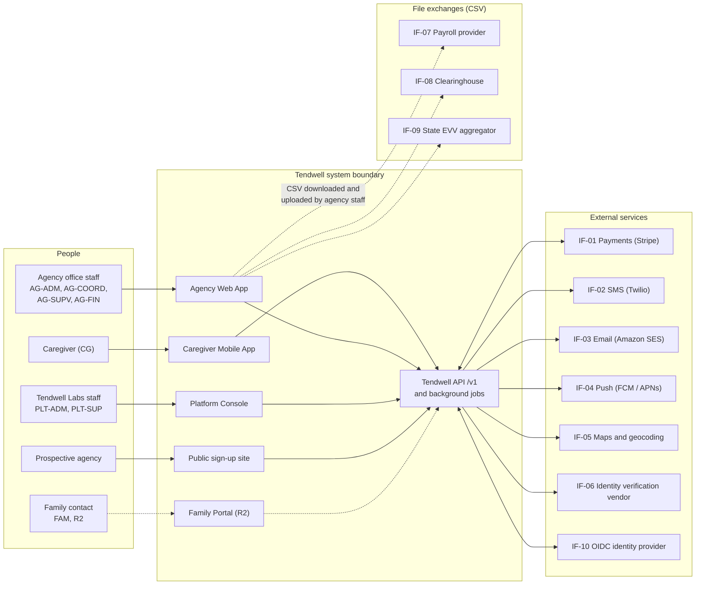

# Software Requirements Specification (SRS): Tendwell

## Document control

| Field | Value |
|---|---|
| Document ID | TW-REQ-SRS |
| Version | 1.3 |
| Status | Approved (baselined) |
| Owner | Business Analyst |
| Last updated | 2026-09-24 |
| Reviewers | Product Owner; Engineering Lead; QA Lead; UX Designer; Clinical SME (RN advisor); Compliance and Privacy Officer |
| Change control | After a baseline, this document changes only through the [change request log](../05-delivery/change-request-log.md). Each approved CR updates this SRS, the [traceability matrix](requirements-traceability-matrix.md) and the affected user stories in the same pull request. |

**Purpose and scope.** This SRS specifies what Tendwell does, how it interfaces with people and other systems, and the quality and constraints it must meet. It covers Release 1 (R1) and the deferred Release 2 (R2) Family Portal. It is the contract between the Product Owner and the delivery team and the basis for test design. Every requirement here is meant to be verifiable, and section 4 says how.

## 1. Introduction

### 1.1 Purpose

This SRS turns the business needs BN-01 to BN-14 in the [BRD](BRD.md) into verifiable software requirements. Its audiences are:
- Developers and the Engineering Lead, who design against it.
- QA, who derive test cases from it.
- The UX Designer, who builds screens to the field-level specifications.
- The Compliance and Privacy Officer and the Clinical SME, who check that rules with regulatory or clinical weight are stated precisely.

The layout follows the SRS information item in ISO/IEC/IEEE 29148:2018, with the overall description kept as its own section (section 2) for readability.

### 1.2 Scope

Tendwell is a multi-tenant SaaS operations platform for US home and community-based care agencies. It serves three service lines:
- `HOME_VISIT`: in-home personal care.
- `ADULT_DAY`: adult day programs.
- `SUPPORTED_LIVING`: 24-hour supported living homes.

It covers the chain from service authorization to scheduling, electronic visit verification, point-of-care documentation (tasks, eMAR, vitals, notes, incidents), and on to payroll export and client billing.

This version specifies 93 functional requirements in 14 modules, 58 business rules (detailed in [business-rules.md](business-rules.md)) and 29 non-functional requirements (detailed in [non-functional-requirements.md](non-functional-requirements.md)).

Out of scope:
- Payroll processing (CR-008).
- EDI 837P claim submission and 835 remittance import.
- Direct API submission to state EVV aggregators.
- Telephony EVV.
- EHR integration.

The reasons are in [BRD section 5.3](BRD.md#53-out-of-scope). The business outcomes Tendwell must move are OBJ-01 to OBJ-06 ([BRD section 4](BRD.md#4-business-objectives)).

### 1.3 Product overview

| Application | Users | Technology | Release |
|---|---|---|---|
| Agency Web App | AG-ADM, AG-COORD, AG-SUPV, AG-FIN; PLT-SUP under a grant | React 18 + TypeScript SPA | R1 |
| Caregiver Mobile App | CG | React Native (Expo); offline queue in encrypted SQLite (SQLCipher) | R1 |
| Platform Console | PLT-ADM, PLT-SUP | Web | R1 |
| Public sign-up site | Prospective agencies (become AG-ADM) | Web | R1 |
| Family Portal | FAM | Web | R2 (CR-003) |

All five front ends use one REST API (`/v1`, OpenAPI-first), backed by a NestJS modular monolith whose modules match the SRS modules in section 3.2. PostgreSQL 16 enforces tenant isolation with row-level security.

### 1.4 Definitions, acronyms and conventions

Terms and acronyms are defined in the [glossary](glossary.md). Conventions used in this document:

| Convention | Meaning |
|---|---|
| shall | A mandatory, verifiable requirement. Prose without "shall" is explanatory. |
| Priority | MoSCoW: Must, Should, Could, Won't (this release). |
| Release | R1 (pilot 2026-07-06, GA 2026-09-01; R1.1 carries the v1.3 changes) or R2. |
| IDs | FR-<MOD>-NN, BR-NNN, US-NNN, NFR-<CAT>-NN, IF-NN (interfaces, section 3.1.3), TBD-NN (open issues, Appendix A). IDs are never reused. |
| Time | 24-hour clock in the tenant's local time zone (America/New_York in all samples); stored in UTC (NFR-DAT-01). Dates are ISO 8601. |
| Money | USD in documents and the UI; integer cents in the API (`amountCents`). |
| Defaults | Numbers in requirements are defaults. Section 2.7 lists them and says which are tenant-configurable. |

### 1.5 References

| Reference | Use in this SRS |
|---|---|
| [BRD](BRD.md), [business-rules.md](business-rules.md), [non-functional-requirements.md](non-functional-requirements.md), [compliance-mapping.md](compliance-mapping.md), [glossary.md](glossary.md) | Companion volumes of this specification |
| [Requirements traceability matrix](requirements-traceability-matrix.md) | BN to FR to BR to US to test case |
| [Data dictionary](../03-design/data/data-dictionary.md), [ERD](../03-design/data/erd.md), [data classification and retention](../03-design/data/data-classification-and-retention.md) | Entity and field definitions |
| [openapi.yaml](../04-api/openapi.yaml), [API guidelines](../04-api/api-guidelines.md), [events and webhooks](../04-api/events-and-webhooks.md) | API contract and error code catalog |
| [State machines](../03-design/diagrams/state-machines.md), [sequence diagrams](../03-design/diagrams/sequence-diagrams.md), [wireframes](../03-design/wireframes/README.md) | Behavior and screen design |
| ISO/IEC/IEEE 29148:2018 | Requirements engineering; SRS structure; verification methods |
| ISO/IEC 25010 | Quality model used to classify NFRs |
| 45 CFR Part 164 (HIPAA Privacy, Security and Breach Notification Rules) | Safeguards in [compliance-mapping.md](compliance-mapping.md) |
| 21st Century Cures Act section 12006 | EVV data elements (BR-020) |
| FLSA; 29 CFR Parts 552 and 785 (DOL Home Care Rule; hours worked) | Overtime and travel time (BR-041, BR-043) |
| WCAG 2.2; NIST SP 800-63B; OWASP ASVS 4.0.3; RFC 9457 | Accessibility, authentication, security verification, API error format |
| ICD-10-CM; HCPCS Level II | Diagnosis and service codes |

### 1.6 Revision history

| Version | Date | Change |
|---|---|---|
| v1.0 | 2026-03-02 | Baseline. |
| v1.1 | 2026-04-17 | CR-001: daily overtime profile (BR-041, FR-PAY-02). CR-002: optional Coordinator confirmation of open-shift claims (FR-SCH-05). CR-003: Family Portal (EP-14, FR-FAM-01 to FR-FAM-03) deferred to R2 with priority Could. |
| v1.2 | 2026-06-12 | UAT clarifications: field-level validations and error messages in section 3.2 aligned to NFR-USE-03; credential checks evaluated against the visit date; recurring patterns limited to visits that end before auto-close (BR-027); holiday/overtime tie labelled Overtime; pending time-off shown as a scheduling warning. |
| v1.3 | 2026-09-24 | CR-004: Low GPS accuracy separated from Location mismatch (BR-022, FR-EVV-07; from INC-2026-011). CR-005: database-enforced billing idempotency and a pre-issue duplicate check (BR-050, FR-BIL-01; from INC-2026-007). CR-006: notification recipients resolved at send time and no PHI in email bodies (BR-054, BR-056, FR-NTF-05; from INC-2026-015). NFR-OBS-02 business anomaly alerts added. Appendix A refreshed after pilot and GA. |

## 2. Overall description

### 2.1 Product perspective

Tendwell is a new product. It replaces the spreadsheets, paper MARs, standalone EVV apps and hand-built invoices described in [current-vs-future-state.md](../01-discovery/current-vs-future-state.md). It owns the operational record of a visit. It does not own payroll processing, claim adjudication or state EVV aggregation; it hands those off as files.

Container-level views and deployment are in [system-context-and-containers.md](../03-design/architecture/system-context-and-containers.md) and [deployment-and-security.md](../03-design/architecture/deployment-and-security.md).

### 2.2 Product functions

| Module | Epic | Release | Functional requirements | Must | Should | Could |
|---|---|---|---|---|---|---|
| ONB | EP-01 Agency Onboarding & Subscription | R1 | FR-ONB-01 to FR-ONB-08 | 7 | 1 | 0 |
| IAM | EP-02 Identity & Access Management | R1 | FR-IAM-01 to FR-IAM-08 | 7 | 1 | 0 |
| CLI | EP-03 Client Records & Care Plans | R1 | FR-CLI-01 to FR-CLI-08 | 6 | 2 | 0 |
| WRK | EP-04 Caregiver Workforce & Credentials | R1 | FR-WRK-01 to FR-WRK-06 | 6 | 0 | 0 |
| SCH | EP-05 Scheduling | R1 | FR-SCH-01 to FR-SCH-07 | 6 | 1 | 0 |
| EVV | EP-06 Electronic Visit Verification (EVV) | R1 | FR-EVV-01 to FR-EVV-10 | 9 | 1 | 0 |
| MAR | EP-07 Medication Administration (eMAR) & Vitals | R1 | FR-MAR-01 to FR-MAR-09 | 7 | 2 | 0 |
| DOC | EP-08 Care Documentation & Client Incidents | R1 | FR-DOC-01 to FR-DOC-06 | 5 | 1 | 0 |
| TOF | EP-09 Time Off & Holidays | R1 | FR-TOF-01 to FR-TOF-05 | 3 | 2 | 0 |
| PAY | EP-10 Payroll Preparation | R1 | FR-PAY-01 to FR-PAY-06 | 6 | 0 | 0 |
| BIL | EP-11 Client Billing & Invoicing | R1 | FR-BIL-01 to FR-BIL-08 | 6 | 2 | 0 |
| NTF | EP-12 Notifications & Escalations | R1 | FR-NTF-01 to FR-NTF-05 | 5 | 0 | 0 |
| RPT | EP-13 Reporting & Audit | R1 | FR-RPT-01 to FR-RPT-04 | 4 | 0 | 0 |
| FAM | EP-14 Family Portal | R2 | FR-FAM-01 to FR-FAM-03 | 0 | 0 | 3 |
| **Total** | | | **93** | **77** | **13** | **3** |

The chain runs left to right through the modules:
- CLI (authorization) and WRK (who may work) feed SCH.
- SCH feeds EVV.
- MAR and DOC happen inside the EVV visit.
- EVV decides Verified.
- PAY and BIL consume only Verified visits (BR-028).
- NTF, RPT and IAM cut across all modules.

### 2.3 User classes and characteristics

| Code | Role | Description | Primary interface | MFA (BR-006) | Data scope |
|---|---|---|---|---|---|
| PLT-ADM | Platform Administrator | Tendwell Labs staff who run the SaaS platform: plans, promo codes, tenant lifecycle. | Platform Console | Mandatory | Platform configuration only (plans, promo codes, tenant lifecycle). No tenant PHI. |
| PLT-SUP | Platform Support Agent | Tendwell Labs support staff. No tenant data access unless an Agency Administrator approves a time-boxed grant. | Platform Console; Agency Web App under a grant | Mandatory | None by default. Read-only tenant access only during an approved, time-boxed support grant. |
| AG-ADM | Agency Administrator | Account holder at a care agency (tenant). Configures the agency, users, roles, payers and settings. | Agency Web App; public sign-up site | Mandatory | Whole tenant. |
| AG-COORD | Care Coordinator | Schedules visits, manages client intake, resolves EVV exceptions, approves time off for assigned locations. | Agency Web App | Optional | Assigned locations. |
| AG-SUPV | Clinical Supervisor | Registered nurse who approves care plans and medication orders, reviews missed doses, vitals alerts and client incidents. | Agency Web App | Mandatory | Assigned locations; clinical records. |
| AG-FIN | Billing & Payroll Specialist | Runs payroll exports, billing runs, invoices, payments and claim batches. | Agency Web App | Mandatory | Whole tenant for financial data; clinical detail hidden. |
| CG | Caregiver | Field staff (home health aide, personal care aide, day-program staff) using the mobile app. | Caregiver Mobile App | Optional (device PIN or biometrics every 12 h) | Own profile; clients and visits assigned to them. |
| FAM | Family Contact | Release 2. A client's authorized representative with read-only portal access. | Family Portal (R2) | To be set in R2 | One client, after consent is recorded (R2). |
| SYS | System | Scheduled and event-driven background processes. | Background jobs and event handlers | n/a (service identity) | Tenant context set per job; row-level security still applies. |

What the user classes are like, and what that means for design:
- **Caregivers (PER-01)** use the app standing in a client's doorway, sometimes with gloves on, sometimes without signal, often on a mid-range Android phone with a limited data plan. Many are bilingual. Speed, large targets, offline tolerance and plain language matter more than features (NFR-USE-01, NFR-AVL-02, NFR-MOB-01).
- **Care Coordinators (PER-02)** are power users. They work the schedule board and exception queue all day, often while on the phone. They need keyboard efficiency and checks that explain themselves.
- **Clinical Supervisors (PER-03)** are RNs who need precision and an audit-grade record. They are interrupted by urgent alerts, so alert volume must stay meaningful.
- **Billing & Payroll Specialists (PER-04)** work to period-end deadlines and trust numbers they can reconcile. Every figure needs a traceable source.
- **Location scoping.** Coordinators, Supervisors and Caregivers see only their assigned locations (FR-IAM-06). Administrators and Billing & Payroll Specialists are tenant-wide.

### 2.4 Operating environment

| Component | Environment |
|---|---|
| Agency Web App, Platform Console, sign-up site | Current and previous major versions of Chrome, Edge, Firefox and Safari on desktop; minimum viewport 1280 x 720; tablet landscape supported for read and approve flows |
| Caregiver Mobile App | iOS 16+ and Android 10+; 60 MB or smaller; usable at 400 kbps (NFR-MOB-01); GPS and front and rear cameras required |
| Hosting | AWS in a US region: ECS Fargate, RDS PostgreSQL 16 Multi-AZ, S3 (SSE-KMS), CloudFront and WAF, KMS; Redis + BullMQ for jobs; HIPAA-eligible services only, under a BAA (NFR-CMP-01) |
| Observability | OpenTelemetry to Grafana; Sentry; PagerDuty on-call (NFR-OBS-01) |
| Time zones | One time zone per tenant (`tenants.time_zone`); sample tenants use America/New_York |

### 2.5 Design and implementation constraints

| Constraint | Source |
|---|---|
| Tenant isolation is enforced in the database with row-level security on `tenant_id`, not only in application code (BR-001). | [ADR-001](../03-design/architecture/adr/ADR-001-multi-tenancy-row-level-security.md) |
| EVV punches are an append-only ledger; corrections add punches and never update them (BR-026). | [ADR-002](../03-design/architecture/adr/ADR-002-append-only-evv-punch-ledger.md) |
| Scheduled jobs (materialization, billing runs, dose generation, auto-close, overdue marking) are single-flight across workers and deployments, using `job_executions` with a unique idempotency key (NFR-MNT-02). | [ADR-003](../03-design/architecture/adr/ADR-003-single-flight-scheduled-jobs.md) |
| The identity verification vendor sits behind an `IdentityVerificationPort` adapter so it can be replaced without changing EVV logic. | [ADR-004](../03-design/architecture/adr/ADR-004-identity-verification-vendor-adapter.md) |
| Payroll leaves Tendwell as a CSV export; there is no tax or pay-stub processing. | [ADR-005](../03-design/architecture/adr/ADR-005-payroll-export-not-processing.md) |
| The caregiver app is offline-first: punches, task results, doses, vitals and notes are captured locally and synced. | [ADR-006](../03-design/architecture/adr/ADR-006-offline-first-caregiver-app.md) |
| REST under `/v1`, OpenAPI-first; JSON with camelCase; cursor pagination; RFC 9457 `application/problem+json` errors; `Idempotency-Key` on unsafe POSTs. | [API guidelines](../04-api/api-guidelines.md) |
| PHI fields use field-level envelope encryption with KMS keys (BR-011, NFR-SEC-01). | [Data classification](../03-design/data/data-classification-and-retention.md) |
| Claims are exported as CSV; no EDI 837 in R1. | BRD section 5.3 |

### 2.6 Assumptions and dependencies

These are tracked with owners in the [RAID log](../05-delivery/raid-log.md). The ones that change the meaning of a requirement if they turn out false:
- The client's geocoded service address is where care is delivered. For clients who receive care at several addresses, R1 supports one service address per client; additional addresses are an R2 candidate.
- Device GPS reports an honest horizontal accuracy. The server cannot detect a spoofed location; identity checks (FR-EVV-04) and exception review are the controls.
- Payers accept the agency's billing on actual verified minutes rounded per BR-047. If a payer bills on scheduled time, the agency configures that payer's authorization rate accordingly.
- The pilot state's EVV aggregator accepts a CSV upload (IF-09).
- Vendors that receive PHI sign a BAA. Vendors that must not receive PHI (push, SMS bodies, maps, payments) are kept PHI-free by design (section 3.1.3).

### 2.7 Configuration defaults

The values below are the defaults referred to throughout this SRS and in [business-rules.md](business-rules.md):
- Tenant-configurable: geofence radius, administration window, credential types, accrual, overtime profile, holiday multiplier, mileage rate, reporting deadlines, retention after discharge, quiet hours.
- Platform-fixed: authentication and session settings, identity-check validity, and audit retention.

| Setting | Default |
|---|---|
| Trial length | 21 days |
| Read-only grace after trial expiry or third failed payment retry | 7 days |
| Data retention after cancellation | 90 days, then deletion (export available) |
| Email verification link | 24 h |
| Password reset link | 30 min |
| Account lockout | 5 failed attempts, 15 min lock |
| Web idle timeout | 15 min, warning 60 s before |
| Mobile re-authentication | 12 h |
| Support access grant | max 4 h |
| Scheduling horizon | rolling 8 weeks |
| Travel buffer warning | 15 min |
| Clock-in opens | 15 min before scheduled start |
| Late start / early end tolerance | 10 min |
| Geofence radius | 150 m (configurable 50-500 m) |
| GPS accuracy threshold | 100 m |
| Identity check validity | 90 s, single use |
| Late offline sync threshold | 24 h |
| Auto-close open visit | 14 h after clock-in |
| Dose task generation | rolling 7 days |
| Administration window | +/-60 min (configurable per order 15-120) |
| Missed dose threshold | 60 min after window closes |
| Late entry allowed | up to 24 h after scheduled time |
| Consecutive refused/held alert | 2 |
| Visit note lock | 24 h after clock-out |
| Credential reminders | 30 / 14 / 1 days before expiry; "Expiring" status at 30 days or fewer |
| Time-off notice | 7 days (Sick exempt) |
| PTO accrual | 1 h per 30 h worked, cap 80 h; PTO does not count toward overtime |
| Weekly overtime | over 40 h at 1.5x |
| Optional daily overtime profile | over 8 h/day at 1.5x, over 12 h/day at 2.0x |
| Holiday worked multiplier | 1.5x; no stacking (pay the higher multiplier only) |
| Paid travel | min(actual gap, estimated drive time + 10 min), only if gap is 2 h or less |
| Mileage rate | tenant-configured; sample tenants use $0.70/mile |
| Billing unit | 15 min; units = floor(min/15) + 1 if remainder is 8 min or more |
| Invoice terms | net 30; overdue reminders at +1, +7 and +14 days |
| Authorization alert | 90% or more utilized, or expiring within 14 days |
| Quiet hours | 21:00-07:00 tenant local time |
| Notification retries | 3, at 1, 4 and 16 min |
| Audit retention | 7 years |
| Client record retention after discharge | 7 years (configurable) |
| Reportable incident deadlines | Suspected abuse or neglect 24 h; Serious injury 24 h; Medication error with harm 72 h |

## 3. Specific requirements

### 3.1 External interface requirements

#### 3.1.1 User interfaces

Screen designs are in the [wireframes](../03-design/wireframes/README.md). These conventions apply to every screen:

| Convention | Requirement |
|---|---|
| Status display | Visit, exception, dose and invoice statuses are shown with a text label and an icon, never color alone (WCAG 2.2 SC 1.4.1). The schedule board's color coding (FR-SCH-06) is supplementary. |
| PHI masking | PHI fields are masked in lists and detail views until revealed with a reason (FR-CLI-06, BR-011). A reveal lasts for the current view only. |
| Validation messages | Inline at the field, and summarized at the top of the form on submit. Each message states the problem and the fix (NFR-USE-03). Raw codes are never shown. The API returns RFC 9457 problem details with a stable error code; codes are catalogued in [api-guidelines.md](../04-api/api-guidelines.md) and mapped to the user-facing messages in section 3.2. |
| Warnings that need a decision | Compliance warnings (for example exceeding remaining units, BR-010) show the consequence and require an override reason. Hard blocks show what to fix and cannot be overridden. |
| Destructive actions | Confirmation states the consequence in numbers, for example "Cancel 6 future visits from 2026-10-12?". |
| Session timeout | A 60-second warning with a "Stay signed in" action before the 15-minute idle sign-out (FR-IAM-04). |
| Mobile ergonomics | Touch targets at least 44 x 44 pt. One primary action per screen. An offline banner shows the number of items waiting to sync. Supports 200% font scaling and screen readers (NFR-ACC-01). |
| Language | Plain US English at about a sixth-grade reading level in the caregiver app; strings externalized for Spanish in R2 (NFR-I18N-01). |

#### 3.1.2 Hardware interfaces

| Device capability | Used for | Requirement | When unavailable |
|---|---|---|---|
| GPS / location services | Coordinates and horizontal accuracy at each punch (FR-EVV-02) | The app shall request precise location (iOS "Precise Location" on; Android fine location) and read location only at the moment of a punch. There is no background tracking. | The punch is still recorded. Missing coordinates, (0,0), or accuracy worse than 100 m raise Low GPS accuracy (BR-022). The app explains how to turn on precise location (CR-004). |
| Front camera | Selfie liveness and face match (FR-EVV-04) | The image is captured in-app, sent over TLS to the API, never written to the device gallery, and discarded on the device after upload. | If the tenant requires identity checks, the caregiver can retry. After three failed attempts the punch proceeds with Identity check failed (section 3.2.6). |
| Rear camera | Incident photos (FR-DOC-03) | Up to 5 photos per incident, captured in-app, stored only in the encrypted queue until sync, with location metadata removed. | Photos are optional. The report can be submitted without them. |
| Secure storage | Offline queue (FR-EVV-05) | SQLCipher database with its key in iOS Keychain or Android Keystore (NFR-MOB-02). | The app will not start capture on a device without a hardware-backed keystore. |
| Device PIN or biometrics | Re-authentication every 12 h (FR-IAM-04) | Uses the OS authentication prompt; Tendwell never sees biometric data. | Falls back to password sign-in. |
| Device clock | Offline punch time (BR-025) | The device time is captured as the punch time and the server receipt time is stored separately. | See TBD-04 for detecting a changed device clock. |
| Printer (web) | Monthly MAR grid (FR-MAR-09) | Browser print or PDF, with a watermark (FR-RPT-04). | Not applicable. |

#### 3.1.3 Software interfaces

| ID | Interface | Purpose | Direction | Data exchanged | Protocol | Failure handling |
|---|---|---|---|---|---|---|
| IF-01 | Payments (Stripe) | Tenant subscription billing (FR-ONB-06, FR-ONB-07); private-pay invoice payment links and payment status (FR-BIL-05) | Both: API calls out; webhooks in at `POST /webhooks/payments` | Plan, seats and promo; invoice number, amount, due date and payer email. No clinical data, no client name. | HTTPS REST with `Idempotency-Key`; webhook signature verified, with timestamp tolerance and replay protection by provider event ID | Outbound calls retried with exponential backoff. Webhooks processed idempotently by event ID; out-of-order events resolved by fetching the current object. A daily reconciliation compares provider payments with `payments`. If link creation fails, the invoice still issues and the link is added on retry. |
| IF-02 | SMS (Twilio) | Sign-in one-time codes (FR-IAM-01); SMS notifications (FR-NTF-01) | Out; delivery status callbacks in | Phone number; one-time code or generic text with a deep link. No PHI (BR-056). | HTTPS REST; signed status callbacks | Notifications retried at 1, 4 and 16 minutes (BR-055), then Failed, and the escalation ladder continues on other channels. For codes, the user can resend or use TOTP. STOP replies honored. |
| IF-03 | Email (Amazon SES) | Email verification (FR-ONB-02), password reset (FR-IAM-02), lockout notice (FR-IAM-03), notifications, invoice delivery and overdue reminders (FR-BIL-05, FR-BIL-08) | Out; bounce and complaint events in | Recipient address; generic text and deep link. No PHI in bodies (BR-056, CR-006); invoice email content per TBD-13. | AWS API over TLS; SPF, DKIM and DMARC aligned | Retries per BR-055. Hard bounces suppress the address and alert the AG-ADM in-app. Verification and reset links stay valid for their full lifetime, so a delayed email still works. |
| IF-04 | Push (FCM / APNs) | Visit changes within 1 minute (FR-SCH-07), dose reminders, alerts | Out | Device token; generic title and body; deep link. No PHI (BR-056). | HTTPS (FCM HTTP v1, APNs HTTP/2) | Invalid tokens are removed. Push has no reliable delivery receipt, so urgent events also go by SMS on the next ladder step if not acknowledged in-app. |
| IF-05 | Maps and geocoding (Google Maps Platform) | Geocode the service address (FR-CLI-01); drive-time estimates for paid travel (BR-043) and the travel buffer check (BR-016); distances for mileage (BR-044) | Out | Address strings and coordinates only. No client name, ID or service detail. | HTTPS REST | Geocoding failure: the Coordinator places the pin manually. Distance-matrix failure: the travel estimate is marked Pending, appears on the pre-export review (FR-PAY-04) and is retried; payroll never guesses. |
| IF-06 | Identity verification vendor | Liveness and face match against the caregiver's enrolled reference (FR-EVV-04) | Out (synchronous) | Selfie image; reference template ID; returned match score and liveness result. Biometric data, under a BAA. Caregiver consent is captured at enrollment. | HTTPS REST through `IdentityVerificationPort` (ADR-004) | Timeout at 6 s per attempt, so the slow tail above the 4 s p95 target (NFR-PERF-02) is not cut off; one retry; behind a circuit breaker. If the vendor is unavailable, the punch proceeds and raises Identity check failed with the reason "vendor unavailable", so Coordinators can bulk-resolve systemic failures. |
| IF-07 | Payroll provider (CSV export) | Pay-period lines to the agency's payroll provider (FR-PAY-05) | Out (file, downloaded by AG-FIN) | Employee number, period, line type, hours, rate, amount, mileage reimbursement, adjustment references | CSV (UTF-8, RFC 4180) with tenant-configured column mapping; SHA-256 stored in `payroll_exports` | Generated atomically: the period locks only after the file is stored. A failed generation leaves the period Open. Re-downloading returns the identical file (same SHA-256). |
| IF-08 | Clearinghouse (claim batch CSV) | Payer claim batch for submission through the agency's clearinghouse (FR-BIL-06) | Out (file) | Payer, client Medicaid ID, authorization number, service code (HCPCS), service dates, units, charges, diagnosis codes (ICD-10-CM) | CSV with per-payer column mapping. EDI 837P is out of R1 scope. | Pre-export validation lists rows missing a Medicaid ID, authorization number or diagnosis; those rows are excluded and reported, not silently dropped. |
| IF-09 | State EVV aggregator (CSV export) | EVV data for the state program (NFR-CMP-02) | Out (file) | The six EVV elements (BR-020), visit ID, punch sources, exception and reason codes, manual-correction flag | CSV with configurable layout. State-specific formats are R2. | Pre-export validation against the configured layout. Rejections returned by the aggregator are worked manually in R1. |
| IF-10 | OIDC identity provider | Authentication, MFA, token issuance (FR-IAM-01 to FR-IAM-04) | Both | User identifier, email, MFA factors; JWT access tokens (15 min) and refresh tokens | OpenID Connect over TLS; the API validates tokens against the provider's published keys | If the provider is down, new sign-ins fail with a clear message while existing sessions continue to token expiry. The mobile app keeps capturing offline (NFR-AVL-02) and syncs after re-authentication. |

#### 3.1.4 Communications interfaces

- All traffic uses HTTPS with TLS 1.2 or later and HSTS (NFR-SEC-01). Documents and photos move through short-lived pre-signed S3 URLs.
- The offline sync endpoint (`POST /evv/punches/sync`) accepts batches keyed by a client-generated punch UUID, so a retried batch never duplicates a punch.
- Unsafe POSTs carry an `Idempotency-Key`. A replay returns the original response.
- Webhooks in either direction are signed. Event payloads and retry semantics are in [events-and-webhooks.md](../04-api/events-and-webhooks.md).
- SMS, push and email carry no PHI. They contain a generic summary and a deep link that requires sign-in (BR-056).

### 3.2 Functional requirements

Each module subsection gives a description, the epic, the actors, the requirement table and, where relevant, notes on edge cases and field-level specifications. The requirement tables are generated from the canonical model:
- **Related business rules** lists every BR that names the FR.
- **Roles** lists the user classes that act in, or are served by, the requirement.

The field-level specifications define what the UI validates. The API enforces the same rules server-side and returns RFC 9457 problem details. Error codes are catalogued in [api-guidelines.md](../04-api/api-guidelines.md). User-facing messages state the problem and the fix (NFR-USE-03); example values in messages are illustrative.

#### 3.2.1 ONB: Agency Onboarding & Subscription

The public sign-up site and the subscription lifecycle. A prospective agency registers, verifies its email, applies an optional promo or trial code and is provisioned with sensible defaults. The Platform Administrator maintains plans and promo codes in the Platform Console.

**Epic:** EP-01 Agency Onboarding & Subscription (release R1). **Actors:** Platform Administrator (PLT-ADM); Agency Administrator (AG-ADM); System (SYS). **User stories:** US-001, US-002, US-003, US-004, US-005, US-006.

| ID | Requirement | Priority | Release | Roles | Related business rules |
|---|---|---|---|---|---|
| FR-ONB-01 | The system shall allow a prospective agency to self-register by entering owner details, agency legal details (legal name, EIN, registered address, time zone) and selecting a plan and one or more service lines. | Must | R1 | AG-ADM | — |
| FR-ONB-02 | The system shall verify the owner's email address through a single-use link valid for 24 hours before the tenant is activated. | Must | R1 | AG-ADM | — |
| FR-ONB-03 | The system shall validate a promo or trial code at sign-up (exists, active, not expired, redemptions remaining, eligible for the selected plan) and show its price effect before the agency submits. | Must | R1 | AG-ADM | BR-002, BR-004 |
| FR-ONB-04 | On activation the system shall provision the tenant with default role templates, credential types, EVV reason codes, notification templates, escalation ladders and settings. | Must | R1 | SYS | — |
| FR-ONB-05 | The system shall show a setup checklist (location, service lines, payer, first caregiver, first client, first schedule) and track completion. | Should | R1 | AG-ADM | — |
| FR-ONB-06 | The system shall bill the subscription monthly in advance per active client seat and prorate seat increases within the billing cycle. | Must | R1 | AG-ADM, SYS | BR-002 |
| FR-ONB-07 | The system shall move a tenant to Read-only 7 days after trial expiry or after a payment fails three retries, and return it to Active when payment succeeds. | Must | R1 | SYS | BR-003 |
| FR-ONB-08 | The Platform Administrator shall be able to create, edit and retire plans and promo codes; a retired plan stays on existing subscriptions until changed. | Must | R1 | PLT-ADM | BR-004 |

Notes and edge cases:
- A sign-up becomes a tenant only after email verification (FR-ONB-02). The link is single use and can be re-sent; re-sending invalidates the earlier link.
- The promo code is validated on entry and again on submit, because a code can reach its redemption limit in between (BR-004). Redemption is counted atomically. The agency that loses a race for the last redemption sees the "redemption limit" message and can continue at the standard price.
- Read-only (BR-003, FR-ONB-07) blocks creating and editing but keeps clock-in available. Whether the rest of the visit workflow (tasks, doses, vitals, notes, incidents) stays available is TBD-07. The R1 behavior keeps it available.

**Field specification: agency sign-up (steps 1 to 3)**

| Field | Type | Required | Validation | Error message shown to user |
|---|---|---|---|---|
| Owner first name; Owner last name | Text, 1-50 | Yes | Letters, spaces, apostrophes and hyphens | "Enter your first name using letters only (up to 50 characters)." |
| Work email | Email | Yes | Valid address syntax; stored lowercase; not already the owner of a Trial or Active tenant | "Enter an email address in the form name@example.com." / "This email already owns a Tendwell agency. Sign in instead, or use a different email." |
| Mobile phone | Phone (E.164) | Yes | 10-digit US number, stored as +1 | "Enter a 10-digit US mobile number, for example 614-555-0142." |
| Password | Secret | Yes | 12-64 characters; not on the breached-password list; must not contain the email name; no composition rules (BR-007) | "Use at least 12 characters. A phrase of three or four unrelated words works well." / "This password has appeared in a known data breach. Choose a different one." |
| Agency legal name | Text, 2-120 | Yes | As registered with the IRS | "Enter your agency's legal name as it appears on IRS records." |
| EIN | Text, masked after entry | Yes | 9 digits (NN-NNNNNNN) with a valid IRS prefix; encrypted at rest (`ein_enc`) | "Enter the EIN as 9 digits, for example 12-3456789." / "This EIN is already registered. Contact support@example.com so we can confirm ownership." |
| Registered address | Address (street, city, state, ZIP) | Yes | US state or DC; ZIP is 5 digits or ZIP+4 | "Enter a 5-digit ZIP code, for example 43999." |
| State of operation | Select | Yes | One US state; drives EVV and overtime defaults | "Choose the state where your agency delivers services." |
| Time zone | Select (IANA, US zones) | Yes | Defaults from the state; can be changed | "Choose the time zone your agency schedules visits in." |
| Service lines | Multi-select | Yes, at least 1 | HOME_VISIT, ADULT_DAY, SUPPORTED_LIVING | "Select at least one service line. You can add more later in Settings." |
| Plan | Radio | Yes | Active plans only; Retired plans are hidden (FR-ONB-08) | "Choose a plan to continue." |
| Promo or trial code | Text | No | FR-ONB-03: exists, active, not expired, redemptions remaining, eligible for the selected plan; one code per subscription (BR-004); price effect shown before submit | "Code SPRING26 expired on 2026-05-31. Remove it or enter a different code." / "This code doesn't apply to the plan you selected. Choose an eligible plan or remove the code." / "This code has reached its redemption limit. Remove it to continue at the standard price." |
| Accept Terms of Service and Business Associate Agreement | Checkbox | Yes | Must be checked; document versions and timestamp stored | "Accept the Terms of Service and the Business Associate Agreement to create your agency." |

#### 3.2.2 IAM: Identity & Access Management

Authentication, sessions, roles and permission overrides, location scoping, time-boxed support access and the sign-in record.

**Epic:** EP-02 Identity & Access Management (release R1). **Actors:** Platform Administrator (PLT-ADM); Platform Support Agent (PLT-SUP); Agency Administrator (AG-ADM); Care Coordinator (AG-COORD); Clinical Supervisor (AG-SUPV); Billing & Payroll Specialist (AG-FIN); Caregiver (CG); System (SYS). **User stories:** US-007, US-008, US-009, US-010, US-011.

| ID | Requirement | Priority | Release | Roles | Related business rules |
|---|---|---|---|---|---|
| FR-IAM-01 | The system shall authenticate users by email and password and require a second factor (authenticator app TOTP or SMS one-time code) for roles flagged MFA-mandatory. | Must | R1 | AG-ADM, AG-COORD, AG-SUPV, AG-FIN, CG, PLT-ADM, PLT-SUP | BR-006, BR-007 |
| FR-IAM-02 | The system shall let a user reset a forgotten password through a single-use link valid for 30 minutes, without revealing whether the email is registered. | Must | R1 | AG-ADM, AG-COORD, AG-SUPV, AG-FIN, CG | BR-007 |
| FR-IAM-03 | The system shall lock an account for 15 minutes after 5 consecutive failed sign-in attempts and email the account owner. | Must | R1 | SYS | — |
| FR-IAM-04 | The system shall end a web session after 15 minutes of inactivity, with a warning 60 seconds before, and require mobile users to re-authenticate with device PIN or biometrics after 12 hours. | Must | R1 | SYS | — |
| FR-IAM-05 | The Agency Administrator shall be able to assign role templates to a user and grant or deny individual permissions (resource:action) as overrides, seeing the resulting effective permissions before saving. | Must | R1 | AG-ADM | BR-005 |
| FR-IAM-06 | The system shall enforce permissions server-side on every request and limit data to the user's tenant and, where location scoping applies, to the user's assigned locations. | Must | R1 | SYS | BR-001 |
| FR-IAM-07 | A Platform Support Agent shall be able to request time-boxed access (maximum 4 hours) to a tenant; access starts only after the Agency Administrator approves it and can be revoked at any time. | Should | R1 | PLT-SUP, AG-ADM | BR-008 |
| FR-IAM-08 | The system shall record every sign-in attempt with outcome, IP address, device and timestamp. | Must | R1 | SYS | — |

Notes and edge cases:
- **MFA enrollment.** A user who holds any MFA-mandatory role (BR-006) must enroll at first sign-in. Users who hold only Care Coordinator or Caregiver roles may opt in. The NIST SP 800-63B-4 implications are TBD-09.
- **Password reset.** The response, including its timing, is the same whether or not the email exists (FR-IAM-02).
- **Lockout.** Lockout counts consecutive failures per account. The lockout email links to a reset, so a locked-out owner can recover without support.
- **Permission overrides.** The effective-permissions preview shows the difference from the role template before saving. A deny always wins (BR-005).
- **Deactivation** revokes refresh tokens immediately; access tokens lapse within 15 minutes. It triggers the device wipe after pending punches sync (NFR-MOB-02). Notification recipients are resolved at send time, so a deactivated user never receives anything (BR-054).
- **Support access.** A request carries a scope and a reason. It is time-boxed to a maximum of 4 hours, read-only by default, and every action is audited with the grant ID (BR-008). Whether PHI can be revealed under a grant is TBD-10. In R1 it cannot.

#### 3.2.3 CLI: Client Records & Care Plans

The client record: demographics, geocoded service address and geofence, contacts, diagnoses, payers, service authorizations with live utilization, versioned care plans, PHI masking, preferences and exclusions, and discharge.

**Epic:** EP-03 Client Records & Care Plans (release R1). **Actors:** Agency Administrator (AG-ADM); Care Coordinator (AG-COORD); Clinical Supervisor (AG-SUPV); Billing & Payroll Specialist (AG-FIN). **User stories:** US-012, US-013, US-014, US-015, US-016.

| ID | Requirement | Priority | Release | Roles | Related business rules |
|---|---|---|---|---|---|
| FR-CLI-01 | The system shall create a client record with demographics, geocoded service address, contacts, primary language, allergies, diagnoses (ICD-10-CM codes) and payer details. | Must | R1 | AG-COORD, AG-ADM | — |
| FR-CLI-02 | The system shall warn of a possible duplicate client (same first name, last name and date of birth, or same Medicaid ID) and require confirmation before saving. | Should | R1 | AG-COORD | — |
| FR-CLI-03 | The system shall maintain service authorizations per client: payer, service line, service code, authorized units, unit type, period start and end, billing model and rate. | Must | R1 | AG-COORD, AG-FIN | BR-009 |
| FR-CLI-04 | The system shall show remaining authorized units (authorized minus scheduled minus delivered) and flag authorizations at 90% or more utilization or expiring within 14 days. | Must | R1 | AG-COORD, AG-FIN | BR-010 |
| FR-CLI-05 | The system shall manage versioned care plans with ADL/IADL tasks per visit type; a care plan becomes Active only after Clinical Supervisor approval and earlier versions stay read-only. | Must | R1 | AG-COORD, AG-SUPV | BR-012 |
| FR-CLI-06 | The system shall mask PHI fields in lists and detail views by default and let authorized users reveal a field after entering a reason; every reveal is audited. | Must | R1 | AG-COORD, AG-SUPV, AG-ADM | BR-011 |
| FR-CLI-07 | The system shall discharge a client with a date and reason, cancel visits after the discharge date and notify affected caregivers. | Must | R1 | AG-COORD | BR-013 |
| FR-CLI-08 | The system shall record client-caregiver preferences and exclusions used by scheduling checks. | Should | R1 | AG-COORD | BR-017 |

Notes and edge cases:
- **Geocoding precision.** The geofence is only as good as the pin. If the geocoder returns anything less precise than a rooftop or interpolated street address, the Coordinator must confirm the pin on the map before saving.
- **Remaining units** (FR-CLI-04, BR-010) count scheduled visits at their scheduled duration and delivered visits at their verified units after BR-047 rounding. Cancelling a visit releases its units immediately.
- **Care-plan versions.** A visit uses the care-plan version Active at clock-in (BR-012). A version approved while a visit is in progress applies from the next visit.
- **Discharge** cancels visits after the discharge date with reason "Client discharged", notifies affected caregivers and makes the record read-only (BR-013). What happens to dose tasks after discharge is TBD-06.

**Field specification: client intake**

| Field | Type | Required | Validation | Error message shown to user |
|---|---|---|---|---|
| Location | Select | Yes | Active location the user is assigned to (FR-IAM-06) | "Choose the location that will serve this client." |
| First name; Last name | Text, 1-50 | Yes | Letters, spaces, apostrophes and hyphens | "Enter the client's last name." |
| Date of birth | Date | Yes | Not in the future; age 120 or less; encrypted (`dob_enc`) | "Date of birth can't be in the future. Check the year and try again." |
| Gender | Select | Yes | Female, Male, Non-binary, Not disclosed | "Choose a gender, or select Not disclosed." |
| Primary language | Select (ISO 639-1) | Yes | Defaults to English | "Choose the language the client is most comfortable speaking." |
| Phone | Phone | No | 10-digit US number; encrypted | "Enter a 10-digit US phone number, for example 614-555-0142." |
| Service address | Address with map pin | Yes for HOME_VISIT | Geocodes to rooftop or interpolated precision inside the tenant's state, or the pin is placed manually; encrypted (`service_address_enc`); `lat`/`lng` stored for geofencing | "We couldn't pinpoint 418 Birchwood Lane. Check the street number and ZIP code, or drag the pin to the client's front door." |
| Geofence radius (m) | Integer | Yes (default 150) | 50-500 (BR-021) | "Enter a radius between 50 and 500 meters. The default is 150." |
| Medicaid ID | Text, masked | Required if any payer is Medicaid or ManagedCare | Tenant-configured state format; default 2 letters + 8 digits; encrypted; duplicate check (FR-CLI-02) | "Enter the Medicaid ID as 2 letters followed by 8 digits, for example ZZ12345678." |
| Allergies | List, or "No known allergies" | Yes (one or the other) | At least one allergy, or the explicit No known allergies option | "Record the client's allergies, or select No known allergies if they have none." |
| Diagnoses | ICD-10-CM search, multiple | At least 1 when a Medicaid or ManagedCare payer is set | Billable code from the current code set; exactly one marked primary; encrypted | "E11 is a category, not a billable code. Choose a specific code such as E11.9." / "Mark one diagnosis as primary." |
| Emergency contact | Group: name, relationship, phone | Yes, at least 1 | Valid phone; one contact can also be flagged legal representative | "Add at least one emergency contact with a phone number." |
| Payer | Select | Yes | From the tenant's payer list | "Choose a payer, or add one in Settings > Payers first." |
| Admitted on | Date | Yes | On or after date of birth; no more than 30 days in the future | "Admission date must be on or after the date of birth." |
| Caregiver preference or exclusion | Caregiver, kind, reason | No | Reason required for Excluded; one caregiver cannot be both (FR-CLI-08, BR-017) | "Add a reason for excluding this caregiver. Coordinators see it when scheduling." |
| Duplicate check | System, on save | n/a | Same first name, last name and DOB, or same Medicaid ID (FR-CLI-02); confirmation is audited | "A client named Ana Ruiz, born 1948-05-14, already exists (C-10187). Open that record, or confirm this is a different person." |

**Field specification: service authorization**

| Field | Type | Required | Validation | Error message shown to user |
|---|---|---|---|---|
| Payer | Select | Yes | A payer on the client's record | "Choose the payer that issued this authorization." |
| Authorization number | Text, 1-30 | Yes | Unique per client and payer | "Authorization PA-2026-4418 already exists for this client and payer. Open it to edit, or check the number." |
| Service line | Select | Yes | Enabled for the tenant | "Choose the service line this authorization covers." |
| Service code | Select | Yes | From the tenant's code list for the chosen service line (for example T1019 or S5125 for HOME_VISIT, S5102 for ADULT_DAY, SL-DAY for SUPPORTED_LIVING) | "S5102 isn't a Home visit code. Choose a Home visit code such as T1019." |
| Billing model | Select | Yes | Hourly, PerVisit, Daily, FixedMonthly | "Choose how this service is billed." |
| Unit type | Derived, read-only | n/a | Hourly = Unit15Min; PerVisit = Visit; Daily = Day; FixedMonthly = Month | n/a |
| Rate per unit (USD) | Currency | Yes | Greater than $0.00 and at most $25,000.00; 2 decimals; stored as cents | "Enter the rate per unit in dollars, for example 7.25." |
| Units authorized | Integer | Yes | 1 or more; on edit, not below units already scheduled plus delivered | "This authorization already has 312 units scheduled or delivered. Enter at least 312, or cancel future visits first." |
| Period start; Period end | Date | Yes | End on or after start; period no longer than 366 days | "Period end must be on or after period start (2026-10-01)." |
| Status | Select | Yes | Active or Suspended; Expired is set by the system after period end | "Choose Active or Suspended. Expired is set automatically after the end date." |
| Overlap check | System, on save | n/a | No other Active authorization for the same client, payer and service code with overlapping dates | "PA-2026-3301 already covers T1019 from 2026-07-01 to 2026-12-31. End that authorization first, or change these dates." |

#### 3.2.4 WRK: Caregiver Workforce & Credentials

Caregiver profiles and app invitations, credential tracking with daily status, blocking credential types, expiry reminders, effective-dated pay profiles and deactivation.

**Epic:** EP-04 Caregiver Workforce & Credentials (release R1). **Actors:** Agency Administrator (AG-ADM); Care Coordinator (AG-COORD); Billing & Payroll Specialist (AG-FIN); Caregiver (CG); System (SYS). **User stories:** US-017, US-018, US-019.

| ID | Requirement | Priority | Release | Roles | Related business rules |
|---|---|---|---|---|---|
| FR-WRK-01 | The system shall create caregiver profiles (personal details, employment type, hire date, locations, skills, languages) and send a mobile app invitation. | Must | R1 | AG-ADM, AG-COORD | — |
| FR-WRK-02 | The system shall track credentials per caregiver against tenant-defined credential types with issue date, expiry date and document, and recompute status (Valid, Expiring, Expired) daily. | Must | R1 | AG-COORD, CG | BR-014 |
| FR-WRK-03 | The system shall let each credential type be set as Blocking (an expired credential prevents scheduling) or Advisory. | Must | R1 | AG-ADM | BR-014 |
| FR-WRK-04 | The system shall notify the caregiver and Care Coordinator 30, 14 and 1 days before a credential expires. | Must | R1 | SYS | — |
| FR-WRK-05 | The system shall maintain an effective-dated pay profile per caregiver: pay type, base rate, overtime eligibility (non-exempt), holiday pay eligibility and mileage eligibility. | Must | R1 | AG-FIN, AG-ADM | BR-015 |
| FR-WRK-06 | The system shall deactivate a caregiver by revoking sessions immediately and moving future visits to the Open Shifts queue. | Must | R1 | AG-ADM | — |

Notes and edge cases:
- Credential status is recomputed nightly in tenant local time and immediately on any edit. Scheduling checks evaluate status on the visit date, not today: a credential that will have expired by a future visit's date produces a warning now and a hard block once it expires. See the decision table in [business-rules.md](business-rules.md#37-credential-status-computation).
- A pay profile effective-dated into a pay period that is already locked does not change that period. The difference flows as adjustment lines into the next open period (BR-015, BR-046).
- Deactivation (FR-WRK-06) is immediate for sessions. Future visits move to Open Shifts and the Coordinator is notified. A visit in progress is not interrupted; it is auto-closed under BR-027 if not completed.

#### 3.2.5 SCH: Scheduling

Recurring patterns and one-off visits, compliance checks on every change, single and series edits and cancellations, open shifts, the schedule board, and caregiver notification of changes.

**Epic:** EP-05 Scheduling (release R1). **Actors:** Care Coordinator (AG-COORD); Caregiver (CG); System (SYS). **User stories:** US-020, US-021, US-022, US-023, US-024.

| ID | Requirement | Priority | Release | Roles | Related business rules |
|---|---|---|---|---|---|
| FR-SCH-01 | The system shall create recurring visit patterns (weekdays, start and end time, service, client, caregiver, location, end date or open-ended) and materialize visits for a rolling 8-week horizon. | Must | R1 | AG-COORD | BR-018 |
| FR-SCH-02 | The system shall create one-off visits. | Must | R1 | AG-COORD | — |
| FR-SCH-03 | The system shall run compliance checks on every visit create or edit (caregiver overlap, travel buffer, blocking credentials, client exclusions, authorization coverage and remaining units, approved time off) and return each result as a hard block or a warning. | Must | R1 | SYS | BR-009, BR-010, BR-014, BR-016, BR-017, BR-039 |
| FR-SCH-04 | The system shall edit or cancel a single occurrence or this-and-following occurrences; cancellation requires a reason code. | Must | R1 | AG-COORD | BR-019 |
| FR-SCH-05 | The system shall publish unassigned visits as Open Shifts to eligible caregivers; the first eligible claim wins, subject to Coordinator confirmation when the tenant enables it. | Should | R1 | AG-COORD, CG | — |
| FR-SCH-06 | The system shall provide a schedule board by day and week with filters (location, service line, caregiver, client, status) and color-coded visit status. | Must | R1 | AG-COORD | — |
| FR-SCH-07 | The system shall notify a caregiver of new, changed and cancelled visits within 1 minute of the change. | Must | R1 | SYS, CG | — |

Notes and edge cases:
- **Materialization** runs nightly, single-flight (ADR-003), for a rolling 8 weeks (BR-018). Editing a pattern changes only future visits that have not started. Occurrences edited individually are kept unless the Coordinator chooses to overwrite them; the dialog lists them.
- **Compliance checks.** The same checks run as a dry run while the Coordinator edits (`POST /visits/compliance-checks`) and again inside the save transaction, so a change made by someone else in between is caught. The hard-block and warning rules are in [business-rules.md](business-rules.md#34-scheduling-compliance-checks).
- **Open shifts** (FR-SCH-05). Only caregivers who would pass every hard block see a shift, and the claim is atomic. With CR-002 confirmation enabled, the claim is Pending until a Coordinator confirms it; other caregivers see the shift as claimed.
- **Change notifications** reach the caregiver within 1 minute (FR-SCH-07). How quiet hours affect a late-evening change to an early-morning visit is TBD-05.
- **Overnight and DST.** Visits may cross midnight. Times are wall-clock in the tenant time zone, so durations across a DST change are computed on elapsed time (NFR-DAT-01).

**Field specification: recurring visit pattern**

| Field | Type | Required | Validation | Error message shown to user |
|---|---|---|---|---|
| Client | Search-select | Yes | Status Active (not OnHold or Discharged); at a location the user is assigned to | "Ana Ruiz is on hold. Change the client's status to Active before scheduling." |
| Service authorization | Select | Yes | Active; service line matches; period covers the start date (BR-009) | "No active authorization covers 2026-10-05 for this service. Add or renew the authorization first." |
| Caregiver | Search-select | No (blank creates open shifts) | Active caregiver; every materialized visit passes the compliance checks (FR-SCH-03); suggestions sorted by preference (BR-017) | Messages from the compliance check, for example "Maya Ortiz has approved time off on 2026-10-12. Choose another caregiver for that date, or leave it as an open shift." |
| Weekdays | Multi-select, Mon-Sun | Yes, at least 1 | n/a | "Pick at least one weekday." |
| Start time | Time, 5-minute steps | Yes | 24-hour clock, tenant time zone | "Enter a start time such as 08:00." |
| End time | Time, 5-minute steps | Yes | Not equal to the start; an end earlier than the start means the visit ends the next day (shown as "ends next day"); duration 15 minutes to 13 hours 55 minutes so a visit ends before auto-close (BR-027, TBD-15) | "Visits must end before the 14-hour auto-close. Split a longer shift into two visits." |
| Starts on | Date | Yes | Today or later; inside the authorization period | "Start date can't be in the past. To record a past visit, create a one-off visit." |
| Ends on | Date | No (open-ended) | On or after Starts on. If after the authorization's end, saving is allowed with a warning and visits beyond that date are not materialized until an authorization covers them. | Warning: "Authorization PA-2026-4418 ends 2026-12-31. Visits after that date won't be created until a new authorization covers them." |
| Note to caregiver | Text, up to 500 | No | Shown in the app; minimum necessary | "Keep the note under 500 characters." |
| Override reason | Text, 10-300 | Required when a warning is accepted | Recorded with the visit and audited | "Add a reason of at least 10 characters for scheduling past the remaining units." |

#### 3.2.6 EVV: Electronic Visit Verification (EVV)

Clock-in and clock-out with server-side geofencing, optional identity checks, offline capture, task and note completion at clock-out, automatic exceptions, an append-only correction workflow, auto-close and the Verified decision.

**Epic:** EP-06 Electronic Visit Verification (EVV) (release R1). **Actors:** Care Coordinator (AG-COORD); Caregiver (CG); System (SYS). **User stories:** US-025, US-026, US-027, US-028, US-029, US-030.

| ID | Requirement | Priority | Release | Roles | Related business rules |
|---|---|---|---|---|---|
| FR-EVV-01 | The system shall let a caregiver clock in to an assigned visit from the mobile app from 15 minutes before the scheduled start until the scheduled end. | Must | R1 | CG | BR-023 |
| FR-EVV-02 | On clock-in and clock-out the system shall capture GPS coordinates and accuracy, device time, server receipt time and device ID, and compute the distance to the client's service address on the server. | Must | R1 | SYS | BR-020, BR-021 |
| FR-EVV-03 | The system shall raise a Location mismatch exception when the computed distance exceeds the client's geofence radius and the GPS fix meets the accuracy threshold (otherwise Low GPS accuracy is raised, BR-022), without blocking the punch. | Must | R1 | SYS | BR-021, BR-022 |
| FR-EVV-04 | Where the tenant enables identity verification, the system shall require a selfie liveness check matched server-side against the caregiver's enrolled reference; a successful result is valid for 90 seconds. | Should | R1 | CG, SYS | BR-024 |
| FR-EVV-05 | The system shall support offline clock-in and clock-out by storing encrypted punches on the device and syncing them when connectivity returns; punches synced more than 24 hours after capture are flagged. | Must | R1 | CG, SYS | BR-025 |
| FR-EVV-06 | At clock-out the system shall require a status for each care-plan task (Done, or Not done with a reason) and a visit note where the care plan requires one. | Must | R1 | CG | — |
| FR-EVV-07 | The system shall raise visit exceptions automatically: Late start, Early end, Location mismatch, Low GPS accuracy, Missing clock-out, Unscheduled visit, Late offline sync, Auto-closed, Identity check failed. | Must | R1 | SYS | BR-022, BR-023 |
| FR-EVV-08 | The system shall give Care Coordinators an exception review queue; any time correction requires a reason code and note, and original punches are kept unchanged (append-only). | Must | R1 | AG-COORD | BR-026 |
| FR-EVV-09 | The system shall auto-close a visit left open for 14 hours, raise an Auto-closed exception and exclude the visit from pay and billing until it is resolved. | Must | R1 | SYS | BR-027 |
| FR-EVV-10 | The system shall mark a visit Verified when it has a clock-in, a clock-out, all six EVV data elements and no open exception. | Must | R1 | SYS | BR-019, BR-020, BR-028 |

Notes and edge cases:
- **Distance** is always computed on the server from the punch coordinates and the client's stored coordinates. The device cannot declare it (BR-021).
- **FR-EVV-03 is read together with BR-022 (CR-004).** A fix with accuracy worse than 100 m, missing coordinates or (0,0) raises Low GPS accuracy and is not evaluated for Location mismatch. The full decision table is in [business-rules.md](business-rules.md#31-evv-exception-determination).
- **Exceptions flag; they do not block.** No exception blocks a punch, because care is never blocked. Exceptions block Verified status, and through it pay and billing (BR-028).
- **Systemic causes.** After INC-2026-011 a bulk-resolve action lets a Coordinator resolve many exceptions with one reason code and note. Each exception is still resolved and audited individually.
- **Clock-in hours.** Clock-in is allowed from 15 minutes before the scheduled start until the scheduled end (FR-EVV-01, BR-023). After the scheduled end, a missed visit is recorded by a Coordinator as manual punches with a reason.
- **Open definitions.** When Missing clock-out is raised is TBD-01. Where Unscheduled visit comes from is TBD-02. Identity checks on offline punches are TBD-03; device clock trust is TBD-04.

**Field specification: clock-in (Caregiver Mobile App)**

| Field | Type | Required | Validation | Error message shown to user |
|---|---|---|---|---|
| Visit | Selected from the Today list | Yes | Assigned to this caregiver; status Scheduled; current time from scheduled start minus 15 minutes to scheduled end (BR-023) | "Clock-in for this visit opens at 08:45, 15 minutes before it starts." / "This visit's scheduled time has ended. Call your coordinator to record it." |
| Punch time | Timestamp (system) | Yes | Device time with UTC offset; server receipt time stored separately (BR-025) | n/a |
| Coordinates | Latitude and longitude (system) | Yes (attempted) | Precise location requested; up to 5 s to obtain a fix; the punch is recorded even without one (BR-022) | "Turn on Location and Precise Location for Tendwell in Settings so your visit can be verified. You can still clock in now." |
| Horizontal accuracy (m) | Integer (system) | Yes (attempted) | Over 100 m raises Low GPS accuracy | Shown before submitting: "Your location is approximate (about 3.4 km). This visit will be reviewed. Turn on Precise Location to avoid this." |
| Identity check | Selfie (front camera) | When the tenant enables it (FR-EVV-04) | A Pass result less than 90 seconds old and not yet used (BR-024) | "Your identity check expired after 90 seconds. Take a new selfie to clock in." / "We couldn't match your selfie. Face the light, remove hats or sunglasses, and try again." After the third failure: "You can clock in now. Your coordinator will review this visit." |
| Device ID | Text (system) | Yes | The device registered to this user | "This phone isn't registered to your account. Sign in again to register it." |
| Source | Enum (system) | Yes | Mobile, or MobileOffline when there is no connectivity | n/a |
| One open visit at a time | System | n/a | The caregiver is not clocked in to another visit | "You're still clocked in to your 07:00 visit. Clock out of that visit first." |
| Duplicate punch | System | n/a | One clock-in per visit; corrections go through FR-EVV-08 | "You're already clocked in to this visit (09:02). Open the visit to continue." |
| Note | Text, up to 500 | No | n/a | "Keep the note under 500 characters." |

**Field specification: EVV time correction (Agency Web App, Care Coordinator)**

| Field | Type | Required | Validation | Error message shown to user |
|---|---|---|---|---|
| Visit | Context | n/a | Status Completed, NeedsReview or Verified; not Cancelled | "Cancelled visits can't be corrected. Reinstate the visit first." |
| Punch to correct | Select: clock-in or clock-out | Yes | A missing punch can be added; an existing punch is superseded by a new one (`supersedes_punch_id`), never edited (BR-026) | "Choose whether you're correcting the clock-in or the clock-out." |
| Corrected time | Date-time, tenant time zone | Yes | Not in the future; clock-in before clock-out; duration 14 h or less; within one day of the scheduled date | "Clock-out (11:05) must be after clock-in (11:20). Check both times." |
| Reason code | Select (the tenant's EVV reason codes) | Yes | Active code | "Choose a reason code. Payers and auditors see it in the visit history." |
| Note | Text, 10-500 | Yes | At least 10 characters | "Add a note of at least 10 characters explaining what happened, for example 'Phone battery died; caregiver called the office at 11:02.'" |
| Editor is not the caregiver | System | n/a | A user cannot correct a visit on which they are the caregiver | "You can't correct your own visit. Ask another coordinator to review it." |
| Locked pay period | System warning | n/a | If the visit is in a locked period, saving creates an adjustment in the next open period (BR-046) | "Pay period 2026-09-07 to 2026-09-20 is already exported. Saving adds an adjustment to the next open period." |
| Issued invoice | System warning | n/a | If the visit is on an issued invoice, Finance is notified to credit or void and reissue (BR-051) | "This visit is on issued invoice INV-2026-000123. Saving will notify Finance to issue a credit note or void and reissue it." |

#### 3.2.7 MAR: Medication Administration (eMAR) & Vitals

Medication orders with supervisor approval, generated dose tasks, outcome documentation, missed-dose detection and escalation, PRN safety limits, vital readings with per-client ranges, and the monthly MAR grid.

**Epic:** EP-07 Medication Administration (eMAR) & Vitals (release R1). **Actors:** Care Coordinator (AG-COORD); Clinical Supervisor (AG-SUPV); Caregiver (CG); System (SYS). **User stories:** US-031, US-032, US-033, US-034, US-035.

| ID | Requirement | Priority | Release | Roles | Related business rules |
|---|---|---|---|---|---|
| FR-MAR-01 | The system shall record medication orders (drug, strength, form, dose, route, schedule times, start and end date, prescriber, instructions, PRN flag); an order becomes Active only after Clinical Supervisor approval. | Must | R1 | AG-SUPV, AG-COORD | — |
| FR-MAR-02 | The system shall generate dose tasks from active scheduled orders for a rolling 7-day window and show due doses on the caregiver's visit screen. | Must | R1 | SYS, CG | BR-029 |
| FR-MAR-03 | The system shall record a dose outcome (Given, Refused, Held, Not available, Self-administered with supervision) with the administration time, and require a reason for Refused, Held and Not available. | Must | R1 | CG | BR-029, BR-032 |
| FR-MAR-04 | The system shall set a dose to Missed - undocumented when no outcome is recorded 60 minutes after its administration window closes, start the missed-dose escalation, and allow a late entry within 24 hours of the scheduled time. | Must | R1 | SYS | BR-030, BR-031 |
| FR-MAR-05 | The system shall require an indication for each PRN administration and block it when the maximum doses per 24 hours or the minimum interval would be exceeded. | Must | R1 | CG, SYS | BR-033 |
| FR-MAR-06 | The system shall alert the Clinical Supervisor after 2 consecutive Refused or Held outcomes for the same order. | Should | R1 | SYS, AG-SUPV | BR-032 |
| FR-MAR-07 | The system shall record vital readings (blood pressure, pulse, temperature, SpO2, respiration rate, blood glucose, weight, pain score) with time and method. | Must | R1 | CG | — |
| FR-MAR-08 | The system shall hold per-client vital ranges; an out-of-range reading sends an urgent alert to the Clinical Supervisor and shows the care-plan instruction to the caregiver. | Must | R1 | AG-SUPV, SYS | BR-034 |
| FR-MAR-09 | The system shall show a printable monthly MAR grid per client. | Should | R1 | AG-SUPV | — |

Notes and edge cases:
- **Orders.** An order entered by a Coordinator stays PendingApproval until a Clinical Supervisor approves it. Changing an active order creates a new approval cycle and regenerates only future Due tasks.
- **Dose timeline.** The full timeline (Due, Overdue, Missed - undocumented, Late entry) is in [business-rules.md](business-rules.md#35-dose-status-timeline). CR-007 (auto-cancel undocumented doses at midnight) was rejected. Doses are never auto-cancelled or deleted (BR-031). Dose tasks for discontinued orders and discharged clients are TBD-06.
- **Refusal alerts.** "Consecutive" in BR-032 means consecutive scheduled doses of the same order. A Given or Self-administered outcome in between resets the count.
- **PRN limits** use a rolling 24-hour window. A block message states the earliest time the next dose is allowed.
- **Vitals: plausibility vs alert range.** A plausibility check catches typing errors and blocks the entry. An alert range is clinical: the reading is saved, flagged and escalated (FR-MAR-08, BR-034). A reading can be plausible and still alarming.

**Field specification: dose outcome (Caregiver Mobile App)**

| Field | Type | Required | Validation | Error message shown to user |
|---|---|---|---|---|
| Dose task | Context | n/a | Status Due, Overdue or Missed - undocumented; current time no later than scheduled time plus 24 h (BR-031); order still Active | "This dose is more than 24 hours past its scheduled time and can't be documented here. Ask your Clinical Supervisor to add an annotation." / "This medication was discontinued on 2026-09-29. Don't give it. Call your Clinical Supervisor if the client asks for it." |
| Caregiver context | System | n/a | Clocked in to a visit with this client, or documenting within 24 h for a visit this caregiver worked with the client | "You can document doses only for a client you're visiting now, or for a visit you worked in the last 24 hours." |
| Outcome | Select | Yes | Given, Refused, Held, Not available, Self-administered with supervision (FR-MAR-03) | "Choose what happened with this dose." |
| Administration time | Time | Yes (defaults to now) | Not in the future. If outside the administration window (BR-029), the caregiver must confirm. | "Administration time can't be in the future." / Confirmation: "09:40 is after this dose's window (07:00-09:00). Confirm the actual time, or choose Held and add a reason." |
| Reason | Select, plus text when Other | Required for Refused, Held, Not available (BR-032) | From the tenant reason list | "Add a reason for Refused, for example 'Client declined after explanation.'" |
| Note | Text, up to 500 | No | n/a | "Keep the note under 500 characters." |
| Late entry | Boolean (system) | n/a | True when recorded after the window closes; shown as "Late entry" on the MAR (BR-031) | n/a |

**Field specification: vital reading (Caregiver Mobile App)**

| Field | Type | Required | Validation | Error message shown to user |
|---|---|---|---|---|
| Type | Select | Yes | BP, PULSE, TEMP, SPO2, RESP, GLUCOSE, WEIGHT, PAIN | "Choose which vital sign you measured." |
| Value 1 | Number | Yes | Plausibility by type: systolic 50-300 mmHg; pulse 20-250 bpm; temperature 90.0-110.0 F; SpO2 50-100%; respiration 4-60 /min; glucose 10-600 mg/dL; weight 50-700 lb; pain 0-10 (whole number) | "A pulse of 400 bpm isn't possible. Check the reading and enter it again (20-250)." |
| Value 2 (diastolic) | Number | Required for BP | 20-200 mmHg and lower than systolic | "Diastolic (120) must be lower than systolic (110). Check that the numbers aren't swapped." |
| Unit | Derived | n/a | mmHg, bpm, F, %, breaths/min, mg/dL, lb, 0-10 scale | n/a |
| Method | Select | Required for TEMP, BP, GLUCOSE | TEMP: oral, tympanic, temporal, axillary. BP: manual cuff, automatic cuff. GLUCOSE: fingerstick, sensor. | "Choose how the temperature was taken." |
| Taken at | Date-time | Yes (defaults to now) | Not in the future; during the visit or within the 24 h late-entry window | "The reading time can't be in the future." |
| Out-of-range result | System | n/a | Compared with the client's ranges, or the BR-034 defaults. If outside: saved, flagged `out_of_range`, urgent alert to the Clinical Supervisor (bypasses quiet hours, BR-053), and the care-plan instruction is shown to the caregiver (FR-MAR-08) | Shown after save: "Blood pressure 192/104 is above this client's range. Follow the care plan: sit the client down, recheck in 15 minutes, and call the nurse line. Your supervisor has been alerted." |

#### 3.2.8 DOC: Care Documentation & Client Incidents

Visit notes that lock with signed addenda, client incident reporting from the field, immediate escalation of serious incidents, investigation and corrective actions, and external reporting deadlines.

**Epic:** EP-08 Care Documentation & Client Incidents (release R1). **Actors:** Care Coordinator (AG-COORD); Clinical Supervisor (AG-SUPV); Caregiver (CG); System (SYS). **User stories:** US-036, US-037, US-038.

| ID | Requirement | Priority | Release | Roles | Related business rules |
|---|---|---|---|---|---|
| FR-DOC-01 | The system shall let a caregiver write a visit note (structured fields and narrative) linked to the visit. | Must | R1 | CG | — |
| FR-DOC-02 | The system shall lock a visit note 24 hours after clock-out; after locking only signed, time-stamped addenda can be added. | Must | R1 | SYS, CG, AG-SUPV | BR-035 |
| FR-DOC-03 | The system shall let staff report a client incident (fall, injury, medication error, behavioral, suspected abuse or neglect, property damage, other) with time, place, description, people involved, immediate actions and photos. | Must | R1 | CG, AG-COORD | — |
| FR-DOC-04 | The system shall notify the Clinical Supervisor and Agency Administrator immediately for incidents of High severity or category Suspected abuse or neglect. | Must | R1 | SYS | BR-036 |
| FR-DOC-05 | The system shall let the Clinical Supervisor record investigation notes, root cause, corrective actions, reportable flag and external report reference; the incident closes only when every corrective action is complete. | Must | R1 | AG-SUPV | BR-037 |
| FR-DOC-06 | The system shall track external reporting deadlines per incident category and alert at 50% and 90% of the deadline. | Should | R1 | SYS | BR-036 |

Notes and edge cases:
- **Visit notes.** A note is editable by its author until it locks, 24 hours after clock-out. After that, only signed, time-stamped addenda can be added, and they never overwrite the original (BR-035).
- **Incident notifications.** The immediate notification for High severity or Suspected abuse or neglect (FR-DOC-04) bypasses quiet hours (BR-053). It carries no PHI; the recipient signs in to read it (BR-056).
- **Reporting deadlines** (BR-036) map to category and severity, and start from occurrence or from awareness; both questions are TBD-08. R1 starts the clock at `occurred_at`, the more conservative choice.
- **Other clients.** When an incident involves other clients, they are referenced by client number, not name, in the narrative (minimum necessary).

**Field specification: client incident report (mobile and web)**

| Field | Type | Required | Validation | Error message shown to user |
|---|---|---|---|---|
| Client | Select | Yes | A client the reporter can access (caregivers: assigned clients) | "Choose the client this incident involves." |
| Related visit | Select | No (defaults to the current visit) | Visit for the same client | "This visit is for a different client. Choose a visit for Ana Ruiz, or leave it blank." |
| Occurred at | Date-time | Yes | Not in the future. If more than 24 h ago, a late-reporting explanation is required. | "Tell us why this is being reported more than 24 hours after it happened." |
| Place | Select, plus text for Other | Yes | Client's home, Day center, Supported living home, Community, Vehicle, Other | "Choose where the incident happened, or describe it under Other." |
| Category | Select | Yes | Fall, Injury, Medication error, Behavioral, Suspected abuse or neglect, Property damage, Other (FR-DOC-03) | "Choose the category that best fits. You can add details in the description." |
| Severity | Select, with on-screen definitions | Yes | Low, Medium, High | "Choose a severity. If anyone was hurt or is at risk, choose High." |
| Description | Text, 20-4,000 | Yes | Facts: what you saw, heard and did | "Describe what happened in at least 20 characters: what you saw, heard and did." |
| People involved | Staff picker plus free text | No | Other clients by client number only | "Refer to other clients by client number (for example C-10187), not by name." |
| Immediate actions | Text, 5-2,000 | Yes | n/a | "Describe what you did right away, for example 'Called 911 at 14:20 and stayed with the client.'" |
| Photos | Image, 0-5 | No | JPEG, PNG or HEIC; 10 MB or less each; captured in-app; location metadata removed | "This photo is larger than 10 MB. Retake it, or choose a smaller one." |
| Safety prompt | System, on submit | n/a | Shown for High severity or Suspected abuse or neglect, before the confirmation | "If anyone is in immediate danger, call 911 now. Your supervisor and administrator have been alerted." |
| Reportable | Boolean | Set by the Clinical Supervisor | Defaults to true for Suspected abuse or neglect; starts the deadline timer (FR-DOC-06) | n/a |

#### 3.2.9 TOF: Time Off & Holidays

Time-off requests from the app, short-notice flagging, an impact view before approval, leave balances with accrual, and the tenant holiday calendar used by scheduling and payroll.

**Epic:** EP-09 Time Off & Holidays (release R1). **Actors:** Agency Administrator (AG-ADM); Care Coordinator (AG-COORD); Caregiver (CG); System (SYS). **User stories:** US-039, US-040.

| ID | Requirement | Priority | Release | Roles | Related business rules |
|---|---|---|---|---|---|
| FR-TOF-01 | The system shall let a caregiver request time off (leave type, dates, partial-day hours, note). | Must | R1 | CG | — |
| FR-TOF-02 | The system shall flag requests made with less than 7 days' notice, except Sick leave, as Short notice. | Should | R1 | SYS | BR-038 |
| FR-TOF-03 | The system shall show the approver the visits affected by a request before deciding; approval moves those visits to Open Shifts. | Must | R1 | AG-COORD | BR-039 |
| FR-TOF-04 | The system shall track leave balances per leave type with accrual per hours worked, using a tenant-configured rate and cap. | Should | R1 | SYS, CG | BR-040 |
| FR-TOF-05 | The system shall maintain a tenant holiday calendar used by scheduling and payroll. | Must | R1 | AG-ADM | BR-042 |

Notes and edge cases:
- Approval moves affected visits to Open Shifts and blocks scheduling for those dates (BR-039). A pending request shows as a warning to anyone scheduling the caregiver for those dates.
- Accrual counts hours worked: verified visit hours plus paid travel. PTO taken does not accrue and does not count toward overtime (BR-040).
- How many PTO hours a full day deducts for a caregiver with a variable schedule is TBD-11. R1 uses the hours of the caregiver's scheduled visits that day, or 8 h if none are scheduled.

**Field specification: time-off request (Caregiver Mobile App)**

| Field | Type | Required | Validation | Error message shown to user |
|---|---|---|---|---|
| Leave type | Select | Yes | PTO, Sick, Unpaid, Bereavement | "Choose the type of leave." |
| Start date | Date | Yes | Today or later | "Start date can't be in the past. For sick time you've already taken, ask your coordinator to record it." |
| End date | Date | Yes | On or after start; at most 30 days after start | "End date must be on or after the start date." / "A request can cover up to 30 days. Split longer leave into separate requests." |
| Partial-day hours | Decimal, 0.25-12 in 0.25 steps | No | Only when start and end are the same date | "Partial-day hours apply to a single day. Make the start and end date the same, or clear the hours." |
| Note | Text, up to 500 | No | n/a | "Keep the note under 500 characters." |
| Balance check | System | n/a | For PTO: hours requested no more than the balance (FR-TOF-04) | "You have 12.50 PTO hours, but this request needs 16.00. Shorten it, or request the rest as Unpaid." |
| Overlap check | System | n/a | No overlap with the caregiver's own Pending or Approved requests | "You already have approved time off on 2026-10-14. Cancel that request or choose other dates." |
| Short notice | System flag | n/a | Starts less than 7 days from today and the type is not Sick (BR-038) | Information: "This request starts in less than 7 days, so it will be marked Short notice. Your coordinator can still approve it." |

#### 3.2.10 PAY: Payroll Preparation

Pay periods, hour classification (regular, overtime, holiday, travel, PTO, mileage), overlap merging, pre-export review, CSV export with period lock, and adjustments for late changes.

**Epic:** EP-10 Payroll Preparation (release R1). **Actors:** Billing & Payroll Specialist (AG-FIN); System (SYS). **User stories:** US-041, US-042, US-043.

| ID | Requirement | Priority | Release | Roles | Related business rules |
|---|---|---|---|---|---|
| FR-PAY-01 | The system shall support weekly, bi-weekly and semi-monthly pay periods per tenant. | Must | R1 | AG-FIN | — |
| FR-PAY-02 | The system shall calculate per caregiver per period: regular hours, overtime hours, holiday-worked hours, paid travel time, PTO hours and mileage reimbursement, using Verified visits and approved time only. | Must | R1 | SYS, AG-FIN | BR-028, BR-040, BR-041, BR-042, BR-043, BR-044 |
| FR-PAY-03 | The system shall merge overlapping time from different sources so that no minute is paid twice. | Must | R1 | SYS | BR-045 |
| FR-PAY-04 | The system shall show a pre-export review listing caregivers with open exceptions or unverified visits in the period. | Must | R1 | AG-FIN | — |
| FR-PAY-05 | The system shall export payroll as CSV using a configurable column mapping, and lock the period on export. | Must | R1 | AG-FIN | BR-046 |
| FR-PAY-06 | The system shall turn changes that affect a locked period into adjustment lines in the next open period, referencing the original visit. | Must | R1 | SYS, AG-FIN | BR-046 |

Notes and edge cases:
- **Classification** follows the decision table in [business-rules.md](business-rules.md#33-payroll-hour-classification). Weekly overtime falls on the chronologically last minutes of the tenant's workweek. With the daily profile (CR-001), minutes already paid as daily overtime do not count again toward the weekly 40.
- **Overlaps** can arise from corrections or back-to-back visits in one household. They are merged so each minute is paid once (BR-045). Time is held to the second and rounded to 2 decimals only for display and export.
- **Pre-export review** (FR-PAY-04) lists open exceptions, unverified visits and Pending travel estimates. Export is allowed with items outstanding: excluded time is paid as an adjustment once verified (BR-046). The decision is logged.
- **Holiday boundaries.** A visit crossing midnight into a holiday has only its holiday-date minutes paid at the holiday rate.
- CR-008 (in-app payroll processing) was rejected. Tendwell prepares and exports; the payroll provider pays.

#### 3.2.11 BIL: Client Billing & Invoicing

Idempotent billing runs, pricing by billing model, authorization caps, the invoice lifecycle, private-pay payment links, claim batch export, credit notes and overdue handling.

**Epic:** EP-11 Client Billing & Invoicing (release R1). **Actors:** Billing & Payroll Specialist (AG-FIN); System (SYS). **User stories:** US-044, US-045, US-046, US-047, US-048.

| ID | Requirement | Priority | Release | Roles | Related business rules |
|---|---|---|---|---|---|
| FR-BIL-01 | The system shall run billing per period and create one draft invoice per client per payer from Verified visits; a run is idempotent per tenant, client, payer and period. | Must | R1 | AG-FIN, SYS | BR-028, BR-050 |
| FR-BIL-02 | The system shall price each visit using the billing model of its matching authorization: Hourly (15-minute units), Per visit, Daily rate or Fixed monthly, applying the tenant's unit rounding rule. | Must | R1 | SYS | BR-047, BR-048 |
| FR-BIL-03 | The system shall cap billed units at the remaining authorized units; the excess is shown as a Not billable - exceeds authorization line and excluded from totals. | Must | R1 | SYS | BR-049 |
| FR-BIL-04 | The system shall move invoices through Draft, Approved, Issued, Partially paid, Paid, Overdue and Void; an issued invoice cannot be edited. | Must | R1 | AG-FIN | BR-051 |
| FR-BIL-05 | The system shall send private-pay invoices with a card or ACH payment link and update payment status from the payment provider's webhook. | Must | R1 | AG-FIN, SYS | — |
| FR-BIL-06 | The system shall export a payer claim batch (CSV) for submission through the agency's clearinghouse. | Should | R1 | AG-FIN | — |
| FR-BIL-07 | The system shall issue a credit note with a reason against an issued invoice and recalculate the balance. | Must | R1 | AG-FIN | BR-051 |
| FR-BIL-08 | The system shall mark invoices Overdue after the due date (default net 30) and send reminders 1, 7 and 14 days after it. | Should | R1 | SYS | BR-052 |

Notes and edge cases:
- **Idempotency** (BR-050, CR-005) is enforced by a unique database constraint on `invoices.idempotency_key`, not only by an application check; INC-2026-007 showed the check alone can race. Re-running a period updates Draft invoices and never touches Approved or Issued ones.
- **Pre-issue duplicate check** (CR-005). Before an invoice issues, the system blocks it if another non-Void invoice exists for the same client and payer with an overlapping period, or if any visit already sits on another non-Void invoice.
- **Pricing and caps** follow [business-rules.md](business-rules.md#32-billing-model-and-pricing). The cap is applied in visit order, so the earliest visits are billed first and the visit that crosses the limit is split.
- **Late-verified visits.** A visit verified after its period's invoice has issued cannot go on a second invoice for the same key. Where it goes is TBD-16. R1 bills it on the next period's invoice with its original service date.
- Payment webhooks are processed idempotently. A partial payment sets PartiallyPaid. Overdue is set the day after the due date, with reminders at +1, +7 and +14 days (BR-052).

#### 3.2.12 NTF: Notifications & Escalations

Multi-channel delivery with user preferences, quiet hours, escalation ladders, deduplication and retries, and PHI-free message content.

**Epic:** EP-12 Notifications & Escalations (release R1). **Actors:** Agency Administrator (AG-ADM); System (SYS). **User stories:** US-049, US-050.

| ID | Requirement | Priority | Release | Roles | Related business rules |
|---|---|---|---|---|---|
| FR-NTF-01 | The system shall deliver notifications by in-app, push, email and SMS according to event type and user preferences. | Must | R1 | SYS | — |
| FR-NTF-02 | The system shall hold non-urgent notifications during quiet hours (21:00-07:00 tenant local time); urgent events bypass quiet hours. | Must | R1 | SYS | BR-053 |
| FR-NTF-03 | The system shall run configurable escalation ladders per event type (steps, delay, recipient role) and stop escalating once the triggering condition is resolved; the first step may have a 0-minute delay and each later step starts at least 1 minute after the previous one. | Must | R1 | AG-ADM, SYS | BR-030, BR-054 |
| FR-NTF-04 | The system shall deduplicate notifications by event, recipient and escalation step, and retry failed deliveries up to 3 times with exponential backoff. | Must | R1 | SYS | BR-055 |
| FR-NTF-05 | The system shall keep PHI out of SMS, push and email bodies, using generic text with a deep link that requires sign-in. | Must | R1 | SYS | BR-056 |

Notes and edge cases:
- **Recipients** are resolved at send time from active users who hold the target role at the relevant location (BR-054, CR-006). Ladders store roles, never user IDs. A message that resolves to no recipient escalates to the next step and alerts the AG-ADM. Any attempt to address a deactivated user is suppressed and fires an NFR-OBS-02 alert.
- **Urgent events.** Users cannot set an urgent event (BR-053) to in-app only; at least one interruptive channel (push or SMS) stays on.
- **Content.** Templates for SMS, push and email may use only allow-listed variables (event type, time, location name, deep link), so PHI cannot be added through a template (BR-056, NFR-PRIV-01).
- **Quiet hours.** A held message is re-evaluated at release (07:00). If its condition has resolved, or its recipient is no longer eligible, it is suppressed. The full rule set is in [business-rules.md](business-rules.md#36-notification-urgency-and-quiet-hours).

#### 3.2.13 RPT: Reporting & Audit

The operations dashboard, standard reports with export, the immutable audit log and export watermarking.

**Epic:** EP-13 Reporting & Audit (release R1). **Actors:** Agency Administrator (AG-ADM); Care Coordinator (AG-COORD); Clinical Supervisor (AG-SUPV); Billing & Payroll Specialist (AG-FIN); System (SYS). **User stories:** US-051, US-052.

| ID | Requirement | Priority | Release | Roles | Related business rules |
|---|---|---|---|---|---|
| FR-RPT-01 | The system shall provide an operations dashboard: today's visits by status, open EVV exceptions, missed doses, expiring credentials, authorization utilization and unbilled Verified visits. | Must | R1 | AG-ADM, AG-COORD, AG-SUPV | — |
| FR-RPT-02 | The system shall provide standard reports (EVV compliance, visit history, caregiver hours, authorization utilization, MAR compliance, incident log, AR ageing) with filters and CSV/PDF export. | Must | R1 | AG-ADM, AG-COORD, AG-SUPV, AG-FIN | — |
| FR-RPT-03 | The system shall keep an immutable audit log of creates, updates, deletes, PHI reveals, exports, sign-ins, permission changes and support access, filterable and exportable by the Agency Administrator. | Must | R1 | AG-ADM, SYS | BR-057 |
| FR-RPT-04 | The system shall watermark every export with user, tenant and timestamp and log it in the audit log. | Must | R1 | SYS | BR-058 |

Notes and edge cases:
- Reports respect location scoping (FR-IAM-06). A Coordinator's EVV compliance report shows only their locations.
- The audit log records PHI reveals with the stated reason, and support-grant actions with the grant ID (BR-008, BR-057). It is append-only at the database level.
- Watermarks on CSVs that are imported by machines (IF-07 to IF-09) are carried in the file name and an export manifest rather than in the data rows; this is TBD-14 for confirmation. PDFs carry a visible watermark.
- The quarterly access-review report (NFR-SEC-04) is a standard report for the Agency Administrator.

#### 3.2.14 FAM: Family Portal (Release 2)

Read-only access for a client's authorized family contact, after consent, with optional visit notifications and messaging with the Care Coordinator. Deferred to R2 by CR-003; the requirements are retained so the R1 data model and permissions do not preclude them.

**Epic:** EP-14 Family Portal (release R2). **Actors:** Care Coordinator (AG-COORD); Family Contact (FAM). **User stories:** US-053, US-054.

| ID | Requirement | Priority | Release | Roles | Related business rules |
|---|---|---|---|---|---|
| FR-FAM-01 | The system shall let the agency invite a family contact once client consent is recorded; the family contact sees only that client's schedule and completed visit summaries. | Could | R2 | AG-COORD, FAM | — |
| FR-FAM-02 | The system shall offer family contacts optional visit start and end notifications. | Could | R2 | FAM | — |
| FR-FAM-03 | The system shall let a family contact message the client's Care Coordinator. | Could | R2 | FAM, AG-COORD | — |

Notes and edge cases:
- Consent is recorded per client, per contact, before an invitation can be sent. Revoking consent ends access immediately.
- What a completed-visit summary contains (for example whether it includes eMAR or vitals) will be specified in R2 with the Clinical SME and the Compliance and Privacy Officer. The default is the minimum necessary: visit times and tasks completed.
- Family notifications follow BR-056: no PHI and a sign-in deep link (US-054).

### 3.3 Role-permission matrix

The matrix shows the default role templates provisioned at tenant activation (FR-ONB-04). An Agency Administrator can change a user's effective permissions with overrides (FR-IAM-05). A deny always wins (BR-005), and every permission is enforced server-side (FR-IAM-06).

Legend:
- **V** view; **C** create; **E** edit; **D** delete, cancel, void, discharge or deactivate; **A** approve or confirm; **X** export.
- **—** no access.
- Clinical and EVV records are never hard-deleted. D there means a status change (for example discontinue an order, cancel a visit).

| Module | PLT-ADM | PLT-SUP | AG-ADM | AG-COORD | AG-SUPV | AG-FIN | CG | FAM (R2) | SYS |
|---|---|---|---|---|---|---|---|---|---|
| ONB | V C E D X (plans, promo codes, tenant lifecycle) | V (account status only) | V E D X (seats, payment method, cancel, full data export) | — | — | V (subscription invoices) | — | — | C E (provisioning, Read-only transitions) |
| IAM | V C E D (platform users only) | C (support access request) | V C E D A X (users, roles, overrides; approve and revoke grants; access review) | V (staff at own locations) | V (staff at own locations) | V | V E (own profile, password, MFA) | — | E (lockout, session expiry) |
| CLI | — | V (under grant) | V C E D X | V C E D X (D = discharge) | V E A X (A = care plan) | V C E X (payers, authorizations; PHI masked) | V (assigned clients: address, care plan tasks, allergies) | V (own client, R2) | E (authorization status, utilization flags) |
| WRK | — | V (under grant) | V C E D X (credential types, deactivation) | V C E X | V | V C E (pay profiles) | V (own profile and credentials) | — | E (nightly status recompute) |
| SCH | — | V (under grant) | V C E D X | V C E D A X (A = open-shift claim, warning override) | V | V | V C (own schedule; claim open shift) | V (own client's schedule, R2) | C E (materialization, discharge cancellations) |
| EVV | — | V (under grant) | V X | V C E X (C = correction punch; E = resolve or waive exception) | V | V X | V C (own punches) | — | C E (exceptions, auto-close, Verified) |
| MAR | — | V (under grant, masked) | V | V C (orders pending approval) | V C E D A X (approve, discontinue, ranges, annotations, MAR grid) | — | V C (assigned clients' doses, PRN, vitals) | — | C E (dose tasks, status changes) |
| DOC | — | V (under grant, masked) | V X | V C (incident reports) | V C E A X (investigate, addenda, close) | — | V C E (own notes until locked; incident reports; addenda) | — | E (note lock, deadline timers) |
| TOF | — | V (under grant) | V C E D A (holiday calendar; approvals) | V A X (own locations) | — | V (balances) | V C D (own requests; D = cancel pending) | — | E (accrual, short-notice flag) |
| PAY | — | — | V X | — | — | V C E X (C = export; E = period settings, column mapping) | — | — | C E (pay lines, adjustments) |
| BIL | — | — | V X | — | — | V C E D A X (billing runs, invoices, credit notes, void, claim batch) | — | — | C E (overdue, payment webhooks) |
| NTF | — | — | V C E (escalation ladders, templates) plus own | V E (own inbox, preferences) | V E (own) | V E (own) | V E (own) | V E (own, R2) | C (send, retry, suppress) |
| RPT | V (platform metrics, no PHI) | V (under grant) | V X (all reports, audit log) | V X (operational, own locations) | V X (clinical) | V X (financial, AR ageing) | — | — | C (audit events) |
| FAM | — | — | V E (portal settings, R2) | V C (invite after consent; reply to messages, R2) | — | — | — | V C (own client; messages, R2) | C (visit notifications, R2) |

Location scoping and other constraints:
1. **Location scope.** AG-COORD, AG-SUPV and CG templates are scoped to the user's assigned locations (`user_locations`). AG-ADM and AG-FIN are tenant-wide. A user with no assigned location sees no location-scoped data, not all of it.
2. **Caregiver scope.** A Caregiver is further limited to clients and visits assigned to them, and sees only what the visit needs.
3. **Platform roles.** Platform roles see no tenant PHI by default. PLT-SUP access exists only during an approved, time-boxed grant (FR-IAM-07, BR-008), read-only by default. PHI reveal under a grant is TBD-10.
4. **Read-only tenants.** A tenant in Read-only (BR-003) loses C, E, D and A for all agency roles, with two exceptions. The Agency Administrator can still update the payment method and subscription, which is the way out of Read-only (FR-ONB-07). Caregiver point-of-care actions remain available (TBD-07).
5. **No eMAR or clinical notes for Finance.** AG-FIN has no MAR or DOC access, which is minimum necessary (NFR-PRIV-01). Billing needs verified time, not clinical detail.

### 3.4 Non-functional requirements

The 29 NFRs are summarized below. Fit criteria, ISO/IEC 25010 classification, verification method and rationale for each are in [non-functional-requirements.md](non-functional-requirements.md).

| ID | Category | Requirement |
|---|---|---|
| NFR-PERF-01 | Performance | API p95 latency is at most 400 ms for reads and at most 800 ms for writes, at 300 concurrent users per tenant cluster. |
| NFR-PERF-02 | Performance | Online clock-in/out round trip p95 is at most 2 s, excluding identity check. Identity check p95 is at most 4 s. |
| NFR-PERF-03 | Performance | Schedule board week view with 500 visits loads in at most 2.5 s p95. |
| NFR-PERF-04 | Performance | Billing run for 1,000 clients completes in at most 10 min. Payroll summary for 250 caregivers completes in at most 60 s. |
| NFR-AVL-01 | Availability | 99.9% monthly availability (web and API). Planned maintenance is at most 4 h per month, announced 72 h ahead and kept outside 06:00-22:00 ET. |
| NFR-AVL-02 | Availability | The mobile app captures EVV with no server connectivity for up to 72 hours of punches. |
| NFR-DR-01 | Disaster recovery | RPO at most 15 min and RTO at most 4 h; restores are tested quarterly. |
| NFR-SEC-01 | Security | TLS 1.2+ in transit and AES-256 at rest. PHI uses field-level encryption with KMS keys rotated annually. |
| NFR-SEC-02 | Security | Controls meet OWASP ASVS v4.0.3 Level 2. There is an annual third-party penetration test, and no open Critical or High findings at release. |
| NFR-SEC-03 | Security | No secrets in source control; CI secret scanning blocks the merge. |
| NFR-SEC-04 | Security | Permissions default to deny, and Agency Administrators get a quarterly access-review report. |
| NFR-PRIV-01 | Privacy | Minimum necessary. PHI is masked in lists and notifications carry no PHI. |
| NFR-PRIV-02 | Privacy | The PHI access audit trail is retained for 7 years. |
| NFR-PRIV-03 | Privacy | A full tenant data export is delivered within 5 business days of request. Data is deleted within 90 days of cancellation, with a deletion certificate. |
| NFR-USE-01 | Usability | A caregiver clocks in within 3 taps from app open for the next visit today. |
| NFR-USE-02 | Usability | After 30 minutes or less of training, at least 90% of new Coordinators schedule a recurring visit unaided in usability testing. |
| NFR-USE-03 | Usability | Every validation message states the problem and the fix, and no raw error codes are shown. |
| NFR-ACC-01 | Accessibility | The web app meets WCAG 2.2 AA. The mobile app supports 200% font scaling and screen readers. |
| NFR-SCL-01 | Scalability | Scales to 500 tenants, 50,000 caregivers and 2 million visits per month without redesign. |
| NFR-OBS-01 | Observability | Structured logs carry correlation IDs and no PHI. Every request is traced, and alerts fire on SLO burn rate. |
| NFR-OBS-02 | Observability | Business anomaly alerts fire when: a billing run's invoice count deviates more than 20% from the previous run; or the EVV exception rate exceeds 2x the 7-day baseline; or a notification goes to a deactivated user (target is 0). |
| NFR-MOB-01 | Mobile | The mobile app supports iOS 16+ and Android 10+, is 60 MB or smaller, and is usable at 400 kbps or more. |
| NFR-MOB-02 | Mobile | The offline queue is encrypted, and local data is remotely wiped on deactivation. |
| NFR-MNT-01 | Maintainability | Domain modules (EVV, payroll, billing, eMAR) have at least 80% line coverage, and every BR has at least one automated test. |
| NFR-MNT-02 | Maintainability | Deployments have zero downtime. Migrations are backward-compatible for one release, and scheduled jobs are single-flight across deployments. |
| NFR-CMP-01 | Compliance | Only HIPAA-eligible services are used, under a BAA, and Tendwell Labs signs a BAA with each agency. |
| NFR-CMP-02 | Compliance | EVV data export is available in a configurable aggregator CSV format. State-specific formats come in R2. |
| NFR-I18N-01 | Internationalization | UI strings are externalized. R1 is English; Spanish for the caregiver app comes in R2. |
| NFR-DAT-01 | Data | Timestamps are stored in UTC and shown in the tenant time zone. Durations that cross DST changes are computed correctly. |

### 3.5 Data requirements

Entity and attribute definitions, types and constraints are in the [data dictionary](../03-design/data/data-dictionary.md) and the [ERD](../03-design/data/erd.md). Sensitivity classes, encryption and retention are in [data-classification-and-retention.md](../03-design/data/data-classification-and-retention.md).

Key entities:
- `tenants`, `subscriptions`, `users`, `roles`, `user_permission_overrides`, `support_access_grants`
- `clients`, `service_authorizations`, `care_plans`, `care_plan_tasks`
- `caregivers`, `caregiver_credentials`, `pay_profiles`
- `visit_patterns`, `visits`, `evv_punches`, `identity_checks`, `visit_exceptions`
- `medication_orders`, `dose_tasks`, `vital_readings`
- `visit_notes`, `note_addenda`, `client_incidents`
- `time_off_requests`, `pay_periods`, `payroll_lines`
- `invoices`, `invoice_lines`, `claim_batches`
- `notifications`, `escalation_ladders`, `audit_events`, `job_executions`

Data rules that carry requirement weight:

| Rule | Requirement |
|---|---|
| Identity | UUID primary keys. Human-readable numbers for people and documents: client `C-10234`, employee `E-2041`, invoice `INV-2026-000123`. |
| Tenancy | Every business row carries `tenant_id` under row-level security (BR-001). |
| PHI | Date of birth, Medicaid ID, phone, service address and diagnoses are encrypted at field level and masked by default (BR-011). The EIN is also encrypted. |
| Time | UTC storage, tenant time zone display, elapsed-time arithmetic across DST (NFR-DAT-01). |
| Money | Integer cents; rounding only at line level, half up to the cent. |
| Immutability | `evv_punches`, `audit_events` and `note_addenda` are append-only. Issued invoices are immutable (BR-051). |
| Uniqueness | `invoices.idempotency_key`, `notifications.dedupe_key` and `job_executions.idempotency_key` are unique at the database level. |
| Retention | Audit events 7 years (BR-057). Client records 7 years after discharge, configurable (BR-013). Tenant data deleted within 90 days of cancellation, with a deletion certificate (NFR-PRIV-03). |

## 4. Verification

Each requirement is verified by one or more of the four ISO/IEC/IEEE 29148 methods:
- **Inspection:** examination of an artifact against the requirement.
- **Analysis:** calculation, modelling or review of data.
- **Demonstration:** operation showing observable behavior without detailed measurement.
- **Test:** execution with defined inputs and measured outputs.

Test cases are identified TC-<MOD>-NNN. The approach, levels, environments and tools are in [test-strategy-and-plan.md](../06-quality/test-strategy-and-plan.md). Test cases are listed in [test-cases.md](../06-quality/test-cases.md), and coverage is tracked in the [traceability matrix](requirements-traceability-matrix.md).

| Module | Primary method | Supporting methods | What is verified and how |
|---|---|---|---|
| ONB | Test | Demonstration, Inspection | API and end-to-end sign-up with the payment provider in test mode; promo boundary cases (expiry day, last redemption, wrong plan); Read-only transitions with a controlled clock. Setup checklist demonstrated. Provisioned defaults inspected against the template. |
| IAM | Test | Analysis, Inspection | Generated permission tests for every endpoint and role (expect 403 or 200); lockout and session timers with a controlled clock; support grant expiry at 4 h. Penetration test and ASVS L2 review (Analysis). MFA policy inspected. |
| CLI | Test | Inspection | Duplicate detection, authorization overlap and utilization arithmetic; PHI reveal audit events. List and detail views inspected for masking. |
| WRK | Test | — | Credential status at 31, 30, 1, 0 and -1 days; blocking vs advisory; effective-dated pay rates across a locked period. |
| SCH | Test | Demonstration | Each compliance check through the dry-run endpoint, as hard block or warning; 8-week materialization; series edits; concurrent open-shift claims. Schedule-board usability demonstrated (NFR-USE-02). |
| EVV | Test | Demonstration, Analysis | Geofence and accuracy decision table, including the canonical examples; device matrix including approximate location (INC-2026-011); 72 h offline capture; append-only corrections; auto-close at 14 h. Field demonstration at a pilot agency. EVV completeness analysed from pilot data (OBJ-01). |
| MAR | Test | Inspection | Dose timeline with a controlled clock, including window variants of 15 and 120 minutes; PRN limits at the boundary; consecutive refusal alerts; vital plausibility vs alert ranges. Clinical SME inspects the MAR grid and the alert wording. |
| DOC | Test | Inspection | Note lock at 24 h; addenda immutability; immediate notification for High and abuse or neglect; deadline alerts at 50% and 90%. Clinical SME inspects categories and deadlines. |
| TOF | Test | — | Short-notice boundary at 7 days; Sick exemption; impact list and move to Open Shifts; accrual and cap. |
| PAY | Test | Analysis | Canonical payroll example as a golden-file test; daily overtime profile; DST weeks (2026-03-08, 2026-11-01); adjustments after lock. A parallel run against the pilot agency's previous payroll for two periods (Analysis). |
| BIL | Test | Analysis | Canonical billing examples as golden files; concurrent billing runs from two workers produce one invoice per key (INC-2026-007); pre-issue duplicate check; webhook replay. Invoice totals reconciled to Verified visits (Analysis). |
| NTF | Test | Inspection | Quiet hours with a controlled clock; urgent bypass; deduplication; retries at 1, 4 and 16 min; deactivated recipient suppressed (INC-2026-015). Templates inspected against the allow-list. |
| RPT | Test | Inspection | An audit event is emitted for every action type in FR-RPT-03; export watermark and audit entry; report filters respect location scope. Dashboard figures inspected against source queries. |
| FAM | Demonstration (R2) | — | Not verified in R1. Consent gating and data scope are to be demonstrated in R2. |

Non-functional verification methods and tools are listed per NFR in [non-functional-requirements.md](non-functional-requirements.md). UAT scenarios are in [uat-plan-and-scripts.md](../06-quality/uat-plan-and-scripts.md).

## Appendix A. Open issues and TBDs

Each open issue has a working assumption that R1 implements today, so delivery is not blocked and the behavior is deterministic. Resolving an issue either confirms the assumption (no change) or raises a CR.

| ID | Issue | Impact | Working assumption in R1 | Owner role | Target date |
|---|---|---|---|---|---|
| TBD-01 | The trigger time for the Missing clock-out exception is not defined (FR-EVV-07). | Noise vs timeliness in the exception queue. | Raised when a visit is still In progress 10 minutes after its scheduled end (the BR-023 tolerance). Resolved automatically if a device clock-out arrives before auto-close; otherwise superseded by Auto-closed (BR-027). | Product Owner | 2026-10-16 |
| TBD-02 | FR-EVV-01 allows clock-in only to assigned visits, so the source of an Unscheduled visit exception is unclear. | Exception may never fire, or fire for the wrong cases. | Raised whenever a visit is created at or after its scheduled start instead of being scheduled in advance: (a) a caregiver starts an unscheduled visit from the app for a client at their location (on assigned-visit conflicts the app offers this instead of clocking in to someone else's visit); (b) synced offline punches whose visit was cancelled or reassigned meanwhile (ADR-006); (c) a Coordinator back-enters a visit with manual punches. The visit is never Verified until a Coordinator reviews it. | Business Analyst | 2026-10-16 |
| TBD-03 | Identity checks for offline punches (FR-EVV-04 with FR-EVV-05): the 90-second validity cannot be checked against server time. | False Identity check failed on rural visits; or an unverified identity. | The selfie is stored in the encrypted queue and matched at sync. Validity is measured against device capture time. A failed or missing match raises Identity check failed. Detailed in [spec 001](../08-ai-assisted-ba/specs/001-offline-evv-capture/spec.md). | Engineering Lead | 2026-10-30 |
| TBD-04 | Device clock trust for offline punches (BR-025): a changed device clock can shift punch times. | EVV integrity. | The app records elapsed monotonic time since the last server sync. A difference of more than 5 minutes from the device clock adds a note to the punch for Coordinator review. No new exception code is added. | Engineering Lead | 2026-10-30 |
| TBD-05 | FR-SCH-07 (notify within 1 minute) and FR-NTF-02 (hold non-urgent at night) conflict for late-evening changes to early-morning visits. | A caregiver may not learn of a 07:00 cancellation until 07:00. | A change to a visit that starts before 09:00 the next morning is delivered immediately. Other schedule changes are held. | Product Owner | 2026-10-16 |
| TBD-06 | `dose_tasks` has no status for doses voided by order discontinuation, client discharge or a hospital stay, while BR-031 forbids deleting or auto-cancelling doses. | Phantom overdue and missed alerts; MAR accuracy. | Future Due tasks after a discontinuation or discharge are not generated, or are removed before their window opens, with an audit event. Tasks whose window has opened are kept and follow BR-030 and BR-031. | Clinical SME (RN advisor) | 2026-10-23 |
| TBD-07 | BR-003 keeps only clock-in available in Read-only, but clock-out requires tasks and notes (FR-EVV-06), and doses must still be documented. | Clinical safety if Read-only blocks documentation. | All Caregiver point-of-care actions remain available in Read-only: punches, tasks, notes, doses, vitals and incident reports. | Product Owner | 2026-10-09 |
| TBD-08 | BR-036 names "Serious injury" and "Medication error with harm", which are not incident categories, and does not say when the deadline clock starts. | Missed external reporting deadlines. | Serious injury = Fall or Injury with severity High. Medication error with harm = Medication error with severity Medium or High. The clock starts at `occurred_at`. | Compliance and Privacy Officer | 2026-10-23 |
| TBD-09 | NIST SP 800-63B-4 sets a 15-character minimum for passwords used as a single factor. BR-007 sets 12, and AG-COORD and CG are not MFA-mandatory (BR-006). SMS one-time codes are a restricted authenticator. | Authentication assurance for users who can reveal PHI. | BR-007 unchanged in R1. Recommendation going to CR: MFA mandatory for AG-COORD, or 15 characters for users without MFA; TOTP preferred over SMS. | Compliance and Privacy Officer | 2026-11-06 |
| TBD-10 | Whether a support agent may reveal PHI under an approved grant (BR-008 is silent). | Minimum necessary vs effective support. | No PHI reveal under a support grant. The Agency Administrator reveals and shares only what is needed. | Compliance and Privacy Officer | 2026-10-23 |
| TBD-11 | Payroll policy details: (a) PTO hours for a full day for variable schedules; (b) travel between consecutive visits at the same address, where BR-043 yields up to 10 minutes. | Pay accuracy and caregiver trust. | (a) The scheduled visit hours that day, or 8 h if none. (b) Paid as BR-043 states, up to 10 minutes, for handover. | Product Owner | 2026-11-13 |
| TBD-12 | State-specific EVV aggregator formats for R2 (NFR-CMP-02): which states first, and whether to move to direct APIs. | R2 scope and sequencing. | The configurable CSV only. | Product Owner | 2026-12-11 |
| TBD-13 | Invoice delivery to private-pay responsible parties (FR-BIL-05) vs BR-056 (no PHI in email bodies). | Privacy vs usable invoices. | The email body carries the invoice number, amount, due date and payment link only. The itemized invoice is behind the link, after a verification step. No PDF attachment. | Compliance and Privacy Officer | 2026-10-30 |
| TBD-14 | Watermarking (FR-RPT-04, BR-058) inside machine-imported CSVs breaks imports into payroll, clearinghouse and aggregator systems. | Export usability vs traceability. | The watermark is carried in the file name and an export manifest. An optional trailer row is off by default. PDFs carry a visible watermark. | Compliance and Privacy Officer | 2026-10-30 |
| TBD-15 | Shifts longer than 14 h in SUPPORTED_LIVING collide with auto-close (BR-027). | False Auto-closed exceptions; pay held. | Visits must end within 13 h 55 min; longer shifts are scheduled as two visits. | Product Owner | 2026-11-13 |
| TBD-16 | Verified visits that arrive after their period's invoice has issued cannot go on a second invoice for the same key (BR-050). | Unbilled revenue or a duplicate-invoice risk. | Billed on the next period's invoice with the original service date shown on the line. | Product Owner | 2026-10-30 |
| TBD-17 | Retention after a tenant cancels: NFR-PRIV-03 deletes data within 90 days, while BR-013 retains client records 7 years after discharge and BR-057 retains audit events 7 years. Backups also outlive primary deletion. | Contract (BAA return-or-destroy) vs record-keeping obligations. | The agency, as covered entity, holds the 7-year obligation and receives a full export before deletion. Primary data is deleted on day 90 and backups expire 35 days later. Audit events are kept 7 years with PHI before/after values removed at deletion. The deletion certificate states all of this. | Compliance and Privacy Officer | 2026-11-06 |

Wording alignment for the next model revision (no behavior change): FR-EVV-03 should reference the BR-022 accuracy precedence introduced by CR-004, and BR-003 should state that the 7-day grace applies to both triggers, as the configuration defaults do.

## Appendix B. Worked examples

These examples are canonical. They are implemented as golden-file tests, and the system must reproduce them exactly.

### B.1 Payroll (US-041)

Caregiver E-2041 Maya Ortiz:
- Pay profile: hourly $19.50, overtime-eligible, holiday-eligible, mileage-eligible.
- Workweek: Monday 2026-09-07 to Sunday 2026-09-13. Monday 2026-09-07 is a tenant holiday (Labor Day).

Hours worked:
- Verified visit hours: 40.5, of which 6.0 are on Monday.
- Paid travel: 2.5 h.
- Total: 43.0 h. Overtime is the chronologically last 3.0 h, which fall on Sunday (BR-041).

| Line | Hours | Rate | Amount |
|---|---|---|---|
| Holiday | 6.0 | $29.25 | $175.50 |
| Regular | 31.5 | $19.50 | $614.25 |
| Travel | 2.5 | $19.50 | $48.75 |
| Overtime | 3.0 | $29.25 | $87.75 |
| **Total wages** | | | **$926.25** |
| Mileage (reimbursement, not wages) | 46.2 mi | $0.70 | $32.34 |
| **Total payable** | | | **$958.59** |

How the lines are derived:
- **Holiday** is the 6.0 visit hours worked on Monday, at 1.5 x $19.50 = $29.25 (BR-042). None of the paid travel falls on the holiday. The holiday hours are within the first 40 h, so there is no overlap with overtime to resolve under the no-stacking rule.
- **Overtime** is 43.0 - 40.0 = 3.0 h, at $29.25.
- **Regular** is 40.5 - 6.0 - 3.0 = 31.5 visit hours.
- **Travel** is the 2.5 h of paid travel at the base rate (BR-043).
- **Mileage** is a reimbursement: 46.2 mi x $0.70 = $32.34 (BR-044). It is not wages and does not change hours.

### B.2 Hourly billing (US-045)

Client C-10234; authorization T1019 at $7.25 per 15-minute unit. Units per visit = floor(minutes / 15), plus 1 if the remainder is 8 minutes or more (BR-047).

| Visit | Minutes | Calculation | Units |
|---|---|---|---|
| A | 127 | 8 r7, no round-up | 8 |
| B | 113 | 7 r8, round up | 8 |
| C | 120 | | 8 |
| **Total** | | | **24 units = $174.00** |

If only 20 units remain on the authorization, 20 units are billable ($145.00), and 4 units appear as **Not billable - exceeds authorization** (BR-049). Applied in visit order, A and B are billed in full and C is split into 4 billable and 4 not billable units.

### B.3 Daily rate and fixed monthly (US-045)

- **Daily rate.** An adult day client on S5102 at $78.00 per day attends on 14 days: 14 x $78.00 = $1,092.00. A day with two check-ins is still one charge (BR-048).
- **Fixed monthly.** A supported-living resident at $6,200.00 per month is admitted 2026-09-10, so is active 21 of 30 days in September: 6,200 x 21/30 = $4,340.00 (BR-048).

### B.4 Geofence (US-025)

Radius 150 m; GPS accuracy threshold 100 m (BR-021, BR-022).

| Distance | Accuracy | Result |
|---|---|---|
| 212 m | 18 m | LOCATION_MISMATCH |
| 95 m | 3,400 m | LOW_GPS_ACCURACY (not mismatch) |
| 40 m | 12 m | No exception |

- **212 m at 18 m accuracy.** The fix is trustworthy and outside the radius, so Location mismatch is raised.
- **95 m at 3,400 m accuracy.** The fix cannot confirm or deny presence, so Low GPS accuracy is raised, never Location mismatch (CR-004, INC-2026-011).
- **40 m at 12 m accuracy.** Inside the radius with a good fix, so no exception is raised.

## Related documents

- [Business Requirements Document](BRD.md)
- [Non-functional requirements](non-functional-requirements.md)
- [Business rules and decision tables](business-rules.md)
- [Compliance mapping](compliance-mapping.md)
- [Glossary](glossary.md)
- [Requirements traceability matrix](requirements-traceability-matrix.md) ([CSV](requirements-traceability-matrix.csv))
- [Epics](../05-delivery/epics.md) and [story map](../05-delivery/story-map.md)
- [Change request log](../05-delivery/change-request-log.md) and [decision log](../05-delivery/decision-log.md)
- [Data dictionary](../03-design/data/data-dictionary.md)
- [State machines](../03-design/diagrams/state-machines.md)
- [OpenAPI specification](../04-api/openapi.yaml) and [API guidelines](../04-api/api-guidelines.md)
- [Test strategy and plan](../06-quality/test-strategy-and-plan.md)
- [Incident management process](../07-operations/incident-management-process.md)
