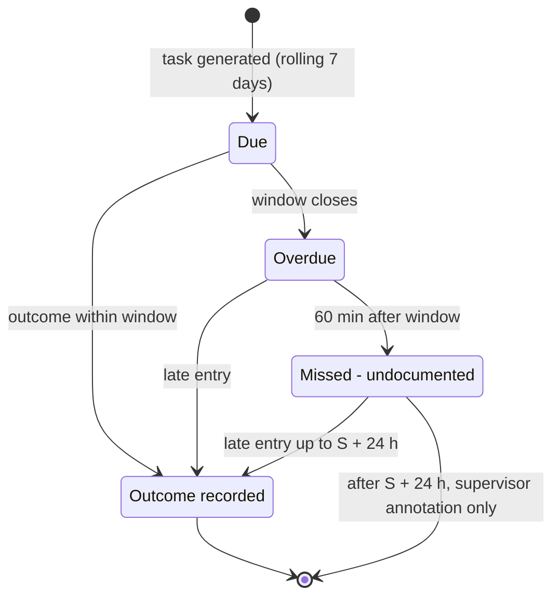

# Business Rules Catalog and Decision Tables: Tendwell

## Document control

| Field | Value |
|---|---|
| Document ID | TW-REQ-BR |
| Version | 1.3 (aligned with SRS v1.3) |
| Status | Approved (baselined) |
| Owner | Business Analyst |
| Last updated | 2026-09-24 |
| Reviewers | Product Owner; Engineering Lead; QA Lead; Clinical SME (RN advisor); Compliance and Privacy Officer; Customer Success Lead (pilot) |

**Purpose and scope.** This document holds the full catalog of the 58 business rules that constrain Tendwell's behavior, independent of any screen or API. It also gives decision tables for the rules whose combinations are easy to get wrong. The rule wording is canonical. The decision tables are the specification that developers implement and QA tests against, and every business rule needs at least one automated test (NFR-MNT-01).

## 1. Conventions

- **Rule wording** is canonical and identical in the [SRS](SRS.md), the user stories and the [traceability matrix](requirements-traceability-matrix.md).
- **Related FRs** are the functional requirements that implement a rule.
- **User stories** are the stories whose acceptance criteria exercise it.
- **Numbers are defaults.** Where a rule says "configurable", the tenant can change the value in Settings; the default is in [SRS section 2.7](SRS.md#27-configuration-defaults).
- **Enforcement.** Rules are enforced server-side. The UI may pre-check for a better experience but is never the control.
- **Hit policy** of each decision table, using the DMN terms:
  - **Unique:** exactly one row matches.
  - **First:** rows are evaluated top-down and the first match wins.
  - **Collect:** every matching row applies.
- **Time.** Every time in the tables is tenant local time (America/New_York in the examples). Durations are elapsed time (NFR-DAT-01).

Rules by area:

| Area | Rules | Count |
|---|---|---|
| Tenancy | BR-001 | 1 |
| Subscription | BR-002 to BR-004 | 3 |
| Access | BR-005 to BR-008 | 4 |
| Clients | BR-009 to BR-013 | 5 |
| Workforce | BR-014 to BR-015 | 2 |
| Scheduling | BR-016 to BR-019 | 4 |
| EVV | BR-020 to BR-028 | 9 |
| eMAR | BR-029 to BR-034 | 6 |
| Documentation | BR-035 to BR-037 | 3 |
| Time off | BR-038 to BR-040 | 3 |
| Payroll | BR-041 to BR-046 | 6 |
| Billing | BR-047 to BR-052 | 6 |
| Notifications | BR-053 to BR-056 | 4 |
| Audit | BR-057 to BR-058 | 2 |

## 2. Business rule catalog

### Tenancy (BR-001)

| ID | Rule | Related FRs | User stories |
|---|---|---|---|
| BR-001 | Every business record carries a tenant ID. Data is never readable across tenants; isolation is enforced in the database (row-level security), not only in the UI. | FR-IAM-06 | US-009, US-053 |

### Subscription (BR-002 to BR-004)

| ID | Rule | Related FRs | User stories |
|---|---|---|---|
| BR-002 | A trial code gives 21 days without a payment method. Price is per active client seat per month; a client is an active seat if they had at least one scheduled visit in the cycle. | FR-ONB-03, FR-ONB-06 | US-001, US-002, US-004 |
| BR-003 | Read-only state starts 7 days after trial expiry or after the third failed payment retry. In Read-only, users can view and export but not create or edit; EVV clock-in stays available so care is never blocked. | FR-ONB-07 | US-006 |
| BR-004 | Promo codes are percentage or fixed amount, have an expiry date and a maximum redemption count, and can be limited to specific plans. One code per subscription. | FR-ONB-03, FR-ONB-08 | US-002, US-005 |

### Access (BR-005 to BR-008)

| ID | Rule | Related FRs | User stories |
|---|---|---|---|
| BR-005 | Effective permissions = union of role-template permissions + granted overrides - denied overrides. A deny always wins. | FR-IAM-05 | US-009 |
| BR-006 | MFA is mandatory for Agency Administrator, Clinical Supervisor, Billing & Payroll Specialist and all platform roles. | FR-IAM-01 | US-007 |
| BR-007 | Password policy: minimum 12 characters, checked against a breached-password list; no forced periodic rotation (NIST SP 800-63B). | FR-IAM-01, FR-IAM-02 | US-007, US-008 |
| BR-008 | Support access grants last at most 4 hours, are read-only by default and every action under a grant is audited with the grant ID. | FR-IAM-07 | US-011 |

### Clients (BR-009 to BR-013)

| ID | Rule | Related FRs | User stories |
|---|---|---|---|
| BR-009 | A visit can only be scheduled against an active service authorization whose period covers the visit date and whose service line matches the visit. | FR-CLI-03, FR-SCH-03 | US-013, US-021 |
| BR-010 | Remaining units = authorized units - units on scheduled visits - units on delivered visits. Scheduling that exceeds remaining units is a warning that needs an override reason; scheduling against an expired authorization is a hard block. | FR-CLI-04, FR-SCH-03 | US-013, US-021 |
| BR-011 | PHI fields (date of birth, Medicaid ID, diagnoses, phone, service address) are encrypted at field level and masked by default. Reveal requires the clients:reveal_phi permission and a reason. | FR-CLI-06 | US-012, US-015 |
| BR-012 | A care plan, and any change to it, becomes Active only after Clinical Supervisor approval. Visits always use the care plan version that was Active at clock-in. | FR-CLI-05 | US-014, US-028 |
| BR-013 | Discharged client records are retained (default 7 years after discharge, configurable to state requirements) and are read-only. | FR-CLI-07 | US-016 |

### Workforce (BR-014 to BR-015)

| ID | Rule | Related FRs | User stories |
|---|---|---|---|
| BR-014 | Credential status: Valid; Expiring when 30 days or fewer remain; Expired after the expiry date. A caregiver with an Expired Blocking credential cannot be assigned to new visits and their existing future visits are flagged. | FR-WRK-02, FR-WRK-03, FR-SCH-03 | US-018, US-021, US-023 |
| BR-015 | Pay rates are effective-dated. A visit is paid at the rate effective on the visit date, even if the rate changes later. | FR-WRK-05 | US-019 |

### Scheduling (BR-016 to BR-019)

| ID | Rule | Related FRs | User stories |
|---|---|---|---|
| BR-016 | A caregiver cannot have overlapping visits (hard block). Consecutive visits at different addresses less than 15 minutes apart are a warning (travel buffer). | FR-SCH-03 | US-021, US-023 |
| BR-017 | A client exclusion (client or family declined a caregiver) is a hard block; a preference is used only for sorting suggestions. | FR-CLI-08, FR-SCH-03 | US-012, US-021, US-023 |
| BR-018 | Recurring patterns materialize visits for a rolling 8-week horizon, nightly. Editing a pattern changes only future, not-yet-started visits. | FR-SCH-01 | US-020, US-022 |
| BR-019 | Visit status lifecycle: Scheduled -> In progress -> Completed -> Verified; or Scheduled -> Cancelled; or Scheduled -> Missed (no clock-in by scheduled end). Completed visits with open exceptions show Needs review. | FR-SCH-04, FR-EVV-10 | US-022, US-024 |

### EVV (BR-020 to BR-028)

| ID | Rule | Related FRs | User stories |
|---|---|---|---|
| BR-020 | Each visit must capture the six EVV data elements required by the 21st Century Cures Act (Section 12006): type of service, individual receiving the service, date, location, individual providing the service, and begin and end time. | FR-EVV-02, FR-EVV-10 | US-025 |
| BR-021 | Geofence radius defaults to 150 m per service address (configurable 50-500 m). Distance is always computed on the server; the device cannot declare it. | FR-EVV-02, FR-EVV-03 | US-025 |
| BR-022 | A GPS fix with accuracy worse than 100 m, or coordinates (0,0), raises Low GPS accuracy instead of Location mismatch. | FR-EVV-03, FR-EVV-07 | US-025 |
| BR-023 | Clock-in opens 15 minutes before scheduled start. Late start and Early end exceptions are raised beyond a 10-minute tolerance. | FR-EVV-01, FR-EVV-07 | US-025 |
| BR-024 | A successful identity check is valid for 90 seconds and for one punch only; it cannot be reused. | FR-EVV-04 | US-026 |
| BR-025 | Offline punches keep the device capture time as the punch time and the server receipt time separately. A punch received more than 24 hours after capture raises Late offline sync. | FR-EVV-05 | US-027 |
| BR-026 | Punches are append-only. A time correction adds a new punch of source Manual with reason code, note and the editor's identity; the original stays visible in the visit history. | FR-EVV-08 | US-029 |
| BR-027 | A visit still open 14 hours after clock-in is auto-closed with the scheduled end as a placeholder clock-out. It is not paid or billed until a Coordinator resolves the Auto-closed exception. | FR-EVV-09 | US-030 |
| BR-028 | Only Verified visits count for payroll and billing. | FR-EVV-10, FR-PAY-02, FR-BIL-01 | US-029, US-041, US-044 |

### eMAR (BR-029 to BR-034)

| ID | Rule | Related FRs | User stories |
|---|---|---|---|
| BR-029 | Administration window = scheduled time +/- 60 minutes (configurable per order between 15 and 120 minutes). | FR-MAR-02, FR-MAR-03 | US-032 |
| BR-030 | Dose escalation: at the scheduled time, reminder to the caregiver; when the window closes undocumented, Overdue alert to caregiver and Care Coordinator; 60 minutes after the window closes, status Missed - undocumented and urgent alert to the Clinical Supervisor. | FR-MAR-04, FR-NTF-03 | US-033 |
| BR-031 | Doses are never auto-cancelled or deleted. A late entry is allowed up to 24 hours after the scheduled time and is labelled Late entry; after that only a Clinical Supervisor can annotate the dose. | FR-MAR-04 | US-033 |
| BR-032 | Refused, Held and Not available outcomes require a reason. Two consecutive Refused or Held outcomes for the same order alert the Clinical Supervisor. | FR-MAR-03, FR-MAR-06 | US-032, US-033 |
| BR-033 | A PRN administration is blocked if it would exceed the order's maximum doses in any rolling 24 hours or fall inside the minimum interval since the last PRN dose. The rolling window for a new dose at time t is (t - 24 h, t]: a dose given exactly 24 hours earlier no longer counts. | FR-MAR-05 | US-034 |
| BR-034 | Default vital alert ranges (overridable per client by the Clinical Supervisor): systolic BP < 90 or > 180 mmHg; diastolic BP > 110 mmHg; pulse < 50 or > 120 bpm; temperature >= 100.4 F; SpO2 < 92%; blood glucose < 70 or > 300 mg/dL. | FR-MAR-08 | US-035 |

### Documentation (BR-035 to BR-037)

| ID | Rule | Related FRs | User stories |
|---|---|---|---|
| BR-035 | A visit note locks 24 hours after clock-out. Addenda carry author, timestamp and electronic signature and never overwrite the original text. | FR-DOC-02 | US-036 |
| BR-036 | Default external reporting deadlines (tenant-configurable to state rules): Suspected abuse or neglect 24 hours; Serious injury 24 hours; Medication error with harm 72 hours. | FR-DOC-04, FR-DOC-06 | US-037, US-038 |
| BR-037 | An incident can be closed only by a Clinical Supervisor and only when every corrective action is Done or formally Waived with a reason. | FR-DOC-05 | US-038 |

### Time off (BR-038 to BR-040)

| ID | Rule | Related FRs | User stories |
|---|---|---|---|
| BR-038 | Time-off requests need 7 days' notice (Sick leave exempt); shorter notice is allowed but flagged Short notice. | FR-TOF-02 | US-039 |
| BR-039 | Approved time off blocks scheduling for its dates (hard block) and moves already-assigned visits to Open Shifts. | FR-TOF-03, FR-SCH-03 | US-021, US-040 |
| BR-040 | Default accrual: 1 hour of PTO per 30 hours worked, capped at 80 hours balance (tenant-configurable). PTO hours do not count toward overtime. | FR-TOF-04, FR-PAY-02 | US-039 |

### Payroll (BR-041 to BR-046)

| ID | Rule | Related FRs | User stories |
|---|---|---|---|
| BR-041 | Weekly overtime: hours worked over 40 in the tenant's workweek are paid at 1.5x for overtime-eligible caregivers. Tenants can switch on a daily-overtime profile: over 8 hours in a day at 1.5x and over 12 hours at 2.0x. Weekly overtime falls on the chronologically last hours of the workweek; hours already paid as daily overtime or double time do not count toward the weekly 40. | FR-PAY-02 | US-041 |
| BR-042 | Hours worked on a tenant holiday are paid at 1.5x (configurable) for holiday-eligible caregivers. No stacking: a minute that is both overtime and holiday is paid at the higher multiplier only. | FR-PAY-02, FR-TOF-05 | US-041 |
| BR-043 | Travel time between consecutive visits on the same day is hours worked. Paid travel = min(actual gap, estimated drive time + 10 minutes), only when the gap is 2 hours or less; longer gaps are off duty. | FR-PAY-02 | US-041 |
| BR-044 | Mileage reimbursement = miles between consecutive visits x tenant mileage rate, for mileage-eligible caregivers only. Mileage is a reimbursement line, not wages, and never changes hours. | FR-PAY-02 | US-041 |
| BR-045 | Overlapping time from different sources (visits, travel, non-visit time) is merged so each minute is counted once. Time is held to the second and rounded to 2 decimals only for display and export. | FR-PAY-03 | US-041 |
| BR-046 | Exporting payroll locks the period. Any later change to a visit in a locked period creates an adjustment line in the next open period that references the original visit. | FR-PAY-05, FR-PAY-06 | US-042, US-043 |

### Billing (BR-047 to BR-052)

| ID | Rule | Related FRs | User stories |
|---|---|---|---|
| BR-047 | Hourly billing uses 15-minute units per visit: units = floor(minutes / 15), plus 1 if the remainder is 8 minutes or more, where minutes are the whole elapsed minutes of the Verified visit (seconds truncated). | FR-BIL-02 | US-045 |
| BR-048 | Per visit = one charge per Verified visit. Daily rate = one charge per calendar day with at least one Verified visit. Fixed monthly = flat rate, prorated by days active in a month of admission or discharge. | FR-BIL-02 | US-045 |
| BR-049 | Billed units are capped at remaining authorized units; the excess is shown but not charged. | FR-BIL-03 | US-045 |
| BR-050 | A billing run's idempotency key is tenant + client + payer + period. Re-running a period updates existing Draft invoices and never creates a second invoice for the same key. | FR-BIL-01 | US-044 |
| BR-051 | Issued invoices are immutable. Corrections are made only by credit note (with reason) or by voiding an unpaid invoice and reissuing it. | FR-BIL-04, FR-BIL-07 | US-044, US-048 |
| BR-052 | Default payment terms are net 30 days. Overdue reminders go out 1, 7 and 14 days after the due date. | FR-BIL-08 | US-046 |

### Notifications (BR-053 to BR-056)

| ID | Rule | Related FRs | User stories |
|---|---|---|---|
| BR-053 | Quiet hours 21:00-07:00 tenant local time apply to non-urgent notifications. Urgent events (every step of the dose escalation in BR-030, out-of-range vital alert, High-severity incident, suspected abuse or neglect) bypass quiet hours. | FR-NTF-02 | US-035, US-037, US-049 |
| BR-054 | Recipients are resolved at send time from active users holding the target role in the relevant location; deactivated users never receive notifications. | FR-NTF-03 | US-050 |
| BR-055 | Deduplication key = event ID + recipient + escalation step. Failed deliveries retry 3 times at 1, 4 and 16 minutes. | FR-NTF-04 | US-050 |
| BR-056 | SMS, push and email content never contains PHI (no client names, diagnoses, medications or addresses); messages carry a generic summary and a deep link that requires sign-in. | FR-NTF-05 | US-049, US-054 |

### Audit (BR-057 to BR-058)

| ID | Rule | Related FRs | User stories |
|---|---|---|---|
| BR-057 | Audit events are append-only, record actor, action, entity, before and after values, IP, device and timestamp, and are retained for 7 years. | FR-RPT-03 | US-015, US-052 |
| BR-058 | Every export carries a watermark (user, tenant, timestamp) and creates an audit event. | FR-RPT-04 | US-052 |

## 3. Decision tables

### 3.1 EVV exception determination

Implements BR-020 to BR-027 and FR-EVV-03, FR-EVV-07, FR-EVV-09 and FR-EVV-10. Exceptions never block a punch; they block Verified status (BR-028). A visit has at most one open exception per code. If a second punch triggers the same code, its evidence is added to that exception.

**Table 3.1a: location (hit policy Unique), evaluated on every clock-in and clock-out punch**

| # | Usable coordinates (present, not 0,0) | Horizontal accuracy | Server-computed distance vs client radius | Exception raised | Distance stored |
|---|---|---|---|---|---|
| L1 | No | Any | Not computed | LOW_GPS_ACCURACY | No |
| L2 | Yes | Worse than 100 m | Not evaluated for mismatch | LOW_GPS_ACCURACY | Yes, for information |
| L3 | Yes | 100 m or better | Greater than radius | LOCATION_MISMATCH | Yes |
| L4 | Yes | 100 m or better | Equal to or less than radius | None | Yes |

Boundaries:
- An accuracy of exactly 100 m is usable ("worse than 100 m" means more than 100).
- A distance exactly equal to the radius is inside ("exceeds" means more than).
- The radius is the client's `geofence_radius_m`: default 150 m, configurable 50-500 m (BR-021).

Rationale for L2 (CR-004): a fix with 3.4 km accuracy cannot show that the caregiver was elsewhere. INC-2026-011 showed that treating it as a mismatch produces false accusations at scale. An accuracy-adjusted rule (mismatch only when distance minus accuracy exceeds the radius) was considered and rejected: a fixed threshold is easier for Coordinators and auditors to understand.

**Table 3.1b: timing, sync and identity (hit policy Collect)**

| # | Input | Condition | Result | Evaluated |
|---|---|---|---|---|
| C0 | Clock-in time vs scheduled start | Earlier than start minus 15 min | Punch rejected with a message (FR-EVV-01). No exception. | On the device and at the server |
| T1 | Clock-in punch time vs scheduled start | Later than start plus 10 min | LATE_START | At clock-in |
| T2 | Clock-out punch time vs scheduled end | Earlier than end minus 10 min | EARLY_END | At clock-out |
| T3 | Visit In progress, no clock-out | Now is later than scheduled end plus 10 min | MISSING_CLOCK_OUT (trigger per TBD-01). Resolved automatically if a device clock-out arrives before auto-close. | Scheduler, every 5 min |
| T4 | Visit In progress, no clock-out | Now is at least clock-in plus 14 h | AUTO_CLOSED. Placeholder clock-out at the scheduled end; excluded from pay and billing until resolved (BR-027). | Scheduler |
| O1 | Server receipt time minus device punch time | More than 24 h | LATE_OFFLINE_SYNC (BR-025) | At sync |
| I1 | Identity check (tenant enabled) | Result Fail; or no Pass that is less than 90 s old and unused at the punch | IDENTITY_CHECK_FAILED (BR-024) | At the punch |
| U1 | Visit origin | Visit created at or after its start: caregiver-started unscheduled visit, offline punches for a cancelled or reassigned visit, or Coordinator back-entry with manual punches | UNSCHEDULED_VISIT (origins per TBD-02) | At creation |

Timing rules (T1, T2) use the device capture time of the punch, not the server receipt time. An offline punch is judged on when it happened.

**Table 3.1c: Verified decision (hit policy Unique), FR-EVV-10**

| Clock-in and clock-out present | Six EVV elements present (BR-020) | Open exceptions | Status |
|---|---|---|---|
| Yes | Yes | None (all Resolved or Waived) | Verified |
| Yes | Yes | One or more | Needs review |
| Yes | No | Any | Needs review (data completion required) |
| No | n/a | Any | In progress, Missed or Auto-closed, per BR-019 and BR-027 |

**Worked examples.** The canonical geofence cases (radius 150 m):

| Distance | Accuracy | Result |
|---|---|---|
| 212 m | 18 m | LOCATION_MISMATCH |
| 95 m | 3,400 m | LOW_GPS_ACCURACY (not mismatch) |
| 40 m | 12 m | No exception |

The following rows are illustrative extensions that show the boundaries and the precedence of L2:

| Distance | Accuracy | Rule | Result |
|---|---|---|---|
| 3,100 m | 3,400 m | L2 | LOW_GPS_ACCURACY. Precedence: never a mismatch while the fix is unusable. |
| 150 m | 20 m | L4 | No exception (on the boundary is inside). |
| 151 m | 100 m | L3 | LOCATION_MISMATCH (accuracy on the boundary is usable). |

A combined case: an offline clock-in captured at 08:22 on 2026-09-14 for an 08:00 visit, received at 09:05 on 2026-09-15. It raises LATE_START (T1: 22 minutes late) and LATE_OFFLINE_SYNC (O1: 24 h 43 min after capture).

### 3.2 Billing model and pricing

Implements BR-047 to BR-050 and FR-BIL-01 to FR-BIL-03. Only Verified visits are priced (BR-028). Billable minutes for Hourly are the elapsed time between the effective clock-in and clock-out, after any corrections (BR-026).

**Table 3.2a: charge by billing model (hit policy Unique on the authorization's billing model)**

| Billing model | Unit type | What creates a charge | Units | Amount |
|---|---|---|---|---|
| Hourly | Unit15Min | Each Verified visit | floor(minutes / 15), plus 1 if the remainder is 8 minutes or more (BR-047) | Units x rate |
| PerVisit | Visit | Each Verified visit, whatever its length | 1 | Rate |
| Daily | Day | Each tenant-local calendar day with at least one Verified visit | 1 per day; a second check-in the same day adds nothing | Rate |
| FixedMonthly | Month | Each month in which the client is Active | 1 | Rate x active days / days in the month, only in the month of admission or discharge; rounded half up to the cent |

**Table 3.2b: hourly unit rounding (hit policy Unique on the remainder)**

| Minutes | floor(minutes / 15) | Remainder | Round up? | Units |
|---|---|---|---|---|
| 7 | 0 | 7 | No | 0 |
| 8 | 0 | 8 | Yes | 1 |
| 22 | 1 | 7 | No | 1 |
| 23 | 1 | 8 | Yes | 2 |
| 113 | 7 | 8 | Yes | 8 |
| 120 | 8 | 0 | No | 8 |
| 127 | 8 | 7 | No | 8 |

A visit shorter than 8 minutes yields 0 units. Such a visit normally carries EARLY_END and is reviewed before it can be Verified.

**Table 3.2c: authorization cap (hit policy First), applied per line in visit order**

Remaining units for billing are the units authorized minus the units already billed on non-Void invoices for that authorization. Units on future scheduled visits count for scheduling (BR-010), not for billing.

| # | Authorization for the service date | Remaining units R before this line, vs line units U | Billable units | Not billable units and reason |
|---|---|---|---|---|
| A1 | No Active authorization covers the date (expired, suspended or none) | n/a | 0 | U, "Not billable - no active authorization" |
| A2 | Active | R is at least U | U | 0 |
| A3 | Active | R is more than 0 and less than U | R | U - R, "Not billable - exceeds authorization" |
| A4 | Active | R is 0 | 0 | U, "Not billable - exceeds authorization" |

Not-billable units are shown on the invoice but excluded from the totals (BR-049). An override reason accepted at scheduling time (BR-010) does not make units billable.

**Table 3.2d: billing run idempotency (hit policy Unique on the existing invoice for the key tenant + client + payer + period)**

| Existing non-Void invoice for the key | Run behavior |
|---|---|
| None | Create a Draft invoice. |
| Draft | Update its lines and totals in place. Never create a second invoice (BR-050). |
| Approved | No change; listed in the run summary for review. |
| Issued, PartiallyPaid, Paid or Overdue | No change. A visit verified later is billed on the next period's invoice (TBD-16). |

The database enforces uniqueness of the key among non-Void invoices (CR-005). Excluding Void invoices is what allows the void-and-reissue correction in BR-051 without a second live invoice. Before an invoice issues, a duplicate check blocks it if any of its visits already sit on another non-Void invoice.

**Worked examples.** Hourly, client C-10234, authorization T1019 at $7.25 per unit:

| Visit | Minutes | Calculation | Units |
|---|---|---|---|
| A | 127 | 8 r7, no round-up | 8 |
| B | 113 | 7 r8, round up | 8 |
| C | 120 | | 8 |
| **Total** | | | **24 units = $174.00** |

If only 20 units remain on the authorization, 20 units are billable ($145.00) and 4 units appear as Not billable - exceeds authorization. Visits A and B match A2 and visit C matches A3: 4 billable and 4 not billable.

Daily rate: an adult day client on S5102 at $78.00 per day who attends on 14 days is billed $1,092.00. A day with two check-ins is still one charge.

Fixed monthly: a supported-living resident at $6,200.00 per month is admitted 2026-09-10, so is active 21 of 30 days: 6,200 x 21/30 = $4,340.00.

### 3.3 Payroll hour classification

Implements BR-040 to BR-046 and FR-PAY-02 and FR-PAY-03. Inputs are the merged minutes of the caregiver's workweek: Verified visit time plus paid travel, with each minute counted once (BR-045). Each minute gets exactly one line type.

**Table 3.3a: line type per minute worked (hit policy First)**

| # | Time type | Overtime-eligible | Daily overtime profile (CR-001) | Position of the minute | Tenant holiday and holiday-eligible | Line type | Multiplier |
|---|---|---|---|---|---|---|---|
| P1 | PTO | Any | Any | Not hours worked | Any | PTO | 1.0. Excluded from all overtime counts (BR-040). |
| P2 | Visit or travel | No | Any | Any | Yes | Holiday | Holiday multiplier (default 1.5) |
| P3 | Visit or travel | No | Any | Any | No | Regular or Travel | 1.0 |
| P4 | Visit or travel | Yes | On | Beyond 12 h worked that day | Any | DoubleTime, or Holiday if its multiplier is higher | 2.0, or the higher multiplier |
| P5 | Visit or travel | Yes | On | Beyond 8 h and up to 12 h that day | Any | Overtime, or Holiday if its multiplier is higher | 1.5, or the higher multiplier |
| P6 | Visit or travel | Yes | Any | Beyond 40 h worked in the workweek (with the daily profile, excluding minutes already paid as daily overtime) | Any | Overtime, or Holiday if its multiplier is higher | 1.5, or the higher multiplier |
| P7 | Visit or travel | Yes | Any | Within the first 40 h, and within 8 h that day if the daily profile is on | Yes | Holiday | Holiday multiplier |
| P8 | Visit or travel | Yes | Any | Within the first 40 h, and within 8 h that day if the daily profile is on | No | Regular (visit) or Travel (travel) | 1.0 |

Further rules for applying the table:
- **No stacking (BR-042).** A minute that qualifies for both overtime and holiday is paid once, at the higher multiplier. If the multipliers are equal (1.5 and 1.5), the line is labelled Overtime so overtime reporting stays complete.
- **Weekly overtime is chronological.** It falls on the last minutes of the workweek in time order.
- **Workweek and day boundaries** use tenant-local dates. A visit crossing midnight into a holiday has only its holiday-date minutes paid as Holiday.
- **Rates are effective-dated.** The base rate is the one effective on the visit date (BR-015). Adjustments for a locked period use the original visit's rate (BR-046).

**Table 3.3b: paid travel between consecutive Verified visits on the same day (hit policy First), BR-043**

| # | Situation | Paid travel |
|---|---|---|
| V1 | Before the first visit or after the last visit of the day (commute) | 0 |
| V2 | The drive-time estimate is unavailable (IF-05) | Pending; listed on the pre-export review (FR-PAY-04) |
| V3 | Gap between clock-out and the next clock-in is more than 2 h | 0 (off duty) |
| V4 | Gap of 2 h or less | min(actual gap, estimated drive time + 10 min) |

Examples:
- A 35-minute gap with an 18-minute drive pays 28 minutes.
- A 20-minute gap with a 15-minute drive pays 20 minutes.
- A 2 h 30 min gap pays nothing.
- Two visits at the same address, 30 minutes apart, pay 10 minutes (TBD-11).

Mileage (BR-044) is a separate reimbursement line: the miles between the same consecutive visits, times the tenant rate, for mileage-eligible caregivers only. It never adds hours.

**Worked example (canonical, US-041).** Caregiver E-2041 Maya Ortiz:
- Pay profile: hourly $19.50, overtime-, holiday- and mileage-eligible.
- Workweek: Monday 2026-09-07 (Labor Day, a tenant holiday) to Sunday 2026-09-13.
- Hours: 40.5 verified visit hours, 6.0 of them on Monday, plus 2.5 h of paid travel, for 43.0 h. Overtime is the chronologically last 3.0 h, on Sunday.

| Line | Hours | Rate | Amount |
|---|---|---|---|
| Holiday | 6.0 | $29.25 | $175.50 |
| Regular | 31.5 | $19.50 | $614.25 |
| Travel | 2.5 | $19.50 | $48.75 |
| Overtime | 3.0 | $29.25 | $87.75 |
| **Total wages** | | | **$926.25** |
| Mileage (reimbursement, not wages) | 46.2 mi | $0.70 | $32.34 |
| **Total payable** | | | **$958.59** |

How the lines come from the table:
- The 6.0 Monday visit hours fall within the first 40 h and match P7, so they are Holiday at $29.25.
- The last 3.0 h match P6, so they are Overtime at $29.25.
- The remaining 31.5 visit hours match P8 (Regular), and the 2.5 travel hours match P8 (Travel).
- No minute qualifies for both holiday and overtime, so the no-stacking rule does not change anything here.

**Daily-profile example (illustrative).** With the daily profile on, an overtime-eligible caregiver works 13.0 h on a non-holiday weekday. The result is 8.0 h Regular (P8), 4.0 h Overtime (P5) and 1.0 h DoubleTime (P4). The 5.0 daily-overtime hours do not count toward the weekly 40.

### 3.4 Scheduling compliance checks

Implements BR-009, BR-010, BR-014, BR-016, BR-017 and BR-039, and FR-SCH-03. The hit policy is Collect: all results are returned together, from the dry-run endpoint while editing and again in the save transaction. A save is refused if any hard block applies. A warning can be accepted by a Care Coordinator or Agency Administrator with a reason, which is audited.

| # | Check | Condition | Result | Rule |
|---|---|---|---|---|
| S1 | Tenant state | Tenant is Read-only | Hard block | BR-003 |
| S2 | Client status | Client is OnHold, or Discharged on the visit date | Hard block | FR-CLI-07, BR-013 |
| S3 | Authorization coverage | No Active authorization whose period covers the visit date and whose service line matches | Hard block | BR-009, BR-010 |
| S4 | Remaining units | Units for this visit exceed the remaining units (authorized minus scheduled minus delivered) | Warning; override reason required | BR-010 |
| S5 | Caregiver overlap | Overlaps any minute of another visit for the same caregiver | Hard block | BR-016 |
| S6 | Travel buffer | Less than 15 minutes to the previous or next visit at a different address | Warning | BR-016 |
| S7 | Blocking credential, today | The caregiver holds an Expired Blocking credential | Hard block for new assignments; their existing future visits are flagged | BR-014 |
| S8 | Blocking credential, visit date | Valid or Expiring today, but expires before the visit date | Warning (becomes S7 once it expires) | BR-014, SRS v1.2 clarification |
| S9 | Advisory credential | Expired, or expires before the visit date | Warning | FR-WRK-03 |
| S10 | Client exclusion | The client or family has excluded this caregiver | Hard block | BR-017 |
| S11 | Client preference | The caregiver is preferred | No result; used only to sort suggestions | BR-017 |
| S12 | Approved time off | Overlaps the visit | Hard block | BR-039 |
| S13 | Pending time off | A pending request overlaps the visit | Warning | SRS v1.2 clarification |
| S14 | Caregiver status | Caregiver is Inactive | Hard block | FR-WRK-06 |

For open shifts (FR-SCH-05), a caregiver is eligible only if no hard block applies to them. Warnings go to the Coordinator when claim confirmation is enabled (CR-002); otherwise they are recorded on the visit.

**Example.** Scheduling E-2041 for client C-10234 on 2026-10-12, 09:00-11:00, returns S12 (approved time off), a hard block. The message names the fix: choose another caregiver or leave the visit as an open shift. Scheduling the same visit for another caregiver with 6 units left on an 8-unit visit returns S4, a warning that needs an override reason. The 2 extra units remain subject to the billing cap (table 3.2c).

### 3.5 Dose status timeline

Implements BR-029 to BR-032 and FR-MAR-02 to FR-MAR-04. S is the scheduled time; W is the window half-width (default 60 minutes, configurable per order from 15 to 120). The hit policy is First, by time.

| # | Time | Outcome recorded? | Status | Notification | Labelled Late entry? |
|---|---|---|---|---|---|
| D1 | From generation until S - W | No | Due (upcoming) | None | n/a |
| D2 | At S | No | Due | Reminder to the caregiver (BR-030) | n/a |
| D3 | S - W to S + W | Yes | Recorded outcome (Given, Refused, Held, Not available, Self-administered) | None. Refused or Held twice in a row for the same order alerts the Clinical Supervisor (BR-032). | No |
| D4 | At S + W (window closes) | No | Overdue | Overdue alert to the caregiver and the Care Coordinator (BR-030) | n/a |
| D5 | S + W to S + W + 60 min | Yes | Recorded outcome | Escalation stops | Yes |
| D6 | At S + W + 60 min | No | Missed - undocumented | Urgent alert to the Clinical Supervisor; escalation ladder starts (BR-030) | n/a |
| D7 | S + W + 60 min to S + 24 h | Yes | Recorded outcome; the Missed history is kept | Escalation stops | Yes |
| D8 | After S + 24 h | No | Missed - undocumented (final) | None. Only a Clinical Supervisor annotation is possible (BR-031). | n/a |

Doses are never auto-cancelled or deleted (BR-031). CR-007, which proposed auto-cancelling undocumented doses at midnight, was rejected because it would erase the evidence that a dose was missed. Tasks for discontinued orders and discharged clients are TBD-06.

**Example.** An 08:00 dose with the default window has its window from 07:00 to 09:00. It becomes Overdue at 09:00 and Missed - undocumented at 10:00. A late entry is accepted until 08:00 the next day. With a 15-minute window, the same dose is Overdue at 08:15 and Missed at 09:15. With a 120-minute window, it is Overdue at 10:00 and Missed at 11:00. The late-entry limit stays at 08:00 the next day, because it runs from S, not from the window.

### 3.6 Notification urgency and quiet hours

Implements BR-053 to BR-056 and FR-NTF-01 to FR-NTF-05. The hit policy is First, evaluated at send time and again when a held message is released.

| # | Recipient eligible now (active user, holds the target role at the location) | Dedupe key already sent | Urgency | Tenant-local time | Channel | Outcome |
|---|---|---|---|---|---|---|
| N1 | No | Any | Any | Any | Any | Suppressed (BR-054). Addressing a deactivated user also fires the NFR-OBS-02 alert. |
| N2 | Yes | Yes | Any | Any | Any | Suppressed (BR-055) |
| N3 | Yes | No | Urgent | Any | Preferred channels, always including push or SMS | Sent immediately (BR-053) |
| N4 | Yes | No | Not urgent | 07:00-20:59 | Preferred channels | Sent |
| N5 | Yes | No | Not urgent | 21:00-06:59 | In-app | Delivered to the inbox silently |
| N6 | Yes | No | Not urgent | 21:00-06:59 | Push, SMS or email | Held until 07:00, then re-evaluated from N1. Suppressed if the triggering condition has resolved. |

Supporting rules:
- **Urgent events (BR-053):** every step of the dose escalation (scheduled-time reminder, Overdue, Missed - undocumented), out-of-range vital alert, High-severity incident, suspected abuse or neglect. Dose steps were added to the urgent list in SRS v1.2 after a UAT defect in which an evening Overdue alert was held until morning ([defect log](../06-quality/defect-log.csv)). In R1, a schedule change to a visit that starts before 09:00 the next morning is also sent immediately (TBD-05).
- **Delivery failures** retry at 1, 4 and 16 minutes, then are marked Failed (BR-055). The escalation ladder's next step runs on its own delay, independent of retries, and stops when the condition resolves (FR-NTF-03).
- **Content** for SMS, push and email is generic text with a sign-in deep link. It never includes client names, diagnoses, medications or addresses (BR-056).

**Examples.**
- A vital alert at 23:10 matches N3: push and SMS go to the Clinical Supervisor at once.
- A credential reminder generated at 21:30 matches N5 for in-app and N6 for push, so the push goes out at 07:00.
- An Overdue alert at 23:00 for a 22:00 dose is urgent (dose escalation step), so it is pushed immediately to the night-shift caregiver and the on-call Care Coordinator. A credential-expiry reminder generated at 23:00 is not urgent and is held until 07:00.

### 3.7 Credential status computation

Implements BR-014 and FR-WRK-02 to FR-WRK-04. d is expires_on minus today, in tenant-local days. Status is recomputed nightly and on every edit. The hit policy is Unique.

| # | Expiry date | d | Status | Effect if the type is Blocking | Effect if the type is Advisory |
|---|---|---|---|---|---|
| K1 | None (no expiry) | n/a | Valid | None | None |
| K2 | Set | More than 30 | Valid | None | None |
| K3 | Set | 0 to 30 | Expiring | Assignable. Visits dated after the expiry get the S8 warning. | S9 warning for visits after the expiry |
| K4 | Set | Less than 0 | Expired | No new assignments (S7 hard block); existing future visits are flagged for reassignment | S9 warning |

Reminders go to the caregiver and the Care Coordinator when d is 30, 14 and 1 (FR-WRK-04). They are not urgent, so they follow the quiet-hours rule (table 3.6).

**Example.** A Blocking credential expiring 2026-10-31:
- On 2026-10-03, d = 28, so the status is Expiring.
- Reminders went or will go out on 2026-10-01 (d = 30), 2026-10-17 (d = 14) and 2026-10-30 (d = 1).
- On 2026-10-31 itself (d = 0) it is still Expiring and valid for that day's visits.
- From 2026-11-01 it is Expired. New assignments are blocked, and visits on or after that date are flagged. OBJ-05 measures that none of them reach Verified with the credential still expired.

## 4. Rules changed by change requests

| Rule | Change | CR | SRS version | Origin |
|---|---|---|---|---|
| BR-041 | Daily overtime profile added (over 8 h at 1.5x, over 12 h at 2.0x) | CR-001 | v1.1 | States with daily overtime rules |
| BR-022 | Low accuracy raises Low GPS accuracy instead of Location mismatch | CR-004 | v1.3 | INC-2026-011 |
| BR-050 | Idempotency enforced by a database unique constraint; pre-issue duplicate check | CR-005 | v1.3 | INC-2026-007 |
| BR-054 | Recipients resolved at send time; deactivated users never notified | CR-006 | v1.3 | INC-2026-015 |
| BR-056 | No-PHI rule extended to email bodies | CR-006 | v1.3 | INC-2026-015 |
| BR-030, BR-031 | Confirmed unchanged when CR-007 (auto-cancel undocumented doses at midnight) was rejected | CR-007 | n/a | Clinical safety and audit risk |

CR-002 (open-shift confirmation) changed FR-SCH-05 but no business rule. CR-008 (in-app payroll processing) was rejected; payroll stays an export (FR-PAY-05).

## 5. Rule precedence and known tensions

| # | Tension | Resolution in R1 |
|---|---|---|
| 1 | BR-003 (Read-only) vs point-of-care documentation | Care is never blocked. All caregiver point-of-care actions remain available (TBD-07). |
| 2 | FR-EVV-03 (mismatch when outside the radius) vs BR-022 | BR-022 takes precedence: an unusable fix is never a mismatch (table 3.1a). |
| 3 | BR-041 overtime vs BR-042 holiday | One line per minute at the higher multiplier; a tie is labelled Overtime (table 3.3a). |
| 4 | BR-010 (warning at scheduling) vs BR-049 (cap at billing) | Both apply. An override at scheduling does not make the excess billable. |
| 5 | BR-053 (urgent bypass) vs user channel preferences | An urgent event always includes push or SMS. Preferences cannot reduce it to in-app only. |
| 6 | BR-031 (never auto-cancel) vs order discontinuation and discharge | Future tasks are not generated; tasks whose window has opened are kept (TBD-06). |
| 7 | BR-027 (auto-close at 14 h) vs long supported-living shifts | Visits must end within 13 h 55 min; longer shifts are split (TBD-15). |
| 8 | BR-050 (one invoice per key) vs BR-051 (void and reissue) | The key is unique among non-Void invoices only (table 3.2d). |
| 9 | BR-046 (adjustments) vs BR-015 (effective-dated rates) | Adjustments are priced at the rate effective on the original visit date. |
| 10 | BR-013 and BR-057 (7-year retention) vs deletion after cancellation (NFR-PRIV-03) | The agency keeps its records through the export. Tendwell keeps audit metadata without PHI (TBD-17). |
| 11 | BR-036 deadlines name "Serious injury" and "Medication error with harm", which are not incident categories | Mapped through category and severity (TBD-08). |

## Related documents

- [Software Requirements Specification](SRS.md)
- [Business Requirements Document](BRD.md)
- [Non-functional requirements](non-functional-requirements.md)
- [Compliance mapping](compliance-mapping.md)
- [Glossary](glossary.md)
- [Requirements traceability matrix](requirements-traceability-matrix.md)
- [State machines](../03-design/diagrams/state-machines.md)
- [Process flows](../03-design/diagrams/process-flows.md)
- [Change request log](../05-delivery/change-request-log.md)
- [Test cases](../06-quality/test-cases.md)
