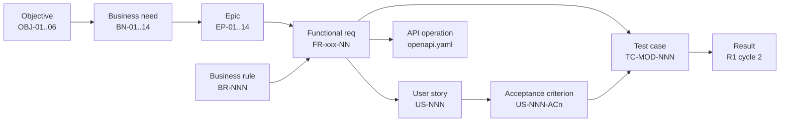

# Requirements Traceability Matrix (RTM)

## Document control

| Field | Value |
|---|---|
| Document ID | TW-REQ-RTM |
| Version | 1.3 |
| Status | Baselined |
| Owner | Business Analyst |
| Last updated | 2026-09-24 |
| Reviewers | Product Owner, QA Lead, Engineering Lead |

## Purpose and how this matrix is built

This RTM traces every functional requirement forward to the business objective it serves, the business rules that constrain it, the user stories and acceptance criteria that deliver it, the API operations that implement it and the test cases that verify it. It also traces non-functional requirements and business rules to tests.

The matrix is **generated, not hand-maintained**. A script reads `model.yaml` (the ID register), the user-story files, `openapi.yaml` (`x-requirements` on each operation) and `test-cases.csv`, so a broken link shows up as a gap instead of hiding in a spreadsheet. The full forward trace, one row per FR, is in [requirements-traceability-matrix.csv](requirements-traceability-matrix.csv); this page summarizes it.

## Coverage summary

| Measure | Result |
|---|---|
| Functional requirements | 93 (90 R1, 3 R2) |
| FRs with at least one user story | 93 of 93 |
| FRs with at least one test case | 93 of 93 |
| FRs implemented by at least one API operation | 91 of 93 (the rest are UI-only, scheduled-job or notification behaviors, verified through the operations and jobs that trigger them) |
| Business rules with at least one test case | 58 of 58 |
| NFRs with at least one test case | 27 of 29 (the remainder are verified by inspection or CI gates; see the NFR document) |
| User stories / acceptance criteria | 54 / 294 |
| Test cases | 118 |

| Verification status (FR level) | Count |
|---|---|
| Verified | 84 |
| Covered - open defect | 4 |
| Covered - blocked | 2 |
| Planned (R2) | 3 |

Status rules: **Verified** = every linked test passed in the last cycle; **Covered - open defect** = at least one linked test failed and the defect is tracked in the [defect log](../06-quality/defect-log.csv); **Planned (R2)** = R2 test cases drafted but not executed.

## Forward traceability by module

| Epic | FR | Priority | Rel | Business rules | Stories | ACs | API ops | Test cases | Status |
|---|---|---|---|---|---|---|---|---|---|
| EP-01 | FR-ONB-01 | Must | R1 | - | US-001 | 5 | 2 | TC-ONB-001 | Verified |
| EP-01 | FR-ONB-02 | Must | R1 | - | US-003 | 5 | 2 | TC-ONB-002 | Verified |
| EP-01 | FR-ONB-03 | Must | R1 | BR-002, BR-004 | US-002 | 5 | 2 | TC-ONB-003 | Verified |
| EP-01 | FR-ONB-04 | Must | R1 | - | US-001 | 5 | 1 | TC-ONB-002 | Verified |
| EP-01 | FR-ONB-05 | Should | R1 | - | US-003 | 5 | 1 | TC-ONB-002 | Verified |
| EP-01 | FR-ONB-06 | Must | R1 | BR-002 | US-004 | 6 | 3 | TC-ONB-004 | Verified |
| EP-01 | FR-ONB-07 | Must | R1 | BR-003 | US-006 | 6 | 3 | TC-ONB-005, TC-NFR-016 | Verified |
| EP-01 | FR-ONB-08 | Must | R1 | BR-004 | US-005 | 5 | 5 | TC-ONB-006 | Verified |
| EP-02 | FR-IAM-01 | Must | R1 | BR-006, BR-007 | US-007 | 6 | 2 | TC-IAM-001, TC-IAM-002 | Verified |
| EP-02 | FR-IAM-02 | Must | R1 | BR-007 | US-008 | 5 | 2 | TC-IAM-002 | Verified |
| EP-02 | FR-IAM-03 | Must | R1 | - | US-010 | 5 | 2 | TC-IAM-003 | Verified |
| EP-02 | FR-IAM-04 | Must | R1 | - | US-010 | 5 | 2 | TC-IAM-004 | Verified |
| EP-02 | FR-IAM-05 | Must | R1 | BR-005 | US-009 | 6 | 6 | TC-IAM-005 | Verified |
| EP-02 | FR-IAM-06 | Must | R1 | BR-001 | US-009 | 6 | 3 | TC-IAM-006, TC-IAM-007, TC-NFR-008 | Verified |
| EP-02 | FR-IAM-07 | Should | R1 | BR-008 | US-011 | 5 | 3 | TC-IAM-008 | Verified |
| EP-02 | FR-IAM-08 | Must | R1 | - | US-007 | 6 | 2 | TC-IAM-001, TC-IAM-003 | Verified |
| EP-03 | FR-CLI-01 | Must | R1 | - | US-012 | 6 | 4 | TC-CLI-001 | Verified |
| EP-03 | FR-CLI-02 | Should | R1 | - | US-012 | 6 | 1 | TC-CLI-002 | Verified |
| EP-03 | FR-CLI-03 | Must | R1 | BR-009 | US-013 | 5 | 2 | TC-CLI-003, TC-SCH-004 | Verified |
| EP-03 | FR-CLI-04 | Must | R1 | BR-010 | US-013 | 5 | 1 | TC-CLI-004, TC-SCH-004 | Verified |
| EP-03 | FR-CLI-05 | Must | R1 | BR-012 | US-014 | 5 | 2 | TC-CLI-005 | Verified |
| EP-03 | FR-CLI-06 | Must | R1 | BR-011 | US-015 | 5 | 3 | TC-CLI-006 | Verified |
| EP-03 | FR-CLI-07 | Must | R1 | BR-013 | US-016 | 5 | 1 | TC-CLI-007 | Verified |
| EP-03 | FR-CLI-08 | Should | R1 | BR-017 | US-012 | 6 | 2 | TC-CLI-008 | Verified |
| EP-04 | FR-WRK-01 | Must | R1 | - | US-017 | 6 | 3 | TC-WRK-001 | Verified |
| EP-04 | FR-WRK-02 | Must | R1 | BR-014 | US-018 | 6 | 3 | TC-WRK-002 | Verified |
| EP-04 | FR-WRK-03 | Must | R1 | BR-014 | US-018 | 6 | 1 | TC-WRK-003 | Verified |
| EP-04 | FR-WRK-04 | Must | R1 | - | US-018 | 6 | 1 | TC-WRK-004 | Verified |
| EP-04 | FR-WRK-05 | Must | R1 | BR-015 | US-019 | 5 | 1 | TC-WRK-005 | Verified |
| EP-04 | FR-WRK-06 | Must | R1 | - | US-017 | 6 | 2 | TC-WRK-006, TC-NFR-005 | Verified |
| EP-05 | FR-SCH-01 | Must | R1 | BR-018 | US-020 | 6 | 1 | TC-SCH-001, TC-SCH-002, TC-NFR-018 | Verified |
| EP-05 | FR-SCH-02 | Must | R1 | - | US-022 | 5 | 1 | TC-SCH-005 | Verified |
| EP-05 | FR-SCH-03 | Must | R1 | BR-009, BR-010, BR-014, BR-016, BR-017, BR-039 | US-021 | 6 | 4 | TC-CLI-008, TC-WRK-003, TC-SCH-003, TC-SCH-004, TC-TOF-002 | Verified |
| EP-05 | FR-SCH-04 | Must | R1 | BR-019 | US-022 | 5 | 2 | TC-SCH-002, TC-SCH-005, TC-SCH-008 | Verified |
| EP-05 | FR-SCH-05 | Should | R1 | - | US-023 | 5 | 2 | TC-WRK-006, TC-SCH-006 | Verified |
| EP-05 | FR-SCH-06 | Must | R1 | - | US-024 | 5 | 1 | TC-SCH-007, TC-NFR-003, TC-NFR-009 | Covered - open defect |
| EP-05 | FR-SCH-07 | Must | R1 | - | US-020 | 6 | 5 | TC-CLI-007, TC-SCH-001 | Verified |
| EP-06 | FR-EVV-01 | Must | R1 | BR-023 | US-025 | 6 | 1 | TC-EVV-001, TC-NFR-002, TC-NFR-010 | Covered - open defect |
| EP-06 | FR-EVV-02 | Must | R1 | BR-020, BR-021 | US-025 | 6 | 3 | TC-EVV-002, TC-EVV-003, TC-NFR-011, TC-NFR-012 | Verified |
| EP-06 | FR-EVV-03 | Must | R1 | BR-021, BR-022 | US-025 | 6 | 3 | TC-EVV-003, TC-EVV-004, TC-EVV-005 | Verified |
| EP-06 | FR-EVV-04 | Should | R1 | BR-024 | US-026 | 6 | 2 | TC-EVV-006, TC-NFR-002 | Covered - blocked |
| EP-06 | FR-EVV-05 | Must | R1 | BR-025 | US-027 | 6 | 1 | TC-EVV-007, TC-NFR-005, TC-NFR-012 | Verified |
| EP-06 | FR-EVV-06 | Must | R1 | - | US-028 | 6 | 2 | TC-CLI-005, TC-EVV-008 | Verified |
| EP-06 | FR-EVV-07 | Must | R1 | BR-022, BR-023 | US-029 | 6 | 4 | TC-EVV-001, TC-EVV-004, TC-EVV-005, TC-EVV-006, TC-EVV-007, TC-EVV-009 | Covered - blocked |
| EP-06 | FR-EVV-08 | Must | R1 | BR-026 | US-029 | 6 | 3 | TC-EVV-010 | Verified |
| EP-06 | FR-EVV-09 | Must | R1 | BR-027 | US-030 | 5 | 0 | TC-EVV-011 | Verified |
| EP-06 | FR-EVV-10 | Must | R1 | BR-019, BR-020, BR-028 | US-029 | 6 | 2 | TC-SCH-008, TC-EVV-002, TC-EVV-012, TC-NFR-017 | Verified |
| EP-07 | FR-MAR-01 | Must | R1 | - | US-031 | 5 | 3 | TC-MAR-001 | Verified |
| EP-07 | FR-MAR-02 | Must | R1 | BR-029 | US-032 | 6 | 2 | TC-MAR-002 | Verified |
| EP-07 | FR-MAR-03 | Must | R1 | BR-029, BR-032 | US-032 | 6 | 1 | TC-MAR-003 | Verified |
| EP-07 | FR-MAR-04 | Must | R1 | BR-030, BR-031 | US-033 | 5 | 2 | TC-MAR-004, TC-MAR-005 | Verified |
| EP-07 | FR-MAR-05 | Must | R1 | BR-033 | US-034 | 6 | 1 | TC-MAR-007 | Verified |
| EP-07 | FR-MAR-06 | Should | R1 | BR-032 | US-033 | 5 | 1 | TC-MAR-006 | Verified |
| EP-07 | FR-MAR-07 | Must | R1 | - | US-035 | 6 | 1 | TC-MAR-008 | Verified |
| EP-07 | FR-MAR-08 | Must | R1 | BR-034 | US-035 | 6 | 2 | TC-MAR-008 | Verified |
| EP-07 | FR-MAR-09 | Should | R1 | - | US-032 | 6 | 1 | TC-MAR-009 | Covered - open defect |
| EP-08 | FR-DOC-01 | Must | R1 | - | US-036 | 5 | 2 | TC-EVV-008, TC-DOC-001 | Verified |
| EP-08 | FR-DOC-02 | Must | R1 | BR-035 | US-036 | 5 | 2 | TC-DOC-001 | Verified |
| EP-08 | FR-DOC-03 | Must | R1 | - | US-037 | 6 | 1 | TC-DOC-002 | Verified |
| EP-08 | FR-DOC-04 | Must | R1 | BR-036 | US-037 | 6 | 1 | TC-DOC-002 | Verified |
| EP-08 | FR-DOC-05 | Must | R1 | BR-037 | US-038 | 6 | 3 | TC-DOC-003 | Verified |
| EP-08 | FR-DOC-06 | Should | R1 | BR-036 | US-038 | 6 | 1 | TC-DOC-004 | Verified |
| EP-09 | FR-TOF-01 | Must | R1 | - | US-039 | 5 | 1 | TC-TOF-001 | Verified |
| EP-09 | FR-TOF-02 | Should | R1 | BR-038 | US-039 | 5 | 1 | TC-TOF-001 | Verified |
| EP-09 | FR-TOF-03 | Must | R1 | BR-039 | US-040 | 6 | 2 | TC-TOF-002 | Verified |
| EP-09 | FR-TOF-04 | Should | R1 | BR-040 | US-039 | 5 | 2 | TC-TOF-003 | Verified |
| EP-09 | FR-TOF-05 | Must | R1 | BR-042 | US-040 | 6 | 2 | TC-TOF-004, TC-PAY-004 | Verified |
| EP-10 | FR-PAY-01 | Must | R1 | - | US-041 | 6 | 1 | TC-PAY-001 | Verified |
| EP-10 | FR-PAY-02 | Must | R1 | BR-028, BR-040, BR-041, BR-042, BR-043, BR-044 | US-041 | 6 | 1 | TC-WRK-005, TC-EVV-012, TC-TOF-003, TC-TOF-004, TC-PAY-002, TC-PAY-003, TC-PAY-004, TC-PAY-005, TC-PAY-006, TC-PAY-007, TC-NFR-004, TC-NFR-011 | Verified |
| EP-10 | FR-PAY-03 | Must | R1 | BR-045 | US-041 | 6 | 1 | TC-PAY-003, TC-PAY-008 | Verified |
| EP-10 | FR-PAY-04 | Must | R1 | - | US-042 | 5 | 1 | TC-EVV-011, TC-PAY-009 | Verified |
| EP-10 | FR-PAY-05 | Must | R1 | BR-046 | US-042 | 5 | 1 | TC-PAY-010 | Verified |
| EP-10 | FR-PAY-06 | Must | R1 | BR-046 | US-043 | 5 | 2 | TC-PAY-011 | Verified |
| EP-11 | FR-BIL-01 | Must | R1 | BR-028, BR-050 | US-044 | 6 | 1 | TC-EVV-012, TC-BIL-001, TC-BIL-006, TC-BIL-007, TC-NFR-004 | Verified |
| EP-11 | FR-BIL-02 | Must | R1 | BR-047, BR-048 | US-045 | 6 | 2 | TC-BIL-002, TC-BIL-003, TC-BIL-005 | Verified |
| EP-11 | FR-BIL-03 | Must | R1 | BR-049 | US-045 | 6 | 2 | TC-BIL-004 | Verified |
| EP-11 | FR-BIL-04 | Must | R1 | BR-051 | US-044 | 6 | 5 | TC-BIL-008 | Verified |
| EP-11 | FR-BIL-05 | Must | R1 | - | US-046 | 6 | 3 | TC-BIL-009 | Verified |
| EP-11 | FR-BIL-06 | Should | R1 | - | US-047 | 4 | 1 | TC-BIL-010 | Verified |
| EP-11 | FR-BIL-07 | Must | R1 | BR-051 | US-048 | 4 | 1 | TC-BIL-011 | Verified |
| EP-11 | FR-BIL-08 | Should | R1 | BR-052 | US-046 | 6 | 1 | TC-BIL-012 | Verified |
| EP-12 | FR-NTF-01 | Must | R1 | - | US-049 | 5 | 4 | TC-NTF-001 | Verified |
| EP-12 | FR-NTF-02 | Must | R1 | BR-053 | US-049 | 5 | 2 | TC-MAR-004, TC-MAR-008, TC-DOC-002, TC-BIL-012, TC-NTF-001 | Verified |
| EP-12 | FR-NTF-03 | Must | R1 | BR-030, BR-054 | US-050 | 6 | 2 | TC-MAR-004, TC-NTF-002, TC-NTF-003 | Verified |
| EP-12 | FR-NTF-04 | Must | R1 | BR-055 | US-050 | 6 | 1 | TC-WRK-004, TC-NTF-004 | Verified |
| EP-12 | FR-NTF-05 | Must | R1 | BR-056 | US-049 | 5 | 2 | TC-NTF-003, TC-NTF-005 | Verified |
| EP-13 | FR-RPT-01 | Must | R1 | - | US-051 | 5 | 1 | TC-RPT-001 | Verified |
| EP-13 | FR-RPT-02 | Must | R1 | - | US-051 | 5 | 1 | TC-RPT-002 | Verified |
| EP-13 | FR-RPT-03 | Must | R1 | BR-057 | US-052 | 6 | 3 | TC-IAM-008, TC-CLI-006, TC-RPT-003 | Verified |
| EP-13 | FR-RPT-04 | Must | R1 | BR-058 | US-052 | 6 | 5 | TC-MAR-009, TC-PAY-010, TC-BIL-010, TC-RPT-002, TC-RPT-004, TC-NFR-017 | Covered - open defect |
| EP-14 | FR-FAM-01 | Could | R2 | - | US-053 | 5 | 1 | TC-FAM-001 | Planned (R2) |
| EP-14 | FR-FAM-02 | Could | R2 | - | US-054 | 5 | 0 | TC-FAM-002 | Planned (R2) |
| EP-14 | FR-FAM-03 | Could | R2 | - | US-053 | 5 | 1 | TC-FAM-001 | Planned (R2) |

## Business rule to test traceability

| Business rule | Area | Test cases |
|---|---|---|
| BR-001 | Tenancy | TC-IAM-006, TC-IAM-007, TC-FAM-001, TC-NFR-008 |
| BR-002 | Subscription | TC-ONB-001, TC-ONB-002, TC-ONB-003, TC-ONB-004 |
| BR-003 | Subscription | TC-ONB-005, TC-NFR-016 |
| BR-004 | Subscription | TC-ONB-003, TC-ONB-006 |
| BR-005 | Access | TC-IAM-005, TC-IAM-006 |
| BR-006 | Access | TC-IAM-001 |
| BR-007 | Access | TC-IAM-002 |
| BR-008 | Access | TC-IAM-008 |
| BR-009 | Clients | TC-CLI-003, TC-SCH-004 |
| BR-010 | Clients | TC-CLI-004, TC-SCH-004 |
| BR-011 | Clients | TC-CLI-001, TC-CLI-006, TC-NFR-007 |
| BR-012 | Clients | TC-CLI-005, TC-EVV-008 |
| BR-013 | Clients | TC-CLI-007 |
| BR-014 | Workforce | TC-WRK-002, TC-WRK-003, TC-WRK-004, TC-SCH-006 |
| BR-015 | Workforce | TC-WRK-005 |
| BR-016 | Scheduling | TC-SCH-003, TC-SCH-006 |
| BR-017 | Scheduling | TC-CLI-008, TC-SCH-006 |
| BR-018 | Scheduling | TC-SCH-001, TC-SCH-002, TC-NFR-018 |
| BR-019 | Scheduling | TC-SCH-002, TC-SCH-005, TC-SCH-007, TC-SCH-008, TC-EVV-012, TC-RPT-001 |
| BR-020 | EVV | TC-EVV-002, TC-EVV-012, TC-NFR-017 |
| BR-021 | EVV | TC-EVV-002, TC-EVV-003, TC-EVV-005 |
| BR-022 | EVV | TC-EVV-004, TC-EVV-005, TC-NFR-012 |
| BR-023 | EVV | TC-EVV-001, TC-EVV-009 |
| BR-024 | EVV | TC-EVV-006, TC-NFR-002 |
| BR-025 | EVV | TC-EVV-007, TC-NFR-005, TC-NFR-012 |
| BR-026 | EVV | TC-EVV-010, TC-NFR-017 |
| BR-027 | EVV | TC-EVV-011 |
| BR-028 | EVV | TC-EVV-011, TC-EVV-012, TC-PAY-002, TC-PAY-003, TC-PAY-009, TC-BIL-001 |
| BR-029 | eMAR | TC-MAR-002 |
| BR-030 | eMAR | TC-MAR-004, TC-NTF-002 |
| BR-031 | eMAR | TC-MAR-004, TC-MAR-005, TC-MAR-009 |
| BR-032 | eMAR | TC-MAR-003, TC-MAR-006 |
| BR-033 | eMAR | TC-MAR-007 |
| BR-034 | eMAR | TC-MAR-008 |
| BR-035 | Documentation | TC-DOC-001 |
| BR-036 | Documentation | TC-DOC-002, TC-DOC-004 |
| BR-037 | Documentation | TC-DOC-003 |
| BR-038 | Time off | TC-TOF-001 |
| BR-039 | Time off | TC-TOF-002 |
| BR-040 | Time off | TC-TOF-003 |
| BR-041 | Payroll | TC-PAY-003, TC-PAY-004, TC-PAY-005 |
| BR-042 | Payroll | TC-TOF-004, TC-PAY-003, TC-PAY-004 |
| BR-043 | Payroll | TC-PAY-003, TC-PAY-006 |
| BR-044 | Payroll | TC-PAY-003, TC-PAY-007 |
| BR-045 | Payroll | TC-PAY-003, TC-PAY-008, TC-NFR-011 |
| BR-046 | Payroll | TC-PAY-010, TC-PAY-011 |
| BR-047 | Billing | TC-BIL-002, TC-BIL-003 |
| BR-048 | Billing | TC-BIL-005 |
| BR-049 | Billing | TC-BIL-004 |
| BR-050 | Billing | TC-BIL-001, TC-BIL-006, TC-BIL-007, TC-NFR-014 |
| BR-051 | Billing | TC-BIL-008, TC-BIL-011 |
| BR-052 | Billing | TC-BIL-009, TC-BIL-012 |
| BR-053 | Notifications | TC-MAR-004, TC-MAR-008, TC-DOC-002, TC-BIL-012, TC-NTF-001 |
| BR-054 | Notifications | TC-WRK-006, TC-NTF-002, TC-NTF-003 |
| BR-055 | Notifications | TC-WRK-004, TC-NTF-004 |
| BR-056 | Notifications | TC-DOC-002, TC-NTF-001, TC-NTF-003, TC-NTF-005, TC-FAM-002 |
| BR-057 | Audit | TC-IAM-008, TC-CLI-006, TC-RPT-003 |
| BR-058 | Audit | TC-PAY-010, TC-BIL-010, TC-RPT-002, TC-RPT-004, TC-NFR-017 |

## Non-functional requirement to test traceability

| NFR | Requirement | Test cases |
|---|---|---|
| NFR-PERF-01 | API p95 latency is at most 400 ms for reads and at most 800 ms for writes, at 300 concurrent users per tenant cluster. | TC-NFR-001 |
| NFR-PERF-02 | Online clock-in/out round trip p95 is at most 2 s, excluding identity check. Identity check p95 is at most 4 s. | TC-NFR-002 |
| NFR-PERF-03 | Schedule board week view with 500 visits loads in at most 2.5 s p95. | TC-NFR-003 |
| NFR-PERF-04 | Billing run for 1,000 clients completes in at most 10 min. Payroll summary for 250 caregivers completes in at most 60 s. | TC-NFR-004 |
| NFR-AVL-01 | 99.9% monthly availability (web and API). Planned maintenance is at most 4 h per month, announced 72 h ahead and kept outside 06:00-22:00 ET. | TC-NFR-014 |
| NFR-AVL-02 | The mobile app captures EVV with no server connectivity for up to 72 hours of punches. | TC-NFR-005 |
| NFR-DR-01 | RPO at most 15 min and RTO at most 4 h; restores are tested quarterly. | TC-NFR-015 |
| NFR-SEC-01 | TLS 1.2+ in transit and AES-256 at rest. PHI uses field-level encryption with KMS keys rotated annually. | TC-NFR-007 |
| NFR-SEC-02 | Controls meet OWASP ASVS v4.0.3 Level 2. There is an annual third-party penetration test, and no open Critical or High findings at release. | TC-NFR-006 |
| NFR-SEC-03 | No secrets in source control; CI secret scanning blocks the merge. | TC-NFR-006 |
| NFR-SEC-04 | Permissions default to deny, and Agency Administrators get a quarterly access-review report. | TC-NFR-008 |
| NFR-PRIV-01 | Minimum necessary. PHI is masked in lists and notifications carry no PHI. | TC-NTF-005 |
| NFR-PRIV-02 | The PHI access audit trail is retained for 7 years. | TC-RPT-003 |
| NFR-PRIV-03 | A full tenant data export is delivered within 5 business days of request. Data is deleted within 90 days of cancellation, with a deletion certificate. | TC-NFR-016 |
| NFR-USE-01 | A caregiver clocks in within 3 taps from app open for the next visit today. | TC-NFR-010 |
| NFR-USE-02 | After 30 minutes or less of training, at least 90% of new Coordinators schedule a recurring visit unaided in usability testing. | TC-NFR-018 |
| NFR-USE-03 | Every validation message states the problem and the fix, and no raw error codes are shown. | TC-NFR-010 |
| NFR-ACC-01 | The web app meets WCAG 2.2 AA. The mobile app supports 200% font scaling and screen readers. | TC-NFR-009 |
| NFR-SCL-01 | Scales to 500 tenants, 50,000 caregivers and 2 million visits per month without redesign. | TC-NFR-001 |
| NFR-OBS-01 | Structured logs carry correlation IDs and no PHI. Every request is traced, and alerts fire on SLO burn rate. | TC-NFR-013 |
| NFR-OBS-02 | Business anomaly alerts fire when: | TC-BIL-007, TC-NTF-003, TC-NFR-013 |
| NFR-MOB-01 | The mobile app supports iOS 16+ and Android 10+, is 60 MB or smaller, and is usable at 400 kbps or more. | TC-NFR-012 |
| NFR-MOB-02 | The offline queue is encrypted, and local data is remotely wiped on deactivation. | TC-NFR-005 |
| NFR-MNT-01 | Domain modules (EVV, payroll, billing, eMAR) have at least 80% line coverage, and every BR has at least one automated test. | Verified by inspection / CI gate (see NFR document) |
| NFR-MNT-02 | Deployments have zero downtime. Migrations are backward-compatible for one release, and scheduled jobs are single-flight across deployments. | TC-BIL-007, TC-NFR-014 |
| NFR-CMP-01 | Only HIPAA-eligible services are used, under a BAA, and Tendwell Labs signs a BAA with each agency. | Verified by inspection / CI gate (see NFR document) |
| NFR-CMP-02 | EVV data export is available in a configurable aggregator CSV format. State-specific formats come in R2. | TC-NFR-017 |
| NFR-I18N-01 | UI strings are externalized. R1 is English; Spanish for the caregiver app comes in R2. | TC-NFR-019 |
| NFR-DAT-01 | Timestamps are stored in UTC and shown in the tenant time zone. Durations that cross DST changes are computed correctly. | TC-NFR-011 |

## How the BA uses this matrix

- **Change impact.** When a change request arrives, filter the CSV by the affected FR or BR to list every story, API operation and test that must change. CR-004, CR-005 and CR-006 were sized this way (see the [change request log](../05-delivery/change-request-log.md)).
- **Release readiness.** At go/no-go, any R1 row that is not Verified needs a named defect, an owner and an accepted workaround.
- **Incident follow-up.** Each post-incident review lists the FR, BR and NFR rows it changed, and the regression tests it added appear here on the next regeneration.
- **Orphan check.** A test case with no requirement, or a requirement with no test, fails the generation step in CI.

## Related documents

- [SRS](SRS.md)
- [Business rules](business-rules.md)
- [Non-functional requirements](non-functional-requirements.md)
- [User stories](../05-delivery/epics.md)
- [OpenAPI specification](../04-api/openapi.yaml)
- [Test cases](../06-quality/test-cases.md)
- [Test strategy and plan](../06-quality/test-strategy-and-plan.md)
