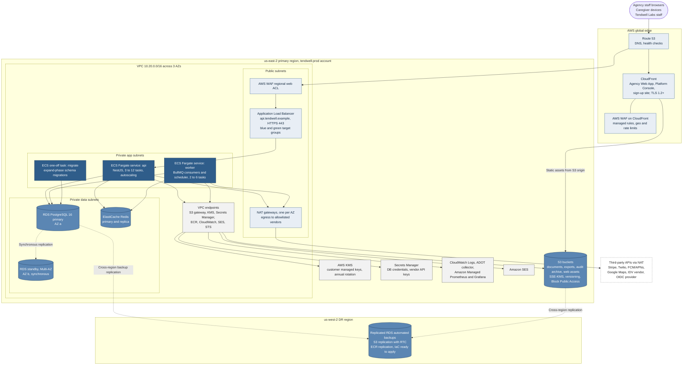

# Deployment and Security Architecture

## Document control

| Field | Value |
|---|---|
| Document ID | TW-ARC-02 |
| Version | 1.3 |
| Status | Approved |
| Owner | Business Analyst |
| Last updated | 2026-09-28 |
| Reviewers | Engineering Lead, Compliance and Privacy Officer, QA Lead, Product Owner |

| Version | Date | Change |
|---|---|---|
| 1.0 | 2026-03-02 | Baseline with SRS v1.0 |
| 1.1 | 2026-06-12 | Staging performance environment and DAST stage added for UAT |
| 1.2 | 2026-07-28 | Worker drain and single-flight deployment rules after INC-2026-007; billing anomaly alert |
| 1.3 | 2026-09-28 | EVV exception-rate alert by app version (INC-2026-011); deactivated-recipient alert and privacy paging (INC-2026-015) |

### Purpose and scope

This document describes how Tendwell is deployed on AWS, how code reaches production, which security controls protect tenant data and PHI, how backups and disaster recovery meet the RPO and RTO, and how the team observes the system and responds to alerts. It refines the containers in [System context and containers](system-context-and-containers.md) and gives the evidence trail for the security and operations NFRs.

The controls are designed to support the HIPAA Security Rule technical safeguards (45 CFR 164.312) and OWASP ASVS v4.0.3 Level 2. Each agency, as the covered entity, remains responsible for its own HIPAA compliance; Tendwell Labs acts as a business associate under a BAA (NFR-CMP-01).

## 1. AWS deployment view

*Figure 1. Production deployment in AWS us-east-2 with a warm-standby DR posture in us-west-2. Only the ALB and NAT gateways sit in public subnets; compute and data stores have no public IP. AWS service traffic stays on VPC endpoints; third-party traffic leaves through NAT to an allowlist. Supports NFR-AVL-01, NFR-DR-01, NFR-SEC-01 and NFR-CMP-01.*

### 1.1 Deployment elements

| Element | Configuration | Related NFRs |
|---|---|---|
| CloudFront + WAF | Serves the three SPAs from a private S3 origin (origin access control); security headers (HSTS, CSP, frame-ancestors none); WAF managed rule sets for common exploits and known bad inputs | NFR-SEC-01, NFR-SEC-02 |
| ALB + regional WAF | TLS policy allowing TLS 1.2 and 1.3 only; rate limit 300 requests per 5 min per IP on `/v1/auth/*`; `/v1/platform/*` restricted to the Tendwell Labs IP set | NFR-SEC-02 |
| ECS service `api` | Fargate, 1 vCPU / 2 GB tasks across 3 AZs; target tracking on CPU 55% and request count; blue/green through CodeDeploy | NFR-PERF-01, NFR-AVL-01, NFR-SCL-01 |
| ECS service `worker` | Fargate, separate scaling on queue depth; graceful shutdown drains in-flight jobs within 120 s; scheduler runs in every task and relies on `job_executions` for single-flight | NFR-MNT-02, NFR-PERF-04 |
| RDS PostgreSQL 16 | Multi-AZ, storage encryption with KMS, automated backups 35 days with point-in-time recovery, Performance Insights; RDS Proxy for connection pooling in transaction mode | NFR-DR-01, NFR-SEC-01 |
| ElastiCache Redis | Cluster mode disabled, primary and replica in two AZs, encryption in transit and at rest, AUTH token from Secrets Manager | NFR-AVL-01 |
| S3 | Separate buckets per purpose; SSE-KMS; versioning; Object Lock (compliance mode, 7 years) on the audit archive bucket; lifecycle rules per [data retention](../data/data-classification-and-retention.md) | NFR-PRIV-02, NFR-PRIV-03 |
| KMS | Customer managed keys per data class (database storage, PHI field keys, S3 documents, audit archive); automatic annual rotation | NFR-SEC-01 |

## 2. Environments

| Environment | Purpose | AWS account | Data | Deployment trigger | Scale | Human access |
|---|---|---|---|---|---|---|
| dev | Integration of merged work; feature flags on by default | `tendwell-dev` | Synthetic only, seeded from the [test data set](../../06-quality/test-data/README.md) | Every merge to `main` | Single task per service, single-AZ RDS | Engineers through SSO |
| staging | Release candidates, regression, UAT, performance and DAST | `tendwell-staging` | Synthetic only; performance data set of 500 tenants and 2 million visits per month | Release tag `vX.Y.Z-rc.N` | Production-shaped: Multi-AZ RDS, 3 API tasks | Engineers, QA, UAT participants with synthetic accounts |
| prod | Live tenants | `tendwell-prod` | PHI under BAA | Approved release tag `vX.Y.Z` | As in section 1 | No standing access; break-glass role through SSO with approval by the Engineering Lead, session recorded and audited |

Real PHI never leaves production. Defects that need production data are reproduced with synthetic data; if a PHI-bearing record must be inspected, PLT-SUP requests a support access grant from the tenant (BR-008).

## 3. CI/CD pipeline

```mermaid
flowchart LR
  subgraph PR["Pull request checks, all required"]
    lint["1. Lint and type check<br/>ESLint, tsc, module-boundary rule"]
    unit["2. Unit tests<br/>80% line coverage gate on<br/>evv, payroll, billing, emar"]
    contract["3. Contract tests<br/>OpenAPI lint and schema tests,<br/>web and mobile consumer contracts"]
    sast["4. SAST<br/>CodeQL, Semgrep rules for<br/>RLS bypass and PHI logging"]
    secrets["5. Secret scan<br/>gitleaks, push protection"]
    sca["6. Dependency and image scan<br/>SBOM, no Critical or High"]
  end
  subgraph Stg["Staging"]
    build["7. Build immutable image<br/>sign and push to ECR"]
    mig1["8. Migrations, expand phase<br/>migration linter"]
    deploys["9. Deploy blue/green"]
    e2e["10. Integration, E2E smoke,<br/>RLS isolation suite, DAST"]
  end
  subgraph Prod["Production"]
    gate{"11. Release approval<br/>Engineering Lead and QA Lead"}
    mig2["12. Migrations, expand phase"]
    bg["13. Blue/green: test listener smoke,<br/>10% canary for 10 min, then 100%"]
    watch["14. Bake 30 min<br/>auto-rollback on alarms"]
  end
  lint --> unit --> contract --> sast --> secrets --> sca --> build --> mig1 --> deploys --> e2e --> gate
  gate -->|"Approved"| mig2 --> bg --> watch
  gate -->|"Rejected"| fix["Fix forward on a new PR"]
```

*Figure 2. Backend CI/CD stages. A merge to `main` requires stages 1 to 6 to pass; secret scanning blocks the merge (NFR-SEC-03). Migrations are backward-compatible for one release so blue and green task sets can run against the same schema (NFR-MNT-02). The RLS isolation suite enforces BR-001 on every build.*

| Stage | Tooling | Blocking criterion | Refs |
|---|---|---|---|
| Lint and type check | ESLint, TypeScript strict, import-boundary rule between modules | Any error | NFR-MNT-01 |
| Unit tests | Jest with coverage | Line coverage below 80% in `evv`, `payroll`, `billing`, `emar`; any BR without at least one tagged automated test | NFR-MNT-01 |
| Contract tests | Spectral lint of [openapi.yaml](../../04-api/openapi.yaml); schema-based API tests; consumer contracts from web and mobile | Breaking change without a version bump; response not matching schema | [API guidelines](../../04-api/api-guidelines.md) |
| SAST | CodeQL, Semgrep with custom rules (raw SQL without tenant context helper, logger calls with entity objects, `BYPASSRLS` usage) | Any High or Critical | NFR-SEC-02 |
| Secret scan | gitleaks in CI plus GitHub push protection | Any finding | NFR-SEC-03 |
| Dependency and image scan | SCA with SBOM, ECR image scanning | Critical or High without an approved exception | NFR-SEC-02 |
| Migrations | Migration runner as a one-off ECS task; linter rejects destructive or locking operations (dropping columns in use, non-concurrent index on large tables, NOT NULL without default) | Lint failure; migration time over 5 min in staging | NFR-MNT-02 |
| Blue/green | CodeDeploy for ECS, ALB test listener, canary 10% then all | CloudWatch alarms on 5xx rate, p95 latency, error-budget burn | NFR-AVL-01 |
| Post-deploy | Worker old task set drains; schema "contract" changes ship only in the following release | Any job duplicate-claim metric above zero triggers investigation | NFR-MNT-02; ADR-003 |

**Mobile pipeline.** Expo EAS builds signed binaries; internal tracks (TestFlight, Play internal testing) run the device matrix, which since INC-2026-011 includes iOS with Precise Location off and Android with approximate location only. Releases roll out in stages (10%, 50%, 100%) while the EVV exception rate is monitored per app version; the API enforces a minimum supported app version.

**Feature flags.** Tenant-scoped flags (for example identity verification, open-shift confirmation from CR-002, private-pay auto-issue) are evaluated server-side and recorded in the audit log when changed.

## 4. Security controls

| Area | Control | Implementation | Refs |
|---|---|---|---|
| Identity | Federated sign-in with MFA | Managed OIDC provider, Authorization Code + PKCE for web and mobile; access JWT 15 min; refresh-token rotation with reuse detection; MFA mandatory for AG-ADM, AG-SUPV, AG-FIN and platform roles; 12-character minimum and breached-password check, no forced rotation | FR-IAM-01, BR-006, BR-007, NIST SP 800-63B |
| Identity | Lockout and sessions | 5 consecutive failures lock for 15 min; web idle timeout 15 min with 60 s warning; mobile re-authentication with device PIN or biometrics after 12 h; session revocation list in Redis checked on every request | FR-IAM-03, FR-IAM-04, FR-WRK-06 |
| Authorization | Default deny, server-side | Every route declares a permission (`resource:action`); effective permissions = role templates + grants - denies (deny wins); location scoping from `user_locations`; quarterly access-review report to AG-ADM | FR-IAM-05, FR-IAM-06, BR-005, NFR-SEC-04 |
| Tenant isolation | PostgreSQL RLS | `ENABLE` and `FORCE ROW LEVEL SECURITY` on every tenant table; application role is not the table owner and has no `BYPASSRLS`; policies on `tenant_id = current_setting('app.tenant_id', true)::uuid`; `SET LOCAL` per transaction so pooled connections cannot leak context | BR-001, ADR-001 |
| Support access | Time-boxed grants | PLT-SUP access only under an Active grant approved by AG-ADM, at most 4 h, read-only by default; every action audited with the grant ID; expiry enforced on each request, not only by the expiry job | FR-IAM-07, BR-008 |
| Encryption in transit | TLS everywhere | TLS 1.2+ at CloudFront and ALB; TLS to RDS and Redis enforced; HSTS with preload | NFR-SEC-01, 45 CFR 164.312(e)(1) |
| Encryption at rest | Storage and field level | RDS, EBS, S3 and Redis encrypted with KMS (AES-256); PHI columns (`dob_enc`, `medicaid_id_enc`, `phone_enc`, `service_address_enc`, `ein_enc`) use envelope encryption with per-tenant data keys wrapped by a KMS key, encryption context bound to tenant and column; annual key rotation | NFR-SEC-01, BR-011 |
| PHI minimum necessary | Masking and reveal | PHI masked in lists and detail views; reveal requires `clients:reveal_phi` and a reason; reveal audited before the value is returned | FR-CLI-06, BR-011, NFR-PRIV-01 |
| Secrets | Central secret store | AWS Secrets Manager with rotation (database credentials every 90 days); ECS task roles for AWS APIs; no long-lived keys on developer machines; CI blocks committed secrets | NFR-SEC-03 |
| Logging without PHI | Structured, allowlist-based | JSON logs with correlation ID, tenant ID, user ID, route template, status, latency; request and response bodies never logged; serializers allowlist fields; Sentry `beforeSend` scrubbing; a daily scan for synthetic canary values and PHI patterns (for example `ZZ` followed by 8 digits) raises a privacy alert | NFR-OBS-01, NFR-PRIV-01 |
| Audit | Append-only audit trail | `audit_events` insert-only for the application role; monthly partitions; partitions older than 13 months archived to the S3 audit bucket with Object Lock for 7 years; exports watermarked | BR-057, BR-058, FR-RPT-03, NFR-PRIV-02, 45 CFR 164.312(b) |
| Webhooks | Authenticity and replay protection | Stripe signature verified (HMAC-SHA256 over timestamp and payload) with a 5-minute tolerance; event ID claimed once in `job_executions` | FR-BIL-05 |
| Mobile | Device protection | Certificate pinning for the API host; SQLCipher store with Keychain or Keystore key; screenshots blocked on PHI screens (Android `FLAG_SECURE`); jailbreak or root detection warns and is logged; sync-then-wipe on deactivation | NFR-MOB-02 |
| Perimeter | WAF and network | Managed rule sets, rate limiting, no public IPs on compute or data; egress allowlist through NAT; security groups least privilege | NFR-SEC-02 |
| Assurance | Testing | Annual third-party penetration test; no open Critical or High findings at release; DAST on staging per release | NFR-SEC-02 |
| Vendors | BAA coverage | Only HIPAA-eligible AWS services; BAAs with sub-processors (identity verification vendor for biometric captures, OIDC provider for workforce identities); vendors that must not receive PHI (Stripe, Twilio, FCM/APNs, Google Maps) get payloads without client identifiers by design | NFR-CMP-01, BR-056 |

## 5. Backups

| Asset | Mechanism | Retention | Restore granularity |
|---|---|---|---|
| PostgreSQL | RDS automated backups with point-in-time recovery (transaction logs shipped every 5 min); automated backups replicated to us-west-2; daily snapshot copied to an AWS Backup vault with Vault Lock in a separate backup account | 35 days PITR; monthly snapshots 12 months | Any second within the window |
| S3 documents and exports | Versioning; cross-region replication with Replication Time Control (15 min) | Per retention schedule | Object version |
| Audit archive | S3 Object Lock compliance mode, replicated | 7 years | Partition file |
| Redis | Not a system of record; snapshots daily for diagnostics only | 1 day | Not restored; queues are rebuilt from PostgreSQL and the outbox |
| Infrastructure | Terraform state versioned; images replicated to the DR region ECR | Indefinite | Full stack |

## 6. Disaster recovery

Targets: **RPO 15 min or less, RTO 4 h or less, restores tested quarterly** (NFR-DR-01).

| Scenario | Recovery approach | Expected RPO | Expected RTO |
|---|---|---|---|
| Single task or AZ failure | ECS replaces tasks in healthy AZs; RDS Multi-AZ failover | 0 | 2 min or less |
| Accidental data change or bad migration | PITR restore to a new instance, then targeted repair scripts reviewed by two engineers | Under 5 min | 2 to 3 h |
| Region loss | Restore RDS from replicated backups in us-west-2, apply Terraform, switch Route 53, mobile apps keep capturing offline meanwhile | 15 min or less | 4 h or less |
| Credential compromise or ransomware | Revoke and rotate secrets, restore from immutable backups in the isolated backup account | 15 min or less | 4 h or less |

The quarterly restore test restores the latest production backup into an isolated account, runs integrity checks (row counts, checksum of the last payroll export, latest audit event time) and records actual RPO and RTO. Region failover is rehearsed once a year in staging.

## 7. Observability and alerting

Every request and job carries a correlation ID through OpenTelemetry traces, structured logs and metrics (NFR-OBS-01). Traces and metrics go to Amazon Managed Prometheus and Grafana through the ADOT collector; errors go to Sentry with PHI scrubbing; logs go to CloudWatch Logs.

### 7.1 Service level objectives and burn-rate alerts

| SLO | Target | Alert |
|---|---|---|
| API availability (non-5xx share of requests) | 99.9% monthly | Page at 14.4x burn over 1 h (5 min confirm); page at 6x over 6 h (30 min confirm); ticket at 1x over 3 days |
| API latency | p95 read 400 ms or less, write 800 ms or less | Ticket when p95 is over target for 30 min; page when over 2x target for 15 min |
| Clock-in and clock-out round trip | p95 2 s or less, identity check p95 4 s or less | Page when over target for 15 min between 05:00 and 23:00 ET |
| Notification delivery | 99% of urgent notifications sent within 1 min | Page when the urgent queue lag is over 2 min |
| Scheduled job freshness | Every registered job completes within its window | Page when a critical job (dose escalation, auto-close, billing) misses two consecutive windows |

### 7.2 Business anomaly alerts (NFR-OBS-02)

| Alert | Detection | Severity and route | Automatic containment | Origin |
|---|---|---|---|---|
| Billing run invoice count deviates more than 20% from the previous run | After each run, the Worker compares invoices created or updated per tenant with that tenant's previous comparable run; also counts unique-key conflicts on `invoices.idempotency_key` | SEV-3 ticket; SEV-2 page when 25 or more invoices are involved or any auto-issue is pending | Auto-issue for that tenant's run is paused until AG-FIN or on-call acknowledges | INC-2026-007, CR-005 |
| EVV exception rate exceeds 2x the 7-day baseline | Hourly ratio of exceptions raised to punches received, globally and per tenant, with dimensions for platform, app version and exception code | SEV-2 page when global or 3 or more tenants; ticket for a single tenant | None; the dashboard links to the bulk-resolve tool | INC-2026-011, CR-004 |
| Notification sent to a deactivated user (target 0) | Dispatcher re-checks recipient status before each send and counts blocks; a reconciliation query every 15 min joins sent notifications to users deactivated before `sent_at` | Any sent occurrence is SEV-1 (privacy): pages on-call and the Compliance and Privacy Officer | Escalation ladder for the event type is frozen to role-based resolution only | INC-2026-015, CR-006 |

### 7.3 Technical alerts

| Alert | Condition | Route |
|---|---|---|
| Duplicate job claim attempts | `job_executions` conflict count above 0 in a deployment window | Ticket (expected during blue/green; investigated if outside one) |
| Offline sync backlog | Sync batches with punches older than 24 h above 5% of the day's batches | Ticket to mobile engineer |
| Identity vendor degradation | Vendor error rate over 5% or p95 over 3.5 s for 10 min | Page; circuit breaker opens and punches proceed with IDENTITY_CHECK_FAILED |
| RLS context missing | Any query executed by the application role without `app.tenant_id` (detected by a guard function) | Page (SEV-2) |
| PHI canary found in logs | Daily log scan hit | SEV-1 privacy page |

## 8. On-call (PagerDuty)

| Item | Arrangement |
|---|---|
| Rotations | Primary on-call rotates weekly across the backend and web developers; secondary is the Engineering Lead; mobile developer is an escalation target for app-version issues |
| Coverage | 24x7 for SEV-1 and SEV-2, because supported-living and overnight visits run around the clock; SEV-3 and SEV-4 during business hours (08:00-18:00 ET) |
| Escalation policy | Primary acknowledges SEV-1 within 15 min and SEV-2 within 30 min; unacknowledged pages escalate to secondary after 15 min, then to the Engineering Lead and Product Owner |
| Privacy route | Any privacy-tagged alert also pages the Compliance and Privacy Officer, who leads the HIPAA breach risk assessment; the covered-entity agency is notified under the BAA |
| Customer communication | Customer Success Lead owns tenant communication and the status page for SEV-1 and SEV-2 |
| Follow-up | Post-incident review within 5 business days using the [template](../../07-operations/templates/post-incident-review-template.md); actions tracked to closure |

Severity definitions and the incident lifecycle are defined in the [incident management process](../../07-operations/incident-management-process.md).

## Related documents

- [System context and containers](system-context-and-containers.md)
- [ADR-001 Multi-tenancy with row-level security](adr/ADR-001-multi-tenancy-row-level-security.md)
- [ADR-003 Single-flight scheduled jobs](adr/ADR-003-single-flight-scheduled-jobs.md)
- [ADR-006 Offline-first caregiver app](adr/ADR-006-offline-first-caregiver-app.md)
- [Data flow diagram](../diagrams/data-flow-diagram.md)
- [Data classification and retention](../data/data-classification-and-retention.md)
- [Non-functional requirements](../../02-requirements/non-functional-requirements.md)
- [Compliance mapping](../../02-requirements/compliance-mapping.md)
- [Incident management process](../../07-operations/incident-management-process.md)
- [INC-2026-007 duplicate client invoices](../../07-operations/incidents/INC-2026-007-duplicate-client-invoices.md)
- [INC-2026-011 false Location mismatch exceptions](../../07-operations/incidents/INC-2026-011-false-location-mismatch-exceptions.md)
- [INC-2026-015 escalation email to a deactivated user](../../07-operations/incidents/INC-2026-015-escalation-email-to-deactivated-user.md)
