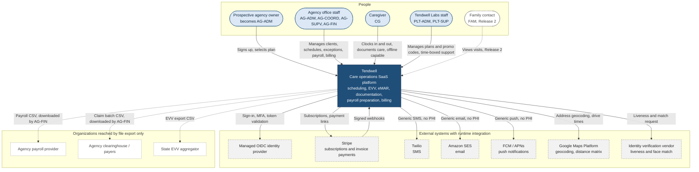

# System Context and Containers (C4 Levels 1 and 2)

## Document control

| Field | Value |
|---|---|
| Document ID | TW-ARC-01 |
| Version | 1.3 |
| Status | Approved |
| Owner | Business Analyst |
| Last updated | 2026-09-28 |
| Reviewers | Engineering Lead, Product Owner, Compliance and Privacy Officer, QA Lead |

| Version | Date | Change |
|---|---|---|
| 1.0 | 2026-03-02 | Baseline with SRS v1.0 |
| 1.1 | 2026-04-17 | Family Portal marked Release 2 (CR-003); open-shift confirmation flag (CR-002) |
| 1.2 | 2026-07-28 | Worker/Scheduler single-flight model replaced after INC-2026-007 (see ADR-003) |
| 1.3 | 2026-09-28 | Aligned to SRS v1.3: send-time recipient resolution (CR-006), Low GPS accuracy evaluation (CR-004), billing idempotency constraint (CR-005) |

### Purpose and scope

This document describes Tendwell's architecture at C4 Levels 1 (system context) and 2 (containers). It names the people and external systems Tendwell interacts with, the deployable containers and their responsibilities, the internal modules of the API and how they map to epics, and the quality attribute scenarios that the architecture must satisfy. It is written for the delivery team, reviewers and auditors who need a shared mental model before reading the ADRs, sequence diagrams and data model.

Out of scope: AWS network layout, CI/CD and security controls (see [Deployment and security](deployment-and-security.md)); table-level design (see [ERD](../data/erd.md)); endpoint contracts (see [OpenAPI](../../04-api/openapi.yaml)). C4 views are drawn as Mermaid flowcharts with subgraphs so they render on GitHub.

## 1. Architectural drivers

| Driver | Source | Architectural consequence |
|---|---|---|
| Tenant data must never be readable across agencies | BR-001, FR-IAM-06 | Shared schema with PostgreSQL row-level security on `tenant_id` ([ADR-001](adr/ADR-001-multi-tenancy-row-level-security.md)) |
| EVV records are legal evidence of care delivery | BR-020, BR-026, FR-EVV-08 | Append-only punch ledger with supersession ([ADR-002](adr/ADR-002-append-only-evv-punch-ledger.md)) |
| Scheduled jobs must not double-execute across deployments | NFR-MNT-02, BR-050, INC-2026-007 | DB-enforced single-flight and idempotency ([ADR-003](adr/ADR-003-single-flight-scheduled-jobs.md)) |
| Caregivers work where there is no signal | NFR-AVL-02, FR-EVV-05, BR-025 | Offline-first mobile app with encrypted outbox ([ADR-006](adr/ADR-006-offline-first-caregiver-app.md)) |
| Identity checks must resist proxy clock-ins without retaining biometrics | FR-EVV-04, BR-024 | Vendor liveness behind `IdentityVerificationPort` ([ADR-004](adr/ADR-004-identity-verification-vendor-adapter.md)) |
| Payroll is exported, not processed | FR-PAY-05, CR-008 | CSV export with column mapping ([ADR-005](adr/ADR-005-payroll-export-not-processing.md)) |
| PHI minimum necessary; no PHI in SMS, push or email | NFR-PRIV-01, BR-056, FR-NTF-05 | Field-level encryption, masking, generic notification templates with deep links |
| Small team (2 backend, 1 web, 1 mobile developer) | Project charter | Modular monolith rather than microservices; managed AWS services |
| 500 tenants, 50,000 caregivers, 2 million visits per month | NFR-SCL-01 | Stateless API tasks scaled horizontally; time-partitioned high-volume tables; queue-based background work |

## 2. C4 Level 1: system context

*Figure 1. Tendwell system context. Solid arrows are runtime integrations; dotted arrows are file exports that an agency user downloads and submits outside Tendwell (FR-PAY-05, FR-BIL-06, NFR-CMP-02), or Release 2 scope (CR-003). Notification channels carry no PHI (BR-056, FR-NTF-05).*

### 2.1 People

| Element | Responsibility | Technology / channel | Key data touched | Related NFRs |
|---|---|---|---|---|
| Prospective agency owner | Self-registers the agency, applies a trial or promo code, verifies email (FR-ONB-01 to FR-ONB-03) | Public sign-up site, browser | Owner details, agency legal details, plan, promo code | NFR-USE-03, NFR-SEC-01 |
| Agency Administrator (AG-ADM) | Configures agency, users, roles, payers, holidays, escalation ladders; approves support access | Agency Web App | Users, roles, settings, audit log | NFR-SEC-04, NFR-PRIV-02 |
| Care Coordinator (AG-COORD) | Intake, scheduling, EVV exception resolution, time-off approval | Agency Web App | Clients (masked PHI), visits, exceptions | NFR-PERF-03, NFR-USE-02 |
| Clinical Supervisor (AG-SUPV) | Approves care plans and medication orders; reviews missed doses, vitals alerts, incidents | Agency Web App | Care plans, medication orders, incidents | NFR-PRIV-01, NFR-ACC-01 |
| Billing & Payroll Specialist (AG-FIN) | Pay-period review and export, billing runs, invoices, payments, claim batches | Agency Web App | Payroll lines, invoices, payments | NFR-PERF-04 |
| Caregiver (CG) | Clocks in and out, records tasks, doses, vitals, notes, incidents, time-off requests | Caregiver Mobile App (iOS 16+, Android 10+) | Today's visits, care plan tasks, dose tasks, punches | NFR-AVL-02, NFR-USE-01, NFR-MOB-01, NFR-MOB-02 |
| Platform Administrator (PLT-ADM) | Plans, promo codes, tenant lifecycle | Platform Console | Plans, promo codes, tenant status (no PHI) | NFR-SEC-02 |
| Platform Support Agent (PLT-SUP) | Investigates tickets under an approved, time-boxed grant | Platform Console | Tenant data read-only by default under grant | NFR-PRIV-02; BR-008 |
| Family contact (FAM) | Release 2 only; not deployed in R1 | Family Portal (R2) | One client's schedule and visit summaries | NFR-PRIV-01 |
| System (SYS) | Scheduled and event-driven processes | Worker / Scheduler container | All modules | NFR-MNT-02, NFR-OBS-02 |

### 2.2 External systems

| Element | Responsibility | Technology / interface | Key data exchanged | PHI | Related NFRs |
|---|---|---|---|---|---|
| Managed OIDC identity provider (IF-10) | User authentication, MFA (TOTP, SMS), token issuance | OIDC Authorization Code + PKCE; JWKS | Email, password hash (held by provider), MFA factors | No | NFR-SEC-02, NFR-CMP-01 |
| Stripe (IF-01) | Tenant subscription billing; private-pay invoice payment links (card, ACH) | REST API, Stripe Elements, signed webhooks | Tenant billing contact, seat count, invoice number, amount, responsible party email | No (no service or clinical detail sent) | NFR-SEC-01, NFR-SEC-03 |
| Twilio (IF-02) | SMS delivery for notifications and SMS one-time codes | REST API, delivery status callbacks | Phone number, generic message, deep link | No (BR-056) | NFR-PRIV-01 |
| Amazon SES (IF-03) | Transactional email | AWS SDK inside the prod account | Email address, generic message, deep link | No (BR-056) | NFR-PRIV-01, NFR-CMP-01 |
| FCM / APNs (IF-04) | Push notifications to the Caregiver Mobile App | HTTP v1 / APNs token-based | Device token, generic title and body, deep link | No (BR-056) | NFR-PRIV-01 |
| Google Maps Platform (IF-05) | Geocode client service addresses at intake; estimate drive time for travel pay and travel-buffer checks | REST over HTTPS | Address string or coordinate pairs; no names or client identifiers | No identifiers sent | NFR-CMP-01, NFR-PERF-01 |
| Identity verification vendor (IF-06) | Liveness detection and face match against the caregiver's enrolled reference | Vendor SDK on device; server-to-vendor API behind `IdentityVerificationPort` | Encrypted capture package, enrollment reference, match score | Biometric (transient; not retained by Tendwell) | NFR-PERF-02, NFR-CMP-01 |
| Agency payroll provider (IF-07) | Runs payroll from Tendwell's CSV export | File download by AG-FIN; no integration | Caregiver hours, rates, amounts | No PHI; PII | FR-PAY-05 |
| Clearinghouse / payers (IF-08) | Receives claims prepared from Tendwell's claim batch CSV | File download by AG-FIN; no EDI 837 in R1 | Client identifiers, service codes, units | Yes | FR-BIL-06 |
| State EVV aggregator (IF-09) | Receives EVV visit data where the state requires it | Configurable aggregator CSV export | Six EVV data elements per visit | Yes | NFR-CMP-02 |

## 3. C4 Level 2: containers

```mermaid
flowchart TB
  classDef person fill:#dce8f5,stroke:#2f5d8a,color:#10263d
  classDef container fill:#2f5d8a,stroke:#173554,color:#ffffff
  classDef store fill:#5b86b3,stroke:#173554,color:#ffffff
  classDef external fill:#f2f2f2,stroke:#7a7a7a,color:#222222,stroke-dasharray:4 3

  prospect(["Prospective agency owner"]):::person
  office(["Agency office staff<br/>AG-ADM, AG-COORD, AG-SUPV, AG-FIN"]):::person
  cg(["Caregiver<br/>CG"]):::person
  plt(["Tendwell Labs staff<br/>PLT-ADM, PLT-SUP"]):::person

  subgraph TW["Tendwell platform boundary: AWS prod account under BAA"]
    signup["Public sign-up site<br/>Static React site on CloudFront<br/>Stripe Elements for card entry"]:::container
    web["Agency Web App<br/>React 18 + TypeScript SPA, Vite"]:::container
    console["Platform Console<br/>React 18 + TypeScript SPA<br/>restricted origin"]:::container
    subgraph Device["Caregiver device"]
      mob["Caregiver Mobile App<br/>React Native, Expo"]:::container
      offline[("Offline store<br/>SQLCipher SQLite<br/>read cache + command outbox")]:::store
    end
    api["API: NestJS modular monolith, REST /v1<br/>tenancy, onboarding, iam, clients, workforce,<br/>scheduling, evv, emar, documentation, time-off,<br/>payroll, billing, notifications, reporting-audit<br/>integration adapters behind ports"]:::container
    worker["Worker / Scheduler<br/>same codebase, BullMQ consumers<br/>scheduled jobs single-flight via job_executions"]:::container
    pg[("PostgreSQL 16<br/>RDS Multi-AZ<br/>RLS on tenant_id, PHI field encryption")]:::store
    redis[("Redis<br/>ElastiCache<br/>BullMQ queues, rate limits, idempotency cache")]:::store
    s3[("Amazon S3<br/>documents, photos, exports<br/>SSE-KMS, pre-signed URLs")]:::store
  end

  oidc["OIDC provider"]:::external
  stripe["Stripe"]:::external
  twilio["Twilio"]:::external
  ses["Amazon SES"]:::external
  push["FCM / APNs"]:::external
  maps["Google Maps Platform"]:::external
  idv["Identity verification vendor"]:::external

  prospect --> signup
  office --> web
  cg --> mob
  plt --> console

  signup -->|"GET /plans, POST /signups"| api
  signup -->|"Card tokenization"| stripe
  web -->|"HTTPS JSON /v1, bearer JWT"| api
  console -->|"HTTPS JSON /v1/platform"| api
  mob -->|"HTTPS JSON /v1, offline batch sync"| api
  mob --- offline
  mob -->|"Liveness capture via SDK"| idv

  web -->|"Sign-in"| oidc
  console -->|"Sign-in, MFA"| oidc
  mob -->|"Sign-in"| oidc
  api -->|"JWKS validation"| oidc

  api -->|"SQL, SET LOCAL app.tenant_id"| pg
  api -->|"Enqueue jobs"| redis
  api -->|"Pre-signed URLs"| s3
  worker -->|"SQL, per-tenant context"| pg
  worker -->|"Consume jobs"| redis
  worker -->|"Write exports"| s3

  api -->|"Verify capture package"| idv
  api -->|"Geocode"| maps
  worker -->|"Distance matrix"| maps
  api -->|"Payment links, subscriptions"| stripe
  stripe -->|"POST /webhooks/payments"| api
  worker -->|"SMS"| twilio
  worker -->|"Email"| ses
  worker -->|"Push"| push
```

*Figure 2. Tendwell containers. The API and the Worker share one codebase and one database but run as separate ECS services so that background load never competes with interactive requests. The mobile app writes to its encrypted offline store first and syncs through `POST /evv/punches/sync` (FR-EVV-05, BR-025). All PHI stays inside the AWS boundary except the transient identity-verification capture package (FR-EVV-04) and the file exports an agency user downloads.*

### 3.1 Container element table

| Container | Responsibility | Technology | Key data | Related NFRs |
|---|---|---|---|---|
| Public sign-up site | Plan selection, promo validation, agency registration, email verification landing page | Static React site served by CloudFront; Stripe Elements for card capture so card data never reaches Tendwell | Plans, promo code effect, sign-up form (EIN encrypted on receipt) | NFR-USE-03, NFR-ACC-01, NFR-SEC-01 |
| Agency Web App | All office workflows: clients, scheduling board, exception queue, eMAR oversight, incidents, payroll, billing, reports, settings | React 18 + TypeScript (Vite) SPA on CloudFront; OIDC PKCE; 15 min idle timeout with 60 s warning | Masked PHI until revealed (FR-CLI-06); no PHI in browser storage | NFR-PERF-03, NFR-ACC-01, NFR-USE-02, NFR-USE-03 |
| Caregiver Mobile App | Today's visits, clock-in and out with GPS and identity check, tasks, doses, vitals, notes, incidents, time off, open shifts | React Native (Expo); vendor liveness SDK; device PIN or biometric re-authentication every 12 h | Assigned visits for the next 72 h, care plan tasks, due doses, vital ranges | NFR-USE-01, NFR-MOB-01, NFR-ACC-01, NFR-I18N-01 |
| Offline store | Read cache of the caregiver's assigned work and an ordered command outbox of punches, task results, dose outcomes, vitals, notes | SQLCipher (AES-256) with a key held in iOS Keychain or Android Keystore | Minimum necessary PHI for assigned visits; purged after sync and visit completion window | NFR-AVL-02, NFR-MOB-02 |
| Platform Console | Plans, promo codes, tenant lifecycle, support access requests | React 18 + TypeScript SPA on a separate origin; WAF IP allowlist for Tendwell Labs network; MFA mandatory (BR-006) | Plans, promo codes, tenant status; tenant data only under an Active grant | NFR-SEC-02, NFR-SEC-04 |
| API | REST `/v1` for all clients; authorization, validation, domain logic, audit; webhooks from Stripe | Node.js / NestJS modular monolith on ECS Fargate; OpenAPI-first; RFC 9457 problem details; `Idempotency-Key` on unsafe POSTs; cursor pagination | All tenant data through RLS; PHI decrypted only when the caller holds the permission | NFR-PERF-01, NFR-PERF-02, NFR-SEC-02, NFR-OBS-01 |
| Worker / Scheduler | Scheduled jobs (materialization, dose generation and escalation, auto-close, credential status, billing, overdue, lifecycle), notification dispatch with retries, exports | Same NestJS codebase, BullMQ consumers; separate ECS service; single-flight via `job_executions` unique key | Job payloads carry IDs only, never PHI | NFR-MNT-02, NFR-PERF-04, NFR-OBS-02 |
| PostgreSQL | System of record for all tenant and platform data, audit log | PostgreSQL 16 on RDS Multi-AZ; RLS forced on every tenant table; field-level envelope encryption for PHI with KMS keys | Everything in the [data dictionary](../data/data-dictionary.md) | NFR-DR-01, NFR-SEC-01, NFR-SCL-01, NFR-DAT-01 |
| Redis | Job queues, scheduler triggers, rate limiting, short-lived HTTP idempotency responses, session-revocation cache | Amazon ElastiCache for Redis (encryption in transit and at rest) | No data of record and no PHI; contents are rebuildable from PostgreSQL | NFR-AVL-01, NFR-PRIV-01 |
| Amazon S3 | Credential documents, incident photos, payroll and claim exports, audit exports, web assets | S3 with SSE-KMS, versioning, Block Public Access; pre-signed URLs valid 15 min or less | Documents and exports (PHI in some) | NFR-SEC-01, NFR-PRIV-03, NFR-DR-01 |

### 3.2 API internal modules

The API is one deployable unit with strict module boundaries. Each module owns its tables, exposes a typed service interface to other modules, and publishes domain events (for example `VisitVerified`, `DoseMissed`, `IncidentReported`) through the transactional outbox table `event_outbox`, written in the same transaction as the business change and relayed to BullMQ by the Worker. A module never writes another module's tables directly; a lint rule on import paths enforces this in CI.

| Module | Responsibility | Owns (tables) |
|---|---|---|
| `tenancy` (shared kernel) | Resolves tenant and location context from the JWT, opens each transaction with `SET LOCAL app.tenant_id`, exposes tenant settings | None (reads `tenants`, `locations`) |
| `onboarding` | Sign-up, email verification, provisioning, setup checklist, subscription and seats, plans and promo codes (platform endpoints) | `tenants`, `plans`, `promo_codes`, `subscriptions`, `locations`, `service_lines` |
| `iam` | Users, role templates, permission overrides, effective permissions, sign-in events, session revocation, support access grants | `users`, `roles`, `permissions`, `role_permissions`, `user_roles`, `user_permission_overrides`, `user_locations`, `support_access_grants`, `sign_in_events` |
| `clients` | Client records, PHI masking and reveal, payers, service authorizations, care plans, discharge | `clients`, `client_diagnoses`, `client_contacts`, `client_caregiver_prefs`, `payers`, `service_authorizations`, `care_plans`, `care_plan_tasks` |
| `workforce` | Caregiver profiles, credentials and status, pay profiles, deactivation | `caregivers`, `credential_types`, `caregiver_credentials`, `pay_profiles` |
| `scheduling` | Patterns, materialization, visits, compliance checks, open shifts, schedule board queries | `visit_patterns`, `visits` |
| `evv` | Identity checks, punches, geofence evaluation, exceptions, time corrections, verification, offline sync | `evv_punches`, `identity_checks`, `visit_exceptions`, `visit_task_results` |
| `emar` | Medication orders, dose task generation, outcomes, PRN, vitals and ranges, MAR grid | `medication_orders`, `dose_tasks`, `prn_administrations`, `vital_readings`, `vital_ranges` |
| `documentation` | Visit notes and addenda, client incidents and corrective actions, reporting deadlines | `visit_notes`, `note_addenda`, `client_incidents`, `incident_actions` |
| `time-off` | Requests, impact preview, decisions, leave balances and accrual, holiday calendar | `time_off_requests`, `leave_balances`, `holidays` |
| `payroll` | Pay periods, pay calculation, pre-export review, CSV export and lock, adjustments | `pay_periods`, `payroll_lines`, `payroll_exports` |
| `billing` | Billing runs, pricing, invoices, credit notes, payment links, webhooks, claim batches | `billing_runs`, `invoices`, `invoice_lines`, `credit_notes`, `payments`, `claim_batches` |
| `notifications` | Channel routing, preferences, quiet hours, escalation ladders, send-time recipient resolution, dedupe, retries | `notifications`, `notification_preferences`, `escalation_ladders` |
| `reporting-audit` | Operations dashboard, standard reports, audit log, export watermarking | `audit_events` |
| `jobs` (shared) | Job registry, single-flight claim, job metrics | `job_executions` |
| `family` | Release 2; compiled out of R1 builds behind a feature flag | None in R1 |

Integration adapters sit behind ports so that vendors can change without touching domain code: `IdentityVerificationPort` (vendor liveness and match), a payments port (Stripe), messaging ports (Twilio, SES, FCM/APNs), a geo port (Google Maps Platform) and an identity port (OIDC provider).

## 4. Modules-to-epics mapping

| Module | Epic | Functional requirements | Key business rules | Background jobs and events |
|---|---|---|---|---|
| `onboarding` | EP-01 Agency Onboarding & Subscription | FR-ONB-01 to FR-ONB-08 | BR-002, BR-003, BR-004 | Tenant provisioning (idempotent), subscription lifecycle (trial expiry, grace, Read-only), Stripe subscription webhooks |
| `iam`, `tenancy` | EP-02 Identity & Access Management | FR-IAM-01 to FR-IAM-08 | BR-001, BR-005, BR-006, BR-007, BR-008 | Support grant expiry, lockout release, quarterly access-review report (NFR-SEC-04) |
| `clients` | EP-03 Client Records & Care Plans | FR-CLI-01 to FR-CLI-08 | BR-009 to BR-013 | Authorization utilization alerts (90%, 14 days), discharge cascade to scheduling |
| `workforce` | EP-04 Caregiver Workforce & Credentials | FR-WRK-01 to FR-WRK-06 | BR-014, BR-015 | Daily credential status recompute, 30/14/1-day reminders, deactivation cascade |
| `scheduling` | EP-05 Scheduling | FR-SCH-01 to FR-SCH-07 | BR-009, BR-010, BR-014, BR-016 to BR-019, BR-039 | Nightly 8-week materialization, missed-visit marking, open-shift publication |
| `evv` | EP-06 Electronic Visit Verification | FR-EVV-01 to FR-EVV-10 | BR-019 to BR-028 | Missing clock-out check, 14 h auto-close, verification evaluation, exception-rate metrics |
| `emar` | EP-07 Medication Administration & Vitals | FR-MAR-01 to FR-MAR-09 | BR-029 to BR-034 | Rolling 7-day dose generation, per-minute dose escalation, consecutive refused/held alert |
| `documentation` | EP-08 Care Documentation & Client Incidents | FR-DOC-01 to FR-DOC-06 | BR-035, BR-036, BR-037 | 24 h note lock, reporting-deadline alerts at 50% and 90% |
| `time-off` | EP-09 Time Off & Holidays | FR-TOF-01 to FR-TOF-05 | BR-038, BR-039, BR-040 | Accrual on payroll calculation, approval cascade to open shifts |
| `payroll` | EP-10 Payroll Preparation | FR-PAY-01 to FR-PAY-06 | BR-015, BR-028, BR-040 to BR-046 | Period creation, pay calculation, adjustment carry-forward |
| `billing` | EP-11 Client Billing & Invoicing | FR-BIL-01 to FR-BIL-08 | BR-028, BR-047 to BR-052 | Billing runs (on demand and nightly draft refresh), overdue marking and reminders, payment webhooks |
| `notifications` | EP-12 Notifications & Escalations | FR-NTF-01 to FR-NTF-05 | BR-053 to BR-056 | Dispatch, quiet-hours release, retries at 1, 4 and 16 min, escalation steps |
| `reporting-audit` | EP-13 Reporting & Audit | FR-RPT-01 to FR-RPT-04 | BR-057, BR-058 | Report exports, audit partition archival, business anomaly checks (NFR-OBS-02) |
| `family` | EP-14 Family Portal (R2) | FR-FAM-01 to FR-FAM-03 | BR-001, BR-056 | Not deployed in R1 (CR-003) |

## 5. Cross-cutting design rules

1. **Tenant context is never taken from the request body.** The `tenancy` module derives `tenant_id` from the validated JWT (or from an Active support grant) and sets it with `SET LOCAL` inside the transaction; RLS does the filtering (BR-001, ADR-001).
2. **Server authority over evidence.** Distance to the service address, identity-check validity and exception evaluation are computed on the server; the device only reports raw readings (BR-021, BR-024).
3. **Append-only where history is evidence.** EVV punches, audit events, note addenda, credit notes and payroll adjustment lines are inserted, never updated (BR-026, BR-035, BR-046, BR-051, BR-057).
4. **Idempotency at three levels.** HTTP `Idempotency-Key` for client retries, `job_executions` for scheduled jobs, and business unique keys (for example `invoices.idempotency_key`, `notifications.dedupe_key`) as the final guard (BR-050, BR-055, ADR-003).
5. **No PHI outside the clinical record.** Logs, traces, job payloads, Redis entries, SMS, push and email carry identifiers and generic text only (NFR-OBS-01, NFR-PRIV-01, BR-056).
6. **Resolve people at the moment of action.** Notification recipients are resolved at send time from active users holding the target role in the relevant location (BR-054, CR-006).
7. **Care is never blocked by commercial or technical state.** Read-only tenants, failed identity checks and poor GPS raise flags or exceptions; they do not stop a caregiver from recording care (BR-003, FR-EVV-03, BR-022).
8. **Time is stored in UTC and evaluated in the tenant time zone.** Windows, quiet hours, workweeks and DST-crossing durations use the tenant's IANA zone, for example `America/New_York` (NFR-DAT-01).

## 6. Quality attribute scenarios

Each scenario uses the six-part form (source, stimulus, environment, artifact, response, response measure). Measures marked "design target" refine an NFR; they do not replace it.

| # | Attribute | Source and stimulus | Environment | Artifact | Response | Response measure | Refs |
|---|---|---|---|---|---|---|---|
| 1 | Availability | The RDS primary instance fails (AZ outage) | Weekday 07:00-09:00 ET, peak clock-in period | PostgreSQL, API | RDS fails over to the standby in another AZ; API pools reconnect with jittered retry; the mobile app writes punches to its outbox during the failover and syncs afterward | Write unavailability of 2 min or less per event; zero lost punches; monthly availability of 99.9% or more (error budget 43.8 min) | NFR-AVL-01, NFR-AVL-02, NFR-DR-01 |
| 2 | Availability (deployability) | Engineering ships an API and Worker release | Business hours; nightly and per-minute jobs running | ECS services, scheduler | Blue/green traffic shift for the API; old Worker tasks drain in-flight jobs; both task sets may attempt a job but only the `job_executions` claim holder runs it | Zero failed requests attributable to the deployment; zero duplicate job executions; automatic rollback within 10 min of an alarm (design target) | NFR-MNT-02, NFR-AVL-01; INC-2026-007 |
| 3 | Offline operation | A caregiver works 3 days at rural clients with no data coverage, and the phone reboots once | Device offline 72 h | Mobile app, offline store | Punches, task results, dose outcomes, vitals and notes are written to the encrypted outbox with device capture time; on reconnect the outbox syncs in capture order; the server keeps `punch_time` and records `received_at`; punches older than 24 h raise LATE_OFFLINE_SYNC | 100% of captured records survive reboot; 72 h of punches sync with zero duplicates after any number of retries; punches and clinical records sync within 1 min at 400 kbps, photos afterward (design target) | NFR-AVL-02, NFR-MOB-01, NFR-MOB-02; BR-025 |
| 4 | Security (device) | A caregiver's phone is lost and the agency deactivates the caregiver | Device online or offline | Mobile app, `iam` | Sessions and refresh tokens are revoked at once; the API rejects the revoked session on its next request; on next contact the app uploads its outbox under a sync-only scope and then wipes local data and keys; while offline the store stays encrypted behind device authentication | Revocation effective for API calls within 30 s; local data wiped on first contact; no readable PHI on the device without device unlock | NFR-MOB-02, NFR-SEC-01; FR-WRK-06 |
| 5 | Security (account) | An attacker runs credential stuffing against the sign-in endpoint | Internet-facing, normal load | WAF, OIDC provider, API | WAF rate-limits per IP; the account locks for 15 min after 5 consecutive failures and the owner is emailed; MFA-mandatory roles cannot sign in with a password alone | 100% of attempts recorded in `sign_in_events`; lockout at the 5th failure; zero password-only sessions for MFA-mandatory roles | NFR-SEC-02; FR-IAM-01, FR-IAM-03, FR-IAM-08; BR-006 |
| 6 | Tenant isolation | A defect omits the tenant filter in a report query, or a user submits another tenant's client ID | Production, interactive request or background job | API, PostgreSQL RLS | RLS policies restrict every row to `current_setting('app.tenant_id')`; the foreign ID returns 404 problem details; a missing tenant context returns zero rows (fail closed) | Zero cross-tenant rows returned; the CI isolation suite covers 100% of tenant-scoped tables and blocks release on any failure | BR-001, FR-IAM-06, NFR-SEC-02, NFR-SEC-04 |
| 7 | Privacy (notifications) | An escalation fires for a location whose former Care Coordinator was deactivated yesterday | Escalation ladder configured months ago | `notifications` | Recipients are resolved at send time from active users with the target role and location; the dispatcher re-checks user status immediately before each send; message bodies are generic with a sign-in deep link | Zero notifications to deactivated users (alert fires on any occurrence); zero PHI in SMS, push or email bodies | BR-054, BR-056, NFR-OBS-02, NFR-PRIV-01; INC-2026-015 |

## 7. Open points

| Topic | Status |
|---|---|
| Offline identity checks and device-clock trust | Implemented per the SRS working assumptions TBD-03 and TBD-04; see [ADR-004](adr/ADR-004-identity-verification-vendor-adapter.md) and [ADR-006](adr/ADR-006-offline-first-caregiver-app.md) |
| HTTP `Idempotency-Key` responses are cached in Redis for 24 hours only | Acceptable because business uniqueness is enforced in PostgreSQL (ADR-003) |
| Region failover (us-east-2 to us-west-2) is rehearsed annually and restores are tested quarterly | See [Deployment and security](deployment-and-security.md), section 6 |

## Related documents

- [Deployment and security](deployment-and-security.md)
- [ADR-001 Multi-tenancy with row-level security](adr/ADR-001-multi-tenancy-row-level-security.md)
- [ADR-002 Append-only EVV punch ledger](adr/ADR-002-append-only-evv-punch-ledger.md)
- [ADR-003 Single-flight scheduled jobs](adr/ADR-003-single-flight-scheduled-jobs.md)
- [ADR-004 Identity verification vendor adapter](adr/ADR-004-identity-verification-vendor-adapter.md)
- [ADR-005 Payroll export, not processing](adr/ADR-005-payroll-export-not-processing.md)
- [ADR-006 Offline-first caregiver app](adr/ADR-006-offline-first-caregiver-app.md)
- [Sequence diagrams](../diagrams/sequence-diagrams.md)
- [Data flow diagram](../diagrams/data-flow-diagram.md)
- [ERD](../data/erd.md) and [data dictionary](../data/data-dictionary.md)
- [Software Requirements Specification](../../02-requirements/SRS.md)
- [Non-functional requirements](../../02-requirements/non-functional-requirements.md)
- [Epics](../../05-delivery/epics.md)
- [OpenAPI specification](../../04-api/openapi.yaml)
