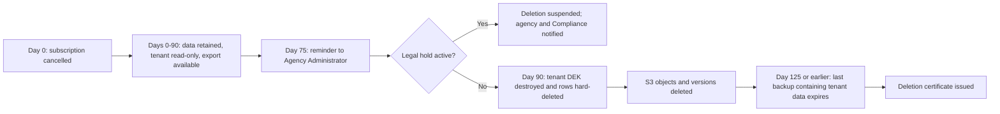

# Data Classification and Retention

## Document control

| Field | Value |
|---|---|
| Document ID | TW-DSN-DATA-03 |
| Version | 1.3 |
| Status | Baselined (aligned to SRS v1.3) |
| Owner | Business Analyst |
| Last updated | 2026-09-24 |
| Reviewers | Compliance and Privacy Officer (approver), Engineering Lead, Product Owner, Clinical SME (RN advisor), Customer Success Lead |

## 1. Purpose and scope

This document defines how Tendwell classifies, protects, retains and disposes of the data it holds for agencies (tenants). It covers:
- the classification scheme;
- handling, masking and encryption rules for each class;
- the field-level encryption list;
- the retention schedule;
- backups, tenant export and deletion, legal hold and data residency.

It applies to the PostgreSQL database, S3 documents and export files, the caregiver app's offline store, logs and telemetry, and the sub-processors listed in section 9.

Tendwell Labs acts as a business associate of each agency, which is the HIPAA covered entity, under a business associate agreement (NFR-CMP-01). The controls below are designed to support the agency's compliance with the HIPAA Privacy and Security Rules, including 45 CFR 164.312, and with state record-keeping rules. **The agency remains responsible for its own retention and disclosure obligations.** Retention values in section 6 are configurable defaults, and **each agency confirms the values for its state** during onboarding. This document is not legal advice.

Column-level classifications are recorded in the [data dictionary](data-dictionary.md).

## 2. Classification scheme

| Class | Definition | Examples in Tendwell | Highest-risk failure |
|---|---|---|---|
| **PHI** (Protected Health Information) | Information about a client's health, care, or payment for care that identifies the client or could reasonably identify them. It includes the client's identifiers and those of their relatives and household members. | Client name with any care fact, date of birth, Medicaid ID, service address and geocode, diagnoses, care plan tasks, visit times, EVV punch locations, medication orders and doses, vitals, notes, incidents, invoices and invoice lines, authorization numbers, client contacts | Reportable breach under 45 CFR 164.402; harm to clients |
| **PII** (Personally Identifiable Information) | Information that identifies a workforce member or user and is not PHI. | Caregiver and user names, emails, phones, employee numbers, home geolocation, IP addresses, device IDs, identity check results, time-off and leave balances | State breach notification; identity theft; employee harm |
| **Confidential** | Non-personal business information whose disclosure would harm the agency or Tendwell Labs. | EIN, pay rates and payroll amounts, authorization rates, plan prices, payment references, export file keys, support grant reasons | Commercial harm; fraud |
| **Internal** | Operational data with no personal or sensitive business content. | UUIDs, statuses, enumerations, configuration, timestamps not tied to a person, aggregate counts | Low |

**Assignment rules**

1. **The highest class wins.** A record, file, export or message takes the highest class of any field it contains. A payroll CSV that contains caregiver names is PII and Confidential. An invoice that names a client is PHI.
2. **Joins inherit.** An Internal field joined to a client becomes PHI. A visit `status` on its own is Internal; "C-10234 was Missed on 2026-09-08" is PHI.
3. **Aggregates are Internal only when no individual can be singled out.** Dashboard counts are Internal. A report row for one client is PHI.
4. **Biometric data is handled as at least PII.** Tendwell stores only the identity check result and score (`identity_checks`), never images or face templates.

## 3. Handling rules per class

| Control | PHI | PII | Confidential | Internal |
|---|---|---|---|---|
| Encryption in transit | TLS 1.2+ (NFR-SEC-01) | TLS 1.2+ | TLS 1.2+ | TLS 1.2+ |
| Encryption at rest | AES-256 storage encryption (RDS, S3 SSE-KMS, backups), plus field-level envelope encryption for designated fields (section 5) | AES-256 storage encryption | AES-256 storage encryption; EIN field-level | AES-256 storage encryption |
| Access | Role permission and tenant RLS (BR-001), plus location scope (FR-IAM-06). Minimum necessary (NFR-PRIV-01). | Role permission and tenant RLS | Role permission (for example, pay rates for `AG-FIN` and `AG-ADM` only) | Role permission |
| Display | Designated fields masked by default; reveal with reason (FR-CLI-06) | Shown to roles that need it | Shown to owning roles only | Shown |
| API responses | Masked by default; never in URLs or query strings; `Cache-Control: no-store` | Not in URLs except opaque IDs | Not in URLs | Allowed |
| Application logs and traces | **Never** (NFR-OBS-01). Opaque IDs only. | Never in clear text; hashed where correlation is needed | Never | Allowed |
| Notifications (SMS, push, email) | **Never** (BR-056, FR-NTF-05). Generic text plus a sign-in deep link. | First name of the recipient only | Never | Allowed |
| Exports | Watermarked with user, tenant and timestamp; audited (FR-RPT-04, BR-058); pre-signed links valid for 15 minutes | Watermarked; audited | Watermarked; audited | Audited |
| Mobile device | Only the caregiver's assigned visits for a rolling window; SQLCipher-encrypted; remote wipe on deactivation (NFR-MOB-02) | Own profile only | Not stored | Allowed |
| Non-production environments | **Prohibited.** Synthetic data only. | Prohibited. Synthetic only. | Synthetic only | Allowed |
| Platform support access | Only under an approved, time-boxed grant; every action audited with the grant ID (BR-008) | Same as PHI | Same as PHI | Allowed for platform operations |
| Disposal | Hard delete plus crypto-shred of field keys; deletion certificate on tenant deletion | Hard delete | Hard delete | Hard delete |

### 3.1 Masking rules

Masking is applied by the API, not by the browser. The masked value is all that leaves the server unless a reveal is made.

| Field | Default display | Revealed by | Mechanism |
|---|---|---|---|
| Client date of birth | `****-**-**` plus age, for example `Age 80` | Users with `clients:reveal_phi` | `POST /clients/{clientId}/phi-reveals` with a reason (BR-011) |
| Client Medicaid ID | `ZZ****8837` (last 4) | `clients:reveal_phi` | Reveal with reason |
| Client phone | `+1-***-***-0137` (last 4) | `clients:reveal_phi` | Reveal with reason |
| Client service address | City, state and ZIP only: `Lakemont, OH 43999` | `clients:reveal_phi` | Reveal with reason |
| Client diagnoses | Count only: `2 diagnoses` | `clients:reveal_phi` | Reveal with reason |
| Client lat/lng | Never returned | None | Used server-side for distance computation only (BR-021) |
| Tenant EIN | `**-***4821` | `AG-ADM` | Reveal with reason (audited) |
| Email in logs | `m***@example.com` | None | Logging filter |
| IP address in analytics | Truncated to /24 | None | Telemetry pipeline |

**Treatment-time exception.** A caregiver sees what they need to deliver care:
- the client's full service address, phone, allergies, care plan tasks and due doses;
- only for their own assigned visits;
- in the visit detail, from 24 hours before the scheduled start until the visit is Verified.

This is minimum-necessary access for treatment, granted by the visit assignment rather than by a reveal. It is logged as a `visit.detail_viewed` audit event.

**Reveal rules.** Each reveal requires a free-text reason of 10 or more characters. It returns only the fields requested, and is not cached by the client (`Cache-Control: no-store`). The UI re-masks the fields after 5 minutes. Each reveal writes a `client.phi_revealed` audit event that records the field names and the reason, never the values (BR-057, NFR-PRIV-02).

## 4. Encryption design

| Layer | Control |
|---|---|
| In transit | TLS 1.2+ with HSTS at CloudFront and the load balancer; TLS to RDS enforced (`rds.force_ssl`). Mobile builds use certificate pinning for the API host. |
| At rest, storage | RDS PostgreSQL storage, snapshots and read replicas encrypted with AWS KMS (AES-256). S3 buckets use SSE-KMS and block public access. Redis uses encryption at rest and in transit. |
| At rest, field level | Envelope encryption: each tenant has its own data encryption key (DEK), wrapped by a KMS customer-managed key. Fields are encrypted with AES-256-GCM in the application before insert, with the table, column and row ID bound as additional authenticated data so ciphertext cannot be moved between rows. |
| Key rotation | KMS keys rotate annually (NFR-SEC-01). DEKs are re-wrapped on rotation without re-encrypting data. A compromised DEK triggers a re-encryption job for that tenant. |
| Searchable encrypted fields | Keyed blind indexes (HMAC-SHA256 with a separate per-tenant key) on Medicaid ID, date of birth and diagnosis code. They support the duplicate check (FR-CLI-02) and uniqueness without decrypting. |
| Crypto-shredding | Destroying a tenant's DEK makes all its field-encrypted values, including copies in backups, unrecoverable. Tenant deletion uses this (section 8). |
| Mobile offline store | SQLCipher (AES-256), with the key held in the iOS Keychain or Android Keystore and released after device PIN or biometrics. The queue is wiped on sync acknowledgement and on remote wipe (NFR-MOB-02). |

## 5. Field-level encryption list

| Table.column | Class | Why it is field-encrypted | Searchable through |
|---|---|---|---|
| `tenants.ein_enc` | Confidential | Federal tax identifier | None (masked display) |
| `clients.dob_enc` | PHI | BR-011 designated PHI | `clients.dob_bidx` (with last name) |
| `clients.phone_enc` | PHI | BR-011 designated PHI | None |
| `clients.service_address_enc` | PHI | BR-011 designated PHI | None. The geocode is stored separately for distance computation. |
| `clients.medicaid_id_enc` | PHI | BR-011 designated PHI | `clients.medicaid_id_bidx` |
| `client_diagnoses.icd10_code` | PHI | BR-011 lists diagnoses | `client_diagnoses.icd10_code_bidx` |
| `client_diagnoses.description` | PHI | BR-011 lists diagnoses | None |
| `visit_notes.narrative` | PHI | Free-text clinical narrative, the highest re-identification risk | None |
| `note_addenda.text` | PHI | Free-text clinical narrative | None |
| `client_incidents.description` | PHI | Free text that can describe abuse or neglect allegations | None |
| `client_incidents.investigation_notes` | PHI | Free-text investigation content | None |

Other PHI, such as visit times, medication names, dose statuses and vital values, is protected by storage encryption, RLS, column privileges, masking and audit, but is not field-encrypted. Those values drive queries, schedules, escalations and the MAR grid. This is a deliberate trade-off recorded against NFR-SEC-01, which the Compliance and Privacy Officer has to approve.

## 6. Retention schedule

Retention runs from the trigger event. A disposal job runs monthly per tenant. It deletes records whose retention has ended, skips any record under legal hold (section 10), and writes a `retention.disposed` audit event with row counts per table. The Agency Administrator receives the list of records due 30 days before disposal.

> **Agency confirmation required.** The periods below are Tendwell defaults. State Medicaid provider agreements, licensure rules and payer contracts differ by state and can require longer periods; for minors, a period can run from the age of majority. During onboarding, each agency confirms or changes these values in tenant settings for its state. Tendwell enforces the configured values and does not determine which law applies.

| # | Record type | Tables and files | Retention | Trigger | Disposal method | Basis and rationale |
|---|---|---|---|---|---|---|
| 1 | Client record | `clients`, `client_diagnoses`, `client_contacts`, `client_caregiver_prefs`, `service_authorizations`, `care_plans`, `care_plan_tasks` | 7 years (configurable) | Client discharge date | Hard delete; field values crypto-shredded with the row key material | BR-013; state Medicaid and home care licensure record rules (agency confirms) |
| 2 | Visit and EVV records | `visits`, `visit_patterns`, `evv_punches`, `visit_exceptions`, `visit_task_results`, `identity_checks` | Same as the client record (7 years after discharge) | Client discharge date | Partition-aware hard delete by a privileged disposal role (append-only tables) | Supports payer audits of the EVV data elements under 21st Century Cures Act s.12006 and state EVV program rules |
| 3 | eMAR and vitals | `medication_orders`, `dose_tasks`, `prn_administrations`, `vital_readings`, `vital_ranges` | Same as the client record | Client discharge date | Hard delete | Part of the clinical record; state licensure rules |
| 4 | Documentation and incidents | `visit_notes`, `note_addenda`, `client_incidents`, `incident_actions`, incident photos in `documents` and S3 | Later of the client record period or 7 years after incident closure | Discharge date or incident closure | Hard delete; S3 delete with version expiry | Part of the clinical record; incident investigations can outlast discharge |
| 5 | Identity verification | Selfie images; vendor face template | Images: not retained (vendor deletes after the match). Template: until caregiver deactivation + 30 days, or sooner if state biometric law requires. | Each check; caregiver deactivation | Vendor deletion request with written confirmation | Data minimization; state biometric privacy laws (agency confirms consent requirements) |
| 6 | Workforce records | `caregivers`, `caregiver_credentials`, credential documents, `pay_profiles` | 7 years (configurable) | Caregiver separation (status `Inactive`) | Hard delete | State home care licensure personnel file rules; supports payroll and visit audits |
| 7 | Time and payroll | `time_off_requests`, `leave_balances`, `holidays`, `pay_periods`, `payroll_lines`, `payroll_exports` and the export CSV files | 7 years | End of the pay period | Hard delete; S3 delete | FLSA record-keeping (29 CFR Part 516) requires at least 3 years for payroll records and 2 years for time records; 7 years aligns paid hours with the billed visits they derive from |
| 8 | Billing records | `billing_runs`, `invoices`, `invoice_lines`, `credit_notes`, `payments`, `claim_batches` and claim CSV files | 7 years | End of the invoice period, or final payment if later | Hard delete; S3 delete | Medicaid program-integrity audits and tax record-keeping look-back periods |
| 9 | Audit trail | `audit_events`, `sign_in_events`, `support_access_grants` | 7 years | Event time | Drop monthly partitions older than 7 years | BR-057, NFR-PRIV-02; exceeds the 6-year HIPAA documentation retention in 45 CFR 164.316(b)(2) |
| 10 | User accounts | `users`, `user_roles`, `user_locations`, `user_permission_overrides`, `notification_preferences` | 7 years after deactivation for `users` (audit actor references). Child rows are deleted at deactivation. | User deactivation | Hard delete; phone and email nulled at deactivation + 90 days | Audit integrity; data minimization |
| 11 | Notifications | `notifications` | 13 months | Creation | Drop monthly partitions | Operational evidence of escalations; content holds no PHI (BR-056). Escalation outcomes are also in `audit_events`. |
| 12 | Tenant configuration | `tenant_settings`, `reason_codes`, `escalation_ladders`, `credential_types`, `locations`, `service_lines`, `payers`, `roles`, `role_permissions` | Life of the tenant | Tenant deletion (section 8) | Hard delete | Needed to interpret retained records |
| 13 | Tendwell commercial records | `tenants` (legal name, code, status), `subscriptions`, `plans`, `promo_codes`, payment-provider subscription history | 7 years | Tenant cancellation | Hard delete | Tendwell Labs' own financial records; contain no PHI |
| 14 | Technical records | `job_executions` 90 days; `event_outbox` 30 days after publication; API idempotency keys 24 hours; application logs and traces 30 days hot and 1 year archived; WAF logs 90 days; error tracking 90 days | As listed | Creation | TTL expiry; S3 lifecycle rules | Operations and security investigation. Logs carry no PHI (NFR-OBS-01). |
| 15 | Generated exports and reports | Report CSV and PDF files, audit log exports | 7 days in S3; download links valid for 15 minutes | Generation | S3 lifecycle rule | The export is already audited and watermarked (BR-058). Payroll and claim files follow rows 7 and 8. |
| 16 | Mobile offline queue | SQLCipher queue on the device | Until the server acknowledges sync; at most 72 hours of punches by design (NFR-AVL-02) | Sync acknowledgement or remote wipe | Secure delete on device; remote wipe on deactivation | NFR-MOB-02 |
| 17 | Tenant data after cancellation | All tenant-scoped data | 90 days | Cancellation | Tenant deletion procedure (section 8) | SRS configuration default (90 days, then deletion); NFR-PRIV-03 |

## 7. Backup retention

| Backup | Retention | Location | Notes |
|---|---|---|---|
| RDS automated backups and point-in-time recovery | 35 days | Primary US region | Supports RPO of 15 minutes or less (NFR-DR-01) |
| Daily RDS snapshot copies | 35 days | Second US region | Disaster recovery; encrypted with a region-specific KMS key |
| S3 object versioning (documents, exports) | Non-current versions expire after 35 days | Primary US region, replicated to the second US region | Protects against accidental deletion |
| Long-term archives | None | | Production data is not archived beyond 35 days. Retention is met by the live database. |

- Restores are tested quarterly into an isolated account, and the restored data is destroyed after the test (NFR-DR-01).
- A restore never resurrects data that was disposed of after the backup was taken. After any restore, the disposal job and the tenant deletion register are replayed before the database is opened to traffic.

## 8. Tenant export and deletion (NFR-PRIV-03)

### 8.1 Full tenant export

- **Who can request it:** the Agency Administrator, at any time while the tenant is `Active`, `ReadOnly` or within 90 days of cancellation.
- **Delivery:** within 5 business days of the request.
- **Contents:**
  - one CSV per table, with decrypted values and a data dictionary;
  - all S3 documents;
  - the full audit log;
  - a JSON manifest with row counts and SHA-256 checksums.
- **How it is delivered:** as an encrypted archive through a pre-signed link valid for 7 days. The archive password is sent through a separate channel.
- **Audit:** the export is watermarked and audited (BR-058).

### 8.2 Deletion timeline

1. **Day 90.** The deletion job:
   - destroys the tenant's data encryption key, which crypto-shreds field-encrypted PHI everywhere, including backups;
   - hard-deletes every tenant-scoped row;
   - deletes the tenant's S3 prefix and its object versions;
   - asks sub-processors to delete tenant data (identity vendor templates, payment-provider customer records where applicable).
2. **Backups.** Backup copies that still hold non-field-encrypted tenant rows expire within 35 days of deletion. No backup is restored for that tenant after deletion.
3. **Certificate.** A deletion certificate is issued to the Agency Administrator once the last backup has expired. It is signed by the Compliance and Privacy Officer and records:
   - the tenant code;
   - the request and deletion dates;
   - the row counts per table;
   - the KMS key destruction reference;
   - the backup expiry date.
4. **What Tendwell keeps.** Tendwell retains only:
   - its own commercial records (row 13 in section 6);
   - the deletion certificate;
   - platform-level audit entries that contain no PHI: tenant lifecycle events, support access grant metadata and deletion job results.

**Audit trail on deletion.** The tenant's audit log, which contains PHI references, is included in the export so the agency can meet its own retention obligations, and is then deleted with the tenant. This interprets two requirements together: NFR-PRIV-02 (7-year audit retention) and NFR-PRIV-03 (deletion within 90 days). It is listed for confirmation by the Compliance and Privacy Officer.

## 9. Sub-processors and data residency

All tenant data is stored and processed in **AWS US regions only**, in a primary region and a disaster-recovery region that are both in the United States. No replica, backup, log or support tooling copy is held outside the United States.

| Sub-processor | Purpose | Data shared | Residency and safeguard |
|---|---|---|---|
| AWS (RDS, S3, ECS Fargate, KMS, SES, CloudFront) | Hosting, storage, email | All classes | US regions; HIPAA-eligible services under a BAA (NFR-CMP-01) |
| Identity verification vendor | Liveness and face match (ADR-004) | Selfie image, caregiver reference ID | US processing; BAA and data processing terms; images deleted after match |
| Stripe | Subscription billing and invoice payment links | Payer name, invoice number and amount, payment details entered by the payer | No clinical data. Payment links carry the invoice number only. |
| Twilio | SMS | Phone number and PHI-free message text | No PHI by design (BR-056) |
| FCM and APNs | Push | Device token and PHI-free message text | No PHI by design |
| Google Maps Platform | Geocoding and drive time | Street address only, with no name, client ID or care information | Address-only requests; responses are not cached beyond the geocode result |

Platform support personnel access tenant data only through an approved support access grant (BR-008), and only from within the United States.

## 10. Legal hold

- **Who places a hold:**
  - the Agency Administrator, for its own tenant;
  - the Compliance and Privacy Officer, for a platform-wide matter or at an agency's written request.
- **Reasons:** litigation, a regulator or payer audit, an abuse or neglect investigation, or a breach investigation.
- **Scope:** a hold can cover the whole tenant, one client, one caregiver, a date range or a record type. Holds are recorded in a hold register in tenant settings, with the owner, reason, scope, start date and review date. Placing, changing and releasing a hold each create an audit event.
- **Effect:** records in scope are excluded from the monthly disposal job and from tenant deletion. Records under hold stay read-only and visible to authorized users. If a tenant cancels while a hold is active, the tenant's data is retained under the hold, and the agency and the Compliance and Privacy Officer are notified.
- **Review and release:** the owner reviews each hold every 90 days. When a hold is released, normal retention resumes from the original trigger. Records already past their retention period are disposed of in the next monthly run.

## 11. Logging rules (summary)

- Logs, traces and error reports carry the request ID, tenant ID, user ID and entity UUIDs only. They never carry names, addresses, dates of birth, Medicaid IDs, diagnoses, medications, note text or request bodies of PHI endpoints (NFR-OBS-01).
- The logging library redacts fields by name (for example `firstName`, `dateOfBirth`, `medicaidId`, `narrative`, `lat`, `lng`) and drops request bodies for routes tagged `x-phi: true` in the OpenAPI specification.
- Error tracking scrubs PHI and PII before data leaves the service.
- The detailed API rules are in [API guidelines, section 13](../../04-api/api-guidelines.md#13-phi-handling-in-apis).

## Related documents

- [Data dictionary](data-dictionary.md)
- [Entity relationship model](erd.md)
- [Non-functional requirements](../../02-requirements/non-functional-requirements.md)
- [Compliance mapping](../../02-requirements/compliance-mapping.md)
- [Business rules catalog](../../02-requirements/business-rules.md)
- [Deployment and security architecture](../architecture/deployment-and-security.md)
- [ADR-001 Multi-tenancy with row-level security](../architecture/adr/ADR-001-multi-tenancy-row-level-security.md)
- [ADR-004 Identity verification vendor adapter](../architecture/adr/ADR-004-identity-verification-vendor-adapter.md)
- [ADR-006 Offline-first caregiver app](../architecture/adr/ADR-006-offline-first-caregiver-app.md)
- [API guidelines](../../04-api/api-guidelines.md)
- [INC-2026-015 Escalation email to a deactivated user](../../07-operations/incidents/INC-2026-015-escalation-email-to-deactivated-user.md)
