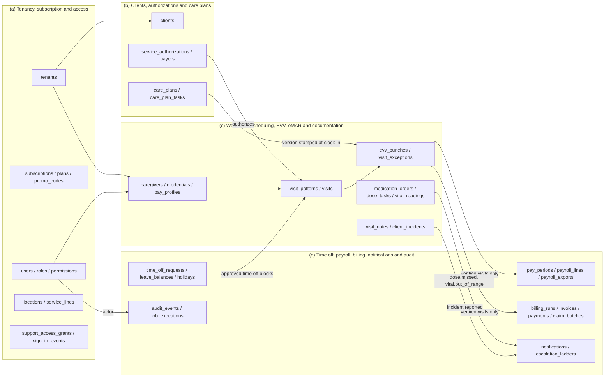
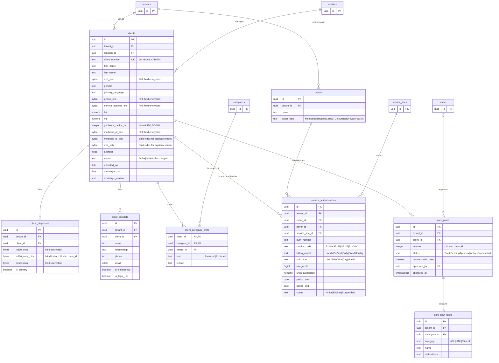
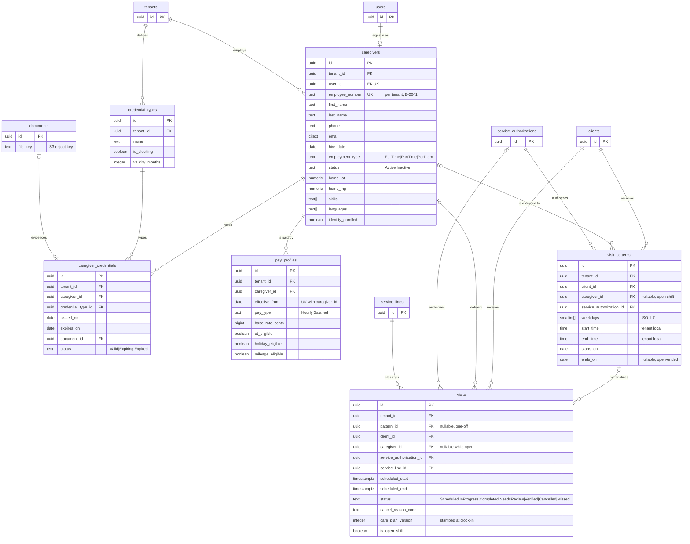
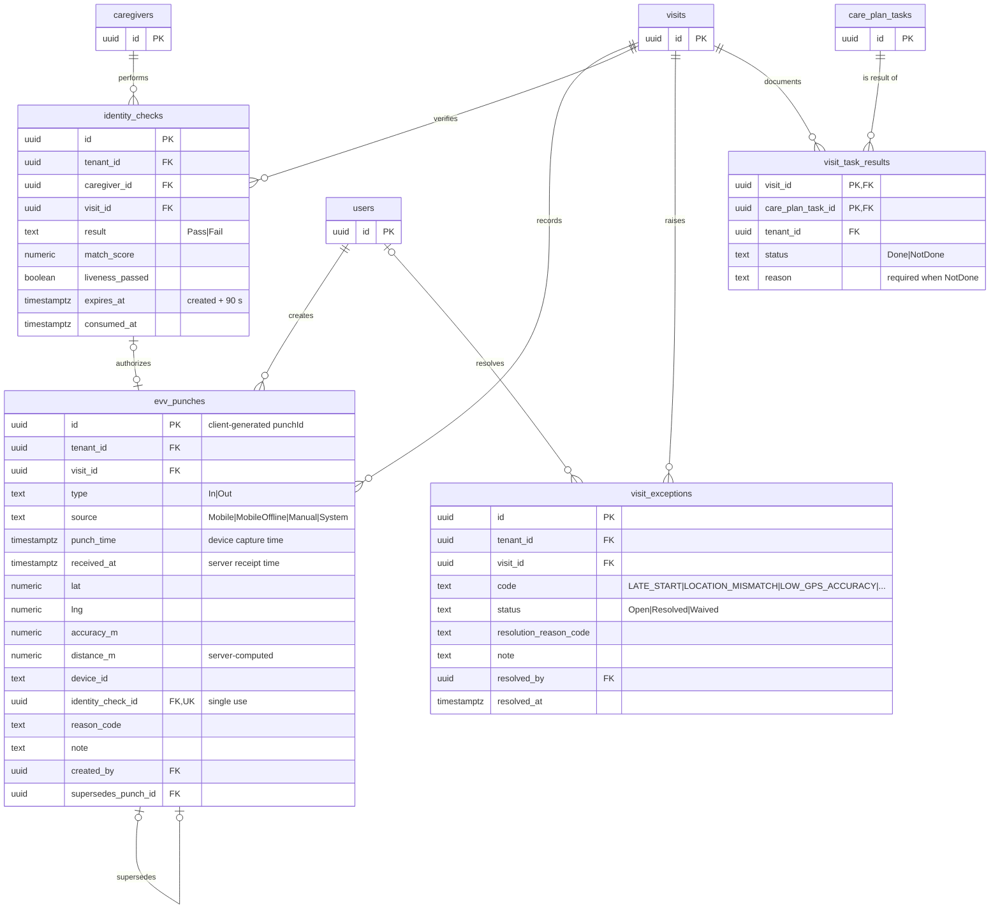
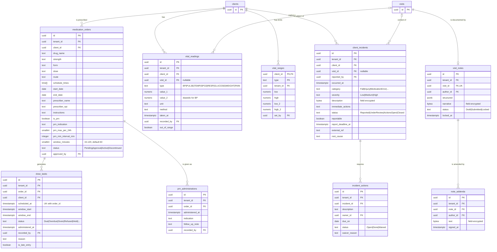
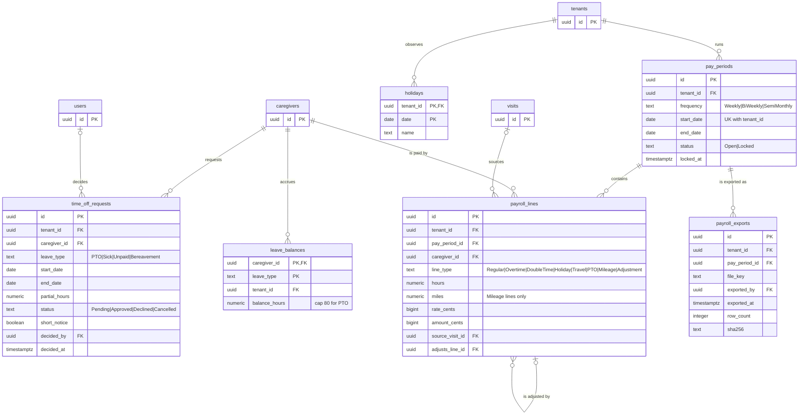
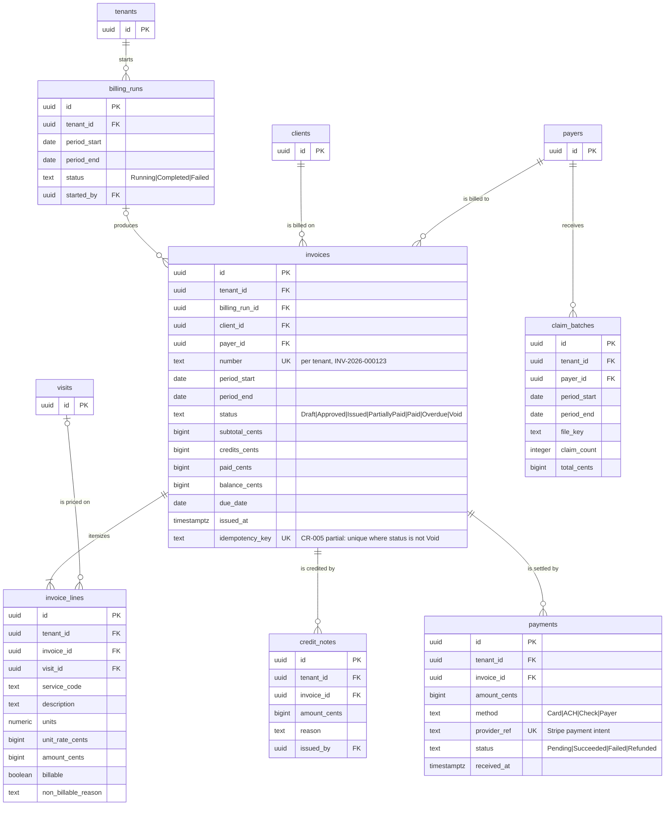
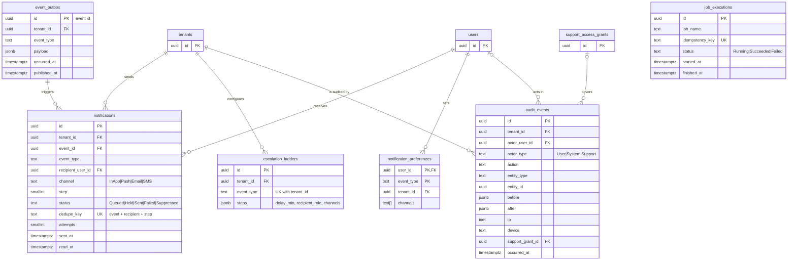

# Tendwell Entity Relationship Model

## Document control

| Field | Value |
|---|---|
| Document ID | TW-DSN-DATA-01 |
| Version | 1.3 |
| Status | Baselined (aligned to SRS v1.3) |
| Owner | Business Analyst |
| Last updated | 2026-09-24 |
| Reviewers | Engineering Lead (approver), Backend Developers, Compliance and Privacy Officer, QA Lead |

### Revision history

| Version | Date | Change |
|---|---|---|
| 1.0 | 2026-03-06 | Baseline logical model for SRS v1.0 |
| 1.1 | 2026-04-17 | CR-001 daily overtime profile held in `tenant_settings`; CR-002 claim confirmation flag; CR-003 family tables removed from Release 1 scope |
| 1.2 | 2026-06-12 | UAT clarifications: `visits.care_plan_version` stamped at clock-in, `payroll_lines.adjusts_line_id` |
| 1.3 | 2026-09-24 | CR-004 `LOW_GPS_ACCURACY` exception code; CR-005 partial unique index on `invoices.idempotency_key` (non-void rows); CR-006 escalation ladders target roles only, recipients resolved at send time |

## 1. Purpose and scope

This document is the logical data model for Tendwell Release 1. It shows every core entity from the SRS data model, its keys and its relationships, grouped into four domains. Column-level detail (types, nullability, classification, examples) is in the [data dictionary](data-dictionary.md). Retention and handling rules are in [data classification and retention](data-classification-and-retention.md).

In scope: all Release 1 tables in PostgreSQL 16. Out of scope: Family Portal tables (Release 2, CR-003), Redis job queues, S3 object layout and the analytics read model.

**Notation**

- Crow's foot cardinality: `||` exactly one, `|o` zero or one, `|{` one or more, `o{` zero or more.
- `PK` primary key, `FK` foreign key, `UK` unique key. Composite keys show `PK, FK` on each part.
- Comments in quotes give enumerations or rules. Full enumerations are in the data dictionary, section 7.
- Entities drawn with only their key columns are **references** to an entity whose full definition is in another diagram.
- Every tenant-scoped table carries `tenant_id` (design note 7.1). Standard columns `created_at`, `updated_at`, `created_by`, `updated_by` and `row_version` are omitted from the diagrams for readability.

## 2. Domain overview



The overview follows the core value chain: an authorization permits scheduling, a scheduled visit receives EVV punches and clinical documentation, and only a Verified visit flows to payroll and billing (BR-028).

## 3. Diagram (a): Tenancy, subscription and access

```mermaid
erDiagram
    plans ||--o{ subscriptions : "priced by"
    promo_codes |o--o{ subscriptions : "redeemed on"
    tenants ||--o{ subscriptions : "holds"
    tenants ||--|| tenant_settings : "configured by"
    tenants |o--o{ users : "employs"
    tenants ||--o{ locations : "operates"
    tenants ||--o{ service_lines : "offers"
    tenants |o--o{ roles : "defines"
    roles ||--o{ role_permissions : "grants"
    permissions ||--o{ role_permissions : "granted via"
    users ||--o{ user_roles : "holds"
    roles ||--o{ user_roles : "assigned via"
    users ||--o{ user_permission_overrides : "has"
    permissions ||--o{ user_permission_overrides : "overridden by"
    users ||--o{ user_locations : "scoped to"
    locations ||--o{ user_locations : "scopes"
    tenants ||--o{ support_access_grants : "grants access via"
    users ||--o{ support_access_grants : "requests"
    users |o--o{ sign_in_events : "attempts"

    tenants {
        uuid id PK
        text code UK "TEN-001"
        text legal_name
        bytea ein_enc "field-encrypted"
        text time_zone "IANA, America/New_York"
        text state_code "OH"
        text status "Pending|Trial|Active|ReadOnly|Cancelled"
    }
    tenant_settings {
        uuid tenant_id PK, FK
        jsonb settings "geofence, OT profile, quiet hours"
        integer row_version
    }
    plans {
        uuid id PK
        text code UK
        text name
        bigint price_per_seat_cents
        text status "Active|Retired"
    }
    promo_codes {
        uuid id PK
        citext code UK
        text kind "Trial|Discount"
        text discount_type "Percent|Fixed"
        numeric value
        integer trial_days
        integer max_redemptions
        integer redemptions
        timestamptz expires_at
        uuid[] eligible_plan_ids
        text status
    }
    subscriptions {
        uuid id PK
        uuid tenant_id FK
        uuid plan_id FK
        uuid promo_code_id FK "nullable, one code per subscription"
        integer seats
        text status "Trialing|Active|PastDue|ReadOnly|Cancelled"
        timestamptz trial_ends_at
        timestamptz current_period_start
        timestamptz current_period_end
        text provider_ref UK "Stripe subscription id"
    }
    users {
        uuid id PK
        uuid tenant_id FK "NULL for platform staff"
        citext email UK
        text phone
        text first_name
        text last_name
        text status "Invited|Active|Locked|Deactivated"
        boolean mfa_enabled
        timestamptz last_login_at
    }
    roles {
        uuid id PK
        uuid tenant_id FK "NULL for platform roles"
        text code "AG-COORD"
        text name
        boolean is_template
    }
    permissions {
        text code PK "clients:read"
        text module
        text description
    }
    role_permissions {
        uuid role_id PK, FK
        text permission_code PK, FK
        uuid tenant_id FK
    }
    user_roles {
        uuid user_id PK, FK
        uuid role_id PK, FK
        uuid tenant_id FK
    }
    user_permission_overrides {
        uuid user_id PK, FK
        text permission_code PK, FK
        uuid tenant_id FK
        text effect "Grant|Deny"
    }
    user_locations {
        uuid user_id PK, FK
        uuid location_id PK, FK
        uuid tenant_id FK
    }
    locations {
        uuid id PK
        uuid tenant_id FK
        text name
        text address
        text time_zone
    }
    service_lines {
        uuid id PK
        uuid tenant_id FK
        text code "HOME_VISIT|ADULT_DAY|SUPPORTED_LIVING"
    }
    support_access_grants {
        uuid id PK
        uuid tenant_id FK
        uuid requested_by FK
        uuid approved_by FK
        text scope "ReadOnly|ReadWrite"
        text reason
        timestamptz starts_at
        timestamptz expires_at "max starts_at + 4 h"
        timestamptz revoked_at
        text status "Requested|Active|Expired|Revoked|Declined"
    }
    sign_in_events {
        uuid id PK
        uuid tenant_id FK "nullable"
        uuid user_id FK "nullable when email unknown"
        citext email_attempted
        text outcome "Success|BadPassword|MfaFailed|Locked"
        inet ip
        text device
        timestamptz occurred_at
    }
```



**Cardinality notes**

- A tenant has zero or more `subscriptions` rows over its life, and at most one row whose status is not `Cancelled` (partial unique index). Each subscription is priced by exactly one plan. A retired plan stays on existing subscriptions until changed (FR-ONB-08).
- A subscription redeems zero or one promo code. A promo code is redeemed on many subscriptions, up to `max_redemptions` (BR-004). `eligible_plan_ids` is an array rather than a join table because it is platform-managed and read only at validation time.
- A tenant has exactly one `tenant_settings` row, created at provisioning (FR-ONB-04).
- A user belongs to zero tenants (platform staff, `PLT-ADM` and `PLT-SUP`) or exactly one tenant. A user's email is unique platform-wide, so one email cannot hold accounts in two agencies.
- Users and roles are many-to-many through `user_roles`. Roles and permissions are many-to-many through `role_permissions`. A user has zero or more overrides, each a Grant or a Deny of one permission. Effective permissions are role permissions plus Grants minus Denies, and a Deny always wins (BR-005).
- Users and locations are many-to-many through `user_locations`, which drives location scoping (FR-IAM-06).
- A support access grant belongs to exactly one tenant, is requested by one platform user and approved by zero or one Agency Administrator. It lasts at most 4 hours (BR-008).
- A sign-in event references zero or one user. It references none when the attempted email matches no account. Failed attempts against unknown emails are still recorded, so lockout responses do not reveal whether an account exists.

## 4. Diagram (b): Clients, authorizations and care plans



**Cardinality notes**

- A client belongs to exactly one tenant and one location. `client_number` is unique within the tenant, not platform-wide.
- A client has zero or more diagnoses (ICD-10-CM). Diagnosis values are field-encrypted (BR-011), so uniqueness per client is enforced on `icd10_code_bidx`, a keyed HMAC blind index, rather than on the ciphertext. At most one diagnosis per client has `is_primary = true` (partial unique index).
- Duplicate-client detection (FR-CLI-02) compares `medicaid_id_bidx`, or `dob_bidx` together with first and last name. Encrypted values are never decrypted in bulk to search.
- A client has zero or more contacts. `is_legal_rep` marks the authorized representative who will receive Family Portal access in Release 2.
- A client can have one preference row per caregiver. `Excluded` is a hard block in scheduling, while `Preferred` only sorts suggestions (BR-017).
- A client has zero or more service authorizations, each from exactly one payer for exactly one service line. A visit can be scheduled only against an `Active` authorization whose period covers the visit date and whose service line matches (BR-009). Overlapping `Active` authorizations for the same client, payer and service code are rejected by an exclusion constraint on the date range.
- A client has zero or more care plan versions. At most one version is `Active` at a time (partial unique index on `client_id` where `status = 'Active'`). Approving a new version moves the previous `Active` version to `Superseded` in the same transaction (BR-012).
- A care plan contains one or more tasks. Tasks are never edited after approval: a change creates a new care plan version.

## 5. Diagram (c): Workforce, scheduling, EVV, eMAR and documentation

Domain (c) is the largest. It is split into three diagrams so that each one renders legibly on GitHub.

### 5.1 Part 1: Workforce and scheduling



**Cardinality notes**

- A caregiver is linked to exactly one user account, created at invitation (FR-WRK-01). A user is a caregiver zero or one times. Office staff who also deliver care keep one user and one caregiver row.
- A caregiver holds zero or more credentials, each of exactly one tenant-defined credential type. `credential_types.is_blocking` decides whether an `Expired` credential prevents scheduling (BR-014, FR-WRK-03). A credential references zero or one evidence document.
- A caregiver has one or more effective-dated pay profiles. `(caregiver_id, effective_from)` is unique. A visit is paid at the profile in effect on the visit date (BR-015).
- A visit pattern belongs to one client and one authorization and to zero or one caregiver. A pattern with no caregiver materializes open shifts. The nightly job materializes visits for a rolling 8-week horizon (BR-018).
- A visit is materialized from zero or one pattern (`NULL` for one-off and unscheduled visits). It has zero or one caregiver: none while `is_open_shift = true`. It has zero or one authorization: none only for an unscheduled visit with no covering authorization, which is then priced as not billable.
- An exclusion constraint prevents two non-cancelled visits for the same caregiver with overlapping `[scheduled_start, scheduled_end)` ranges. This is the database backstop for the hard block in BR-016.

### 5.2 Part 2: Electronic visit verification



**Cardinality notes**

- A visit has zero or more punches. A completed visit has at least one effective `In` and one effective `Out` punch. The effective punch of each type is the latest row that no other row supersedes.
- A punch supersedes zero or one earlier punch. A time correction never updates a row: it inserts a `Manual` punch with `reason_code`, `note`, `created_by` and `supersedes_punch_id` (BR-026, ADR-002).
- An identity check authorizes zero or one punch. `evv_punches.identity_check_id` is unique, and `identity_checks.consumed_at` is set in the same transaction, so a check cannot be reused (BR-024).
- A visit raises zero or more exceptions, at most one `Open` exception per code (partial unique index on `(visit_id, code)` where `status = 'Open'`). A visit becomes `Verified` only when no exception is `Open` (FR-EVV-10).
- A visit has one task result per task in the care plan version stamped on the visit (`visits.care_plan_version`), not the client's current version (BR-012).

### 5.3 Part 3: eMAR, vitals and documentation



**Cardinality notes**

- A client has zero or more medication orders. An order generates dose tasks only while `Active`, for a rolling 7-day window (FR-MAR-02). `(order_id, scheduled_at)` is unique, so regeneration is idempotent. A PRN order (`is_prn = true`) generates no dose tasks. It has zero or more `prn_administrations` instead, checked against `prn_max_per_24h` and `prn_min_interval_min` (BR-033).
- `dose_tasks.client_id` is denormalized from the order so the MAR grid (FR-MAR-09) and the missed-dose queue read one table.
- A client has zero or more vital readings, each optionally captured during a visit. A client has at most one range row per vital type. With no row, the BR-034 defaults apply. For `BP`, `low` and `high` apply to systolic (`value_1`), and `low_2` and `high_2` apply to diastolic (`value_2`).
- A visit has zero or one note (`visit_notes.visit_id` is unique). A note has zero or more addenda once `Locked` (BR-035).
- A client is the subject of zero or more incidents, each optionally linked to a visit. An incident has zero or more corrective actions. It can move to `Closed` only when every action is `Done` or `Waived` with a reason (BR-037).

## 6. Diagram (d): Time off, payroll, billing, notifications and audit

Domain (d) is also split into three diagrams.

### 6.1 Part 1: Time off and payroll



**Cardinality notes**

- A caregiver has zero or more time-off requests, each decided by zero or one user. An `Approved` request blocks scheduling for its dates and moves assigned visits to open shifts (BR-039).
- A caregiver has one balance row per leave type. PTO accrues at 1 hour per 30 hours worked and is capped at 80 hours (BR-040).
- A tenant observes zero or more holidays, keyed by `(tenant_id, date)`.
- A tenant has one pay period per `start_date`. Periods are contiguous and do not overlap (exclusion constraint on the date range).
- A pay period contains zero or more payroll lines per caregiver. A line is sourced from zero or one visit: travel, PTO and mileage lines may have none. An `Adjustment` line in an open period references the line it corrects in a locked period through `adjusts_line_id` and the original visit through `source_visit_id` (BR-046, FR-PAY-06).
- A pay period has zero or more exports. The first export locks the period. A re-export of a locked period produces a new row with its own checksum.

### 6.2 Part 2: Billing



**Cardinality notes**

- A billing run produces zero or more invoices. A rerun of the same period updates the existing `Draft` invoices in place and never inserts a second one (BR-050).
- `invoices.idempotency_key` is `tenant_id:client_id:payer_id:period_start:period_end` and has a partial unique index over non-void invoices (`WHERE status <> 'Void'`), so a voided invoice can be reissued under the same key (BR-051). This is the CR-005 fix for INC-2026-007, where two scheduler workers raced an application-level check-then-insert. The run uses `INSERT ... ON CONFLICT (idempotency_key) WHERE status <> 'Void' DO UPDATE ... WHERE invoices.status = 'Draft'`, so an approved or issued invoice is never touched.
- An invoice has one or more lines. A line references zero or one visit: Fixed monthly lines reference none. A Verified visit is billed on at most one non-void invoice: the run selects only visits with no line on a non-void invoice, and the invoice-level unique key stops a concurrent second run. A capped visit can have two lines, one billable and one `Not billable - exceeds authorization` (FR-BIL-03).
- An invoice has zero or more credit notes and zero or more payments. `balance_cents = subtotal_cents - credits_cents - paid_cents` is enforced by a check constraint.
- A payer receives zero or more claim batches. A claim batch is a CSV file export for the agency's clearinghouse. Release 1 has no EDI 837.

### 6.3 Part 3: Notifications and audit



**Cardinality notes**

- A domain event in `event_outbox` triggers zero or more notifications, one per resolved recipient, channel and escalation step. `notifications.dedupe_key` is `event_id:recipient_user_id:step:channel` and is unique (BR-055), so a redelivered event cannot notify twice.
- Recipients are resolved at send time from active users who hold the ladder step's role in the relevant location (BR-054, CR-006). `escalation_ladders.steps` stores roles only and never user IDs. This removes the stale-recipient path behind INC-2026-015.
- A user has at most one preference row per event type. Urgent event types ignore preferences that would remove every channel (BR-053).
- An audit event belongs to one tenant, has zero or one acting user (none for `System`) and references zero or one support access grant. When it is set, the action was taken under that grant (BR-008).
- `job_executions` is a platform table. Its `idempotency_key` embeds the tenant and the business period, for example `billing-run:7c1e4a52:2026-09`. The unique constraint makes scheduled jobs single-flight across workers and deployments (ADR-003, NFR-MNT-02).

## 7. Design notes

### 7.1 `tenant_id` on every table

- Every tenant-scoped table has `tenant_id uuid NOT NULL`, including child tables where the SRS entity list omits it, for example `evv_punches`, `care_plan_tasks`, `invoice_lines` and `visit_task_results`. Denormalizing the column keeps every row-level security policy a single equality check and lets each table be partitioned or exported per tenant (BR-001, NFR-PRIV-03).
- Parents expose `UNIQUE (tenant_id, id)`. Children reference parents with composite foreign keys, for example `FOREIGN KEY (tenant_id, visit_id) REFERENCES visits (tenant_id, id)`. The database therefore rejects a child that points to another tenant's parent, even if application code is wrong.
- Only these tables have no `tenant_id` or a nullable one:
  - Platform-global tables: `plans`, `promo_codes`, `permissions`, `job_executions`.
  - Tables with a nullable `tenant_id`: `users` and `roles` (platform staff and roles), and `sign_in_events` (unknown email).

### 7.2 Row-level security

Every tenant-scoped table enables and forces RLS with the same policy pattern (ADR-001):

```sql
ALTER TABLE visits ENABLE ROW LEVEL SECURITY;
ALTER TABLE visits FORCE ROW LEVEL SECURITY;
CREATE POLICY tenant_isolation ON visits
  USING (tenant_id = current_setting('app.tenant_id')::uuid)
  WITH CHECK (tenant_id = current_setting('app.tenant_id')::uuid);
```

- The API sets `SET LOCAL app.tenant_id` at the start of each transaction from the verified JWT `tenant_id` claim. If the setting is missing, `current_setting` raises an error, so a query without tenant context fails rather than returning every tenant's rows.
- The application database role does not own the tables and does not have `BYPASSRLS`. Migrations run as a separate owner role.
- Background jobs that span tenants loop over tenants and set `app.tenant_id` per transaction. No job runs a cross-tenant query against PHI tables.
- Support access under an approved grant uses the same policy. The API additionally sets `app.support_grant_id`, which audit triggers copy into `audit_events.support_grant_id` (BR-008).
- Location scoping (FR-IAM-06) is enforced in the API's query layer from the JWT `locations` claim, not in RLS. Location assignments change often and are checked against `user_locations` on each request.
- Automated tests prove isolation for every table: a session for tenant A reads zero rows of tenant B (NFR-MNT-01).

### 7.3 Identifiers

- Primary keys are UUIDs. The API generates UUIDv7 (time-ordered) values to keep B-tree inserts local. Exposed IDs are opaque and never encode PHI.
- `evv_punches.id` is the client-generated `punchId` from the mobile app. A retried online punch or an offline sync of the same punch collides on the primary key and returns the original result. Retries therefore never create a duplicate punch (FR-EVV-05).
- Human-readable numbers are unique per tenant and are never used as foreign keys:
  - `clients.client_number`, for example `C-10234`.
  - `caregivers.employee_number`, for example `E-2041`.
  - `invoices.number`, for example `INV-2026-000123`. It is allocated from a per-tenant yearly sequence when the draft is created and never reused. A voided invoice keeps its number.

### 7.4 Money and quantities

- All money is stored as `bigint` cents in columns named `*_cents`. Rates are cents per unit. No table stores money in a floating-point type.
- Billing units are whole numbers, computed per visit as `floor(minutes / 15)`, plus 1 when the remainder is 8 minutes or more (BR-047). Visits of 127, 113 and 120 minutes give 8 + 8 + 8 = 24 units, or 17,400 cents at a rate of 725 cents.
- Prorated fixed monthly charges are computed in integer arithmetic and rounded half-up to the cent. For example, 620,000 cents x 21 / 30 = 434,000 cents.
- Payroll time is computed in integer seconds and stored in `payroll_lines.hours` as `numeric(12,6)`. It is rounded to 2 decimals only for display and export (BR-045). Mileage is stored in `payroll_lines.miles` and never changes hours (BR-044).

### 7.5 Timestamps and time zones

- All instants are `timestamptz` and stored in UTC (NFR-DAT-01). The API emits RFC 3339 UTC strings ending in `Z`.
- Business dates such as `period_start`, `due_date` and holiday `date` are `date` values. They are interpreted in the tenant time zone held in `tenants.time_zone`, or in `locations.time_zone` when a location overrides it. Both use IANA names, for example `America/New_York`.
- Visit patterns store local `time` values. Materialization converts each occurrence to UTC using the location time zone, so a 09:00 visit stays at 09:00 local time across daylight saving changes.
- Durations are computed from UTC instants, never from wall-clock times. For example, an overnight supported-living shift from 22:00 on 2026-10-31 to 07:00 on 2026-11-01 lasts 10 hours, because clocks fall back that night.
- `evv_punches.punch_time` is the device capture time and `received_at` is the server receipt time. Both are kept (BR-025).

### 7.6 Soft delete and hard delete policy

| Record family | Policy | Mechanism |
|---|---|---|
| Clinical, EVV, eMAR, documentation and financial records (`visits`, `evv_punches`, `dose_tasks`, `visit_notes`, `client_incidents`, `invoices`, `payroll_lines` and others) | Never deleted by users | Terminal statuses instead: `Cancelled`, `Missed`, `Void`, `Discontinued`, `Superseded`. Doses are never auto-cancelled or deleted (BR-031, CR-007 rejected) |
| Master records (`clients`, `caregivers`, `users`, `payers`, `locations`) | Deactivated, not deleted | `status` set to `Discharged`, `Inactive` or `Deactivated`. Discharged clients become read-only (BR-013) |
| Editable child lists (`client_contacts`, `client_caregiver_prefs`, `user_locations`, `user_roles`, `user_permission_overrides`, `notification_preferences`) | Hard delete allowed | The change is captured in `audit_events.before` and `audit_events.after`, so history is not lost |
| Configuration (`credential_types`, `reason_codes`, `escalation_ladders`) | Soft delete | `deleted_at` column. Rows stay referenceable by historical records |
| Any record past its retention period, and tenant data after cancellation | Hard delete by the platform only | The retention disposal job or the tenant deletion job (NFR-PRIV-03), logged with row counts and a deletion certificate. See [data classification and retention](data-classification-and-retention.md) |

### 7.7 Append-only tables

`evv_punches` (BR-026, ADR-002)

- The application role has `INSERT` and `SELECT` only.
- A `BEFORE UPDATE OR DELETE` trigger raises an exception, which also protects against an operator mistake.
- A correction is a new row whose `supersedes_punch_id` points to the original. The visit history shows both rows.
- The disposal job runs as a separate role, and only after the retention period.

`audit_events` (BR-057, FR-RPT-03)

- `INSERT` and `SELECT` only, enforced by the same trigger pattern.
- Partitioned monthly by `occurred_at`. Retention is 7 years (NFR-PRIV-02).
- A daily digest (SHA-256 of the day's rows) is written to object storage with Object Lock to give tamper evidence.
- `before` and `after` store PHI fields as ciphertext references, never plaintext.

Other insert-only tables follow the same trigger pattern: `sign_in_events`, `note_addenda`, `prn_administrations` and `payroll_exports`.

### 7.8 Concurrency and versioning

- Mutable entities carry `row_version integer`. The API exposes it as an `ETag` and requires `If-Match` on updates, returning `412` on a mismatch (see [API guidelines](../../04-api/api-guidelines.md)).
- `care_plans.version` and `pay_profiles.effective_from` are business versioning and are separate from `row_version`.

### 7.9 Scale

NFR-SCL-01 sets the target at 500 tenants and 2 million visits per month. To meet it:

- `visits`, `evv_punches`, `audit_events` and `notifications` are range-partitioned by month.
- Their indexes lead with `tenant_id`.
- Partitions older than 13 months move to a lower-cost tablespace and stay queryable.

### 7.10 Additions to the SRS entity list

The SRS entity list names the core business columns. The design adds the items below. Each one is flagged in the data dictionary.

| Addition | Reason |
|---|---|
| `tenant_id` on child tables; `created_at`, `updated_at`, `created_by`, `updated_by`, `row_version` on all tables | BR-001 isolation, audit and optimistic concurrency |
| `tenants.code`, `tenants.registered_address` | Human-readable tenant code (`TEN-001`) used by support and in exports; registered address captured at sign-up (FR-ONB-01) |
| `clients.medicaid_id_bidx`, `clients.dob_bidx`, `client_diagnoses.id`, `client_diagnoses.icd10_code_bidx` | Keyed blind indexes so encrypted values can be matched for duplicate checks (FR-CLI-02) and uniqueness without decryption |
| `tenant_settings` | Holds the configuration defaults provisioned by FR-ONB-04, including the CR-001 daily overtime profile and the CR-002 claim confirmation flag |
| `reason_codes` | Tenant-configurable EVV, cancellation and waiver reason codes provisioned by FR-ONB-04 |
| `documents` | Target of `caregiver_credentials.document_id`; also holds incident photos (FR-DOC-03) |
| `event_outbox` | Target of `notifications.event_id`; transactional outbox for domain events |
| `invoices.billing_run_id` | Traceability from a run to its invoices for the NFR-OBS-02 count-deviation alert |
| `payroll_lines.miles` | The mileage line quantity is in miles, not hours (BR-044) |
| `vital_ranges.low_2`, `vital_ranges.high_2` | Diastolic blood pressure limits (BR-034) |
| `notifications.read_at` | Needed by `POST /me/notifications/{notificationId}/read` |
| `client_incidents.place`, `people_involved`, `investigation_notes` | Fields named in FR-DOC-03 and FR-DOC-05 |

## Related documents

- [Data dictionary](data-dictionary.md)
- [Data classification and retention](data-classification-and-retention.md)
- [Software requirements specification](../../02-requirements/SRS.md)
- [Business rules catalog](../../02-requirements/business-rules.md)
- [Non-functional requirements](../../02-requirements/non-functional-requirements.md)
- [ADR-001 Multi-tenancy with row-level security](../architecture/adr/ADR-001-multi-tenancy-row-level-security.md)
- [ADR-002 Append-only EVV punch ledger](../architecture/adr/ADR-002-append-only-evv-punch-ledger.md)
- [ADR-003 Single-flight scheduled jobs](../architecture/adr/ADR-003-single-flight-scheduled-jobs.md)
- [State machines](../diagrams/state-machines.md)
- [Data flow diagram](../diagrams/data-flow-diagram.md)
- [OpenAPI specification](../../04-api/openapi.yaml)
- [INC-2026-007 Duplicate client invoices](../../07-operations/incidents/INC-2026-007-duplicate-client-invoices.md)
