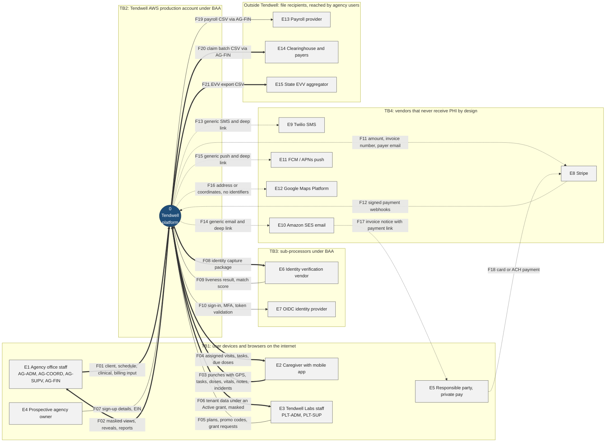
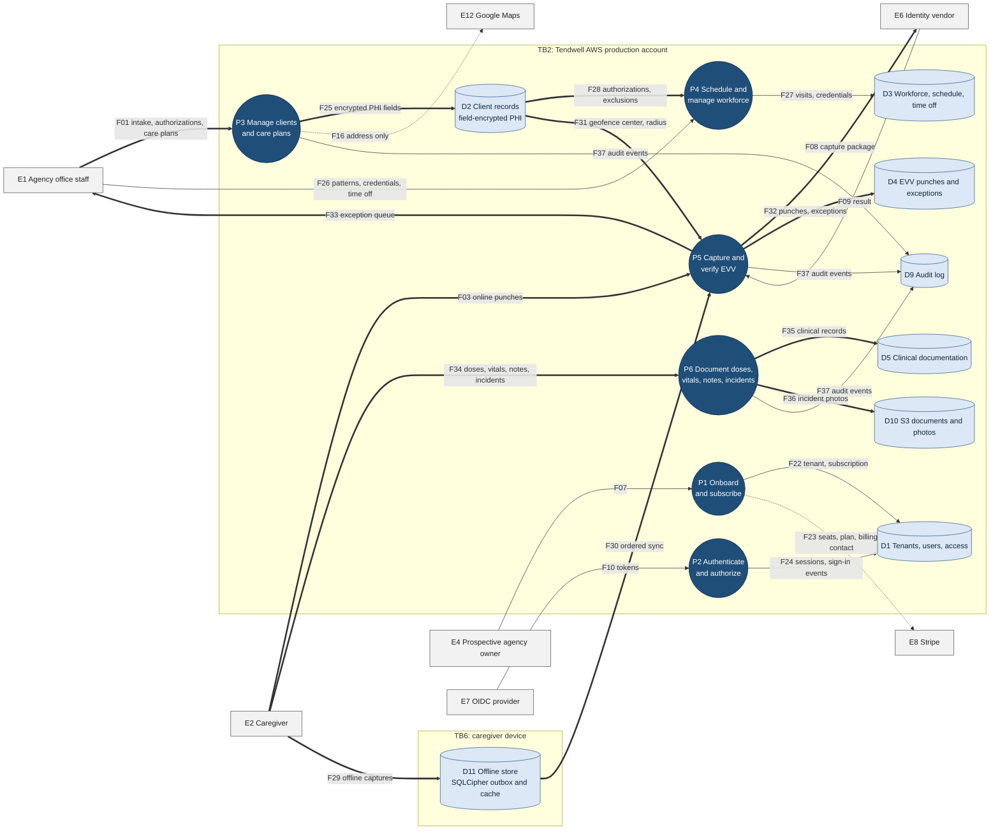
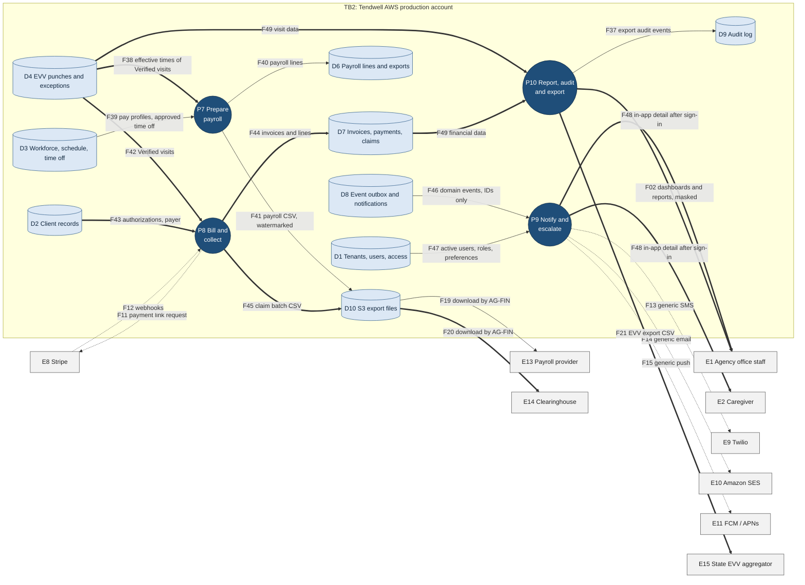

# Data Flow Diagram

## Document control

| Field | Value |
|---|---|
| Document ID | TW-DGM-04 |
| Version | 1.3 |
| Status | Approved |
| Owner | Business Analyst |
| Last updated | 2026-09-28 |
| Reviewers | Compliance and Privacy Officer, Engineering Lead, QA Lead |

| Version | Date | Change |
|---|---|---|
| 1.0 | 2026-03-02 | Baseline with SRS v1.0 |
| 1.2 | 2026-06-12 | Offline store and identity capture flows detailed for UAT privacy review |
| 1.3 | 2026-09-28 | Email and notification flows re-verified after INC-2026-015 (CR-006); invoice email content per SRS TBD-13 |

### Purpose and scope

This document shows where Tendwell data comes from, where it is processed and stored, and where it leaves, with trust boundaries and PHI flows marked. It is the basis for the privacy review, the HIPAA security risk analysis and threat modelling. Level 0 shows Tendwell as a single process with its external entities; level 1 decomposes it into processes and data stores, drawn as two views (care delivery, then back office) for readability.

Classifications follow the [data classification and retention](../data/data-classification-and-retention.md) scheme: **PHI**, **PII**, **Confidential** and **Internal**, where the highest class of any field in a flow wins. Interface IDs (IF-01 to IF-10) are those in the [SRS](../../02-requirements/SRS.md).

### Notation

| Symbol | Meaning |
|---|---|
| Rectangle (E-number) | External entity: a person, organization or system outside Tendwell's control |
| Circle (P-number) | Process that transforms data |
| Cylinder (D-number) | Data store |
| Thick arrow `==>` | Flow that carries PHI or biometric data |
| Solid arrow `-->` | Flow that carries PII, Confidential or Internal data but no PHI |
| Dotted arrow `-.->` | Flow that never carries PHI by design (notification channels, payment provider, maps) |
| Labelled subgraph (TB-number) | Trust boundary; every crossing is authenticated and encrypted in transit |

Flow labels start with the flow ID used in the inventory in section 4.

## 1. Level 0: context

*Figure 1. Level 0 context DFD. PHI crosses TB1 only to authenticated users of the owning tenant and crosses TB3 only to the identity verification vendor under a BAA. Nothing in TB4 receives PHI (BR-056, FR-NTF-05). Supports NFR-PRIV-01, NFR-CMP-01 and NFR-SEC-01.*

## 2. Level 1: care delivery

*Figure 2. Level 1, care delivery. The device store (TB6) holds only the caregiver's assigned work for 72 hours and syncs in capture order (ADR-006). Client coordinates move from D2 to P5 inside TB2 only; the API never returns them. Supports FR-CLI-01, FR-CLI-06, FR-EVV-02, FR-EVV-04, FR-EVV-05, BR-011, BR-021 and NFR-MOB-02.*

## 3. Level 1: back office, notifications and reporting

*Figure 3. Level 1, back office. Payroll and billing read only Verified visits (BR-028). Notification bodies leaving TB2 are generic; detail is shown in-app after sign-in (BR-056). Recipients are resolved from D1 at send time (BR-054, CR-006). Exports carry watermarks and audit events (BR-058). Supports FR-PAY-05, FR-BIL-01, FR-BIL-05, FR-BIL-06, FR-NTF-01 to FR-NTF-05, FR-RPT-02 to FR-RPT-04 and NFR-CMP-02.*

## 4. Data flow inventory

| Flow | From | To | Data | Classification | Protection |
|---|---|---|---|---|---|
| F01 | E1 Agency staff | P0 / P3 | Client demographics, diagnoses, authorizations, care plans, schedules, billing actions | PHI | TLS 1.2+; OIDC JWT; permission guard; RLS; field encryption on write |
| F02 | P0 / P10 | E1 Agency staff | Masked lists and details; revealed fields on request; reports | PHI | Masking by default; audited reveal (FR-CLI-06); `Cache-Control: no-store`; location scope |
| F03 | E2 Caregiver | P0 / P5 | Online punches with GPS, accuracy, device ID; task statuses | PHI | TLS with certificate pinning; JWT; server-side distance (BR-021) |
| F04 | P0 | E2 Caregiver | Assigned visits, client first name and last initial, service address, tasks, due doses, allergies | PHI | Only assigned visits, 72 h window; stored in SQLCipher |
| F05 | E3 Platform staff | P0 | Plans, promo codes, support grant requests | Confidential | WAF IP allowlist; MFA (BR-006) |
| F06 | P0 | E3 Platform staff | Tenant data under an Active grant | PHI (masked) | Grant approval, 4 h maximum, read-only default, no reveal, audited with grant ID (BR-008) |
| F07 | E4 Owner | P1 | Owner contact, agency legal details, EIN, plan | PII, Confidential | TLS; EIN encrypted on receipt; card data goes to Stripe, never to Tendwell |
| F08 | P5 | E6 Identity vendor (IF-06) | Encrypted capture package, enrollment reference | PII (biometric) | BAA; in-memory only on the server; vendor deletes after match (ADR-004) |
| F09 | E6 | P5 | Liveness result, match score, vendor transaction ID | PII | Server-side; result valid 90 s, single use (BR-024) |
| F10 | P2 / P0 | E7 OIDC provider (IF-10) | Email, MFA factors, tokens | PII | OIDC with PKCE; JWKS validation; 15 min access tokens |
| F11 | P8 / P0 | E8 Stripe (IF-01) | Invoice number, amount, currency, responsible party email, tenant and invoice IDs | Confidential (no PHI) | Payload allowlist; no client name, service code or diagnosis |
| F12 | E8 | P8 / P0 | Payment events | Confidential | HMAC-SHA256 signature, 5-minute tolerance, event ID claimed once (ADR-003) |
| F13 | P9 | E9 Twilio (IF-02) | Phone number, generic text, deep link | PII (no PHI) | Templates have no PHI placeholders (template lint in CI); BR-056 |
| F14 | P9 | E10 Amazon SES (IF-03) | Email address, generic text, deep link | PII (no PHI) | Same template control; recipients resolved at send time; dispatch guard re-checks user status (BR-054) |
| F15 | P9 | E11 FCM / APNs (IF-04) | Device token, generic title and body, deep link | PII (no PHI) | Same template control; payload size check |
| F16 | P3 | E12 Google Maps (IF-05) | Address string at intake; coordinate pairs for drive time | Confidential (no identifiers) | Adapter allowlist sends no name, client number or Medicaid ID |
| F17 | E10 | E5 Responsible party | Invoice number, amount, due date, payment link | Confidential (no PHI) | Itemized invoice only behind the link after verification; no attachment (SRS TBD-13) |
| F18 | E5 | E8 Stripe | Card or bank details | Confidential (cardholder data) | Stripe-hosted page; outside Tendwell's PCI scope |
| F19 | D10 | E13 Payroll provider (IF-07) | Employee number, hours, rates, amounts, mileage | PII, Confidential | Pre-signed URL 15 min; watermark in file name and manifest; SHA-256 recorded; period lock (BR-046, BR-058) |
| F20 | D10 | E14 Clearinghouse (IF-08) | Medicaid ID, authorization number, HCPCS code, dates, units, charges, diagnosis codes | PHI | Pre-signed URL; watermark; audit event; agency transmits through its own clearinghouse account |
| F21 | P10 | E15 State EVV aggregator (IF-09) | Six EVV elements, punch sources, exception and reason codes | PHI | Configurable CSV; watermark; audit event (NFR-CMP-02) |
| F22 | P1 | D1 | Tenant, subscription, settings | Confidential | RLS on tenant tables; EIN field-encrypted |
| F23 | P1 | E8 Stripe | Seats, plan, billing contact | Confidential | Payload allowlist |
| F24 | P2 | D1 | Sessions, `sign_in_events` | PII | Append-only; 7-year audit retention |
| F25 | P3 | D2 | Client record with encrypted DOB, Medicaid ID, phone, address, diagnoses | PHI | Envelope encryption with per-tenant keys in KMS; blind indexes for duplicate checks |
| F26 | E1 | P4 | Visit patterns, caregiver profiles, credentials, time-off decisions | PII | Permission guard; compliance checks (FR-SCH-03) |
| F27 | P4 | D3 | Visits, credentials, pay profiles, time off | PII, Confidential | RLS; effective-dated pay profiles |
| F28 | D2 | P4 | Authorization coverage, client exclusions | PHI | Internal read within TB2 |
| F29 | E2 | D11 | Offline punches, identity capture packages, clinical entries, photos | PHI, PII (biometric) | SQLCipher AES-256; key in Keychain or Keystore; wipe on deactivation (NFR-MOB-02) |
| F30 | D11 | P5 | Ordered outbox commands with device and monotonic time | PHI | Idempotent by command ID; LATE_OFFLINE_SYNC after 24 h (BR-025) |
| F31 | D2 | P5 | Client coordinates and geofence radius | PHI | Never returned by the API; used for server-side distance only |
| F32 | P5 | D4 | Append-only punches, exceptions, identity check results | PHI | Insert-only grants (ADR-002) |
| F33 | P5 | E1 | Exception queue entries | PHI | Location scope; masked client fields |
| F34 | E2 | P6 | Dose outcomes, PRN records, vitals, notes, incidents | PHI | Reason required for Refused, Held, Not available (BR-032); note lock after 24 h (BR-035) |
| F35 | P6 | D5 | eMAR, vitals, notes, addenda, incidents | PHI | Append-only addenda; RLS |
| F36 | P6 | D10 | Incident photos | PHI | SSE-KMS; pre-signed upload; no public access |
| F37 | P3, P5, P6, P10 | D9 | Audit events with actor, action, entity, before and after, IP, device | PHI (in before and after values) | Append-only; Object Lock archive for 7 years (BR-057, NFR-PRIV-02) |
| F38 | D4 | P7 | Effective start and end of Verified visits | PHI | Read through the effective-time view (ADR-002) |
| F39 | D3 | P7 | Pay profiles, approved time off, holidays | PII, Confidential | RLS; AG-FIN permission |
| F40 | P7 | D6 | Payroll lines | PII, Confidential | Locked on export; adjustments only (FR-PAY-06) |
| F41 | P7 | D10 | Payroll CSV | PII, Confidential | Watermark; SHA-256 in `payroll_exports` |
| F42 | D4 | P8 | Verified visits | PHI | Only Verified visits (BR-028) |
| F43 | D2 | P8 | Authorizations, rates, payer | PHI | Units capped (BR-049) |
| F44 | P8 | D7 | Invoices and lines | PHI | Unique idempotency key over non-void invoices (BR-050, ADR-003) |
| F45 | P8 | D10 | Claim batch CSV | PHI | Watermark; audit |
| F46 | D8 | P9 | Domain events with entity IDs only | Internal | No PHI in event payloads or job queues |
| F47 | D1 | P9 | Active users with target role and location, channel preferences | PII | Resolved at send time; deactivated users excluded (BR-054) |
| F48 | P9 | E1, E2 | In-app notification detail | PHI | Shown only after sign-in, under RLS and permissions |
| F49 | D2 to D7 | P10 | Visit, clinical and financial data for reports | PHI | Location scope; masked output; export watermark (FR-RPT-04) |

## 5. Flows that never carry PHI

These flows cross into systems that are either not covered for PHI or not appropriate for it. Each has a design control and a test, not only a policy.

| Flow | Channel | Control | Verification |
|---|---|---|---|
| F13, F14, F15 | SMS, email, push | Notification templates contain only generic text and a sign-in deep link; the template schema rejects client, diagnosis, medication and address placeholders; content is reviewed by the Compliance and Privacy Officer | CI template lint; automated test per event type (BR-056, FR-NTF-05); privacy review after INC-2026-015 |
| F14 recipients | Email | Recipients resolved at send time from active users; dispatch guard re-checks status immediately before send | Business anomaly alert on any notification to a deactivated user (NFR-OBS-02) |
| F11, F23 | Stripe | Payload builder allowlist: amounts, invoice number, tenant and invoice IDs, billing contact | Contract test asserts the exact field set |
| F16 | Google Maps | Adapter sends address string or coordinates only, never names or client identifiers | Contract test on adapter requests |
| F17 | Invoice email | Invoice number, amount, due date and link only; itemization behind verification | Template test (SRS TBD-13) |
| F46 | Event outbox and job queue | Events and job payloads carry IDs; consumers load data under RLS | Schema test on event types |
| Logs, traces, errors | CloudWatch, Grafana, Sentry | Allowlist serializers; body logging disabled; Sentry scrubbing; daily canary scan | SAST rule; canary scan alert (NFR-OBS-01) |

## 6. Trust boundaries

| Boundary | Contains | Controls on crossing |
|---|---|---|
| TB1 User devices and browsers | Office staff browsers, caregiver phones, platform staff browsers, sign-up visitors, responsible parties | TLS 1.2+; OIDC tokens; MFA for privileged roles (BR-006); WAF; idle timeout and mobile re-authentication (FR-IAM-04) |
| TB2 Tendwell AWS production account | API, Worker, PostgreSQL, Redis, S3, KMS | Private subnets; security groups; RLS (BR-001); KMS envelope encryption; no standing human access |
| TB3 Sub-processors under BAA | Identity verification vendor, OIDC provider | BAA; minimum data; vendor deletion terms; contract review annually (NFR-CMP-01) |
| TB4 Vendors that never receive PHI | Stripe, Twilio, Amazon SES, FCM/APNs, Google Maps | Payload allowlists and template controls (section 5) |
| TB5 File recipients | Payroll provider, clearinghouse, state EVV aggregator | Files downloaded by authorized agency users; watermark and audit; the agency remains responsible for onward transmission |
| TB6 Caregiver device | Offline store, cached assigned work, outbox | SQLCipher, device authentication, certificate pinning, sync-then-wipe on deactivation (ADR-006) |

## Related documents

- [System context and containers](../architecture/system-context-and-containers.md)
- [Deployment and security](../architecture/deployment-and-security.md)
- [Data classification and retention](../data/data-classification-and-retention.md)
- [Data dictionary](../data/data-dictionary.md)
- [Sequence diagrams](sequence-diagrams.md)
- [Compliance mapping](../../02-requirements/compliance-mapping.md)
- [Events and webhooks](../../04-api/events-and-webhooks.md)
- [INC-2026-015 escalation email to a deactivated user](../../07-operations/incidents/INC-2026-015-escalation-email-to-deactivated-user.md)
