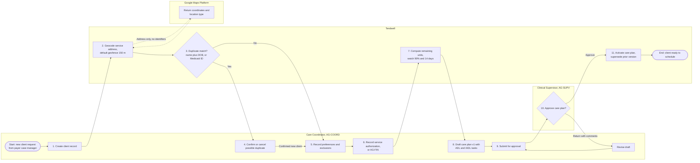
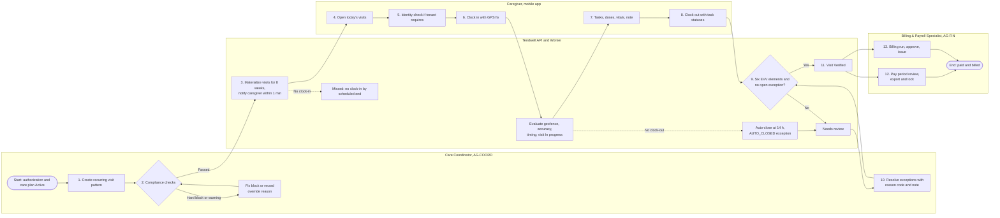
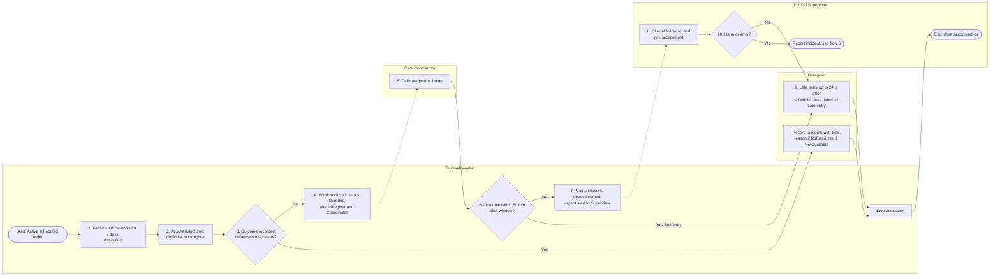
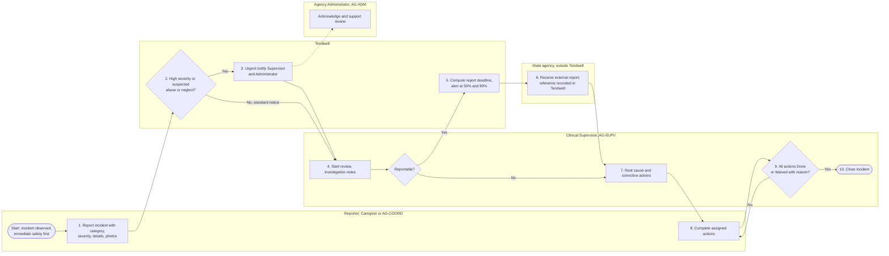
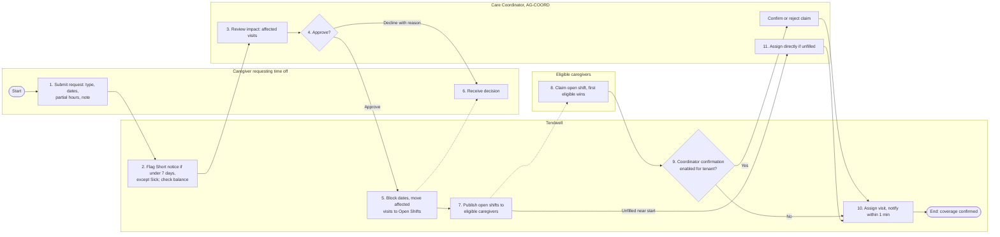
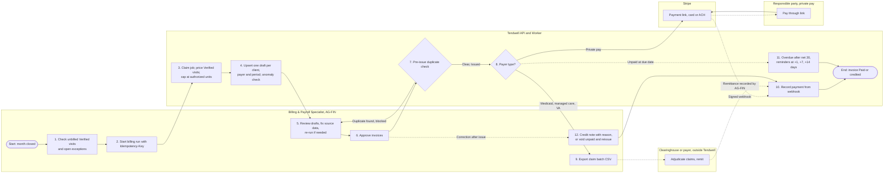

# Process Flows (To-Be)

## Document control

| Field | Value |
|---|---|
| Document ID | TW-DGM-01 |
| Version | 1.3 |
| Status | Approved |
| Owner | Business Analyst |
| Last updated | 2026-09-28 |
| Reviewers | Product Owner, Engineering Lead, Clinical SME (RN advisor), Customer Success Lead, QA Lead |

| Version | Date | Change |
|---|---|---|
| 1.0 | 2026-03-02 | Baseline with SRS v1.0 |
| 1.1 | 2026-04-17 | Open-shift confirmation option (CR-002) in flow 6 |
| 1.2 | 2026-06-12 | UAT clarifications: Read-only keeps the caregiver flow available; late entry labelling in flow 4 |
| 1.3 | 2026-09-28 | Low GPS accuracy branch (CR-004), pre-issue duplicate check (CR-005), send-time recipients (CR-006) |

### Purpose and scope

This document describes the seven end-to-end business processes of Tendwell Release 1 as BPMN-style swimlane flowcharts. Each lane is a role or system; numbered steps match the table under each diagram, which lists the actor, the rule or requirement that governs the step and the exceptions to handle. The flows are the to-be state; the as-is processes are in [current vs future state](../../01-discovery/current-vs-future-state.md).

Notation: rounded boxes are start and end events, rectangles are tasks, diamonds are gateways, and dotted arrows are messages or notifications. Lanes are drawn as Mermaid subgraphs, so the renderer may place them side by side rather than strictly stacked; the step numbers give the sequence.

Sample data comes from the shared [synthetic test data set](../../06-quality/test-data/README.md): tenant TEN-001 Harborview Home Care (America/New_York), caregivers Maya Ortiz (E-2041) and Rosa Delgado (E-2017), client C-10234 Harold Jennings. All data is fictional.

## Flow 1: Agency sign-up to activation

```mermaid
flowchart LR
  subgraph OWN["Agency owner, prospective AG-ADM"]
    s1(["Start: owner opens sign-up site"])
    a1["1. Select plan and service lines"]
    a2["2. Enter owner and agency legal details"]
    a3["3. Enter trial or promo code, optional"]
    a5["5. Accept terms and BAA, submit"]
    a7["7. Open verification link"]
    a10["10. First sign-in, enroll MFA"]
    a11["11. Work through setup checklist"]
    e1(["End: agency operational"])
  end
  subgraph SITE["Tendwell sign-up site"]
    b3{"Code valid for plan?"}
    b4{"Trial code applied?"}
  end
  subgraph API["Tendwell API and Worker"]
    c5["Create tenant Pending,<br/>owner Invited, EIN encrypted"]
    c7{"Link valid and unused?"}
    c8["8. Provision tenant defaults,<br/>idempotent"]
    c9["9. Activate: Trial plus Trialing,<br/>or Active plus Active"]
  end
  subgraph EXT["External services"]
    x4["4. Stripe hosted card form"]
    x6["6. SES sends verification email,<br/>link valid 24 h"]
  end

  s1 --> a1 --> a2 --> a3 --> b3
  b3 -->|"Yes, show price effect"| b4
  b3 -->|"No, show reason and fix"| a3
  b4 -->|"No"| x4 --> a5
  b4 -->|"Yes, no card needed"| a5
  a5 --> c5 --> x6
  x6 -.-> a7
  a7 --> c7
  c7 -->|"No, offer resend"| x6
  c7 -->|"Yes"| c8 --> c9 --> a10 --> a11 --> e1
```

*Figure 1. Self-service sign-up. Supports FR-ONB-01 to FR-ONB-06, BR-002, BR-004 and BR-006. Provisioning is idempotent and the tenant stays Pending until every step succeeds (US-001).*

| Step | Actor | Description | Rule / FR refs | Exceptions |
|---|---|---|---|---|
| 1 | Agency owner | Selects an Active plan (for example "Core") and one or more service lines from `GET /plans` | FR-ONB-01 | Retired plans are not offered (FR-ONB-08) |
| 2 | Agency owner | Enters name, email (for example tom.brennan@example.com), phone, legal name, EIN, registered address and time zone | FR-ONB-01, NFR-USE-03 | Field-level messages state the problem and the fix; an EIN that already has an Active or Trial tenant is routed to Customer Success without confirming the agency is a customer |
| 3 | Agency owner, sign-up site | Optionally enters a code; `POST /promo-codes/validate` checks existence, status, expiry, redemptions and plan eligibility and shows the price effect | FR-ONB-03, BR-004 | Invalid code: reason shown, owner may continue without a code; one code per subscription |
| 4 | Stripe | Without a trial code, a hosted card form collects the payment method; card data never reaches Tendwell | BR-002, NFR-SEC-01 | Card declined: owner may retry or apply a trial code |
| 5 | Agency owner, API | Accepts the terms and the BAA and submits `POST /signups`; the API creates the tenant (Pending) and the owner user (Invited) | FR-ONB-01, NFR-CMP-01 | Duplicate submission is idempotent through `Idempotency-Key` |
| 6 | Amazon SES | Sends a single-use verification link valid for 24 hours | FR-ONB-02 | Bounce: shown on the confirmation page with a "change email" option |
| 7 | Agency owner, API | Opens the link (`POST /signups/{signupId}/verify-email`) | FR-ONB-02 | Expired or used link: "This link has expired. We sent a new one to your email." |
| 8 | Worker | Provisions role templates, credential types, EVV reason codes, notification templates, escalation ladders and default settings in one idempotent job | FR-ONB-04, ADR-003 | Partial failure: job retries; tenant stays Pending and the owner sees a "finishing setup" message |
| 9 | API | Activates: with a trial code, tenant Trial and subscription Trialing for 21 days; otherwise tenant Active and subscription Active billed per active client seat | FR-ONB-06, BR-002 | First charge fails: subscription PastDue and the retry cycle starts |
| 10 | Agency owner | Signs in and enrolls a second factor (TOTP or SMS), mandatory for AG-ADM | FR-IAM-01, BR-006, BR-007 | Lockout after 5 failures for 15 min (FR-IAM-03) |
| 11 | Agency owner | Completes the setup checklist: location, service lines, payer, first caregiver, first client, first schedule | FR-ONB-05 | Checklist can be dismissed and resumed |
| After | System | Trial expiry or third failed payment retry starts a 7-day grace, then Read-only; the caregiver visit flow stays available | FR-ONB-07, BR-003 | See [state machines](state-machines.md), tenant and subscription |

## Flow 2: Client intake to authorization to care plan approval

*Figure 2. Intake through care plan activation. Supports FR-CLI-01 to FR-CLI-05 and FR-CLI-08, BR-009 to BR-012 and BR-017. Medication orders follow the same approve-before-active pattern (FR-MAR-01) and are omitted for readability.*

| Step | Actor | Description | Rule / FR refs | Exceptions |
|---|---|---|---|---|
| 1 | AG-COORD | Creates the client (`POST /clients`) with demographics, service address, contacts, primary language, allergies, ICD-10-CM diagnoses and payer; PHI fields are encrypted and masked | FR-CLI-01, BR-011 | Required field missing: inline message with the fix |
| 2 | Tendwell, Google Maps | Geocodes the address (address string only); stores latitude, longitude and the default 150 m geofence radius | BR-021 | Low-precision result (for example rural route): Coordinator places the pin on a map and confirms |
| 3 | Tendwell | Checks for a possible duplicate (same first name, last name and date of birth, or same Medicaid ID such as `ZZ48105522`) | FR-CLI-02 | Match found: go to step 4 |
| 4 | AG-COORD | Opens the existing record or confirms the new client is distinct, with a reason | FR-CLI-02 | Confirmation is audited |
| 5 | AG-COORD | Records preferred and excluded caregivers with reasons | FR-CLI-08, BR-017 | Exclusions become hard blocks in scheduling |
| 6 | AG-COORD or AG-FIN | Records the authorization (`POST /clients/{clientId}/authorizations`): payer, service line, service code (for example T1019), units, unit type, period, billing model, rate | FR-CLI-03, BR-009 | No Active authorization: visits cannot be scheduled (hard block) |
| 7 | Tendwell | Calculates remaining units (authorized minus scheduled minus delivered) and flags 90% or more utilization or expiry within 14 days | FR-CLI-04, BR-010 | Alert routed to AG-COORD and AG-FIN |
| 8 | AG-COORD | Drafts care plan version 1 (`POST /clients/{clientId}/care-plans`) with tasks by category and the visit-note requirement | FR-CLI-05 | Only one open draft per client |
| 9 | AG-COORD | Submits the draft; status PendingApproval; the Clinical Supervisor is notified | FR-CLI-05, FR-NTF-01 | Notification carries no PHI (BR-056) |
| 10 | AG-SUPV | Reviews tasks and instructions; approves or returns with comments | FR-CLI-05, BR-012 | Returned: status Draft, comments kept |
| 11 | Tendwell | `POST /care-plans/{carePlanId}/approve` makes the plan Active and the prior Active version Superseded in one transaction | BR-012 | Visits already in progress keep the version Active at their clock-in |

## Flow 3: End-to-end visit lifecycle

*Figure 3. Visit lifecycle from scheduling to pay and billing. Supports FR-SCH-01 to FR-SCH-07, FR-EVV-01 to FR-EVV-10, FR-PAY-02 to FR-PAY-05 and FR-BIL-01 to FR-BIL-04; BR-019, BR-021 to BR-028.*

| Step | Actor | Description | Rule / FR refs | Exceptions |
|---|---|---|---|---|
| 1 | AG-COORD | Creates a recurring pattern (`POST /visit-patterns`), for example Tue, Thu and Sat 08:00-10:00 for C-10234 with Maya Ortiz on authorization PA-2026-55871 (T1019) | FR-SCH-01 | Open-ended or with end date |
| 2 | Tendwell | Runs compliance checks: overlap, travel buffer, blocking credentials, exclusions, authorization coverage and remaining units, approved time off | FR-SCH-03, BR-009, BR-010, BR-014, BR-016, BR-017, BR-039 | Hard block stops the save; a units warning needs an override reason |
| 3 | Worker | Materializes visits nightly for a rolling 8 weeks; caregivers are notified of new, changed and cancelled visits within 1 minute | BR-018, FR-SCH-07 | Pattern edits change only future, not-started visits |
| 4 | Caregiver | Opens the app; today's visits come from the local cache when offline | NFR-USE-01, ADR-006 | Offline banner shows queued items |
| 5 | Caregiver | Completes the selfie check where the tenant requires it; a Pass is valid 90 s, single use | FR-EVV-04, BR-024 | Fail or vendor down: may proceed, IDENTITY_CHECK_FAILED |
| 6 | Caregiver, API | Clocks in from 15 min before start to scheduled end; server computes distance and evaluates accuracy and timing; visit In progress | FR-EVV-01, FR-EVV-02, BR-021, BR-022, BR-023 | LOCATION_MISMATCH, LOW_GPS_ACCURACY, LATE_START raised without blocking |
| 7 | Caregiver | Documents tasks, due doses, vitals and the visit note during the visit | FR-MAR-03, FR-MAR-07, FR-DOC-01 | See flow 4 for undocumented doses |
| 8 | Caregiver | Clocks out; each care-plan task needs Done or Not done with a reason; note required where the care plan says so | FR-EVV-06 | EARLY_END beyond 10 min tolerance |
| 9 | Tendwell | Checks the six EVV elements and open exceptions | FR-EVV-10, BR-020 | Open exception: Needs review |
| 10 | AG-COORD | Resolves or waives each exception; time corrections add a Manual punch with reason code and note | FR-EVV-08, BR-026 | Bulk resolve for same-code exceptions (CR-004) |
| 11 | Tendwell | Marks the visit Verified | FR-EVV-10, BR-028 | No clock-in by scheduled end: Missed; open 14 h: auto-closed and excluded until resolved (BR-027) |
| 12 | AG-FIN | Pay calculation, pre-export review, export and lock | FR-PAY-02 to FR-PAY-05 | Later changes become adjustment lines (FR-PAY-06) |
| 13 | AG-FIN | Billing run, draft review, approval and issue | FR-BIL-01 to FR-BIL-04 | See flow 7 |

## Flow 4: Missed-dose escalation (BR-030)

*Figure 4. Dose escalation ladder. Supports FR-MAR-02 to FR-MAR-04, FR-NTF-02 to FR-NTF-05 and BR-029 to BR-031, BR-053 to BR-056. Doses are never auto-cancelled; CR-007 (auto-cancel at midnight) was rejected for clinical-safety and audit reasons.*

Worked timing for an order scheduled at 08:00 with the default 60-minute window: window 07:00-09:00; Overdue alert at 09:00; Missed - undocumented and urgent alert at 10:00; late entry allowed until 08:00 the next day.

| Step | Actor | Description | Rule / FR refs | Exceptions |
|---|---|---|---|---|
| 1 | Worker | Generates dose tasks from Active scheduled orders for a rolling 7 days; window = scheduled time +/- 60 min unless the order sets 15-120 | FR-MAR-02, BR-029 | PRN orders do not generate tasks (FR-MAR-05) |
| 2 | Worker, notifications | At the scheduled time, sends a reminder to the caregiver on the visit covering the dose; generic text and deep link | BR-030, BR-056 | No caregiver on a visit at that time: the reminder goes to the Coordinator |
| 3 | Caregiver | Records Given, Refused, Held, Not available or Self-administered with administration time; reason required for Refused, Held, Not available | FR-MAR-03, BR-032 | Second consecutive Refused or Held for the order alerts the Supervisor (FR-MAR-06) |
| 4 | Worker | When the window closes undocumented, sets Overdue and alerts caregiver and Coordinator | BR-030 | Recipients resolved at send time from active users (BR-054) |
| 5 | AG-COORD | Contacts the caregiver or the home to confirm what happened | FR-NTF-03 | Caregiver offline: outcome may already be on the device (ADR-006) |
| 6 | Worker | Checks again 60 min after the window closed | BR-030 | Outcome arrives: escalation stops (FR-NTF-03) |
| 7 | Worker | Sets Missed - undocumented and sends an urgent alert to the Clinical Supervisor that bypasses quiet hours | FR-MAR-04, BR-053 | Delivery failure retries at 1, 4 and 16 min (BR-055) |
| 8 | AG-SUPV | Assesses clinical risk with the caregiver, client or prescriber | FR-MAR-04 | Out of hours: follows the agency on-call clinical policy |
| 9 | Caregiver | Records a late entry up to 24 h after the scheduled time; labelled Late entry | BR-031 | After 24 h only the Supervisor can annotate the dose |
| 10 | AG-SUPV | Decides whether a medication error with harm occurred | BR-036 | Yes: incident report with a 72 h external deadline |

## Flow 5: Client incident reporting and review

*Figure 5. Incident reporting with the reportable branch. Supports FR-DOC-03 to FR-DOC-06, BR-036, BR-037 and BR-053. Tendwell tracks deadlines and references; the agency submits the external report and remains responsible for meeting state requirements.*

| Step | Actor | Description | Rule / FR refs | Exceptions |
|---|---|---|---|---|
| 1 | Caregiver or AG-COORD | Records the incident (`POST /client-incidents`): category, severity, time, place, description, people involved, immediate actions, photos; status Reported | FR-DOC-03 | Offline: queued with photos (ADR-006) |
| 2 | Tendwell | Evaluates urgency | FR-DOC-04 | Medium or Low: standard in-app and email notice |
| 3 | Tendwell | Notifies the Clinical Supervisor and Agency Administrator immediately; urgent events bypass quiet hours; no PHI in SMS, push or email | FR-DOC-04, BR-053, BR-056 | Recipients resolved at send time (BR-054, INC-2026-015) |
| 4 | AG-SUPV | Starts the review (status UnderReview) and records investigation notes | FR-DOC-05 | Only AG-SUPV can move past review |
| 5 | Tendwell | For reportable incidents, sets `report_deadline_at` from `occurred_at`: suspected abuse or neglect 24 h; serious injury (Fall or Injury with High severity) 24 h; medication error with harm (MedicationError with Medium or High severity) 72 h, per SRS TBD-08 and tenant-configurable to state rules; alerts at 50% and 90% | FR-DOC-06, BR-036 | Deadline passed: alert escalates to AG-ADM |
| 6 | AG-SUPV or AG-ADM | Submits the report to the state agency outside Tendwell and records the external reference | FR-DOC-05 | Missing reference shows a warning on close |
| 7 | AG-SUPV | Records root cause and corrective actions with owner and due date (`POST /client-incidents/{incidentId}/actions`); status ActionsOpen | FR-DOC-05 | Actions can be added until close |
| 8 | Action owners | Complete actions, or the Supervisor waives an action with a reason | BR-037 | Overdue actions appear on the dashboard |
| 9 | Tendwell | Checks that every action is Done or Waived | BR-037 | Open action blocks close with a message naming it |
| 10 | AG-SUPV | Closes the incident (`POST /client-incidents/{incidentId}/close`) | FR-DOC-05, BR-037 | Only a Clinical Supervisor can close |

## Flow 6: Time-off request and approval with visit reassignment

*Figure 6. Time off with reassignment through Open Shifts. Supports FR-TOF-01 to FR-TOF-04, FR-SCH-05, FR-SCH-07, BR-038, BR-039 and BR-040; CR-002 added the optional Coordinator confirmation.*

| Step | Actor | Description | Rule / FR refs | Exceptions |
|---|---|---|---|---|
| 1 | Caregiver | Submits `POST /time-off-requests` with leave type (PTO, Sick, Unpaid, Bereavement), dates, optional partial-day hours and note | FR-TOF-01 | Overlapping pending request: message with a link to it |
| 2 | Tendwell | Flags Short notice when under 7 days (Sick exempt); shows PTO balance against requested hours | FR-TOF-02, FR-TOF-04, BR-038, BR-040 | Insufficient PTO balance: shown to approver as a warning |
| 3 | AG-COORD | Opens the impact view (`GET /time-off-requests/{requestId}/impact`) listing affected visits, clients and authorizations | FR-TOF-03 | Coordinator scope limited to assigned locations (FR-IAM-06) |
| 4 | AG-COORD | Decides (`POST /time-off-requests/{requestId}/decision`) | FR-TOF-03 | Decline requires a reason |
| 5 | Tendwell | On approval, blocks the dates for scheduling (hard block) and moves already-assigned visits to Open Shifts | BR-039 | Visits already in progress are not moved |
| 6 | Caregiver | Receives the decision in-app and by push with generic text | FR-NTF-01, BR-056 | Quiet hours hold non-urgent notices (BR-053) |
| 7 | Tendwell | Publishes open shifts to caregivers who pass compliance checks | FR-SCH-05, BR-014, BR-016, BR-017 | Excluded or credential-blocked caregivers do not see the shift |
| 8 | Eligible caregiver | Claims a shift (`POST /visits/{visitId}/claim`); the first eligible claim wins | FR-SCH-05 | Second claimant sees "This shift was just taken." |
| 9 | Tendwell | Applies the tenant's confirmation setting | CR-002 | Rejected claim returns the shift to Open Shifts |
| 10 | Tendwell | Assigns the visit and notifies the caregiver within 1 minute | FR-SCH-07 | |
| 11 | AG-COORD | Assigns directly from the schedule board when a shift stays unfilled near its start | FR-SCH-06 | Compliance checks still apply |

## Flow 7: Monthly billing, collections and credit notes

*Figure 7. Monthly billing and collections. Supports FR-BIL-01 to FR-BIL-08, BR-047 to BR-052 and NFR-OBS-02. Idempotent runs and the pre-issue check implement CR-005 after INC-2026-007.*

Worked example (US-045): client C-10234 on T1019 at $7.25 per 15-minute unit; visits of 127, 113 and 120 minutes give 8 + 8 + 8 = 24 units = $174.00. If only 20 units remain on the authorization, 20 units ($145.00) are billed and 4 units appear as "Not billable - exceeds authorization".

| Step | Actor | Description | Rule / FR refs | Exceptions |
|---|---|---|---|---|
| 1 | AG-FIN | Reviews unbilled Verified visits and open exceptions on the dashboard | FR-RPT-01, BR-028 | Unverified visits are not billed |
| 2 | AG-FIN | Starts `POST /billing-runs` for the period with an `Idempotency-Key` | FR-BIL-01 | A run already in progress for the period is returned instead of a second run |
| 3 | Worker | Claims the job in `job_executions`; prices each Verified visit by its authorization's billing model; caps units at the remaining authorization | FR-BIL-02, FR-BIL-03, BR-047, BR-048, BR-049 | Excess shown as "Not billable - exceeds authorization" |
| 4 | Worker | Upserts one Draft per tenant, client, payer and period; compares invoice count with the previous run | BR-050, NFR-OBS-02 | Deviation over 20%: alert and auto-issue paused |
| 5 | AG-FIN | Reviews drafts; corrects source data (for example resolves exceptions) and re-runs; re-runs update Drafts only | BR-050 | Approved or Issued invoices are skipped |
| 6 | AG-FIN | Approves invoices (`POST /invoices/{invoiceId}/approve`) | FR-BIL-04 | |
| 7 | Tendwell | Before issue, checks for another non-void invoice for the same client and payer with an overlapping period | CR-005 | Blocked with both invoice numbers named |
| 8 | Tendwell, Stripe | Issues (`POST /invoices/{invoiceId}/issue`); private pay gets a payment link (`POST /invoices/{invoiceId}/payment-links`); the email carries invoice number, amount, due date and link only, with the itemized invoice behind a verification step (SRS TBD-13) | FR-BIL-05, BR-051, BR-056 | Issued invoices are immutable |
| 9 | AG-FIN | Exports the claim batch CSV (`POST /claim-batches`) for the clearinghouse | FR-BIL-06, BR-058 | Export watermarked and audited |
| 10 | Tendwell | Records Stripe payments from signature-verified webhooks; payer remittances and checks are entered by AG-FIN | FR-BIL-05 | Manual payment entry endpoint to be confirmed in the API contract |
| 11 | Worker | Marks invoices Overdue after the due date (net 30) and sends reminders at +1, +7 and +14 days | FR-BIL-08, BR-052 | Reminders stop when the balance reaches zero |
| 12 | AG-FIN | Issues a credit note with reason (`POST /invoices/{invoiceId}/credit-notes`) or voids an unpaid invoice and reissues | FR-BIL-07, BR-051 | Void is not allowed once any payment is recorded |

## Related documents

- [State machines](state-machines.md)
- [Sequence diagrams](sequence-diagrams.md)
- [Data flow diagram](data-flow-diagram.md)
- [Wireframes](../wireframes/README.md)
- [Current vs future state](../../01-discovery/current-vs-future-state.md)
- [Software Requirements Specification](../../02-requirements/SRS.md)
- [Business rules](../../02-requirements/business-rules.md)
- [Story map](../../05-delivery/story-map.md)
- [ADR-003 Single-flight scheduled jobs](../architecture/adr/ADR-003-single-flight-scheduled-jobs.md)
