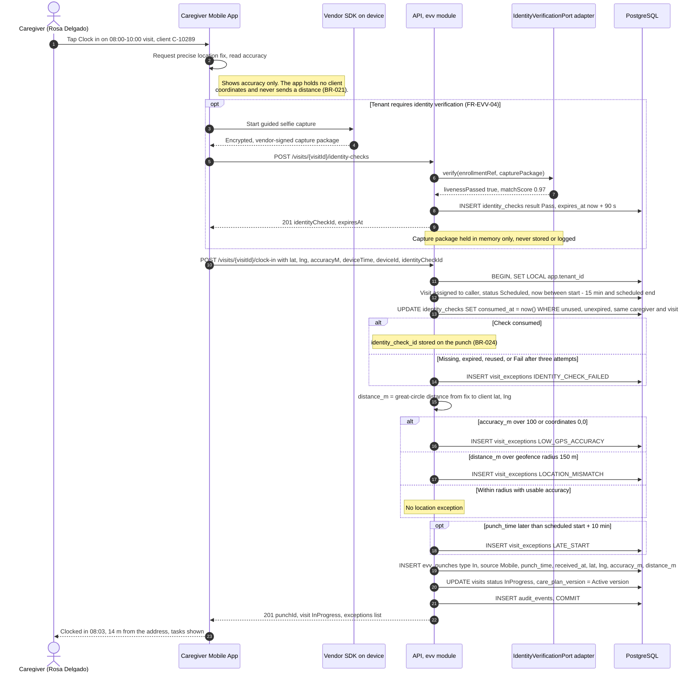
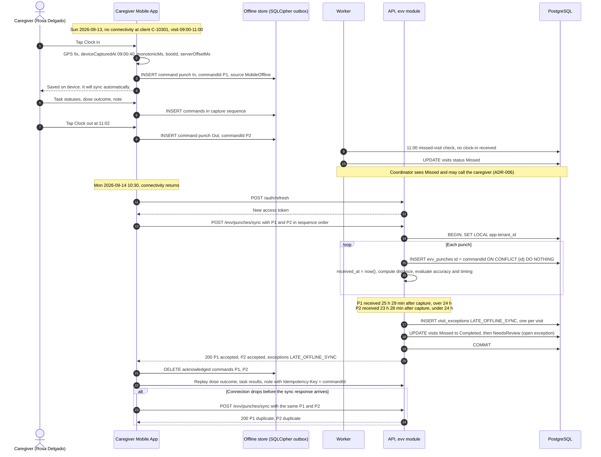
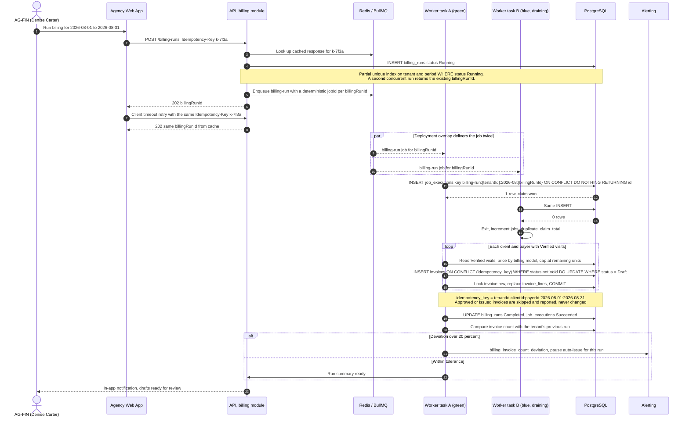
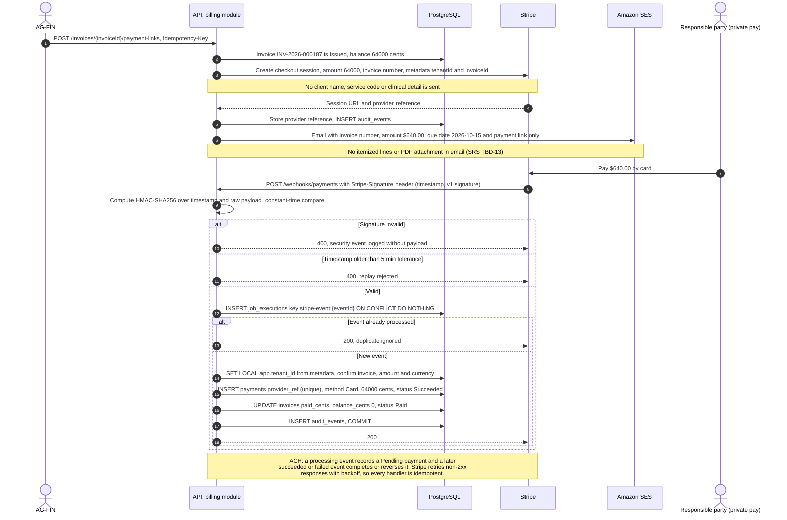
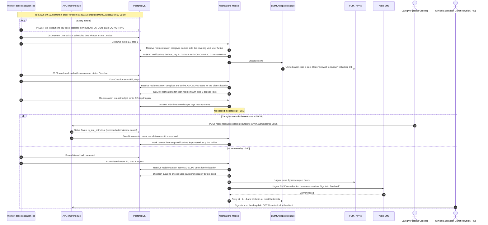
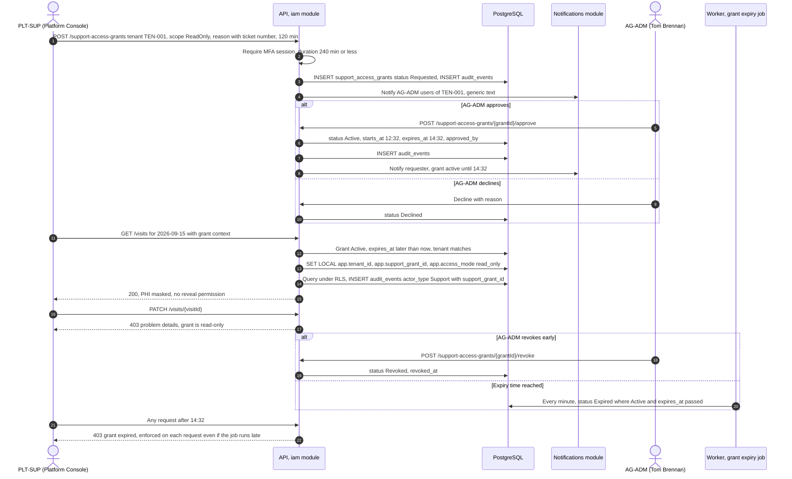
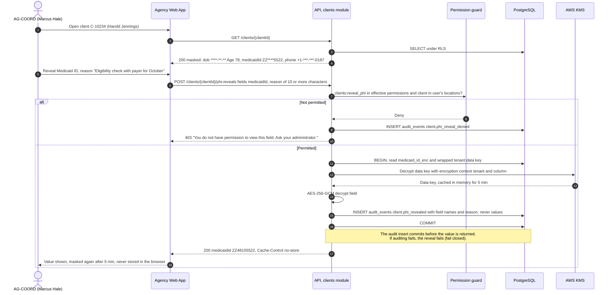

# Sequence Diagrams

## Document control

| Field | Value |
|---|---|
| Document ID | TW-DGM-02 |
| Version | 1.3 |
| Status | Approved |
| Owner | Business Analyst |
| Last updated | 2026-09-28 |
| Reviewers | Engineering Lead, QA Lead, Compliance and Privacy Officer |

| Version | Date | Change |
|---|---|---|
| 1.0 | 2026-03-02 | Baseline with SRS v1.0 |
| 1.2 | 2026-07-28 | Billing run rewritten for job claims and invoice unique key (ADR-003, INC-2026-007) |
| 1.3 | 2026-09-28 | Low GPS accuracy evaluated before mismatch (CR-004); send-time recipient resolution and dispatch guard (CR-006) |

### Purpose and scope

These sequence diagrams show how containers and modules collaborate for the seven interactions where ordering, idempotency or security matters most. They complement the [process flows](process-flows.md) (who does what) and the [state machines](state-machines.md) (which states change). Endpoint names follow the [OpenAPI specification](../../04-api/openapi.yaml); request and response bodies are abbreviated. Times are America/New_York unless marked UTC. All data is fictional.

## 1. Clock-in with identity check and geofence evaluation

*Figure 1. Online clock-in. Supports FR-EVV-01 to FR-EVV-04, FR-EVV-07, BR-021 to BR-024 and NFR-PERF-02 (2 s p95 round trip, 4 s p95 identity check). The punch is never blocked by location or identity results (FR-EVV-03); accuracy is evaluated before distance so an imprecise fix cannot create a false mismatch (CR-004, INC-2026-011).*

Geofence evaluation with the canonical examples (radius 150 m, accuracy threshold 100 m):

| Distance (server-computed) | Reported accuracy | Evaluation | Result |
|---|---|---|---|
| 212 m | 18 m | Accuracy usable; 212 m is over 150 m | LOCATION_MISMATCH |
| 95 m | 3,400 m | Accuracy worse than 100 m, so distance is not trusted | LOW_GPS_ACCURACY (not mismatch) |
| 40 m | 12 m | Accuracy usable; within radius | No exception |

## 2. Offline punch capture and later sync, including Late offline sync

*Figure 2. Offline capture and sync. Supports FR-EVV-05, FR-EVV-07, BR-019, BR-025 and NFR-AVL-02. `punch_time` keeps the device capture time and `received_at` the server receipt time; the 24-hour test applies per punch, the exception is raised once per visit.*

## 3. Idempotent billing run

*Figure 3. Billing run safe under retries and overlapping Workers. Supports FR-BIL-01 to FR-BIL-03, BR-047 to BR-050, NFR-MNT-02 and NFR-OBS-02. This is the design adopted in ADR-003 after INC-2026-007 and baselined through CR-005.*

## 4. Payment link and Stripe webhook

*Figure 4. Private-pay collection. Supports FR-BIL-05, BR-051, BR-052 and BR-056. Signature verification and the time tolerance stop forged and replayed events; the `job_executions` claim and the unique `payments.provider_ref` stop double recording.*

## 5. Missed-dose escalation job and notification dedupe

*Figure 5. Dose escalation ladder with dedupe. Supports FR-MAR-04, FR-NTF-02 to FR-NTF-05, BR-030, BR-031, BR-053 to BR-056. Recipients are resolved at send time and re-checked by the dispatch guard (CR-006, INC-2026-015); message bodies carry no client name, drug or diagnosis.*

## 6. Support access grant: request, approve and auto-expire

*Figure 6. Time-boxed support access. Supports FR-IAM-07, BR-008 and BR-057, NFR-PRIV-02. Expiry is enforced on every request; the job only updates the status for reporting.*

## 7. PHI reveal with audit

*Figure 7. Masked-by-default PHI with audited reveal. Supports FR-CLI-06, FR-RPT-03, BR-005, BR-011, BR-057, NFR-PRIV-01 and NFR-PRIV-02.*

## Related documents

- [Process flows](process-flows.md)
- [State machines](state-machines.md)
- [Data flow diagram](data-flow-diagram.md)
- [System context and containers](../architecture/system-context-and-containers.md)
- [ADR-002 Append-only EVV punch ledger](../architecture/adr/ADR-002-append-only-evv-punch-ledger.md)
- [ADR-003 Single-flight scheduled jobs](../architecture/adr/ADR-003-single-flight-scheduled-jobs.md)
- [ADR-004 Identity verification vendor adapter](../architecture/adr/ADR-004-identity-verification-vendor-adapter.md)
- [ADR-006 Offline-first caregiver app](../architecture/adr/ADR-006-offline-first-caregiver-app.md)
- [Events and webhooks](../../04-api/events-and-webhooks.md)
- [API guidelines](../../04-api/api-guidelines.md)
