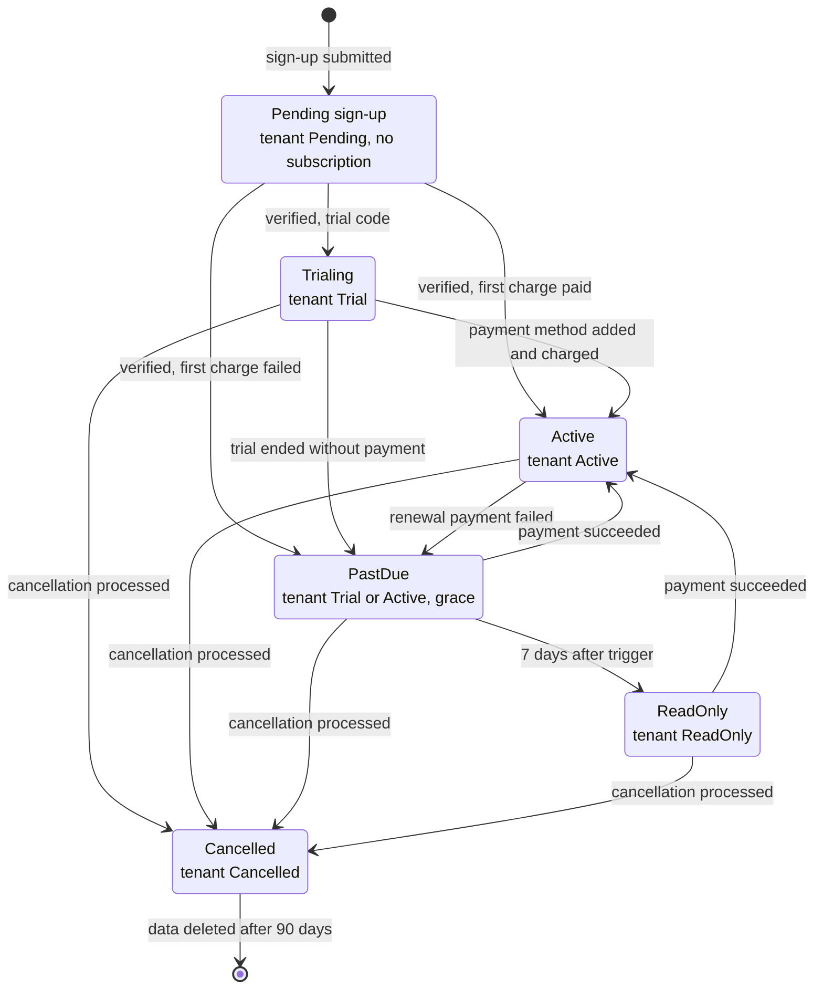
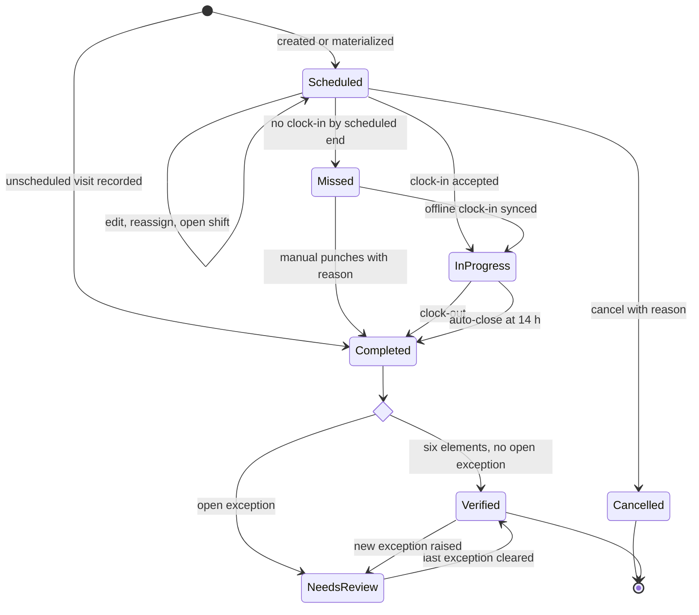
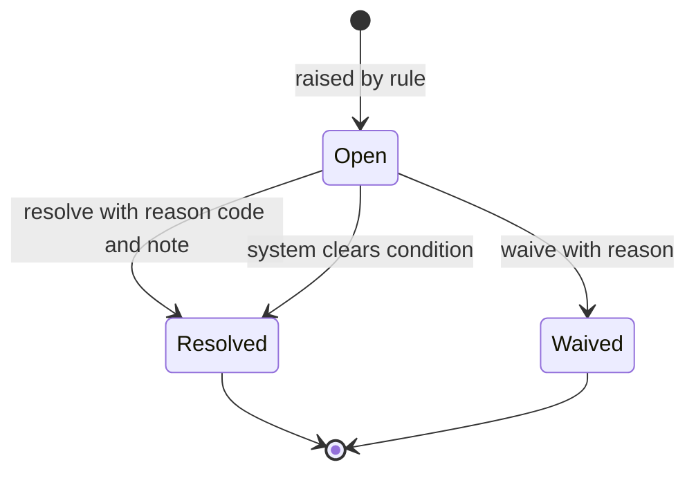
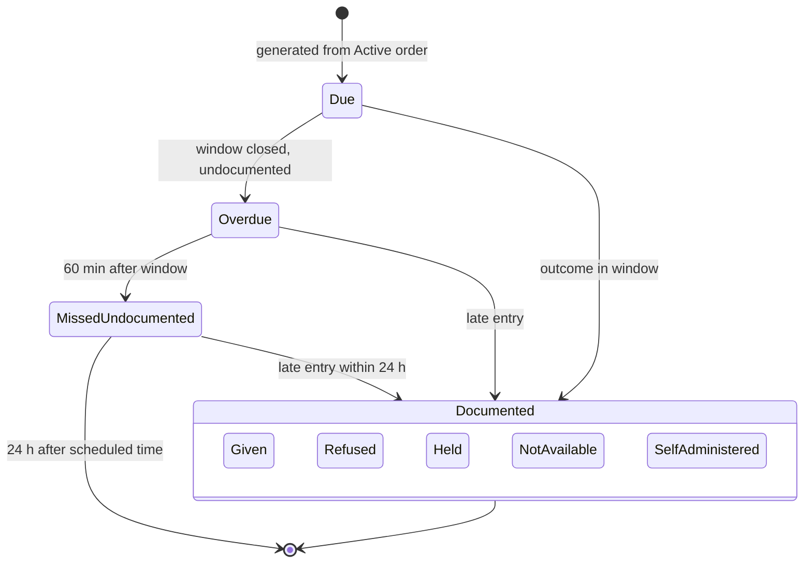
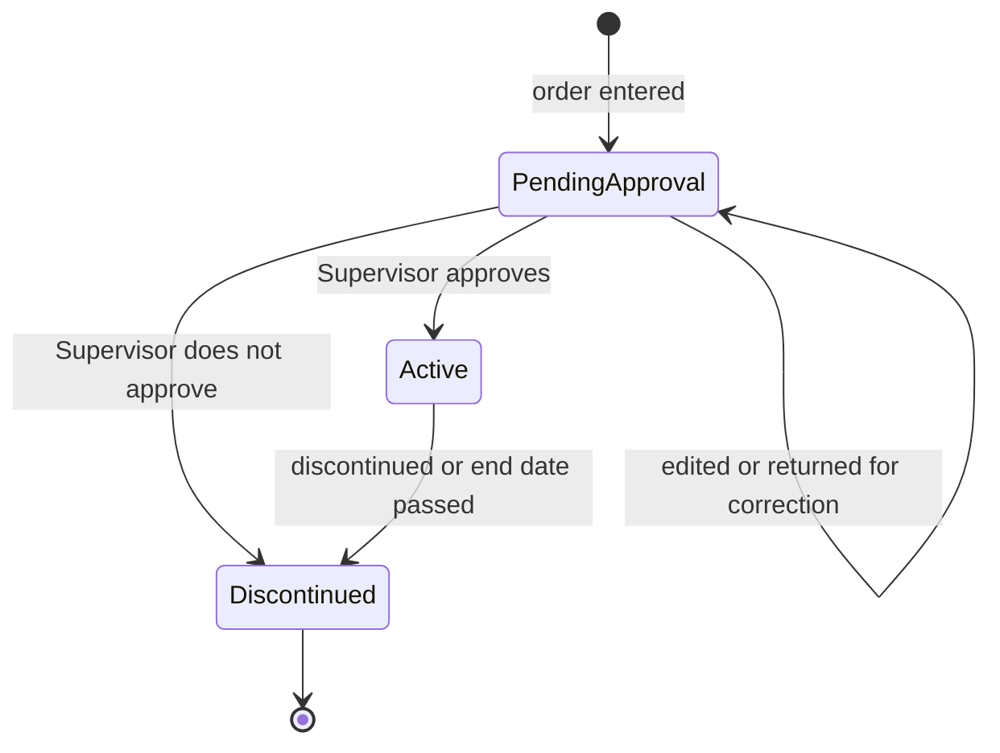
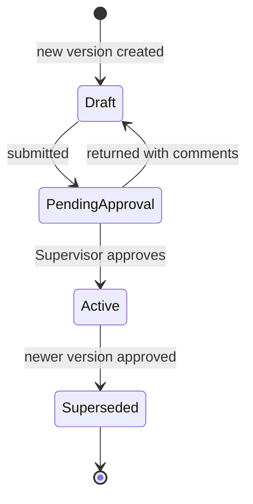
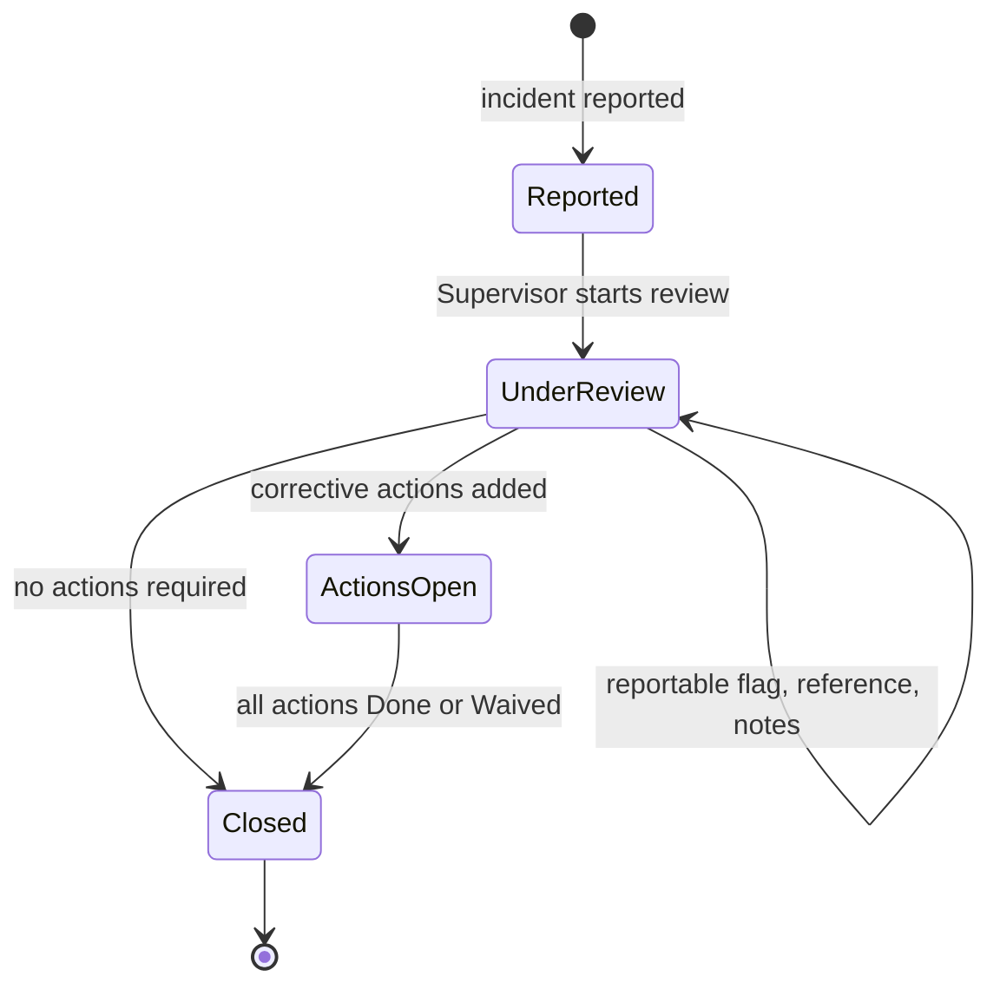
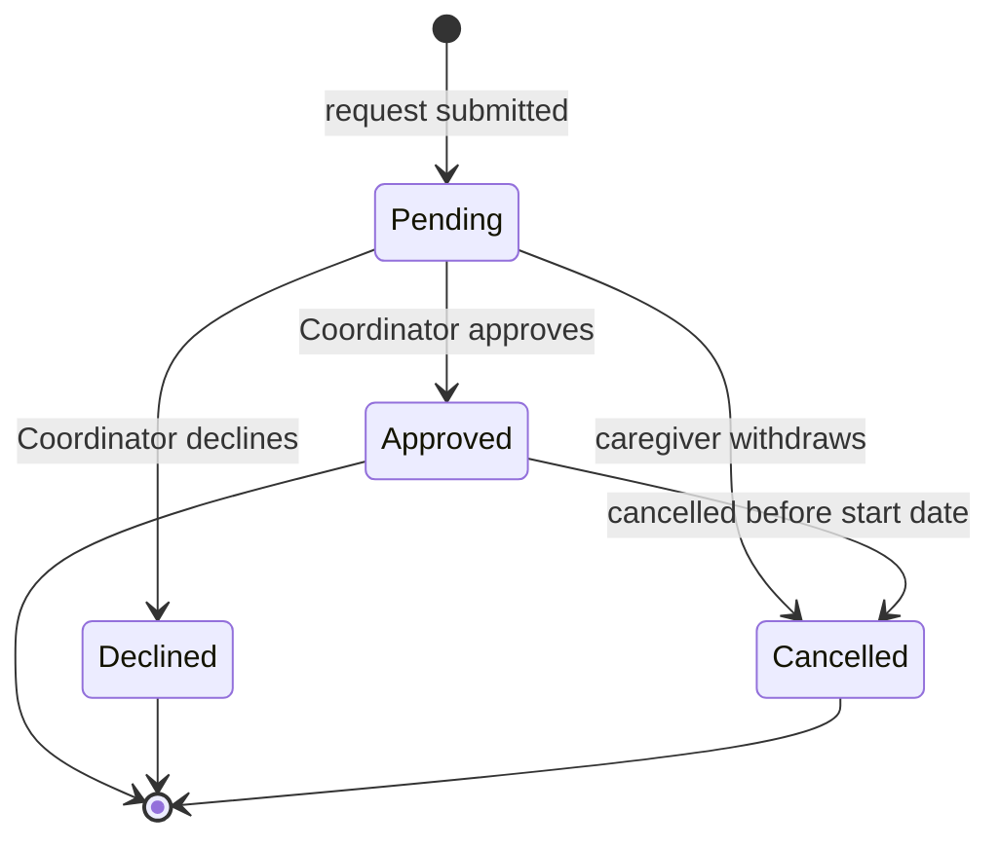
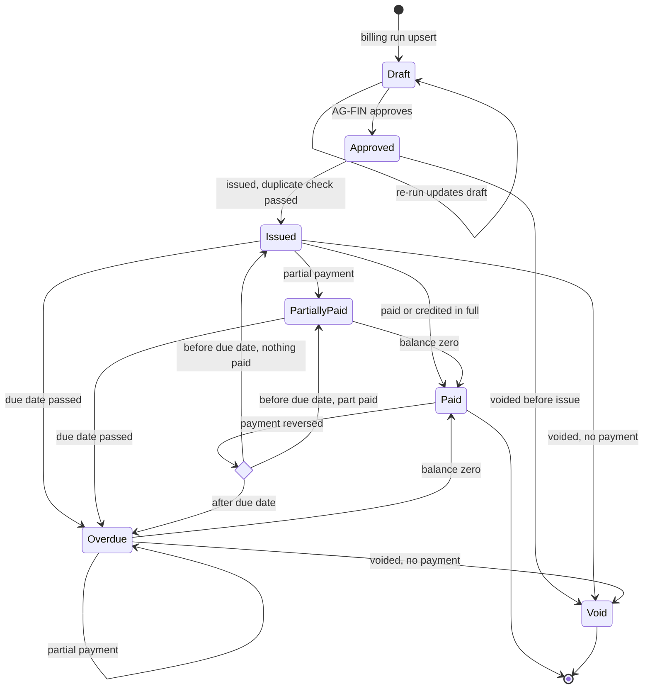
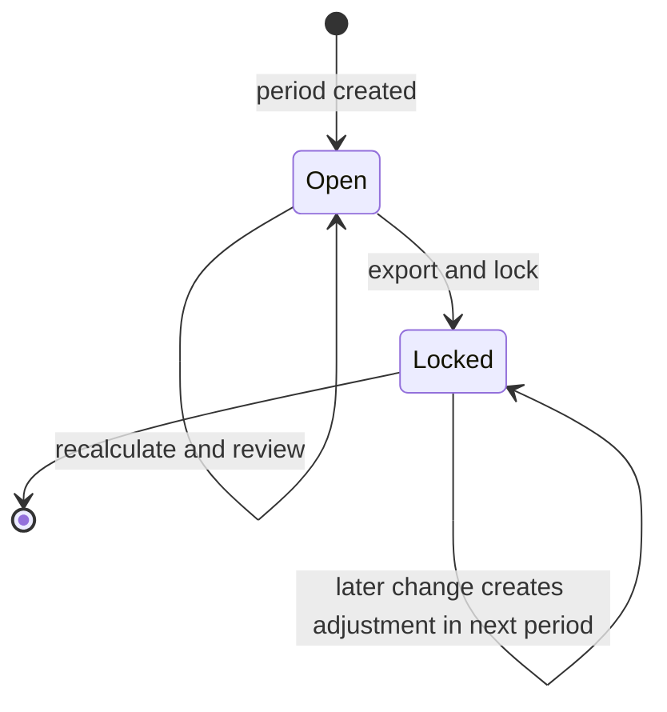

# State Machines

## Document control

| Field | Value |
|---|---|
| Document ID | TW-DGM-03 |
| Version | 1.3 |
| Status | Approved |
| Owner | Business Analyst |
| Last updated | 2026-09-28 |
| Reviewers | Engineering Lead, QA Lead, Clinical SME (RN advisor), Product Owner |

| Version | Date | Change |
|---|---|---|
| 1.0 | 2026-03-02 | Baseline with SRS v1.0 |
| 1.2 | 2026-06-12 | UAT clarifications: Missed visits reopened by offline sync; Late entry labelling |
| 1.3 | 2026-09-28 | LOW_GPS_ACCURACY raise rule (CR-004); pre-issue duplicate check (CR-005) |

### Purpose and scope

This document defines the lifecycle of the ten entities whose status drives business rules: tenant and subscription, visit, visit exception, dose task, medication order, care plan, client incident, time-off request, invoice and pay period. State names match the status enumerations in the [data dictionary](../data/data-dictionary.md). Each diagram is followed by a transition table (from, event, guard, to, side effects, FR/BR refs) that QA uses to derive state-transition test cases (ISO/IEC/IEEE 29119-3 technique). Any transition not listed is invalid and the API rejects it with a 409 problem details response.

## 1. Tenant and subscription

*Figure 1. Subscription states with the matching tenant status. Supports FR-ONB-02, FR-ONB-04, FR-ONB-06, FR-ONB-07, BR-002 and BR-003.*

| From | Event | Guard | To | Side effects | Refs |
|---|---|---|---|---|---|
| (start) | `POST /signups` | Valid form; EIN not already on an Active or Trial tenant | Pending | Tenant Pending, owner Invited, verification email (24 h link) | FR-ONB-01, FR-ONB-02 |
| Pending | Email verified and provisioning complete | Trial code applied | Trialing | Tenant Trial; trial ends 21 days after activation; defaults provisioned | FR-ONB-04, BR-002 |
| Pending | Email verified and provisioning complete | Payment method on file; first charge succeeded | Active | Tenant Active; seat billing monthly in advance | FR-ONB-06 |
| Pending | Email verified | First charge failed | PastDue | Tenant Active; payment retries start | FR-ONB-07 |
| Trialing | Payment method added | Charge succeeded | Active | Tenant Active; trial banner removed | FR-ONB-06 |
| Trialing | Trial end date reached | No payment method | PastDue | Tenant stays Trial; banner and email give the Read-only date | FR-ONB-07, BR-003 |
| Active | Renewal or proration charge failed | None | PastDue | Tenant stays Active; payment provider retries | FR-ONB-07 |
| PastDue | Payment succeeded (webhook) | None | Active | Tenant Active within 5 min | FR-ONB-07 |
| PastDue | Lifecycle job | 7 days after trial expiry, or 7 days after the third failed retry | ReadOnly | Tenant ReadOnly; office users can view and export only; the caregiver visit flow stays available; one notice per AG-ADM | BR-003, ADR-003 |
| ReadOnly | Payment succeeded (webhook) | None | Active | Tenant Active; Read-only banner removed | FR-ONB-07 |
| Any except Cancelled | Cancellation processed by Customer Success (manual in R1) | Written request from AG-ADM or platform decision | Cancelled | Tenant Cancelled; full export offered; deletion scheduled at 90 days | NFR-PRIV-03 |
| Cancelled | Retention period ends | 90 days after cancellation | (end) | Primary data deleted; backups expire 35 days later; audit events kept 7 years with PHI values removed; deletion certificate states this (TBD-17) | NFR-PRIV-03, BR-057 |

## 2. Visit

*Figure 2. Visit lifecycle. Supports FR-SCH-01 to FR-SCH-05, FR-EVV-01, FR-EVV-05, FR-EVV-06, FR-EVV-09, FR-EVV-10, BR-019, BR-027 and BR-028. "Missed" can be reopened when offline punches arrive, because the server cannot know about punches still on a device (ADR-006).*

| From | Event | Guard | To | Side effects | Refs |
|---|---|---|---|---|---|
| (start) | Pattern materialized or `POST /visits` | Compliance checks pass; warnings carry an override reason | Scheduled | Units counted as scheduled; caregiver notified within 1 min | FR-SCH-01, FR-SCH-02, FR-SCH-03, FR-SCH-07, BR-009, BR-010, BR-018 |
| (start) | Punches for a cancelled or reassigned visit, or a Coordinator records care after the fact | Client has an Active authorization for the service line | Completed | New visit; UNSCHEDULED_VISIT raised | FR-EVV-07 |
| Scheduled | `PATCH /visits/{visitId}` (time, caregiver) | Not started; checks pass | Scheduled | Old and new caregiver notified | FR-SCH-04, FR-SCH-07 |
| Scheduled | Caregiver deactivated or time off approved | None | Scheduled | `is_open_shift` true, caregiver cleared, published to Open Shifts | FR-WRK-06, BR-039, FR-SCH-05 |
| Scheduled | `POST /visits/{visitId}/clock-in` or synced offline punch | Assigned caregiver; punch time from 15 min before start to scheduled end | InProgress | Active care plan version fixed on the visit; location, accuracy, timing and identity exceptions evaluated | FR-EVV-01, FR-EVV-02, BR-012, BR-021 to BR-024 |
| Scheduled | `POST /visits/{visitId}/cancel` or client discharge | Not started; reason code | Cancelled | Units released; caregiver notified | FR-SCH-04, FR-CLI-07 |
| Scheduled | Missed-visit check | Scheduled end passed, no clock-in received | Missed | Coordinator alerted; units released | BR-019 |
| Missed | Offline clock-in synced | Capture time inside the clock-in window | InProgress | Normal evaluation; LATE_OFFLINE_SYNC if received over 24 h after capture | BR-025, ADR-006 |
| Missed | Coordinator records Manual punches | Reason code and note | Completed | Manual punches appended | FR-EVV-08, BR-026 |
| InProgress | `POST /visits/{visitId}/clock-out` | Every care-plan task Done or Not done with reason; note present where required | Completed | EARLY_END evaluated; note lock at clock-out + 24 h | FR-EVV-06, BR-023, BR-035 |
| InProgress | Auto-close job | 14 h after clock-in, no clock-out | Completed | System placeholder Out punch at scheduled end; AUTO_CLOSED raised; excluded from pay and billing | FR-EVV-09, BR-027 |
| Completed | Verification evaluation | Six EVV elements present and no open exception | Verified | Eligible for payroll and billing | FR-EVV-10, BR-020, BR-028 |
| Completed | Verification evaluation | Any open exception | NeedsReview | Listed in the exception queue | BR-019 |
| NeedsReview | Last open exception Resolved or Waived | Six elements present | Verified | As above | FR-EVV-08 |
| Verified | New exception raised (for example a late device punch) | None | NeedsReview | Removed from unbilled and unpaid totals until re-verified | FR-EVV-07 |
| Verified | Time correction with no new exception | Reason code and note | Verified | Pay and billing recalculated; locked period gets adjustment lines; issued invoice needs a credit note | BR-026, FR-PAY-06, BR-046, BR-051 |

## 3. Visit exception

*Figure 3. Visit exception lifecycle. Supports FR-EVV-07, FR-EVV-08 and BR-022 to BR-027. Exceptions are never reopened; a new occurrence raises a new exception so history stays intact.*

| From | Event | Guard | To | Side effects | Refs |
|---|---|---|---|---|---|
| (start) | Rule fires (see raise table) | No other Open exception with the same code on the visit | Open | Visit to NeedsReview when Completed; exception-rate metric updated | FR-EVV-07, NFR-OBS-02 |
| Open | `POST /visit-exceptions/{exceptionId}/resolve` | AG-COORD; reason code from the tenant list; note | Resolved | `resolved_by`, `resolved_at`; optional time correction appends a Manual punch | FR-EVV-08, BR-026 |
| Open | Bulk resolve | Code is LOW_GPS_ACCURACY, or IDENTITY_CHECK_FAILED with reason vendor unavailable; one reason code and note | Resolved | One audit event per exception | FR-EVV-08, CR-004, INC-2026-011 |
| Open | Condition cleared by the system | MISSING_CLOCK_OUT and a clock-out punch arrives, or auto-close replaces it | Resolved | Resolution reason recorded as system | FR-EVV-09 |
| Open | Waive | AG-COORD; reason; not allowed for AUTO_CLOSED or MISSING_CLOCK_OUT, which need a confirmed end time | Waived | Visit can verify with the punch as recorded | FR-EVV-08 |

Raise conditions:

| Code | Raised when | Raised by | Typical resolution |
|---|---|---|---|
| LATE_START | Clock-in `punch_time` more than 10 min after scheduled start | Clock-in evaluation | Reason code (for example client requested later start) or time correction |
| EARLY_END | Clock-out `punch_time` more than 10 min before scheduled end | Clock-out evaluation | Reason code (for example client requested early finish) |
| LOCATION_MISMATCH | Accuracy 100 m or better and server-computed distance over the geofence radius (default 150 m) | Punch evaluation | Confirm location (for example community outing in the care plan) or correct the address pin |
| LOW_GPS_ACCURACY | Accuracy worse than 100 m, or coordinates (0,0) | Punch evaluation | Confirm with caregiver; bulk resolve with reason "approximate location setting" |
| MISSING_CLOCK_OUT | Visit still In progress 10 min after scheduled end (SRS TBD-01) | Open-visit monitor | Cleared automatically by a device clock-out; otherwise superseded by AUTO_CLOSED |
| UNSCHEDULED_VISIT | A visit is created at or after its scheduled start: started by a caregiver from the app as an unscheduled visit, back-entered by a Coordinator with Manual punches (SRS TBD-02), or created for synced punches whose visit was cancelled or reassigned (ADR-006) | Visit creation | Confirm authorization and service |
| LATE_OFFLINE_SYNC | A punch is received more than 24 h after `punch_time` | Offline sync | Confirm with caregiver; resolve with reason |
| AUTO_CLOSED | No clock-out 14 h after clock-in | Auto-close job | Confirm or correct the clock-out (Resolve only) |
| IDENTITY_CHECK_FAILED | Tenant requires identity verification and the punch has no consumed Pass check: three failed attempts, vendor unavailable, or a failed or missing match at offline sync (SRS TBD-03) | Punch evaluation or sync | Confirm identity with the caregiver; escalate under HR policy |

## 4. Dose task

*Figure 4. Dose task lifecycle. Supports FR-MAR-02 to FR-MAR-04, FR-MAR-06, BR-029 to BR-032 and BR-053. Doses are never auto-cancelled or deleted; CR-007 was rejected.*

| From | Event | Guard | To | Side effects | Refs |
|---|---|---|---|---|---|
| (start) | Dose generation job | Order Active and scheduled (not PRN); scheduled time within the next 7 days | Due | `window_start` and `window_end` = scheduled time -/+ window (default 60 min) | FR-MAR-02, BR-029 |
| Due | Scheduled time reached | None | Due | Step 1 reminder to the caregiver | BR-030 |
| Due | `POST /dose-tasks/{doseTaskId}/outcome` | Recorder is on a visit for the client; reason given for Refused, Held, Not available | Given, Refused, Held, NotAvailable or SelfAdministered | `administered_at`, `recorded_by`; second consecutive Refused or Held for the order alerts AG-SUPV | FR-MAR-03, FR-MAR-06, BR-032 |
| Due | Window closes | No outcome | Overdue | Step 2 alert to caregiver and Coordinator | BR-030 |
| Overdue | Outcome recorded | Within 24 h of scheduled time | Documented outcome | `is_late_entry` true; escalation stops | BR-031, FR-NTF-03 |
| Overdue | 60 min after window closes | No outcome | MissedUndocumented | Step 3 urgent alert to AG-SUPV, bypasses quiet hours | FR-MAR-04, BR-030, BR-053 |
| MissedUndocumented | Outcome recorded | Within 24 h of scheduled time | Documented outcome | `is_late_entry` true; AG-SUPV informed | BR-031 |
| MissedUndocumented | 24 h after scheduled time | None | MissedUndocumented (final) | Only AG-SUPV can annotate; annotation audited | BR-031, BR-057 |
| Overdue or MissedUndocumented | Offline outcome synced | Device capture time inside the window | Documented outcome | `is_late_entry` false; receipt time visible; escalation stops | BR-025, ADR-006 |

Discontinued orders and discharged clients follow the SRS working assumption TBD-06: future Due tasks whose window has not opened are not generated, or are removed with an audit event; tasks whose window has opened are kept and follow BR-030 and BR-031. The status list has no terminal value for voided doses, which TBD-06 tracks for a decision by the Clinical SME (RN advisor).

## 5. Medication order

*Figure 5. Medication order lifecycle. Supports FR-MAR-01, FR-MAR-02 and FR-MAR-05. An Active order is never edited in place; a change is a discontinuation plus a new order, which keeps the MAR history exact.*

| From | Event | Guard | To | Side effects | Refs |
|---|---|---|---|---|---|
| (start) | `POST /clients/{clientId}/medication-orders` | AG-COORD or AG-SUPV; drug, strength, form, dose, route, schedule or PRN details, start date, prescriber | PendingApproval | AG-SUPV notified (no PHI in notification) | FR-MAR-01, BR-056 |
| PendingApproval | Edit, or Supervisor returns with comments | Not yet approved | PendingApproval | Comment history kept | FR-MAR-01 |
| PendingApproval | `POST /medication-orders/{orderId}/approve` | Actor AG-SUPV; PRN orders have indication, maximum per 24 h and minimum interval | Active | `approved_by` set; dose generation starts for scheduled orders | FR-MAR-01, FR-MAR-02, FR-MAR-05 |
| PendingApproval | Supervisor does not approve | Reason | Discontinued | No dose tasks were generated | FR-MAR-01 |
| Active | `POST /medication-orders/{orderId}/discontinue` | Actor AG-SUPV; reason | Discontinued | No new dose tasks after the discontinuation time; future Due tasks whose window has not opened are removed with an audit event (TBD-06) | FR-MAR-02, BR-031 |
| Active | End date passed | System | Discontinued | Same as above | FR-MAR-02 |

## 6. Care plan

*Figure 6. Care plan versions. Supports FR-CLI-05, FR-EVV-06 and BR-012.*

| From | Event | Guard | To | Side effects | Refs |
|---|---|---|---|---|---|
| (start) | `POST /clients/{clientId}/care-plans` | No other Draft or PendingApproval version for the client | Draft | New version number; copies tasks from the Active version if one exists | FR-CLI-05 |
| Draft | Submit | At least one task; visit-note requirement set | PendingApproval | AG-SUPV notified | FR-CLI-05 |
| PendingApproval | Return with comments | Actor AG-SUPV | Draft | Comments kept with the version | FR-CLI-05 |
| PendingApproval | `POST /care-plans/{carePlanId}/approve` | Actor AG-SUPV | Active | Prior Active version becomes Superseded in the same transaction; `approved_by`, `approved_at` | BR-012 |
| Active | Newer version approved | None | Superseded | Read-only; visits that clocked in under it keep referencing it | BR-012 |

## 7. Client incident

*Figure 7. Client incident lifecycle. Supports FR-DOC-03 to FR-DOC-06, BR-036 and BR-037.*

| From | Event | Guard | To | Side effects | Refs |
|---|---|---|---|---|---|
| (start) | `POST /client-incidents` | Category, severity, occurred time, description, immediate actions | Reported | High severity or SuspectedAbuseNeglect: urgent notice to AG-SUPV and AG-ADM, bypassing quiet hours | FR-DOC-03, FR-DOC-04, BR-053 |
| Reported | `PATCH /client-incidents/{incidentId}` to start review | Actor AG-SUPV | UnderReview | Investigation notes enabled | FR-DOC-05 |
| UnderReview | Reportable flag set | SuspectedAbuseNeglect (24 h); Fall or Injury with High severity as serious injury (24 h); MedicationError with Medium or High severity as error with harm (72 h), per SRS TBD-08 | UnderReview | `report_deadline_at` = `occurred_at` + deadline; alerts at 50% and 90% | FR-DOC-06, BR-036 |
| UnderReview | External reference recorded | None | UnderReview | `external_ref` stored and audited | FR-DOC-05 |
| UnderReview | `POST /client-incidents/{incidentId}/actions` | Root cause recorded; owner and due date per action | ActionsOpen | Action owners notified | FR-DOC-05 |
| UnderReview | `POST /client-incidents/{incidentId}/close` | Actor AG-SUPV; root cause recorded; no actions | Closed | Warning if reportable and no external reference | FR-DOC-05, BR-037 |
| ActionsOpen | `POST /client-incidents/{incidentId}/close` | Actor AG-SUPV; every action Done or Waived with a reason | Closed | Closed incident is read-only | BR-037 |

## 8. Time-off request

*Figure 8. Time-off request lifecycle. Supports FR-TOF-01 to FR-TOF-04, BR-038, BR-039 and BR-040.*

| From | Event | Guard | To | Side effects | Refs |
|---|---|---|---|---|---|
| (start) | `POST /time-off-requests` | Dates valid; no overlapping Pending or Approved request | Pending | `short_notice` true when under 7 days and not Sick; Coordinator notified | FR-TOF-01, FR-TOF-02, BR-038 |
| Pending | `POST /time-off-requests/{requestId}/decision` approve | Actor AG-COORD for the caregiver's location; impact reviewed | Approved | Dates hard-blocked for scheduling; assigned visits moved to Open Shifts; PTO hours reserved against balance | FR-TOF-03, BR-039, FR-TOF-04 |
| Pending | Decision decline | Reason | Declined | Caregiver notified with the reason | FR-TOF-03 |
| Pending | Caregiver withdraws | Actor is the requester | Cancelled | None | FR-TOF-01 |
| Approved | Cancel | Before the start date; requester or AG-COORD | Cancelled | Block lifted; reserved PTO restored; visits already in Open Shifts stay there for the Coordinator to reassign | BR-039 |

## 9. Invoice

*Figure 9. Invoice lifecycle. Supports FR-BIL-01, FR-BIL-04, FR-BIL-05, FR-BIL-07, FR-BIL-08, BR-050, BR-051 and BR-052. Issued invoices are immutable; content changes after issue are made only by credit note or by void and reissue.*

| From | Event | Guard | To | Side effects | Refs |
|---|---|---|---|---|---|
| (start) | Billing run upsert | No non-void invoice with the same idempotency key | Draft | Lines priced from Verified visits; units capped at authorization | FR-BIL-01 to FR-BIL-03, BR-047 to BR-050 |
| Draft | Billing run re-run | Invoice still Draft | Draft | Lines replaced; totals recalculated | BR-050 |
| Draft | `POST /invoices/{invoiceId}/approve` | Actor AG-FIN | Approved | Later runs skip it | FR-BIL-04 |
| Approved | `POST /invoices/{invoiceId}/issue` (or private-pay auto-issue) | Pre-issue duplicate check passes; auto-issue not paused by the anomaly alert | Issued | `issued_at`, `due_date` = issue + 30 days; private pay: payment link email with generic text | FR-BIL-04, FR-BIL-05, CR-005, NFR-OBS-02 |
| Approved | `POST /invoices/{invoiceId}/void` | Reason | Void | The unique index covers non-void invoices only, so the next run can create the replacement Draft (void-and-reissue) | BR-051, ADR-003 |
| Issued | Payment recorded | Amount below balance | PartiallyPaid | `paid_cents`, `balance_cents` updated | FR-BIL-05 |
| Issued, PartiallyPaid or Overdue | Payment or credit note | Balance reaches zero | Paid | Reminders stop | FR-BIL-05, FR-BIL-07 |
| Issued or PartiallyPaid | Overdue job | Due date passed and balance above zero | Overdue | Reminders at +1, +7 and +14 days | FR-BIL-08, BR-052 |
| Overdue | Partial payment or credit note | Balance still above zero | Overdue | Balance recalculated | FR-BIL-07 |
| Issued or Overdue | `POST /invoices/{invoiceId}/void` | `paid_cents` = 0; reason | Void | Audit event; reissue through the next run | BR-051 |
| Paid | Payment reversed (ACH return, refund, dispute) | None | Issued, PartiallyPaid or Overdue by balance and due date | Payment status updated; AG-FIN notified | FR-BIL-05 |

## 10. Pay period

*Figure 10. Pay period lifecycle. Supports FR-PAY-01, FR-PAY-04, FR-PAY-05, FR-PAY-06 and BR-046.*

| From | Event | Guard | To | Side effects | Refs |
|---|---|---|---|---|---|
| (start) | Period job | Tenant frequency (Weekly, BiWeekly, SemiMonthly) | Open | Next period created ahead of time | FR-PAY-01 |
| Open | Recalculate (`GET /pay-periods/{periodId}/summary`) | None | Open | Payroll lines rebuilt from Verified visits and approved time | FR-PAY-02, FR-PAY-03, BR-028 |
| Open | Pre-export review (`GET /pay-periods/{periodId}/pre-export-review`) | None | Open | Lists caregivers with open exceptions or unverified visits | FR-PAY-04 |
| Open | `POST /pay-periods/{periodId}/exports` | Actor AG-FIN; earlier periods Locked; calculation current; every caregiver has an effective pay profile; each review item resolved or acknowledged | Locked | CSV with tenant column mapping; `payroll_exports` row with SHA-256 and row count; watermark in file name and export manifest (TBD-14); audit event | FR-PAY-05, BR-046, BR-058 |
| Locked | Change to a visit, time off or rate in the period | None | Locked | Adjustment line in the next Open period referencing the original visit | FR-PAY-06, BR-046 |

## Related documents

- [Process flows](process-flows.md)
- [Sequence diagrams](sequence-diagrams.md)
- [Data dictionary](../data/data-dictionary.md)
- [ADR-002 Append-only EVV punch ledger](../architecture/adr/ADR-002-append-only-evv-punch-ledger.md)
- [ADR-003 Single-flight scheduled jobs](../architecture/adr/ADR-003-single-flight-scheduled-jobs.md)
- [Business rules](../../02-requirements/business-rules.md)
- [Software Requirements Specification](../../02-requirements/SRS.md)
- [Test strategy and plan](../../06-quality/test-strategy-and-plan.md)
