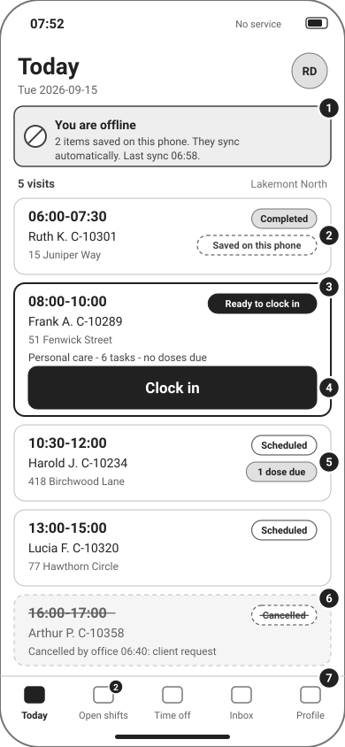
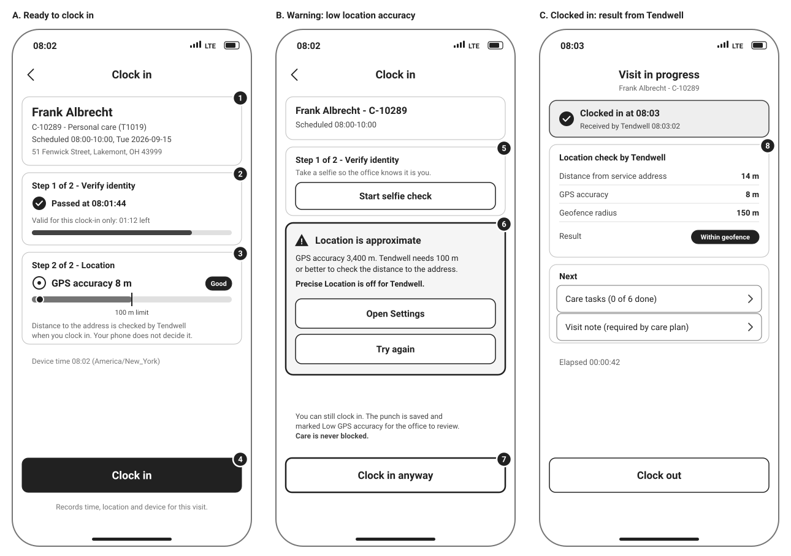
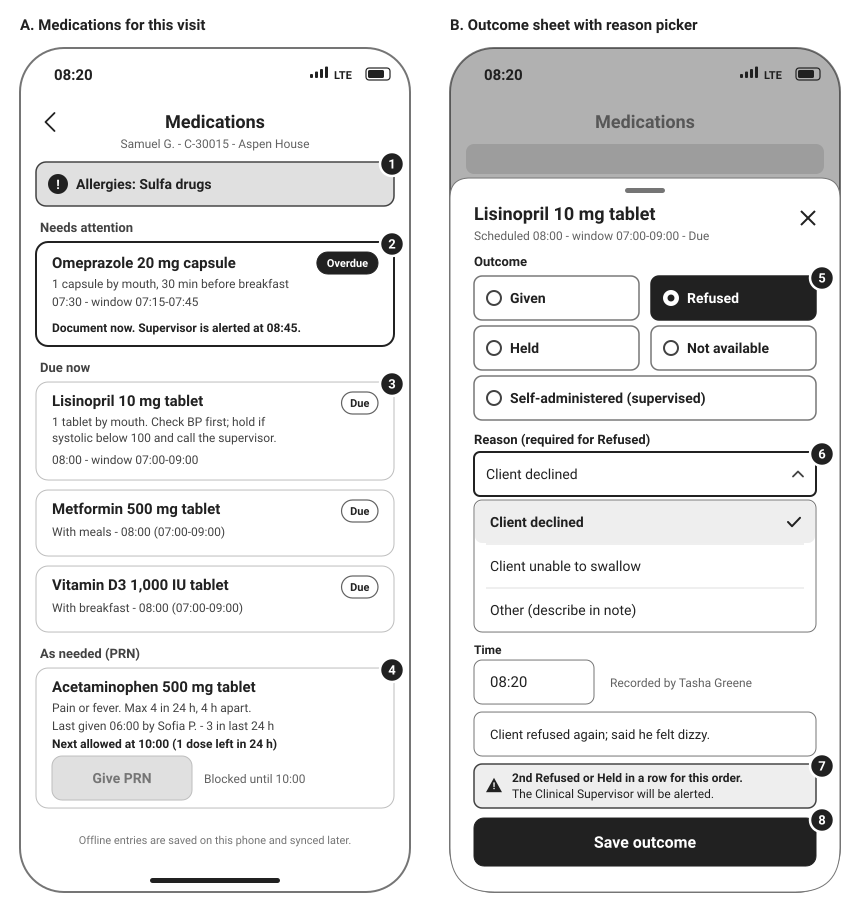
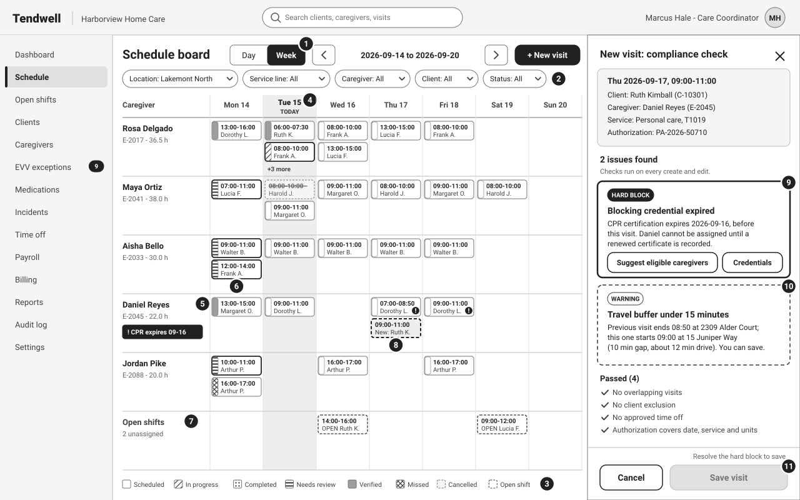
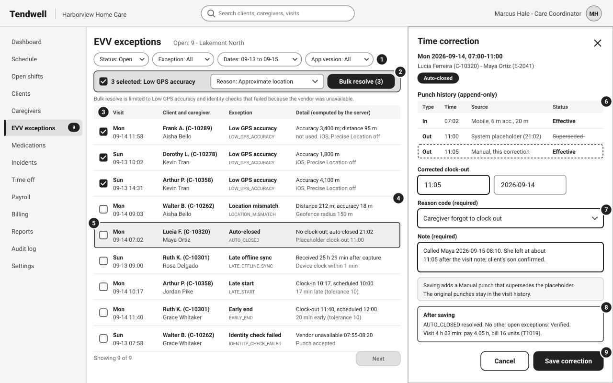
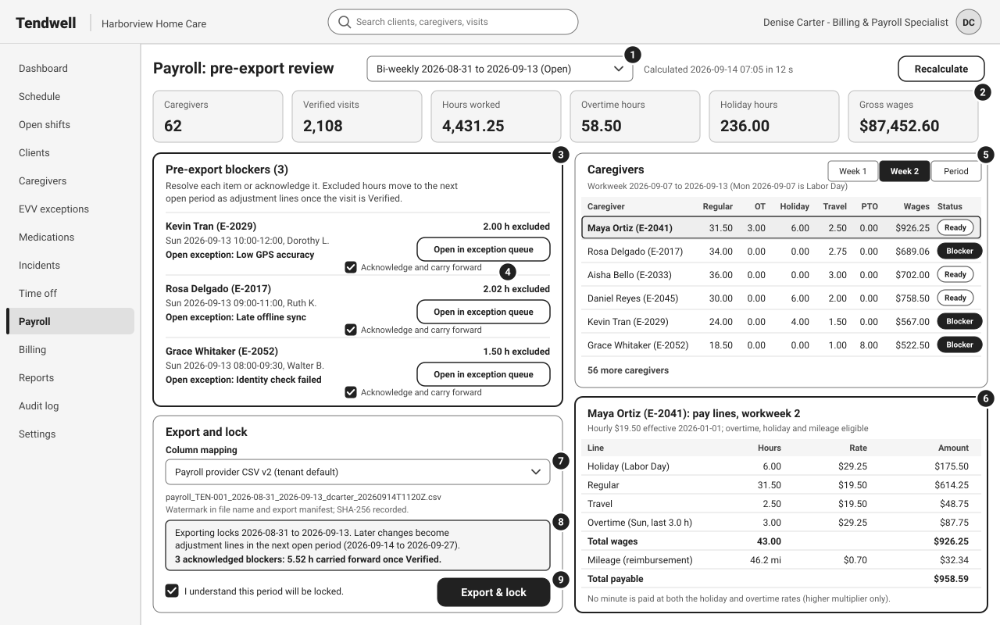

# Wireframes (Low Fidelity)

## Document control

| Field | Value |
|---|---|
| Document ID | TW-UX-01 |
| Version | 1.3 |
| Status | Approved |
| Owner | Business Analyst |
| Last updated | 2026-09-28 |
| Reviewers | UX Designer, Product Owner, Clinical SME (RN advisor), QA Lead, Customer Success Lead |

| Version | Date | Change |
|---|---|---|
| 1.0 | 2026-03-02 | Baseline wireframes for SRS v1.0 walkthroughs |
| 1.2 | 2026-06-12 | UAT feedback: offline chips per visit, reason picker required state, acknowledgement of payroll blockers |
| 1.3 | 2026-09-28 | Low-accuracy warning with Open Settings (CR-004, INC-2026-011); bulk resolve limited by code; app-version filter |

### Purpose and scope

These six low-fidelity wireframes show layout, content priority and behavior for the screens where requirements are most sensitive to interaction design: clock-in, offline capture, dose documentation, scheduling compliance checks, EVV exception resolution and payroll export. They are grayscale by design so that reviewers judge structure and rules rather than visual styling; status is always carried by labels and patterns, never by color.

Each wireframe has numbered callouts that match the annotation table under it (callout, element, behavior, FR/BR reference). Visual design, final copy and component specifications are owned by the UX Designer and are out of scope here.

Sample data comes from the shared [synthetic test data set](../../06-quality/test-data/README.md), so the wireframes, UAT scripts and API tests describe the same people and visits. All names and data are fictional. Times are 24-hour, America/New_York.

| Wireframe | App and frame | Persona | Tenant | Stories |
|---|---|---|---|---|
| cg-01 Today's visits | Caregiver Mobile App, 390 x 844 | PER-01 Rosa Delgado (CG) | TEN-001 Harborview Home Care | US-025, US-027 |
| cg-02 Clock in | Caregiver Mobile App, three 390 x 844 frames | PER-01 Rosa Delgado (CG) | TEN-001 | US-025, US-026, US-027 |
| cg-03 Dose documentation | Caregiver Mobile App, two 390 x 844 frames | Caregiver Tasha Greene (CG) | TEN-003 Northgate Supported Living, Aspen House | US-032, US-033, US-034 |
| web-01 Schedule board | Agency Web App, 1280 x 800 | PER-02 Marcus Hale (AG-COORD) | TEN-001, Lakemont North | US-021, US-024 |
| web-02 EVV exception queue | Agency Web App, 1280 x 800 | PER-02 Marcus Hale (AG-COORD) | TEN-001, Lakemont North | US-029 |
| web-03 Payroll pre-export review | Agency Web App, 1280 x 800 | PER-04 Denise Carter (AG-FIN) | TEN-001 | US-041, US-042, US-043 |

## cg-01 Today's visits

Rosa opens the app at 07:52 on Tue 2026-09-15 with no signal. Her 06:00 visit was captured offline and is waiting to sync; the 08:00 visit is ready for clock-in.

| # | Element | Behavior | FR/BR ref |
|---|---|---|---|
| 1 | Offline banner | Shows that the phone is offline, how many items are saved on the phone and the last sync time. It disappears after a successful sync. After 48 hours offline it asks the caregiver to find a connection or call the office. | FR-EVV-05, NFR-AVL-02, ADR-006 |
| 2 | "Saved on this phone" chip | Per-visit sync state for records captured offline. It is replaced by the server status after sync; the office may see Missed until then. | BR-025, NFR-MOB-02 |
| 3 | Next visit card, "Ready to clock in" chip | The next visit is emphasized. The chip appears from 15 minutes before the scheduled start until the scheduled end; before that the button reads "Opens 07:45". | FR-EVV-01, BR-023 |
| 4 | Clock in button | Opens clock-in with the visit preselected. Clock-in takes 3 taps from app open: Clock in, Start selfie check (only where the tenant requires it), Clock in. | NFR-USE-01, FR-EVV-01 |
| 5 | Dose badge | Count of doses due during the visit; the medication list opens after clock-in. | FR-MAR-02 |
| 6 | Cancelled visit | Stays visible for the day with strike-through, the time of cancellation and the reason, so the caregiver does not travel. | FR-SCH-04, FR-SCH-07 |
| 7 | Tab bar | Today, Open shifts (badge counts claimable shifts), Time off, Inbox and Profile. Inbox shows full notification detail after sign-in; pushes themselves carry no PHI. | FR-SCH-05, FR-TOF-01, FR-NTF-01, BR-056 |

## cg-02 Clock in

Frame A is the normal path. Frame B is the warning state when the phone reports a fix worse than 100 m (the INC-2026-011 pattern, iOS with Precise Location off). Frame C shows the server's evaluation returned after the punch, using the test-data visit VIS-0107 (14 m at 8 m accuracy).

| # | Element | Behavior | FR/BR ref |
|---|---|---|---|
| 1 | Client and schedule card | Full name and address are shown only for the caregiver's own assigned visit (treatment-time access). | FR-EVV-01, NFR-PRIV-01 |
| 2 | Identity step, passed | A Pass is valid for 90 seconds and for this punch only. The countdown shows the remaining validity; when it expires the caregiver repeats the check. | FR-EVV-04, BR-024 |
| 3 | GPS status card | Shows the device-reported accuracy against the 100 m threshold. The app holds no client coordinates, so the distance is computed by the server at clock-in and the phone never decides it. | FR-EVV-02, BR-021, BR-022 |
| 4 | Clock in | Sends coordinates, accuracy, device time and device ID with an idempotency key. Offline, the punch is saved on the phone and synced later with the device capture time. | FR-EVV-02, FR-EVV-05, BR-025 |
| 5 | Identity step, not started | Up to three attempts. If the check fails or the vendor is unavailable the caregiver can still clock in, and the punch raises IDENTITY_CHECK_FAILED for review. | FR-EVV-04, FR-EVV-07, ADR-004 |
| 6 | Low-accuracy warning | Appears when accuracy is worse than 100 m (here 3,400 m). Offers Open Settings, which deep-links to the app's location settings, and Try again. | BR-022, CR-004, INC-2026-011 |
| 7 | Clock in anyway | Care is never blocked. The punch is accepted and raises LOW_GPS_ACCURACY, not LOCATION_MISMATCH. | FR-EVV-03, BR-022 |
| 8 | Location check result | Server-computed distance, reported accuracy and geofence radius with the outcome. Canonical outcomes at a 150 m radius: 212 m at 18 m accuracy is LOCATION_MISMATCH; 95 m at 3,400 m is LOW_GPS_ACCURACY; 40 m at 12 m has no exception. | FR-EVV-03, BR-021, BR-022 |

## cg-03 Dose documentation

Tasha documents doses for Samuel Greer (C-30015) at 08:20 on 2026-09-15. Lisinopril was refused on 2026-09-14, so this second refusal triggers the consecutive-refusal alert (test data DT-0005 and DT-0006).

| # | Element | Behavior | FR/BR ref |
|---|---|---|---|
| 1 | Allergy banner | Always pinned at the top of the medication list and the outcome sheet. | FR-CLI-01, FR-MAR-03 |
| 2 | Overdue dose | The 07:30 omeprazole window (plus or minus 15 minutes for this order) closed at 07:45 undocumented. The card states when the Clinical Supervisor will be alerted (08:45). An outcome recorded now is labelled Late entry. | BR-030, BR-031, FR-MAR-04 |
| 3 | Due dose with window | Shows the scheduled time, the administration window (default plus or minus 60 minutes) and the order instructions, including hold parameters. | BR-029, FR-MAR-02 |
| 4 | PRN with limits | Shows indication, maximum per 24 hours, minimum interval and the last administration. Give PRN is disabled with the time it becomes available; offline, limits are checked against the cached history and re-checked by the server at sync. | FR-MAR-05, BR-033, ADR-006 |
| 5 | Outcome options | Given, Refused, Held, Not available and Self-administered (supervised) as large single-select targets. | FR-MAR-03 |
| 6 | Reason picker | Required for Refused, Held and Not available. Save stays disabled until a reason is chosen, and the message states what is missing. | BR-032, NFR-USE-03 |
| 7 | Consecutive refusal warning | Tells the caregiver that the Clinical Supervisor will be alerted after a second consecutive Refused or Held for the same order. | FR-MAR-06, BR-032 |
| 8 | Save outcome | Saves outcome, administration time and recorder. Offline it is queued on the phone; if another caregiver already documented the dose, the server rejects the second outcome at sync and alerts the Supervisor to check for a double administration. | FR-MAR-03, ADR-006 |

## web-01 Schedule board

Marcus schedules a new visit on Thu 2026-09-17 for Ruth Kimball with Daniel Reyes, whose CPR certification (Blocking) expires on 2026-09-16 (test data CRD-0008).

| # | Element | Behavior | FR/BR ref |
|---|---|---|---|
| 1 | View toggle and date navigation | Day and week views; the week runs Monday to Sunday. A week with 500 visits loads in 2.5 s or less at p95. | FR-SCH-06, NFR-PERF-03 |
| 2 | Filters | Location, service line, caregiver, client and status. Location defaults to the Coordinator's assigned locations and cannot exceed them. | FR-SCH-06, FR-IAM-06 |
| 3 | Legend | Every status has a pattern strip and a text label: Scheduled (empty), In progress (diagonal hatch), Completed (dots), Needs review (horizontal lines and a heavy border), Verified (solid gray), Missed (cross-hatch), Cancelled (dashed, strike-through), Open shift (dashed, "OPEN"). | FR-SCH-06, BR-019, NFR-ACC-01 |
| 4 | Today column | Highlighted; visit statuses update as punches arrive. | BR-019 |
| 5 | Credential flag | A caregiver with an Expiring or Expired blocking credential is flagged, and existing future visits after the expiry date carry a "!" marker. | BR-014, FR-WRK-02, FR-WRK-03 |
| 6 | Needs review block | Completed visits with open exceptions; selecting one opens the exception queue filtered to that visit. | BR-019, FR-EVV-08 |
| 7 | Open shifts row | Unassigned visits published to eligible caregivers, for example after time off is approved. | FR-SCH-05, BR-039 |
| 8 | New visit placeholder | The visit being created, drawn dashed until it is saved. | FR-SCH-02 |
| 9 | Hard block | Expired blocking credential. It cannot be overridden; the actions suggest eligible caregivers or open the credential record. | FR-SCH-03, BR-014 |
| 10 | Warning | Less than 15 minutes between consecutive visits at different addresses. The visit can be saved; a remaining-units warning would additionally require an override reason. | BR-016, BR-010 |
| 11 | Save disabled | Save stays disabled while any hard block exists, and the message states the fix. | FR-SCH-03, NFR-USE-03 |

## web-02 EVV exception queue

The rows reuse test-data exceptions (for example VIS-0101 Location mismatch, VIS-0102 Low GPS accuracy, VIS-0106 Auto-closed). Marcus bulk-resolves three Low GPS accuracy exceptions and corrects the auto-closed visit.

| # | Element | Behavior | FR/BR ref |
|---|---|---|---|
| 1 | Filters | Status, exception code, dates and app version. The app-version filter was added after INC-2026-011 so that release-specific spikes are visible. | FR-EVV-08, NFR-OBS-02 |
| 2 | Bulk resolve bar | Appears when rows are selected. One reason code and one note apply to all; each exception still gets its own audit event. Limited to LOW_GPS_ACCURACY and to IDENTITY_CHECK_FAILED caused by vendor unavailability. | FR-EVV-08, CR-004, BR-057 |
| 3 | Row selection | Selecting rows with different codes disables bulk resolve and explains why. | CR-004 |
| 4 | Server-computed detail | Distance and accuracy are the server's values, never the device's (212 m at 18 m accuracy against a 150 m radius). | BR-021, BR-022 |
| 5 | Selected row | Opens the time correction panel for the visit. | FR-EVV-08 |
| 6 | Punch history | Append-only. Shows the original clock-in, the System placeholder written by auto-close and the pending Manual punch, with Effective and Superseded status. | BR-026, BR-027, ADR-002 |
| 7 | Reason code and note | Both required before save; the reason code comes from the tenant's EVV reason code list. | FR-EVV-08, BR-026 |
| 8 | Outcome preview | Shows which exceptions resolve, whether the visit becomes Verified, and the pay and billing effect (07:02 to 11:05 is 243 minutes: 4.05 h paid, 16 units billed). | FR-EVV-10, BR-028, BR-047 |
| 9 | Save correction | Appends the Manual punch and resolves the exception in one transaction. If the visit's pay period is already locked, an adjustment line goes to the next open period. | FR-PAY-06, BR-046 |

## web-03 Payroll pre-export review

Denise reviews the bi-weekly period 2026-08-31 to 2026-09-13 (test data PP-T1-2026-08-31). Workweek 2 includes Labor Day and reproduces the canonical US-041 example.

| # | Element | Behavior | FR/BR ref |
|---|---|---|---|
| 1 | Period selector and recalculation | Shows the pay period, its status and the last calculation time. Any change to source data marks the calculation stale and requires Recalculate before export. A 250-caregiver summary completes in 60 s or less. | FR-PAY-01, FR-PAY-02, NFR-PERF-04 |
| 2 | Summary tiles | Period totals from Verified visits and approved time only. | FR-PAY-02, BR-028 |
| 3 | Pre-export blockers | Caregivers with open exceptions or unverified visits in the period, with the hours excluded. | FR-PAY-04 |
| 4 | Acknowledge and carry forward | Each blocker must be resolved or acknowledged. Acknowledged hours are not lost: they are paid as adjustment lines in the next open period once the visit is Verified, consistent with FLSA hours-worked treatment. | FR-PAY-06, BR-046 |
| 5 | Caregiver summary by workweek | Overtime is calculated per workweek, so the table switches between week 1, week 2 and the period. | BR-041, FR-PAY-02 |
| 6 | Pay-line breakdown | Canonical example for Maya Ortiz (E-2041): Holiday 6.0 h at $29.25, Regular 31.5 h at $19.50, Travel 2.5 h at $19.50, Overtime 3.0 h at $29.25, total wages $926.25, plus mileage 46.2 mi at $0.70 = $32.34, total payable $958.59. | BR-041, BR-042, BR-043, BR-044, BR-045 |
| 7 | Column mapping and file name | Tenant-configured CSV mapping. The watermark is carried in the file name and export manifest, and the SHA-256 and row count are recorded. | FR-PAY-05, BR-058, ADR-005 |
| 8 | Confirmation note | States the lock, how later changes are handled and how many hours are carried forward, before anything is exported. | BR-046, NFR-USE-03 |
| 9 | Export & lock | Enabled when every blocker is resolved or acknowledged and the confirmation box is checked. Produces the CSV, locks the period and writes the audit event. | FR-PAY-05, BR-046, FR-RPT-04 |

## Design notes: accessibility and states

The web app is designed to WCAG 2.2 AA, and the mobile app to 200% font scaling and screen-reader support (NFR-ACC-01).

**Touch and click targets**
- Every tappable element on mobile is at least 44 x 44 px (buttons, outcome options, reason rows, tab bar items, the back and close icons). This exceeds the WCAG 2.2 AA minimum of 24 x 24 px (2.5.8) and matches platform guidance.
- Primary actions on mobile (Clock in, Clock out, Save outcome) are 48-56 px tall, full width, in the thumb zone at the bottom of the screen.
- Web controls are at least 28 px tall (filter chips) and usually 32-44 px (buttons, inputs), with at least 8 px spacing, above the 24 px minimum.

**Contrast**
- Text colors on white: #212121 (16.1:1), #424242 (10.0:1), #616161 (6.2:1), #757575 (4.6:1). All meet 4.5:1 for normal text (1.4.3); white text on #212121 buttons and chips is 16.1:1.
- Input, select and checkbox borders use #757575 (4.6:1), which meets the 3:1 non-text contrast minimum (1.4.11). Lighter grays (#bdbdbd, #e0e0e0) are used only for decorative card borders and row dividers; tappable cards are identified by their text and chevrons, not by the border.
- Disabled controls (Give PRN, Save visit) are exempt from the contrast minimum but always have a visible text explanation next to them.

**Status without color**
- Visit, dose and exception statuses always combine a text label with a shape or pattern (1.4.1). The schedule board legend maps every pattern to a label, and screen readers announce the label, for example "Visit 08:00 to 10:00, Frank A., in progress".

**Text scaling and reflow**
- At 200% font size, visit cards grow vertically; times and client names wrap rather than truncate. Status chips move below the time line. The tab bar switches to icons with labels exposed to screen readers.
- The web app reflows at 320 CSS px width for read-only views (1.4.10); the schedule board offers the day view, which is a single list, at narrow widths.

**Screen readers and focus**
- Every icon-only control has an accessible name ("Back", "Close", "Open Settings").
- On web, the compliance drawer and time correction panel move focus to their heading when they open, trap focus while open and return it to the trigger on close. Validation messages are announced through a live region.

**Offline and sync states (mobile)**
- The offline banner shows the queue count and last sync time; each captured record shows "Saved on this phone" until the server acknowledges it.
- Confirmation copy for offline actions: "Saved on this phone. It will sync when you are back online."
- What changes offline: distance is computed only after sync; identity checks are matched at sync; PRN limits use the cached history; the office may see Missed or receive missed-dose alerts until records sync, so the banner reminds the caregiver to call the office for urgent matters.
- After 48 hours offline, the banner escalates to a persistent warning; capture continues.

**Messages**
- Every validation message states the problem and the fix and never shows a raw code (NFR-USE-03), for example "Resolve the hard block to save" and "Precise Location is off for Tendwell".

**Privacy in the UI**
- Lists show client first name and last initial with the client number. Full name, address and phone appear only in the caregiver's own visit detail (treatment-time access) or after an audited reveal on the web (FR-CLI-06).

## Related documents

- [Process flows](../diagrams/process-flows.md)
- [State machines](../diagrams/state-machines.md)
- [Sequence diagrams](../diagrams/sequence-diagrams.md)
- [ADR-006 Offline-first caregiver app](../architecture/adr/ADR-006-offline-first-caregiver-app.md)
- [Personas](../../01-discovery/personas.md)
- [EP-05 Scheduling user stories](../../05-delivery/user-stories/EP-05-scheduling.md)
- [EP-06 EVV user stories](../../05-delivery/user-stories/EP-06-evv.md)
- [EP-07 eMAR and vitals user stories](../../05-delivery/user-stories/EP-07-emar-vitals.md)
- [EP-10 Payroll user stories](../../05-delivery/user-stories/EP-10-payroll.md)
- [Non-functional requirements](../../02-requirements/non-functional-requirements.md)
- [Synthetic test data](../../06-quality/test-data/README.md)
