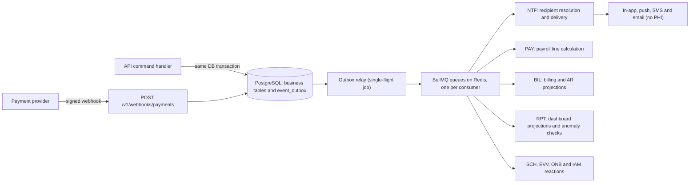
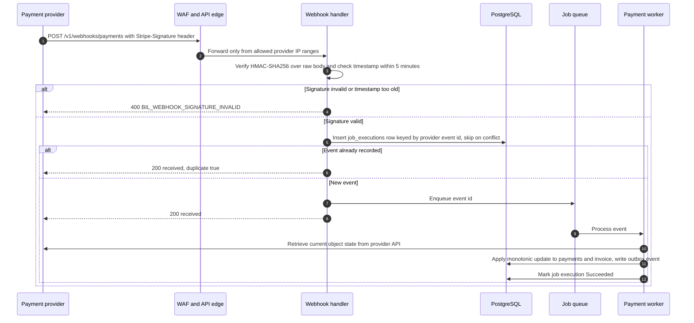

# Tendwell Domain Events and Webhooks

## Document control

| Field | Value |
|---|---|
| Document ID | TW-API-03 |
| Version | 1.3 |
| Status | Baselined (aligned to SRS v1.3) |
| Owner | Business Analyst |
| Last updated | 2026-09-24 |
| Reviewers | Engineering Lead (approver), Backend Developers, QA Lead, Compliance and Privacy Officer, Product Owner |

## 1. Purpose and scope

This document defines:
- the domain events that Tendwell modules publish and consume;
- the event envelope;
- delivery and consumer rules;
- how the inbound payment-provider webhook is handled;
- the planned design of outbound agency webhooks (Release 2).

Events drive notifications and escalations (EP-12), payroll and billing projections (EP-10, EP-11), the operations dashboard (EP-13) and cross-module reactions such as discharge cancelling visits.

In scope: Release 1 internal events and the payment webhook. Out of scope: Family Portal notifications and outbound agency webhooks, both Release 2 (CR-003). REST conventions are in the [API guidelines](api-guidelines.md). Operations are in the [OpenAPI specification](openapi.yaml).

## 2. Event architecture



| Concern | Design |
|---|---|
| Publishing | **Transactional outbox.** The command writes its business change and an `event_outbox` row in the same PostgreSQL transaction, so no event is lost and none is published for a rolled-back change. A single-flight relay (ADR-003) publishes new rows to the job queues and stamps `published_at`. |
| Transport | Redis and BullMQ, with one queue per consuming module. Events never leave the HIPAA boundary in Release 1. |
| Delivery guarantee | **At least once.** Consumers must be idempotent (section 6). |
| Ordering | Events carry a per-subject `sequence`. Consumers apply events for a subject in sequence order and ignore any event whose sequence is not higher than the last one applied. There is no global ordering. |
| Retries | 5 attempts per consumer with exponential backoff (10 s to 15 min). After that the event goes to a dead-letter queue, which pages on-call. |
| Retention | Outbox rows are kept 30 days after publication ([retention schedule](../03-design/data/data-classification-and-retention.md#6-retention-schedule)). |
| Scale | About 400,000 events per year for TEN-001. Designed for 500 tenants and 2 million visits per month (NFR-SCL-01). |

## 3. Naming and versioning

- **Type format.** Event types are `<entity>.<past_tense_verb>` in lowercase snake_case, for example `visit.clocked_in` and `payperiod.locked`. The OpenAPI `EventType` enum is the authoritative list.
- **Schema versions.** Each type has a JSON Schema at `dataschema`. Additive payload changes keep the version. Breaking changes publish a new version (`.../v2.json`) alongside the old one for at least 6 months, the same notice period as the API (see [API guidelines, section 3](api-guidelines.md#3-versioning-and-deprecation)).
- **Payload content.** Payloads carry IDs, codes, times and amounts. They never carry names, addresses, dates of birth, Medicaid IDs, diagnoses or free text. Consumers that need more read it through the API or the database inside the trust boundary.

## 4. Event envelope

The envelope follows CloudEvents 1.0 (JSON format). It adds Tendwell extension attributes, named in lowercase alphanumeric form as CloudEvents requires.

| Attribute | Required | Type | Description |
|---|---|---|---|
| `specversion` | Yes | string | Always `1.0` |
| `id` | Yes | UUID | Event ID. Equals `event_outbox.id`, and is used as the idempotency key by consumers and in `notifications.dedupe_key` (BR-055). |
| `source` | Yes | URI reference | Producing module, for example `/tendwell/evv` |
| `type` | Yes | string | Event type, for example `evv.exception_raised` |
| `subject` | Yes | string | Aggregate reference, for example `visits/a1f3c5e7-...` |
| `time` | Yes | RFC 3339 UTC | When the business fact occurred |
| `datacontenttype` | Yes | string | `application/json` |
| `dataschema` | Yes | URI | `https://api.tendwell.example/schemas/events/<type>/v1.json` |
| `tenantid` | Yes | UUID | Tenant. Consumers set the RLS tenant context from it (BR-001). |
| `sequence` | Yes | string (integer) | Monotonic per subject, used for ordering |
| `correlationid` | Yes | UUID | `X-Request-Id` of the originating API request, or the job execution ID |
| `causationid` | No | UUID | ID of the event or command that caused this event |
| `actorid` | Yes | string | User ID, or `system` for scheduled jobs |
| `containsphi` | Yes | boolean | `true` when `data` holds PHI (see the catalog). Used to keep these events out of logs and out of future outbound webhooks. |
| `data` | Yes | object | Event payload (section 5) |

**Example: `evv.exception_raised`**, for the canonical geofence case: 212 m from the address, 18 m accuracy, 150 m radius.

```json
{
  "specversion": "1.0",
  "id": "0e1f2a3b-4c5d-4e6f-9a7b-8c9d0e1f2a20",
  "source": "/tendwell/evv",
  "type": "evv.exception_raised",
  "subject": "visits/a1f3c5e7-0b2d-4c6e-8f1a-20260908a001",
  "time": "2026-09-08T12:56:11Z",
  "datacontenttype": "application/json",
  "dataschema": "https://api.tendwell.example/schemas/events/evv.exception_raised/v1.json",
  "tenantid": "7c1e4a52-3b9d-4f0e-9a61-2d8f5b3c1a01",
  "sequence": "2",
  "correlationid": "5e1d7a90-3c2b-4f8e-9a6d-0b1c2d3e4f5a",
  "causationid": "e3a1c9f2-7b4d-4e8a-9c6f-1d2b3a4c5e01",
  "actorid": "4e8a9d4f-1a37-4b6c-95d3-a20410000001",
  "containsphi": false,
  "data": {
    "exceptionId": "0c1d2e3f-4a5b-4c6d-9e7f-8a9b0c1d2e01",
    "visitId": "a1f3c5e7-0b2d-4c6e-8f1a-20260908a001",
    "code": "LOCATION_MISMATCH",
    "punchId": "e3a1c9f2-7b4d-4e8a-9c6f-1d2b3a4c5e01",
    "punchSource": "Mobile",
    "distanceMeters": 212,
    "accuracyMeters": 18,
    "geofenceRadiusMeters": 150,
    "locationId": "1a2b3c4d-5e6f-4a7b-8c9d-0e1f2a3b4c01"
  }
}
```

**Example: `billing_run.completed`**, which feeds the NFR-OBS-02 invoice-count anomaly check that INC-2026-007 showed was missing.

```json
{
  "specversion": "1.0",
  "id": "0e1f2a3b-4c5d-4e6f-9a7b-8c9d0e1f2a31",
  "source": "/tendwell/bil",
  "type": "billing_run.completed",
  "subject": "billing-runs/d7c9e1f3-5a7b-4c9d-8e1f-202609300001",
  "time": "2026-10-01T13:01:52Z",
  "datacontenttype": "application/json",
  "dataschema": "https://api.tendwell.example/schemas/events/billing_run.completed/v1.json",
  "tenantid": "7c1e4a52-3b9d-4f0e-9a61-2d8f5b3c1a01",
  "sequence": "2",
  "correlationid": "2b7d9f13-5c8e-4a61-b0d2-9e4f3a2c1b70",
  "actorid": "d9e0f1a2-b3c4-4d5e-8f6a-7b8c9d0e1f01",
  "containsphi": false,
  "data": {
    "billingRunId": "d7c9e1f3-5a7b-4c9d-8e1f-202609300001",
    "periodStart": "2026-09-01",
    "periodEnd": "2026-09-30",
    "invoicesCreated": 194,
    "invoicesUpdated": 0,
    "invoicesSkippedNotDraft": 0,
    "previousRunInvoiceCount": 189,
    "invoiceCountDeviationPercent": 2.6
  }
}
```

## 5. Domain event catalog

**PHI?** is `Y` when `data` links a client to service dates, locations, clinical values or billing facts; such events set `containsphi: true`. It is `N` when the payload holds only opaque IDs, codes and workforce or financial facts with no client linkage. Every event stays inside the HIPAA boundary in Release 1.

Consumer codes are module codes: NTF notifications, PAY payroll, BIL billing, RPT reporting, SCH scheduling, EVV, MAR, DOC, TOF, WRK, CLI, ONB, IAM.

| Event | Producer | Trigger | Consumers | Payload fields | PHI? | FR / BR refs |
|---|---|---|---|---|---|---|
| `visit.scheduled` | SCH | One-off visit created, or occurrence materialized from a pattern | NTF (caregiver within 1 min), RPT | visitId, patternId, clientId, caregiverId, serviceLineCode, scheduledStart, scheduledEnd, isOpenShift | Y | FR-SCH-01, FR-SCH-02, FR-SCH-07, BR-018 |
| `visit.changed` | SCH | Time or caregiver changed (single or series); open-shift claim confirmed; time off moved the visit to open shifts | NTF (previous and new caregiver), RPT | visitId, scope, changedFields[], previous{caregiverId, scheduledStart, scheduledEnd}, current{...}, cause | Y | FR-SCH-04, FR-SCH-05, FR-SCH-07, FR-TOF-03, BR-039, CR-002 |
| `visit.cancelled` | SCH | Visit cancelled by a Coordinator, by discharge or by authorization end | NTF (caregiver), RPT | visitId, caregiverId, reasonCode, scope, cancelledAt | Y | FR-SCH-04, FR-CLI-07, BR-019 |
| `visit.clocked_in` | EVV | Clock-in punch accepted (online or through sync) | SCH (status `InProgress`), MAR (show due doses), RPT; NTF family start notice in Release 2 | visitId, punchId, caregiverId, clientId, punchTime, receivedAt, source, carePlanVersion, exceptionCodes[] | Y | FR-EVV-01, FR-EVV-02, FR-EVV-05, BR-012, BR-025, FR-FAM-02 (R2) |
| `visit.clocked_out` | EVV | Clock-out punch accepted | DOC (start the 24 h note-lock timer), MAR (stop dose reminders for the visit), RPT; NTF family end notice in Release 2 | visitId, punchId, punchTime, receivedAt, source, visitStatus, exceptionCodes[] | Y | FR-EVV-06, FR-DOC-02, BR-035 |
| `visit.verified` | EVV | Visit has clock-in, clock-out, all six EVV elements and no open exception | PAY (calculate pay lines), BIL (unbilled projection), RPT | visitId, clientId, caregiverId, serviceAuthorizationId, serviceCode, verifiedAt, verifiedMinutes, visitDate | Y | FR-EVV-10, FR-PAY-02, FR-BIL-01, BR-020, BR-028 |
| `visit.missed` | SCH | No clock-in by the scheduled end | NTF (Coordinator), RPT | visitId, clientId, caregiverId, scheduledStart, scheduledEnd | Y | BR-019, FR-SCH-06 |
| `evv.exception_raised` | EVV | Any exception created: `LATE_START`, `EARLY_END`, `LOCATION_MISMATCH`, `LOW_GPS_ACCURACY`, `MISSING_CLOCK_OUT`, `UNSCHEDULED_VISIT`, `LATE_OFFLINE_SYNC`, `AUTO_CLOSED`, `IDENTITY_CHECK_FAILED` | NTF (Coordinator queue, escalation ladder), RPT (exception-rate anomaly, NFR-OBS-02), PAY and BIL (exclude visit while open) | exceptionId, visitId, code, punchId, punchSource, distanceMeters, accuracyMeters, geofenceRadiusMeters, minutesLate, hoursSinceCapture, locationId | N | FR-EVV-03, FR-EVV-07, FR-EVV-09, BR-021, BR-022, BR-023, BR-025, BR-027, CR-004 |
| `evv.exception_resolved` | EVV | Exception `Resolved` or `Waived` | EVV (re-check verification), NTF (stop escalation), RPT | exceptionId, visitId, code, outcome, reasonCode, resolvedBy | N | FR-EVV-08, FR-NTF-03, BR-026 |
| `dose.due` | MAR | Scheduled time of a dose reached | NTF (caregiver reminder) | doseTaskId, orderId, clientId, visitId, caregiverId, scheduledAt, windowEnd | Y | FR-MAR-02, BR-029, BR-030 |
| `dose.overdue` | MAR | Window closed with no outcome; status `Overdue` | NTF (caregiver and Care Coordinator) | doseTaskId, orderId, clientId, visitId, caregiverId, scheduledAt, windowEnd | Y | FR-MAR-04, BR-030 |
| `dose.missed` | MAR | 60 minutes after the window closed with no outcome; status `MissedUndocumented` | NTF (urgent to Clinical Supervisor, bypasses quiet hours; escalation ladder), RPT (missed-dose count) | doseTaskId, orderId, clientId, caregiverId, scheduledAt, windowEnd, lateEntryAllowedUntil | Y | FR-MAR-04, FR-NTF-03, BR-030, BR-031, BR-053 (CR-007 rejected: doses are never auto-cancelled) |
| `dose.refusal_streak` | MAR | Second consecutive `Refused` or `Held` outcome for the same order | NTF (Clinical Supervisor) | orderId, clientId, doseTaskIds[], outcomes[], streakLength | Y | FR-MAR-06, BR-032 |
| `vital.out_of_range` | MAR | Reading outside the client range or the default range | NTF (urgent to Clinical Supervisor), RPT | readingId, clientId, visitId, type, value1, value2, unit, appliedRange{low, high, low2, high2, source}, takenAt | Y | FR-MAR-08, BR-034, BR-053 |
| `incident.reported` | DOC | Client incident created | NTF (immediate to Clinical Supervisor and Agency Administrator for High severity or `SuspectedAbuseNeglect`; normal priority otherwise), RPT | incidentId, clientId, visitId, category, severity, occurredAt, reportedBy | Y | FR-DOC-03, FR-DOC-04, BR-036, BR-053, CR-006 |
| `incident.deadline_approaching` | DOC | 50% and 90% of the external reporting deadline elapsed | NTF (Clinical Supervisor, Agency Administrator) | incidentId, category, reportDeadlineAt, percentElapsed | Y | FR-DOC-06, BR-036 |
| `incident.closed` | DOC | Incident closed with all actions `Done` or `Waived` | NTF (stop escalation), RPT | incidentId, closedBy, closedAt | N | FR-DOC-05, BR-037 |
| `credential.expiring` | WRK | Daily job: 30, 14 and 1 days before expiry | NTF (caregiver and Care Coordinator), RPT | credentialId, caregiverId, credentialTypeId, isBlocking, expiresOn, daysToExpiry | N | FR-WRK-02, FR-WRK-04, BR-014 |
| `credential.expired` | WRK | Expiry date passed | SCH (flag future visits when blocking), NTF, RPT | credentialId, caregiverId, credentialTypeId, isBlocking, expiredOn, flaggedFutureVisitIds[] | N | FR-WRK-02, FR-WRK-03, BR-014 |
| `caregiver.deactivated` | WRK | Caregiver deactivated | IAM (revoke sessions, queue remote wipe), SCH (move future visits to open shifts), RPT | caregiverId, userId, effectiveAt, futureVisitIds[] | N | FR-WRK-06, BR-054, NFR-MOB-02 |
| `client.discharged` | CLI | Client discharged | SCH (cancel visits after the discharge date), NTF (affected caregivers), BIL (Fixed monthly proration), RPT | clientId, dischargedOn, cancelledVisitIds[] | Y | FR-CLI-07, BR-013, BR-048 |
| `timeoff.requested` | TOF | Time-off request created | NTF (Care Coordinator) | requestId, caregiverId, leaveType, startDate, endDate, partialHours, shortNotice | N | FR-TOF-01, FR-TOF-02, BR-038 |
| `timeoff.decided` | TOF | Request approved or declined | NTF (caregiver), SCH (move affected visits to open shifts on approval), PAY (PTO lines), TOF (balance) | requestId, caregiverId, decision, leaveType, startDate, endDate, decidedBy, openShiftVisitIds[] | N | FR-TOF-03, FR-TOF-04, BR-039, BR-040 |
| `payperiod.locked` | PAY | First payroll export of the period | PAY (route later changes to adjustment lines), NTF (Billing & Payroll Specialist), RPT | payPeriodId, startDate, endDate, exportId, rowCount, sha256, lockedAt | N | FR-PAY-05, FR-PAY-06, BR-046 |
| `billing_run.completed` | BIL | Billing run finished (or failed) | NTF (Billing & Payroll Specialist), RPT (invoice-count deviation alert over 20%) | billingRunId, status, periodStart, periodEnd, invoicesCreated, invoicesUpdated, invoicesSkippedNotDraft, previousRunInvoiceCount, invoiceCountDeviationPercent | N | FR-BIL-01, BR-050, CR-005, NFR-OBS-02 |
| `invoice.issued` | BIL | Invoice issued | NTF (PHI-free notice to a private payer, with a payment link if one exists), BIL (overdue scheduler), RPT (AR) | invoiceId, number, clientId, payerId, payerType, subtotalCents, balanceCents, dueDate, issuedAt | Y | FR-BIL-04, FR-BIL-05, FR-BIL-08, BR-051, BR-052, BR-056 |
| `invoice.overdue` | BIL | Due date passed; reminders at +1, +7 and +14 days | NTF (payer reminder, Billing & Payroll Specialist), RPT (AR ageing) | invoiceId, number, payerId, daysOverdue, balanceCents, reminderStep | Y | FR-BIL-08, BR-052 |
| `payment.succeeded` | BIL (from webhook) | Provider confirms an invoice payment or a subscription charge | BIL (apply payment, update invoice status), ONB (reactivate a read-only tenant), NTF, RPT | paymentId, kind (`InvoicePayment` or `Subscription`), invoiceId, subscriptionId, amountCents, method, providerRef, receivedAt | Y for invoice payments, N for subscription charges | FR-BIL-05, FR-ONB-06, FR-ONB-07, BR-003 |
| `payment.failed` | BIL (from webhook) | Provider reports a failed charge | ONB (count subscription retries; third failure starts the 7-day grace), NTF (Agency Administrator or Billing & Payroll Specialist) | kind, invoiceId, subscriptionId, providerRef, failureCode, attempt, nextRetryAt | N | FR-BIL-05, FR-ONB-07, BR-003 |
| `tenant.read_only` | ONB | 7 days after trial expiry, or 7 days after the third failed subscription payment retry | IAM (write gate `TEN_READ_ONLY`), NTF (all agency users, banner), Platform | tenantId, reason (`TrialExpired` or `PaymentFailed`), effectiveAt | N | FR-ONB-07, BR-003 |
| `tenant.reactivated` | ONB | Payment succeeds for a read-only tenant | IAM (lift write gate), NTF | tenantId, effectiveAt, providerRef | N | FR-ONB-07, BR-003 |
| `support_access.requested` | IAM | Platform Support Agent requests a grant | NTF (Agency Administrators) | grantId, scope, requestedDurationMinutes, requestedBy | N | FR-IAM-07, BR-008 |
| `authorization.alert` | CLI | Authorization reaches 90% utilization or will expire within 14 days | NTF (Care Coordinator, Billing & Payroll Specialist), RPT | serviceAuthorizationId, clientId, alert (`HIGH_UTILIZATION` or `EXPIRING_SOON`), utilizationPercent, unitsRemaining, periodEnd | Y | FR-CLI-04, BR-010 |

## 6. Consumer rules

| Rule | Detail |
|---|---|
| Idempotent consumption | Each consumer records `(consumer, event id)` before applying side effects, and treats a duplicate as already done. Consumers that write rows also rely on database unique keys: `notifications.dedupe_key` (BR-055), payroll lines per `(source_visit_id, line_type)`, and invoice `idempotency_key` (CR-005). |
| Tenant context | Each handler sets `app.tenant_id` from `tenantid` before touching data, so RLS applies to background work too (BR-001). |
| Ordering | Apply only when `sequence` is higher than the last applied for the subject. Otherwise acknowledge and skip. |
| Recipient resolution (CR-006) | NTF resolves recipients **when it sends**, from active users holding the ladder step's role in the event's location (BR-054). It never uses a recipient list stored at configuration time. Deactivated users are never notified, which closes the failure path of INC-2026-015. A message addressed to a deactivated user is a zero-tolerance alert (NFR-OBS-02). |
| PHI in messages | Templates for push, SMS and email carry generic text and a deep link that requires sign-in, for example "A dose needs attention. Sign in to review." (BR-056, FR-NTF-05). Event payloads are never rendered into message bodies. |
| Quiet hours | Non-urgent notifications created between 21:00 and 07:00 tenant time are `Held` and sent at 07:00. Every dose-escalation step (`dose.due`, `dose.overdue`, `dose.missed`), `vital.out_of_range`, High-severity incidents and suspected abuse or neglect bypass quiet hours (BR-053). |
| Escalation | Each ladder step is a delayed job keyed by event ID and step. Before sending, the job re-checks the triggering condition, for example whether the dose is still `MissedUndocumented`, and stops when it is resolved (FR-NTF-03). |
| Delivery retries | Failed deliveries retry 3 times at 1, 4 and 16 minutes, then the notification is marked `Failed` (BR-055). |
| Logging | Handlers log `id`, `type`, `tenantid`, `correlationid` and the outcome. They never log `data` for events with `containsphi: true` (NFR-OBS-01). |

## 7. Inbound payment webhook handling

`POST /v1/webhooks/payments` receives payment-provider events for two flows:
- **agency invoice payments** through payment links (FR-BIL-05), where the event carries the agency's connected account ID;
- **Tendwell subscription billing** (FR-ONB-06, FR-ONB-07).

### 7.1 Processing sequence



### 7.2 Signature verification

1. Read the **raw** request body before any JSON parsing. Re-serialized JSON would not match the signature.
2. Parse `Stripe-Signature: t=<unix seconds>,v1=<hex signature>[,v1=...]`.
3. Compute HMAC-SHA256 over `<t>.<raw body>` with the endpoint signing secret held in AWS Secrets Manager. Compare it with each `v1` value in **constant time**.
4. Reject the request when no signature matches, or when `|now - t|` is more than **300 seconds (5-minute tolerance)**. The response is `400 BIL_WEBHOOK_SIGNATURE_INVALID` with no detail about which check failed.
5. During secret rotation, both the old and the new secret are accepted for 24 hours.
6. Signature failures are counted. A spike (more than 10 in 5 minutes) pages on-call as a possible attack or misconfiguration.

### 7.3 Idempotent processing by event ID

- The handler inserts `job_executions(job_name = 'payment-webhook', idempotency_key = 'stripe:<event id>')` with `ON CONFLICT DO NOTHING`. If the row already exists, it returns `200 {"received": true, "duplicate": true}` and does nothing else (ADR-003).
- The worker writes payments with the provider reference as a unique key (`payments.provider_ref`), so even a bug that processed the same event twice could not record a payment twice.
- The handler returns `200` within 2 seconds. Only a failure to record the event returns `5xx`, which makes the provider retry; it retries with backoff for up to 3 days.

### 7.4 Out-of-order handling

The provider does not guarantee delivery order. The worker therefore treats each event as a hint and the provider's current object as the source of truth.

| Situation | Handling |
|---|---|
| `payment_intent.payment_failed` arrives after `payment_intent.succeeded` for the same intent | Retrieve the intent. Its status is `succeeded`, so the failure is recorded as history only and the invoice does not change. |
| A `succeeded` event arrives for a payment that was later refunded | Retrieve the charge, apply the payment, then apply the refund from `charge.refunded` (or from the retrieved state). Both are recorded and the net balance is correct. |
| Partial payments arrive out of order | `paid_cents` is recomputed from all `Succeeded` payment rows for the invoice. It is never incremented blindly, so the result does not depend on arrival order. |
| Invoice status would move backwards, for example from `Paid` to `PartiallyPaid`, because of an older event | Status transitions are monotonic for payment events. The only backward move is a refund, which recalculates the status from balances. |
| Subscription events (`customer.subscription.updated`, `invoice.paid`, `invoice.payment_failed`) arrive out of order | Compare `current_period_end` and status on the retrieved subscription. Apply only state that is newer than what is stored. |
| An event refers to an unknown invoice or tenant | Park the event for 15 minutes and retry. The payment link is created before payment, so this is rare. After 5 attempts it goes to the dead-letter queue and an alert is raised. |

### 7.5 Provider events handled

| Provider event | Flow | Tendwell effect | Domain event |
|---|---|---|---|
| `checkout.session.completed` | Invoice payment link | Links the payment intent to the invoice (metadata `invoiceId`) | None |
| `payment_intent.succeeded` | Invoice payment | Inserts or updates `payments` as `Succeeded`, recomputes `paid_cents` and `balance_cents`, and sets the invoice to `PartiallyPaid` or `Paid` | `payment.succeeded` |
| `payment_intent.payment_failed` | Invoice payment | Records the payment as `Failed`; the invoice is unchanged | `payment.failed` |
| `charge.refunded` | Invoice payment | Records the payment as `Refunded` and recalculates the balance and status. Refunds for the INC-2026-007 duplicates ($2,914.50 across 6 clients) went through this path. | None (audited) |
| `invoice.paid` | Subscription | Subscription `Active`. When the tenant is `ReadOnly`, returns it to `Active`. | `payment.succeeded`, `tenant.reactivated` |
| `invoice.payment_failed` | Subscription | Counts the retry. The third failure starts the 7-day grace before `ReadOnly`. | `payment.failed` |
| `customer.subscription.updated` | Subscription | Syncs seats, plan, status and period dates | None |
| `customer.subscription.deleted` | Subscription | Subscription and tenant `Cancelled`; starts the 90-day retention clock (NFR-PRIV-03) | None |

All other event types are acknowledged with `200` and ignored.

### 7.6 Data minimization and reconciliation

- **No PHI to the provider.** Tendwell sends only the tenant ID, the invoice ID and number, and the amount. No client name, diagnosis or service detail is placed in provider metadata or descriptions. The payer enters their own payment details on the provider's hosted page; card and bank data never reach Tendwell.
- **Nightly reconciliation.** A single-flight job compares the provider's balance transactions for the previous day with `payments`. Missing or mismatched records are corrected from provider state and reported to the Billing & Payroll Specialist. This catches any event lost before it was recorded.

## 8. Outbound agency webhooks (Release 2)

**Status: planned for Release 2 and not in Release 1 scope.** No functional requirement is assigned yet. It will be raised through a change request and added to the SRS before build. The intended design is recorded here so that Release 1 events are shaped to support it.

| Aspect | Planned design |
|---|---|
| Subscription | The Agency Administrator registers an HTTPS endpoint and chooses event types from an allow-list. Events with `containsphi: true` are excluded by default. Enabling them requires the agency to confirm that the receiving system is covered by its own HIPAA safeguards and agreements. |
| Payload | Thin events: the CloudEvents envelope with IDs, type and time only. The receiver calls the Tendwell API, with OAuth client credentials and least-privilege scopes, to fetch the details it is entitled to. |
| Signature | `Tendwell-Signature: t=<unix seconds>,v1=<HMAC-SHA256 of "<t>.<raw body>">`, with a per-endpoint secret shown once at creation. Receivers must enforce a 5-minute timestamp tolerance and compare in constant time. Secrets rotate with an overlap period. |
| Idempotency | The `Tendwell-Event-Id` header equals the CloudEvents `id`. Receivers deduplicate on it. |
| Delivery | At least once. Retries use exponential backoff for up to 24 hours. After 24 hours of consecutive failures the endpoint is disabled and the Agency Administrator is notified. A delivery log is kept for 30 days. |
| Ordering | Not guaranteed. The `sequence` attribute lets receivers discard stale events. |
| Security | HTTPS with TLS 1.2+ only; no redirects followed; private IP ranges blocked (server-side request forgery protection); a per-tenant rate limit on deliveries. |

## Related documents

- [OpenAPI specification](openapi.yaml)
- [API guidelines](api-guidelines.md)
- [Data dictionary](../03-design/data/data-dictionary.md)
- [Entity relationship model](../03-design/data/erd.md)
- [Data classification and retention](../03-design/data/data-classification-and-retention.md)
- [Sequence diagrams](../03-design/diagrams/sequence-diagrams.md)
- [ADR-003 Single-flight scheduled jobs](../03-design/architecture/adr/ADR-003-single-flight-scheduled-jobs.md)
- [Business rules catalog](../02-requirements/business-rules.md)
- [INC-2026-007 Duplicate client invoices](../07-operations/incidents/INC-2026-007-duplicate-client-invoices.md)
- [INC-2026-015 Escalation email to a deactivated user](../07-operations/incidents/INC-2026-015-escalation-email-to-deactivated-user.md)
- [Change request log](../05-delivery/change-request-log.md)
