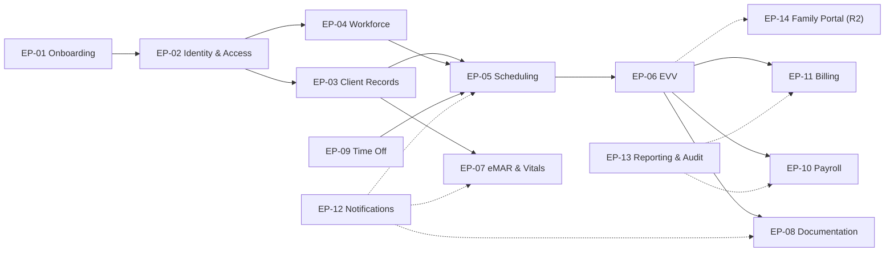

# Epics

## Document control

| Field | Value |
|---|---|
| Document ID | TW-DEL-003 |
| Version | 1.3 |
| Status | Baselined |
| Owner | Business Analyst |
| Last updated | 2026-09-24 |
| Reviewers | Product Owner, Engineering Lead, QA Lead, UX Designer, Clinical SME (RN advisor), Compliance and Privacy Officer |

## Purpose and scope

This document gives a one-page view of each of the 14 Tendwell epics: the goal, the outcome we expect and how we will measure it, scope boundaries, the functional requirements and stories it contains, dependencies and the main risks. It connects the business objectives (OBJ-01 to OBJ-06) and business needs (BN-01 to BN-14) in the BRD to the delivery backlog. Story detail and acceptance criteria are in the [user story files](user-stories/EP-01-agency-onboarding.md); risk and dependency IDs (RSK, DEP) are defined in the [RAID log](raid-log.md).

## Business objectives referenced

| Objective | KPI | Baseline | Target |
|---|---|---|---|
| OBJ-01 | Visits with complete EVV data | 81% | 97% or more |
| OBJ-02 | Payroll preparation time per pay period per agency | 14 h | 3 h or less |
| OBJ-03 | Undocumented medication doses | 4.6% | 0.5% or less |
| OBJ-04 | Days to issue monthly invoices | 9 | 2 business days or fewer |
| OBJ-05 | Caregivers working with an expired blocking credential | 23 instances per quarter | 0 |
| OBJ-06 | Billing denials caused by authorization overrun | 6.1% | 1% or less |

## Epic summary

| Epic | Name | Module | Release | Stories | Points | Sprints | Primary objective |
|---|---|---|---|---|---|---|---|
| EP-01 | Agency Onboarding & Subscription | ONB | R1 | 6 | 29 | S1, S6 | Enabler |
| EP-02 | Identity & Access Management | IAM | R1 | 5 | 23 | S1, S2 | Enabler |
| EP-03 | Client Records & Care Plans | CLI | R1 | 5 | 24 | S2, S4 | OBJ-06 |
| EP-04 | Caregiver Workforce & Credentials | WRK | R1 | 3 | 13 | S2 | OBJ-05 |
| EP-05 | Scheduling | SCH | R1 | 5 | 31 | S3, S5 | OBJ-05, OBJ-06 |
| EP-06 | Electronic Visit Verification (EVV) | EVV | R1 | 6 | 37 | S3, S4, S5 | OBJ-01 |
| EP-07 | Medication Administration (eMAR) & Vitals | MAR | R1 | 5 | 26 | S4, S5 | OBJ-03 |
| EP-08 | Care Documentation & Client Incidents | DOC | R1 | 3 | 13 | S3, S5 | OBJ-01 (guardrail) |
| EP-09 | Time Off & Holidays | TOF | R1 | 2 | 8 | S5 | OBJ-01, OBJ-02 |
| EP-10 | Payroll Preparation | PAY | R1 | 3 | 23 | S5, S6 | OBJ-02 |
| EP-11 | Client Billing & Invoicing | BIL | R1 | 5 | 29 | S6 | OBJ-04, OBJ-06 |
| EP-12 | Notifications & Escalations | NTF | R1 | 2 | 13 | S2, S4 | OBJ-03, OBJ-05 |
| EP-13 | Reporting & Audit | RPT | R1 | 2 | 13 | S3, S6 | Measures all |
| EP-14 | Family Portal | FAM | R2 | 2 | 11 | Not planned | R2 hypothesis |
| **Total** | | | | **54** | **293** | | R1: 52 stories, 282 points |

Solid arrows show data dependencies along the value chain (authorization, schedule, verified visit, payroll and billing). Dotted arrows show shared services.

---

## EP-01 Agency Onboarding & Subscription

| Module | Release | Business need | Stories | Points |
|---|---|---|---|---|
| ONB | R1 | BN-01 | 6 | 29 |

**Goal.** Let a care agency go from the public sign-up site to a provisioned, correctly billed tenant in one sitting, with no Tendwell Labs staff involvement, and make sure subscription problems never block care delivery.

**Outcome hypothesis and success metric.** We believe that self-service sign-up with automatic provisioning and a setup checklist will let agencies configure themselves. We will know this is true when pilot tenants complete the 6-item setup checklist within 5 business days of activation, and when no tenant in Read-only status records a blocked caregiver visit action. This is an enabler for OBJ-01 to OBJ-06; it has no KPI of its own.

| In scope | Out of scope |
|---|---|
| Self-registration, trial and promo codes, email verification | Multi-entity agencies (several EINs in one tenant) |
| Tenant provisioning with defaults, setup checklist | Self-service data import (Customer Success handles pilot migration) |
| Per-seat monthly billing with proration, payment method | Annual billing, invoicing by bank transfer |
| Plan and promo management in the Platform Console | Automatic tenant cancellation |
| Read-only state after trial expiry or payment failure | |

**Functional requirements.** FR-ONB-01, FR-ONB-02, FR-ONB-03, FR-ONB-04, FR-ONB-05, FR-ONB-06, FR-ONB-07, FR-ONB-08.

| Story | Title | Points | Sprint |
|---|---|---|---|
| US-001 | Register my agency | 8 | S1 |
| US-002 | Apply a trial or promo code at sign-up | 3 | S1 |
| US-003 | Verify my email and complete the setup checklist | 5 | S1 |
| US-004 | Manage my subscription seats and payment method | 5 | S1 |
| US-005 | Manage plans and promo codes | 5 | S1 |
| US-006 | Move unpaid tenants to read-only without blocking care | 3 | S6 |

**Dependencies.** Payment provider account and webhooks (DEP-05). US-006 depends on the EVV flow (EP-06) because Read-only must leave care delivery untouched.

**Key risks.** Concurrent scheduled jobs sending duplicate lifecycle notices (RSK-03); pilot data migration quality slowing checklist completion (RSK-05).

---

## EP-02 Identity & Access Management

| Module | Release | Business need | Stories | Points |
|---|---|---|---|---|
| IAM | R1 | BN-02 | 5 | 23 |

**Goal.** Give every user secure, least-privilege access limited to their tenant and assigned locations, keep a complete sign-in and access trail, and let Tendwell Labs support staff into a tenant only with the agency's time-boxed consent.

**Outcome hypothesis and success metric.** We believe that database-enforced tenant isolation, mandatory MFA for privileged roles and consent-based support access will meet agency security reviews without slowing users down. Success: zero cross-tenant access findings in the pre-release penetration test (NFR-SEC-02), 100% MFA enrollment for MFA-mandatory roles, and no open Critical or High findings at release. This is an enabler for OBJ-01 to OBJ-06.

| In scope | Out of scope |
|---|---|
| Email and password sign-in, TOTP or SMS MFA | SSO with agency identity providers |
| Password reset, lockout, idle timeout, mobile re-authentication | WebAuthn passkeys (R2 candidate) |
| Role templates, permission overrides, effective-permission preview | Custom role templates built from scratch |
| Tenant and location scoping enforced server-side | Risk-based authentication |
| Time-boxed, approved support access grants | |

**Functional requirements.** FR-IAM-01, FR-IAM-02, FR-IAM-03, FR-IAM-04, FR-IAM-05, FR-IAM-06, FR-IAM-07, FR-IAM-08.

| Story | Title | Points | Sprint |
|---|---|---|---|
| US-007 | Sign in with multi-factor authentication | 5 | S1 |
| US-008 | Reset a forgotten password | 2 | S1 |
| US-009 | Assign roles and permission overrides | 8 | S1 |
| US-010 | Lock accounts and expire idle sessions | 3 | S1 |
| US-011 | Request time-boxed support access to a tenant | 5 | S2 |

**Dependencies.** Managed OIDC identity provider configuration (ASM-05 covers the BAA position); ADR-001 row-level security (DEC-01) must be in place before any tenant data story.

**Key risks.** PHI exposure through misconfigured access or stale recipients (RSK-04).

---

## EP-03 Client Records & Care Plans

| Module | Release | Business need | Stories | Points |
|---|---|---|---|---|
| CLI | R1 | BN-03 | 5 | 24 |

**Goal.** Keep one accurate, PHI-protected record per client, with the authorizations and approved care plan that drive scheduling, visit verification and billing.

**Outcome hypothesis and success metric.** We believe that recording authorizations with live remaining units, and flagging them at 90% use or 14 days before expiry, will stop agencies delivering unauthorized units. Success: billing denials caused by authorization overrun fall from 6.1% to 1% or less (OBJ-06), measured from the authorization utilization report and agency denial logs over the first two full months after go-live.

| In scope | Out of scope |
|---|---|
| Admission with geocoded address, contacts, ICD-10-CM diagnoses, payer details | Electronic authorization intake from payers |
| Duplicate warning, caregiver preferences and exclusions | Coded allergy lists and drug-allergy screening |
| Service authorizations, remaining units, utilization flags | Client or representative e-signature on care plans |
| Versioned care plans with Clinical Supervisor approval | Readmission episodes |
| PHI masking and audited reveal, discharge with retention | |

**Functional requirements.** FR-CLI-01, FR-CLI-02, FR-CLI-03, FR-CLI-04, FR-CLI-05, FR-CLI-06, FR-CLI-07, FR-CLI-08.

| Story | Title | Points | Sprint |
|---|---|---|---|
| US-012 | Admit a new client | 8 | S2 |
| US-013 | Record a service authorization and track remaining units | 5 | S2 |
| US-014 | Approve a versioned care plan | 5 | S2 |
| US-015 | Reveal masked PHI with a reason | 3 | S2 |
| US-016 | Discharge a client | 3 | S4 |

**Dependencies.** EP-02 permissions (reveal permission, location scoping); Google Maps geocoding; pilot data migration (DEP-03).

**Key risks.** Imprecise geocoding of migrated addresses (RSK-05, realized as ISS-01).

---

## EP-04 Caregiver Workforce & Credentials

| Module | Release | Business need | Stories | Points |
|---|---|---|---|---|
| WRK | R1 | BN-04 | 3 | 13 |

**Goal.** Keep an accurate caregiver roster with current credentials and effective-dated pay profiles, so that only qualified staff are scheduled and everyone is paid at the right rate.

**Outcome hypothesis and success metric.** We believe that daily credential status, 30/14/1-day reminders and a hard scheduling block for expired Blocking credentials will remove credential lapses. Success: caregivers working with an expired blocking credential fall from 23 instances per quarter to 0 (OBJ-05), measured by the count of visits delivered by a caregiver whose Blocking credential was Expired on the visit date.

| In scope | Out of scope |
|---|---|
| Caregiver profiles and app invitations | Background-check and I-9 workflows |
| Deactivation with session revocation and remote wipe | Caregiver self-upload of credentials |
| Credential types (Blocking or Advisory), daily status, reminders | Client-specific pay rates and shift differentials |
| Effective-dated pay profiles | |

**Functional requirements.** FR-WRK-01, FR-WRK-02, FR-WRK-03, FR-WRK-04, FR-WRK-05, FR-WRK-06.

| Story | Title | Points | Sprint |
|---|---|---|---|
| US-017 | Onboard a caregiver and invite them to the app | 5 | S2 |
| US-018 | Track caregiver credentials and expiry | 5 | S2 |
| US-019 | Maintain an effective-dated pay profile | 3 | S2 |

**Dependencies.** EP-12 notifications for reminders; EP-05 compliance checks consume credential status; EP-10 consumes pay profiles.

**Key risks.** Incomplete credential data from pilot spreadsheets (RSK-05); caregiver adoption of the app invitation (RSK-06).

---

## EP-05 Scheduling

| Module | Release | Business need | Stories | Points |
|---|---|---|---|---|
| SCH | R1 | BN-05 | 5 | 31 |

**Goal.** Let Coordinators build and change compliant schedules quickly, with checks that stop unqualified, unauthorized or overlapping assignments before they happen, and tell caregivers about changes within a minute.

**Outcome hypothesis and success metric.** We believe that running every compliance check at save time, with hard blocks for credentials, exclusions, expired authorizations, overlaps and time off, will prevent the scheduling errors that cause credential lapses and authorization overruns. Success: zero visits scheduled against an expired Blocking credential or an expired authorization (leading indicators for OBJ-05 and OBJ-06), and at least 90% of new Coordinators schedule a recurring visit unaided after 30 minutes of training (NFR-USE-02).

| In scope | Out of scope |
|---|---|
| Recurring patterns with an 8-week rolling horizon, one-off visits | Route optimization |
| Compliance checks with hard blocks and warnings | Drag-and-drop reassignment (R2 candidate) |
| Edit or cancel one occurrence or a series, with reason codes | Automatic caregiver matching |
| Open shifts with optional Coordinator confirmation (CR-002) | |
| Day and week schedule board | |

**Functional requirements.** FR-SCH-01, FR-SCH-02, FR-SCH-03, FR-SCH-04, FR-SCH-05, FR-SCH-06, FR-SCH-07.

| Story | Title | Points | Sprint |
|---|---|---|---|
| US-020 | Create a recurring visit pattern | 8 | S3 |
| US-021 | See compliance checks before saving a visit | 8 | S3 |
| US-022 | Edit or cancel one visit or a series | 5 | S3 |
| US-023 | Claim an open shift | 5 | S5 |
| US-024 | Use the schedule board | 5 | S3 |

**Dependencies.** EP-03 authorizations and exclusions, EP-04 credentials, EP-09 approved time off, EP-12 caregiver notifications.

**Key risks.** Schedule board performance at 500 visits per week (NFR-PERF-03); materialization job running twice (RSK-03).

---

## EP-06 Electronic Visit Verification (EVV)

| Module | Release | Business need | Stories | Points |
|---|---|---|---|---|
| EVV | R1 | BN-06 | 6 | 37 |

**Goal.** Capture all six EVV data elements for every visit with minimal caregiver effort, flag anomalies without ever blocking care, and turn clean visits into Verified visits that payroll and billing can trust.

**Outcome hypothesis and success metric.** We believe that a 3-tap clock-in that works offline, with server-side geofencing and a single exception queue, will raise EVV completeness. Success: visits with complete EVV data rise from 81% to 97% or more (OBJ-01), measured monthly per tenant by the EVV compliance report (US-051). Guardrail: the EVV exception rate stays below 2x its 7-day baseline (NFR-OBS-02).

| In scope | Out of scope |
|---|---|
| Clock-in and clock-out with GPS, accuracy and device data | Blocking a punch for location reasons |
| Geofence (150 m default) and Low GPS accuracy exceptions | Offline face matching |
| Optional selfie identity check per tenant | State-specific aggregator formats (R2, NFR-CMP-02) |
| Offline capture for up to 72 hours | Telephony (IVR) clock-in |
| Task completion and visit note at clock-out | |
| Exception queue, append-only corrections, auto-close, verification | |

**Functional requirements.** FR-EVV-01, FR-EVV-02, FR-EVV-03, FR-EVV-04, FR-EVV-05, FR-EVV-06, FR-EVV-07, FR-EVV-08, FR-EVV-09, FR-EVV-10.

| Story | Title | Points | Sprint |
|---|---|---|---|
| US-025 | Clock in at the client's home | 8 | S3 |
| US-026 | Confirm my identity with a selfie check | 5 | S4 (completed S5) |
| US-027 | Clock in and out without signal | 8 | S4 |
| US-028 | Clock out with tasks and note | 5 | S3 |
| US-029 | Resolve EVV exceptions with reason codes | 8 | S4 |
| US-030 | Auto-close visits left open | 3 | S5 |

**Dependencies.** EP-05 schedules, EP-03 geocoded addresses and care plans, identity vendor contract (DEP-02), app store approval (DEP-06). R1.1 changes from CR-004.

**Key risks.** False Location mismatch exceptions from inaccurate GPS (RSK-02, realized as INC-2026-011); caregiver adoption and connectivity (RSK-06); mobile key-person dependency (RSK-09); identity vendor delay (RSK-01).

---

## EP-07 Medication Administration (eMAR) & Vitals

| Module | Release | Business need | Stories | Points |
|---|---|---|---|---|
| MAR | R1 | BN-07 | 5 | 26 |

**Goal.** Make every scheduled dose visible, documented and escalated when it is missed, keep PRN doses inside safe limits, and get abnormal vital signs in front of a nurse at once.

**Outcome hypothesis and success metric.** We believe that dose tasks on the caregiver's visit screen, combined with a reminder, Overdue and Missed - undocumented escalation, will cut undocumented doses. Success: undocumented medication doses fall from 4.6% to 0.5% or less (OBJ-03), measured as Missed - undocumented doses divided by scheduled doses in the MAR compliance report. Guardrail: median time from Missed - undocumented to Supervisor acknowledgment under 30 minutes.

| In scope | Out of scope |
|---|---|
| Medication orders with Clinical Supervisor approval | e-prescribing and pharmacy integration |
| Dose tasks (rolling 7 days), outcomes with reasons, late entry | Drug-allergy and drug-interaction screening |
| Missed-dose escalation, repeated refusal alerts | Auto-cancelling undocumented doses (CR-007 rejected) |
| PRN limits (maximum per 24 hours, minimum interval) | Bluetooth vital-sign devices |
| Vital readings with default and per-client ranges, monthly MAR grid | |

**Functional requirements.** FR-MAR-01, FR-MAR-02, FR-MAR-03, FR-MAR-04, FR-MAR-05, FR-MAR-06, FR-MAR-07, FR-MAR-08, FR-MAR-09.

| Story | Title | Points | Sprint |
|---|---|---|---|
| US-031 | Enter and approve a medication order | 5 | S4 |
| US-032 | Document a scheduled dose | 8 | S4 |
| US-033 | Be alerted to missed and repeatedly refused doses | 5 | S4 |
| US-034 | Give a PRN dose safely | 3 | S5 |
| US-035 | Record vitals and trigger out-of-range alerts | 5 | S5 |

**Dependencies.** EP-03 client record, EP-06 visit context and offline queue, EP-12 escalation ladders. Clinical SME sign-off on every acceptance criterion.

**Key risks.** Alert fatigue among Clinical Supervisors (RSK-10); supported-living night doses escalating during quiet hours (handled by BR-053).

---

## EP-08 Care Documentation & Client Incidents

| Module | Release | Business need | Stories | Points |
|---|---|---|---|---|
| DOC | R1 | BN-08 | 3 | 13 |

**Goal.** Give every visit a tamper-evident note and every client incident a closed loop, from field report to investigation, corrective action and on-time external report.

**Outcome hypothesis and success metric.** We believe that field reporting from the app, immediate urgent notification and deadline alerts at 50% and 90% will get reportable incidents reported on time. Success: 100% of reportable incidents have an external report reference before their deadline; 100% of visits whose care plan requires a note have one (contributes to OBJ-01).

| In scope | Out of scope |
|---|---|
| Structured visit notes, 24-hour lock, signed addenda | Electronic submission to state incident systems |
| Field incident reporting with photos, offline | Client or family signatures on notes |
| Immediate notification for High severity and suspected abuse or neglect | |
| Investigation, corrective actions, closure rules, deadline tracking | |

**Functional requirements.** FR-DOC-01, FR-DOC-02, FR-DOC-03, FR-DOC-04, FR-DOC-05, FR-DOC-06.

| Story | Title | Points | Sprint |
|---|---|---|---|
| US-036 | Write a visit note that locks after 24 hours | 3 | S3 |
| US-037 | Report a client incident from the field | 5 | S5 |
| US-038 | Investigate and close a client incident | 5 | S5 |

**Dependencies.** EP-06 visit context, EP-12 urgent notifications and escalation ladders.

**Key risks.** PHI in incident notifications (RSK-04, realized as INC-2026-015 and addressed by CR-006).

---

## EP-09 Time Off & Holidays

| Module | Release | Business need | Stories | Points |
|---|---|---|---|---|
| TOF | R1 | BN-09 | 2 | 8 |

**Goal.** Let caregivers request time off in seconds and let Coordinators see and cover the impact before they approve, so that no client visit is silently dropped and payroll receives accurate PTO and holiday data.

**Outcome hypothesis and success metric.** We believe that showing affected visits before approval and moving them to Open Shifts on approval will reduce visits missed because of absences. Success: at least 95% of visits affected by approved time off are re-covered before their start time (leading indicator for OBJ-01); PTO and holiday lines need no manual entry in payroll (supports OBJ-02).

| In scope | Out of scope |
|---|---|
| Time-off requests, short-notice flag, balances and accrual | Leave policies per employment type |
| Impact preview, approval and decline, Open Shifts handoff | State sick-leave law calculations |
| Tenant holiday calendar | |

**Functional requirements.** FR-TOF-01, FR-TOF-02, FR-TOF-03, FR-TOF-04, FR-TOF-05.

| Story | Title | Points | Sprint |
|---|---|---|---|
| US-039 | Request time off | 3 | S5 |
| US-040 | Approve time off and reassign affected visits | 5 | S5 |

**Dependencies.** EP-05 open shifts and compliance checks; EP-10 consumes PTO and holiday data.

**Key risks.** Accrual rules differing between pilot agencies (ASM-08 records the configuration assumption).

---

## EP-10 Payroll Preparation

| Module | Release | Business need | Stories | Points |
|---|---|---|---|---|
| PAY | R1 | BN-10 | 3 | 23 |

**Goal.** Turn Verified visits and approved time into a reviewed, accurate payroll file that the agency imports into its payroll provider.

**Outcome hypothesis and success metric.** We believe that calculating regular, overtime, holiday, travel, PTO and mileage lines from Verified visits, with a pre-export review, will remove manual timesheet reconstruction. Success: payroll preparation time falls from 14 hours to 3 hours or less per pay period per agency (OBJ-02), measured by pilot agencies' time logs and the time from period end to export. Guardrail: zero unexplained variances in the two-period parallel run.

| In scope | Out of scope |
|---|---|
| Weekly, bi-weekly and semi-monthly pay periods | Tax withholding, pay stubs, direct deposit (CR-008 rejected) |
| Weekly overtime, optional daily overtime profile (CR-001) | Payroll provider APIs (later candidate) |
| Holiday, travel, PTO and mileage lines, overlap merging | Client-specific pay rates |
| Pre-export review, configurable CSV export, period lock, adjustments | |

**Functional requirements.** FR-PAY-01, FR-PAY-02, FR-PAY-03, FR-PAY-04, FR-PAY-05, FR-PAY-06.

| Story | Title | Points | Sprint |
|---|---|---|---|
| US-041 | Calculate pay-period hours and pay lines | 13 | S5 |
| US-042 | Review and export payroll | 5 | S6 |
| US-043 | Carry late changes into the next period as adjustments | 5 | S6 |

**Dependencies.** EP-06 Verified visits, EP-04 pay profiles, EP-09 PTO and holidays, Google Maps distance matrix for travel and mileage.

**Key risks.** Calculation errors with wage-and-hour exposure (RSK-07); payroll export delays caused by exception spikes (RSK-02, realized during INC-2026-011).

---

## EP-11 Client Billing & Invoicing

| Module | Release | Business need | Stories | Points |
|---|---|---|---|---|
| BIL | R1 | BN-11 | 5 | 29 |

**Goal.** Turn Verified visits into correct, authorization-capped invoices and claim files within 2 business days of period end, collect private-pay balances online, and make duplicate invoices impossible.

**Outcome hypothesis and success metric.** We believe that idempotent billing runs that price by billing model and cap units at the authorization will shorten invoicing and stop overrun denials. Success: days to issue monthly invoices fall from 9 to 2 business days or fewer (OBJ-04), and authorization-overrun denials fall from 6.1% to 1% or less (OBJ-06). Guardrail: zero duplicate invoices (NFR-OBS-02 alert on a 20% count deviation).

| In scope | Out of scope |
|---|---|
| Idempotent billing runs, one draft per client per payer per period | EDI 837 and clearinghouse APIs |
| Hourly (15-minute units, 8-minute rounding), per visit, daily, fixed monthly | Remittance (835) import |
| Authorization cap with Not billable lines | Autopay and payment plans |
| Invoice lifecycle, payment links, webhooks, overdue reminders | |
| Claim batch CSV export, credit notes | |

**Functional requirements.** FR-BIL-01, FR-BIL-02, FR-BIL-03, FR-BIL-04, FR-BIL-05, FR-BIL-06, FR-BIL-07, FR-BIL-08.

| Story | Title | Points | Sprint |
|---|---|---|---|
| US-044 | Run monthly billing safely | 8 | S6 |
| US-045 | Price visits by billing model and authorization cap | 8 | S6 |
| US-046 | Collect private-pay invoices online | 5 | S6 |
| US-047 | Export a payer claim batch | 5 | S6 (completed in hardening) |
| US-048 | Issue a credit note | 3 | S6 |

**Dependencies.** EP-06 Verified visits, EP-03 authorizations, payment provider (DEP-05). R1.1 changes from CR-005.

**Key risks.** Concurrent billing runs (RSK-03, realized as INC-2026-007); all five stories in the last sprint concentrate delivery risk (mitigated by building the pricing engine in US-045 first).

---

## EP-12 Notifications & Escalations

| Module | Release | Business need | Stories | Points |
|---|---|---|---|---|
| NTF | R1 | BN-12 | 2 | 13 |

**Goal.** Deliver the right message to the right active person on the right channel at the right time, with no PHI in message bodies, no duplicates and escalation that stops as soon as the problem is fixed.

**Outcome hypothesis and success metric.** We believe that event-driven notifications with role-based escalation ladders will get urgent clinical and compliance events acted on fast. Success: contributes to OBJ-03 (missed doses escalated) and OBJ-05 (credential reminders); guardrails of zero notifications to deactivated users and zero PHI in SMS, push or email bodies (NFR-OBS-02, NFR-PRIV-01).

| In scope | Out of scope |
|---|---|
| In-app, push, email and SMS channels with user preferences | Per-user quiet hours |
| Quiet hours with urgent bypass | WhatsApp and voice channels |
| Escalation ladders by role, deduplication and retries | Outbound webhooks to agency systems (R2) |
| PHI-free message content with sign-in deep links | |

**Functional requirements.** FR-NTF-01, FR-NTF-02, FR-NTF-03, FR-NTF-04, FR-NTF-05.

| Story | Title | Points | Sprint |
|---|---|---|---|
| US-049 | Choose notification channels and respect quiet hours | 5 | S2 |
| US-050 | Configure escalation ladders | 8 | S4 |

**Dependencies.** SMS vendor BAA (DEP-01), email and push providers, EP-02 user status. R1.1 changes from CR-006.

**Key risks.** PHI disclosure to stale recipients (RSK-04, realized as INC-2026-015); alert fatigue (RSK-10).

---

## EP-13 Reporting & Audit

| Module | Release | Business need | Stories | Points |
|---|---|---|---|---|
| RPT | R1 | BN-13 | 2 | 13 |

**Goal.** Give agency leaders a live picture of today's operations and the standard reports they need, and give auditors an immutable trail of who did what, when and to which record.

**Outcome hypothesis and success metric.** We believe that a single operations dashboard and standard reports will replace the spreadsheets agencies use today. Success: all six KPIs (OBJ-01 to OBJ-06) are reported from Tendwell data without manual compilation by the end of the pilot; 100% of exports are watermarked and audited.

| In scope | Out of scope |
|---|---|
| Operations dashboard with drill-down | Custom report builder |
| Seven standard reports with CSV and PDF export | BI connectors and data warehouse feeds |
| Immutable audit log, search and export, export watermarking | |

**Functional requirements.** FR-RPT-01, FR-RPT-02, FR-RPT-03, FR-RPT-04.

| Story | Title | Points | Sprint |
|---|---|---|---|
| US-051 | See the operations dashboard and standard reports | 8 | S6 |
| US-052 | Search and export the audit log | 5 | S3 |

**Dependencies.** Data from every other R1 epic; the audit service (US-052) is consumed by all later stories.

**Key risks.** KPI definitions disputed by pilot agencies (mitigated by documenting each KPI formula in US-051).

---

## EP-14 Family Portal

| Module | Release | Business need | Stories | Points |
|---|---|---|---|---|
| FAM | R2 | BN-14 | 2 | 11 |

**Goal.** Give a client's authorized family contact timely, read-only reassurance that visits happen as planned, and a simple way to reach the Care Coordinator, without exposing more PHI than the client has consented to share.

**Outcome hypothesis and success metric.** We believe that visit visibility and start and end notifications will reduce routine family calls to Coordinators. Success (R2): a 30% reduction in inbound "did the aide come today?" calls at agencies that enable the portal, measured by Coordinator call logs before and after. There is no R1 objective; OBJ-01 benefits indirectly.

| In scope | Out of scope |
|---|---|
| Consent-gated invitations, read-only schedule and visit summaries | Clinical documentation, medications, invoices for families |
| Optional visit start and end notifications | SMS to family contacts |
| Messages to the Care Coordinator | |

**Functional requirements.** FR-FAM-01, FR-FAM-02, FR-FAM-03.

| Story | Title | Points | Sprint |
|---|---|---|---|
| US-053 | View my relative's visits | 8 | R2 (unscheduled) |
| US-054 | Get notified when a visit starts and ends | 3 | R2 (unscheduled) |

**Dependencies.** Deferred by CR-003 (DEC-09); consent model review with the Compliance and Privacy Officer; reuses the CR-006 recipient design.

**Key risks.** Consent and minimum-necessary scope; family access to stale or offline data.

## Related documents

- [Product roadmap](product-roadmap.md)
- [Story map](story-map.md)
- [Release and sprint plan](release-and-sprint-plan.md)
- [RAID log](raid-log.md)
- [Change request log](change-request-log.md)
- [Decision log](decision-log.md)
- [Jira import file](jira-import.csv)
- [Business requirements document](../02-requirements/BRD.md)
- [Software requirements specification](../02-requirements/SRS.md)
- [Requirements traceability matrix](../02-requirements/requirements-traceability-matrix.md)
- [Project charter](../01-discovery/project-charter.md)
