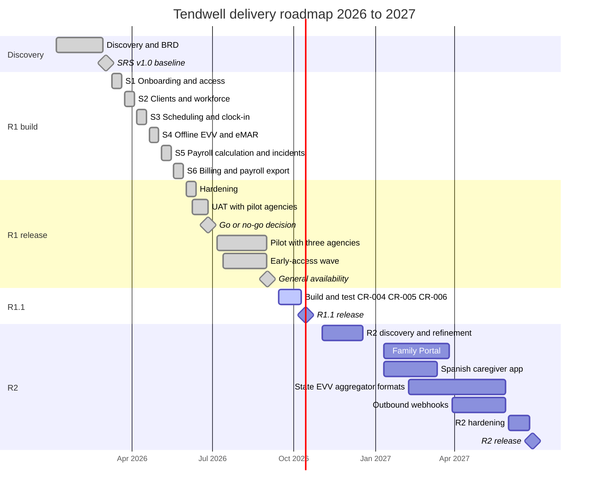

# Product roadmap

## Document control

| Field | Value |
|---|---|
| Document ID | TW-DEL-001 |
| Version | 1.4 |
| Status | Approved |
| Owner | Business Analyst |
| Last updated | 2026-10-01 |
| Reviewers | Product Owner, Engineering Lead, Customer Success Lead, Compliance and Privacy Officer |

## Purpose and scope

This roadmap shows where Tendwell has been and where it is going, from discovery in January 2026 to Release 2 in mid-2027. It records the release goals, the Now / Next / Later view the Product Owner uses with stakeholders, and the timeline. It is outcome-led: every release names the business objectives it moves (OBJ-01 to OBJ-06) and the evidence that will show it worked. Dates after 2026-10-01 are targets, not commitments, and are reviewed monthly.

## Release goals

| Release | Dates | Goal | Scope | How we will know it worked |
|---|---|---|---|---|
| R1 | Pilot go-live 2026-07-06; general availability 2026-09-01 | Run the full value chain, from authorization to verified visit to payroll export and client billing, for three pilot agencies across all three service lines | EP-01 to EP-13: 52 stories, 282 points (SRS v1.2) | Go/no-go criteria met on 2026-06-26; pilot exit review shows OBJ-01 to OBJ-06 trending to target; no open Critical or High security findings |
| R1.1 | Target 2026-10-14 | Close the three gaps the pilot and GA incidents exposed | CR-004 (Low GPS accuracy as a separate exception, precise-location prompt, bulk resolve), CR-005 (database-enforced billing idempotency, pre-issue duplicate check), CR-006 (send-time recipient resolution, no PHI in email bodies); SRS v1.3 | Zero duplicate invoices; iOS Location mismatch rate back within 2x of the 7-day baseline; zero notifications to deactivated users (NFR-OBS-02) |
| R2 | Q1-Q2 2027, target 2027-06-28 | Extend Tendwell to families, state EVV submission, Spanish-speaking caregivers and agency integrations | Family Portal (EP-14: US-053, US-054), state EVV aggregator formats (NFR-CMP-02), Spanish caregiver app (NFR-I18N-01), outbound webhooks | Family call volume to Coordinators down 30% at portal agencies; state-format EVV files accepted without manual edits; caregiver app task completion for Spanish users on par with English |

## Now, Next, Later

Status as of 2026-10-01.

| Horizon | Item | Objective | Confidence | Notes |
|---|---|---|---|---|
| **Now** (October 2026) | R1.1: CR-004 GPS accuracy handling | OBJ-01, OBJ-02 | High | In regression test; the QA device matrix now includes iOS "Precise Location: Off" and Android "Approximate location" |
| **Now** | R1.1: CR-005 billing idempotency | OBJ-04 | High | Interim containment from incident response stays in place until R1.1 ships |
| **Now** | R1.1: CR-006 notification recipients and content | Privacy guardrail | High | Compliance and Privacy Officer signs off the email templates before release |
| **Now** | 90-day KPI readout for pilot agencies | OBJ-01 to OBJ-06 | High | Readout due 2026-10-05, the first business day after 90 days from pilot go-live |
| **Next** (Q1-Q2 2027) | Family Portal (EP-14) | Coordinator workload; OBJ-01 indirectly | Medium | Deferred by CR-003; consent model to be finalized in R2 discovery |
| **Next** | State EVV aggregator formats | Compliance (NFR-CMP-02) | Medium | Depends on state specifications (DEP-04) |
| **Next** | Spanish caregiver app | OBJ-01, OBJ-03 | High | Strings already externalized (NFR-I18N-01); needs translation review by bilingual caregivers such as PER-01 |
| **Next** | Outbound webhooks | Integrations | Medium | Event catalog defined in the API documentation |
| **Later** (H2 2027 onwards) | EDI 837 claims and clearinghouse API | OBJ-04 | Low | Replaces CSV claim batches; needs clearinghouse partner |
| **Later** | Payroll provider API push | OBJ-02 | Low | Still export only; processing stays out of scope (CR-008, ADR-005) |
| **Later** | SSO for agency staff, passkeys | Security | Low | Requested by larger prospects |
| **Later** | Drag-and-drop schedule board and route suggestions | Coordinator productivity | Low | Discovery needed |
| **Later** | Bluetooth vital-sign devices | OBJ-03 | Low | Device certification and procurement questions |

## Timeline

## Key milestones

| Date | Milestone | Evidence |
|---|---|---|
| 2026-03-02 | SRS v1.0 baseline | Signed off by the Product Owner, Engineering Lead, QA Lead, Clinical SME and Compliance and Privacy Officer |
| 2026-04-17 | SRS v1.1 | CR-001, CR-002 and CR-003 approved; R1 scope set at 282 points |
| 2026-05-29 | Build complete (S6 review) | Walking skeleton demonstrated end to end on staging |
| 2026-06-12 | SRS v1.2 | UAT clarifications |
| 2026-06-26 | Go decision with conditions | DEC-11; see the release and sprint plan |
| 2026-07-06 | Pilot go-live | TEN-001, TEN-002 and TEN-003 live |
| 2026-07-13 | Early-access wave | Invite-code sign-up for up to 15 more agencies on pilot terms |
| 2026-09-01 | General availability | Pilot exit review passed; self-service sign-up opened to all agencies |
| 2026-09-24 | SRS v1.3 | CR-004, CR-005 and CR-006 |
| 2026-10-14 | R1.1 release (target) | Regression pass, anomaly alerts verified in production |
| 2027-06-28 | R2 release (target) | To be baselined after R2 discovery |

## What would change this roadmap

- **State EVV specifications** (DEP-04) arriving late would move state formats after the other R2 items; the configurable CSV export continues to serve agencies in the meantime.
- **A new production incident** of SEV-2 or higher would take R1.x priority over R2, as INC-2026-007, INC-2026-011 and INC-2026-015 did for R1.1.
- **Pilot KPI readout**: if OBJ-01 or OBJ-03 is not on track at the 90-day readout, the Product Owner will consider pulling the Spanish caregiver app ahead of the Family Portal, because language is the leading hypothesis for low task completion among bilingual caregivers.
- **Capacity**: R2 assumes the same team and a planned velocity of 48 points per sprint (see the release and sprint plan).

## Related documents

- [Epics](epics.md)
- [Story map](story-map.md)
- [Release and sprint plan](release-and-sprint-plan.md)
- [Change request log](change-request-log.md)
- [RAID log](raid-log.md)
- [Decision log](decision-log.md)
- [Project charter](../01-discovery/project-charter.md)
- [Business requirements document](../02-requirements/BRD.md)
- [Non-functional requirements](../02-requirements/non-functional-requirements.md)
- [Events and webhooks](../04-api/events-and-webhooks.md)
- [Incident management process](../07-operations/incident-management-process.md)
