# Story map

## Document control

| Field | Value |
|---|---|
| Document ID | TW-DEL-002 |
| Version | 1.3 |
| Status | Baselined |
| Owner | Business Analyst |
| Last updated | 2026-09-24 |
| Reviewers | Product Owner, Engineering Lead, UX Designer, QA Lead |

## Purpose and scope

This story map arranges all 54 Tendwell user stories along the end-to-end journey of a care agency, from signing up to auditing its own operations. It was built in the discovery workshops of February 2026 and is used to:

- check that the backlog covers the whole value chain without gaps;
- define the R1 walking skeleton, the thinnest slice that proves the value chain end to end; and
- show what is left for Release 2.

Release slices:

| Slice | Meaning | Stories | Points |
|---|---|---|---|
| R1 walking skeleton | Thinnest slice that takes one HOME_VISIT client from authorization to a Verified visit, a dose record, a payroll export line and a draft invoice, touching every activity | 22 | 144 |
| R1 | Everything else needed for pilot and general availability: edge cases, offline, alerts, open shifts, collections, reporting | 30 | 138 |
| R2 | Family Portal stories plus R2 candidates not yet written as stories | 2 | 11 |

The walking skeleton was the integration target for the S6 sprint review on 2026-05-29: one client, one caregiver and one week of visits flowing through every activity on the staging environment.

## Overview

```mermaid
flowchart LR
    A1["1 Onboard agency<br/>Skeleton 4 | R1 7"] --> A2["2 Admit client<br/>Skeleton 3 | R1 2"]
    A2 --> A3["3 Staff & credential<br/>Skeleton 2 | R1 2"]
    A3 --> A4["4 Schedule<br/>Skeleton 2 | R1 4"]
    A4 --> A5["5 Deliver & verify visit<br/>Skeleton 3 | R1 3 | R2 1"]
    A5 --> A6["6 Medicate & observe<br/>Skeleton 2 | R1 3"]
    A6 --> A7["7 Document & report<br/>Skeleton 1 | R1 2 | R2 1"]
    A7 --> A8["8 Pay staff<br/>Skeleton 2 | R1 1"]
    A8 --> A9["9 Bill & collect<br/>Skeleton 2 | R1 3"]
    A9 --> A10["10 Monitor & audit<br/>Skeleton 1 | R1 3"]
    classDef r2 fill:#fff4e5,stroke:#b26a00,color:#222
    classDef r1 fill:#e8f1fb,stroke:#1f5fa8,color:#222
    class A1,A2,A3,A4,A6,A8,A9,A10 r1
    class A5,A7 r2
```

Numbers in each box are story counts per slice. Activities with an R2 story are shaded orange.

## Backbone summary

| # | User activity | Main persona | Walking skeleton (R1) | R1 | R2 | Points (skeleton / R1 / R2) |
|---|---|---|---|---|---|---|
| 1 | Onboard agency | PER-05 Tom Brennan | US-001, US-003, US-007, US-009 | US-002, US-004, US-005, US-006, US-008, US-010, US-011 | None | 26 / 26 / 0 |
| 2 | Admit client | PER-02 Marcus Hale | US-012, US-013, US-014 | US-015, US-016 | None | 18 / 6 / 0 |
| 3 | Staff & credential | PER-02 Marcus Hale | US-017, US-019 | US-018, US-039 | None | 8 / 8 / 0 |
| 4 | Schedule | PER-02 Marcus Hale | US-020, US-021 | US-022, US-023, US-024, US-040 | None | 16 / 20 / 0 |
| 5 | Deliver & verify visit | PER-01 Rosa Delgado | US-025, US-028, US-029 | US-026, US-027, US-030 | US-054 | 21 / 16 / 3 |
| 6 | Medicate & observe | PER-03 Priya Raman, RN | US-031, US-032 | US-033, US-034, US-035 | None | 13 / 13 / 0 |
| 7 | Document & report | PER-01 Rosa Delgado | US-036 | US-037, US-038 | US-053 | 3 / 10 / 8 |
| 8 | Pay staff | PER-04 Denise Carter | US-041, US-042 | US-043 | None | 18 / 5 / 0 |
| 9 | Bill & collect | PER-04 Denise Carter | US-044, US-045 | US-046, US-047, US-048 | None | 16 / 13 / 0 |
| 10 | Monitor & audit | PER-05 Tom Brennan | US-052 | US-049, US-050, US-051 | None | 5 / 21 / 0 |
| | **Total** | | **22 stories** | **30 stories** | **2 stories** | **144 / 138 / 11** |

## Activities, tasks and stories

### 1. Onboard agency

| User task | Walking skeleton (R1) | R1 | R2 |
|---|---|---|---|
| Sign up and choose a plan | US-001 Register my agency | US-002 Apply a trial or promo code at sign-up | |
| Verify and activate | US-003 Verify my email and complete the setup checklist | | |
| Pay for the subscription | | US-004 Manage my subscription seats and payment method; US-006 Move unpaid tenants to read-only without blocking care | |
| Run pricing (Tendwell Labs) | | US-005 Manage plans and promo codes | |
| Sign in securely | US-007 Sign in with multi-factor authentication | US-008 Reset a forgotten password; US-010 Lock accounts and expire idle sessions | |
| Give staff the right access | US-009 Assign roles and permission overrides | | |
| Allow support access | | US-011 Request time-boxed support access to a tenant | |

### 2. Admit client

| User task | Walking skeleton (R1) | R1 | R2 |
|---|---|---|---|
| Capture the client record | US-012 Admit a new client | | |
| Record what the payer authorized | US-013 Record a service authorization and track remaining units | | |
| Approve the care plan | US-014 Approve a versioned care plan | | |
| Protect PHI | | US-015 Reveal masked PHI with a reason | |
| End services | | US-016 Discharge a client | |

### 3. Staff & credential

| User task | Walking skeleton (R1) | R1 | R2 |
|---|---|---|---|
| Hire and invite a caregiver | US-017 Onboard a caregiver and invite them to the app | | |
| Keep credentials current | | US-018 Track caregiver credentials and expiry | |
| Set pay | US-019 Maintain an effective-dated pay profile | | |
| Plan absences | | US-039 Request time off | |

### 4. Schedule

| User task | Walking skeleton (R1) | R1 | R2 |
|---|---|---|---|
| Build the recurring schedule | US-020 Create a recurring visit pattern | | |
| Check compliance before saving | US-021 See compliance checks before saving a visit | | |
| Change or cancel visits | | US-022 Edit or cancel one visit or a series | |
| Fill gaps | | US-023 Claim an open shift | |
| Watch the day and week | | US-024 Use the schedule board | |
| Cover absences | | US-040 Approve time off and reassign affected visits | |

### 5. Deliver & verify visit

| User task | Walking skeleton (R1) | R1 | R2 |
|---|---|---|---|
| Arrive and clock in | US-025 Clock in at the client's home | | |
| Prove who delivered the visit | | US-026 Confirm my identity with a selfie check | |
| Work without signal | | US-027 Clock in and out without signal | |
| Complete tasks and clock out | US-028 Clock out with tasks and note | | |
| Review and verify visits | US-029 Resolve EVV exceptions with reason codes | US-030 Auto-close visits left open | |
| Keep family informed | | | US-054 Get notified when a visit starts and ends |
| Submit EVV to the state | | | Candidate: state-specific EVV aggregator formats (NFR-CMP-02) |
| Use the app in Spanish | | | Candidate: Spanish caregiver app (NFR-I18N-01) |

### 6. Medicate & observe

| User task | Walking skeleton (R1) | R1 | R2 |
|---|---|---|---|
| Enter and approve orders | US-031 Enter and approve a medication order | | |
| Give scheduled doses | US-032 Document a scheduled dose | | |
| Catch missed doses | | US-033 Be alerted to missed and repeatedly refused doses | |
| Give as-needed doses | | US-034 Give a PRN dose safely | |
| Watch vital signs | | US-035 Record vitals and trigger out-of-range alerts | |

### 7. Document & report

| User task | Walking skeleton (R1) | R1 | R2 |
|---|---|---|---|
| Write the visit note | US-036 Write a visit note that locks after 24 hours | | |
| Report an incident | | US-037 Report a client incident from the field | |
| Investigate and close | | US-038 Investigate and close a client incident | |
| Share visits with family | | | US-053 View my relative's visits |

### 8. Pay staff

| User task | Walking skeleton (R1) | R1 | R2 |
|---|---|---|---|
| Calculate pay | US-041 Calculate pay-period hours and pay lines | | |
| Review and export | US-042 Review and export payroll | | |
| Correct after export | | US-043 Carry late changes into the next period as adjustments | |

### 9. Bill & collect

| User task | Walking skeleton (R1) | R1 | R2 |
|---|---|---|---|
| Run billing | US-044 Run monthly billing safely | | |
| Price visits | US-045 Price visits by billing model and authorization cap | | |
| Collect private pay | | US-046 Collect private-pay invoices online | |
| Submit claims | | US-047 Export a payer claim batch | |
| Correct invoices | | US-048 Issue a credit note | |

### 10. Monitor & audit

| User task | Walking skeleton (R1) | R1 | R2 |
|---|---|---|---|
| Get notified | | US-049 Choose notification channels and respect quiet hours | |
| Escalate urgent events | | US-050 Configure escalation ladders | |
| Watch operations | | US-051 See the operations dashboard and standard reports | |
| Audit access and changes | US-052 Search and export the audit log | | |
| Connect agency systems | | | Candidate: outbound webhooks ([events and webhooks](../04-api/events-and-webhooks.md)) |

## Walking skeleton end-to-end check

The walking skeleton is accepted when this scenario runs on staging with synthetic data and every step is traceable in the audit log:

1. Tom Brennan registers "Harborview Home Care LLC", verifies his email, signs in with MFA and gives Marcus Hale the AG-COORD role (US-001, US-003, US-007, US-009).
2. Marcus admits client C-10234, records T1019 authorization PA-2026-55871 and Priya Raman approves care plan version 1 (US-012, US-013, US-014).
3. Marcus onboards Rosa Delgado and Denise Carter sets her pay profile (US-017, US-019).
4. Marcus creates a Monday-Wednesday-Friday pattern; compliance checks pass (US-020, US-021).
5. Rosa clocks in inside the 150 m geofence, gives and documents the 08:00 Lisinopril dose, writes the note and clocks out (US-025, US-031, US-032, US-036, US-028).
6. One visit has a Late start exception that Marcus resolves; all visits become Verified (US-029).
7. Denise calculates the pay period and exports the payroll CSV; she runs billing and gets one draft invoice priced in 15-minute units (US-041, US-042, US-044, US-045).
8. Tom finds every step above in the audit log (US-052).

## Gaps and candidates reviewed

| Gap found while mapping | Decision |
|---|---|
| No story for importing pilot data | Handled as a Customer Success migration task (DEP-03), not product scope in R1 |
| Family visibility had no R1 story after CR-003 | Accepted; EP-14 moved to R2 (DEC-09) |
| No story for state EVV submission | R1 relies on the configurable aggregator CSV in the EVV compliance report (NFR-CMP-02); state formats are an R2 candidate |
| No story for payroll processing | Out of scope by decision (ADR-005, CR-008) |

## Related documents

- [Epics](epics.md)
- [Product roadmap](product-roadmap.md)
- [Release and sprint plan](release-and-sprint-plan.md)
- [User stories, EP-01 to EP-14](user-stories/EP-01-agency-onboarding.md)
- [Personas](../01-discovery/personas.md)
- [Current vs future state](../01-discovery/current-vs-future-state.md)
- [Discovery workshop notes](../01-discovery/discovery-workshop-notes.md)
- [Process flows](../03-design/diagrams/process-flows.md)
