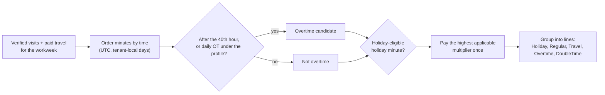

# Defect report example: DEF-019

## Document control

| Field | Value |
|---|---|
| Document ID | TW-QA-05 |
| Version | 1.1 |
| Status | Closed |
| Owner | Business Analyst (report written with the QA Engineer who raised the defect) |
| Last updated | 2026-06-12 |
| Reviewers | QA Lead, Engineering Lead, Product Owner, Compliance and Privacy Officer |

| Version | Date | Change |
|---|---|---|
| 1.0 | 2026-06-09 | Raised, analyzed, fixed and retested |
| 1.1 | 2026-06-12 | Requirement clarification baselined in SRS v1.2; decision table added to business rules |

## Purpose and scope

This is a complete defect report, kept as the reference example for the team. It follows the incident report content of ISO/IEC/IEEE 29119-3 (identification, context, description, impact, urgency, root cause, resolution and closure). DEF-019 was found in SIT cycle 1. It is a good example because the code fix was only half the answer: the business rule that would have prevented it was implied by a worked example but never stated. The full defect list is in [defect-log.csv](defect-log.csv).

## 1. Identification

| Field | Value |
|---|---|
| Defect ID | DEF-019 |
| Title | Holiday hours paid an overtime premium on top of the holiday premium; overtime attributed to the Monday holiday hours instead of the last hours of the workweek |
| Module | PAY (Payroll Preparation) |
| Severity / priority | S2 Major / P1 |
| Status | Closed |
| Found in | SIT cycle 1 |
| Raised | 2026-06-02 10:15 by the QA Engineer |
| Assigned | Backend developer (payroll engine) |
| Linked test cases | TC-PAY-003 (failed), TC-PAY-004 (added after this defect) |
| Linked requirements | FR-PAY-02; business rules BR-041, BR-042; story US-041 |
| Root cause category | Code (contributing factor: requirement gap in allocation order) |
| Closed | 2026-06-09 (retest passed); clarification baselined 2026-06-12 |

## 2. Summary

For caregiver E-2041, whose workweek of 2026-09-07 to 2026-09-13 starts with the Labor Day holiday and ends with 3.0 hours of overtime on Sunday, the pay-period summary put the overtime on Monday's holiday hours and paid those hours at 2.25x ($43.88 per hour) instead of 1.5x. Sunday's last 3.0 hours, which are the real overtime, were paid as regular time. Total wages were $940.89 instead of $926.25, an overpayment of $14.64, and the payroll record showed overtime on the wrong day.

## 3. Environment

| Item | Value |
|---|---|
| Environment | staging |
| Build | v1.0.0-rc.2 (API 1.0.0-rc.2+sha.4f2a9c1) |
| Tenant | TEN-001 Harborview Home Care (UAT copy), seed profile `base` |
| Virtual clock | 2026-09-14 06:00 America/New_York (the day after the workweek ends) |
| Tenant settings | Weekly overtime profile (daily profile Off); holiday multiplier 1.5; mileage $0.70 |
| Client | Postman collection, Payroll folder; Agency Web App, Payroll > Pay periods |

## 4. Test data

| Record | Value |
|---|---|
| Caregiver | E-2041 Maya Ortiz; pay profile PPR-0001: Hourly $19.50, OT-, holiday- and mileage-eligible |
| Holiday | H-001 Labor Day, 2026-09-07 |
| Pay period | PP-T1-2026-08-31 (2026-08-31 to 2026-09-13, bi-weekly) |
| Visits | VIS-0001 to VIS-0013, all Verified: 40.5 h, of which 6.0 h on Monday 2026-09-07 08:00-14:00 (VIS-0001) and 4.5 h on Sunday 2026-09-13 08:00-12:30 (VIS-0013) |
| Travel | 6 legs from `distance_matrix_stub.csv`: 150 min paid, 46.2 miles |
| Oracle | `test-data/expected_payroll_E-2041_2026-09-07.csv` |

## 5. Steps to reproduce

1. Load the seed (`base`) and set the TEN-001 virtual clock to 2026-09-14 06:00.
2. Confirm VIS-0001 to VIS-0013 are Verified and have no open exception.
3. As the Billing & Payroll Specialist, call `GET {{baseUrl}}/pay-periods/{PP-T1-2026-08-31}/summary?caregiverId={E-2041}`.
4. Compare the lines for E-2041 with the oracle file.
5. Open the overtime line's source visits in the web app (Payroll > Pay periods > E-2041 > Overtime).

## 6. Expected and actual results

| Line | Expected hours | Expected rate | Expected amount | Actual hours | Actual rate | Actual amount |
|---|---|---|---|---|---|---|
| Holiday | 6.00 | $29.25 | $175.50 | 3.00 | $29.25 | $87.75 |
| Regular | 31.50 | $19.50 | $614.25 | 34.50 | $19.50 | $672.75 |
| Travel | 2.50 | $19.50 | $48.75 | 2.50 | $19.50 | $48.75 |
| Overtime | 3.00 (Sun 09:30-12:30, VIS-0013) | $29.25 | $87.75 | 3.00 (Mon 11:00-14:00, VIS-0001) | $43.88 | $131.64 |
| **Total wages** | **43.00** | | **$926.25** | **43.00** | | **$940.89** |
| Mileage (not wages) | 46.2 mi | $0.70 | $32.34 | 46.2 mi | $0.70 | $32.34 |
| **Total payable** | | | **$958.59** | | | **$973.23** |

**Variance:** +$14.64 in wages (+1,464 cents). The actual overtime rate is $19.50 x 1.5 x 1.5 = $43.875, stored as 4,388 cents; 3.00 h x 4,388 = 13,164 cents. Total hours still balance at 43.00, which is why the engine's hours-reconciliation check did not catch the error.

Response excerpt (actual):

```json
{
  "employeeNumber": "E-2041",
  "lines": [
    { "lineType": "Holiday",  "quantity": 3.0,  "rateCents": 2925, "amountCents": 8775,  "sourceVisitIds": ["d0000000-0000-4000-8000-000000000001"] },
    { "lineType": "Overtime", "quantity": 3.0,  "rateCents": 4388, "amountCents": 13164, "sourceVisitIds": ["d0000000-0000-4000-8000-000000000001"] },
    { "lineType": "Regular",  "quantity": 34.5, "rateCents": 1950, "amountCents": 67275 },
    { "lineType": "Travel",   "quantity": 2.5,  "rateCents": 1950, "amountCents": 4875 },
    { "lineType": "Mileage",  "quantity": 46.2, "rateCents": 70,   "amountCents": 3234 }
  ],
  "totals": { "hoursWorked": 43.0, "wagesCents": 94089, "reimbursementCents": 3234, "payableCents": 97323 }
}
```

## 7. Severity and priority justification

**Severity S2 (Major).** A core business rule (BR-042, no stacking) is broken, and overtime is recorded on the wrong day. This affects every caregiver who is both overtime-eligible and holiday-eligible and works more than 40 hours in a week that contains a tenant holiday. TEN-001 has 7 holidays a year. In this example the error overpays the caregiver; the same allocation order also misstates when overtime was worked, which matters for the agency's payroll records. It is not S1 because no PHI is exposed, no data is lost, the scope is limited to holiday weeks, and a workaround exists: the specialist can correct the lines through an adjustment before export.

**Priority P1.** The defect fails the canonical acceptance example for US-041. That example is UAT-10 and the payroll KPI evidence for OBJ-02. The fix touches the core allocation algorithm and needs a full payroll regression before UAT starts on 2026-06-11. Waiting for a later build would have pushed the payroll retest into UAT.

## 8. Root cause

| Why | Finding |
|---|---|
| Why was overtime put on Monday? | The overtime allocator took the last 180 minutes from a list of work segments sorted by premium multiplier (ascending). It reused a list built for the earnings preview, so the holiday segment (1.5x) sat at the end, and its last 3 hours (11:00-14:00) were treated as the last 3 hours of the week. |
| Why 2.25x? | The premium composer multiplied every applicable multiplier (1.5 x 1.5) instead of selecting the highest one. |
| Why did tests not catch it earlier? | Unit tests covered overtime weeks and holiday weeks separately; no test had both in one week. The canonical example, which has both, existed only in the SIT seed. |
| Why did the developer not know the allocation order? | The rule text said "hours worked over 40 in the tenant's workweek" (BR-041) and "a minute that is both overtime and holiday is paid at the higher multiplier only" (BR-042). The fact that overtime is the **last hours in time order** appeared only in the worked example ("Overtime is the last 3.0 h chronologically, on Sunday"), and nothing defined how to choose a premium minute by minute. |

**Root cause category: Code**, with a contributing requirement gap. The rule implied chronological allocation but did not state it, and no decision table defined premium selection.

## 9. Fix

| Change | Detail |
|---|---|
| Allocation | The engine walks worked minutes in chronological order (UTC, attributed to tenant-local days) and marks minutes after the 2,400th as weekly-overtime candidates. Time off is excluded from the count (BR-040). |
| Premium selection | Per minute, the multiplier is the maximum of the applicable premiums; a tie between holiday and overtime is reported on the Overtime line. |
| Invariants | The engine asserts that no minute carries two premiums and that the amount is at most hours x base rate x the highest multiplier. A breach fails the calculation instead of producing a payroll line. |
| Line building | Lines are grouped by line type and rate after premiums are chosen, so an earnings preview can never feed allocation again. |
| Delivery | Pull request reviewed by the Engineering Lead; merged 2026-06-05; deployed in v1.0.0-rc.3 on 2026-06-08. |

## 10. Retest and regression

| Date | Build | Test | Result |
|---|---|---|---|
| 2026-06-08 | v1.0.0-rc.3 | TC-PAY-003: E-2041 lines against the oracle | Pass: 5 of 5 lines exact; wages 92,625 cents; payable 95,859 cents |
| 2026-06-08 | v1.0.0-rc.3 | TC-PAY-004: engine cases PR-01 to PR-05 | Pass (PR-02 $828.00; the defective engine gives $855.00) |
| 2026-06-09 | v1.0.0-rc.3 | Full payroll regression (11 PAY cases) in SIT cycle 2 | Pass |
| 2026-06-16 | v1.0.0-rc.4 | UAT-10 Labor Day pay period | Pass; matched the agency's spreadsheet to the cent |

**Regression tests added:**

- **TC-PAY-004:** the premium decision table as engine cases PR-01 to PR-05 in `api-fixtures.json`. These include the holiday-on-the-last-day week (PR-02) that reproduces this defect at a $18.00 base rate.
- **Property-based unit test:** 10,000 random weeks (visits, travel, holidays, eligibility flags, both overtime profiles) checked against the invariants in section 9.
- **CI oracle check:** every build compares the pay-period summary for E-2041 with `expected_payroll_E-2041_2026-09-07.csv`.

## 11. Requirement clarification by the Business Analyst

The Business Analyst treated the missing allocation rule as a requirement gap in its own right. A code fix alone would leave the next change to the payroll engine exposed to the same misreading.

1. **Options.** On 2026-06-04 the BA wrote two options with worked examples: (a) overtime is the last hours of the week in time order; (b) overtime is assigned to whichever hours give the lowest cost. Option (b) would have let an engine move overtime away from holidays. The BA showed that it misstates when overtime was worked, and that it is not how the agencies' current payroll providers report overtime.
2. **Decision.** The Product Owner chose option (a), with the Engineering Lead and the Compliance and Privacy Officer consulted. The decision is recorded in the [decision log](../05-delivery/decision-log.md). Tendwell's pay rules are designed to support FLSA overtime and holiday-pay practices; each agency remains responsible for its own pay policies.
3. **Rule text.** A note was added to BR-041 in the SRS: "Overtime minutes are the minutes worked after the 40th hour of the workweek, counted in chronological order in the tenant's time zone. Time off does not count toward the 40 hours."
4. **Decision table.** The following table was added to [business rules](../02-requirements/business-rules.md) under BR-041 and BR-042. It was baselined in SRS v1.2 on 2026-06-12 and also covers the daily profile from CR-001.

**Premium selection per worked minute (visit or travel time)**

| Condition / action | R1 | R2 | R3 | R4 | R5 | R6 |
|---|---|---|---|---|---|---|
| Minute falls on a tenant holiday and the caregiver is holiday-eligible | N | Y | N | Y | N | Y |
| Minute is overtime: after the 40th weekly hour, or after the 8th daily hour under the daily profile; caregiver OT-eligible | N | N | Y | Y | - | - |
| Minute is after the 12th daily hour under the daily profile; caregiver OT-eligible | N | N | N | N | Y | Y |
| **Multiplier paid** | 1.0 | 1.5 | 1.5 | **1.5 (once)** | 2.0 | 2.0 |
| **Line** | Regular or Travel | Holiday | Overtime | Overtime | DoubleTime | DoubleTime |

Notes on the table:

- R4 is the case DEF-019 got wrong: the multipliers tie, the minute is paid once at 1.5x and reported as Overtime.
- R6: the higher multiplier wins.
- Travel minutes follow the same rows; a travel minute with no premium stays on the Travel line.
- Under the daily profile, minutes paid as daily overtime or double time do not count toward the weekly 40 hours (clarified with DEF-025).

5. **Acceptance criteria.** US-041 gained a Scenario Outline with one row per decision-table rule, and TC-PAY-004 executes the same rows.



## 12. Timeline

| Date and time | Event |
|---|---|
| 2026-06-02 10:15 | Raised by the QA Engineer from TC-PAY-003 in SIT cycle 1 |
| 2026-06-03 09:30 | Daily triage: S2 confirmed, P1 set by the Product Owner; assigned to the payroll engine developer |
| 2026-06-03 | Root cause found; Business Analyst informed of the allocation-order question |
| 2026-06-04 | BA options paper; decision by the Product Owner |
| 2026-06-05 | Fix merged with the decision-table engine cases |
| 2026-06-08 | Deployed in v1.0.0-rc.3; TC-PAY-003 and TC-PAY-004 pass (within the 3-business-day S2 target from triage) |
| 2026-06-09 | Payroll regression passed in SIT cycle 2; defect closed |
| 2026-06-12 | SRS v1.2 baselined with the BR-041 note and the decision table |

## 13. Lessons applied

- Any business rule that combines two or more conditions now gets a decision table in the business rules catalog before development starts. The BA applied this to BR-041/BR-042 and to the scheduling compliance checks (BR-009, BR-010, BR-014, BR-016, BR-017, BR-039).
- Worked examples in the SRS are turned into oracle files and run in CI from the first sprint that touches the rule, not first in SIT.
- An hours check that balances is not evidence that the money is right; payroll tests assert amounts and source visits per line.

## Related documents

- [Defect log](defect-log.csv)
- [Test strategy and plan: defect management](test-strategy-and-plan.md#7-defect-management)
- [Test cases guide (featured TC-PAY-003 and TC-PAY-004)](test-cases.md)
- [Test data and payroll oracle](test-data/README.md)
- [Business rules](../02-requirements/business-rules.md)
- [Software requirements specification](../02-requirements/SRS.md)
- [Payroll user stories](../05-delivery/user-stories/EP-10-payroll.md)
- [ADR-005 Payroll export, not processing](../03-design/architecture/adr/ADR-005-payroll-export-not-processing.md)
- [Decision log](../05-delivery/decision-log.md)
- [UAT plan and scripts (UAT-10)](uat-plan-and-scripts.md)
