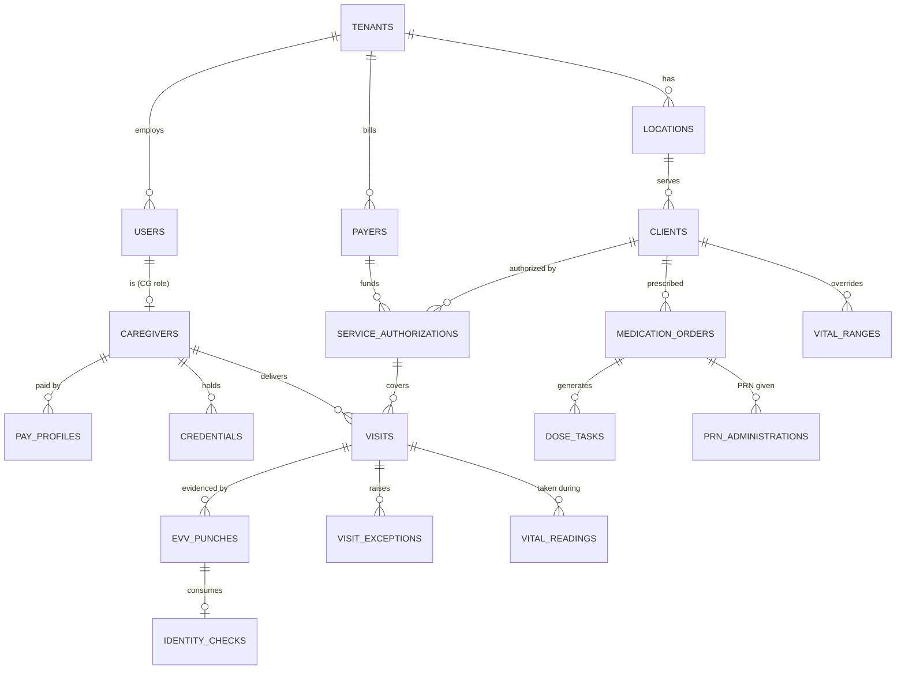

# Synthetic test data set

## Document control

| Field | Value |
|---|---|
| Document ID | TW-QA-04 |
| Version | 1.3 |
| Status | Baselined |
| Owner | Business Analyst |
| Last updated | 2026-09-28 |
| Reviewers | QA Lead, Engineering Lead, Compliance and Privacy Officer, Clinical SME (RN advisor) |

| Version | Date | Change |
|---|---|---|
| 1.0 | 2026-05-22 | Seed for SIT: pilot tenants, canonical payroll and billing records |
| 1.1 | 2026-06-12 | UAT additions: adult-day attendance, supported-living proration, evening dose timeline |
| 1.2 | 2026-08-28 | Low-accuracy and Precise Location Off punches after INC-2026-011 |
| 1.3 | 2026-09-28 | Authorization-cap scenario, deactivated escalation recipient (INC-2026-015), API fixtures for the R1.1 Postman collection |

## Purpose and scope

This folder holds the synthetic data set used by every test level after unit tests: the API collection, SIT, UAT rehearsal, and the regression suite in [test-cases.csv](../test-cases.csv). Each record exists for a reason; the tables below say which test cases use it and which edge case it pins down. Expected outputs for the two canonical worked examples (US-041 payroll and US-045 hourly billing) are included as files, so tests compare against an oracle instead of re-deriving numbers by hand.

Ground rules:

- **Synthetic only.** No production PHI is ever copied, masked or sampled into any non-production environment. Defects that need real data are reproduced with synthetic records (see [deployment and security](../../03-design/architecture/deployment-and-security.md)).
- **Anonymization.** Phones are in the fictional range +1-614-555-01xx; emails use `@example.com` (agency users) or `@example.org` (Tendwell Labs staff); Medicaid IDs are `ZZ` plus 8 digits; addresses are on fictional streets in Lakemont, OH 43999; EINs are placeholders. People, agencies and prescribers are fictional.
- **One clock.** The data describes the world **as of 2026-09-15 08:30 America/New_York**. Timestamps are written in local ISO 8601 with offset (for example `2026-09-15T08:30:00-04:00`); the loader stores them in UTC (NFR-DAT-01). Tests that need another time move the tenant's virtual clock, a non-production test-harness control that is absent from production builds.
- **Validated.** `validate_test_data.py` checks keys, foreign keys, same-tenant references, recomputed GPS distances, credential statuses, dose windows, vital flags, expected totals, anonymization formats and the Postman collection. It must pass before any seed is published.

## Load, scenarios and validation

| Item | Detail |
|---|---|
| Validate | `python3 06-quality/test-data/validate_test_data.py` from the repo root (standard library only; 2,190 checks at v1.3) |
| Seed profiles | `base` loads every row whose `seed_scenario` is `base` or empty. `auth-cap` loads SA-1002 instead of SA-1001 and points C-10234's visits at it (cap test, TC-BIL-004, TC-SCH-004) |
| Input-only rows | `clients.csv` rows with `seed_mode = input-only` (C-10302) are request bodies, never pre-loaded |
| Derived rows | For seeded Verified visits without punch rows (adult-day attendance), the loader writes In and Out punches from `actual_start` and `actual_end` at the location's coordinates |
| Reset | Every test that writes data (clock-ins, billing runs, approvals) runs on a fresh seed or resets the records it names; BVA tests reset the listed visit between iterations |
| Virtual clock for the API collection | Pin TEN-001 and TEN-003 to 2026-09-15T08:55:00-04:00, then run [the Postman collection](../api-tests/tendwell.postman_collection.json) |

### Record keys and UUIDs

Data files use readable keys (C-10234, VIS-0201). The API uses UUIDs, so the loader assigns a deterministic UUID to every key: `<prefix>-0000-4000-8000-<digits of the key, zero-padded to 12>`. A `T` in a sandbox key becomes `9` (TEN-T01 becomes 901).

| Entity | Prefix | Example |
|---|---|---|
| Tenant | `7e000000` | TEN-001 = `7e000000-0000-4000-8000-000000000001` |
| Client | `c1000000` | C-10234 = `c1000000-0000-4000-8000-000000010234` |
| Caregiver | `ca000000` | E-2041 = `ca000000-0000-4000-8000-000000002041` |
| Visit | `d0000000` | VIS-0201 = `d0000000-0000-4000-8000-000000000201` |
| Dose task / medication order | `d0500000` / `3e000000` | DT-0003, MO-0011 |
| Pay period | `9a000000` | PP-T1-2026-08-31 = `9a000000-0000-4000-8000-000120260831` |

Other prefixes (users, locations, payers, authorizations, punches, identity checks, exceptions, PRN, vitals, credentials, pay profiles, holidays) follow the same pattern; the generator and the validator share one table.

### How the files relate

## Files

| File | Rows | What it holds |
|---|---|---|
| `tenants.csv` | 5 | 3 pilot tenants plus 2 sandboxes (Trial and Read-only), with the settings tests depend on: pay frequency, identity verification, open-shift confirmation, mileage rate |
| `locations.csv` | 9 | Lakemont North and Lakemont South (TEN-001), the adult day center, 3 supported-living homes and the TEN-003 community office |
| `users.csv` | 32 | Users per tenant and role, including a deactivated coordinator, an invited user, a lockout account, and 2 platform users |
| `caregivers.csv` | 12 | Caregiver profiles with device model and OS for the device matrix, and the PTO balance on 2026-08-31 |
| `pay_profiles.csv` | 13 | Effective-dated pay profiles (BR-015), including a rate change and the OT-ineligible and salaried branches |
| `credentials.csv` | 22 | Credentials with status, days to expiry and reminder due on 2026-09-15 |
| `payers.csv` | 7 | Medicaid, managed care, LTC insurance and private pay |
| `clients.csv` | 20 | Clients across all three service lines, including the canonical C-10234 |
| `service_authorizations.csv` | 21 | Authorizations for every billing model; utilization and expiry edge cases |
| `holidays.csv` | 6 | Tenant holidays (Labor Day 2026-09-07 drives the canonical payroll example) |
| `pay_periods.csv` | 8 | Weekly, bi-weekly and semi-monthly periods; one Locked period |
| `visits.csv` | 65 | All seven visit statuses; the E-2041 canonical week; EVV, scheduling, billing and DST scenarios |
| `evv_punches.csv` | 61 | Punch ledger with server-computed distances, identity-check links, a Manual correction and a System auto-close |
| `identity_checks.csv` | 44 | Passed identity checks consumed by TEN-001 Mobile punches (TEN-001 has identity verification On) |
| `visit_exceptions.csv` | 7 | Open and resolved exceptions behind every Needs review visit |
| `distance_matrix_stub.csv` | 4 | Road miles and drive minutes returned by the maps stub for the E-2041 travel legs |
| `medication_orders.csv` | 11 | Scheduled and PRN orders with windows from 15 to 120 minutes; pending, active and discontinued |
| `dose_tasks.csv` | 15 | All eight dose statuses, including Refused twice in a row, Missed - undocumented and a Late entry |
| `prn_administrations.csv` | 6 | PRN history that puts one order at its interval limit and another at its 24-hour maximum |
| `vital_ranges.csv` | 2 | Per-client overrides of the BR-034 defaults |
| `vital_readings.csv` | 19 | Vital readings on both sides of every BR-034 threshold, each with its expected out-of-range flag |
| `expected_payroll_E-2041_2026-09-07.csv` | 5 | Oracle for TC-PAY-003: the canonical pay lines |
| `expected_billing_C-10234_2026-09.csv` | 9 | Oracle for TC-BIL-003 and TC-BIL-004: uncapped and capped invoices |
| `api-fixtures.json` | n/a | Request bodies used by the Postman collection, plus engine-level cases for pay rules, travel, merging and DST |
| `validate_test_data.py` | n/a | Validator for this folder and the Postman collection |

## Records and the edge cases they exist for

### Tenants and users

| Record | Edge case | Used by |
|---|---|---|
| TEN-001 Harborview Home Care | Bi-weekly pay (Monday start), identity verification On, Coordinator confirmation of open-shift claims On | Most TEN-001 tests |
| TEN-002 Cedar Lane Adult Day Center | Tenant B for every cross-tenant test; identity verification Off | TC-IAM-007, TC-NFR-008, TC-BIL-005 |
| TEN-003 Northgate Supported Living | Semi-monthly pay; two service lines; eMAR and DST scenarios | TC-MAR-*, TC-NFR-011 |
| TEN-T01 (Trial) and TEN-T02 (Read-only since 2026-09-08) | Trial ends 2026-09-22; Read-only starts 7 days after trial expiry, EVV still allowed | TC-ONB-001 to TC-ONB-005, TC-NFR-016 |
| U-1002 Marcus Hale (AG-COORD, Lakemont North) | Default API token; holds `clients:reveal_phi`; location-scoped lists | TC-CLI-006, TC-IAM-006, Postman |
| U-1005 Lena Marsh (AG-COORD, Deactivated 2026-09-01) | Was an active coordinator when the incident escalation ladder was configured; must never be notified | TC-NTF-003 (INC-2026-015 regression), TC-WRK-004 |
| U-1006 Andre Whitlock (AG-COORD, Lakemont South) | Location scoping; Deny override on `clients:reveal_phi` | TC-IAM-005, TC-IAM-006, TC-CLI-006 |
| U-1007 Iris Feld | Dedicated lockout and timeout account | TC-IAM-003 |
| U-1008 Noah Brandt (Invited) | Invitation not yet accepted | TC-WRK-001 |
| U-2002 Owen Baptiste (TEN-002 AG-COORD) | Source of `tenantBAccessToken` (no MFA, so it can sign in from CI) | TC-IAM-007, Postman Security folder |
| U-9001, U-9002 | Platform Administrator and Platform Support Agent | TC-ONB-006, TC-IAM-008 |

MFA is enabled for every Active user whose role is AG-ADM, AG-SUPV, AG-FIN or a platform role (BR-006); the validator enforces it.

### Caregivers, pay profiles and credentials

| Record | Edge case | Used by |
|---|---|---|
| E-2041 Maya Ortiz | Canonical payroll week; $19.50 to 2026-09-13 (PPR-0001), $20.25 from 2026-09-14 (PPR-0002, US-019-AC2); PTO 79.00 h so accrual hits the 80 h cap | TC-PAY-003, TC-WRK-005, TC-TOF-003 |
| E-2017 Rosa Delgado | Android 12 (PER-01); CPR expires 2026-09-29 (14-day reminder); manual time correction on VIS-0105 | TC-WRK-004, TC-EVV-010 |
| E-2029 Kevin Tran | Deactivated 2026-09-04; his future visits are open shifts VIS-0114 and VIS-0115 | TC-WRK-006, TC-SCH-006 |
| E-2033 Aisha Bello | iPhone for Precise Location Off; TB expires in exactly 30 days (Expiring) | TC-EVV-004, TC-WRK-002 |
| E-2045 Daniel Reyes | CPR expires in 1 day (CRD-0008); TB in 31 days (CRD-0009, still Valid) | TC-WRK-002, TC-WRK-004 |
| E-2052 Grace Whitaker | Expired Blocking CPR (2026-08-31): hard block on new visits; VIS-0116 flagged | TC-WRK-003, TC-SCH-006 |
| E-2088 Jordan Pike | Not OT-eligible and not mileage-eligible (PPR-0008); excluded by C-10320; expired Advisory credential | TC-CLI-008, TC-PAY-007, TC-TOF-002 |
| E-1102 Brenda Okafor | Salaried (pay type Salaried, annual rate) | TC-PAY-001 |
| E-3108 Malik Johnson | Overnight shifts across DST; $17.50 so 9.00 h = $157.50 | TC-NFR-011 |
| E-3112 Sofia Petrova | Android 10, the minimum supported OS; offline sync scenarios | TC-EVV-007, TC-NFR-012 |

Credential status on 2026-09-15: Valid when more than 30 days remain, Expiring at 30 days or fewer (including the expiry day), Expired from the day after. The file stores the expected status and whether a 30-, 14- or 1-day reminder is due that day.

### Clients and authorizations

| Record | Edge case | Used by |
|---|---|---|
| C-10234 | Canonical client: DOB 1948-04-11, Medicaid ID ZZ48105522, 418 Birchwood Lane, geofence 150 m; masks to `ZZ****5522` and `+1-614-555-**87`; billing visits A, B and C | TC-CLI-006, TC-BIL-003, TC-IAM-007 |
| SA-1001 (PA-2026-55871) | 480 T1019 units at $7.25, 2026-09-01 to 2026-11-30; 24 used, 456 remaining | TC-CLI-003, TC-BIL-003 |
| SA-1002 (PA-2026-41207, scenario `auth-cap`) | 460 of 480 units billed June-August, 20 remain for September | TC-BIL-004, TC-SCH-004 |
| C-10251 / SA-1003 | Exactly 90.0% utilized (304 before seed + 48 delivered + 8 scheduled = 360 of 400): boundary, flagged | TC-CLI-004 |
| C-10262 / SA-1004 | Managed-care S5125 authorization ending 2026-09-25 (10 days): flagged; 14/15-day boundary by clock | TC-CLI-004, TC-EVV-003, TC-EVV-005 |
| C-10278 / SA-1005, SA-1006 | Expired predecessor and Active successor | TC-SCH-004 |
| C-10295 | 50 m geofence (high-rise apartment) | TC-EVV-003 |
| C-10301 and C-10302 | Existing Ruth Kimball and an input-only duplicate candidate with the same name and DOB | TC-CLI-002 |
| C-10312 | Discharged 2026-08-28 ("Moved to skilled nursing facility"), read-only, retained to 2033-08-28 | TC-CLI-007 |
| C-10320 | Excludes E-2088 ("Family declined"), prefers E-2017 | TC-CLI-008, TC-SCH-006 |
| C-10333 | Home eMAR: furosemide held for systolic 88; atorvastatin pending approval; a Missed visit | TC-MAR-001, TC-MAR-003 |
| C-10347 | SpO2 low limit overridden to 88% (COPD) | TC-MAR-008 |
| C-10358 / SA-1014 | Private pay, $95.00 per Verified visit; payment link and discharge tests | TC-BIL-005, TC-BIL-009, TC-CLI-007 |
| C-20011 / SA-2001 | Adult day S5102 at $78.00: 14 attendance days in August 2026, two check-ins on 2026-08-19 | TC-BIL-005 |
| C-20018 / SA-2002 | Only authorization is Suspended: scheduling is a hard block | TC-SCH-004 |
| C-30007 / SA-3001 | Supported living admitted 2026-09-10 at $6,200.00 per month: 21 of 30 days | TC-BIL-005 |
| C-30015 | eMAR resident with 8 orders covering every dose status | TC-MAR-002 to TC-MAR-009 |
| C-30029 | Vital BVA readings; glucose high limit overridden to 250 mg/dL; amoxicillin discontinued after a rash | TC-MAR-008 |

### Visits (all seven statuses)

| Status | Count | Notable records |
|---|---|---|
| Verified | 38 | VIS-0001 to VIS-0013 (E-2041 week), VIS-0105 (corrected), VIS-0110, VIS-0119, VIS-0120, VIS-2001 to VIS-2015 (adult day), TEN-003 shifts |
| Needs review | 5 | VIS-0101 (212 m), VIS-0102 (95 m at 3,400 m), VIS-0106 (auto-closed), VIS-0111 (51 m at 50 m radius), VIS-3006 (late sync) |
| Scheduled | 16 | VIS-0201 to VIS-0206 and VIS-3013 (API and BVA runs), VIS-0113 to VIS-0118, VIS-3001 and VIS-3002 (DST), VIS-3014 |
| In progress | 2 | VIS-0107, VIS-3005 |
| Completed | 1 | VIS-0108 (verification not yet run) |
| Cancelled | 2 | VIS-0014 ("Client request"), VIS-0112 ("Client discharged") |
| Missed | 1 | VIS-0109 |

The E-2041 week (Monday 2026-09-07 to Sunday 2026-09-13) has 13 Verified visits totaling 40.5 h, 6.0 h of them on Labor Day, and 6 same-day travel legs:

| Leg | Gap | Drive (stub) | Paid travel | Miles |
|---|---|---|---|---|
| VIS-0002 to VIS-0003 | 33 min | 18 min | 28 min | 8.4 |
| VIS-0004 to VIS-0005 | 30 min | 20 min | 30 min | 9.6 |
| VIS-0006 to VIS-0007 | 25 min | 18 min | 25 min | 8.4 |
| VIS-0007 to VIS-0008 | 30 min | 15 min | 25 min | 6.8 |
| VIS-0009 to VIS-0010 | 25 min | 20 min | 25 min | 9.6 |
| VIS-0011 to VIS-0012 | 30 min | 7 min | 17 min | 3.4 |
| **Total** | | | **150 min = 2.50 h** | **46.2** |

Hours worked reach 40.0 at 09:30 on Sunday 2026-09-13, so overtime is VIS-0013 from 09:30 to 12:30.

### EVV punches, identity checks and exceptions

| Record | Edge case |
|---|---|
| PCH-0003 (VIS-0002 In) | Canonical 40.0 m at 12 m accuracy: no exception |
| VIS-0101 In | 212.0 m at 18 m: LOCATION_MISMATCH (EXC-0001, Open) |
| VIS-0102 In | 95.0 m at 3,400 m, iOS Precise Location Off: LOW_GPS_ACCURACY (EXC-0002, Open), not a mismatch (CR-004) |
| VIS-0111 In | 51.0 m against a 50 m radius: LOCATION_MISMATCH (EXC-0006) |
| PCH-0032 and PCH-0033 (VIS-0105) | Clock-out at 17:42 from 3,100.0 m superseded by a Manual punch at 16:00 with reason "Caregiver forgot to clock out", note and U-1002 as creator; the original stays in the ledger (BR-026) |
| PCH-0034 and PCH-0035 (VIS-0106) | Clock-in at 07:02 and no clock-out: MISSING_CLOCK_OUT at 11:10 (scheduled end + 10 min tolerance), then a System punch at 11:00 created at 21:02 (14 h) with AUTO_CLOSED |
| VIS-3006 punches | Offline, captured 2026-09-12 09:01 and 12:02, received 2026-09-13 12:30 (27 h 29 min and 24 h 28 min): one LATE_OFFLINE_SYNC exception |
| VIS-3007 punches | Offline In received 23 h 59 min 45 s after capture: no exception |

Every `distance_m` value is what the server computes: haversine distance from the client's coordinates with a mean Earth radius of 6,371,008.8 m, rounded to 0.1 m. Coordinates are stored to 7 decimal places, so the boundary cases (49.0, 50.0, 51.0, 149.0, 150.0, 151.0 m in `api-fixtures.json`) are exact at 0.1 m. Every TEN-001 Mobile punch consumes its own identity check within 90 seconds (BR-024).

### eMAR and vitals

| Record | Edge case |
|---|---|
| MO-0001 metformin 08:00 and 20:00, window 60 | DT-0003 is the Postman Refused-without-reason target; DT-0004 (20:00) drives the featured missed-dose timeline: Overdue 21:00, Missed - undocumented 22:00, late entry until 2026-09-16 20:00 |
| MO-0002 lisinopril | DT-0005 and DT-0006 Refused on consecutive days: supervisor alert (BR-032) |
| MO-0003 acetaminophen PRN (max 4 per 24 h, 240 min interval) | PRN-0001 to PRN-0003 at 22:00, 02:00 and 06:00: next dose allowed at 10:00, then the 24-hour maximum blocks until 22:00 |
| MO-0004 donepezil, window 30 | DT-0007 Missed - undocumented at 21:30, inside quiet hours (urgent bypass) |
| MO-0005 furosemide, window 120 (maximum) | DT-0009 Held for systolic BP 88 (VR-0016) |
| MO-0006 atorvastatin | PendingApproval: no dose tasks may exist |
| MO-0007 amoxicillin | Discontinued 2026-09-08 after a rash |
| MO-0008 levothyroxine, window 15 (minimum) | DT-0011 Self-administered with supervision; DT-0012 Given at 06:10, documented at 06:40: Late entry |
| MO-0009 vitamin D3 | DT-0013 Not available with a reason |
| MO-0010 omeprazole 07:30, window 15 | DT-0014 Overdue at the data as-of time |
| MO-0011 ondansetron PRN (max 3 per 24 h) | PRN-0004 to PRN-0006 fill the window: the Postman over-limit test returns 422 with next allowed 14:00 |
| VR-0001 to VR-0015 (C-30029) | Both sides of every BR-034 threshold: systolic 89/90 and 181, diastolic 110/111, pulse 49 and 121, temperature 100.3/100.4 F, SpO2 91/92, glucose 69 and 251 (override 250) |
| VR-0017, VR-0018 (C-10347) | SpO2 89 is in range and 87 is out of range under the 88% override |

## Canonical expected outputs

**Payroll, E-2041, workweek 2026-09-07 to 2026-09-13** (`expected_payroll_E-2041_2026-09-07.csv`, pay period PP-T1-2026-08-31):

| Line | Quantity | Rate | Amount |
|---|---|---|---|
| Holiday | 6.00 h | $29.25 | $175.50 |
| Regular | 31.50 h | $19.50 | $614.25 |
| Travel | 2.50 h | $19.50 | $48.75 |
| Overtime | 3.00 h | $29.25 | $87.75 |
| **Total wages** | | | **$926.25** |
| Mileage (reimbursement) | 46.20 mi | $0.70 | $32.34 |
| **Total payable** | | | **$958.59** |

**Hourly billing, C-10234, September 2026** (`expected_billing_C-10234_2026-09.csv`):

| Visit | Minutes | Calculation | Scenario `base` (SA-1001) | Scenario `auth-cap` (SA-1002, 20 remaining) |
|---|---|---|---|---|
| A, VIS-0002 | 127 | 8 r7, no round-up | 8 units, $58.00 | 8 units, $58.00 |
| B, VIS-0006 | 113 | 7 r8, round up | 8 units, $58.00 | 8 units, $58.00 |
| C, VIS-0011 | 120 | 8 r0 | 8 units, $58.00 | 4 units, $29.00, plus 4 units "Not billable - exceeds authorization" at $0.00 |
| **Total** | | | **24 units = $174.00** | **20 units = $145.00** |

The cap is consumed in visit date order, so the excess falls on the latest visit.

**Engine cases** in `api-fixtures.json` (`engineCases`) hold the pay-rule decision table (PR-01 to PR-08d), travel gaps (TR-20 to TR-121), time merging (MG-01, MG-02) and DST elapsed time (VIS-3001: 02:00Z to 11:00Z = 9.00 h; VIS-3002: 03:00Z to 10:00Z = 7.00 h). Their expected values come from a per-minute reference engine in the generator, not from hand calculation.

## Related documents

- [Test strategy and plan](../test-strategy-and-plan.md)
- [Test cases (guide and featured cases)](../test-cases.md)
- [Test cases (CSV)](../test-cases.csv)
- [UAT plan and scripts](../uat-plan-and-scripts.md)
- [Postman collection](../api-tests/tendwell.postman_collection.json)
- [Business rules](../../02-requirements/business-rules.md)
- [Data dictionary](../../03-design/data/data-dictionary.md)
- [Data classification and retention](../../03-design/data/data-classification-and-retention.md)
- [Deployment and security](../../03-design/architecture/deployment-and-security.md)
