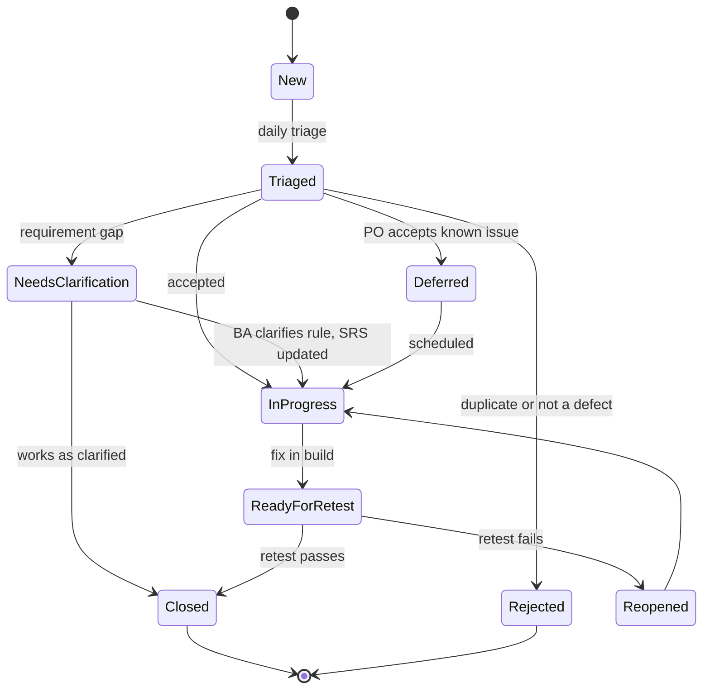
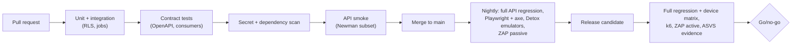
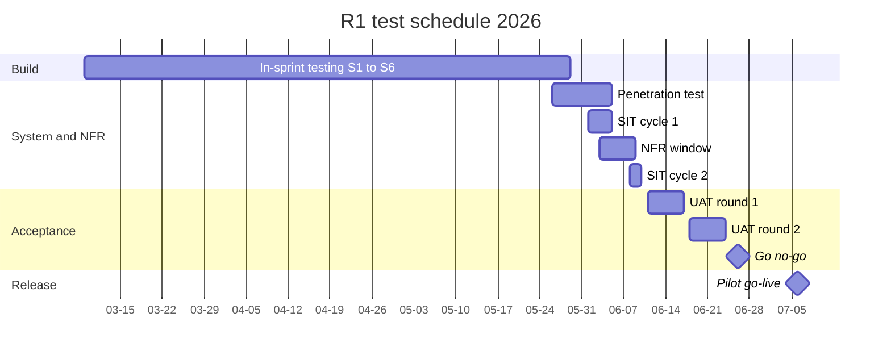

# Test strategy and plan

## Document control

| Field | Value |
|---|---|
| Document ID | TW-QA-01 |
| Version | 1.4 |
| Status | Baselined |
| Owner | Business Analyst (co-authored with the QA Lead) |
| Last updated | 2026-09-28 |
| Reviewers | QA Lead, Product Owner, Engineering Lead, Compliance and Privacy Officer, Clinical SME (RN advisor), Customer Success Lead |

| Version | Date | Change |
|---|---|---|
| 1.0 | 2026-03-06 | Baseline against SRS v1.0 |
| 1.1 | 2026-04-20 | CR-001 daily overtime profile, CR-002 open-shift confirmation, CR-003 Family Portal deferred to R2 |
| 1.2 | 2026-06-26 | R1 test summary and go/no-go outcome added (section 16) |
| 1.3 | 2026-08-28 | Mobile matrix expanded with location-permission variants after INC-2026-011 |
| 1.4 | 2026-09-28 | R1.1 regression scope for CR-004, CR-005 and CR-006 (SRS v1.3); escaped-defect analysis |

## 1. Purpose and scope

This document is the test strategy and the master test plan for Tendwell Release 1 and its maintenance release R1.1. It follows the structure of the test plan in ISO/IEC/IEEE 29119-3: context, risk register, strategy, test levels and techniques, data and environments, criteria, staffing, schedule and reporting. The other quality documents are the remaining 29119-3 work products:

| 29119-3 work product | Tendwell artifact |
|---|---|
| Test plan (this document) | `test-strategy-and-plan.md` |
| Test design and test case specification | [test-cases.csv](test-cases.csv) and its guide [test-cases.md](test-cases.md) |
| Test procedure specification (acceptance) | [uat-plan-and-scripts.md](uat-plan-and-scripts.md) |
| Test data requirements and readiness report | [test-data/README.md](test-data/README.md) and `validate_test_data.py` |
| Automated API procedure | [api-tests/tendwell.postman_collection.json](api-tests/tendwell.postman_collection.json) |
| Incident (defect) reports | [defect-log.csv](defect-log.csv), [defect-report-example.md](defect-report-example.md) |
| Test status and completion reports | Section 16 of this document |

### 1.1 Test items

| Item | Version under test (R1 / R1.1) | Notes |
|---|---|---|
| Agency Web App (React SPA) | 1.0.0 / 1.1.0 | Chrome, Edge, Safari and Firefox, latest two versions |
| Caregiver Mobile App (React Native, offline-capable) | 1.0.0 / 1.6.2 | iOS 16+ and Android 10+ (NFR-MOB-01) |
| Platform Console and public sign-up site | 1.0.0 / 1.1.0 | |
| REST API `/v1` (NestJS modular monolith) | 1.0.0 / 1.1.0 | Contract: [OpenAPI](../04-api/openapi.yaml) |
| Scheduled jobs (BullMQ, single-flight) | 1.0.0 / 1.1.0 | Materialization, missed visits, auto-close, dose escalation, billing, credential status |
| Integrations behind ports | Stubs in CI; vendor sandboxes in staging | Identity verification, payments, SMS, email, push, maps |

### 1.2 Objectives

Testing exists to give the Product Owner and the pilot agencies evidence for five decisions: the product is safe for clients (eMAR, incidents), it pays caregivers correctly, it bills only authorized and verified care, it keeps PHI inside the right tenant and role, and it captures EVV data even without signal. Each objective traces to a business KPI:

| Objective | Evidence produced | KPI (charter) |
|---|---|---|
| EVV data complete for every visit, online or offline | EVV, offline and device-matrix suites; aggregator export check | OBJ-01 (81% to 97% or more) |
| Payroll lines correct to the cent | Oracle comparison against the canonical E-2041 week; pay-rule decision tables | OBJ-02 (14 h to 3 h or less) |
| No undocumented dose goes unnoticed | Clock-controlled dose escalation timelines | OBJ-03 (4.6% to 0.5% or less) |
| Invoices correct and never duplicated | Billing oracle, cap, idempotency and concurrency tests | OBJ-04, OBJ-06 |
| No caregiver works with an expired blocking credential | Credential BVA and compliance-check decision tables | OBJ-05 (23 per quarter to 0) |
| PHI protected (designed to support HIPAA Security Rule 45 CFR 164.312) | Tenant isolation, authorization matrix, ASVS L2, notification and log PHI scans | NFR-SEC-01 to NFR-PRIV-03 |

Quality characteristics follow ISO/IEC 25010: functional suitability, performance efficiency, compatibility, usability, reliability, security and maintainability each map to a level in section 3.

### 1.3 In scope

- All R1 functional requirements (90 of the 93 in the SRS) and all 58 business rules, at the levels in section 3.
- R1.1 changes: CR-004 (Low GPS accuracy separated from Location mismatch), CR-005 (database-enforced billing idempotency and pre-issue duplicate check), CR-006 (send-time recipient resolution, no PHI in email bodies).
- Non-functional requirements NFR-PERF-01 to NFR-DAT-01, as listed in [non-functional requirements](../02-requirements/non-functional-requirements.md).
- Data exports (payroll CSV, claim batch CSV, EVV aggregator CSV) as files, up to the point where they leave Tendwell.

### 1.4 Out of scope

| Item | Reason | Where it is covered instead |
|---|---|---|
| Family Portal (FR-FAM-01 to FR-FAM-03) | Deferred to R2 by CR-003 | Two R2 test cases are drafted and kept "Not run" so traceability stays complete |
| Payroll processing, tax withholding, pay stubs | Not built (CR-008 rejected; ADR-005) | Payroll export only (TC-PAY-010) |
| EDI 837 claims and state-specific EVV aggregator formats | Not in R1 (NFR-CMP-02 defers state formats to R2) | Claim batch CSV and configurable aggregator CSV |
| Acceptance of files by the agency's payroll provider, clearinghouse or state aggregator | Third-party systems | Agencies verify during UAT with their own sample import |
| Penetration testing of vendor platforms (payments, SMS, identity) | Covered by vendor attestations under BAAs | Contract and integration tests against sandboxes |
| Legal interpretation of FLSA, state EVV or reporting rules | Tendwell is designed to support compliance; the agency remains responsible | Rules are tested as specified in the SRS and business rules |
| Load beyond NFR-SCL-01 targets | No requirement | Capacity model reviewed quarterly |

### 1.5 Assumptions and constraints

- Testing uses **synthetic data only**. Production PHI is never copied, masked or sampled into dev or staging.
- Time-dependent rules are tested with a tenant-scoped **virtual clock** available only in non-production builds. Jobs run against the virtual time of the tenant they process.
- Third-party services are reached through ports. CI uses deterministic stubs; staging uses vendor sandboxes, which can be slow or unavailable (risk TR-01).
- The June 2026 hardening window is fixed by the 2026-07-06 pilot go-live; scope is protected by risk-based prioritization rather than by moving the date.

## 2. Risk-based approach

Test depth follows product risk. The Business Analyst and QA Lead rated each epic for likelihood and impact during discovery; the result sets priority, technique and how often a suite runs.

| Product risk | Impact if it fails | Rating | Test emphasis |
|---|---|---|---|
| Wrong pay (overtime, holiday, travel, rounding) | Wage claims, caregiver trust, FLSA exposure for the agency | High | Oracle files, per-minute decision tables, BVA, every release |
| Wrong or duplicate invoices; billing beyond authorization | Payer denials, refunds, audit findings | High | Oracle files, cap BVA, idempotency and concurrency, every release |
| Undocumented or double-given doses | Client harm | High | Clock-controlled escalation, PRN limits, Clinical SME review of scripts |
| PHI exposure across tenants, locations or channels | Breach notification, loss of trust | High | Row-level security sweep, authorization matrix, PHI scans, pen test |
| EVV data missing or wrong (offline, GPS, identity) | Unpaid visits, state EVV non-compliance | High | Device matrix, offline BVA, geofence and accuracy BVA |
| Scheduling a caregiver who must not go | Client safety, credential lapses | Medium | Compliance-check decision tables |
| Notifications late, noisy or missing | Missed escalations, alert fatigue | Medium | Quiet hours BVA, escalation timelines, deduplication |
| Onboarding, subscription and reporting | Revenue and admin effort | Low to medium | Functional and BVA; lighter regression |

## 3. Test levels

| Level | Objective | Owner | Environment | Tools | Scope |
|---|---|---|---|---|---|
| Unit | Each domain function and rule behaves as specified | Developers | CI | Jest, property-based tests (fast-check) for pay and billing engines | All business rules; at least 80% line coverage for EVV, payroll, billing and eMAR modules (NFR-MNT-01) |
| Integration | Modules, database and jobs work together; RLS holds | Developers, QA Engineer | CI with Testcontainers (PostgreSQL 16, Redis) | Jest, SQL policy tests | Repositories, RLS policies, job single-flight, adapters against stubs |
| Contract (OpenAPI) | API matches the published contract; consumers and provider agree | Developers, QA Lead | CI | Spectral lint, schema-validated responses, consumer-driven contracts for web and mobile | Every endpoint in the OpenAPI document; RFC 9457 problem bodies; camelCase; integer cents |
| System and end-to-end | Business flows across web, mobile, API and jobs | QA Lead, QA Engineer, Business Analyst | Staging (release candidates) | Postman/Newman, Playwright, Detox, real-device cloud | 118 test cases in [test-cases.csv](test-cases.csv) |
| User acceptance (UAT) | Pilot agencies confirm the product supports their work | Business Analyst, Customer Success Lead, pilot users | Staging UAT tenants | Scripts in [uat-plan-and-scripts.md](uat-plan-and-scripts.md) | 12 end-to-end scenarios |
| Non-functional | Performance, security, accessibility, mobile compatibility, recovery | QA Lead with Engineering Lead | Staging performance data set; isolated DR account | k6, OWASP ZAP, ASVS checklist, axe-core, screen readers | Sections 3.1 to 3.4 |

### 3.1 Performance (k6 against NFR-PERF targets)

Load runs on the staging performance data set: 500 tenants, 50,000 caregivers and 2 million visits per month (NFR-SCL-01). Scenarios replay the shape of the pilot week: a shift-start peak between 07:45 and 08:15 local time and month-end billing.

| Requirement | k6 scenario | Load model | Pass criterion | R1 result |
|---|---|---|---|---|
| NFR-PERF-01 | `api-mix` | 300 virtual users, 70% reads and 30% writes, 30 min hold | p95 at most 400 ms for reads and 800 ms for writes; errors under 0.1% | Reads 212 ms, writes 488 ms |
| NFR-PERF-02 | `shift-start` | 1,500 clock-ins in 30 min with identity checks against the recorded vendor latency profile | Clock-in/out p95 at most 2 s; identity p95 at most 4 s | 1.3 s and 2.9 s |
| NFR-PERF-03 | `board-week` (k6 browser) | 50 coordinators opening a 500-visit week view | p95 at most 2.5 s fully rendered | 3.4 s at SIT cycle 1 (DEF-033); 2.1 s after the fix |
| NFR-PERF-04 | `billing-run`, `payroll-summary` | 1,000 clients; 250 caregivers | Billing at most 10 min; payroll summary at most 60 s | 6 min 40 s; 38 s |
| NFR-SCL-01 | `soak` | 8 h at 1.5x pilot peak | p95 drift under 10%; flat memory and pools | 4% drift |
| NFR-AVL-02 | `offline-sync` | 200 devices each syncing 36 punches (72 h) at once | All accepted in capture order; no duplicates | Pass |

### 3.2 Security

| Activity | Cadence | Pass criterion |
|---|---|---|
| OWASP ZAP passive scan of web and API | Nightly | No new High alerts |
| OWASP ZAP authenticated active scan | Each release candidate | No open High or Critical |
| OWASP ASVS v4.0.3 Level 2 checklist (NFR-SEC-02) | Each minor release; evidence linked per requirement | Every L2 item passed or risk-accepted by the Compliance and Privacy Officer |
| Third-party penetration test | Annually and before R1 (2026-05-26 to 2026-06-05) | No open Critical or High at release. R1: 0 Critical, 2 High (fixed and retested by 2026-06-19), 5 Medium, 7 Low |
| Row-level security cross-tenant suite | Every build (TC-IAM-007) and every release (TC-NFR-008 sweep of all tenant tables) | Zero rows readable or writable across tenants; API returns 404, not 403 |
| Authorization matrix (role x endpoint, deny by default) | Every build | Every route denies a role that lacks its permission (NFR-SEC-04) |
| Secret scanning and dependency scanning | Every pull request | Merge blocked on a finding (NFR-SEC-03) |
| PHI leakage scans | Every release | No PHI in logs (NFR-OBS-01) or in SMS, push and email bodies (TC-NTF-005, CR-006) |

### 3.3 Accessibility

- **Automated:** axe-core runs inside the Playwright suite on every web route; serious or critical violations fail the build.
- **Manual:** each release, a QA Engineer completes the schedule board, exception queue, MAR and payroll review tasks with NVDA and Firefox, and VoiceOver and Safari, keyboard only. Mobile flows (clock-in, tasks, dose outcome, offline banner) run with VoiceOver on iOS and TalkBack on Android, and at 200% font scaling.
- **WCAG 2.2 AA focus areas:** 1.4.1 Use of Color (visit status is text plus color), 2.4.11 Focus Not Obscured, 2.5.8 Target Size (Minimum) for gloved use, 3.3.7 Redundant Entry, and 3.3.8 Accessible Authentication (MFA codes can be pasted).

### 3.4 Mobile device, OS and condition matrix

The matrix covers the minimum and current OS on each platform plus the devices most used by pilot caregivers (caregiver survey, 48 responses). **It was expanded on 2026-08-28 after INC-2026-011:** iOS users with Precise Location Off sent fixes about 3 to 5 km wide, the server treated them as Location mismatch, and the R1 matrix had no approximate-location setting. Rows marked "R1.1" were added then.

**Devices**

| ID | Device | OS | Why it is in the matrix | Since |
|---|---|---|---|---|
| D1 | Nokia G10 | Android 10 | Minimum supported Android; 3 GB RAM | R1 |
| D2 | Samsung Galaxy A13 | Android 12 | Most common caregiver phone in the survey (PER-01) | R1 |
| D3 | Motorola moto g power | Android 11 | Second most common; aggressive battery management | R1 |
| D4 | Samsung Galaxy A54 | Android 14 | OEM battery optimization that sleeps unused apps | R1 |
| D5 | Google Pixel 7a | Android 14 | Reference for Android approximate-location dialogs | R1 |
| D6 | Google Pixel 9 | Android 16 | Current Android | R1.1 |
| D7 | iPhone SE (3rd generation) | iOS 16 | Minimum supported iOS; small screen | R1 |
| D8 | iPhone 12 | iOS 17 | Precise Location Off reproduction device for INC-2026-011 | R1 |
| D9 | iPhone 13 | iOS 18 | | R1 |
| D10 | iPhone 15 | iOS 26 | Current iOS | R1 |

**Conditions**

| ID | Condition | Platforms | Expected behavior | Since |
|---|---|---|---|---|
| L1 | Location "While Using", precise | All | Normal clock-in | R1 |
| L2 | iOS Precise Location Off | D7 to D10 | App explains why precise location is needed and offers Settings; if the caregiver continues, the punch is kept and LOW_GPS_ACCURACY is raised when accuracy is worse than 100 m | R1.1 |
| L3 | Android approximate location only | D2, D4 to D6 | Same as L2 | R1.1 |
| L4 | Android "Google Location Accuracy" off (GPS only) | D1 to D6 | Fix acquired outdoors within 10 s; indoors the punch is kept with the accuracy reported | R1.1 |
| L5 | Location permission denied | All | App explains and links to Settings; the punch is never lost; the visit is flagged for Coordinator review | R1.1 |
| N1 | Airplane mode or no signal | All | Offline capture; encrypted queue; sync in capture order (BR-025) | R1 |
| N2 | Throttled to 400 kbps | All | Usable (NFR-MOB-01); clock-in within the NFR-PERF-02 budget | R1 |
| N3 | Connection drops during sync | All | Resumes without duplicates | R1 |
| P1 | iOS Low Power Mode | D7 to D10 | Queue kept; sync when the app is foregrounded | R1 |
| P2 | Android Battery Saver plus OEM app sleeping | D2 to D4 | Queue kept; sync on next open | R1.1 |
| P3 | Battery under 15% | All | No change to EVV capture | R1 |
| T1 | Device clock set 10 min fast | All | Server receipt time drives checks; mismatch over 5 min logged | R1 |
| A1 | 200% font or largest Dynamic Type | All | Core flows usable (known issue DEF-059 on D1) | R1 |
| A2 | VoiceOver or TalkBack on | All | Core flows operable | R1 |
| O1 | App killed or device rebooted with queued punches | All | Queue survives | R1 |
| O2 | OS update with queued punches | D6, D10 | Queue survives | R1.1 |

**Selection:** every release candidate runs the full clock-in flow on all ten devices under L1 to L3 (30 runs). The other conditions are combined pairwise (PICT), giving 26 rows per release, run on real devices. Nightly Detox runs use emulators for D1, D5, D7 and D10.

## 4. Test design techniques

| Technique | Where it is used | Examples |
|---|---|---|
| Boundary value analysis (BVA) | Every numeric or time threshold in the business rules | Geofence 149/150/151 m; accuracy 99/100/101 m; clock-in 15 min before start; 7/8-minute billing remainder; 2 h travel gap; 8/12 h daily overtime; 30/14/1-day credential reminders; 24 h late sync; 90-second identity check |
| Equivalence partitioning | Inputs with many equivalent values: roles, statuses, service lines, billing models | Visit statuses, payer types, leave types |
| Decision tables | Rules that combine conditions | Pay premium selection (holiday x weekly OT x daily OT x eligibility); compliance-check hard block versus warning; PHI reveal; MFA by role; vital out-of-range |
| State transition | Entities with lifecycles | Visit, invoice, care plan, medication order, incident, support grant, tenant subscription, notification |
| Pairwise (all-pairs) | Combinatorial configuration | Mobile device x OS x location setting x network x power state |
| Time-travel and clock control | Scheduled jobs, windows, quiet hours, DST | Missed-dose escalation, auto-close at 14 h, read-only after trial, overdue invoices, DST overnight visits |
| Oracle comparison | Calculations with a canonical answer | E-2041 pay lines; C-10234 invoice; engine cases from a per-minute reference engine |
| Concurrency and fault injection | Races and duplicate execution | Two scheduler leaders (INC-2026-007), simultaneous open-shift claims, last promo redemption, SMS provider failures |
| Error guessing and exploratory charters | Security and robustness | Device-declared distance, reused identity checks, cross-tenant IDs, PHI in logs |

**Clock control in practice.** Each scheduled job reads "now" from the tenant's virtual clock in non-production builds. A test sets the clock just before a threshold, runs the job, asserts nothing happened, moves one second past it and asserts the transition. Jobs remain single-flight by `job_executions` key, so re-running a job at the same virtual time must change nothing. DST cases always assert elapsed time in UTC: an overnight visit from 22:00 to 06:00 is 9 h on 2026-11-01 and 7 h on 2027-03-14 (TC-NFR-011), never the 8 h a wall-clock subtraction gives.

**Module coverage by technique**

| Module | BVA | EP | Decision table | State transition | Pairwise | Clock control |
|---|---|---|---|---|---|---|
| ONB | Yes | Yes | Yes | Yes | | Yes |
| IAM | Yes | Yes | Yes | Yes | | Yes |
| CLI | Yes | Yes | Yes | Yes | | Yes |
| WRK | Yes | Yes | Yes | Yes | | Yes |
| SCH | Yes | Yes | Yes | Yes | | Yes |
| EVV | Yes | Yes | Yes | Yes | Yes | Yes |
| MAR | Yes | Yes | Yes | Yes | | Yes |
| DOC | Yes | Yes | Yes | Yes | | Yes |
| TOF | Yes | Yes | | Yes | | |
| PAY | Yes | Yes | Yes | Yes | | |
| BIL | Yes | Yes | Yes | Yes | | Yes |
| NTF | Yes | | Yes | Yes | | Yes |
| RPT | | Yes | | | | |

## 5. Test environments and test data management

| Environment | Used for | Data | Clock | Integrations |
|---|---|---|---|---|
| CI (ephemeral) | Unit, integration, contract, API smoke | Fixtures and the seed | Virtual | Deterministic stubs behind each port |
| dev | Integration of merged work; exploratory testing | Synthetic seed | Real, virtual per tenant | Stubs |
| staging | SIT on release candidates, regression, UAT (dedicated UAT tenants), performance, DAST | Synthetic seed; performance data set | Virtual per tenant | Vendor sandboxes: identity verification, payments test mode, SMS test sub-account, email sandbox, push sandbox, maps with a quota |
| DR account | Quarterly restore test (NFR-DR-01) | Restored backup of synthetic staging data | Real | None |
| prod | Post-deployment health checks only | No test data is created in production | Real | Live |

**Test data management**

- The seed is generated from code and checked by `validate_test_data.py` (keys, foreign keys, same-tenant references, recomputed distances, expected totals, anonymization formats). A schema change that breaks the seed fails CI (risk TR-07).
- Seeds are loaded per test tenant and reset after any test that writes. Boundary tests reset the named record between iterations.
- Two seed profiles exist: `base` and `auth-cap` (authorization nearly used up).
- UAT tenants are copies of the pilot tenants' structure with synthetic clients and staff; participants sign in with synthetic accounts.
- No production PHI is ever used: not masked, not sampled, not for "just one" defect. Production-only defects are reproduced with synthetic records; if a record must be inspected, Platform Support requests a time-boxed support grant from the agency (BR-008).

## 6. Entry and exit criteria

| Level | Entry criteria | Exit criteria |
|---|---|---|
| Unit and integration | Story meets the Definition of Ready; acceptance criteria in Gherkin | All tests pass; coverage gate met (80% lines for EVV, payroll, billing, eMAR); every touched BR has an automated test |
| Contract | OpenAPI change reviewed against the API guidelines | Lint clean; provider and consumer contracts pass; no breaking change without a version |
| System (in sprint) | Story deployed to dev; test cases designed and reviewed by the BA | Story test cases pass or have triaged defects; no open S1 or S2 on the story (Definition of Done) |
| SIT | Build complete (S6 Definition of Done); release candidate on staging; seed validated; stubs and sandboxes up; smoke suite green | Every P1 case executed; pass rate of executed cases at least 95%; no open S1 or S2; requirement coverage 100% of R1 FRs and BRs |
| Non-functional | Performance data set loaded; release candidate frozen | Every NFR target met or a deviation approved by the Product Owner; no open Critical or High security finding |
| UAT | SIT exit met; UAT readiness review passed; scripts approved by the Product Owner and Clinical SME; participants trained (30 min) | All 12 scenarios passed; no open S1 or S2; every S3 or S4 known issue has a workaround and an owner; sign-off from each pilot agency |
| Release (go/no-go) | UAT signed off; final regression run | No open S1 or S2; known issues listed in the release notes; rollback tested; hypercare roster agreed |

**Suspension and resumption.** Testing of a build is suspended when the smoke suite fails, when an S1 defect blocks more than 20% of planned cases, or when the seed fails validation. It resumes on a new build that passes smoke and the failed checks.

## 7. Defect management

### 7.1 Lifecycle

The defect log shows three statuses: **Open** (any state from New to Ready for retest), **Deferred** and **Closed**.

### 7.2 Severity (impact) and priority (urgency)

| Severity | Definition | Examples |
|---|---|---|
| S1 Critical | PHI exposed across tenants, locations or channels; data loss or corruption; a core flow (clock-in, dose documentation, payroll export, billing run) unavailable for a tenant; wrong money for many records with no workaround | DEF-014: a Lakemont South coordinator could open a Lakemont North client by direct API call |
| S2 Major | A business rule or core requirement wrong in a defined scenario; a workaround exists (manual adjustment, re-run) | DEF-019: holiday hours paid a stacked premium; DEF-053: supported-living proration $140.00 short |
| S3 Moderate | Secondary function or edge case wrong; easy workaround; partial usability barrier | DEF-022: PRN boundary at exactly 24 h; DEF-059: clock-in button below the fold at 200% font |
| S4 Minor | Cosmetic or text issue with no functional impact | DEF-055: day-31 column cut on Letter paper; DEF-061: open-shift count refreshes late |

| Priority | Definition | Typical use |
|---|---|---|
| P1 | Fix now: blocks testing, release or care | Next build or hotfix |
| P2 | Fix in the current cycle, before release | Before SIT or UAT exit |
| P3 | Fix in a planned release | Next sprint or minor release |
| P4 | Fix when convenient | Backlog |

Severity is set by QA from impact; priority is set at triage by the Product Owner. They differ on purpose: a cosmetic error on the payroll export screen during payroll week can be S4/P2, and a rare S2 in a feature behind a disabled flag can be P3.

### 7.3 Triage cadence and service levels

- **SIT and UAT:** daily triage at 09:30 ET, 20 minutes, chaired by the QA Lead with the Business Analyst, Engineering Lead and Product Owner; the Clinical SME joins for eMAR and incident defects; the Compliance and Privacy Officer joins for any defect touching PHI.
- **Sprints:** twice weekly, plus ad hoc for S1.
- **S1:** raised by phone and in the defect tool at once; the Compliance and Privacy Officer is informed immediately if PHI may be involved.

| Severity | Acknowledge | Triage | Fix or workaround target | Retest after the fix is deployed |
|---|---|---|---|---|
| S1 | 30 min | Immediately | 24 h | 4 h |
| S2 | 4 business hours | Next daily triage | 3 business days | 1 business day |
| S3 | 1 business day | Next triage | Before release, or deferred with Product Owner approval | Next test cycle |
| S4 | 2 business days | Next triage | Planned release or backlog | Next test cycle |

### 7.4 Requirement gaps

A defect whose root cause is a missing or ambiguous rule goes to the Business Analyst, not straight to a developer. The BA writes the options with a worked example for each, brings the decision to the Product Owner (with the Clinical SME or the Compliance and Privacy Officer when the rule touches care or compliance), records it in the [decision log](../05-delivery/decision-log.md), updates the [SRS](../02-requirements/SRS.md) and [business rules](../02-requirements/business-rules.md), adds or changes acceptance criteria, and adds the boundary case to the test cases before the fix is retested. Nine of the 61 R1 defects were requirement gaps; all nine were clarified in SRS v1.2 on 2026-06-12, and their fixes were retested before UAT sign-off. Five are in the [defect log](defect-log.csv): DEF-012 (partial minutes in billing), DEF-022 (PRN 24-hour boundary), DEF-025 (daily versus weekly overtime), DEF-050 (zero-minute escalation step) and DEF-052 (Overdue dose alerts in quiet hours).

## 8. Regression and automation strategy

- **Pyramid by count:** about 70% unit, 20% API and integration, 10% UI end-to-end. Business rules are proven at the unit and API level; UI tests prove the flow, not the arithmetic.
- **Regression suite:** the 118 cases in [test-cases.csv](test-cases.csv); 99 are automated (84%), 13 manual (device, accessibility, usability, recovery and security work that needs judgment) and 6 automation candidates. Target: 85% automated by R1.2.
- **Always-run suites:** every release runs the "money and medicine" set (all P1 PAY, BIL and MAR cases), tenant isolation, and the canonical oracles, whatever changed.
- **Change-based selection:** the [traceability matrix](../02-requirements/requirements-traceability-matrix.md) maps each FR to its test cases; a change runs every case linked to the FRs and BRs it touches, plus the always-run suites.
- **NFR-MNT-01 gate:** CI fails if any BR has no automated test. At v1.4 all 58 BRs have at least one automated case.
- **Flaky tests:** quarantined within 24 hours with an owner, fixed within 5 business days, never silently retried.
- **R1.1 regression scope (2026-09-28 to 2026-10-02):** full regression plus three new cases: TC-EVV-004 (CR-004), TC-BIL-007 (CR-005) and TC-NTF-003 (CR-006), and the expanded device matrix.

## 9. Risks to testing

| ID | Risk | Likelihood / impact | Mitigation | Status |
|---|---|---|---|---|
| TR-01 | Vendor sandboxes (identity, payments, SMS) late or unstable | High / Medium | Stubs behind ports in CI; contract tests; vendor runs scheduled early in each cycle | Realized: identity sandbox credentials arrived late in S4; staging SMS rate limit (DEF-044); identity sandbox outage blocked TC-EVV-006 in the R1.1 cycle |
| TR-02 | Time-dependent behavior is hard to reproduce | High / High | Virtual clock; second-level boundary cases; DST cases | Controlled |
| TR-03 | Device fragmentation and OS permission settings | Medium / High | Device and condition matrix; pairwise; real devices per release | Realized: INC-2026-011 escaped; matrix expanded (section 3.4) |
| TR-04 | Races and deployment overlap not visible in functional tests | Medium / High | Concurrency and fault-injection tests; single-flight checks during deploys | Realized: INC-2026-007 escaped; TC-BIL-007 and TC-NFR-014 added |
| TR-05 | Pilot staff unavailable for UAT because care comes first | Medium / Medium | 2-hour sessions booked by the Customer Success Lead; backup participant per role | Controlled |
| TR-06 | Ambiguous pay, billing and eMAR rules | Medium / High | Examples-first rules; decision tables; oracle files; BA-led gap resolution | Realized: 9 requirement-gap defects, all clarified in SRS v1.2 |
| TR-07 | Seed data drifts from the schema | Medium / Medium | Generated seed; validator in CI | Controlled |
| TR-08 | Compressed June hardening window | High / Medium | Risk-based order; automation first; daily triage | Controlled |

## 10. Roles and RACI

R = Responsible, A = Accountable, C = Consulted, I = Informed.

| Activity | QA Lead | QA Engineer | Business Analyst | Product Owner | Engineering Lead | Developers | UX Designer | Clinical SME | Compliance and Privacy Officer | Customer Success Lead | Pilot users |
|---|---|---|---|---|---|---|---|---|---|---|---|
| Test strategy and plan | A | C | R | C | C | I | I | C | C | I | |
| Test case design and review | A | R | R | I | C | C | C | C | C | | |
| Synthetic test data | A | R | R | I | C | C | | C | C | | |
| Unit, integration, contract tests | C | C | I | | A | R | | | | | |
| API and UI automation | A | R | C | | C | C | | | | | |
| Performance testing | R | C | I | I | A | C | | | | | |
| Security testing and pen test | R | C | I | I | A | C | | | C | | |
| Accessibility testing | A | R | I | I | | C | R | | | | |
| Mobile device matrix | A | R | I | | C | C | | | | | |
| Defect triage | R | C | C | A | C | C | | C | C | | |
| Requirement-gap resolution | C | I | R | A | C | I | C | C | C | | |
| UAT plan and scripts | C | C | R | A | I | | C | C | C | C | |
| UAT execution and support | C | R | R | I | C | C | C | C | | R | R |
| UAT sign-off | I | I | C | R | I | | | C | C | C | A |
| Go/no-go decision | C | I | C | A | C | | | C | C | C | I |
| Metrics and test reports | R | C | C | A | I | | | | | I | |

Pilot users are accountable for their agency's sign-off; the Product Owner is accountable for the release decision.

## 11. Schedule

| Phase | Dates | Build | Focus |
|---|---|---|---|
| Test planning | 2026-02-23 to 2026-03-06 | n/a | Strategy, environments, seed design, oracle files |
| In-sprint testing S1 to S6 | 2026-03-09 to 2026-05-29 | main | Unit, integration, contract and story-level system tests; automation built with each story |
| Performance and security baselines | 2026-05-04 to 2026-05-29 (S5, S6) | main | k6 baselines; ZAP per sprint |
| Third-party penetration test | 2026-05-26 to 2026-06-05 | v1.0.0-rc.1 and rc.2 | Web, API, mobile, tenant isolation |
| SIT cycle 1 | 2026-06-01 to 2026-06-05 | v1.0.0-rc.2 | All R1 cases except the NFR window |
| NFR window | 2026-06-03 to 2026-06-09 | v1.0.0-rc.2 | Performance, accessibility, device matrix |
| SIT cycle 2 | 2026-06-08 to 2026-06-10 | v1.0.0-rc.3 | Fix verification and full regression |
| UAT readiness review | 2026-06-10 | | Entry criteria check |
| UAT round 1 | 2026-06-11 to 2026-06-17 | v1.0.0-rc.4 | 12 scenarios |
| SRS v1.2 (requirement-gap clarifications) | 2026-06-12 | | |
| DR restore test | 2026-06-17 | | NFR-DR-01 |
| UAT round 2 | 2026-06-18 to 2026-06-24 | v1.0.0-rc.5 | Retest and regression of UAT fixes |
| Final regression; UAT sign-off | 2026-06-25 | v1.0.0-rc.5 | |
| Go/no-go | 2026-06-26 | | Decision: Go |
| Pilot go-live; hypercare | 2026-07-06 to 2026-07-31 | v1.0.0 | Daily defect review with pilot agencies |
| R1.1 regression | 2026-09-28 to 2026-10-02 | v1.1.0-rc.2 | CR-004, CR-005, CR-006 and full regression |

## 12. Metrics and reporting

| Metric | Definition | Target | Reported |
|---|---|---|---|
| Requirement coverage | FRs and BRs with at least one test case, and with at least one executed case in the cycle | 100% of release FRs and BRs | Daily in SIT and UAT |
| Execution progress | Executed / planned cases | 100% of P1 by cycle end | Daily |
| Pass rate | Passed / executed (blocked and not-run excluded) | 95% or more at SIT exit | Daily |
| Defect density | Defects found in SIT and UAT per 100 story points, overall and by module | Trend down release on release | Per cycle |
| Defect arrival and closure | New versus closed per day by severity | Closure ahead of arrival from SIT cycle 2 | Daily |
| Escaped defects and defect removal efficiency (DRE) | Production defects in the first 90 days; DRE = pre-release defects / (pre-release + escaped) | 90% or more | Monthly |
| Automation coverage | Automated / regression cases; BRs with an automated test | 85%; 100% of BRs | Per release |

Daily SIT and UAT status goes to the delivery channel at 16:00 ET (executed, passed, failed, blocked; new and open defects by severity; risks). The completion report closes each phase.

## 13. Reporting responsibilities

The QA Lead owns the daily status. The Business Analyst owns requirement coverage and the requirement-gap list. The Product Owner owns the go/no-go recommendation.

## 14. Deviations from the organizational test approach

None for R1. For R1.1, TC-EVV-006 could not run against the identity vendor sandbox, which was unavailable during the cycle (status Blocked); the API identity checks in the Postman collection passed against the stub. The Product Owner accepted this deviation on 2026-10-02 on condition that TC-EVV-006 passes against the sandbox before R1.1 is released (section 15).

## 15. Test completion criteria for R1.1

R1.1 exits when every R1.1 change case passes, the full regression pass rate is at least 95% of executed cases, no S1 or S2 is open, and TC-EVV-006 has passed against the vendor sandbox.

## 16. R1 test summary (completion report)

### 16.1 Execution by cycle

R1 scope at SIT: 113 test cases (the current 118 minus the 3 cases added for R1.1 and the 2 R2 drafts). SIT cycle 1 planned 104 of them; the other 9 ran in the NFR window (7), the DR restore test (TC-NFR-015) and the UAT usability session (TC-NFR-018). Executed means passed or failed; blocked cases are not executed and are excluded from the pass rate.

| Cycle | Dates | Build | Planned | Executed | Passed | Failed | Blocked | Pass rate |
|---|---|---|---|---|---|---|---|---|
| SIT cycle 1 | 2026-06-01 to 06-05 | v1.0.0-rc.2 | 104 | 98 | 75 | 23 | 6 | 76.5% |
| NFR window | 2026-06-03 to 06-09 | v1.0.0-rc.2 | 7 | 7 | 5 | 2 | 0 | 71.4% |
| SIT cycle 2 | 2026-06-08 to 06-10 | v1.0.0-rc.3 | 111 | 110 | 105 | 5 | 1 | 95.5% |
| UAT round 1 | 2026-06-11 to 06-17 | v1.0.0-rc.4 | 12 scenarios | 12 | 8 | 4 | 0 | 66.7% |
| UAT round 2 | 2026-06-18 to 06-24 | v1.0.0-rc.5 | 12 scenarios | 12 | 12 | 0 | 0 | 100% (3 with accepted known issues) |
| Final regression | 2026-06-25 | v1.0.0-rc.5 | 113 | 113 | 109 | 4 | 0 | 96.5% |

The 6 blocked cases in SIT cycle 1 waited for identity-verification sandbox credentials and the payments sandbox webhook configuration; they passed in SIT cycle 2. The 4 failures at final regression are each linked to an accepted S3 or S4 known issue (for example TC-MAR-009 and DEF-055).

### 16.2 Defects

| Measure | Value |
|---|---|
| Raised in SIT and UAT | 61 (SIT cycle 1: 34; SIT cycle 2: 15; UAT: 12) |
| By severity | S1 2, S2 17, S3 27, S4 15 |
| By root cause | Code 38, Requirement gap 9, Design 6, Data 4, Environment 4 |
| Closed by go/no-go | 53 |
| **Open at go/no-go on 2026-06-26** | **S1 0, S2 0, S3 3, S4 5**: all accepted as known issues with workarounds and owners |
| Defect density | 61 per 282 story points = 21.6 per 100 points |

| Module | Story points | Defects | Per 100 points |
|---|---|---|---|
| PAY | 23 | 9 | 39.1 |
| NTF | 13 | 4 | 30.8 |
| BIL | 29 | 8 | 27.6 |
| EVV | 37 | 10 | 27.0 |
| MAR | 26 | 7 | 26.9 |
| SCH | 31 | 8 | 25.8 |
| TOF | 8 | 2 | 25.0 |
| IAM | 23 | 4 | 17.4 |
| WRK | 13 | 2 | 15.4 |
| DOC | 13 | 2 | 15.4 |
| CLI | 24 | 3 | 12.5 |
| RPT | 13 | 1 | 7.7 |
| ONB | 29 | 1 | 3.4 |

Payroll had the highest density, consistent with its rule complexity; three of its nine defects were requirement gaps or rule interactions (DEF-019, DEF-025). This supported the decision to require a parallel payroll run at TEN-001 for the first two pay periods after go-live.

### 16.3 Coverage at go/no-go

| Item | Covered |
|---|---|
| R1 functional requirements | 90 of 90 by executed test cases (FR-FAM-01 to FR-FAM-03 drafted for R2) |
| Business rules | 58 of 58 |
| R1 user stories | 52 of 52 |
| Non-functional requirements | 27 of 29 by test cases; NFR-MNT-01 by the CI coverage gate and NFR-CMP-01 by the BAA register review |

### 16.4 Go/no-go outcome

On 2026-06-26 the Product Owner recommended **Go** for the 2026-07-06 pilot, and the steering group approved it, with conditions: a parallel payroll run at TEN-001 for the first two pay periods, daily hypercare review with the three pilot agencies until 2026-07-31, and the 8 known issues listed in the release notes with workarounds.

### 16.5 Escaped defects and test-gap analysis (July to September 2026)

Twelve product defects were reported from production in the first 90 days; 5 are linked to incidents in the [incident register](../07-operations/incident-register.csv). DRE = 61 / (61 + 12) = **83.6%**, below the 90% target. The three most serious escapes changed the test approach:

| Incident | Why testing missed it | Test change |
|---|---|---|
| INC-2026-007 duplicate client invoices (SEV-2) | Billing idempotency was tested as a sequential re-run; two scheduler leaders during a deployment were never simulated, and no database constraint existed to test | TC-BIL-007 concurrency and fault injection; TC-NFR-014 single-flight during deploys; invoice-count anomaly alert verified |
| INC-2026-011 false Location mismatch exceptions (SEV-2) | The device matrix had no iOS Precise Location Off or Android approximate-location row; tests asserted distance only, never accuracy | Matrix rows L2 to L5, P2, O2; TC-EVV-004 accuracy BVA; exception-rate alert test |
| INC-2026-015 escalation email to a deactivated user (SEV-1, privacy) | Deactivation was tested for direct notifications, not for ladder recipients cached when the ladder was configured | TC-NTF-003 send-time resolution; PHI scan extended to email bodies (TC-NTF-005); deactivated-recipient alert |

### 16.6 R1.1 regression status (2026-09-28 to 2026-10-02, v1.1.0-rc.2)

| Result | Cases |
|---|---|
| Pass | 111 |
| Fail | 3 (TC-SCH-007 / DEF-061, TC-MAR-009 / DEF-055, TC-NFR-010 / DEF-059: all known S3/S4 issues) |
| Blocked | 1 (TC-EVV-006: identity vendor sandbox unavailable) |
| Not run | 3 (TC-FAM-001 and TC-FAM-002 are R2; TC-NFR-015 waits for the quarterly restore on 2026-10-14) |
| Pass rate of executed cases | 111 / 114 = 97.4% |

## Related documents

- [Project charter](../01-discovery/project-charter.md)
- [Software requirements specification](../02-requirements/SRS.md)
- [Non-functional requirements](../02-requirements/non-functional-requirements.md)
- [Business rules](../02-requirements/business-rules.md)
- [Requirements traceability matrix](../02-requirements/requirements-traceability-matrix.md)
- [Compliance mapping](../02-requirements/compliance-mapping.md)
- [Deployment and security architecture](../03-design/architecture/deployment-and-security.md)
- [ADR-003 Single-flight scheduled jobs](../03-design/architecture/adr/ADR-003-single-flight-scheduled-jobs.md)
- [OpenAPI specification](../04-api/openapi.yaml)
- [Release and sprint plan](../05-delivery/release-and-sprint-plan.md)
- [Definition of Ready and Done](../05-delivery/definition-of-ready-and-done.md)
- [Change request log](../05-delivery/change-request-log.md)
- [Decision log](../05-delivery/decision-log.md)
- [Test cases guide](test-cases.md) and [test cases (CSV)](test-cases.csv)
- [UAT plan and scripts](uat-plan-and-scripts.md)
- [Test data](test-data/README.md)
- [Defect log](defect-log.csv) and [defect report example](defect-report-example.md)
- [Incident register](../07-operations/incident-register.csv)
