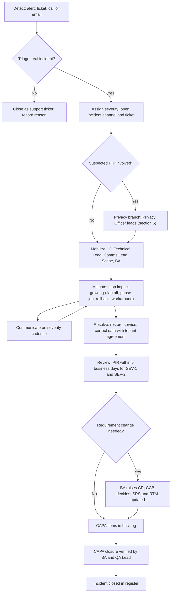
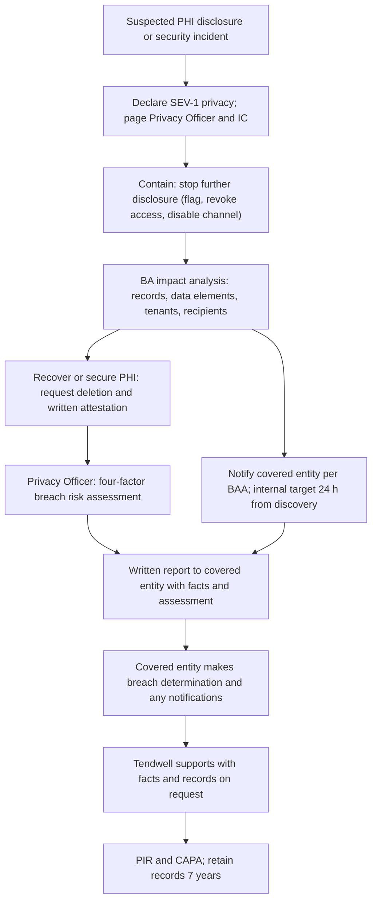

# Incident Management Process

## Document control

| Field | Value |
|---|---|
| Document ID | TW-OPS-01 |
| Version | 2.0 |
| Status | Approved |
| Owner | Business Analyst |
| Last updated | 2026-09-28 |
| Reviewers | Engineering Lead, Compliance and Privacy Officer, Customer Success Lead, Product Owner, QA Lead |

| Version | Date | Change |
|---|---|---|
| 1.0 | 2026-06-24 | Approved for pilot go-live (go/no-go checklist item) |
| 1.1 | 2026-07-29 | After INC-2026-007: business anomaly detection added to triggers; data-correction rules; Business Analyst impact analysis made a standard step |
| 1.2 | 2026-08-28 | After INC-2026-011: customer-reported patterns escalate after two reports in 24 hours; mobile release rollback guidance |
| 2.0 | 2026-09-28 | After INC-2026-015: privacy branch rewritten; any notification to a deactivated user is a privacy trigger; metrics section added for Q3 2026 |

### Purpose and scope

This process defines how Tendwell Labs detects, responds to, communicates about and learns from production incidents in the Tendwell platform. It covers:

- **Production incidents:** unplanned loss or degradation of service, incorrect business outcomes (for example wrong invoices, false EVV exceptions, missed escalations) and data integrity problems in production, across all tenants and applications (Agency Web App, Caregiver Mobile App, Platform Console, public sign-up site and API).
- **Privacy incidents:** any suspected unauthorized use, disclosure, access, alteration or loss of PHI or other personal data that Tendwell Labs handles as a business associate of an agency.

It does not cover client incidents recorded by agencies inside Tendwell (falls, medication errors and so on, FR-DOC-03), which are the agency's clinical process, or defects found before release, which follow the [defect process](../06-quality/defect-report-example.md).

The Business Analyst owns this document because most of what goes wrong in this domain is a business outcome rather than an outage: an invoice that should not exist, a dose alert that did not fire, an email that went to the wrong person. Engineering owns the technical runbooks that this process calls.

**Disclaimer:** this process is designed to support Tendwell Labs' contractual and regulatory obligations as a business associate. It is not legal advice. Each agency, as the covered entity, remains responsible for its own breach determinations and notifications.

## 1. Definitions

| Term | Meaning |
|---|---|
| Incident | An unplanned event in production that degrades service, produces an incorrect business outcome, or puts data confidentiality, integrity or availability at risk |
| Privacy incident | An incident involving suspected unauthorized use or disclosure of PHI or personal data, including a security incident as defined in 45 CFR 164.304 |
| Care hours | 06:00-22:00 tenant local time for `HOME_VISIT` and `ADULT_DAY`; 24 hours a day for tenants with `SUPPORTED_LIVING` |
| Detection time | When the first signal reaches Tendwell Labs (alert, ticket, call or email), whether or not it is recognized as an incident |
| Acknowledgement time | When a responder (on-call engineer or Platform Support triage) accepts the signal and starts triage |
| Mitigation time | When customer impact stops growing (feature flag off, job paused, workaround published) |
| Resolution time | When service is restored and affected data is corrected or a correction is agreed with every affected tenant |
| Discovery (privacy) | The first day the breach is known, or by exercising reasonable diligence would have been known, to any Tendwell Labs workforce member, consistent with 45 CFR 164.410(a)(2) |
| CAPA | Corrective and preventive action arising from a review |

## 2. Severity matrix

When in doubt, choose the higher severity; the Incident Commander may downgrade later. Every suspected privacy incident starts at SEV-1 and only the Compliance and Privacy Officer may downgrade it.

| Severity | Definition | Tendwell examples | Acknowledge | Incident Commander assigned | First status page post | Update cadence | Review |
|---|---|---|---|---|---|---|---|
| SEV-1 Critical | Care delivery or clinical safety blocked, platform-wide outage, or any suspected PHI disclosure | EVV clock-in unavailable for more than 15 min during care hours for any tenant, online and offline; missed-dose escalation (BR-030) or urgent alerts not firing for more than 15 min; web or API unavailable for more than 15 min (NFR-AVL-01); cross-tenant data visible (BR-001); any suspected PHI disclosure, such as INC-2026-015; data loss beyond RPO (NFR-DR-01) | 5 min, 24x7 | 15 min | 30 min (privacy: per Privacy Officer) | Every 30 min | Full PIR within 5 business days |
| SEV-2 Major | Significant business impact on several tenants, financial or data integrity errors, or a core workflow degraded with a workaround | Duplicate or incorrect invoices (INC-2026-007); false EVV exceptions at scale threatening payroll (INC-2026-011); payroll export or billing run failing on a pay or billing day; a core API p95 more than 3 times its NFR-PERF target for 30 min during care hours | 15 min, 24x7 | 30 min | 60 min | Every 60 min | Full PIR within 5 business days |
| SEV-3 Minor | Single feature degraded, workaround or fallback working, limited tenants | SMS delays from a vendor (INC-2026-002); slow schedule board (INC-2026-004); push certificate expiry with SMS and in-app fallback (INC-2026-009); identity vendor latency (INC-2026-016) | 30 min in business hours (07:00-19:00 ET); 60 min otherwise if care hours are affected | Optional; on-call engineer leads | If customer-visible | Every 4 h or on state change | Short-form review in the ticket within 10 business days |
| SEV-4 Low | Cosmetic or limited issue with no care, money or data impact | Duplicate reminder emails without PHI (INC-2026-014); a report column mislabeled | Next business day | Not required | No | On resolution | Tracked as a defect |

**Automatic upgrade rules**

- Any SEV-2 or SEV-3 that touches PHI exposure becomes SEV-1 (privacy).
- Any incident affecting a SUPPORTED_LIVING tenant's eMAR overnight is treated as care hours.
- Two or more customer reports of the same unexplained pattern within 24 hours open an incident, even when the reporters describe it as a training issue (added after INC-2026-011).
- Any business anomaly alert under NFR-OBS-02 opens at least a SEV-3: invoice count more than 20% from the previous run, EVV exception rate more than 2 times the 7-day baseline, or any notification to a deactivated user (which opens as SEV-1 privacy).

## 3. Roles and responsibilities

| Role | Who (default) | Responsibilities |
|---|---|---|
| Incident Commander (IC) | On-call rota: Engineering Lead or senior backend developer | Declares severity; owns decisions and coordination; approves external messages; authorizes emergency changes; decides when to resolve. Does not debug. |
| Technical Lead | On-call engineer for the affected module | Diagnoses, proposes and executes mitigation; leads data-correction scripts with a second-person review |
| Communications Lead | Customer Success Lead in business hours; Product Owner out of hours | Status page, tenant emails, internal updates on the agreed cadence; single voice to customers |
| Scribe | QA Lead or QA engineer | Keeps the timeline in the incident channel with timestamps; records decisions and owners |
| Compliance and Privacy Officer | Compliance and Privacy Officer | Leads the privacy branch: containment of PHI, breach risk assessment, business-associate notification to the covered entity, regulator-facing records |
| Business Analyst | Business Analyst | See below |
| Product Owner | Product Owner | Customer remedies (credits, waived fees); prioritizes CAPA items in the backlog; chairs the CCB for resulting CRs |
| Platform Support | PLT-SUP on shift | First-line triage of tickets; requests support access grants from Agency Administrators when tenant data must be viewed (BR-008) |

### The Business Analyst's role in an incident

The Business Analyst joins every SEV-1 and SEV-2 within 30 minutes of declaration (business hours) or by the next morning stand-up (out of hours) and owns four things:

1. **Impact analysis across tenants and workflows.** The BA turns "something is wrong" into numbers the IC and customers can act on: which tenants, which users and roles, how many records, how much money, which downstream workflows (payroll, billing, EVV aggregator export, notifications) and which compliance obligations are affected. The BA works from read-only queries built against the [data dictionary](../03-design/data/data-dictionary.md), shares only counts and identifiers in the incident channel, and never pastes PHI.
2. **Requirement-gap analysis.** For each cause the BA classifies whether the system behaved as specified (a requirements gap), did not behave as specified (an implementation defect), or behaved as specified but was not tested under the triggering condition (a test gap). The classification drives whether the fix needs a CR.
3. **CR authoring.** When a requirement must change, the BA drafts the CR with impact analysis for the CCB. For emergency changes authorized by the IC, the BA raises the CR within 2 business days so the change is reviewed and baselined in the [SRS](../02-requirements/SRS.md).
4. **PIR authoring.** The BA writes the post-incident review, facilitates the review meeting, maintains the CAPA table and updates the [traceability matrix](../02-requirements/requirements-traceability-matrix.md) and [test cases](../06-quality/test-cases.md) with the requirement and test changes.

The BA also drafts the factual content of customer messages (scope, numbers, what the customer needs to do) for the Communications Lead.

## 4. Lifecycle



| Stage | Entry | Key activities | Exit | Owner |
|---|---|---|---|---|
| Detect | Signal received | Alert routing (PagerDuty), ticket intake, customer calls to Customer Success | Responder acknowledges | Platform Support or on-call engineer |
| Triage | Acknowledged signal | Reproduce or corroborate; check the severity matrix and upgrade rules; check for PHI | Severity set, or closed as not an incident | On-call engineer |
| Mobilize | Severity set | Page roles; open channel `#inc-YYYY-NNN`; Scribe starts timeline; BA starts impact analysis | Roles confirmed | IC |
| Mitigate | Roles in place | Feature flags, job pause, rollback, workaround guidance; stop the blast radius before root cause | Impact no longer growing | Technical Lead |
| Resolve | Mitigated | Fix or safe configuration in place; data corrections reviewed by a second engineer and the BA against the impact list; tenants agree corrections that touch money or clinical records | Service normal; data corrected or correction agreed | IC |
| Review | Resolved | Blameless PIR; root cause; CAPA; requirement and documentation changes | PIR approved | BA (author), IC (accountable) |
| CAPA closure | PIR approved | Track actions to done; verify effectiveness (for example the alert fires in a test) | All CAPA items Done or formally accepted | BA with QA Lead |

**Data-correction rules (added after INC-2026-007).** Production data fixes run as reviewed scripts with a dry-run output that the BA reconciles to the impact list before execution. Fixes never delete business records: they void, supersede or append, consistent with append-only rules such as BR-026 and BR-051, and every change creates audit events (BR-057) referencing the incident ID.

## 5. Communication cadence and templates

### 5.1 Cadence

| Audience | SEV-1 | SEV-2 | SEV-3 | Channel | Owner |
|---|---|---|---|---|---|
| Internal incident channel | Every 30 min | Every 60 min | On state change | Team chat `#inc-YYYY-NNN` | IC (Scribe posts) |
| Executive Sponsor | At declaration, then every 2 h | At declaration and resolution | Weekly summary | Direct message | IC |
| Status page | Within 30 min, then every 30 min | Within 60 min, then every 60 min | If customer-visible | Status page | Communications Lead |
| Affected tenant administrators | Email at declaration and resolution; phone for the most affected | Email at declaration and resolution | Email at resolution if visible | Email, phone | Communications Lead |
| Covered entity (privacy) | Per section 6 | n/a | n/a | Phone and email to BAA contact | Compliance and Privacy Officer |

Status page and email messages never include PHI, client names, or other tenants' names.

### 5.2 Status page: initial message

```text
Title: [Investigating] <Component> - <symptom in plain words>
Posted: <YYYY-MM-DD HH:MM> ET

We are investigating <symptom> affecting <scope: some or all agencies, which app or feature>.

What this means for care: <for example "Caregivers can still clock in; visits may show an extra exception for review." or "No impact on clock-in or medication recording.">

What you can do now: <workaround, or "No action needed.">

Next update by <HH:MM> ET.
```

### 5.3 Status page: update and resolution

```text
Title: [Identified | Monitoring | Resolved] <Component> - <symptom>
Posted: <YYYY-MM-DD HH:MM> ET

Update: <what we found, in one or two sentences, without speculation>.
Impact so far: <counts that matter to customers, for example "about 200 draft invoices across a small number of agencies">.
Action taken: <mitigation>.
What you need to do: <specific step, or "No action needed.">

Next update by <HH:MM> ET. | This incident is resolved. A summary will be shared with affected agencies within 5 business days.
```

### 5.4 Customer email to affected tenant administrators

```text
Subject: Tendwell incident <INC-YYYY-NNN>: <short description> - <status>

Hello <Agency Administrator role or first name>,

On <date> at <time> ET, <what happened, in plain language>.

How it affected your agency:
- <number> <records> in your account, for example "12 draft invoices for the week of 2026-07-13".
- <whether any client, caregiver or payer received anything>.
- <whether any money moved>.

What we have done:
- <mitigation and correction completed>.

What we need from you:
- <a specific action with a date, or "Nothing at this time.">

We will send a written post-incident summary by <date>. If you have questions, reply to this email or call Customer Success at +1-614-555-0142.

Customer Success Lead, Tendwell Labs
```

### 5.5 Internal update (team chat)

```text
#inc-2026-NNN | SEV-<n> | Status: <Investigating | Mitigating | Monitoring | Resolved>
IC: <role> | Tech Lead: <role> | Comms: <role> | Scribe: <role> | BA: impact analysis
Impact (BA): <tenants> tenants, <records>, <money>, <workflows>, PHI: <none | suspected | confirmed>
Since last update: <what changed>
Next actions: <action - owner - ETA>
Decisions needed: <decision - by whom>
Next update: <HH:MM> ET
```

## 6. Privacy incident branch

Tendwell Labs is a business associate of each agency (the covered entity) under a Business Associate Agreement (NFR-CMP-01). The Compliance and Privacy Officer leads every privacy incident; the IC continues to run the technical response.



### 6.1 Steps and targets

| Step | Target | Owner |
|---|---|---|
| Containment action in place | Within 1 hour of declaration | IC with Technical Lead |
| Impact analysis of affected records, data elements, tenants and recipients | Within 2 hours of declaration | Business Analyst |
| Initial notice to the covered entity's BAA contact (phone and email) | Without unreasonable delay; Tendwell's internal target is 24 hours from discovery | Compliance and Privacy Officer, delivered with the Customer Success Lead |
| Recipient deletion request and written attestation | Requested within 4 hours; attestation within 48 hours | Compliance and Privacy Officer, via the covered entity where the recipient is its former workforce member |
| Four-factor breach risk assessment documented | Within 3 business days | Compliance and Privacy Officer |
| Written incident report to the covered entity | Within 5 business days, updated as facts change | Compliance and Privacy Officer |

The BAA sets the binding notification period. Regulation sets an outer limit for business associates of no later than 60 calendar days after discovery (45 CFR 164.410(b)); Tendwell's 24-hour internal target is deliberately much shorter.

### 6.2 Breach risk assessment (45 CFR 164.402)

An impermissible use or disclosure of PHI is presumed to be a breach unless a risk assessment demonstrates a low probability that the PHI has been compromised, based on at least the four factors below. The Privacy Officer documents each factor with evidence; the Business Analyst supplies the data facts.

| Factor | Questions the assessment answers | Evidence sources |
|---|---|---|
| 1. Nature and extent of the PHI | Which identifiers and clinical details? How sensitive? How likely is re-identification, including by this specific recipient? | BA impact analysis; message templates; data classification |
| 2. The unauthorized person | Who received or used it? Do they have confidentiality obligations? Were they previously authorized? | Covered entity's workforce records; recipient statements |
| 3. Whether PHI was actually acquired or viewed | Was the message opened, forwarded, downloaded? | Delivery logs; recipient statement; mailbox evidence provided by the covered entity |
| 4. Extent of mitigation | Was deletion confirmed in writing? Were further disclosures prevented? | Signed attestation; containment and fix records |

The assessment also records whether a regulatory exception might apply (for example an unintentional, good-faith acquisition by a workforce member acting within scope). Tendwell provides its assessment to the covered entity as input. **The final breach determination, and any notification to individuals, regulators or media, rests with the covered entity.** Tendwell does not contact affected individuals unless the covered entity asks it to in writing.

### 6.3 What the notice to the covered entity contains

- Date of the incident and date of discovery.
- What happened, in plain language, and the containment taken.
- The data elements involved and the number of individuals (identified to the covered entity through the secure channel only, never in email bodies).
- The recipient type and what is known about access, deletion and attestation.
- Tendwell's preliminary four-factor assessment, clearly marked as input to the covered entity's determination.
- Contact for the Compliance and Privacy Officer, and when the next update will come.

## 7. Post-incident review policy

- **Blameless.** Reviews look for system and process causes. People are named only by role. "Human error" is never a root cause; the question is why the system made the error easy and detection hard.
- **Timing.** A full PIR is required for every SEV-1 and SEV-2: draft within 3 business days of resolution, review meeting and approval within 5 business days. SEV-3 incidents get a short-form review in the ticket within 10 business days. SEV-4 incidents are tracked as defects.
- **Author and attendees.** The Business Analyst authors and facilitates. Attendees: IC, Technical Lead, Communications Lead, QA Lead, Product Owner, and the Compliance and Privacy Officer or Clinical SME when privacy or clinical rules are involved. The Customer Success Lead represents affected tenants.
- **Template.** Use the [post-incident review template](templates/post-incident-review-template.md).
- **CAPA tracking.** Each action has an owner role, a due date, a type (Prevent, Detect, Mitigate, Process) and a tracking reference (CR, NFR, ADR, test case or backlog item). The Business Analyst reviews open CAPA items weekly at refinement; overdue SEV-1 or SEV-2 actions go to steering. An action is closed only when its effectiveness is verified, for example when a new alert has been shown to fire in a staging test.
- **Link to change control.** When a CAPA changes a requirement, the Business Analyst raises a CR in the [change request log](../05-delivery/change-request-log.md). Approved CRs update the SRS revision history, the traceability matrix and the affected test cases. Emergency changes authorized by the IC are raised as CRs within 2 business days.
- **Sharing.** Affected tenants receive a customer-facing summary of each SEV-1 and SEV-2 PIR. Full PIRs are internal but written so they could be shared.

## 8. Metrics

### 8.1 Definitions

| Metric | Definition | Target |
|---|---|---|
| MTTD (mean time to detect) | Mean of detection time minus start time | SEV-1 and SEV-2: 15 min or less |
| MTTA (mean time to acknowledge) | Mean of acknowledgement time minus detection time, from PagerDuty and ticket timestamps | Within the severity matrix targets |
| MTTR (mean time to resolve) | Mean of resolution time minus detection time; resolution includes data correction | SEV-2: 24 h or less; SEV-3: 8 h or less |
| Repeat-incident rate | Incidents in the period whose root cause class matches an earlier incident with a closed CAPA, divided by all incidents in the period | Below 5% |
| Automated detection share | Incidents first detected by an automated alert divided by all incidents | 80% or more |

### 8.2 Q3 2026 results (pilot and first month of GA)

Computed from the [incident register](incident-register.csv) for 2026-07-06 to 2026-09-30: 10 incidents (1 SEV-1, 2 SEV-2, 6 SEV-3, 1 SEV-4). Incident numbers missing from the register (INC-2026-001, 003, 005, 006, 008 and 012) were declared and downgraded at triage to support tickets; they are counted in the triage accuracy review, not here.

| Metric | All incidents | SEV-1 and SEV-2 | SEV-3 and SEV-4 |
|---|---|---|---|
| MTTD | 2 h 40 min (median 1 h 01 min) | 6 h 22 min | 1 h 05 min |
| MTTA | 1 h 58 min (median 7 min) | 6 h 18 min | 6 min |
| MTTR | 17 h 29 min (median 5 h 19 min) | 42 h 30 min | 6 h 46 min |
| Automated detection share | 5 of 10 (50%) | 0 of 3 | 5 of 7 |
| Repeat-incident rate | 1 of 10 (10%) | | |

What the numbers say:

- **Detection is the weak point for business-logic failures.** Incidents found by automated alerts were detected in 25 minutes on average; incidents found by customers took 4 hours 55 minutes. None of the three major incidents was detected by Tendwell. NFR-OBS-02 business anomaly alerts were added in SRS v1.3 for exactly this reason.
- **MTTA for SEV-1 and SEV-2 is skewed by INC-2026-011,** where the first customer report was triaged as a training issue for 18 hours. The two-reports-in-24-hours upgrade rule (section 2) addresses this.
- **MTTR for major incidents includes data correction:** refunds and credit notes (INC-2026-007), bulk exception resolution (INC-2026-011) and attestation and fix verification (INC-2026-015). Time to mitigate was much shorter: 1 h 16 min, 52 h 30 min and 42 min respectively; INC-2026-011 is the outlier and its PIR explains why.
- **Repeat incident:** INC-2026-014 (duplicate reminder emails after a retry) belongs to the same failure class as INC-2026-007, a non-idempotent operation repeated under failure. The INC-2026-007 CAPA fixed billing but did not sweep other at-least-once operations; a sweep of all scheduled jobs and outbound sends was added as a CAPA of INC-2026-014.

## 9. Tooling

| Purpose | Tool |
|---|---|
| Alerting and on-call | PagerDuty, fed by Grafana alerts (OpenTelemetry metrics) and Sentry |
| Business anomaly alerts (NFR-OBS-02) | Grafana alert rules on billing run invoice counts, EVV exception rate against a 7-day baseline, and notifications addressed to deactivated users |
| Incident channel | Team chat channel per incident, `#inc-YYYY-NNN` |
| Status page | Hosted status page with per-component status; subscribers are tenant administrators |
| Ticketing and CAPA | Issue tracker with `incident` and `capa` labels, linked to the INC ID |
| Feature flags | Used for mitigation (for example disabling auto-issue or an email channel) without a deploy |

## Related documents

- [Incident register](incident-register.csv)
- [Post-incident review template](templates/post-incident-review-template.md)
- [INC-2026-007 duplicate client invoices](incidents/INC-2026-007-duplicate-client-invoices.md)
- [INC-2026-011 false Location mismatch exceptions](incidents/INC-2026-011-false-location-mismatch-exceptions.md)
- [INC-2026-015 escalation email to a deactivated user](incidents/INC-2026-015-escalation-email-to-deactivated-user.md)
- [Change request log](../05-delivery/change-request-log.md)
- [Non-functional requirements](../02-requirements/non-functional-requirements.md)
- [Compliance mapping](../02-requirements/compliance-mapping.md)
- [Deployment and security architecture](../03-design/architecture/deployment-and-security.md)
- [Data classification and retention](../03-design/data/data-classification-and-retention.md)
- [Stakeholder register and RACI](../01-discovery/stakeholder-register-raci.md)
