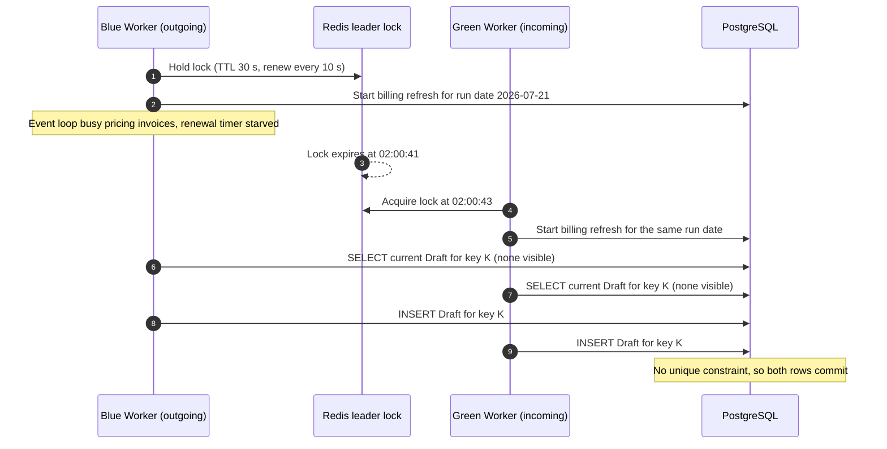

# Post-Incident Review: INC-2026-007 Duplicate Client Invoices

## Document control

| Field | Value |
|---|---|
| Document ID | PIR-2026-007 |
| Version | 1.1 |
| Status | Approved |
| Owner | Business Analyst |
| Last updated | 2026-09-24 |
| Reviewers | Engineering Lead (Incident Commander), backend developer (Technical Lead), Customer Success Lead (Communications Lead), QA Lead, Product Owner, Compliance and Privacy Officer |

| Version | Date | Change |
|---|---|---|
| 1.0 | 2026-07-27 | Approved at review meeting |
| 1.1 | 2026-09-24 | CAPA closed; requirement changes baselined in SRS v1.3 (CR-005) |

## Incident summary

| Field | Value |
|---|---|
| Incident ID | INC-2026-007 |
| Title | Duplicate client invoices from concurrent billing runs |
| Severity | SEV-2 |
| Status | Closed |
| Incident date | 2026-07-21 |
| Start (trigger) | 2026-07-21 02:00 ET |
| Detected | 2026-07-21 09:32 ET (customer support ticket) |
| Mitigated | 2026-07-21 10:48 ET |
| Resolved | 2026-07-22 15:40 ET |
| Duration (start to resolved) | 37 h 40 min |
| Incident Commander | Engineering Lead |
| PIR author | Business Analyst |
| Reviewers | Technical Lead (backend developer), Communications Lead (Customer Success Lead), QA Lead, Product Owner, Compliance and Privacy Officer |
| Related CR | CR-005 (DB-enforced billing idempotency and pre-issue duplicate check) |
| Related ADR / NFR | ADR-003, NFR-OBS-02, NFR-MNT-02 |

## 1. Executive summary

In the early hours of 2026-07-21, a blue/green deployment overlapped the nightly billing job. The outgoing scheduler Worker lost its leader lock while still running the job, the incoming Worker took the lock and started the same job, and both runs created draft invoices. Because billing idempotency (BR-050) was enforced only by an application-level check-then-insert, with no database unique constraint, 214 duplicate draft invoices were created across 9 tenants. Three tenants had automatic issuing enabled for private-pay invoices, so 37 duplicates were emailed to clients with payment links, and 6 clients paid twice; $2,914.50 was refunded. No alert fired; a Billing and Payroll Specialist reported it 7.5 hours later. The team stopped automatic issuing within 12 minutes of declaring the incident, voided or credited every duplicate with tenant agreement, and added a database-enforced idempotency key, durable job claims and an invoice-count anomaly alert. CR-005 baselined the requirement changes in SRS v1.3.

## 2. Customer and business impact

| Dimension | Impact |
|---|---|
| Tenants affected | 9 of 12 live tenants: TEN-001, TEN-002, TEN-003 and 6 early-access tenants (A to F) |
| Users affected | Billing and Payroll Specialists and Agency Administrators at 9 tenants; 37 private-pay clients or their bill payers at 3 tenants |
| Records affected | 214 duplicate Draft invoices; 37 of them auto-issued and emailed with payment links |
| Money | Issued duplicate value $13,948.25 across 37 invoices; 6 clients paid both invoices; $2,914.50 refunded in full |
| Care delivery | None. EVV, eMAR and scheduling were unaffected |
| Compliance | No PHI disclosure: each duplicate went to the same bill-to contact as the valid invoice (Compliance and Privacy Officer confirmed 2026-07-21). No claim batch was exported for an affected period, so no duplicate reached a payer or clearinghouse |
| Downstream workflows | Nightly billing paused for one night; automatic issuing paused for all tenants for 29 hours; agencies' month-to-date AR reports overstated until correction |

### Duplicates by tenant

| Tenant | Duplicate drafts | Auto-issued and emailed | Clients who paid twice |
|---|---|---|---|
| TEN-001 Harborview Home Care | 61 | 22 | 3 |
| TEN-002 Cedar Lane Adult Day Center | 34 | 0 | 0 |
| TEN-003 Northgate Supported Living | 18 | 0 | 0 |
| Early-access tenant A | 27 | 9 | 2 |
| Early-access tenant B | 14 | 6 | 1 |
| Early-access tenant C | 22 | 0 | 0 |
| Early-access tenant D | 16 | 0 | 0 |
| Early-access tenant E | 12 | 0 | 0 |
| Early-access tenant F | 10 | 0 | 0 |
| **Total** | **214** | **37** | **6** |

## 3. Timeline

All times America/New_York (EDT).

| Time | Event | Actor (role) |
|---|---|---|
| 2026-07-21 01:52 | Blue/green deployment of the API and Worker release starts in the nightly release window | CI/CD pipeline |
| 01:58 | Green task set healthy; traffic shifts to green; blue tasks begin a 10-minute drain | CI/CD pipeline |
| **02:00:00** | **Start:** blue Worker, holding the Redis leader lock, starts the nightly billing draft refresh | System |
| 02:00:41 | Blue Worker's event loop is busy pricing TEN-001 invoices; the lock renewal timer cannot run and the 30-second lock lapses | System |
| 02:00:43 | Green Worker acquires the lock and starts the same job for the same run date | System |
| 02:00:43-02:08:05 | Both Workers run concurrently. For each tenant, client, payer and period, each run checks for a current Draft before inserting; under concurrency both checks pass and both insert. 214 keys across 9 tenants get two Drafts | System |
| 02:08:20 | Blue Worker stops at the end of the drain | CI/CD pipeline |
| 02:13:30 | Green job logs "completed: 469 invoices created or updated" (previous night: 255). No alert exists on this count | System |
| 02:13:31 | Auto-issue step at TEN-001 and early-access tenants A and B approves and issues private-pay drafts for the weekly period 2026-07-13 to 2026-07-19, including 37 duplicate pairs; invoice emails scheduled for 07:00 | System |
| 07:00 | 74 invoice emails (37 pairs) sent to bill-to contacts with payment links | System |
| 07:12 | First client pays both invoices by card | Client |
| 08:46 | A client calls the TEN-001 office about two invoices for the same week | TEN-001 office |
| **09:32** | **Detected:** TEN-001 Billing and Payroll Specialist opens a support ticket: "Clients received two invoices for the same week" | Customer (AG-FIN) |
| **09:51** | **Acknowledged:** Platform Support picks up the ticket and requests a read-only support access grant (BR-008) | Platform Support |
| 10:04 | TEN-001 Agency Administrator approves a 4-hour read-only grant | Customer (AG-ADM) |
| 10:19 | Platform Support confirms two invoices with the same client, payer and period; pages on-call | Platform Support |
| 10:27 | On-call backend developer acknowledges the page | Technical Lead |
| 10:36 | SEV-2 declared; Engineering Lead is IC; channel `#inc-2026-007` opened; Business Analyst and Customer Success Lead paged | IC |
| **10:48** | **Mitigated:** feature flag `billing.autoIssue` turned off for all tenants; nightly billing job paused | Technical Lead |
| 10:55 | Logs show two starts of the billing job for the same run date, one per task set | Technical Lead |
| 11:05 | Business Analyst's impact query (counts only, no PHI): 214 duplicate keys, 9 tenants, 37 issued pairs at 3 tenants, payments already received on some duplicates | Business Analyst |
| 11:20 | Payment links on all 74 invoices in the 37 issued pairs deactivated through the payment provider, to stop further double payments | Technical Lead |
| 11:40 | Status page: "Identified - Some agencies' billing runs created duplicate draft invoices" | Communications Lead |
| 11:52 | Email to administrators of the 9 affected tenants with their own counts | Communications Lead |
| 13:15 | Correction rule agreed with the three auto-issue tenants' Billing and Payroll Specialists (section 11) | Business Analyst, Product Owner |
| 14:30 | Correction script dry run; Business Analyst reconciles output to the impact list (214 keys: 177 Draft voids, 31 Issued voids, 6 credit notes) | Business Analyst, Technical Lead |
| 15:30 | Correction executed; every change writes an audit event referencing INC-2026-007 | Technical Lead |
| 16:10 | Client letter template sent to the 3 auto-issue tenants for their 37 clients | Communications Lead |
| 2026-07-22 09:00 | Agencies issue 6 credit notes and initiate refunds in their payment provider accounts, guided by Customer Success | Customers (AG-FIN) |
| 11:30 | Emergency change: partial unique index on `invoices.idempotency_key` over non-void invoices deployed. Index creation succeeds because all duplicates were voided | Technical Lead |
| 12:00 | Billing job re-enabled; manual run for 2026-07-22 produces the same invoice count as a single run | Technical Lead |
| 13:00 | Fresh payment links sent for the 27 kept invoices that were still unpaid | Customers (AG-FIN) |
| **15:40** | **Resolved:** all 214 duplicates voided or credited; auto-issue re-enabled for early-access tenants A and B after each Billing and Payroll Specialist confirmed. TEN-001 chose to keep auto-issue off and approve private-pay invoices manually | IC |
| 2026-07-23 | CR-005 raised (within 2 business days of the emergency change); approved by the CCB on 2026-07-30 | Engineering Lead (requester), Business Analyst (impact analysis) |
| 2026-07-24 | Last of the 6 refunds (ACH) confirmed settled | Customer Success Lead |
| 2026-07-27 | PIR review meeting | Business Analyst |
| 2026-07-28 | ADR-003 accepted | Engineering Lead |

### How the race happened



## 4. Detection analysis

Detection took 7 hours 32 minutes, and it came from a customer.

- **The signal existed and nobody watched it.** The job logged 469 invoices against 255 the night before, an 84% jump, at 02:13. There was no alert on business outputs of scheduled jobs; monitoring covered errors, latency and job failure, and this job "succeeded".
- **The overlap left no technical error.** Both runs completed without exceptions, so error tracking stayed quiet.
- **The first customer-visible effect was at 07:00,** when emails went out. The first client call reached TEN-001 at 08:46, and the agency reported it at 09:32.
- **With today's controls** (NFR-OBS-02 invoice-count alert, added by CAPA-007-04), the 84% deviation would page on-call at about 02:14 and pause auto-issue for the affected tenants before any email was sent. The unique index (CAPA-007-01) would have prevented the duplicates altogether.

## 5. Response analysis

| Measure | Target (SEV-2) | Actual | Met? |
|---|---|---|---|
| Acknowledge | 15 min | 19 min (09:32 to 09:51, ticket triage) | No |
| IC assigned | 30 min from acknowledgement | 45 min (09:51 to 10:36) | No |
| First status page post | 60 min from declaration | 64 min (10:36 to 11:40) | No (4 min late) |
| Update cadence | Every 60 min | Met until resolution | Yes |
| Mitigation | n/a | 12 min after declaration; 1 h 16 min after detection | n/a |

- **Triage to page took 47 minutes,** of which 13 minutes was waiting for the support access grant. That wait is a deliberate privacy control (BR-008) and stays. The rest was Platform Support reproducing the problem before paging; the triage guide now says to page on any report of duplicate money records, without waiting to reproduce.
- **Mitigation was fast and safe** because automatic issuing was behind a feature flag. Turning it off did not stop agencies from issuing invoices manually.
- **Deactivating payment links at 11:20** stopped further double payments; no double payment happened after 10:58.
- **Data correction was deliberate rather than fast.** The team chose to agree a correction rule with the three affected Billing and Payroll Specialists before changing anything, because invoices are financial records the agencies own. That added about two hours and avoided a second correction.

## 6. Root cause analysis

### 6.1 Five whys

1. **Why did clients receive two invoices?** Because two Draft invoices existed for the same tenant, client, payer and period, and automatic issuing issued both.
2. **Why did two Drafts exist?** Because two billing jobs ran at the same time and each inserted a Draft after checking that none existed (check-then-insert).
3. **Why did two jobs run?** Because during the deployment overlap the outgoing Worker's Redis lock lapsed while it was still running the job, and the incoming Worker acquired the lock and started the same job.
4. **Why did concurrent runs produce duplicates instead of a conflict?** Because uniqueness of the idempotency key in BR-050 was enforced only in application code; the database had no unique constraint on `invoices.idempotency_key`.
5. **Why was there no constraint?** Because BR-050 and FR-BIL-01 stated the business outcome ("never creates a second invoice for the same key") but not where it is enforced, the design treated the leader lock as a correctness guarantee, and no acceptance criterion or test covered two concurrent runs.

**Root cause statement:** Billing idempotency depended on a timing-based leader lock and an application-level check, with no database-enforced uniqueness, and the requirement did not specify the enforcement point or a concurrency test.

### 6.2 Contributing factors

| Category | Factor |
|---|---|
| Requirements | BR-050 and FR-BIL-01 (v1.2) were silent on enforcement. No acceptance criterion covered concurrent runs. Automatic issuing had no pre-issue duplicate check. No requirement asked for anomaly detection on billing outputs |
| Technology | Lock renewal ran on the same event loop as CPU-heavy invoice pricing. Each tenant's invoices were built in one long transaction, which widened the race window. No unique index on the idempotency key |
| Process | The nightly release window (01:45-02:15) overlapped the nightly job window (02:00). The deployment checklist did not check for running jobs. Job output counts were logged but not monitored |
| People | Platform Support's triage guide asked for reproduction before paging, which is right for most tickets but slow for money-related ones |

### 6.3 Requirement-gap classification

| Cause | Classification | Evidence |
|---|---|---|
| No database uniqueness on the idempotency key | Requirements gap (enforcement point unspecified) and design defect | BR-050, FR-BIL-01 in SRS v1.2 |
| Two runs possible during deployments | Implementation defect against NFR-MNT-02 ("scheduled jobs are single-flight across deployments") | NFR-MNT-02 in SRS v1.2 |
| Concurrent runs never tested | Test gap | No test case for concurrent billing runs |
| Duplicates issued automatically | Requirements gap (no pre-issue check) | FR-BIL-04, FR-BIL-05 in SRS v1.2 |
| No detection | Requirements gap (no business anomaly NFR) | NFR-OBS-01 covered technical signals only |

## 7. What went well, what went poorly, where we got lucky

| What went well | What went poorly | Where we got lucky |
|---|---|---|
| The TEN-001 Billing and Payroll Specialist reported precise examples within 46 minutes of the first client call | No alert; a customer found it 7.5 hours after the start | It happened mid-month. No Medicaid or managed-care claim batch was exported for an affected period; at month end, duplicates could have reached payers through clearinghouses |
| The support access grant worked as designed and every action was audited | 37 clients received two invoices and 6 paid twice, which embarrassed three agencies with their own clients | Only 3 tenants had auto-issue enabled |
| Feature flag stopped auto-issue in 12 minutes without a deploy | First status page post was 4 minutes late | The blue Worker stopped after 7 minutes; a longer drain would have doubled more tenants |
| The Business Analyst's impact numbers within 30 minutes let customer emails state each tenant's own counts | Refunds depended on each agency working in its own payment provider account | All payments came through payment links, so every double payment was traceable and refundable |
| Corrections voided or credited, never deleted, so the audit trail is complete (BR-051, BR-057) | The release calendar and job calendar had no single owner | |

## 8. Corrective and preventive actions

| ID | Action | Type | Owner (role) | Due | Status | Tracking ref |
|---|---|---|---|---|---|---|
| CAPA-007-01 | Partial unique index on `invoices.idempotency_key` over non-void invoices; drafts written by upsert | Prevent | Engineering Lead | 2026-07-22 | Done | CR-005; ADR-003 layer 3; US-044-AC3 |
| CAPA-007-02 | Replace leader-lock single-flight with durable `job_executions` claims for all scheduled jobs | Prevent | Engineering Lead | 2026-08-07 | Done | ADR-003 layer 2; NFR-MNT-02 |
| CAPA-007-03 | Pre-issue duplicate check blocks manual and automatic issuing when another non-void invoice exists for the same client and payer with an overlapping period, or when any of its visits already sits on another non-void invoice | Prevent | Product Owner | R1.1 | Done | CR-005; US-044-AC4 |
| CAPA-007-04 | Billing run invoice-count anomaly alert (more than 20% from the previous run) that pauses auto-issue for the tenant's run | Detect | Engineering Lead | 2026-08-14 | Done (alert fired in staging test 2026-08-13) | NFR-OBS-02; [deployment and security](../../03-design/architecture/deployment-and-security.md) |
| CAPA-007-05 | Automated regression test: two Workers start the same billing run; result must equal a single run | Detect | QA Lead | 2026-08-07 | Done | US-044-AC3; [test cases](../../06-quality/test-cases.md) |
| CAPA-007-06 | Release calendar excludes 01:30-03:00 ET; deployment checklist checks for running scheduled jobs | Process | Engineering Lead | 2026-07-31 | Done | Release runbook |
| CAPA-007-07 | Amend BR-050 and FR-BIL-01 with the enforcement point and pre-issue check; add a Definition of Done item that every scheduled job has a reviewed idempotency key | Process | Business Analyst | 2026-09-24 | Done | CR-005; SRS v1.3; [Definition of Ready and Done](../../05-delivery/definition-of-ready-and-done.md) |
| CAPA-007-08 | Duplicate-invoice correction runbook: pairing rule, void vs credit note, client letter template, refund reconciliation | Mitigate | Customer Success Lead | 2026-08-07 | Done | Support runbook |

## 9. Requirement and documentation changes

| Artifact | Change | Baselined in |
|---|---|---|
| BR-050 | Rule text unchanged. Enforcement added: the idempotency key (tenant + client + payer + period) is enforced by a database unique constraint over non-void invoices, so a concurrent or repeated run updates the existing Draft | SRS v1.3 (CR-005) |
| FR-BIL-01 | Pre-issue duplicate check added: issuing, manual or automatic, is blocked when another non-void invoice exists for the same client and payer with an overlapping period, or when any of its visits already sits on another non-void invoice | SRS v1.3 (CR-005) |
| NFR-OBS-02 | Trigger added: a billing run's invoice count deviates more than 20% from the previous run | SRS v1.3 |
| NFR-MNT-02 | Wording unchanged; verification now includes the concurrent-Worker test (CAPA-007-05) | SRS v1.3 |
| US-044 | AC3 (concurrent runs) and AC4 (pre-issue duplicate check) added | [EP-11 stories](../../05-delivery/user-stories/EP-11-billing.md) v1.3 |
| ADR-003 | New ADR: durable job claims plus database-enforced business idempotency | ADR-003 v1.0 (2026-07-28) |
| Incident management process | Business anomaly alerts as triggers; data-correction rules; BA impact analysis as a standard step | v1.1 (2026-07-29) |
| Discovery retrospective | WS3-D7 annotated: rule stated without enforcement point | [Discovery notes](../../01-discovery/discovery-workshop-notes.md) v1.2 |

## 10. Lessons learned

1. **A rule that protects money needs an enforcement point and a detection signal, written at the same time as the rule.** The Business Analyst now adds both to every business rule in the billing, payroll and payment areas.
2. **Locks are optimizations; uniqueness belongs in the database.** Any rule phrased "never creates a second" gets a database constraint.
3. **Release windows and job windows are one calendar.** Deployments are scheduled against the job calendar, and overlapping Workers are assumed, not avoided.
4. **Automation that reaches clients needs a pre-flight check sized to its blast radius.** Automatic issuing now runs only after the duplicate check and the anomaly check pass.
5. **Exact numbers early change the conversation with customers.** Tenant-specific counts in the first email turned three worried agencies into partners in the correction.

## 11. Data correction and refund reconciliation

### 11.1 Correction rule (agreed 2026-07-21 13:15)

| Situation | Rule | Count |
|---|---|---|
| Both invoices still Draft | Void the later-created Draft with reason "Duplicate invoice - INC-2026-007" | 177 |
| Both Issued, neither paid | Keep the earlier-created invoice; void the later one; send a fresh payment link for the kept invoice | 27 |
| Both Issued, one paid | Keep the paid invoice, whichever was created first; void the unpaid twin | 4 |
| Both Issued, both paid | Keep the earlier-created invoice; issue a credit note for the full amount against the later one (paid invoices cannot be voided, BR-051); the agency refunds the payment | 6 |
| **Total duplicates corrected** | | **214** |

Voids total 208 (177 Draft and 31 Issued). The dry run listed 214 keys and matched the Business Analyst's impact list one to one before execution.

### 11.2 Refund reconciliation: 6 clients, $2,914.50

| Client | Tenant | Billing basis | Kept invoice | Duplicate (credited) | Amount refunded | Method | Credit note issued | Refund confirmed |
|---|---|---|---|---|---|---|---|---|
| C-10241 | TEN-001 | Hourly, 48 units at $8.50 | INV-2026-000874 | INV-2026-000951 | $408.00 | Card | 2026-07-22 | 2026-07-22 |
| C-10377 | TEN-001 | Hourly, 72 units at $8.50 | INV-2026-000881 | INV-2026-000958 | $612.00 | Card | 2026-07-22 | 2026-07-22 |
| C-10402 | TEN-001 | Hourly, 40 units at $8.50 | INV-2026-000886 | INV-2026-000963 | $340.00 | ACH | 2026-07-22 | 2026-07-24 |
| C-11026 | Early-access tenant A | Hourly, 88 units at $9.00 | INV-2026-000144 | INV-2026-000171 | $792.00 | Card | 2026-07-22 | 2026-07-22 |
| C-11093 | Early-access tenant A | Per visit, 6 visits at $68.75 | INV-2026-000149 | INV-2026-000176 | $412.50 | Card | 2026-07-22 | 2026-07-22 |
| C-12011 | Early-access tenant B | Hourly, 40 units at $8.75 | INV-2026-000052 | INV-2026-000067 | $350.00 | ACH | 2026-07-22 | 2026-07-24 |
| **Total** | | | | | **$2,914.50** | 4 card ($2,224.50), 2 ACH ($690.00) | | |

Reconciliation checks performed by the Business Analyst with each agency's Billing and Payroll Specialist:

- Sum of credit notes in Tendwell = $2,914.50 = sum of refunds in the three agencies' payment provider accounts.
- Each kept invoice shows status Paid with balance $0.00; each credited duplicate shows a credit equal to its payment and balance $0.00.
- AR ageing reports for the 9 tenants after correction match each tenant's pre-incident AR plus the legitimate 2026-07-21 invoices.

## Appendix A. Key metrics

| Metric | Value |
|---|---|
| Time to detect (start to detection) | 7 h 32 min |
| Time to acknowledge | 19 min |
| Time to mitigate (detection to mitigation) | 1 h 16 min |
| Time to resolve (detection to resolution) | 30 h 08 min |
| Duration (start to resolution) | 37 h 40 min |
| Invoices created by the run vs previous night | 469 vs 255 (+84%) |
| Duplicates corrected | 214 (208 voided, 6 credited) |
| Refunds | 6 clients, $2,914.50 |

## Appendix B. Customer communication excerpt

Email to administrators of affected tenants, 2026-07-21 11:52 ET (TEN-001 version):

```text
Subject: Tendwell incident INC-2026-007: duplicate draft invoices - identified

Hello,

Early this morning, a fault in Tendwell's nightly billing process created a second
draft invoice for some of your clients for the same payer and period.

How it affected your agency:
- 61 duplicate draft invoices in your account.
- 22 of them were private-pay invoices issued automatically and emailed at 07:00
  with a payment link. Your clients received two invoices for the week of
  2026-07-13 to 2026-07-19.
- We see payments on both invoices for 3 clients so far.

What we have done:
- Automatic issuing is paused for all agencies.
- Payment links on the affected invoices are deactivated, so no further double
  payments can be made.

What we need from you:
- Please do not void or credit anything yet. We will call you by 13:00 ET to agree
  how to correct each pair, and we will provide a letter you can send to the
  affected clients.

We will send a written post-incident summary within 5 business days.

Customer Success Lead, Tendwell Labs
```

## Approval

| Role | Decision | Date |
|---|---|---|
| Incident Commander (Engineering Lead) | Approved | 2026-07-27 |
| Product Owner | Approved | 2026-07-27 |
| Compliance and Privacy Officer | Approved (no PHI disclosure) | 2026-07-27 |
| Business Analyst (author) | Prepared | 2026-07-24 |

## Related documents

- [Incident management process](../incident-management-process.md)
- [Incident register](../incident-register.csv)
- [ADR-003 Single-flight scheduled jobs](../../03-design/architecture/adr/ADR-003-single-flight-scheduled-jobs.md)
- [Change request log (CR-005)](../../05-delivery/change-request-log.md)
- [EP-11 Billing user stories](../../05-delivery/user-stories/EP-11-billing.md)
- [Business rules](../../02-requirements/business-rules.md)
- [Non-functional requirements](../../02-requirements/non-functional-requirements.md)
- [Deployment and security](../../03-design/architecture/deployment-and-security.md)
- [Test cases](../../06-quality/test-cases.md)
