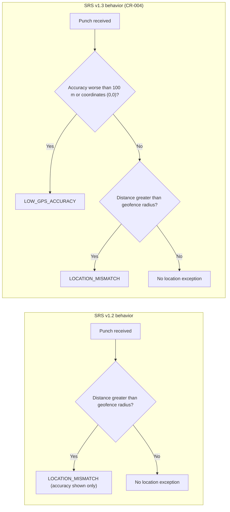

# Post-Incident Review: INC-2026-011 False Location Mismatch Exceptions

## Document control

| Field | Value |
|---|---|
| Document ID | PIR-2026-011 |
| Version | 1.1 |
| Status | Approved |
| Owner | Business Analyst |
| Last updated | 2026-09-24 |
| Reviewers | Engineering Lead (Incident Commander), mobile developer (Technical Lead), Customer Success Lead (Communications Lead), QA Lead, Product Owner, Compliance and Privacy Officer |

| Version | Date | Change |
|---|---|---|
| 1.0 | 2026-08-26 | Approved at review meeting |
| 1.1 | 2026-09-24 | CAPA closed; requirement changes baselined in SRS v1.3 (CR-004) |

## Incident summary

| Field | Value |
|---|---|
| Incident ID | INC-2026-011 |
| Title | False Location mismatch exceptions after Caregiver app v1.6.0 |
| Severity | SEV-2 |
| Status | Closed |
| Incident date | 2026-08-18 |
| Start (trigger) | 2026-08-18 05:58 ET (first affected clock-in) |
| Detected | 2026-08-18 16:40 ET (customer email to Customer Success) |
| Mitigated | 2026-08-20 21:10 ET (server emergency change) |
| Resolved | 2026-08-21 16:00 ET |
| Duration (start to resolved) | 82 h 02 min |
| Incident Commander | Engineering Lead |
| PIR author | Business Analyst |
| Reviewers | Technical Lead (mobile developer), Communications Lead (Customer Success Lead), QA Lead, Product Owner, Compliance and Privacy Officer |
| Related CR | CR-004 (separate Low GPS accuracy exception from Location mismatch) |
| Related ADR / NFR | ADR-002 (bulk resolution acts on exceptions only), NFR-OBS-02, NFR-MOB-01 |

## 1. Executive summary

Caregiver app v1.6.0, released on the evening of 2026-08-17, introduced a new permissions screen that re-requested location access from every user. On iOS the system prompt lets the user switch Precise Location off, and many caregivers did. With precise location off, iOS reports positions with roughly 3-5 km accuracy. The app neither checked nor requested precise location, and the server, following BR-022 as written in SRS v1.2, judged the punch by distance alone. Over three days, 41% of iOS clock-ins (1,180 of 2,878) were flagged as Location mismatch across 11 tenants. No punch was blocked and no EVV data was lost, but Coordinators spent about 27 hours resolving false exceptions one by one, and payroll exports were delayed by one day for 2 tenants. Detection took 10 hours 42 minutes, and the first report was triaged as a training issue for 18 hours. The fix separated Low GPS accuracy from Location mismatch (CR-004), made the app ask for precise location, added a bulk-resolve tool limited to the new exception code, added the QA device-matrix settings that were missing, and added an EVV exception-rate alert.

## 2. Customer and business impact

| Dimension | Impact |
|---|---|
| Tenants affected | 11 of 17 live tenants (every tenant with iOS caregivers): TEN-001, TEN-002, TEN-003 and 8 early-access tenants |
| Users affected | iOS caregivers on v1.6.0; Care Coordinators at 11 tenants; Billing and Payroll Specialists at 2 tenants |
| Records affected | 1,180 false LOCATION_MISMATCH exceptions on 2,878 iOS clock-ins from 2026-08-18 to 2026-08-20 (41.0%). Android clock-ins were unaffected (Location mismatch rate 3.1%, in line with the prior 7 days) |
| Coordinator effort | 412 false exceptions were resolved individually before the bulk tool existed, at about 4 minutes each: about 27 hours of Coordinator time across 11 tenants |
| Payroll | Two early-access tenants, both with weekly pay periods ending Wednesday 2026-08-19, exported payroll on 2026-08-21 instead of 2026-08-20; their pre-export reviews listed 146 and 88 open exceptions. Paychecks were issued on schedule because both payroll providers' cutoffs allowed one day |
| Billing | None. Affected visits stayed Needs review until resolved; all were resolved before month-end billing |
| Care delivery | None. Punches were never blocked (FR-EVV-03) |
| Compliance | No EVV data lost: every punch stored coordinates, accuracy and device time. For 1,180 visits the stored location was approximate; the visit history shows the accuracy so agencies can explain it to their state EVV aggregator. Agencies remain responsible for their EVV submissions |

## 3. Timeline

All times America/New_York (EDT).

| Time | Event | Actor (role) |
|---|---|---|
| 2026-08-17 19:30 | Caregiver app v1.6.0 released to 100% of users on both stores. It includes a new onboarding and permissions screen that re-requests location permission after the update | Mobile developer |
| **2026-08-18 05:58** | **Start:** first v1.6.0 iOS clock-in with reduced accuracy, at a TEN-003 supported living home: accuracy 3,400 m, computed distance 2,870 m, LOCATION_MISMATCH raised | System |
| 06:00-16:00 | iOS Location mismatch rate climbs to over 40%; Coordinators resolve them one by one, many after phoning caregivers | Customers (AG-COORD) |
| **16:40** | **Detected:** TEN-001 Care Coordinator emails Customer Success: "Lots of location exceptions today, mostly iPhones?" | Customer (AG-COORD) |
| 17:05 | Customer Success replies with guidance on location settings and logs a low-priority "training" ticket | Customer Success Lead |
| 2026-08-19 08:30 | TEN-003 house lead calls: more than 30 location exceptions from the overnight shift change. A second early-access tenant emails the same | Customers |
| 10:15 | Customer Success pulls the EVV compliance report: Location mismatch exceptions at 5 times the prior week, concentrated on iOS | Customer Success Lead |
| **11:02** | **Acknowledged:** Customer Success pages on-call; on-call acknowledges | Customer Success Lead, on-call |
| 11:20 | SEV-2 declared; Engineering Lead is IC; channel `#inc-2026-011`; Business Analyst, mobile developer and QA Lead join | IC |
| 12:10 | Status page: "Investigating - Extra location exceptions for some iPhone users" | Communications Lead |
| 12:30 | Mobile developer and QA reproduce on a test iPhone with Precise Location off: fixes report 3,000-5,000 m accuracy and are sent as-is | Technical Lead, QA Lead |
| 13:00 | Business Analyst's requirement-gap analysis: the server behaved as BR-022 (v1.2) specified; no requirement covered reduced-accuracy permission; US-025 had no reduced-accuracy case; the QA device matrix lacked the setting | Business Analyst |
| 13:40 | Email to all tenant administrators with a workaround: ask iOS caregivers to turn Precise Location on; hold exceptions with accuracy worse than 100 m until a bulk tool is available | Communications Lead |
| 14:15 | In-app message to iOS caregivers (no PHI) with steps to turn on Precise Location | Communications Lead |
| 15:00 | Decision: do not suppress or auto-resolve exceptions. Classify low-accuracy fixes as a separate exception, give Coordinators a bulk tool limited to that code, and ship an app fix. Rationale in section 5 | IC, Product Owner, Business Analyst, Compliance and Privacy Officer |
| 16:00 | App Store rollback not possible; phased release had not been enabled for v1.6.0 | Technical Lead |
| 2026-08-20 09:00 | App v1.6.1 submitted with an expedited review request: checks accuracy authorization, explains why precise location matters and offers Settings; never blocks the punch | Mobile developer |
| 2026-08-20 | Two early-access tenants with Wednesday period ends postpone payroll export by one day | Customers (AG-FIN) |
| **21:10** | **Mitigated:** server emergency change behind flag `evv.lowGpsAccuracyException`: fixes with accuracy worse than 100 m, or coordinates (0,0), raise LOW_GPS_ACCURACY instead of LOCATION_MISMATCH. Reclassification script: the 768 still-open false exceptions are resolved by the system with reason "Reclassified - low GPS accuracy (INC-2026-011)" and a LOW_GPS_ACCURACY exception is opened on each visit; punches are not touched (ADR-002) | Technical Lead, Business Analyst (verified counts) |
| 2026-08-21 07:00 | Bulk-resolve tool released in the exception queue, limited to LOW_GPS_ACCURACY | Technical Lead |
| 07:45 | App Store approves v1.6.1; released to 100% at 08:05 | Mobile developer |
| 09:00-12:00 | Customer Success office hours; Coordinators at 11 tenants bulk-resolve 759 LOW_GPS_ACCURACY exceptions; 9 are reviewed individually by choice | Customers (AG-COORD), Customer Success Lead |
| 2026-08-21 | The two early-access tenants export payroll | Customers (AG-FIN) |
| **16:00** | **Resolved:** v1.6.1 on 71% of iOS devices; exception rate within 1.2 times the 7-day baseline; no reclassified exceptions left open | IC |
| 2026-08-21 | CR-004 raised (within 2 business days of the emergency change); approved by the CCB on 2026-08-26 | Customer Success Lead (requester), Business Analyst (impact analysis) |
| 2026-08-26 | PIR review meeting | Business Analyst |

### Exception classification before and after



Canonical examples at radius 150 m: 212 m at 18 m accuracy is LOCATION_MISMATCH; 95 m at 3,400 m accuracy is LOW_GPS_ACCURACY (not mismatch); 40 m at 12 m accuracy raises no exception.

## 4. Detection analysis

Detection took 10 hours 42 minutes, and recognition took another 18 hours 22 minutes.

- **The signal was strong and early.** By 07:00 on 2026-08-18, the hourly ratio of Location mismatch exceptions to iOS punches was more than 10 times its 7-day baseline. No alert existed on business outcomes such as exception rates.
- **Release monitoring watched the wrong thing.** The v1.6.0 release was monitored for crashes and error rates, which stayed normal. The app worked; it just produced bad classifications.
- **The first report sounded like a training issue.** Location exceptions are common for new users, so Customer Success reasonably responded with guidance. There was no rule to escalate repeated reports of the same pattern, and no dashboard by app version or platform.
- **With today's controls,** the NFR-OBS-02 exception-rate alert (more than 2 times the 7-day baseline, broken down by platform and app version, CAPA-011-04) would have paged on-call at about 07:00 on the first morning, and the 24-hour business-metric gate on phased rollout (CAPA-011-06) would have stopped v1.6.0 at a small share of iOS users.

## 5. Response analysis

| Measure | Target (SEV-2) | Actual | Met? |
|---|---|---|---|
| Acknowledge | 15 min | 18 h 22 min (16:40 to 11:02 next day) | No |
| IC assigned | 30 min | 18 min after acknowledgement | Yes |
| First status page post | 60 min from declaration | 50 min | Yes |
| Update cadence | Every 60 min | Met during the day; overnight posts said "next update 08:00" | Partly |
| Mitigation | n/a | 34 h after declaration; 52 h 30 min after detection | n/a |

**Why mitigation took 34 hours after declaration.** The team considered three options at 15:00 on 2026-08-19:

| Option | Speed | Why chosen or rejected |
|---|---|---|
| Stop raising Location mismatch for iOS punches | About 1 hour | Rejected. It would hide genuine mismatches and weaken the EVV evidence agencies rely on. The Compliance and Privacy Officer and Business Analyst agreed that the exception queue is the agency's review record and must stay trustworthy |
| Auto-resolve exceptions with accuracy worse than 100 m | About 3 hours | Rejected. Resolving an exception is the agency's attestation that the visit happened as recorded; the system should not make that attestation for them |
| Classify low-accuracy fixes as their own exception and give Coordinators a bulk tool for that code only | About 30 hours | Chosen. It keeps a human review, makes the review fast, and keeps genuine mismatches reviewable one by one |

The Business Analyst wrote the acceptance criteria for the reclassification script and the bulk tool during the incident (later US-029-AC5), and reconciled the script's dry run: 1,180 false exceptions, of which 412 were already resolved by Coordinators (left as they were) and 768 open (reclassified).

**Payroll.** The pre-export review (FR-PAY-04) correctly listed the open exceptions and kept unverified visits out of payroll (BR-028). The two tenants with Wednesday period ends chose to wait one day for the bulk tool rather than resolve 234 exceptions by hand.

## 6. Root cause analysis

### 6.1 Five whys

1. **Why were 41% of iOS clock-ins flagged?** Because the server computed distances greater than the 150 m geofence from approximate coordinates.
2. **Why were the coordinates approximate?** Because many iOS users switched Precise Location off when v1.6.0 re-prompted for location permission, and the app neither checked accuracy authorization nor asked for precise location.
3. **Why did the server treat an approximate fix as a mismatch?** Because BR-022 in SRS v1.2 stored accuracy and displayed it on the exception, but the exception decision used distance alone, and FR-EVV-07 had no separate low-accuracy exception.
4. **Why was this not caught before release?** Because neither the US-025 acceptance criteria nor the QA device matrix included reduced-accuracy location settings, and v1.6.0 went to 100% of users at once without a business-metric check.
5. **Why were reduced-accuracy settings missing from requirements and tests?** Because discovery and design treated "location permission granted" as "accurate location"; operating-system privacy settings were not an elicitation topic.

**Root cause statement:** The EVV rules equated a location fix with an accurate one, so the server classified low-accuracy fixes as location mismatches; a mobile release that led many iOS users to turn off Precise Location exposed the gap, and neither tests nor monitoring covered it.

### 6.2 Contributing factors

| Category | Factor |
|---|---|
| Requirements | BR-022 (v1.2) treated accuracy as display information only. FR-EVV-07 had no Low GPS accuracy exception. No acceptance criterion for reduced-accuracy permission. No requirement for an exception-rate anomaly alert. No requirement for bulk resolution |
| Technology | v1.6.0 re-prompted every user for location permission. The app did not read accuracy authorization or request temporary precise location. The server evaluated distance only |
| Process | QA device matrix lacked iOS "Precise Location: Off" and Android "Approximate location". The mobile release went to 100% with no phased rollout. Release health covered crashes, not business outcomes. Customer Success had no rule for repeated reports |
| People | The first report was reasonably read as a training issue; Customer Success had no view of exceptions by platform or app version |

### 6.3 Requirement-gap classification

| Cause | Classification | Evidence |
|---|---|---|
| Low-accuracy fixes raised LOCATION_MISMATCH | Requirements gap: the server behaved as specified | BR-022 and FR-EVV-07 in SRS v1.2 |
| App did not ask for precise location | Requirements gap and implementation change (new permission flow) | No requirement in SRS v1.2; v1.6.0 release notes |
| Not caught in QA | Test gap | QA device matrix; US-025 acceptance criteria in v1.2 |
| Late detection | Requirements gap (no business anomaly NFR) and process gap (triage) | NFR-OBS-01 covered technical signals only |

## 7. What went well, what went poorly, where we got lucky

| What went well | What went poorly | Where we got lucky |
|---|---|---|
| No punch was blocked; care continued and every punch was stored (FR-EVV-03 worked as designed) | 18 hours from first report to acknowledgement | Android was unaffected, so most tenants had a working baseline to compare against |
| Accuracy was stored on every punch, which made precise reclassification possible | v1.6.0 shipped to 100% of users with no phased release | The punch record already included accuracy; without it, reclassification would have been impossible |
| The append-only ledger meant reclassification touched exceptions only, never punches (ADR-002) | Coordinators spent about 27 hours on false exceptions | Most tenants were mid-pay-period; only 2 exports fell inside the window |
| The team kept a human review in the loop instead of suppressing exceptions | Two payroll exports were a day late | Expedited App Store review approved v1.6.1 within 23 hours |
| Customer Success office hours got 759 exceptions bulk-resolved in one morning | Overnight status updates were sparse | |

## 8. Corrective and preventive actions

| ID | Action | Type | Owner (role) | Due | Status | Tracking ref |
|---|---|---|---|---|---|---|
| CAPA-011-01 | Separate LOW_GPS_ACCURACY exception for accuracy worse than 100 m or coordinates (0,0); amend BR-022 and FR-EVV-07 | Prevent | Business Analyst (CR), Engineering Lead (build) | 2026-09-24 | Done | CR-004; US-025-AC3 |
| CAPA-011-02 | App checks accuracy authorization before clock-in, explains why precise location matters and offers Settings; the punch is never blocked | Prevent | Engineering Lead (mobile developer) | 2026-08-21 | Done (v1.6.1) | CR-004; US-025-AC6 |
| CAPA-011-03 | Bulk-resolve tool limited to LOW_GPS_ACCURACY; one reason code and note; each resolution audited individually | Mitigate | Product Owner | 2026-08-21 | Done | US-029-AC5; ADR-002 v1.1 |
| CAPA-011-04 | EVV exception-rate alert at more than 2 times the 7-day baseline, by platform, app version and exception code | Detect | Engineering Lead | 2026-09-04 | Done (fired in staging replay of 2026-08-18 data) | NFR-OBS-02; [deployment and security](../../03-design/architecture/deployment-and-security.md) |
| CAPA-011-05 | QA device matrix adds iOS Precise Location Off, Android Approximate location, permission re-prompt after update, and low-power modes (table below) | Process | QA Lead | 2026-08-28 | Done | [Test strategy](../../06-quality/test-strategy-and-plan.md); [test cases](../../06-quality/test-cases.md) |
| CAPA-011-06 | Mobile releases use phased rollout (iOS phased release; Android staged 10%, 50%, 100%) with a 24-hour gate on exception rate by app version | Process | Engineering Lead | 2026-08-28 | Done | Release runbook |
| CAPA-011-07 | Two customer reports of the same unexplained pattern within 24 hours open an incident | Process | Customer Success Lead | 2026-08-28 | Done | [Incident management process](../incident-management-process.md) v1.2 |
| CAPA-011-08 | EVV compliance report and exception queue can be filtered by exception code, platform and app version | Detect | Product Owner | 2026-09-24 | Done | FR-RPT-02 |
| CAPA-011-09 | Elicitation checklist for field-capture features adds operating-system privacy settings and permission states | Process | Business Analyst | 2026-09-30 | Done | [Discovery retrospective](../../01-discovery/discovery-workshop-notes.md) |

### Device matrix change (CAPA-011-05)

| Dimension | Before (R1 matrix) | After (from 2026-08-28) |
|---|---|---|
| Operating systems | Oldest supported and current iOS (iOS 16 and later); Android 10 and current (NFR-MOB-01) | Unchanged |
| Physical devices | 4 iPhones, 6 Android phones | Adds 2 low-end Android phones (2 GB RAM) |
| Location permission states | Granted while using; denied | Adds iOS Precise Location Off; Android Approximate location only; permission re-prompted after app update; permission revoked mid-visit |
| Location conditions | Indoors, outdoors | Adds simulated fixes with accuracy 50 m, 101 m, 3,400 m and coordinates (0,0) |
| Power and connectivity | Normal power; Wi-Fi, LTE, airplane mode | Adds iOS Low Power Mode and Android Battery Saver; 400 kbps throttling |
| Release gate | Crash-free sessions | Adds exception rate by app version during phased rollout |

## 9. Requirement and documentation changes

| Artifact | Change | Baselined in |
|---|---|---|
| BR-022 | v1.2: reported accuracy is stored with the punch and shown on any Location mismatch exception. v1.3: "A GPS fix with accuracy worse than 100 m, or coordinates (0,0), raises Low GPS accuracy instead of Location mismatch." | SRS v1.3 (CR-004) |
| FR-EVV-07 | Low GPS accuracy added to the list of automatic exceptions | SRS v1.3 (CR-004) |
| NFR-OBS-02 | Trigger added: EVV exception rate exceeds 2 times the 7-day baseline | SRS v1.3 |
| US-025 | AC3 rows for accuracy worse than 100 m and (0,0); AC6 asks for precise location | [EP-06 stories](../../05-delivery/user-stories/EP-06-evv.md) v1.3 |
| US-029 | AC5 bulk-resolve for LOW_GPS_ACCURACY only | [EP-06 stories](../../05-delivery/user-stories/EP-06-evv.md) v1.3 |
| Data dictionary | `exception_code` enumeration adds `LOW_GPS_ACCURACY` | [Data dictionary](../../03-design/data/data-dictionary.md) v1.3 |
| ADR-002 | v1.1 confirms bulk resolution acts on exceptions only, never on punches | [ADR-002](../../03-design/architecture/adr/ADR-002-append-only-evv-punch-ledger.md) |
| Test strategy | Device matrix change above | [Test strategy](../../06-quality/test-strategy-and-plan.md) |
| Incident management process | Two-reports-in-24-hours rule; mobile rollback guidance | v1.2 (2026-08-28) |

## 10. Lessons learned

1. **"Permission granted" is not "data is good".** Field-capture requirements now state the quality threshold for each captured signal and what happens below it.
2. **Monitor business outcomes, not just errors.** A release that works technically can still produce wrong classifications at scale; exception rates by app version are now a release gate.
3. **Do not let the system attest on the agency's behalf.** Bulk tools speed up human review; they do not replace it. That principle shaped CR-004 and is now in the BA's design checklist.
4. **Repeated "training issues" are a pattern.** Two similar reports in a day now open an incident.
5. **Store the evidence you might need to reinterpret later.** Accuracy on every punch made a precise correction possible.

## Appendix A. Key metrics

| Metric | Value |
|---|---|
| Time to detect (start to first signal) | 10 h 42 min |
| Time to acknowledge | 18 h 22 min |
| Time to mitigate (detection to mitigation) | 52 h 30 min |
| Time to resolve (detection to resolution) | 71 h 20 min |
| Duration (start to resolution) | 82 h 02 min |
| iOS clock-ins flagged, 2026-08-18 to 2026-08-20 | 1,180 of 2,878 (41.0%) |
| False exceptions resolved individually before the tool | 412 (about 27 Coordinator hours) |
| Reclassified and bulk-resolved | 768 reclassified; 759 bulk-resolved; 9 reviewed individually |
| Payroll exports delayed | 2 tenants, 1 day each |

## Appendix B. Customer communication excerpt

Email to all tenant administrators, 2026-08-19 13:40 ET:

```text
Subject: Tendwell incident INC-2026-011: extra location exceptions for iPhone users - identified

Hello,

Since the morning of 2026-08-18, many clock-ins from iPhones have been flagged
with a Location mismatch exception. Caregivers were never blocked and no visit
data is lost. The cause is an iPhone setting, Precise Location, which our latest
app update prompted many caregivers to turn off. With it off, the phone reports
a location that can be several kilometers away.

What you can do now:
- Ask caregivers who use iPhones to open Settings > Privacy & Security >
  Location Services > Tendwell and turn on Precise Location.
- In the exception queue, you can leave Location mismatch exceptions whose
  accuracy is worse than 100 m for now. We are building a way to review them
  together, and will tell you when it is ready.

Payroll: visits with open exceptions stay out of the payroll export until
resolved. If your export is due in the next two days, please call Customer
Success at +1-614-555-0142 so we can help you plan.

Next update by 18:00 ET.

Customer Success Lead, Tendwell Labs
```

## Approval

| Role | Decision | Date |
|---|---|---|
| Incident Commander (Engineering Lead) | Approved | 2026-08-26 |
| Product Owner | Approved | 2026-08-26 |
| Compliance and Privacy Officer | Approved | 2026-08-26 |
| Business Analyst (author) | Prepared | 2026-08-25 |

## Related documents

- [Incident management process](../incident-management-process.md)
- [Incident register](../incident-register.csv)
- [Change request log (CR-004)](../../05-delivery/change-request-log.md)
- [EP-06 EVV user stories](../../05-delivery/user-stories/EP-06-evv.md)
- [ADR-002 Append-only EVV punch ledger](../../03-design/architecture/adr/ADR-002-append-only-evv-punch-ledger.md)
- [Business rules](../../02-requirements/business-rules.md)
- [Non-functional requirements](../../02-requirements/non-functional-requirements.md)
- [Test strategy and plan](../../06-quality/test-strategy-and-plan.md)
- [Discovery workshop notes](../../01-discovery/discovery-workshop-notes.md)
