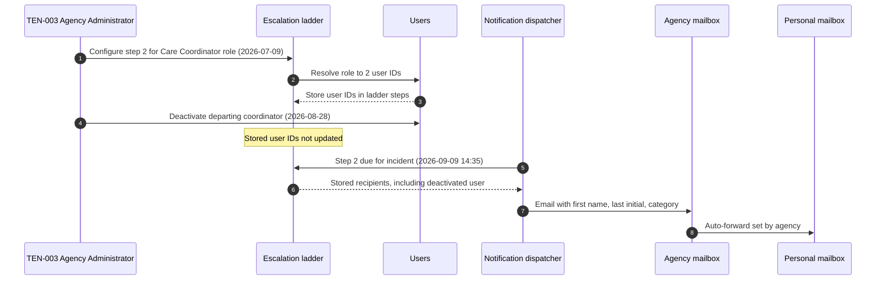

# Post-Incident Review: INC-2026-015 Escalation Email Sent to a Deactivated User

## Document control

| Field | Value |
|---|---|
| Document ID | PIR-2026-015 |
| Version | 1.1 |
| Status | Approved |
| Owner | Business Analyst |
| Last updated | 2026-09-28 |
| Reviewers | Engineering Lead (Incident Commander), Compliance and Privacy Officer (privacy lead), backend developer (Technical Lead), Customer Success Lead (Communications Lead), QA Lead, Product Owner |

| Version | Date | Change |
|---|---|---|
| 1.0 | 2026-09-16 | Approved at review meeting |
| 1.1 | 2026-09-28 | CAPA closed; requirement changes baselined in SRS v1.3 (CR-006); incident process v2.0 linked |

This review contains no PHI. The client is referred to only as "a resident of one TEN-003 home", and the former employee by role. The details needed for the covered entity's determination were shared with TEN-003 through the secure support portal, not in this document.

**Disclaimer:** the privacy assessment in section 11 is Tendwell Labs' input, as a business associate, to the covered entity's own determination. It is not legal advice. The final breach determination, and any notification it requires, rests with TEN-003 as the covered entity.

## Incident summary

| Field | Value |
|---|---|
| Incident ID | INC-2026-015 |
| Title | Client incident escalation email sent to a deactivated user |
| Severity | SEV-1 (privacy) |
| Status | Closed |
| Incident date | 2026-09-09 |
| Start (trigger) | 2026-09-09 14:35 ET (email sent) |
| Detected | 2026-09-09 15:28 ET (report from TEN-003 Agency Administrator) |
| Mitigated (contained) | 2026-09-09 16:10 ET |
| Resolved | 2026-09-10 17:30 ET |
| Duration (start to resolved) | 26 h 55 min |
| Incident Commander | Engineering Lead; privacy branch led by the Compliance and Privacy Officer |
| PIR author | Business Analyst |
| Reviewers | Compliance and Privacy Officer, Technical Lead (backend developer), Communications Lead (Customer Success Lead), QA Lead, Product Owner |
| Related CR | CR-006 (resolve notification recipients at send time; no PHI in email bodies) |
| Related ADR / NFR | NFR-PRIV-01, NFR-OBS-02, NFR-CMP-01; no ADR (design change recorded in the ERD v1.3) |

## 1. Executive summary

On 2026-09-09 a caregiver reported a fall involving a resident of one TEN-003 supported living home. When the High-severity incident was not acknowledged within 30 minutes, the escalation ladder's second step emailed the home's Care Coordinators. One recipient was a former Care Coordinator whose Tendwell account had been deactivated 12 days earlier. The email reached her agency mailbox, which the agency had set to forward to her personal address. The email contained the resident's first name and last initial and the incident category. The cause was a design choice: escalation recipients were resolved and stored when the ladder was configured, not when the message was sent, and the email channel was allowed to carry minimum client identifiers. The former employee reported the email herself; Tendwell contained the risk within 42 minutes of the report by pausing escalation emails, notified TEN-003 under the BAA 2 hours 52 minutes after discovery, and obtained a signed deletion attestation the next morning. The Compliance and Privacy Officer completed the four-factor breach risk assessment, and TEN-003 made its own determination. CR-006 now resolves recipients at send time, removes PHI from all email bodies, and adds an alert on any notification to a deactivated user.

## 2. Customer and business impact

| Dimension | Impact |
|---|---|
| Tenants affected | 1 (TEN-003 Northgate Supported Living). Latent exposure found at 6 tenants (section 6.4) |
| Individuals whose PHI was disclosed | 1 resident |
| Data elements disclosed | Client first name and last initial, incident category (Fall), severity (High), agency name, date and time of the report. No date of birth, address, diagnosis, Medicaid ID, narrative or photos |
| Recipients | 1 former workforce member of TEN-003 (former Care Coordinator), through her agency mailbox auto-forwarded to a personal address on an external email service |
| Messages | 1 email. No other notification to any deactivated user delivered content since pilot go-live (section 6.4) |
| Care delivery | None. The resident was attended by on-site staff; step 1 reached the Clinical Supervisor and Agency Administrator. Escalation emails were paused for 25 hours while in-app, push and SMS escalations continued for active users |
| Compliance | Suspected impermissible disclosure of PHI by a business associate; BAA notification obligation to TEN-003 met (2 h 52 min against a 24-hour internal target) |
| Reputation | TEN-003 Agency Administrator and Clinical Supervisor briefed in person by the Customer Success Lead and Compliance and Privacy Officer on 2026-09-10 |

## 3. Timeline

All times America/New_York (EDT).

| Time | Event | Actor (role) |
|---|---|---|
| 2026-07-09 10:20 | TEN-003 Agency Administrator configures the client-incident escalation ladder. Step 2 (after 30 min) targets the Care Coordinator role at the home's location; on save, the system resolves the role into 2 user IDs and stores them in the ladder | Customer (AG-ADM), System |
| 2026-08-28 16:45 | TEN-003 deactivates the departing Care Coordinator's Tendwell user; sessions and device tokens are revoked. The stored ladder still lists her user ID. Outside Tendwell, the agency keeps her mailbox with auto-forwarding to a personal address | Customer (AG-ADM) |
| 2026-09-09 14:05 | Caregiver reports a Fall, severity High, for a resident. Step 1 notifies the Clinical Supervisor and Agency Administrator immediately (FR-DOC-04) | Caregiver, System |
| **14:35** | **Start:** step 2 fires because the incident is still Reported. Email goes to the stored recipients, including the deactivated former Care Coordinator. In-app and push to her are not delivered (no session or device token) | System |
| 14:35 | Agency mail server forwards the email to her personal address | External (agency email) |
| 14:52 | Former Care Coordinator opens the email | Recipient |
| 15:02 | She emails the TEN-003 Agency Administrator that she received it and no longer works there | Recipient |
| **15:28** | **Detected (discovery):** TEN-003 Agency Administrator calls Tendwell support and opens a ticket, "Possible privacy issue" | Customer (AG-ADM) |
| **15:41** | **Acknowledged:** Platform Support recognizes a privacy trigger and pages on-call and the Compliance and Privacy Officer | Platform Support |
| 15:52 | SEV-1 (privacy) declared; Engineering Lead is IC; Compliance and Privacy Officer leads the privacy branch; channel `#inc-2026-015`; Business Analyst and Customer Success Lead join | IC |
| **16:10** | **Contained:** feature flag disables the Email channel for all escalation steps in all tenants. Urgent escalations continue by in-app, push and SMS to active users | Technical Lead |
| 16:25 | Cause confirmed: ladders store user IDs resolved at configuration; the email dispatcher does not re-check user status | Technical Lead |
| 16:30 | Status page: "Degraded - Escalation emails paused. In-app, push and SMS escalations are working." | Communications Lead |
| 16:40 | Business Analyst's impact analysis complete (section 6.4): 1 email with content delivered to a deactivated user since 2026-07-06; 14 ladders at 6 tenants hold stored user IDs; 5 of them include deactivated users | Business Analyst |
| 17:05 | Compliance and Privacy Officer, through the TEN-003 Agency Administrator, asks the former Care Coordinator to delete the email from both mailboxes and sign an attestation | Compliance and Privacy Officer |
| **18:20** | **BAA notice:** Compliance and Privacy Officer notifies TEN-003's BAA privacy contact by phone, followed by an email with no PHI and details through the secure portal | Compliance and Privacy Officer, Customer Success Lead |
| 18:45 | Email to all tenant administrators: escalation emails paused, other channels working | Communications Lead |
| 2026-09-10 08:30 | TEN-003 disables forwarding on the former employee's mailbox and removes the message under its own policy | Customer (agency IT) |
| 09:30 | Signed deletion attestation received through TEN-003 (section 11.3) | Compliance and Privacy Officer |
| 15:10 | Emergency change deployed: recipients resolved at send time from active users with the role and location; dispatcher re-checks status before every send on every channel; escalation email template generic with a sign-in link; 14 ladders migrated to role codes only | Technical Lead |
| 16:30 | QA verification: a deactivated test user receives nothing on any channel mid-escalation; templates contain no client merge fields | QA Lead |
| **17:30** | **Resolved:** escalation email channel re-enabled; status page resolved | IC |
| 2026-09-11 11:00 | Four-factor breach risk assessment documented | Compliance and Privacy Officer |
| 2026-09-11 16:00 | Written incident report delivered to TEN-003 through the secure portal | Compliance and Privacy Officer |
| 2026-09-11 | CR-006 raised (within 2 business days of the emergency change); approved on 2026-09-15 | Compliance and Privacy Officer (requester), Business Analyst (impact analysis) |
| 2026-09-14 | NFR-OBS-02 deactivated-recipient reconciliation alert live | Engineering Lead |
| 2026-09-15 | TEN-003 confirms it has completed its own assessment and documented its determination | Customer (covered entity) |
| 2026-09-16 | PIR review meeting | Business Analyst |

### How the email reached a former employee



## 4. Detection analysis

Detection took 53 minutes, and it came from the recipient.

- **Tendwell had no signal of its own.** Nothing compared recipients to user status at send time, and no monitor looked for notifications to deactivated users.
- **The in-app and push channels hid the problem.** They failed silently for the deactivated user because her sessions and device tokens were revoked, which made deactivation look effective from inside Tendwell.
- **Detection relied on the recipient's good faith.** She reported it 27 minutes after receiving it, and the agency called within 26 minutes.
- **With today's controls,** the dispatcher refuses to send to an inactive user (marking the row Suppressed), and the 15-minute reconciliation query under NFR-OBS-02 pages on-call and the Compliance and Privacy Officer on any delivered notification to a user deactivated before the send time.

## 5. Response analysis

| Measure | Target (SEV-1 privacy) | Actual | Met? |
|---|---|---|---|
| Acknowledge | 5 min | 13 min (15:28 to 15:41) | No |
| IC assigned | 15 min | 11 min after acknowledgement | Yes |
| Containment in place | 1 h from declaration | 18 min (15:52 to 16:10) | Yes |
| BA impact analysis | 2 h from declaration | 48 min | Yes |
| Initial notice to covered entity | Without unreasonable delay; internal target 24 h | 2 h 52 min from discovery | Yes |
| Deletion attestation | 48 h | 18 h 02 min from discovery | Yes |
| Written report to covered entity | 5 business days | 2 business days | Yes |

- **Acknowledgement was 8 minutes over target** because the ticket arrived by phone to the general support line, which is not paged. Platform Support now pages for any call mentioning privacy, PHI or a wrong recipient.
- **Containment chose the channel, not the feature.** Disabling the email channel for escalations stopped the risk everywhere while urgent alerts kept flowing through in-app, push and SMS to active users. Disabling escalations entirely was rejected as a clinical safety risk.
- **The Business Analyst's impact analysis answered the key question fast:** is it only one? The query joined `notifications` to `users` on status and deactivation time across all tenants since go-live, and checked every ladder for stored user IDs (section 6.4).
- **The fix shipped in 23 hours** with QA verification, rather than as a same-evening change, because the team wanted the ladder migration and template change reviewed by the Compliance and Privacy Officer first.

## 6. Root cause analysis

### 6.1 Five whys

1. **Why did a former employee receive PHI?** Because an escalation email was sent to her agency mailbox, which forwarded it to a personal address.
2. **Why was an email sent to a deactivated user?** Because the escalation ladder stored recipient user IDs resolved when the ladder was configured, and the email dispatcher did not check the user's status before sending.
3. **Why were recipients stored at configuration time?** Because BR-054 in SRS v1.2 said recipients are "the users holding the target role in the relevant location" without saying when they are resolved; the implementation resolved them on save to support the ladder preview and step de-duplication.
4. **Why did the email contain client identifiers?** Because BR-056 and FR-NTF-05 in SRS v1.2 excluded PHI from SMS and push only. Discovery decision WS2-D7 allowed minimum identifiers in staff email, on the assumption that every recipient is current staff.
5. **Why was that assumption never tested?** Because deactivation requirements and tests covered sign-in, sessions and devices, not outbound notifications, and nothing monitored notifications against user status.

**Root cause statement:** Escalation recipients were bound at configuration time instead of send time, and the email channel was allowed to carry client identifiers, so deactivating a user in Tendwell did not stop PHI from reaching a former workforce member.

### 6.2 Contributing factors

| Category | Factor |
|---|---|
| Requirements | BR-054 (v1.2) did not state when recipients are resolved or what happens on deactivation. BR-056 and FR-NTF-05 (v1.2) allowed minimum identifiers in email. Deactivation requirements did not mention notifications |
| Technology | Ladder steps stored user IDs. The dispatcher checked session and device tokens for in-app and push, which masked the problem, but sent email to any stored address |
| Process | Tendwell's administrator guide did not mention reviewing escalation ladders when deactivating staff. Outside Tendwell's control, the agency's offboarding kept mailbox forwarding active |
| People | The support phone line was not on the paging path for privacy reports |

### 6.3 Requirement-gap classification

| Cause | Classification | Evidence |
|---|---|---|
| Recipients stored at configuration time | Requirements gap (timing unspecified) | BR-054 in SRS v1.2 |
| PHI in email body | Requirements gap (email explicitly allowed) | BR-056, FR-NTF-05 in SRS v1.2; discovery decision WS2-D7 |
| No status check before email | Implementation defect against the intent of FR-WRK-06 and FR-IAM-06 | Dispatcher code review |
| Deactivation not tested against notifications | Test gap | Test cases for user deactivation |

### 6.4 Impact analysis performed by the Business Analyst

| Query (all tenants, 2026-07-06 to 2026-09-09) | Result |
|---|---|
| Notifications with status Sent to a user who was Deactivated at `sent_at`, by channel | Email 1 (this incident); SMS 0; Push 0; In-app 3 (not viewable: no session) |
| Push notifications attempted to deactivated users | 2, rejected by the push service (tokens revoked) |
| Escalation ladders storing user IDs | 14 ladders at 6 tenants |
| Of those, ladders including at least one deactivated user | 5 ladders at 4 tenants (including TEN-003); none fired for those users in the period, confirmed against `notifications` |

## 7. What went well, what went poorly, where we got lucky

| What went well | What went poorly | Where we got lucky |
|---|---|---|
| The former employee reported the email promptly and cooperated with deletion | Tendwell did not detect its own disclosure | The recipient was a former workforce member with continuing confidentiality obligations who self-reported |
| The agency escalated within 26 minutes | Acknowledgement missed the 5-minute target | Step 2 used Email only. Had it included SMS, the message would have gone straight to the personal phone number still on her user record |
| Containment in 18 minutes without stopping urgent alerts | A discovery decision (WS2-D7) assumed recipients are always current staff | Only first name, last initial and category were included, not a narrative |
| BAA notice in under 3 hours, well inside the 24-hour target | 4 other ladders held deactivated users and could have fired | The other 4 ladders with deactivated users did not fire before the fix |
| Impact analysis showed within 48 minutes that this was the only content-bearing message | In-app and push failures masked the gap during testing | |

## 8. Corrective and preventive actions

| ID | Action | Type | Owner (role) | Due | Status | Tracking ref |
|---|---|---|---|---|---|---|
| CAPA-015-01 | Resolve recipients at send time from active users holding the step's role in the relevant location; a step that resolves to no active recipient escalates to the next step and alerts the Agency Administrator; ladders store role codes only; migrate all 14 ladders | Prevent | Engineering Lead | 2026-09-10 | Done | CR-006; BR-054; [ERD](../../03-design/data/erd.md) v1.3 |
| CAPA-015-02 | Dispatcher re-checks recipient status immediately before every send on every channel; inactive recipients are recorded as Suppressed | Prevent | Engineering Lead | 2026-09-10 | Done | CR-006; BR-054 |
| CAPA-015-03 | Generic PHI-free templates for all email, SMS and push; CI check rejects client merge fields in message templates | Prevent | Compliance and Privacy Officer with Engineering Lead | 2026-09-18 | Done | CR-006; BR-056; FR-NTF-05; NFR-PRIV-01 |
| CAPA-015-04 | Reconciliation alert every 15 minutes: any notification sent to a user deactivated before `sent_at` pages on-call and the Compliance and Privacy Officer (target 0) | Detect | Engineering Lead | 2026-09-14 | Done (fired in staging test 2026-09-13) | NFR-OBS-02; [deployment and security](../../03-design/architecture/deployment-and-security.md) |
| CAPA-015-05 | Automated tests: deactivate a user mid-escalation and assert no delivery on any channel; template PHI scan | Detect | QA Lead | 2026-09-18 | Done | [Test cases](../../06-quality/test-cases.md) |
| CAPA-015-06 | Support phone calls mentioning privacy, PHI or a wrong recipient page on-call immediately | Process | Customer Success Lead | 2026-09-18 | Done | [Incident management process](../incident-management-process.md) v2.0 |
| CAPA-015-07 | Notification requirements template: every notification rule states recipients, when they are resolved, behavior for deactivated users and permitted content per channel | Process | Business Analyst | 2026-09-24 | Done | SRS v1.3; [business rules](../../02-requirements/business-rules.md) |
| CAPA-015-08 | Privacy branch of the incident process rewritten; any notification to a deactivated user is a privacy trigger | Process | Compliance and Privacy Officer with Business Analyst | 2026-09-28 | Done | Incident management process v2.0 |
| CAPA-015-09 | Customer Success reviews the migrated ladders with each of the 6 tenants and adds offboarding guidance (mailbox forwarding) to the administrator guide | Mitigate | Customer Success Lead | 2026-09-25 | Done | Administrator guide |

## 9. Requirement and documentation changes

| Artifact | Change | Baselined in |
|---|---|---|
| BR-054 | v1.2: escalation recipients are the users holding the target role in the relevant location. v1.3: "Recipients are resolved at send time from active users holding the target role in the relevant location; deactivated users never receive notifications." | SRS v1.3 (CR-006) |
| BR-056 | v1.2: SMS and push never contain PHI; staff email may carry the client's first name, last initial and event category. v1.3: "SMS, push and email content never contains PHI (no client names, diagnoses, medications or addresses); messages carry a generic summary and a deep link that requires sign-in." | SRS v1.3 (CR-006) |
| FR-NTF-05 | v1.2: PHI kept out of SMS and push bodies. v1.3: "The system shall keep PHI out of SMS, push and email bodies, using generic text with a deep link that requires sign-in." | SRS v1.3 (CR-006) |
| FR-NTF-03 | Escalation ladders target roles; a step with no active recipient escalates to the next step and alerts the Agency Administrator | SRS v1.3 (CR-006) |
| US-037, US-049, US-050 | Acceptance criteria updated for send-time recipients and generic message text | [User stories](../../05-delivery/epics.md) v1.3 |
| NFR-OBS-02 | Trigger added: a notification goes to a deactivated user (target 0) | SRS v1.3 |
| NFR-PRIV-01 | Verification adds the template PHI scan (CAPA-015-03) | SRS v1.3 |
| Data model | `escalation_ladders.steps` holds role codes only; `notifications.recipient_user_id` must be Active at send | [Data dictionary](../../03-design/data/data-dictionary.md) v1.3 |
| Incident management process | Privacy branch rewritten | v2.0 (2026-09-28) |
| Discovery notes | WS2-D7 marked as reversed by CR-006 | [Discovery notes](../../01-discovery/discovery-workshop-notes.md) v1.2 |

## 10. Lessons learned

1. **Resolve people at the moment of action.** Any rule that sends information to "the person in role X" must say when the role is resolved; the default is now "at send time".
2. **An assumption about recipients is a privacy control; test it.** Discovery accepted identifiers in email because recipients were "always staff". The BA now writes deactivation, role change and location change scenarios for every notification rule.
3. **A channel that fails silently can hide a channel that does not.** Revoked sessions made in-app and push look safe and masked the email gap.
4. **Generic text plus a sign-in link is enough.** Coordinators confirmed in the review that they open the app to act anyway; the identifiers in email saved them nothing.
5. **Fast, factual notice builds trust with the covered entity.** TEN-003's privacy contact cited the same-day notice and the attestation as the reasons it could complete its determination within a week.

## 11. Privacy assessment

Completed by the Compliance and Privacy Officer with data facts from the Business Analyst. This is Tendwell's input to TEN-003's determination and is not legal advice.

### 11.1 Four-factor breach risk assessment (45 CFR 164.402)

| Factor | Facts | Assessment |
|---|---|---|
| 1. Nature and extent of the PHI, including identifiers and likelihood of re-identification | First name, last initial, incident category (Fall), severity (High), agency name, date and time. No date of birth, address, diagnosis, medication, Medicaid ID, narrative or photos | Limited data elements, but re-identification by this recipient is likely because she knew the home's residents. Sensitivity moderate: a fall event, with no diagnosis or treatment details |
| 2. The unauthorized person who received the PHI | Former TEN-003 Care Coordinator, deactivated 12 days earlier; previously authorized to access this resident's record; HIPAA-trained; TEN-003 confirms her confidentiality agreement survives employment | Recipient has continuing confidentiality obligations and prior legitimate knowledge of the resident; low likelihood of further use or disclosure |
| 3. Whether the PHI was actually acquired or viewed | She opened and read the email at 14:52 and reported it at 15:02 | Acquired and viewed |
| 4. Extent to which the risk has been mitigated | Signed attestation of deletion from both mailboxes, including trash, with no forwarding, printing, screenshots or sharing; agency removed the forwarding rule and the message; root cause fixed and verified on 2026-09-10 | Substantially mitigated within 18 hours of discovery |

**Preliminary assessment provided to TEN-003:** the documented facts support a low probability that the PHI has been compromised. Tendwell made no notification to the individual, regulators or media; those decisions rest with TEN-003. On 2026-09-15 TEN-003 confirmed it had completed and documented its own determination.

### 11.2 Notification timeline

| Time (ET) | Event | Owner |
|---|---|---|
| 2026-09-09 14:35 | Disclosure (email sent and forwarded) | n/a |
| 2026-09-09 15:28 | Discovery: first knowledge by a Tendwell workforce member (support call) | Platform Support |
| 2026-09-09 15:52 | SEV-1 (privacy) declared; Compliance and Privacy Officer engaged | IC |
| 2026-09-09 18:20 | Initial notice to TEN-003's BAA privacy contact by phone, then email without PHI (2 h 52 min after discovery) | Compliance and Privacy Officer |
| 2026-09-10 09:30 | Attestation received; TEN-003 informed the same hour | Compliance and Privacy Officer |
| 2026-09-11 16:00 | Written incident report with the four-factor assessment, through the secure portal | Compliance and Privacy Officer |
| 2026-09-15 | TEN-003 confirms its determination is complete | Covered entity |

### 11.3 Recipient deletion attestation

| Field | Value |
|---|---|
| Requested | 2026-09-09 17:05, through the TEN-003 Agency Administrator |
| Received | 2026-09-10 09:30, signed and dated, held by TEN-003 with a copy in Tendwell's privacy incident file |
| Scope | The escalation email deleted from the personal mailbox, including the deleted-items folder; not forwarded, printed, photographed, screenshotted or shared; no other Tendwell messages received since leaving |
| Agency mailbox | TEN-003 removed the forwarding rule and deleted the message from the former employee's agency mailbox on 2026-09-10 08:30 under its own retention policy |
| Retention | Incident file, assessment and attestation retained 7 years, aligned with audit retention |

## Appendix A. Key metrics

| Metric | Value |
|---|---|
| Time to detect (start to discovery) | 53 min |
| Time to acknowledge | 13 min |
| Time to contain (discovery to containment) | 42 min |
| Time to BAA notice (discovery to initial notice) | 2 h 52 min |
| Time to resolve (detection to resolution) | 26 h 02 min |
| Duration (start to resolution) | 26 h 55 min |
| Notifications with content delivered to deactivated users since go-live | 1 |
| Ladders migrated to role-only recipients | 14 at 6 tenants |

## Appendix B. Customer communication excerpt

Email to all tenant administrators, 2026-09-09 18:45 ET (no tenant or client details):

```text
Subject: Tendwell notice: escalation emails temporarily paused

Hello,

This afternoon we paused email delivery for escalation ladders in all agencies
while we correct how escalation recipients are chosen. We found that, in rare
cases, an escalation email could go to a user who had been deactivated.

What is still working:
- In-app, push and SMS escalations to active users, including urgent alerts
  for missed doses, out-of-range vitals and High-severity client incidents.

What you can do now:
- Nothing is required. If you rely on email for escalations, please make sure
  your on-call staff have the Tendwell app installed with notifications on.

We will tell you as soon as escalation emails are back on. If we find that this
affected your agency, we will contact your BAA privacy contact directly.

Customer Success Lead, Tendwell Labs
```

## Approval

| Role | Decision | Date |
|---|---|---|
| Incident Commander (Engineering Lead) | Approved | 2026-09-16 |
| Compliance and Privacy Officer | Approved | 2026-09-16 |
| Product Owner | Approved | 2026-09-16 |
| Business Analyst (author) | Prepared | 2026-09-14 |

## Related documents

- [Incident management process](../incident-management-process.md)
- [Incident register](../incident-register.csv)
- [Change request log (CR-006)](../../05-delivery/change-request-log.md)
- [Business rules](../../02-requirements/business-rules.md)
- [Compliance mapping](../../02-requirements/compliance-mapping.md)
- [Data classification and retention](../../03-design/data/data-classification-and-retention.md)
- [ERD](../../03-design/data/erd.md)
- [Deployment and security](../../03-design/architecture/deployment-and-security.md)
- [Discovery workshop notes](../../01-discovery/discovery-workshop-notes.md)
