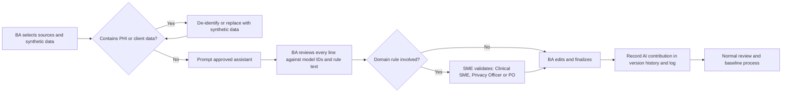

# AI-Assisted Business Analysis

## Document control

| Field | Value |
|---|---|
| Document ID | TW-AI-01 |
| Version | 1.2 |
| Status | Approved |
| Owner | Business Analyst |
| Last updated | 2026-09-30 |
| Reviewers | Compliance and Privacy Officer, Product Owner, Engineering Lead, QA Lead |

| Version | Date | Change |
|---|---|---|
| 1.0 | 2026-02-02 | Guardrails approved by the Compliance and Privacy Officer before first use in discovery |
| 1.1 | 2026-04-17 | Spec Kit workflow added after spec 001 |
| 1.2 | 2026-09-30 | Contribution log and review findings updated through SRS v1.3 |

### Purpose and scope

This page explains how the Business Analyst used AI assistants on Tendwell, what the BA let them do, what the BA never delegated, and what the review of their output caught. It covers six activities: elicitation synthesis, first-draft user stories and Gherkin, test idea generation, consistency and traceability checks, Mermaid diagram drafting, and spec-driven development with GitHub Spec Kit (`/specify`, `/plan`, `/tasks`). The worked example of the last one is [spec 001: offline EVV capture](specs/001-offline-evv-capture/spec.md).

The short version: AI made the BA faster at producing first drafts and at finding inconsistencies across a large document set. It did not make decisions, own IDs, set business rules or see real data.

## 1. Where AI fits in the BA workflow

| Activity | How the assistant was used | What the BA did | Example in this repo |
|---|---|---|---|
| Elicitation synthesis | Clustered de-identified interview summaries into candidate affinity themes with counts | Recounted every theme by hand, merged and split themes, removed unsupported quotes, decided which themes changed scope | [Discovery notes, section 4](../01-discovery/discovery-workshop-notes.md) |
| First-draft stories and Gherkin | Drafted story text and scenarios from pasted FR and BR text plus synthetic test data | Checked every scenario against the rule text, fixed boundaries, removed invented behavior, assigned AC IDs | [EP-06 EVV stories](../05-delivery/user-stories/EP-06-evv.md) |
| Test idea generation | Proposed boundary values and equivalence classes for numeric rules | Verified arithmetic against the canonical worked examples; added cases the assistant missed | [Test cases](../06-quality/test-cases.md) |
| Consistency and traceability checks | Compared ID catalogs, changed sections and cross-document numbers; listed candidate findings | Triaged each finding as real or false positive; fixed real ones; never accepted a proposed new ID | [Traceability matrix](../02-requirements/requirements-traceability-matrix.md) |
| Mermaid diagram drafting | Converted numbered process descriptions into flowcharts and sequence diagrams | Checked every node against observation notes; quoted labels; validated rendering | [Current vs future state](../01-discovery/current-vs-future-state.md) |
| Spec-driven development | Ran Spec Kit `/specify`, `/plan` and `/tasks` from sources the BA selected | Resolved every `[NEEDS CLARIFICATION]` with the decision owner; mapped each requirement to canonical IDs; rejected unsafe proposals | [Spec 001](specs/001-offline-evv-capture/spec.md), [plan](specs/001-offline-evv-capture/plan.md), [tasks](specs/001-offline-evv-capture/tasks.md) |

## 2. Guardrails

Approved by the Compliance and Privacy Officer on 2026-02-02 and applied to every use.

1. **No client data or PHI in prompts, ever.** No names, dates of birth, addresses, Medicaid IDs, diagnoses, medications, incident narratives or screenshots of production screens. Interview notes were de-identified by the BA before any synthesis: roles only, no agency names, no client details.
2. **Synthetic data only.** Examples use the repo's fictional test data: client C-10234 at 418 Birchwood Lane, Lakemont, OH 43999; phone numbers in the 555-01xx range; emails at example.com; Medicaid IDs of the form `ZZ` plus 8 digits.
3. **Approved tools only.** The team used the company-approved enterprise AI assistant with prompt retention off and no training on inputs. Personal accounts and browser extensions were not allowed.
4. **Every output is reviewed by the BA before anyone else sees it.** AI output is a draft, never a deliverable. The BA reads every line.
5. **SMEs validate domain rules.** Clinical content goes to the Clinical SME, privacy content to the Compliance and Privacy Officer, and pay and billing rules to the Product Owner with agency finance input, exactly as if the BA had written it unaided.
6. **IDs and traceability belong to the BA.** The assistant may reference existing IDs that are pasted into the prompt; it may not create FR, BR, US, NFR, CR or INC IDs. Any proposed new ID is rejected and the content is mapped to an existing ID or raised through change control.
7. **Record the AI's contribution.** Version history notes when a first draft was AI-generated (see the [spec](specs/001-offline-evv-capture/spec.md) and [tasks](specs/001-offline-evv-capture/tasks.md) version tables), and section 6 below logs every artifact.
8. **No decisions by AI.** Priority, scope, clinical safety, compliance interpretation and stakeholder commitments are made by people with the authority to make them.

## 3. Workflow



## 4. Example prompts and what happened to the output

Each prompt below is reproduced as used, with synthetic or de-identified inputs only.

### 4.1 Elicitation synthesis (2026-02-09)

```text
You are helping a business analyst synthesize discovery interviews for a home
care operations product. Input: 26 interview summaries, numbered I-01 to I-26.
They are de-identified: roles only (caregiver, coordinator, clinical supervisor,
billing and payroll, agency administrator), no names, no agency names, no client
details.

Task: propose affinity themes. For each theme give: a short name, the interview
numbers where it appears, a count of interviews, and one short quote that appears
verbatim in the input. Do not invent or paraphrase quotes. Flag any theme
supported by fewer than 3 interviews as weak.
```

| Accepted | Corrected by the BA |
|---|---|
| 11 of 14 proposed themes and their grouping logic | Merged "location privacy" into "worry about location tracking" (same concern, different words) |
| The weak-theme flag, which surfaced "vendor access to our data" (4 interviews) for a closer look | Split "payroll pain" into "getting paid right, including travel" (caregivers) and "keep our payroll provider" (finance staff), because they lead to different requirements |
| | Recounted every theme by hand: the assistant overcounted 3 themes by 1 or 2 because it counted an interview twice when the theme came up in two answers |
| | Removed one quote that did not appear in the input, despite the instruction |

### 4.2 First-draft story and Gherkin for US-025 (2026-03-16)

```text
Draft a user story and Gherkin acceptance criteria for US-025 "Clock in at the
client's home". Use only the rules pasted below (FR-EVV-01, FR-EVV-02, FR-EVV-03,
BR-020, BR-021, BR-022, BR-023). Synthetic test data: client C-10234 at 418
Birchwood Lane, Lakemont, OH 43999, geofence radius 150 m; caregiver Rosa
Delgado; visit 08:00-10:00 America/New_York. Include boundary examples for the
clock-in window and the late-start tolerance. Name scenarios US-025-AC1,
US-025-AC2 and so on. Do not add behavior that is not in the rules.

[rule text pasted here]
```

| Accepted | Corrected by the BA |
|---|---|
| Story structure and the scenario outline format for the clock-in window | The draft said a clock-in outside the geofence "is blocked with an error". FR-EVV-03 says the punch is never blocked; rewritten to raise an exception |
| Boundary rows at 08:10 and 08:11 for the 10-minute late-start tolerance | Clock-in opening time was given as 07:50; BR-023 says 15 minutes before start, so 07:45. Boundary rows rebuilt at 07:44 and 07:45 |
| | An invented exception code, OUTSIDE_WINDOW, was removed; outside the window the button is disabled, which is UI behavior, not an exception |
| | Added the server-side distance calculation (BR-021), which the draft omitted |

### 4.3 Test ideas for billing units and travel pay (2026-04-02)

```text
Generate boundary-value and equivalence-class test ideas for two rules.
BR-047: hourly billing uses 15-minute units per visit; units = floor(minutes / 15),
plus 1 if the remainder is 8 minutes or more.
BR-043: paid travel = min(actual gap, estimated drive time + 10 minutes), only
when the gap is 2 hours or less; longer gaps are off duty.
For each idea show the input, the expected result and the arithmetic. Minutes only.
```

| Accepted | Corrected by the BA |
|---|---|
| 22 test ideas, including remainders of 7 and 8 minutes and gaps of 120 and 121 minutes | The assistant computed 113 minutes as 7 units. 113 = 7 x 15 + 8, so the remainder of 8 rounds up to 8 units. The BA checked every row against the canonical example (127, 113 and 120 minutes = 24 units = $174.00) |
| Equivalence classes for travel gaps (no gap, short gap, gap at 2 hours, gap over 2 hours) | One travel row paid drive time plus 10 minutes when the actual gap was shorter; corrected to the minimum of the two |
| | Added a visit that crosses the daylight saving change (NFR-DAT-01), which the assistant did not consider |

### 4.4 Consistency and traceability check for SRS v1.3 (2026-09-17)

```text
Below are (1) the ID catalog: every FR, BR, US and NFR with its text, and (2) the
draft SRS v1.3 change section for CR-004, CR-005 and CR-006, and (3) the
acceptance criteria of US-025, US-029, US-044 and US-050.
Check: (a) every ID referenced exists in the catalog; (b) every BR linked to a
changed FR is reviewed; (c) any number that appears in more than one place
agrees (thresholds, durations, percentages); (d) list acceptance criteria that
mention a changed rule but were not updated.
Output a table: finding, location, evidence, severity. Do not propose new IDs.
```

| Accepted | Corrected or rejected by the BA |
|---|---|
| US-025-AC3 still expected LOCATION_MISMATCH for a fix with 3,400 m accuracy; updated to LOW_GPS_ACCURACY | Rejected: "100 m conflicts with 150 m". These are different settings (GPS accuracy threshold and geofence radius) |
| US-050 acceptance criteria still described stored recipients; updated to send-time resolution (BR-054) | Rejected: "BR-031 and BR-035 both use 24 hours, possible duplication". Different rules that happen to share a duration |
| An early draft of the anomaly alert used a 25% invoice-count threshold against 20% in NFR-OBS-02; aligned to 20% | Rejected: a proposed new business rule for bulk resolution. The behavior belongs in FR-EVV-08 and US-029-AC5; no new ID |
| 4 further minor wording findings | |

### 4.5 Spec Kit `/specify` for offline EVV capture (2026-04-08)

```text
/specify Offline EVV capture for the Caregiver Mobile App. Caregivers must be able
to clock in and out of assigned visits with no connectivity for up to 72 hours of
punches. Punches are stored encrypted on the device and synced when connectivity
returns. The device capture time is the punch time and the server receipt time is
kept separately. Punches received more than 24 hours after capture are flagged
Late offline sync. Sources: US-027, FR-EVV-05, BR-025, NFR-AVL-02, ADR-006.
Mark anything not covered by these sources as [NEEDS CLARIFICATION].
```

| Accepted | Corrected or rejected by the BA |
|---|---|
| The spec skeleton, primary user story and the first 6 acceptance scenarios, which the BA aligned with US-027-AC1 to AC6 | Rejected: computing the geofence on the device "to give immediate feedback offline". BR-021 says distance is computed only on the server (clarification C-04) |
| 13 `[NEEDS CLARIFICATION]` markers; 11 were real gaps and went to decision owners | Rejected: storing the selfie on the device for a later identity match. The Compliance and Privacy Officer ruled it out; offline punches raise IDENTITY_CHECK_FAILED instead (C-05, ADR-004) |
| Edge-case list as a starting point | Removed an invented exception code, OFFLINE_PUNCH; the existing LATE_OFFLINE_SYNC and source MobileOffline already cover it |
| | Renamed the template's FR-001 numbering to SPEC-FR-001 and mapped each to a canonical FR, BR or NFR, so feature IDs never collide with SRS IDs |

## 5. AI did / BA did

| Area | AI did | BA did |
|---|---|---|
| Discovery synthesis | Proposed clusters and counts from de-identified notes | De-identified inputs, recounted, merged and split themes, chose what changed scope |
| Stories and Gherkin | Produced first drafts of story text and scenario structure | Verified against rule text, fixed boundaries, removed invented behavior, assigned IDs, walked through with QA and developers |
| Test ideas | Generated boundary and equivalence candidates | Checked arithmetic against worked examples, added missed classes, prioritized with the QA Lead |
| Consistency checks | Compared large document sets quickly and listed candidate findings | Triaged real vs false findings, fixed real ones, refused new IDs |
| Diagrams | Converted text steps into Mermaid syntax | Checked each node against observation notes, quoted labels, validated rendering |
| Spec Kit | Generated spec, plan and task skeletons and clarification markers | Selected sources, resolved every clarification with its owner, ran the constitution check, mapped SPEC-FR to canonical IDs, checked test coverage per requirement |
| Decisions | None | Facilitated every decision with the person accountable for it (see the [RACI](../01-discovery/stakeholder-register-raci.md)) |
| Data | Saw only synthetic or de-identified text | Kept all real data out of prompts |

## 6. AI contribution log

| Date | Artifact | AI contribution | Reviewed by |
|---|---|---|---|
| 2026-02-09 | [Discovery notes, interview synthesis](../01-discovery/discovery-workshop-notes.md) | Candidate affinity themes | Business Analyst, UX Designer |
| 2026-02-24 | [Current vs future state](../01-discovery/current-vs-future-state.md) | First drafts of 4 AS-IS Mermaid maps | Business Analyst; validated with pilot staff |
| 2026-03-16 to 2026-04-10 | [User stories](../05-delivery/epics.md), EP-05 to EP-07 | First-draft Gherkin for 16 stories | Business Analyst, QA Lead; Clinical SME for EP-07 |
| 2026-04-02 | [Test cases](../06-quality/test-cases.md) for BR-043 and BR-047 | Boundary-value candidates | Business Analyst, QA Lead |
| 2026-04-08 to 2026-04-17 | [Spec 001](specs/001-offline-evv-capture/spec.md), [plan](specs/001-offline-evv-capture/plan.md), [tasks](specs/001-offline-evv-capture/tasks.md) | Spec Kit drafts | Business Analyst, Engineering Lead, Compliance and Privacy Officer, Clinical SME |
| 2026-07-24 to 2026-09-14 | [Post-incident reviews](../07-operations/incident-management-process.md) | Timeline tables formatted from the scribe's channel log (log exported without PHI) | Business Analyst, Incident Commanders |
| 2026-09-17 | [SRS v1.3](../02-requirements/SRS.md) change section | Consistency check across stories and design documents | Business Analyst |

## 7. What review caught

Across the logged uses, the BA's review found the same few failure patterns repeatedly. They are why the guardrails exist.

| Failure pattern | Times caught | Example |
|---|---|---|
| Invented identifiers or codes | 4 | OUTSIDE_WINDOW, OFFLINE_PUNCH, a proposed new BR, template FR-001 numbering |
| Plausible but wrong arithmetic | 3 | 113 minutes billed as 7 units |
| Behavior that contradicts a rule | 3 | Blocking a punch outside the geofence; device-side geofence; storing selfies offline |
| Counting errors in synthesis | 3 themes | Double counting an interview |
| Fabricated quotes | 1 | A "quote" not present in the input |
| False-positive inconsistencies | 3 | 100 m vs 150 m |

## Related documents

- [Spec 001: offline EVV capture](specs/001-offline-evv-capture/spec.md)
- [Spec 001 plan](specs/001-offline-evv-capture/plan.md)
- [Spec 001 tasks](specs/001-offline-evv-capture/tasks.md)
- [Discovery workshop notes](../01-discovery/discovery-workshop-notes.md)
- [Stakeholder register and RACI](../01-discovery/stakeholder-register-raci.md)
- [Software requirements specification](../02-requirements/SRS.md)
- [Requirements traceability matrix](../02-requirements/requirements-traceability-matrix.md)
- [Data classification and retention](../03-design/data/data-classification-and-retention.md)
- [Definition of Ready and Done](../05-delivery/definition-of-ready-and-done.md)
