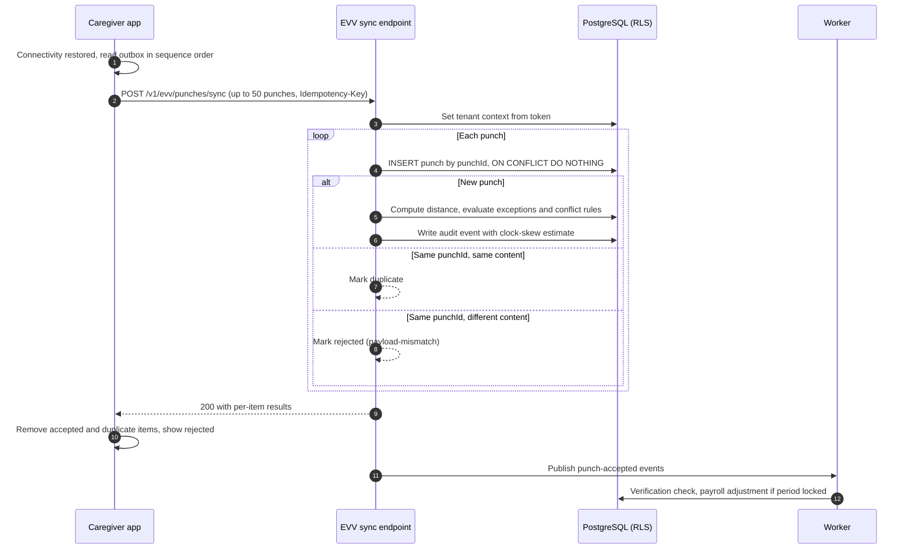

# Implementation Plan: Offline EVV Capture

## Document control

| Field | Value |
|---|---|
| Document ID | TW-SPEC-001-PLAN |
| Version | 1.2 |
| Status | Approved |
| Owner | Business Analyst |
| Last updated | 2026-09-24 |
| Reviewers | Engineering Lead (approver), mobile developer, backend developers, QA Lead, Compliance and Privacy Officer |

| Version | Date | Change |
|---|---|---|
| 1.0 | 2026-04-15 | Generated with `/plan` from spec v1.1; technical sections edited by the Engineering Lead; constitution check and traceability by the Business Analyst |
| 1.1 | 2026-06-12 | Conflict handling aligned with ADR-006 v1.1 |
| 1.2 | 2026-09-24 | Low GPS accuracy (CR-004) and precise-location check added to phase 5 |

**Branch**: `001-offline-evv-capture` | **Date**: 2026-04-15 | **Spec**: [spec.md](spec.md)
**Input**: Feature specification from `08-ai-assisted-ba/specs/001-offline-evv-capture/spec.md`

### Purpose and scope

This plan turns the [offline EVV capture spec](spec.md) into a technical approach: context, constitution check, research decisions, data model deltas, the sync contract and the phase plan. In the standard Spec Kit layout, research, data model, contracts and quickstart are separate files; in this portfolio they are consolidated here so the canonical file set stays at spec, plan and tasks. The Engineering Lead owns the technical decisions; the Business Analyst owns the constitution check, the mapping back to SPEC-FR and canonical IDs, and the acceptance approach. The architectural decision itself is recorded in [ADR-006](../../../03-design/architecture/adr/ADR-006-offline-first-caregiver-app.md); this plan does not re-decide it.

## Summary

Caregivers must clock in and out with no connectivity for up to 72 hours of punches (NFR-AVL-02, FR-EVV-05). The approach, from ADR-006, is an offline-first read cache plus an ordered, encrypted command outbox on the device, with the server as the only authority on rules. Punches sync first through `POST /v1/evv/punches/sync` in batches of up to 50, idempotent by client-generated punch ID. The server stores the device capture time as the punch time and its own receipt time separately (BR-025), computes distance and exceptions exactly as for online punches (BR-021, BR-022), raises LATE_OFFLINE_SYNC past 24 hours, applies the conflict rules for visits that changed while the device was offline, and never alters a stored punch (ADR-002). No server table changes are needed; device-side storage is new.

## Technical Context

| Item | Value |
|---|---|
| Language/Version | TypeScript 5 (mobile and API) |
| Primary Dependencies | React Native (Expo) with encrypted SQLite (SQLCipher); NestJS modular monolith; PostgreSQL 16 driver; BullMQ for post-sync events |
| Storage | Device: SQLCipher (AES-256), key in iOS Keychain or Android Keystore. Server: PostgreSQL 16 with row-level security on `tenant_id` (ADR-001) |
| Testing | Jest unit tests (mobile and API); API contract tests against `04-api/openapi.yaml`; integration tests on a disposable PostgreSQL; mobile end-to-end tests on the QA device matrix; Postman collection in `06-quality/api-tests` |
| Target Platform | iOS 16 and later, Android 10 and later (NFR-MOB-01); API on AWS ECS Fargate |
| Project Type | Mobile plus API (monorepo: `apps/mobile`, `apps/api`) |
| Performance Goals | Sync of 36 punches completes in under 5 s at 400 kbps; sync endpoint p95 800 ms or less for a 50-punch batch (NFR-PERF-01 write target); online clock-in p95 unchanged at 2 s or less (NFR-PERF-02) |
| Constraints | App size 60 MB or less (NFR-MOB-01); clock-in within 3 taps (NFR-USE-01); no PHI in logs, metrics or push (NFR-OBS-01, BR-056); remote wipe on deactivation (NFR-MOB-02) |
| Scale/Scope | Up to 50,000 caregivers (NFR-SCL-01); reconnect storms at shift changes; about 98,000 punches per year for a tenant the size of TEN-001 |

## Constitution Check

The Tendwell delivery constitution is the set of non-negotiable principles every feature plan is checked against. The Business Analyst ran the check at `/plan` time and again after UAT.

| Principle | What it requires | How this plan complies | Result |
|---|---|---|---|
| I. Privacy by default | Minimum necessary data; PHI encrypted; no PHI in logs, metrics, push or email | Cache holds only the next 72 hours of assigned visits with first name, last initial and client number; SQLCipher with hardware-backed key; client data removed 24 hours after the last cached visit once synced; telemetry carries counts and IDs only (SPEC-FR-011, SPEC-FR-020) | Pass |
| II. Care is never blocked | No technical condition stops a caregiver from recording care | Offline capture for the whole visit; location, identity and conflicts produce exceptions, never refusals (SPEC-FR-001, SPEC-FR-013, SPEC-FR-014) | Pass |
| III. Append-only evidence | EVV punches, audit events and clinical records are never updated or deleted | Idempotent insert by punch ID; supersession by new punches only; reclassification and conflicts touch visits and exceptions, never punches (ADR-002; SPEC-FR-006, SPEC-FR-015) | Pass |
| IV. Server authority | Compliance decisions (distance, identity, exceptions, verification) are made on the server | Device displays no geofence verdict; server evaluates every synced punch with full context (SPEC-FR-007) | Pass |
| V. Tenant isolation | Every query runs in a tenant context with RLS | Sync handler sets the tenant context from the token before any read or write; cross-tenant visit IDs return not found (ADR-001) | Pass |
| VI. Test-first business rules | Every BR has an automated test before the code (NFR-MNT-01) | Tasks T005 to T018 precede implementation; BR-021, BR-022, BR-023, BR-025, BR-026, BR-027, BR-046 each have a failing test first | Pass |
| VII. Observable outcomes | Business outcomes are measurable without PHI | Metrics for sync delay, late sync rate and outbox depth per tenant; offline sync backlog alert | Pass |

### Complexity tracking

| Deviation | Why needed | Simpler alternative rejected because |
|---|---|---|
| PHI is stored on caregiver devices (principle I tension) | Without cached client and task data, caregivers cannot document care offline (principle II) | A punch-only queue fails FR-EVV-06 in dead zones and pushes documentation to memory, raising undocumented-dose risk (OBJ-03) |
| Clock-skew estimate held in the audit event, not a column | Keeps the append-only punch schema stable | A new `evv_punches` column would need a migration on a partitioned, append-only table for a display-only value |

## Phase 0: Research decisions

| ID | Question | Decision | Rationale | Alternatives considered |
|---|---|---|---|---|
| R-01 | Queue punches only, or every visit action? | Ordered command outbox for every action; punches sync first | Whole visit documented offline; punches are the EVV evidence and unlock verification | Punch-only queue; CRDT replication (both rejected in ADR-006) |
| R-02 | On-device encryption | SQLCipher AES-256; random 256-bit key in Keychain or Keystore, available after device unlock | Meets NFR-MOB-02 and HIPAA Security Rule encryption expectations (45 CFR 164.312(a)(2)(iv)) | App-level field encryption (more code, same key problem) |
| R-03 | Idempotency | Client-generated UUID v4 punch ID becomes `evv_punches.id`; batch-level `Idempotency-Key` header as well | Per-punch idempotency survives partial batches and retries; matches the data dictionary definition of `evv_punches.id` | Server-assigned IDs with de-duplication by content (fragile) |
| R-04 | When to sync | On connectivity change, app foreground, after each capture when online, and every 15 minutes while online; background fetch is best effort only | iOS limits background execution; foreground triggers are reliable | Rely on background tasks (unreliable on iOS) |
| R-05 | Device clock trust | Record monotonic elapsed time, boot ID and last server offset; server estimates true capture time; over 5 minutes shows an indicator; estimate stored in the punch's audit event | Detects manual clock changes without rejecting care evidence (C-03) | Reject punches with skew (blocks care); trust device time blindly |
| R-06 | Batch size | 50 punches per request | About 40 KB per batch, under 1 s at 400 kbps; small enough for the p95 write target | Unlimited batches (timeouts on weak links) |
| R-07 | Where late sync is decided | Server only, from `received_at` minus `punch_time` | The device cannot know the server receipt time | Device-side flag (spoofable) |
| R-08 | Identity verification offline | Not attempted; IDENTITY_CHECK_FAILED with "Not performed: device offline" on sync | Vendor match needs connectivity and images must not be retained (ADR-004 rule 5; C-05) | Store selfie for later match (rejected by Compliance and Privacy Officer) |

## Phase 1: Design and contracts

### Data model deltas

**Server (PostgreSQL): no schema change.** Existing columns already carry what this feature needs, as defined in the [data dictionary](../../../03-design/data/data-dictionary.md):

| Table | Column or value | Use in this feature |
|---|---|---|
| `evv_punches` | `id` | Client-generated punch ID; idempotency key (SPEC-FR-006) |
| `evv_punches` | `source = MobileOffline` | Marks punches captured offline (SPEC-FR-004) |
| `evv_punches` | `punch_time`, `received_at` | Device capture time and server receipt time (BR-025) |
| `evv_punches` | `accuracy_m`, `distance_m` | Server-side location evaluation (BR-021, BR-022) |
| `evv_punches` | `supersedes_punch_id` | Device clock-out superseding a System placeholder (SPEC-FR-015) |
| `visit_exceptions` | codes LATE_OFFLINE_SYNC, UNSCHEDULED_VISIT, IDENTITY_CHECK_FAILED, LOW_GPS_ACCURACY | Raised by sync evaluation |
| `audit_events` | `after.clockSkewSeconds`, `after.syncBatchId` | Clock-skew estimate and batch reference for the visit history (SPEC-FR-017, SPEC-FR-019) |
| `payroll_lines` | `line_type = Adjustment`, `adjusts_line_id`, `source_visit_id` | Late punches into locked periods (SPEC-FR-016) |

**Device (SQLCipher): new local schema.**

| Local table | Key columns | Purpose |
|---|---|---|
| `outbox` | `command_id` (PK), `type`, `visit_id`, `payload` (JSON), `device_captured_at`, `monotonic_ms`, `boot_id`, `server_offset_ms`, `sequence` (unique), `status`, `last_error` | Ordered record of every captured action |
| `cached_visits` | `visit_id` (PK), `scheduled_start`, `scheduled_end`, `client_display` (first name and last initial), `client_number`, `service_address`, `geofence_radius_m`, `care_plan_version`, `requires_visit_note`, `cached_at` | Offline read model for the next 72 hours |
| `cached_tasks` | `visit_id`, `care_plan_task_id`, `name`, `category` | Tasks for offline clock-out |
| `sync_state` | `last_sync_at`, `last_server_offset_ms`, `queued_count` | Sync status banner (SPEC-FR-012) |

### Contract: `POST /v1/evv/punches/sync`

Bearer JWT (caregiver, or the sync-only scope issued to a deactivated caregiver's device). `Idempotency-Key` header required. Request and response bodies use camelCase. Errors use RFC 9457 `application/problem+json`. The authoritative definition is in the [OpenAPI specification](../../../04-api/openapi.yaml).

**Request**

```json
{
  "deviceId": "and-5f2c9e81b7a4",
  "appVersion": "1.6.1",
  "punches": [
    {
      "punchId": "e3a1c9f2-7b4d-4e8a-9c6f-1d2b3a4c5e01",
      "visitId": "a1f3c5e7-0b2d-4c6e-8f1a-20260915a001",
      "type": "In",
      "deviceCapturedAt": "2026-09-15T08:02:11-04:00",
      "monotonicMs": 8812345,
      "bootId": "b7c1d2e3-0f4a-4b5c-9d6e-7f8a9b0c1d2e",
      "serverOffsetMs": -1200,
      "sequence": 41,
      "location": { "lat": 39.963650, "lng": -82.997880, "accuracyM": 12.0 },
      "identityCheckId": null
    },
    {
      "punchId": "f4b2d0a3-8c5e-4f9b-8d7a-2e3c4b5d6f02",
      "visitId": "a1f3c5e7-0b2d-4c6e-8f1a-20260915a001",
      "type": "Out",
      "deviceCapturedAt": "2026-09-15T10:01:40-04:00",
      "monotonicMs": 15981102,
      "bootId": "b7c1d2e3-0f4a-4b5c-9d6e-7f8a9b0c1d2e",
      "serverOffsetMs": -1200,
      "sequence": 42,
      "location": { "lat": 39.963702, "lng": -82.997815, "accuracyM": 9.0 },
      "identityCheckId": null
    }
  ]
}
```

**Response `200 OK`** (per-item results; the request as a whole succeeds even when individual punches are rejected)

```json
{
  "receivedAt": "2026-09-15T15:40:03Z",
  "results": [
    {
      "punchId": "e3a1c9f2-7b4d-4e8a-9c6f-1d2b3a4c5e01",
      "status": "accepted",
      "visitId": "a1f3c5e7-0b2d-4c6e-8f1a-20260915a001",
      "visitStatus": "InProgress",
      "exceptionsRaised": []
    },
    {
      "punchId": "f4b2d0a3-8c5e-4f9b-8d7a-2e3c4b5d6f02",
      "status": "accepted",
      "visitId": "a1f3c5e7-0b2d-4c6e-8f1a-20260915a001",
      "visitStatus": "Completed",
      "exceptionsRaised": []
    }
  ]
}
```

| Item status | Meaning | App behavior |
|---|---|---|
| `accepted` | Punch stored; `visitId` may differ from the request when a conflict rule created an unscheduled visit | Remove from outbox |
| `duplicate` | Punch ID already stored with identical content | Remove from outbox |
| `rejected` | Not stored; carries a `problem` object (for example `payload-mismatch` when the punch ID exists with different content, or `validation-error`) | Keep in outbox as Rejected; show the caregiver a plain-language message; report to Sentry without PHI |

| HTTP status | When | Body |
|---|---|---|
| 200 | Batch processed (any mix of item results) | As above |
| 400 | Malformed JSON or missing required fields at batch level | problem+json, type `validation-error` |
| 401 | Missing or expired token | problem+json |
| 403 | Token lacks the caregiver or sync-only scope | problem+json |
| 409 | `Idempotency-Key` reused with a different body | problem+json, type `idempotency-key-reused` |
| 413 | More than 50 punches | problem+json, type `batch-too-large` |
| 429 | Rate limit exceeded | problem+json with `Retry-After` |

### Sync sequence



### Quickstart (acceptance walkthrough)

1. On a test phone signed in as the synthetic caregiver Rosa Delgado, enable airplane mode.
2. Clock in to the 08:00 visit for C-10234; confirm the "Saved on this phone" message and queued count of 1.
3. Mark all three tasks, write the note, clock out; queued count shows 2.
4. Disable airplane mode; within 15 seconds the queued count returns to 0.
5. In the Agency Web App, open the visit: two punches with source MobileOffline, distances computed, no exceptions, status Completed then Verified.
6. Repeat with the phone clock set 9 minutes fast; confirm the "Device clock differs by 9 min" indicator.

## Phase 2: Task planning approach

`/tasks` generated [tasks.md](tasks.md) from this plan with these rules, which the Business Analyst reviewed:

- Contract first: the OpenAPI path is defined before any test or code.
- Tests before implementation for every business rule and contract; each test references the SPEC-FR and canonical ID it proves.
- Server and mobile tracks run in parallel once the contract and tests exist; tasks touching different files are marked `[P]`.
- Every task names its file or area and the SPEC-FR it serves.

## Phase plan

| Phase | Scope | Output | Dates | Exit criterion |
|---|---|---|---|---|
| 0. Research | R-01 to R-08 | Decisions above; ADR-006 confirmed | 2026-04-09 to 2026-04-14 | Engineering Lead and Compliance and Privacy Officer agree |
| 1. Design and contracts | Data model deltas, sync contract, quickstart | This plan; OpenAPI path | 2026-04-15 to 2026-04-17 | Contract reviewed by QA Lead and mobile developer |
| 2. Task planning | `/tasks` | tasks.md | 2026-04-17 | Sprint 4 planning accepts the tasks |
| 3. Build (Sprint 4) | T001 to T042 | Working feature behind flag `evv.offlineCapture` | 2026-04-20 to 2026-05-01 | All tests green; Definition of Done met |
| 4. Validate (hardening and UAT) | Device matrix, UAT conflict scenarios, C-07 revision | UAT sign-off of scenarios 1 to 15 | June 2026 | Pilot Coordinators accept conflict behavior |
| 5. Align with SRS v1.3 | LOW_GPS_ACCURACY for synced punches, no-fix rule (C-11), precise-location check | T043 to T046 | 2026-08-21 to 2026-09-24 | Regression suite green on the updated device matrix |

## Progress Tracking

- [x] Phase 0: Research complete
- [x] Phase 1: Design complete
- [x] Phase 2: Task planning complete
- [x] Phase 3: Tasks implemented
- [x] Phase 4: Validation passed
- [x] Phase 5: SRS v1.3 alignment complete
- [x] Initial constitution check: PASS
- [x] Post-design constitution check: PASS
- [x] All clarifications resolved
- [x] Complexity deviations documented

## Related documents

- [Feature specification](spec.md)
- [Tasks](tasks.md)
- [ADR-006 Offline-first caregiver app](../../../03-design/architecture/adr/ADR-006-offline-first-caregiver-app.md)
- [ADR-002 Append-only EVV punch ledger](../../../03-design/architecture/adr/ADR-002-append-only-evv-punch-ledger.md)
- [ADR-001 Multi-tenancy with row-level security](../../../03-design/architecture/adr/ADR-001-multi-tenancy-row-level-security.md)
- [Data dictionary](../../../03-design/data/data-dictionary.md)
- [Sequence diagrams](../../../03-design/diagrams/sequence-diagrams.md)
- [OpenAPI specification](../../../04-api/openapi.yaml)
- [API guidelines](../../../04-api/api-guidelines.md)
- [Test strategy and plan](../../../06-quality/test-strategy-and-plan.md)
