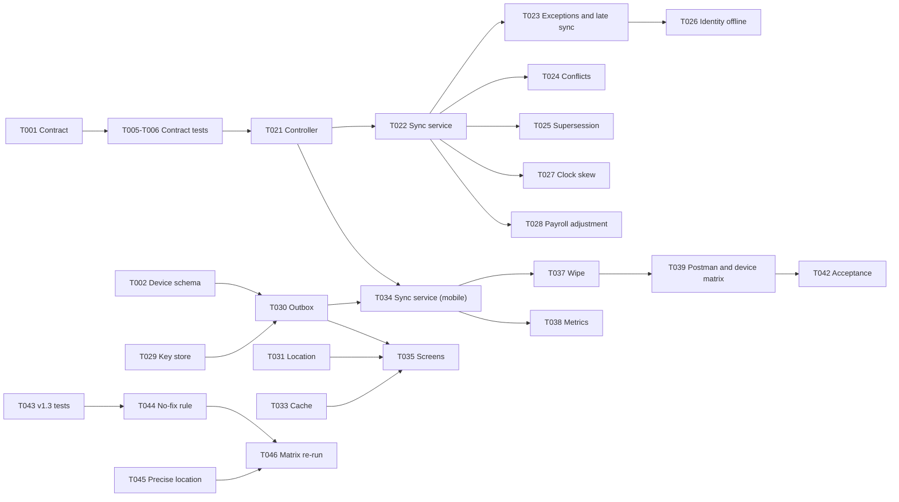

# Tasks: Offline EVV Capture

## Document control

| Field | Value |
|---|---|
| Document ID | TW-SPEC-001-TASKS |
| Version | 1.2 |
| Status | Complete |
| Owner | Business Analyst |
| Last updated | 2026-09-24 |
| Reviewers | Engineering Lead, mobile developer, backend developers, QA Lead |

| Version | Date | Change |
|---|---|---|
| 1.0 | 2026-04-17 | Generated with `/tasks` from plan v1.0; Business Analyst added SPEC-FR links and acceptance references; Engineering Lead adjusted file paths and dependencies |
| 1.1 | 2026-06-12 | T011 updated for the UAT conflict-rule change (C-07) |
| 1.2 | 2026-09-24 | Phase 3.6 added for SRS v1.3 alignment (CR-004); all tasks complete |

**Input**: Design documents from `08-ai-assisted-ba/specs/001-offline-evv-capture/`
**Prerequisites**: [plan.md](plan.md) (required), [spec.md](spec.md); research, data model, contracts and quickstart are consolidated in plan.md

### Purpose and scope

This is the ordered, executable task list for the offline EVV capture feature. Tests come before implementation, every task names the file or area it changes, and every task links to the SPEC-FR requirement it serves (and through it to the canonical FR, BR or NFR in the spec). The Business Analyst uses this list to confirm that each requirement has at least one test task and one implementation task, and to run the acceptance walkthrough at the end.

## Format: `[ID] [P?] Description (file or area) -> SPEC-FR`

- **[P]**: can run in parallel with other [P] tasks in the same phase (different files, no dependency on an unfinished task).
- Paths are in the monorepo: `apps/mobile` (React Native) and `apps/api` (NestJS). Repository documentation paths are relative to the repo root.
- `[x]` marks completed tasks; all tasks were completed in Sprint 4, UAT or the SRS v1.3 alignment.

## Phase 3.1: Setup

- [x] T001 Define `POST /v1/evv/punches/sync` with request, per-item result and problem types in `04-api/openapi.yaml` (contract first) -> SPEC-FR-004, SPEC-FR-005, SPEC-FR-006
- [x] T002 [P] Create the device SQLCipher schema migration for `outbox`, `cached_visits`, `cached_tasks`, `sync_state` in `apps/mobile/src/offline/db/schema.ts` -> SPEC-FR-002, SPEC-FR-011
- [x] T003 [P] Add synthetic fixtures (client C-10234 at 418 Birchwood Lane, caregiver Rosa Delgado, visit 08:00-10:00, care plan version 3) in `apps/api/test/fixtures/offline-evv.fixtures.ts` and register them in `06-quality/test-data/README.md` -> all
- [x] T004 [P] Add tenant feature flag `evv.offlineCapture` (default on) in `apps/api/src/modules/platform/feature-flags/flags.ts` -> SPEC-FR-001

## Phase 3.2: Tests first (must fail before Phase 3.3 starts)

- [x] T005 [P] Contract test: batch of up to 50 punches returns 200 with per-item `accepted`, `duplicate` or `rejected` in `apps/api/test/contract/evv-punches-sync.contract.spec.ts` -> SPEC-FR-005, SPEC-FR-006
- [x] T006 [P] Contract test: 413 for 51 punches, 400 for malformed batch, 409 for reused `Idempotency-Key` with a different body, item `payload-mismatch` for a reused punch ID with different content, all as problem+json, in `apps/api/test/contract/evv-punches-sync-errors.contract.spec.ts` -> SPEC-FR-006
- [x] T007 [P] Integration test: punch time equals device capture time, receipt time is server time, source is MobileOffline (US-027-AC2) in `apps/api/test/integration/evv/offline-sync-times.spec.ts` -> SPEC-FR-004
- [x] T008 [P] Integration test: LATE_OFFLINE_SYNC boundaries at 23 h 59 min, exactly 24 h, and 24 h 1 min (US-027-AC3), once per visit, in `apps/api/test/integration/evv/late-offline-sync.spec.ts` -> SPEC-FR-008
- [x] T009 [P] Integration test: resending an accepted batch stores no duplicates (US-027-AC4) in `apps/api/test/integration/evv/sync-idempotency.spec.ts` -> SPEC-FR-006
- [x] T010 [P] Integration test: synced punches at 212 m / 18 m, 95 m / 3,400 m and 40 m / 12 m produce LOCATION_MISMATCH, the accuracy outcome defined by BR-022 at the time, and no exception, in `apps/api/test/integration/evv/offline-location-rules.spec.ts` -> SPEC-FR-007
- [x] T011 [P] Integration test: conflict rules for cancelled, reassigned and Missed visits (US-027-AC6, scenarios 10 and 11) in `apps/api/test/integration/evv/visit-conflicts.spec.ts` -> SPEC-FR-013
- [x] T012 [P] Integration test: auto-closed visit superseded by a late device clock-out with AUTO_CLOSED still open; device punch after a Manual correction does not override it, in `apps/api/test/integration/evv/supersession.spec.ts` -> SPEC-FR-015
- [x] T013 [P] Integration test: identity-required tenant plus offline punch raises IDENTITY_CHECK_FAILED with "Not performed: device offline" in `apps/api/test/integration/evv/identity-offline.spec.ts` -> SPEC-FR-014
- [x] T014 [P] Integration test: punch synced into a locked pay period creates an Adjustment line referencing the visit in `apps/api/test/integration/payroll/late-punch-adjustment.spec.ts` -> SPEC-FR-016
- [x] T015 [P] Unit test: clock-skew estimator (9 min fast shows indicator; 4 min does not; reboot while offline reports "estimate unavailable") in `apps/api/src/modules/evv/rules/__tests__/clock-skew.estimator.spec.ts` -> SPEC-FR-017
- [x] T016 [P] Mobile unit test: outbox write happens before UI confirmation, survives app restart, preserves sequence order in `apps/mobile/src/offline/outbox/__tests__/outboxRepository.test.ts` -> SPEC-FR-002, SPEC-FR-005
- [x] T017 [P] Mobile unit test: offline clock-in window (07:44 disabled, 07:45 enabled, 10:01 unavailable) from cached schedule and device time in `apps/mobile/src/features/evv/__tests__/clockInWindow.test.ts` -> SPEC-FR-009
- [x] T018 [P] Mobile unit test: offline clock-out requires every task status and the note when the cached plan requires it in `apps/mobile/src/features/evv/__tests__/clockOutValidation.test.ts` -> SPEC-FR-010
- [x] T019 [P] Mobile end-to-end test: airplane-mode clock-in and clock-out, reconnect and sync; 18 visits and 36 punches over a simulated 72 hours; sign-out warning (US-027-AC1, US-027-AC5) in `apps/mobile/e2e/offline-capture.e2e.ts` -> SPEC-FR-001, SPEC-FR-011, SPEC-FR-012, SPEC-FR-018
- [x] T020 [P] Security test: PHI canary values never appear in API logs, mobile crash reports or sync metrics in `apps/api/test/security/no-phi-in-telemetry.spec.ts` -> SPEC-FR-020

## Phase 3.3: Core implementation (only after Phase 3.2 tests fail)

### Server track

- [x] T021 Sync controller and DTO validation (batch limit 50, required fields, problem+json) in `apps/api/src/modules/evv/sync/punch-sync.controller.ts` (depends on T001, T005, T006) -> SPEC-FR-005, SPEC-FR-006
- [x] T022 Punch sync service: set tenant context, insert by punch ID with `ON CONFLICT DO NOTHING`, compare payload hash for duplicates, record `received_at` in `apps/api/src/modules/evv/sync/punch-sync.service.ts` (depends on T021) -> SPEC-FR-004, SPEC-FR-006
- [x] T023 Reuse the online exception evaluator for synced punches and add the late offline sync rule in `apps/api/src/modules/evv/rules/late-offline-sync.rule.ts` (depends on T022) -> SPEC-FR-007, SPEC-FR-008
- [x] T024 Visit conflict resolver for cancelled, reassigned and Missed visits in `apps/api/src/modules/evv/conflicts/visit-conflict.resolver.ts` (depends on T022) -> SPEC-FR-013
- [x] T025 Supersession of System placeholder punches and Manual-correction precedence in `apps/api/src/modules/evv/conflicts/supersession.handler.ts` (depends on T022) -> SPEC-FR-015
- [x] T026 Identity-offline rule in `apps/api/src/modules/evv/rules/identity-offline.rule.ts` (depends on T023) -> SPEC-FR-014
- [x] T027 Clock-skew estimator and audit event attributes (`clockSkewSeconds`, `syncBatchId`) in `apps/api/src/modules/evv/rules/clock-skew.estimator.ts` (depends on T022) -> SPEC-FR-017, SPEC-FR-019
- [x] T028 Locked-period adjustment handler subscribed to the punch-accepted event in `apps/api/src/modules/payroll/adjustments/late-punch-adjustment.handler.ts` (depends on T022) -> SPEC-FR-016

### Mobile track (parallel with the server track once T001 and T016 to T019 exist)

- [x] T029 [P] Key management and SQLCipher open with Keychain or Keystore key in `apps/mobile/src/offline/crypto/keyStore.ts` -> SPEC-FR-002
- [x] T030 Outbox repository: write-before-confirm, sequence numbers, status transitions in `apps/mobile/src/offline/outbox/outboxRepository.ts` (depends on T002, T029) -> SPEC-FR-002, SPEC-FR-003
- [x] T031 [P] Location capture with accuracy and a 10-second fix timeout in `apps/mobile/src/features/evv/locationCapture.ts` -> SPEC-FR-003
- [x] T032 [P] Clock-skew capture (monotonic time, boot ID, server offset from each API response) in `apps/mobile/src/offline/time/clockSkew.ts` -> SPEC-FR-003
- [x] T033 Visit cache: next 72 hours, minimum necessary fields, purge 24 hours after the last cached visit once synced, in `apps/mobile/src/offline/cache/visitCache.ts` (depends on T002, T029) -> SPEC-FR-011, SPEC-FR-009, SPEC-FR-010
- [x] T034 Sync service: connectivity monitor, foreground and 15-minute triggers, batches of 50 in sequence, per-item result handling in `apps/mobile/src/offline/sync/syncService.ts` (depends on T030, T021) -> SPEC-FR-005, SPEC-FR-006
- [x] T035 Offline paths in the clock-in and clock-out screens, tasks and note from the cached plan, "Saved on this phone" confirmation in `apps/mobile/src/features/evv/ClockInScreen.tsx` and `ClockOutScreen.tsx` (depends on T030, T031, T033) -> SPEC-FR-001, SPEC-FR-009, SPEC-FR-010
- [x] T036 [P] Sync status banner: queued count, time since last sync, 48-hour banner, low-storage warning in `apps/mobile/src/features/evv/SyncStatusBanner.tsx` -> SPEC-FR-012
- [x] T037 Sign-out protection and deactivation sync-then-wipe under the sync-only scope in `apps/mobile/src/offline/sync/wipeHandler.ts` (depends on T034) -> SPEC-FR-018

## Phase 3.4: Integration

- [x] T038 Metrics and alert: sync delay histogram, late sync rate and outbox depth per tenant, no PHI; offline sync backlog alert in Grafana (see `03-design/architecture/deployment-and-security.md`) (depends on T022, T034) -> SPEC-FR-020
- [x] T039 Add sync requests and checks to `06-quality/api-tests/tendwell.postman_collection.json` and the offline rows to `06-quality/test-cases.csv`; run the device matrix (airplane mode, reboot while offline, clock change, low storage) (depends on T021 to T037) -> SPEC-FR-001 to SPEC-FR-020

## Phase 3.5: Polish and acceptance

- [x] T040 [P] Caregiver copy review with the UX Designer: every message states the problem and the fix (NFR-USE-03); strings externalized for Spanish in R2 (NFR-I18N-01), in `apps/mobile/src/i18n/en/evv.json` -> SPEC-FR-012
- [x] T041 [P] Update traceability rows for US-027, FR-EVV-05, BR-025 and NFR-AVL-02 in `02-requirements/requirements-traceability-matrix.csv` (Business Analyst) -> all
- [x] T042 Acceptance walkthrough of spec scenarios 1 to 15 with the Product Owner and QA Lead; record results in the sprint review notes (Business Analyst) (depends on T039) -> all

## Phase 3.6: SRS v1.3 alignment (CR-004, after INC-2026-011)

- [x] T043 [P] Update T010 expectations: 95 m / 3,400 m and (0,0) raise LOW_GPS_ACCURACY for synced punches; add the no-fix case (C-11) in `apps/api/test/integration/evv/offline-location-rules.spec.ts` -> SPEC-FR-007, SPEC-FR-003
- [x] T044 Server: no-fix punches raise LOW_GPS_ACCURACY with note "No location fix" in `apps/api/src/modules/evv/rules/location.rule.ts` (depends on T043) -> SPEC-FR-007
- [x] T045 [P] Mobile: check precise-location authorization before capture and explain how to enable it, without blocking the punch (US-025-AC6), in `apps/mobile/src/features/evv/locationCapture.ts` -> SPEC-FR-003
- [x] T046 Re-run the device matrix with iOS Precise Location Off and Android Approximate location, online and offline, and update `06-quality/test-cases.csv` (depends on T044, T045) -> SPEC-FR-007

## Dependencies



- Tests T005 to T020 must exist and fail before T021 to T037 start.
- T021 blocks every server task; T030 blocks every mobile task that writes captured data.
- Phase 3.6 depends on CR-004 approval (SRS v1.3).

## Parallel example

After T001 to T004, launch the tests together because they touch different files:

```text
T007 offline-sync-times.spec.ts
T008 late-offline-sync.spec.ts
T009 sync-idempotency.spec.ts
T010 offline-location-rules.spec.ts
T011 visit-conflicts.spec.ts
T016 outboxRepository.test.ts
T017 clockInWindow.test.ts
T018 clockOutValidation.test.ts
```

## Requirement coverage check (Business Analyst)

| SPEC-FR | Test tasks | Implementation tasks |
|---|---|---|
| SPEC-FR-001 | T019 | T004, T035 |
| SPEC-FR-002 | T016 | T002, T029, T030 |
| SPEC-FR-003 | T043 | T030, T031, T032, T045 |
| SPEC-FR-004 | T007 | T001, T022 |
| SPEC-FR-005 | T005, T016 | T021, T034 |
| SPEC-FR-006 | T005, T006, T009 | T021, T022, T034 |
| SPEC-FR-007 | T010, T043 | T023, T044 |
| SPEC-FR-008 | T008 | T023 |
| SPEC-FR-009 | T017 | T033, T035 |
| SPEC-FR-010 | T018 | T033, T035 |
| SPEC-FR-011 | T019 | T002, T033 |
| SPEC-FR-012 | T019 | T036, T040 |
| SPEC-FR-013 | T011 | T024 |
| SPEC-FR-014 | T013 | T026 |
| SPEC-FR-015 | T012 | T025 |
| SPEC-FR-016 | T014 | T028 |
| SPEC-FR-017 | T015 | T027 |
| SPEC-FR-018 | T019 | T037 |
| SPEC-FR-019 | T007 (audit assertions) | T027 |
| SPEC-FR-020 | T020 | T038 |

## Validation checklist

- [x] Every contract has a contract test (T005, T006)
- [x] Every SPEC-FR has at least one test task and one implementation task (table above)
- [x] All tests come before implementation
- [x] Parallel tasks are truly independent (different files)
- [x] Each task names its file or area
- [x] No task modifies the same file as another [P] task in the same phase

## Related documents

- [Feature specification](spec.md)
- [Implementation plan](plan.md)
- [AI-assisted BA README](../../README.md)
- [EP-06 EVV user stories](../../../05-delivery/user-stories/EP-06-evv.md)
- [Definition of Ready and Done](../../../05-delivery/definition-of-ready-and-done.md)
- [Test cases](../../../06-quality/test-cases.md)
- [Requirements traceability matrix](../../../02-requirements/requirements-traceability-matrix.md)
