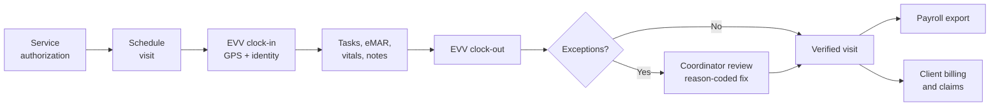

# Tendwell: Business Analysis Case Study for a Home-Care Operations SaaS

**An end-to-end, traceable Business Analysis portfolio for a multi-tenant healthcare operations platform.** It runs from discovery to production incident reviews.

> **Fictional case study.** Tendwell, Tendwell Labs, the pilot agencies, every person, figure and record in this repository are invented for portfolio purposes. All test data is synthetic. Nothing here is drawn from any employer or client. Compliance content is written to show how requirements support regulations; it is not legal advice.

---

## The product in one paragraph

Tendwell helps US home and community-based care agencies run their operations in one place. It covers in-home personal care, adult day programs and supported living. An agency authorizes services for a client and schedules a caregiver. The caregiver clocks in at the client's home with GPS-based **Electronic Visit Verification (EVV)**, then documents tasks, medications and vitals on the visit. Every verified visit then feeds **payroll export** and **client billing** without re-keying. The hard parts are where a BA earns their keep:
- care must never be blocked by software;
- clinical records must never silently disappear;
- overtime, travel time and 15-minute billing units must be computed exactly;
- PHI must stay out of every channel that cannot protect it.



## At a glance

| Artifact | Count | Where |
|---|---|---|
| Business objectives with baseline and target KPIs | 6 | [BRD](02-requirements/BRD.md) |
| Functional requirements (ISO/IEC/IEEE 29148 SRS) | 93 | [SRS](02-requirements/SRS.md) |
| Business rules with decision tables | 58 | [Business rules](02-requirements/business-rules.md) |
| Non-functional requirements (ISO/IEC 25010) | 29 | [NFRs](02-requirements/non-functional-requirements.md) |
| Epics / user stories / Gherkin acceptance criteria | 14 / 54 / 294 | [Epics](05-delivery/epics.md), [Jira CSV](05-delivery/jira-import.csv) |
| Mermaid diagrams (C4, BPMN-style, sequence, state, ERD, DFD) | 75 | [03-design](03-design/) |
| Low-fidelity wireframes (annotated) | 6 | [Wireframes](03-design/wireframes/README.md) |
| API operations (OpenAPI 3.1, validated) | 105 | [openapi.yaml](04-api/openapi.yaml) |
| Test cases / UAT scenarios / Postman requests | 118 / 12 / 30 | [06-quality](06-quality/) |
| Change requests (2 rejected with rationale) | 8 | [CR log](05-delivery/change-request-log.md) |
| Architecture decision records | 6 | [ADRs](03-design/architecture/adr/) |
| Post-incident reviews (blameless) | 3 | [Incidents](07-operations/incidents/) |

Every FR traces to an objective, business rules, stories and acceptance criteria, API operations and tests. The [traceability matrix](02-requirements/requirements-traceability-matrix.md) is **generated** from those sources, not maintained by hand.

---

## Start here: a 15-minute tour

If you only have a few minutes, read these in order:

1. **[BRD: executive summary and objectives](02-requirements/BRD.md).** Covers the business problem, six measurable objectives and what is out of scope.
2. **[SRS: the EVV module](02-requirements/SRS.md).** Shows how requirements, field-level validation and error messages are written.
3. **[Business rules: decision tables](02-requirements/business-rules.md).** Covers EVV exceptions, overtime with no premium stacking, 15-minute billing units and quiet hours.
4. **[User stories: EP-06 EVV](05-delivery/user-stories/EP-06-evv.md).** INVEST stories with boundary-value Gherkin scenarios.
5. **[Sequence diagrams](03-design/diagrams/sequence-diagrams.md)** and **[state machines](03-design/diagrams/state-machines.md).** Show how the rules behave at runtime.
6. **[Featured test cases](06-quality/test-cases.md).** The canonical payroll and billing examples, computed and verified.
7. **[Post-incident review: duplicate client invoices](07-operations/incidents/INC-2026-007-duplicate-client-invoices.md).** Follows how a production incident turned into a change request, a new business-rule enforcement and new tests.
8. **[Change request log](05-delivery/change-request-log.md).** Includes why "auto-cancel undocumented doses at midnight" was **rejected**.

---

## Repository map

```
01-discovery/        Charter, stakeholders and RACI, personas, AS-IS / TO-BE, workshop notes
02-requirements/     BRD, SRS, NFRs, business rules, RTM (md + csv), glossary, compliance mapping
03-design/
  architecture/      C4 context and containers, deployment and security, ADR-001..006
  diagrams/          BPMN-style process flows, sequence diagrams, state machines, DFD
  data/              ERD, data dictionary, data classification and retention
  wireframes/        6 annotated low-fidelity SVG wireframes (mobile + web)
04-api/              OpenAPI 3.1 spec, API guidelines and error-code catalog, events and webhooks
05-delivery/         Roadmap, story map, epics, 54 user stories, Jira import CSV,
                     release and sprint plan, DoR/DoD, change requests, RAID log, decision log
06-quality/          Test strategy and plan, 118 test cases, UAT plan and scripts,
                     synthetic test data with a validator, Postman collection, defect log
07-operations/       Incident management process, incident register, PIR template,
                     3 post-incident reviews
08-ai-assisted-ba/   How AI is used responsibly in BA work, plus a GitHub Spec Kit
                     feature spec (spec.md / plan.md / tasks.md) for offline EVV
```

---

## What this demonstrates

| BA capability | Evidence in this repo |
|---|---|
| Elicitation and discovery | [Workshop notes](01-discovery/discovery-workshop-notes.md): interviews, job shadowing on home visits, document analysis, surveys. [Personas](01-discovery/personas.md). [AS-IS / TO-BE with quantified pain points](01-discovery/current-vs-future-state.md) |
| Stakeholder management | [Stakeholder register, power/interest and RACI](01-discovery/stakeholder-register-raci.md) |
| Business requirements | [BRD](02-requirements/BRD.md) with objectives, business needs, scope, cost/benefit and sign-off |
| Requirements specification | [SRS](02-requirements/SRS.md): IEEE 29148 structure, interfaces, field-level validation, role-permission matrix, open issues with owners |
| Business rules and decision modeling | [58 rules and 7 decision tables](02-requirements/business-rules.md) with worked examples |
| Non-functional requirements | [29 measurable NFRs](02-requirements/non-functional-requirements.md) mapped to ISO/IEC 25010 and verification methods |
| Process and system modeling | [Swimlane flows](03-design/diagrams/process-flows.md), [sequences](03-design/diagrams/sequence-diagrams.md), [state machines](03-design/diagrams/state-machines.md), [DFD with trust boundaries](03-design/diagrams/data-flow-diagram.md) |
| Data analysis | [ERD](03-design/data/erd.md), [data dictionary](03-design/data/data-dictionary.md), [PHI classification and retention](03-design/data/data-classification-and-retention.md) |
| API and integration analysis | [OpenAPI 3.1](04-api/openapi.yaml), [error-code catalog and API guidelines](04-api/api-guidelines.md), [domain events and webhooks](04-api/events-and-webhooks.md) |
| Agile delivery | [Story map](05-delivery/story-map.md), [epics](05-delivery/epics.md), [stories with Gherkin](05-delivery/user-stories/EP-06-evv.md), [sprint plan](05-delivery/release-and-sprint-plan.md), [DoR/DoD](05-delivery/definition-of-ready-and-done.md) |
| Change control and governance | [Change requests with impact analysis](05-delivery/change-request-log.md), [RAID log](05-delivery/raid-log.md), [decision log](05-delivery/decision-log.md) |
| Quality and UAT | [Test strategy (ISO/IEC/IEEE 29119-3)](06-quality/test-strategy-and-plan.md), [test cases](06-quality/test-cases.md), [UAT scripts and sign-off](06-quality/uat-plan-and-scripts.md), [defect report](06-quality/defect-report-example.md) |
| Production support and incident documentation | [Incident process](07-operations/incident-management-process.md), [PIR template](07-operations/templates/post-incident-review-template.md), three [post-incident reviews](07-operations/incidents/) with 5 Whys and CAPA |
| Regulated-domain awareness | [Compliance mapping](02-requirements/compliance-mapping.md): HIPAA Security Rule, 21st Century Cures Act EVV, FLSA travel time and overtime, WCAG 2.2 AA |
| AI-assisted analysis | [Guardrails and prompts](08-ai-assisted-ba/README.md), [spec-driven feature pack](08-ai-assisted-ba/specs/001-offline-evv-capture/spec.md) |

---

## Judgement calls worth discussing

These are the decisions I would expect to be asked about in an interview. Each one is traceable in the repo.

- **EVV flags, it never blocks.** A caregiver outside the geofence can still clock in. The visit raises a reason-coded exception for review, because refusing a punch means undocumented care (BR-021, BR-026, [ADR-002](03-design/architecture/adr/ADR-002-append-only-evv-punch-ledger.md)).
- **Missed doses stay missed.** A request to auto-cancel undocumented doses at midnight was rejected as CR-007. Instead, doses escalate to the nurse and remain visible as "Missed - undocumented" (BR-030, BR-031).
- **Export payroll, don't run it.** In-app tax processing (CR-008) was deferred. Tendwell computes hours and pay lines exactly and hands a CSV to the agency's payroll provider ([ADR-005](03-design/architecture/adr/ADR-005-payroll-export-not-processing.md)).
- **Incidents change requirements.** Three production incidents each produced a change request, a business-rule or NFR update in SRS v1.3, and regression tests. Examples include a database-enforced billing idempotency key, a separate *Low GPS accuracy* exception, and resolving notification recipients at send time.
- **Open issues are written down.** The SRS keeps an open-issues table (TBD-01 to TBD-17). Each row records the behavior R1 implements today, an owner and a target date, so nothing ambiguous is left implicit.

---

## Standards and techniques used

ISO/IEC/IEEE 29148 (requirements) · ISO/IEC 25010 (quality model) · ISO/IEC/IEEE 29119-3 (test documentation) · BABOK v3 techniques · INVEST and Gherkin (Given/When/Then) · MoSCoW · C4 model · BPMN-style swimlanes · UML state and sequence diagrams · DMN-style decision tables · OpenAPI 3.1 and RFC 9457 problem details · MADR architecture decision records · blameless post-incident reviews with 5 Whys and CAPA · HIPAA Security Rule (45 CFR 164.312) · 21st Century Cures Act s.12006 (EVV) · FLSA / DOL Home Care Rule · WCAG 2.2 AA · NIST SP 800-63B · GitHub Spec Kit.

## Using the files

- **Diagrams** render directly on GitHub (Mermaid). To edit one, paste the block into [mermaid.live](https://mermaid.live).
- **Jira:** import [`jira-import.csv`](05-delivery/jira-import.csv) through *System > External system import > CSV*. It contains 14 epics and 54 stories with acceptance criteria, points, sprints and labels.
- **API:** open [`openapi.yaml`](04-api/openapi.yaml) in Swagger Editor or Redocly. Import the [Postman collection](06-quality/api-tests/tendwell.postman_collection.json) and set `baseUrl` to a mock server.
- **Test data:** see the [test-data README](06-quality/test-data/README.md). `validate_test_data.py` checks keys, foreign keys and expected payroll and billing totals.

---

## About the author

**Ayush Kumar Singh** is a Business Analyst working on healthcare and SaaS products. His work covers:
- requirements and SRS authoring;
- user stories and acceptance criteria;
- process and data modeling;
- UAT;
- incident documentation and change control.

LinkedIn: [linkedin.com/in/ayush-singh-914495189](https://www.linkedin.com/in/ayush-singh-914495189/)

This case study is self-directed. It models the kind of work I do on live products, using a fictional product so that no employer or client information is disclosed.
